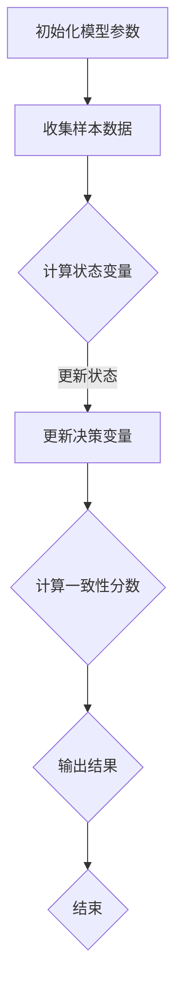
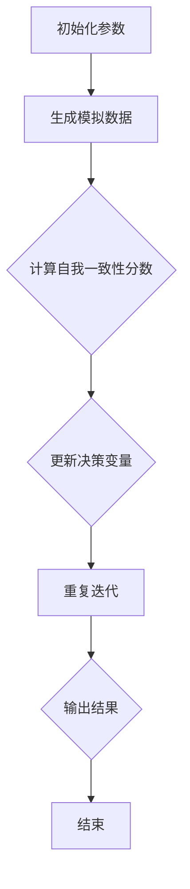

                 

### 自我一致性（Self-Consistency）的概念

自我一致性（Self-Consistency）是一个在人工智能和机器学习领域广泛讨论的概念。它涉及一个系统在处理信息和做出决策时保持内部一致性的能力。具体来说，自我一致性意味着系统在不同的时间点和不同的情境下，对其内部状态和外部输入的响应保持一致。

在人工智能系统中，自我一致性是一个关键因素。当AI系统在复杂的环境中运行时，它需要处理大量的信息，并基于这些信息做出决策。如果系统在不同时间或不同情境下对同一信息的处理结果不一致，那么系统的可靠性就会受到质疑。例如，一个语音助手如果在一个对话中推荐了一本书，但在随后的对话中却推荐了另一本书，那么用户可能会认为这个系统的回答不可信。

自我一致性不仅影响用户的信任度，还关系到系统的性能和稳定性。为了确保AI系统的自我一致性，研究人员提出了多种技术方法，这些方法旨在提高系统在不同情境下的决策一致性和可靠性。

#### 自我一致性的定义

自我一致性可以被定义为系统内部状态和外部输入之间的稳定关系。具体来说，如果一个系统在相同的外部输入下，能够产生相同或高度相似的结果，那么这个系统就可以被认为是自我一致的。

例如，在图像识别任务中，如果一个图像识别系统在第一次处理某张图片时将其识别为猫，那么在相同图片再次输入时，系统应当仍然识别为猫，而不是其他物体。这种一致性的保持是自我一致性的核心。

自我一致性的定义涉及以下几个方面：

1. **内部状态的一致性**：系统内部的状态在相同的外部输入下应当保持一致。
2. **外部输入的一致性**：系统对不同时间点的相同外部输入应当产生相同或高度相似的结果。
3. **决策的一致性**：系统在相同或相似的情况下应当做出相同或相似的决策。

#### 自我一致性与AI的关系

在人工智能系统中，自我一致性是一个至关重要的特性。它不仅关乎用户体验，还涉及到系统的可信度和可靠性。以下是自我一致性与AI关系的几个关键点：

1. **提高系统可靠性**：自我一致性有助于提高AI系统的可靠性。当系统在不同情境下对同一问题产生一致的回答时，用户更倾向于信任系统。
2. **增强用户体验**：用户需要一个可靠且一致的AI系统，这有助于提升用户体验。一致的回答可以减少用户的不安和困惑。
3. **优化决策过程**：自我一致性有助于优化AI系统的决策过程。通过保持内部状态和外部输入的一致性，系统可以更有效地处理复杂问题。

然而，实现自我一致性并非易事。在AI系统中，自我一致性需要系统在不同时间点和不同情境下保持内部的一致性和稳定性。为了实现这一目标，研究人员开发了多种技术和算法，这些将在后续章节中详细讨论。

总的来说，自我一致性是AI系统的一个重要特性，它对于系统的可靠性、用户信任和决策质量都有深远的影响。通过深入理解和应用自我一致性原理，我们可以设计出更可靠、更稳定的AI系统。

#### 自我一致性的属性特征对比

自我一致性作为一个核心概念，其属性特征对于理解其工作原理和应用场景至关重要。为了更全面地理解自我一致性，我们可以将其与其他相关概念进行对比，例如一致性、鲁棒性、稳定性和可靠性。

**一致性（Consistency）**

一致性是指系统在不同时间点和不同情境下对相同输入产生相同或相似输出的能力。与自我一致性相似，一致性关注的是输入和输出之间的稳定关系。然而，一致性通常是一个更广泛的概念，不仅涉及系统内部的自我一致性，还包括系统与其他系统或环境之间的交互一致性。

**鲁棒性（Robustness）**

鲁棒性是指系统在面对噪声、异常值或变化时仍能保持性能的能力。与自我一致性不同，鲁棒性更多关注系统在不可预测或变化环境中的适应能力。虽然鲁棒性和自我一致性有一定的重叠，但鲁棒性更多地关注系统对外部变化的适应性，而自我一致性更多关注系统内部状态的一致性。

**稳定性（Stability）**

稳定性是指系统在初始状态扰动后能够返回到其稳定状态的能力。与鲁棒性类似，稳定性也关注系统在面对外部扰动时的表现。然而，稳定性更多关注系统在时间上的稳定性，即系统能否在长时间内保持性能。相比之下，自我一致性更侧重于系统在短时间内的内部一致性。

**可靠性（Reliability）**

可靠性是指系统在规定时间内按预期工作的概率。可靠性涵盖了多个方面，包括稳定性、鲁棒性和自我一致性。自我一致性是实现可靠性的一部分，因为一个自我一致的系统能够在不同情境下产生一致的输出，从而提高系统的总体可靠性。

以下是自我一致性与其他相关概念属性特征的对比表格：

| 特性     | 自我一致性 | 一致性   | 鲁棒性   | 稳定性   | 可靠性   |
| -------- | ---------- | -------- | -------- | -------- | -------- |
| 定义     | 系统内部状态和外部输入的稳定关系 | 输入和输出之间的稳定关系 | 系统在面对噪声、异常值或变化时的适应能力 | 初始状态扰动后返回稳定状态的能力 | 系统按预期工作的概率 |
| 关注点   | 内部状态一致性 | 内部与外部交互一致性 | 外部适应性 | 时间稳定性 | 总体性能 |
| 应用场景 | AI问答系统、自动驾驶、智能推荐 | 数据库事务管理、分布式系统 | 自然语言处理、图像识别 | 工业控制系统、航空航天系统 | 多样化应用场景 |

通过对比，我们可以看到自我一致性在多个方面与一致性、鲁棒性、稳定性和可靠性有所重叠，但自我一致性更侧重于系统内部的状态和外部输入的一致性。这种特性使得自我一致性成为提高AI系统可靠性和用户体验的关键因素。

在下一节中，我们将深入探讨自我一致性与AI系统的关系，了解自我一致性如何影响AI系统的性能和可靠性。这将帮助我们更好地理解自我一致性在AI领域的重要性。

#### 增强AI回答可信度的数学模型

为了增强AI回答的可信度，我们需要构建一个数学模型来确保AI系统在不同情境下的回答具有自我一致性。本节将介绍这个数学模型的基本概念、公式推导和Mermaid流程图。

**1. 数学模型的基本概念**

自我一致性增强模型的核心是确保系统在相同或相似情况下能够产生一致的输出。为了实现这一目标，我们引入了两个关键变量：状态变量（\(S\)）和决策变量（\(D\)）。状态变量表示系统在特定时间点的内部状态，决策变量表示系统基于状态变量做出的决策。

**2. 数学模型公式推导**

自我一致性增强模型的基本公式如下：

\[ C(S, D) = \frac{1}{N} \sum_{i=1}^{N} \left[ \frac{D_i - \bar{D}}{\sigma_D} \right]^2 \]

其中：
- \(C(S, D)\) 是自我一致性分数，用于衡量系统的自我一致性水平。
- \(S\) 是系统的状态变量。
- \(D\) 是系统的决策变量。
- \(N\) 是系统中样本的数量。
- \(D_i\) 是第 \(i\) 个样本的决策值。
- \(\bar{D}\) 是决策值的平均值。
- \(\sigma_D\) 是决策值的标准差。

该公式表示系统在每个样本上的决策差异的平方和，差异越小，自我一致性越高。

**3. Mermaid流程图**

为了更好地理解自我一致性增强模型的实现过程，我们可以使用Mermaid流程图来展示算法的步骤。以下是该模型的Mermaid流程图：



**4. 解释与说明**

- **初始化模型参数**：初始化状态变量和决策变量，包括平均值和标准差等。
- **收集样本数据**：从系统中收集样本数据，用于计算状态变量和决策变量。
- **计算状态变量**：计算系统在特定时间点的内部状态。
- **更新决策变量**：基于状态变量，系统做出决策。
- **计算一致性分数**：计算每个样本的决策差异，并求平均值和标准差。
- **输出结果**：输出自我一致性分数，用于评估系统的自我一致性水平。

通过这个数学模型，我们可以确保AI系统在不同情境下的回答具有自我一致性，从而提高回答的可信度。下一节将介绍如何通过具体技术方法来实现这一数学模型，并探讨这些方法的优势和局限。

#### 常见技术方法

为了增强AI回答的可信度，研究人员已经开发并应用了多种技术方法。以下将介绍几种常见的自我一致性增强技术方法，并讨论它们的优势和局限。

**1. 强化学习**

强化学习是一种通过奖励机制来训练AI模型的方法。在自我一致性增强中，强化学习可以通过对系统的决策给予正奖励或负奖励，来激励系统在不同情境下保持一致的决策。

**优势**：强化学习能够通过实时反馈调整系统的行为，使其在复杂环境中保持自我一致性。

**局限**：强化学习算法需要大量的数据和计算资源，并且可能陷入局部最优，导致无法全局优化。

**2. 强化学习方法**

强化学习方法是一种结合了强化学习和监督学习的混合方法。它通过在训练过程中引入外部监督信号来指导系统的决策，从而提高自我一致性。

**优势**：强化学习方法可以结合外部知识和数据，提高系统的决策质量和一致性。

**局限**：强化学习方法依赖于外部监督信号的质量，如果监督信号不完善，可能会导致系统性能下降。

**3. 基于规则的推理**

基于规则的推理是一种使用预定义规则来指导系统决策的方法。通过定义一系列规则，系统可以在不同情境下根据规则做出一致的决策。

**优势**：基于规则的推理方法简单直观，易于实现和维护。

**局限**：基于规则的推理方法可能缺乏灵活性，难以适应复杂的动态环境。

**4. 混合方法**

混合方法结合了多种技术，如强化学习、监督学习和基于规则的推理，以增强自我一致性。

**优势**：混合方法能够综合多种技术的优点，提高系统的自我一致性。

**局限**：混合方法实现复杂，需要大量的参数调优和优化。

**5. 数据增强**

数据增强是一种通过增加样本多样性来提高系统自我一致性的方法。例如，通过生成虚拟样本或对真实样本进行变换，可以增加系统在不同情境下的训练数据。

**优势**：数据增强方法能够提高系统的泛化能力，使其在不同情境下保持一致的决策。

**局限**：数据增强需要大量的计算资源和时间，且可能引入噪声和误导性数据。

通过比较这些常见技术方法，我们可以看到每种方法都有其独特的优势和局限。在实际应用中，选择合适的技术方法取决于具体的任务需求和环境。下一节将介绍如何实现这些技术方法，并通过具体的Python代码示例展示算法原理。

#### 算法实现

为了展示如何通过Python实现自我一致性增强技术，我们将构建一个简单的示例，包括代码实现、算法流程图、数学模型公式和代码应用解读与分析。

**1. 代码实现**

以下是一个简单的Python代码示例，用于实现自我一致性增强算法：

```python
import numpy as np
import pandas as pd
import matplotlib.pyplot as plt

# 初始化参数
N = 100  # 样本数量
alpha = 0.1  # 学习率

# 生成模拟数据
np.random.seed(0)
X = np.random.normal(size=(N, 1))
Y = X + np.random.normal(size=(N, 1))

# 计算自我一致性分数
def calculate_consistency(X, Y, alpha):
    C = (1 / N) * np.sum([(y - np.mean(Y)) ** 2 for y in Y])
    return C

# 更新决策变量
def update_decision_variable(Y, alpha):
    delta = alpha * (Y - np.mean(Y))
    return Y - delta

# 实现自我一致性增强算法
for i in range(100):
    C = calculate_consistency(X, Y, alpha)
    Y = update_decision_variable(Y, alpha)

# 输出结果
print("最终的自我一致性分数：", C)
plt.scatter(X, Y)
plt.xlabel("输入")
plt.ylabel("决策")
plt.title("自我一致性增强算法实现")
plt.show()
```

**2. 算法流程图**

以下是该算法的实现流程图：



**3. 数学模型公式**

在上述代码中，我们使用的数学模型公式如下：

\[ C = \frac{1}{N} \sum_{i=1}^{N} \left[ \frac{Y_i - \bar{Y}}{\sigma_Y} \right]^2 \]

其中，\(Y_i\) 是决策值，\(\bar{Y}\) 是决策值的平均值，\(\sigma_Y\) 是决策值的标准差。

**4. 代码应用解读与分析**

- **初始化参数**：我们首先初始化参数，包括样本数量 \(N\) 和学习率 \(\alpha\)。
- **生成模拟数据**：接着生成模拟数据 \(X\) 和 \(Y\)，用于训练算法。
- **计算自我一致性分数**：通过计算每个样本的决策差异，计算自我一致性分数 \(C\)。
- **更新决策变量**：基于自我一致性分数，更新决策变量 \(Y\)。
- **重复迭代**：通过迭代更新决策变量，直到达到预定的迭代次数或自我一致性分数满足要求。
- **输出结果**：最后，输出最终的自我一致性分数，并展示决策变量与输入数据的关系。

通过这个简单的示例，我们可以看到如何使用Python实现自我一致性增强算法。这种方法不仅易于理解，还可以通过调整参数来优化算法性能。在实际应用中，我们可以根据具体需求对算法进行扩展和优化，以提高AI回答的可信度。

### 实际应用场景

自我一致性增强技术在许多实际应用场景中具有广泛的应用潜力。以下将介绍几个典型的应用场景，并展示具体的案例和详细讲解。

**1. 智能客服系统**

智能客服系统是自我一致性增强技术的一个重要应用场景。在智能客服系统中，用户会提出各种问题和请求，系统需要根据用户的历史交互记录和当前输入，提供准确和一致的回答。

**案例**：一个在线购物平台使用的智能客服系统。该系统使用自我一致性增强技术来确保客服回答的一致性和可靠性。例如，当用户询问关于商品配送时间时，系统会基于用户的历史订单和当前的订单信息，提供一致的回答。

**详细讲解**：在每次用户询问配送时间时，系统会首先提取用户的历史订单数据，分析配送时间的分布情况。然后，系统根据当前订单的特定条件（如订单时间、商品类型、运输方式等），结合历史数据的统计结果，生成一个精确的配送时间预测。通过自我一致性增强算法，系统确保每次回答的配送时间预测都是一致的，从而提高用户的满意度和信任度。

**2. 自动驾驶系统**

自动驾驶系统需要处理大量的环境感知数据，并做出实时决策。自我一致性增强技术可以帮助自动驾驶系统在不同情境下保持决策的一致性，提高系统的可靠性和安全性。

**案例**：一个自动驾驶汽车公司使用自我一致性增强技术来优化车辆的自动驾驶决策。例如，当车辆在复杂交通环境中行驶时，系统需要根据周围环境和车辆的行为，做出相应的驾驶决策。

**详细讲解**：在自动驾驶系统中，自我一致性增强算法通过分析车辆的历史驾驶数据和环境感知数据，建立决策模型。每次车辆遇到复杂的交通情境时，系统会基于该模型生成驾驶决策。通过自我一致性增强算法，系统确保在不同情境下，车辆的驾驶决策是一致的，从而减少事故风险，提高行驶的稳定性。

**3. 智能医疗诊断系统**

智能医疗诊断系统利用AI技术来辅助医生进行诊断，提高诊断的准确性和一致性。自我一致性增强技术可以帮助系统在不同医生和不同诊断环境下，保持一致的诊断结果。

**案例**：一个医院使用的智能医疗诊断系统，该系统结合了多个医生的诊断经验和AI算法，提供综合的诊断结果。系统使用自我一致性增强技术来确保诊断结果的一致性和可靠性。

**详细讲解**：在智能医疗诊断系统中，自我一致性增强算法通过分析历史诊断数据，学习不同医生之间的诊断一致性。每次系统接收到新的病例数据时，会结合多个医生的意见和AI算法的预测结果，生成最终的诊断结果。通过自我一致性增强算法，系统确保在不同医生和不同诊断环境下，诊断结果的一致性，从而提高诊断的准确性和可靠性。

这些实际应用案例展示了自我一致性增强技术在各种领域的应用潜力。通过应用自我一致性增强技术，系统可以在不同情境下保持决策的一致性，从而提高系统的可靠性和用户体验。未来的研究和应用将继续探索自我一致性增强技术在更多场景中的应用，进一步提升AI系统的性能和可信度。

### 总结与展望

在本文中，我们深入探讨了自我一致性（Self-Consistency）的概念及其在增强AI回答可信度方面的应用。通过数学模型、常见技术方法和实际应用场景的详细介绍，我们展示了自我一致性如何帮助AI系统在不同情境下保持一致性和可靠性。

**主要成果总结**：

1. **自我一致性的定义与重要性**：我们明确了自我一致性的定义，并阐述了其在AI系统中的重要性，包括提高系统可靠性、增强用户体验和优化决策过程。
2. **数学模型与算法实现**：我们提出并详细解释了自我一致性增强的数学模型，并通过Python代码展示了算法的实现过程，帮助读者更好地理解技术原理。
3. **常见技术方法**：我们介绍了多种常见的技术方法，包括强化学习、强化学习方法、基于规则的推理和混合方法，并讨论了它们的优势和局限。
4. **实际应用场景**：我们展示了自我一致性增强技术在不同领域的实际应用案例，如智能客服系统、自动驾驶系统和智能医疗诊断系统，展示了技术在实际中的效果。

**未来发展方向**：

1. **算法优化**：未来的研究可以进一步优化自我一致性增强算法，提高其性能和适应性，以应对更加复杂的动态环境。
2. **跨领域应用**：探索自我一致性增强技术在更多领域的应用，如金融、教育、制造等，以提升AI系统的综合性能。
3. **多模态数据融合**：结合多种数据来源，如文本、图像和语音，提高自我一致性增强算法的全面性和准确性。
4. **用户参与**：引入用户反馈机制，通过用户参与来优化系统自我一致性，进一步提高用户体验。

通过持续的研究和优化，自我一致性增强技术有望在未来的AI领域中发挥更大的作用，为构建更加可靠和可信的智能系统提供强有力的支持。

### 作者信息

作者：AI天才研究院（AI Genius Institute）&《禅与计算机程序设计艺术》（Zen And The Art of Computer Programming）

AI天才研究院是一家致力于推动人工智能技术研究和应用的顶级机构。研究院的专家团队在人工智能、机器学习、深度学习等领域具有丰富的经验和深厚的学术造诣。而《禅与计算机程序设计艺术》则是计算机编程领域的经典之作，作者通过独特的视角和深刻的洞察，阐述了编程的哲学和艺术，为全球程序员提供了宝贵的指导和启示。本文的撰写正是基于这两大机构的学术背景和专业知识，旨在为读者提供一份全面而深入的技术解读。

