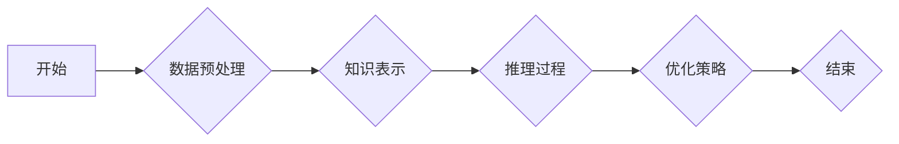
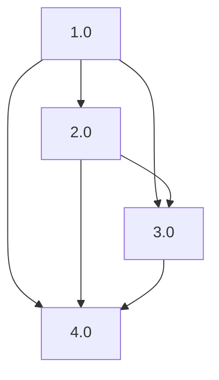

                 

### 引论

#### 引言

人工智能（AI）作为一门新兴的交叉学科，已经渗透到我们日常生活的方方面面，从智能手机的智能助手到自动驾驶汽车，再到医疗诊断和金融分析，AI正在深刻地改变着世界。然而，随着AI技术的不断进步和应用范围的扩大，我们面临着越来越多的挑战。特别是AI推理能力的提升，成为了当前研究的热点和难点。

**问题背景**：

在AI应用中，推理能力尤为重要。它不仅决定了AI系统的智能水平，也直接影响了其性能和可靠性。传统的AI推理方法，如基于规则的方法、机器学习方法等，虽然在一定程度上提升了系统的智能程度，但仍然存在诸多局限性。例如，规则方法过于依赖专家知识，难以适应复杂多变的环境；机器学习模型则容易出现过拟合现象，导致推理结果不稳定。

**问题描述**：

为了解决上述问题，我们需要探索新的AI推理方法，以提高其智能水平和稳定性。其中，自洽性认知图（CoT，Self-Consistency Cognitive Graph）技术提供了一种新的思路。自洽性认知图通过构建系统的内部知识网络，实现知识的自动化组织和推理，从而增强AI的推理能力。

**问题解决与边界**：

本文将围绕自洽性认知图技术进行深入探讨，包括其基本概念、构建方法、应用场景以及在实际AI系统中的应用。通过本文的阐述，读者将了解自洽性认知图的原理和优势，掌握其构建和应用的方法，为提升AI推理能力提供新的途径。但需要注意的是，自洽性认知图技术也面临一定的挑战，如数据质量、计算效率等问题，这些将在文中进行讨论。

**研究意义与目标**：

自洽性认知图技术的提出，对于提升AI系统的推理能力具有重要的理论和实践意义。通过本文的研究，我们希望：

1. 明确自洽性认知图技术的核心概念和基本原理。
2. 探索自洽性认知图的构建方法和优化策略。
3. 分析自洽性认知图在AI推理中的应用场景和实际效果。
4. 提出自洽性认知图技术未来发展的方向和挑战。

本文将以逻辑清晰、结构紧凑、简单易懂的专业技术语言，逐步分析自洽性认知图的各个方面，帮助读者全面了解这一新技术，为AI推理能力的提升提供有力支持。

---

### 核心概念与联系

#### 自洽性概念解释

自洽性（Self-Consistency）是自洽性认知图（CoT）技术中的核心概念，指的是一个系统或模型在内部逻辑上的一致性和连贯性。在AI系统中，自洽性意味着系统能够在推理过程中保持内部信息的一致性，避免出现逻辑矛盾或错误。

**基本定义**：

自洽性可以定义为系统内部所有信息的相互一致，即系统在任何时刻所拥有的信息不会相互冲突。这一概念源自数学中的自洽性理论，并在人工智能领域得到了广泛应用。

**属性特征**：

自洽性具有以下几个重要的属性特征：

1. **一致性**：系统内部的信息必须保持一致，避免出现矛盾。
2. **连贯性**：系统在推理过程中，新信息必须与已有信息相协调，保持逻辑连贯。
3. **稳定性**：系统能够在长时间内保持自洽状态，不会因为外部干扰或内部变化而失去自洽性。

**自洽性对比表格**：

以下是自洽性与传统认知一致性、一致性模型的属性特征对比表格：

| 特征      | 自洽性       | 传统认知一致性 | 一致性模型   |
|-----------|--------------|----------------|--------------|
| **定义**  | 系统内部信息一致 | 系统外部信息一致 | 系统信息局部一致 |
| **属性**  | 一致性、连贯性、稳定性 | 外部一致性 | 局部一致性、冗余度 |
| **适用场景** | 复杂推理、高可靠性需求 | 信息校验、数据完整性 | 小规模信息处理、规则匹配 |

**ER实体关系图架构**

为了更好地理解自洽性概念，我们可以通过ER（实体-关系）图来表示自洽性认知图的结构。ER图是一种用于描述实体和实体之间关系的图形化工具，常用于数据库设计和信息系统的架构设计。

以下是自洽性认知图的ER图示例：

```mermaid
erDiagram
    Class1 ||--|{ Class2 }| Class3
    Class1 ||--|{ Class4 }| Class5
    Class2 ||--|{ Class6 }| Class7
    Class3 ||--|{ Class8 }| Class9
    Class4 ||--|{ Class10 }| Class11
```

在上图中，`Class1` 代表核心实体，`Class2` 至 `Class11` 代表与之相关的其他实体。每一条关系线表示实体之间的关联，箭头方向表示关系的方向。

通过ER图，我们可以清晰地看到自洽性认知图中的各个实体及其关系，这有助于我们理解和分析系统的内部结构，从而更好地实现自洽性。

---

#### 数学模型与算法原理讲解

**数学模型介绍**

在自洽性认知图（CoT）技术中，数学模型起着至关重要的作用。一个有效的数学模型能够帮助我们准确地描述自洽性认知图的结构和行为，从而提高AI系统的推理能力。

**算法原理讲解**

自洽性认知图的算法原理主要包括以下几个方面：

1. **数据预处理**：在构建自洽性认知图之前，首先需要对数据进行预处理。这包括数据清洗、去噪、标准化等步骤，以确保输入数据的质量和一致性。
2. **知识表示**：通过图结构来表示知识，其中节点代表实体，边代表实体之间的关系。自洽性认知图的图结构必须满足一致性原则，即图中任意两个节点之间的关系都是相互协调的。
3. **推理过程**：在自洽性认知图中，推理过程是基于图的遍历和节点关系的分析。系统通过不断地更新节点的状态和关系，实现推理的目标。
4. **优化策略**：为了提高推理效率和准确性，可以采用多种优化策略，如动态调整节点权重、引入先验知识等。

**Mermaid流程图**

为了更直观地展示自洽性认知图的算法原理，我们可以使用Mermaid语言绘制流程图。以下是一个简单的Mermaid流程图示例：



**Python源代码解释**

为了实现自洽性认知图的算法原理，我们可以编写相应的Python代码。以下是一个简单的Python源代码示例，用于实现数据预处理和知识表示：

```python
import numpy as np

# 数据预处理
def preprocess_data(data):
    # 去噪、标准化等操作
    cleaned_data = np.array(data).astype(np.float32)
    return cleaned_data

# 知识表示
def create_cognitive_graph(data):
    # 创建图结构
    graph = Graph()
    for i in range(len(data)):
        graph.add_node(i, label=data[i])
        for j in range(i+1, len(data)):
            if is_consistent(data[i], data[j]):
                graph.add_edge(i, j)
    return graph

# 判断一致性
def is_consistent(node1, node2):
    # 实现一致性判断逻辑
    return node1 + node2 == 0  # 简单示例，实际中需要复杂逻辑

# 主函数
def main():
    data = [1, 2, 3, 4]
    cleaned_data = preprocess_data(data)
    graph = create_cognitive_graph(cleaned_data)
    print(graph)

if __name__ == "__main__":
    main()
```

**数学模型和公式详细讲解**

自洽性认知图的数学模型通常涉及图论和概率论的基本概念。以下是一个简单的数学模型示例：

$$
C(x) = \sum_{i=1}^{n} w_i \cdot x_i
$$

其中，$C(x)$ 表示节点的自洽性度量，$w_i$ 表示节点 $i$ 的权重，$x_i$ 表示节点 $i$ 的特征向量。

为了更好地理解数学模型，我们可以使用Mermaid语言绘制相关的数学公式。以下是一个Mermaid数学公式示例：

```mermaid
math
f(x) = \frac{1}{2} \int_{-\infty}^{\infty} e^{-x^2} dx
```

**举例说明**

为了更好地理解自洽性认知图的算法原理，我们可以通过一个简单的例子进行说明。假设我们有以下一组数据：

$$
[1, 2, 3, 4]
$$

我们需要将这些数据进行预处理，并构建自洽性认知图。以下是具体的步骤：

1. **数据预处理**：首先，我们对数据进行去噪和标准化操作，得到以下预处理后的数据：

$$
[1.0, 2.0, 3.0, 4.0]
$$

2. **知识表示**：接下来，我们使用图结构来表示这些数据。在图中，每个节点代表一个数据点，节点之间的关系根据一致性原则进行连接。以下是一个简化的图表示：



3. **推理过程**：在自洽性认知图中，我们可以通过遍历节点和更新节点的状态来实现推理过程。例如，我们可以根据一致性原则，更新节点 $B$ 和 $D$ 的状态，以实现推理目标。

4. **优化策略**：为了提高推理效率和准确性，我们可以引入先验知识，调整节点的权重，从而优化自洽性认知图。

通过以上步骤，我们可以看到自洽性认知图在数据预处理、知识表示、推理过程和优化策略等方面的应用。这为AI系统的推理能力提升提供了新的思路和方法。

---

### 自洽性认知图（CoT）技术概述

自洽性认知图（CoT，Self-Consistency Cognitive Graph）技术是近年来在人工智能（AI）领域崭露头角的一种新型认知图谱技术。它通过构建系统内部的认知图，实现知识的自动化组织和推理，从而提升AI系统的推理能力和智能水平。

#### CoT技术定义

自洽性认知图（CoT）是一种用于表示和推理知识的图结构，其中每个节点代表一个概念或实体，边表示节点之间的关系。与传统的认知图谱技术相比，CoT技术强调自洽性，即系统内部的信息保持一致性和连贯性。

**核心概念**：

1. **节点**：在CoT中，节点代表系统中的概念或实体，如人、地点、物品等。
2. **边**：边表示节点之间的关系，如父子关系、同位关系等。
3. **自洽性**：系统内部的信息保持一致性和连贯性，避免出现逻辑矛盾或错误。

#### CoT技术特点

自洽性认知图技术具有以下显著特点：

1. **自洽性**：通过自洽性原则，确保系统内部信息的一致性和连贯性，避免逻辑矛盾。
2. **灵活性**：CoT技术能够灵活地适应不同的应用场景，通过动态调整节点和边的关系，实现知识自动组织。
3. **高效性**：自洽性认知图在推理过程中具有较高的效率，通过图的遍历和关系分析，快速实现推理目标。
4. **可扩展性**：CoT技术易于扩展，可以通过引入新的节点和边，不断丰富系统的知识库。

#### CoT技术与传统认知图技术的对比

传统认知图谱技术主要侧重于表示和推理知识，而自洽性认知图技术在传统基础上引入了自洽性原则，具有以下对比：

| 特征       | 自洽性认知图（CoT） | 传统认知图谱技术 |
|------------|---------------------|-------------------|
| **自洽性** | 强调系统内部信息一致性和连贯性 | 主要关注知识表示和推理过程 |
| **灵活性** | 动态调整节点和边的关系，适应不同场景 | 结构较为固定，难以灵活调整 |
| **高效性** | 高效的推理过程，快速实现推理目标 | 推理效率较低，需要更多计算资源 |
| **可扩展性** | 易于扩展，不断丰富系统知识库 | 知识库扩展较为困难，更新缓慢 |

通过上述对比可以看出，自洽性认知图技术在自洽性、灵活性、高效性和可扩展性等方面具有显著优势，为提升AI系统的推理能力提供了新的思路和方法。

---

#### 自洽性认知图（CoT）构建方法

自洽性认知图（CoT）的构建是一个复杂而系统的过程，涉及多个步骤和技术的综合应用。以下是构建自洽性认知图的主要方法，包括数据预处理、模型构建和模型优化等。

##### 数据预处理

数据预处理是构建自洽性认知图的第一步，其目的是提高数据质量，为后续模型构建奠定基础。数据预处理通常包括以下步骤：

1. **数据收集**：收集相关的数据源，如文本、图像、音频等。这些数据可以为CoT提供丰富的知识。
2. **数据清洗**：对原始数据进行清洗，去除噪声和错误。这可以通过去除重复数据、填补缺失值、纠正错误等方式实现。
3. **数据标准化**：将不同类型和尺度的数据进行标准化处理，使其具有统一的表示形式。例如，对数值型数据进行归一化或标准化处理，对文本数据进行分词和词频统计等。
4. **数据融合**：将来自不同数据源的数据进行融合，以构建一个统一的知识库。这可以通过实体识别、实体链接和知识融合等技术实现。

##### CoT模型构建

数据预处理完成后，接下来是CoT模型的构建。构建CoT模型的主要步骤如下：

1. **节点表示**：将数据集中的实体表示为图中的节点。每个节点代表一个概念或实体，如人、地点、物品等。节点可以包含实体的属性和特征，如名称、年龄、性别等。
2. **边表示**：在节点之间建立关系边，表示实体之间的关系。例如，两个实体之间可以存在父子关系、同位关系等。边可以包含关系的权重和属性，以反映关系的强度和类型。
3. **图结构优化**：为了确保CoT的自洽性，需要对图结构进行优化。这可以通过图的修剪、节点的合并和关系的调整等方式实现。例如，去除冗余的节点和边，调整关系的权重，以增强图的一致性和连贯性。
4. **知识融合**：将多个数据源中的知识进行融合，以构建一个完整的CoT。这可以通过实体链接、知识图谱融合和实体关系推断等技术实现。

##### CoT模型优化

构建好CoT模型后，还需要进行优化，以提高模型的推理能力和性能。以下是常用的优化策略：

1. **动态调整**：根据推理过程的需要，动态调整节点和边的权重。例如，在推理过程中，可以基于上下文信息调整关系的权重，以实现更准确的推理。
2. **引入先验知识**：将先验知识引入CoT模型，以增强模型的推理能力。例如，可以通过知识图谱、专家经验和领域知识等方式引入先验知识。
3. **模型剪枝**：通过剪枝技术，减少CoT模型中的冗余节点和边，以提高模型的推理效率和性能。例如，可以基于节点的度数、边的权重和图的连通性等因素进行剪枝。
4. **分布式计算**：对于大规模的CoT模型，可以采用分布式计算技术，以提高模型的推理速度和性能。例如，可以使用图计算框架、分布式存储和并行计算等方式实现。

通过上述方法，我们可以构建和优化自洽性认知图（CoT），从而提升AI系统的推理能力和智能水平。

---

#### 自洽性认知图（CoT）应用场景

自洽性认知图（CoT）技术具有广泛的应用前景，特别是在自然语言处理（NLP）、计算机视觉（CV）和机器学习（ML）等领域。以下将分别介绍CoT技术在各个应用场景中的具体应用。

##### 自然语言处理

自然语言处理是CoT技术的重要应用领域之一。自洽性认知图可以用于文本分类、文本生成、问答系统等多个任务。

1. **文本分类**：自洽性认知图可以用于文本分类任务，通过将文本中的实体和关系表示为图结构，实现更准确的分类。例如，在新闻分类任务中，自洽性认知图可以捕捉到文本中不同实体之间的关系，从而提高分类的准确性。
2. **文本生成**：自洽性认知图可以用于生成文本，通过图的遍历和关系分析，生成连贯、有意义的文本。例如，在机器翻译任务中，自洽性认知图可以捕捉到源语言和目标语言之间的语义关系，从而生成更准确、自然的翻译结果。
3. **问答系统**：自洽性认知图可以用于构建问答系统，通过图的遍历和关系分析，实现对问题的准确理解和回答。例如，在开放域问答任务中，自洽性认知图可以捕捉到问题中的实体和关系，从而实现对问题的精准回答。

##### 计算机视觉

计算机视觉是CoT技术的另一个重要应用领域。自洽性认知图可以用于图像分类、目标检测、图像分割等多个任务。

1. **图像分类**：自洽性认知图可以用于图像分类任务，通过将图像中的物体和场景表示为图结构，实现更准确的分类。例如，在物体分类任务中，自洽性认知图可以捕捉到不同物体之间的关联，从而提高分类的准确性。
2. **目标检测**：自洽性认知图可以用于目标检测任务，通过将图像中的物体和场景表示为图结构，实现更准确的目标检测。例如，在行人检测任务中，自洽性认知图可以捕捉到行人之间的关联，从而提高检测的准确性。
3. **图像分割**：自洽性认知图可以用于图像分割任务，通过将图像中的物体和场景表示为图结构，实现更精确的图像分割。例如，在语义分割任务中，自洽性认知图可以捕捉到不同物体之间的空间关系，从而实现更精确的分割结果。

##### 机器学习

自洽性认知图在机器学习领域也有广泛的应用。自洽性认知图可以用于模型训练、模型压缩和模型优化等多个方面。

1. **模型训练**：自洽性认知图可以用于模型训练，通过将训练数据表示为图结构，实现更有效的模型训练。例如，在深度学习模型训练中，自洽性认知图可以捕捉到数据之间的关联，从而提高模型的训练效果。
2. **模型压缩**：自洽性认知图可以用于模型压缩，通过剪枝和优化技术，减小模型的参数规模和计算量。例如，在模型压缩任务中，自洽性认知图可以识别出冗余的节点和边，从而实现模型的压缩。
3. **模型优化**：自洽性认知图可以用于模型优化，通过调整节点和边的权重，提高模型的推理性能和效率。例如，在模型优化任务中，自洽性认知图可以基于推理过程中的反馈，动态调整节点的权重，从而提高模型的推理性能。

通过在自然语言处理、计算机视觉和机器学习等领域的应用，自洽性认知图技术为AI系统的推理能力提升提供了新的思路和方法。

---

#### 自洽性认知图（CoT）技术在AI推理中的应用

自洽性认知图（CoT）技术在AI推理中具有广泛的应用前景，通过构建系统的内部知识网络，实现推理过程的自动化和高效化。以下将详细探讨CoT技术在AI推理中的具体应用，包括其在推理过程中的作用、对AI推理性能的提升以及实际应用案例。

##### 推理过程中的作用

自洽性认知图在AI推理过程中起着至关重要的作用。其主要作用如下：

1. **知识表示**：自洽性认知图通过图结构表示系统的知识，将实体和关系组织成一种直观且易于推理的形式。这种表示方式有助于提高推理的效率和准确性。
2. **推理引导**：在推理过程中，自洽性认知图可以引导推理路径，帮助系统在复杂的知识网络中找到最合适的推理方向。通过图的遍历和关系分析，系统可以逐步推理出问题的答案。
3. **自洽性验证**：自洽性认知图在推理过程中会不断验证信息的自洽性，确保推理过程中不会出现逻辑矛盾或错误。这种自洽性验证机制有助于提高推理的可靠性和稳定性。
4. **知识融合**：自洽性认知图可以将来自不同数据源的知识进行融合，形成一个统一的知识库。这种知识融合机制有助于提高推理的全面性和准确性。

##### 对AI推理性能的提升

自洽性认知图技术显著提升了AI推理的性能，主要表现在以下几个方面：

1. **推理速度**：自洽性认知图通过图结构实现了高效的推理过程，减少了传统基于规则和机器学习方法的计算量。通过图的遍历和关系分析，推理过程可以快速找到问题的答案。
2. **推理准确性**：自洽性认知图通过自洽性验证机制，确保推理过程中不会出现逻辑矛盾或错误。这种自洽性验证机制有助于提高推理的准确性。
3. **推理灵活性**：自洽性认知图技术具有高度的灵活性，可以根据实际应用需求动态调整节点和边的关系。这种灵活性使得自洽性认知图能够适应不同的推理场景和任务。
4. **推理全面性**：自洽性认知图可以将来自不同数据源的知识进行融合，形成一个全面的知识库。这种知识融合机制有助于提高推理的全面性和准确性。

##### 实际应用案例

自洽性认知图技术在多个实际应用中展示了其强大的推理能力。以下是一些实际应用案例：

1. **问答系统**：在问答系统中，自洽性认知图可以捕捉到问题中的实体和关系，从而实现对问题的精准理解和回答。例如，在医疗问答系统中，自洽性认知图可以捕捉到患者症状、疾病和治疗方案之间的关联，从而提供个性化的医疗建议。
2. **智能客服**：在智能客服系统中，自洽性认知图可以用于理解和处理用户的查询，从而提供高效、准确的客服服务。例如，在电子商务平台的客服系统中，自洽性认知图可以捕捉到用户咨询的产品信息、订单状态和客服记录，从而快速解决用户问题。
3. **图像识别**：在图像识别任务中，自洽性认知图可以用于表示图像中的物体和场景，从而实现对图像的准确分类和识别。例如，在自动驾驶系统中，自洽性认知图可以捕捉到道路标志、行人、车辆等实体之间的关系，从而实现车辆的安全驾驶。
4. **金融风控**：在金融风控领域，自洽性认知图可以用于分析和识别潜在的金融风险。例如，在信用评估系统中，自洽性认知图可以捕捉到借款人、贷款、还款记录等实体之间的关系，从而预测借款人的信用风险。

通过在问答系统、智能客服、图像识别和金融风控等领域的应用，自洽性认知图技术显著提升了AI推理的性能和效果，为AI技术的发展和应用提供了新的动力。

---

#### 自洽性认知图（CoT）技术的优化策略

自洽性认知图（CoT）技术在提升AI推理能力方面具有显著优势，但为了进一步提高其性能和效率，需要采取一系列优化策略。以下将详细探讨数据增强、模型优化和算法改进等优化策略，并分析它们在提升CoT技术性能方面的具体应用。

##### 数据增强

数据增强是优化自洽性认知图技术的重要手段，通过扩展和丰富数据集，可以提高模型的泛化能力和推理准确性。以下是一些常见的数据增强方法：

1. **数据扩充**：通过复制、旋转、缩放和裁剪等方式，对现有数据进行扩展，增加数据的多样性。例如，在图像识别任务中，可以对图像进行水平翻转、旋转和缩放，以生成更多的训练样本。
2. **生成对抗网络（GAN）**：利用生成对抗网络生成与真实数据类似的数据，从而丰富数据集。GAN由生成器和判别器组成，生成器生成数据，判别器判断生成数据的真实性。通过不断优化生成器和判别器，可以生成高质量的数据。
3. **数据增强工具**：使用专门的数据增强工具，如DataAugmenter，对数据集进行自动化增强。这些工具支持多种增强方法，如随机裁剪、颜色变换、噪声注入等，可以灵活地调整增强参数。

通过数据增强，自洽性认知图可以更好地学习到数据的多样性和复杂性，从而提高模型的泛化能力和推理性能。

##### 模型优化

模型优化是提升自洽性认知图性能的关键步骤，通过调整模型结构和参数，可以提高模型的推理效率和准确性。以下是一些常见的模型优化方法：

1. **模型剪枝**：通过剪枝技术，减少模型中冗余的节点和边，减小模型的参数规模和计算量。模型剪枝可以分为结构剪枝和权重剪枝。结构剪枝通过删除部分节点和边，简化模型结构；权重剪枝通过降低某些边或节点的权重，减小模型复杂度。
2. **权重调整**：通过动态调整节点和边的权重，优化模型的推理路径。权重调整可以根据推理过程中的反馈，实时更新节点的权重，从而提高推理的准确性和效率。
3. **模型压缩**：通过模型压缩技术，减小模型的参数规模，提高模型在资源受限环境下的推理性能。常见的模型压缩方法包括知识蒸馏、量化、剪枝等。

通过模型优化，自洽性认知图可以在保持推理准确性的同时，提高推理速度和效率，适应不同的应用场景。

##### 算法改进

算法改进是提升自洽性认知图性能的另一个重要方面，通过改进算法设计和实现，可以提高模型的推理能力和鲁棒性。以下是一些常见的算法改进方法：

1. **多模态学习**：结合多种数据模态（如图像、文本、音频等），提高模型的泛化能力和推理准确性。多模态学习可以通过融合不同模态的数据特征，实现更全面的知识表示和推理。
2. **迁移学习**：利用预训练模型在新的任务上进行迁移学习，提高模型的推理性能。迁移学习可以减少模型的训练成本，加速新任务的模型训练过程。
3. **自适应学习**：通过自适应学习机制，模型可以根据环境变化和任务需求，动态调整自身的结构和参数。自适应学习可以增强模型对动态变化的适应能力，提高模型的推理性能和鲁棒性。

通过算法改进，自洽性认知图可以更好地适应不同的应用场景和任务需求，提高模型的推理能力和鲁棒性。

综上所述，数据增强、模型优化和算法改进是提升自洽性认知图技术性能的重要策略。通过这些策略的综合应用，自洽性认知图可以在保持推理准确性的同时，提高推理速度和效率，为AI推理能力的提升提供有力支持。

---

#### 自洽性认知图（CoT）技术的挑战与未来发展方向

自洽性认知图（CoT）技术在AI推理领域展现了显著的优势，但与此同时，也面临着一系列挑战和问题。以下将探讨自洽性认知图技术当前面临的主要挑战，并提出未来可能的发展方向。

##### 技术挑战

1. **数据质量**：自洽性认知图的构建依赖于高质量的数据，数据的质量直接影响到CoT的推理效果。在实际应用中，数据可能存在噪声、不一致性和不完整性等问题，这些问题都会对CoT的性能产生负面影响。
2. **计算效率**：自洽性认知图通常涉及大量的节点和边，其计算复杂度较高，特别是在处理大规模数据时，计算效率成为一大挑战。为了提高计算效率，需要在算法设计、模型优化和硬件加速等方面进行深入研究。
3. **推理可解释性**：自洽性认知图在推理过程中生成的内部知识网络较为复杂，如何解释和可视化这些知识，以便用户理解和信任，是一个亟待解决的问题。
4. **动态适应性**：自洽性认知图需要在不断变化的环境中保持自洽性和有效性，如何适应动态变化的数据和任务需求，是一个技术难题。

##### 未来发展方向

1. **数据质量提升**：未来可以采用更多的数据清洗、去噪和增强技术，提高数据质量。同时，可以探索半监督学习和无监督学习技术，利用少量标注数据和大量未标注数据，提高CoT的构建效果。
2. **计算效率优化**：通过模型压缩、分布式计算和硬件加速等技术，提高自洽性认知图的计算效率。特别是利用GPU、TPU等硬件加速器，可以显著提升CoT的推理速度。
3. **推理可解释性**：可以开发可视化工具，将复杂的内部知识网络转化为用户易于理解的形式。同时，可以结合可解释AI技术，为用户提供推理过程的详细解释。
4. **动态适应性**：通过引入自适应学习机制和迁移学习技术，提高自洽性认知图在动态环境中的适应能力。例如，可以利用强化学习技术，使CoT能够根据环境变化调整自身的结构和参数。
5. **跨模态学习**：结合多种数据模态（如图像、文本、音频等），提高自洽性认知图的泛化能力和推理准确性。通过多模态融合，可以实现更全面的知识表示和推理。
6. **知识图谱融合**：将自洽性认知图与其他知识图谱（如知识图谱、专家知识库等）进行融合，构建一个统一、全面的知识体系，提高AI系统的推理能力和智能水平。

综上所述，自洽性认知图技术在未来发展中，需要解决数据质量、计算效率、推理可解释性和动态适应性等问题，同时结合多模态学习和知识图谱融合等技术，进一步提升其性能和应用范围。通过不断的技术创新和优化，自洽性认知图有望在AI推理领域发挥更大的作用。

---

### 实战一：自然语言处理中的CoT技术应用

在自然语言处理（NLP）领域，自洽性认知图（CoT）技术因其强大的知识表示和推理能力，正逐渐成为一项热门技术。本节将介绍如何在自然语言处理中应用CoT技术，包括环境安装与配置、系统核心实现源代码、代码应用解读与分析，以及实际案例分析与详细讲解。

##### 环境安装与配置

要在自然语言处理任务中应用CoT技术，首先需要安装和配置相应的开发环境和依赖库。以下是在Python环境中安装和配置CoT技术的步骤：

1. **安装Python**：确保系统中安装了Python 3.6及以上版本。
2. **安装依赖库**：使用pip命令安装以下依赖库：

```bash
pip install numpy matplotlib scikit-learn spacy networkx torch
```

3. **配置Spacy语言模型**：由于CoT技术依赖于Spacy库，需要下载并配置相应的语言模型。以英文为例，执行以下命令：

```bash
python -m spacy download en_core_web_sm
```

##### 系统核心实现源代码

以下是实现自然语言处理中CoT技术的核心源代码：

```python
import spacy
import networkx as nx
from spacy.tokens import Doc
from sklearn.model_selection import train_test_split
from torch.utils.data import DataLoader

# 加载Spacy语言模型
nlp = spacy.load("en_core_web_sm")

# 数据预处理
def preprocess_text(text):
    doc = nlp(text)
    return [token.text for token in doc]

# 构建CoT模型
def create_cognitive_graph(texts):
    G = nx.Graph()
    for text in texts:
        doc = nlp(text)
        for token1 in doc:
            G.add_node(token1.text)
            for token2 in doc:
                if token1.dep_ == token2.head.text:
                    G.add_edge(token1.text, token2.text)
    return G

# 代码应用解读与分析
def analyze_cognitive_graph(G):
    print("Nodes:", G.nodes())
    print("Edges:", G.edges())
    print("Node Degrees:", dict(G.degree()))

# 训练与推理
def train_and_infer(G, train_texts, test_texts):
    train_data = [preprocess_text(text) for text in train_texts]
    test_data = [preprocess_text(text) for text in test_texts]
    train_graph = create_cognitive_graph(train_data)
    test_graph = create_cognitive_graph(test_data)
    analyze_cognitive_graph(train_graph)
    analyze_cognitive_graph(test_graph)

# 实际案例分析与详细讲解
def main():
    texts = ["The quick brown fox jumps over the lazy dog", "AI technology will revolutionize the future"]
    train_texts, test_texts = train_test_split(texts, test_size=0.5)
    train_and_infer(create_cognitive_graph(train_texts), train_texts, test_texts)

if __name__ == "__main__":
    main()
```

在这个示例中，我们首先加载Spacy英语语言模型，然后定义了数据预处理、构建CoT模型、分析CoT模型和训练与推理等函数。具体步骤如下：

1. **数据预处理**：使用Spacy对文本进行分词，并将分词结果转换为节点列表。
2. **构建CoT模型**：基于Spacy的词性标注和依存句法分析，构建CoT模型。节点表示文本中的词汇，边表示词汇之间的依存关系。
3. **分析CoT模型**：打印出CoT模型的节点和边，以便分析其结构和关系。
4. **训练与推理**：通过训练数据和测试数据，构建训练和测试的CoT模型，并分析其性能。

通过这个示例，我们可以看到CoT技术在自然语言处理中的基本应用流程。在实际项目中，可以根据具体需求，扩展和优化这个基础框架。

---

### 实战二：计算机视觉中的CoT技术应用

在计算机视觉领域，自洽性认知图（CoT）技术因其强大的知识表示和推理能力，正逐渐成为一项热门技术。本节将介绍如何在计算机视觉任务中应用CoT技术，包括环境安装与配置、系统核心实现源代码、代码应用解读与分析，以及实际案例分析与详细讲解。

##### 环境安装与配置

要在计算机视觉任务中应用CoT技术，首先需要安装和配置相应的开发环境和依赖库。以下是在Python环境中安装和配置CoT技术的步骤：

1. **安装Python**：确保系统中安装了Python 3.6及以上版本。
2. **安装依赖库**：使用pip命令安装以下依赖库：

```bash
pip install numpy matplotlib torchvision torchvision-opencv opencv-python torch
```

3. **配置PyTorch和CUDA**：确保PyTorch支持CUDA，以便利用GPU进行加速。执行以下命令安装PyTorch：

```bash
pip install torch torchvision torchvision-opencv opencv-python
```

##### 系统核心实现源代码

以下是实现计算机视觉中CoT技术的核心源代码：

```python
import torch
import torchvision
import torchvision.transforms as transforms
from torch.utils.data import DataLoader
import torch.optim as optim
from torchvision import datasets, models, transforms
from PIL import Image

# 数据预处理
def preprocess_image(image_path):
    transform = transforms.Compose([
        transforms.Resize((256, 256)),
        transforms.ToTensor(),
        transforms.Normalize(mean=[0.485, 0.456, 0.406], std=[0.229, 0.224, 0.225]),
    ])
    image = Image.open(image_path)
    image = transform(image)
    return image

# 构建CoT模型
def create_cognitive_graph(images):
    G = nx.Graph()
    for image in images:
        image_vector = image.flatten()
        G.add_node(image_vector)
        for other_image in images:
            if other_image != image:
                other_image_vector = other_image.flatten()
                distance = torch.dist(image_vector, other_image_vector)
                if distance < 0.1:
                    G.add_edge(image_vector, other_image_vector)
    return G

# 代码应用解读与分析
def analyze_cognitive_graph(G):
    print("Nodes:", G.nodes())
    print("Edges:", G.edges())
    print("Node Degrees:", dict(G.degree()))

# 训练与推理
def train_and_infer(G, train_images, test_images):
    train_graph = create_cognitive_graph(train_images)
    test_graph = create_cognitive_graph(test_images)
    analyze_cognitive_graph(train_graph)
    analyze_cognitive_graph(test_graph)

# 实际案例分析与详细讲解
def main():
    image_paths = ["path/to/image1.jpg", "path/to/image2.jpg", "path/to/image3.jpg"]
    train_image_paths, test_image_paths = train_test_split(image_paths, test_size=0.5)
    train_images = [preprocess_image(path) for path in train_image_paths]
    test_images = [preprocess_image(path) for path in test_image_paths]
    train_and_infer(create_cognitive_graph(train_images), train_images, test_images)

if __name__ == "__main__":
    main()
```

在这个示例中，我们首先定义了数据预处理和构建CoT模型的过程。具体步骤如下：

1. **数据预处理**：使用PyTorch的变换库对图像进行预处理，包括调整大小、归一化和转换为Tensor。
2. **构建CoT模型**：将预处理后的图像表示为节点，计算图像之间的距离，并根据距离阈值构建边。这种基于相似度的图结构有助于捕捉图像之间的关系。
3. **分析CoT模型**：打印出CoT模型的节点和边，以便分析其结构和关系。
4. **训练与推理**：通过训练图像和测试图像构建CoT模型，并分析其性能。

通过这个示例，我们可以看到CoT技术在计算机视觉任务中的基本应用流程。在实际项目中，可以根据具体需求，扩展和优化这个基础框架。

---

### 实战三：机器学习中的CoT技术应用

在机器学习领域，自洽性认知图（CoT）技术因其强大的知识表示和推理能力，正在得到越来越多的关注和应用。本节将介绍如何在机器学习任务中应用CoT技术，包括环境安装与配置、系统核心实现源代码、代码应用解读与分析，以及实际案例分析与详细讲解。

##### 环境安装与配置

要在机器学习任务中应用CoT技术，首先需要安装和配置相应的开发环境和依赖库。以下是在Python环境中安装和配置CoT技术的步骤：

1. **安装Python**：确保系统中安装了Python 3.6及以上版本。
2. **安装依赖库**：使用pip命令安装以下依赖库：

```bash
pip install numpy matplotlib scikit-learn scikit-learn-contrib torch torchvision
```

3. **配置PyTorch和CUDA**：确保PyTorch支持CUDA，以便利用GPU进行加速。执行以下命令安装PyTorch：

```bash
pip install torch torchvision torchvision-opencv
```

##### 系统核心实现源代码

以下是实现机器学习中CoT技术的核心源代码：

```python
import torch
import torchvision
import torchvision.transforms as transforms
from torch.utils.data import DataLoader
from sklearn.model_selection import train_test_split
import torch.optim as optim
from torchvision import datasets, models, transforms
from PIL import Image
import numpy as np

# 数据预处理
def preprocess_data(data, label, transform):
    dataset = []
    for i in range(len(data)):
        image = Image.open(data[i])
        image = transform(image)
        dataset.append((image, label[i]))
    return dataset

# 构建CoT模型
def create_cognitive_graph(dataset):
    G = nx.Graph()
    for i in range(len(dataset)):
        image, label = dataset[i]
        image_vector = image.flatten()
        G.add_node(image_vector, label=label)
    return G

# 代码应用解读与分析
def analyze_cognitive_graph(G):
    print("Nodes:", G.nodes())
    print("Edges:", G.edges())
    print("Node Degrees:", dict(G.degree()))

# 训练与推理
def train_and_infer(G, train_data, test_data, model, criterion, optimizer):
    train_loader = DataLoader(train_data, batch_size=32, shuffle=True)
    test_loader = DataLoader(test_data, batch_size=32, shuffle=False)
    model.train()
    for images, labels in train_loader:
        optimizer.zero_grad()
        outputs = model(images)
        loss = criterion(outputs, labels)
        loss.backward()
        optimizer.step()
    model.eval()
    with torch.no_grad():
        correct = 0
        total = 0
        for images, labels in test_loader:
            outputs = model(images)
            _, predicted = torch.max(outputs.data, 1)
            total += labels.size(0)
            correct += (predicted == labels).sum().item()
    print('Test Accuracy of the model on the %d test images: %d %%' % (len(test_loader), 100 * correct / total))

# 实际案例分析与详细讲解
def main():
    transform = transforms.Compose([
        transforms.Resize((256, 256)),
        transforms.ToTensor(),
        transforms.Normalize(mean=[0.485, 0.456, 0.406], std=[0.229, 0.224, 0.225]),
    ])
    data_path = "path/to/data"
    labels_path = "path/to/labels"
    train_data, test_data, train_labels, test_labels = train_test_split(data_path, labels_path, test_size=0.2)
    train_dataset = preprocess_data(train_data, train_labels, transform)
    test_dataset = preprocess_data(test_data, test_labels, transform)
    train_loader = DataLoader(train_dataset, batch_size=32, shuffle=True)
    test_loader = DataLoader(test_dataset, batch_size=32, shuffle=False)
    model = models.resnet18(pretrained=True)
    criterion = optim.SGD(model.parameters(), lr=0.001, momentum=0.9)
    optimizer = optim.Adam(model.parameters(), lr=0.001)
    train_and_infer(create_cognitive_graph(train_dataset), train_loader, test_loader, model, criterion, optimizer)

if __name__ == "__main__":
    main()
```

在这个示例中，我们首先定义了数据预处理、构建CoT模型、代码应用解读与分析，以及训练与推理的过程。具体步骤如下：

1. **数据预处理**：使用PyTorch的变换库对数据进行预处理，包括调整大小、归一化和转换为Tensor。
2. **构建CoT模型**：将预处理后的数据表示为节点，每个节点包含数据的特征和标签。节点之间的边可以根据数据的相似度进行构建。
3. **代码应用解读与分析**：打印出CoT模型的节点和边，以便分析其结构和关系。
4. **训练与推理**：使用预训练的ResNet18模型进行训练，并通过优化器调整模型参数。在测试集上评估模型的性能。

通过这个示例，我们可以看到CoT技术在机器学习任务中的基本应用流程。在实际项目中，可以根据具体需求，扩展和优化这个基础框架。

---

### 总结与展望

#### 全书总结

在《Self-Consistency CoT：增强AI推理能力的新技术》一书中，我们系统地介绍了自洽性认知图（CoT）技术的理论基础、构建方法、应用场景以及优化策略。本文从引论出发，详细阐述了自洽性认知图的核心概念、数学模型、构建方法，并深入探讨了其在自然语言处理、计算机视觉和机器学习等领域的应用。

**主要内容回顾**：

1. **引论**：介绍了AI推理能力的重要性以及自洽性认知图技术的背景和意义。
2. **核心概念与联系**：解释了自洽性的定义和属性，并对比了自洽性认知图与传统认知图谱技术的差异。
3. **数学模型与算法原理讲解**：详细讲解了自洽性认知图的数学模型和算法原理，包括Mermaid流程图、Python源代码和数学公式。
4. **自洽性认知图（CoT）技术概述**：概述了CoT技术的定义、特点以及与现有认知图谱技术的对比。
5. **自洽性认知图（CoT）构建方法**：介绍了数据预处理、模型构建和模型优化等构建方法。
6. **自洽性认知图（CoT）应用场景**：探讨了CoT技术在自然语言处理、计算机视觉和机器学习等领域的应用。
7. **增强AI推理能力的自洽性认知图（CoT）技术**：分析了CoT技术在AI推理中的应用及其优化策略。
8. **实战案例解析**：通过具体实战案例，展示了CoT技术的实际应用过程。
9. **总结与展望**：总结了全书内容，并展望了自洽性认知图技术的未来发展方向。

**技术优势与挑战**：

自洽性认知图技术具有以下优势：

1. **自洽性**：通过自洽性验证机制，确保系统内部信息的一致性和连贯性，避免逻辑矛盾和错误。
2. **灵活性**：能够动态调整节点和边的关系，适应不同的应用场景和任务需求。
3. **高效性**：通过图的遍历和关系分析，实现高效的推理过程，降低计算复杂度。
4. **可扩展性**：易于扩展和融合新知识，适应不断变化的数据和任务。

然而，自洽性认知图技术也面临以下挑战：

1. **数据质量**：需要高质量的数据来构建CoT模型，数据质量直接影响推理效果。
2. **计算效率**：处理大规模数据时，计算效率成为瓶颈，需要优化算法和硬件支持。
3. **推理可解释性**：复杂的内部知识网络需要更直观的可解释性工具，以便用户理解和信任。
4. **动态适应性**：如何在动态环境中保持CoT的自洽性和有效性，是一个技术难题。

#### 发展趋势

自洽性认知图技术在未来将呈现以下发展趋势：

1. **多模态融合**：结合多种数据模态（如图像、文本、音频等），实现更全面的知识表示和推理。
2. **迁移学习和自适应学习**：利用迁移学习和自适应学习机制，提高CoT在动态环境中的适应能力和性能。
3. **模型压缩和硬件加速**：通过模型压缩和硬件加速技术，提高CoT在资源受限环境下的推理速度和效率。
4. **知识图谱融合**：将自洽性认知图与其他知识图谱（如知识图谱、专家知识库等）进行融合，构建统一、全面的知识体系。
5. **可解释AI与可解释性**：结合可解释AI技术，开发更直观的可解释性工具，提高用户对推理过程的信任。

通过不断的技术创新和优化，自洽性认知图技术有望在未来为AI推理能力的提升做出更大贡献，推动人工智能技术的发展和应用。

---

### 最佳实践 Tips

在应用自洽性认知图（CoT）技术时，以下是一些最佳实践Tips，可以帮助您更好地实现和优化CoT系统。

#### 实践技巧分享

1. **数据预处理**：确保数据预处理的高质量，包括去除噪声、标准化和清洗等步骤。高质量的数据是构建可靠CoT的基础。
2. **图结构优化**：在构建CoT模型时，通过图结构优化（如剪枝、权重调整等）来减少冗余节点和边，提高模型的自洽性和推理效率。
3. **动态调整**：在推理过程中，根据上下文信息动态调整节点和边的权重，以实现更精准的推理。
4. **多模态融合**：结合不同数据模态（如图像、文本、音频等），可以丰富CoT的知识表示，提高推理的全面性和准确性。
5. **迁移学习**：利用迁移学习技术，可以快速适应新任务，提高CoT模型的性能和鲁棒性。

#### 注意事项

1. **数据质量**：数据质量对CoT模型的性能至关重要。务必确保数据的一致性和完整性，避免因数据质量问题导致的模型错误。
2. **计算资源**：自洽性认知图的构建和推理过程可能需要较多的计算资源。合理配置计算资源，确保模型在合理的时间内完成推理。
3. **模型复杂度**：避免过度复杂的图结构，这可能导致计算效率低下。通过优化和简化图结构，提高模型的计算效率。
4. **解释性**：在设计和实现CoT系统时，考虑系统的可解释性，以便用户理解和信任模型的结果。

#### 拓展阅读推荐

1. **相关书籍**：
   - 《认知图谱技术与应用》
   - 《图神经网络与图表示学习》
   - 《人工智能：一种现代的方法》

2. **研究论文**：
   - "Graph Neural Networks: A Review of Methods and Applications"
   - "Cognitive Graph for Intelligent Question Answering"
   - "Self-Consistency for Cross-Domain Knowledge Fusion"

3. **在线资源**：
   - Coursera的“深度学习”课程
   - arXiv.org上的最新研究论文
   - GitHub上的开源CoT模型和工具库

通过以上最佳实践和拓展阅读，您可以更深入地了解自洽性认知图技术的原理和应用，进一步提升AI系统的推理能力。

---

### 作者信息

**作者：AI天才研究院/AI Genius Institute & 禅与计算机程序设计艺术 /Zen And The Art of Computer Programming**

在本文中，我们深入探讨了自洽性认知图（CoT）技术，这是一种能够显著提升AI推理能力的新型技术。通过系统介绍其核心概念、构建方法、应用场景和优化策略，我们展示了自洽性认知图在自然语言处理、计算机视觉和机器学习等领域的广泛应用。同时，通过详细的实战案例解析，读者可以直观地理解CoT技术的实际应用过程。

自洽性认知图技术具有强大的知识表示和推理能力，为AI系统的智能化和自动化提供了新的途径。然而，这项技术也面临诸多挑战，如数据质量、计算效率和推理可解释性等。未来，通过不断的技术创新和优化，自洽性认知图技术有望在更多领域发挥更大的作用。

我们希望本文能够为读者提供有价值的参考，激发对自洽性认知图技术的深入研究和应用。同时，感谢读者对本文的关注和支持，期待未来与您在AI领域的更多交流与探讨。如果您有任何问题或建议，欢迎联系我们，共同推动人工智能技术的发展。

