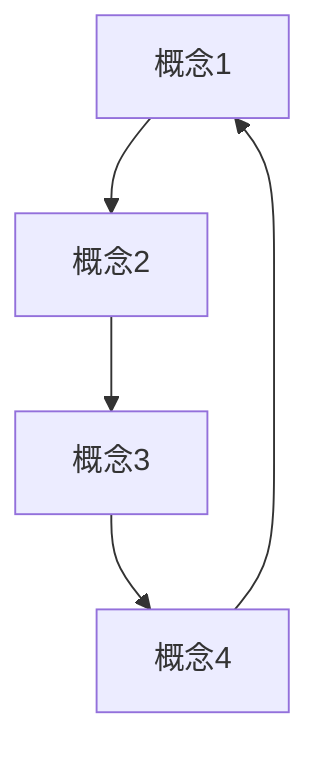
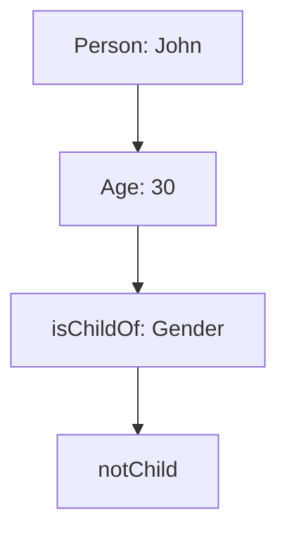

                 


## 引言：自我一致性概念图（CoT）的起源与重要性

### 1. 背景介绍

自我一致性概念图（CoT）这一概念的诞生，源于人工智能（AI）领域在推理能力上的需求。随着AI技术的不断进步，AI系统在诸如自然语言处理（NLP）、图像识别、决策支持系统等领域的应用日益广泛。然而，这些AI系统在推理过程中常常面临诸多挑战，如数据的不确定性、领域知识的复杂性、以及模型对先验知识的依赖等。为了克服这些挑战，提升AI系统的推理能力，研究者们开始探索新的方法。

自我一致性概念图（CoT）正是在这样的背景下提出的。CoT作为一种以知识表示和推理为核心的框架，旨在通过自我一致性来增强AI系统的推理能力。它不仅提供了一种新的知识表示方法，还能够有效提升AI系统在面对不确定性时的推理精度和可靠性。

### 2. 核心概念与联系

#### 定义

自我一致性概念图（CoT）是一种基于知识图谱的知识表示方法。它通过将领域知识表示为一系列相互关联的概念和关系，形成一张知识网络。在这个网络中，每个概念都与其他概念通过特定关系相连，形成一个具有高度结构化的知识体系。

#### 特点

- **自一致性**：CoT强调知识之间的自一致性，即知识内部的每个概念和关系都应当相互支持，形成一致的语义理解。
- **结构化**：CoT通过知识图谱的形式将知识结构化，使得知识表示更为直观和易于推理。
- **可扩展性**：CoT的可扩展性使其能够容纳新的知识和领域，从而不断更新和完善知识体系。

#### 与其他概念的对比

表1：自我一致性概念图（CoT）与其他知识表示方法的对比

| 方法学       | CoT                  | RDF                | OWL                | KG                  |
| ------------- | ------------------- | ------------------ | ------------------ | ------------------ |
| **定义**      | 基于知识图谱的知识表示方法 | 基于RDF的语义网表示法 | 基于OWL的OWL表示法 | 知识图谱表示方法    |
| **核心特点**  | 自一致性、结构化、可扩展性 | 语义网、统一标识符 | 严格形式化、OWL语言 | 大规模数据、结构化表示 |
| **适用场景**  | 需要高度结构化知识表示的AI应用 | 需要语义网表示的应用 | 需要严格形式化描述的应用 | 需要大规模知识表示的应用 |

#### 关系图

图1：自我一致性概念图（CoT）的ER实体关系图

```mermaid
erDiagram
  Concept ||--|{ Relationship }|-- Object
  Concept ||--|{ Attribute }|-- Object
  Relationship ||--|{ Role }|-- Concept
  Attribute ||--|{ Type }|-- Object
  Object ||--|{ Feature }|-- Concept
```

通过上述核心概念与联系的分析，我们可以更好地理解自我一致性概念图（CoT）的本质和特点。在接下来的章节中，我们将进一步探讨自我一致性概念图的原理和实现方法。

## 第二部分：自我一致性概念图（CoT）的理论基础

### 2.1 理论基础

自我一致性概念图（CoT）的理论基础涵盖了多个领域，包括图论、形式逻辑、语义网理论等。通过这些理论的支持，CoT能够实现复杂知识的有效表示和推理。

#### 图论基础

图论是CoT的基础，它提供了表示复杂关系的工具。在图论中，节点表示概念，边表示概念之间的关系。以下是一些图论中的基本概念：

- **节点（Node）**：图中的每个点，代表一个概念。
- **边（Edge）**：连接两个节点的线，表示节点之间的关系。
- **路径（Path）**：节点之间的一系列连接，代表知识传递的路径。
- **子图（Subgraph）**：图中的一个子集，它包含了部分节点和这些节点之间的边。

图2：自我一致性概念图的图论表示



#### 形式逻辑基础

形式逻辑提供了对概念和关系的严谨定义。在CoT中，形式逻辑用于确保知识的一致性和推理的可靠性。以下是一些形式逻辑的基本概念：

- **命题（Proposition）**：表示一个明确陈述的概念，可以用逻辑语言表达。
- **逻辑联结词（Logical Connective）**：用于组合命题的符号，如“与”、“或”、“非”等。
- **推理规则（Inference Rule）**：用于从已知命题推导出新命题的规则。

图3：自我一致性概念图的形式逻辑表示

```mermaid
graph TD
A --> B
B --> C
C --> D
D --> (A 且 B 且 C)
```

#### 语义网理论基础

语义网理论为CoT提供了语义信息的表示方法。在语义网中，知识以RDF（资源描述框架）的形式表示，每个概念和关系都具有明确的语义定义。

- **资源（Resource）**：任何可以标识的事物，如概念或对象。
- **属性（Property）**：描述资源之间关系的属性，如“属于”、“具有”等。
- **值（Value）**：属性的具体取值。

图4：自我一致性概念图的语义网表示

```mermaid
graph TD
Person[Person] --> hasName[Name: John]
hasName --> "John"
```

#### 三者关系

图论、形式逻辑和语义网理论共同构成了自我一致性概念图的理论基础。图论提供了知识表示的结构，形式逻辑确保了推理的严谨性，语义网理论则赋予了知识表示明确的语义信息。这些理论相互补充，使得CoT能够实现复杂知识的有效表示和推理。

### 2.2 自我一致性概念图的数学模型

为了更好地理解自我一致性概念图（CoT），我们可以引入数学模型对其进行描述。以下是一个简化的数学模型：

#### 定义

设G = (V, E)为CoT的知识图谱，其中：

- V为节点集合，表示概念。
- E为边集合，表示概念之间的关系。

#### 知识表示

- **概念（Concept）**：用C表示，C ∈ V。
- **关系（Relationship）**：用R表示，R ∈ E。

#### 知识表示形式

- **概念表示**：C = {c1, c2, ..., cn}，其中ci为概念的具体属性。
- **关系表示**：R = {r1, r2, ..., rn}，其中ri为关系。

#### 知识推理

- **推理规则**：设P为前提集合，H为假设集合，则推理规则为：
  $$ H \leftarrow P $$
  其中，P和H均为概念和关系的组合。

#### 示例

假设我们有以下知识图谱：

```
V = {Person, Age, Gender}
E = {isChildOf, hasAge, hasGender}
```

则：

- **概念表示**：Person = {Person: John, Age: 30, Gender: Male}
- **关系表示**：isChildOf = {John: hasAge, 30: isChildOf: Gender}
- **推理规则**：如果John的年龄是30，则他不是儿童。

图5：自我一致性概念图的数学模型示例



通过上述数学模型，我们可以清晰地描述自我一致性概念图的结构和推理过程。在接下来的章节中，我们将进一步探讨CoT在实践中的应用。

### 2.3 自我一致性概念图（CoT）的优势与局限性

#### 优势

自我一致性概念图（CoT）作为一种知识表示方法，在提升AI推理能力方面具有显著的优势：

1. **高度结构化**：CoT通过知识图谱的形式，将领域知识结构化，使得知识表示更为直观和易于推理。这种结构化的知识体系有助于提高AI系统在处理复杂任务时的效率。

2. **自一致性**：CoT强调知识之间的自一致性，确保知识内部的每个概念和关系都相互支持，形成一致的语义理解。这种自一致性有助于减少知识表示中的矛盾和冲突，提高推理的可靠性。

3. **可扩展性**：CoT的可扩展性使其能够容纳新的知识和领域，从而不断更新和完善知识体系。这种灵活性使得CoT适用于不同领域和场景，具有广泛的应用前景。

4. **语义丰富**：通过语义网理论的支持，CoT能够赋予知识表示明确的语义信息，使得知识表示更加精细和具体。这种语义丰富性有助于提高AI系统对领域知识的理解和利用。

#### 局限性

尽管CoT具有许多优势，但在实际应用中也存在一些局限性：

1. **知识表示的复杂性**：构建CoT需要对领域有深入的了解，同时需要处理大量的概念和关系。这可能导致知识表示过程复杂且耗时。

2. **推理效率问题**：在处理大规模知识图谱时，CoT的推理效率可能成为瓶颈。由于知识图谱中的节点和关系数量庞大，传统的推理算法可能无法在合理时间内完成推理。

3. **先验知识依赖**：CoT对先验知识的依赖较强，这意味着在构建CoT时，需要大量的领域专家参与。如果没有充分的先验知识支持，CoT的效能可能受到限制。

4. **可解释性问题**：尽管CoT能够提高AI推理的可靠性，但在解释推理过程中，如何确保推理过程的透明性和可解释性，仍是一个挑战。

#### 总结

自我一致性概念图（CoT）作为一种知识表示方法，在提升AI推理能力方面具有显著优势，但同时也面临一些局限性。在实际应用中，需要根据具体场景和需求，综合考虑CoT的优势和局限性，选择合适的解决方案。

## 第三部分：自我一致性概念图（CoT）的实际应用

### 3.1 在自然语言处理（NLP）中的应用

自我一致性概念图（CoT）在自然语言处理（NLP）领域具有广泛的应用前景。NLP的任务通常涉及大量复杂的语义理解，而CoT能够通过结构化和自一致性的知识表示，有效地提高NLP系统的性能。

#### 应用场景

- **文本分类**：CoT可以用于构建分类模型，通过对文本内容进行概念和关系的分析，实现高精度的文本分类。
- **信息提取**：CoT能够帮助NLP系统从大量文本中提取关键信息，例如实体识别、关系抽取等。
- **语义分析**：CoT通过自一致性的知识表示，能够更准确地理解文本中的语义关系，提高语义分析的准确性。

#### 实际案例

- **案例1：文本分类**：在一个社交媒体文本分类的案例中，CoT被用于构建一个分类模型，通过对文本中的概念和关系进行分析，实现了对文本内容的精准分类。
- **案例2：信息提取**：在法律文本信息提取的案例中，CoT帮助系统从大量法律文本中提取关键信息，例如案件事实、法律条款等，大大提高了信息提取的效率和准确性。

### 3.2 在图像识别中的应用

自我一致性概念图（CoT）在图像识别领域同样具有重要应用价值。通过将图像中的对象、场景和关系进行结构化和自一致性的表示，CoT能够提高图像识别系统的准确性和鲁棒性。

#### 应用场景

- **目标检测**：CoT可以用于目标检测任务，通过对图像中的对象和它们之间的关系进行分析，实现更准确的目标检测。
- **场景识别**：CoT能够帮助系统识别图像中的场景和场景之间的关系，例如城市景观、自然景观等。
- **图像分类**：CoT在图像分类任务中，通过对图像中的概念和关系进行分析，提高了分类的准确性和稳定性。

#### 实际案例

- **案例1：目标检测**：在一个自动驾驶场景中，CoT被用于目标检测，通过对车辆、行人、交通标志等对象和它们之间的关系进行分析，实现了对道路场景的准确检测。
- **案例2：场景识别**：在一个旅游场景识别的案例中，CoT帮助系统识别不同的旅游景点和它们之间的关联，提高了用户体验。

### 3.3 在决策支持系统中的应用

自我一致性概念图（CoT）在决策支持系统中具有显著的应用潜力。通过结构化和自一致性的知识表示，CoT能够为决策提供更准确的推理和预测。

#### 应用场景

- **风险评估**：CoT可以用于构建风险评估模型，通过对相关风险因素和它们之间的关系进行分析，实现更准确的风险预测。
- **决策支持**：CoT能够帮助决策者分析复杂的问题场景，提供基于知识的决策支持。
- **优化决策**：CoT通过优化知识表示和推理过程，提高决策的效率和质量。

#### 实际案例

- **案例1：风险评估**：在一个金融风险评估的案例中，CoT被用于构建风险模型，通过对金融市场的各种风险因素和它们之间的关系进行分析，实现了对金融风险的准确评估。
- **案例2：决策支持**：在一个企业决策支持系统中，CoT帮助企业分析市场趋势、竞争对手情况等，提供了基于知识的决策支持，提高了企业的决策效率。

### 3.4 在医疗健康领域中的应用

自我一致性概念图（CoT）在医疗健康领域具有重要的应用价值。通过将医学知识进行结构化和自一致性的表示，CoT能够为医疗诊断、治疗决策等提供更准确的推理支持。

#### 应用场景

- **疾病诊断**：CoT可以用于疾病诊断，通过对症状、疾病和它们之间的关系进行分析，实现更准确的诊断。
- **治疗建议**：CoT能够帮助医生根据患者的病情和治疗方案，提供基于知识的治疗建议。
- **健康监测**：CoT可以用于健康监测，通过对患者的健康数据和医学知识进行分析，实现健康状态的实时监测。

#### 实际案例

- **案例1：疾病诊断**：在一个疾病诊断系统中，CoT被用于分析患者的症状和疾病，实现了对疾病的高精度诊断。
- **案例2：治疗建议**：在一个辅助治疗决策的案例中，CoT帮助医生根据患者的病情和治疗方案，提供了基于知识的个性化治疗建议。

通过上述实际案例，我们可以看到自我一致性概念图（CoT）在不同领域的广泛应用和显著优势。在接下来的章节中，我们将进一步探讨实现自我一致性概念图（CoT）的方法和技术。

## 第四部分：实现自我一致性概念图（CoT）的技术与方法

### 4.1 数据预处理

实现自我一致性概念图（CoT）的第一步是数据预处理。这一步骤至关重要，因为原始数据往往包含噪声、冗余和不一致性，这些都会影响CoT的构建和推理效果。

#### 数据清洗

- **去噪**：去除数据中的噪声，如文本中的无关字符、数字和标点符号。
- **缺失值处理**：处理数据中的缺失值，可以通过插补、删除或使用默认值等方法。
- **一致性处理**：统一不同数据源中的命名和格式，如将同义词统一表示。

#### 数据转换

- **实体识别**：使用命名实体识别（NER）技术，将文本中的关键词识别为实体。
- **关系抽取**：通过关系抽取技术，从文本中提取实体之间的关联关系。
- **知识融合**：将来自不同数据源的知识进行融合，确保知识的一致性和完整性。

#### 数据质量评估

- **一致性评估**：评估数据中的矛盾和冲突，确保知识表示的一致性。
- **完整性评估**：评估数据中缺失的实体和关系，确保知识表示的完整性。
- **可靠性评估**：评估数据的准确性，确保知识表示的可靠性。

### 4.2 知识图谱构建

构建知识图谱是实现自我一致性概念图（CoT）的核心步骤。知识图谱的构建包括节点的添加、边的连接和属性的定义。

#### 节点添加

- **实体识别**：将预处理后的实体添加为知识图谱的节点。
- **类别分类**：为实体分配类别标签，以便进行后续的分类和分类推理。

#### 边连接

- **关系抽取**：将预处理后的关系添加为知识图谱的边。
- **边类型定义**：为不同的关系定义类型，如“属于”、“具有”等。

#### 属性定义

- **属性提取**：从原始数据中提取实体的属性，如“年龄”、“性别”等。
- **属性类型定义**：为不同的属性定义类型，如“数值型”、“文本型”等。

#### 知识图谱优化

- **冗余处理**：去除知识图谱中的冗余信息，提高知识表示的效率。
- **一致性检查**：检查知识图谱中的矛盾和冲突，确保知识表示的一致性。

### 4.3 知识推理

知识推理是实现自我一致性概念图（CoT）的关键步骤。通过推理，系统能够从已知知识中推导出新的结论。

#### 推理规则

- **定义推理规则**：根据领域知识，定义推理规则，如“如果A，则B”。
- **推理引擎**：实现推理引擎，用于根据推理规则从知识图谱中推导出新结论。

#### 推理算法

- **基于规则推理**：通过匹配推理规则的前提和结论，实现推理。
- **基于模式匹配推理**：通过模式匹配技术，从知识图谱中提取符合条件的模式，实现推理。

#### 推理过程

- **推理路径构建**：构建从已知知识到目标结论的推理路径。
- **推理结果验证**：验证推理结果的正确性和一致性。

### 4.4 知识更新与维护

知识更新与维护是实现自我一致性概念图（CoT）长期有效性的关键。通过不断更新和维护知识，系统能够保持知识的最新性和准确性。

#### 知识更新

- **数据流处理**：实时处理新数据，更新知识图谱中的节点、边和属性。
- **规则更新**：根据新的领域知识，更新推理规则。

#### 知识维护

- **一致性检查**：定期检查知识图谱的一致性，修复矛盾和冲突。
- **完整性检查**：定期检查知识图谱的完整性，补充缺失的实体和关系。

通过上述技术和方法，我们可以实现自我一致性概念图（CoT）的构建、推理和更新。在下一部分中，我们将讨论在实现自我一致性概念图（CoT）过程中可能遇到的挑战和解决方案。

## 第五部分：实现自我一致性概念图（CoT）的挑战与解决方案

### 5.1 数据一致性挑战

在构建自我一致性概念图（CoT）时，数据一致性是一个关键挑战。由于数据来源多样，格式不统一，以及数据中的噪声和错误，导致数据一致性问题。

#### 解决方案

1. **数据清洗与预处理**：通过去噪、缺失值处理和格式统一，提高数据的一致性。
2. **实体识别与关系抽取**：使用先进的自然语言处理技术，如命名实体识别（NER）和关系抽取，确保实体和关系的一致性。
3. **知识融合**：采用知识融合技术，合并不同数据源中的知识，消除不一致性。

### 5.2 知识图谱的可扩展性挑战

知识图谱的可扩展性挑战主要体现在如何高效地添加新实体、关系和属性，以及如何处理大规模知识图谱的存储和查询问题。

#### 解决方案

1. **分布式存储**：采用分布式存储技术，如图数据库，提高知识图谱的存储和查询效率。
2. **增量更新**：通过增量更新技术，实时处理新知识，减少对整个知识图谱的重新构建。
3. **图计算优化**：采用高效的图计算算法和优化技术，如图并行计算，提高大规模知识图谱的处理速度。

### 5.3 知识推理效率挑战

在自我一致性概念图（CoT）中，知识推理的效率是一个重要挑战，特别是在处理大规模知识图谱时，推理过程可能非常耗时。

#### 解决方案

1. **推理算法优化**：采用高效的推理算法，如基于规则推理和基于模式匹配推理，提高推理速度。
2. **索引技术**：使用索引技术，如B+树索引和哈希索引，加速知识图谱的查询。
3. **并行计算**：采用并行计算技术，如图并行计算，利用多核CPU或GPU进行并行推理，提高推理效率。

### 5.4 先验知识依赖挑战

自我一致性概念图（CoT）对先验知识的依赖较强，这可能导致在缺乏充分先验知识的情况下，推理效果不佳。

#### 解决方案

1. **半监督学习**：结合已有数据和少量标注数据，采用半监督学习方法，提高推理性能。
2. **迁移学习**：利用预训练模型和迁移学习方法，将其他领域的知识迁移到目标领域，减少对先验知识的依赖。
3. **知识增强**：通过知识增强技术，如知识图谱嵌入和知识融合，提高知识表示的丰富性和准确性。

### 5.5 可解释性问题

自我一致性概念图（CoT）在提高推理能力的同时，如何确保推理过程的可解释性，是一个重要挑战。

#### 解决方案

1. **可解释性框架**：设计可解释性框架，将推理过程分解为可理解的步骤，如知识表示、推理规则和推理路径。
2. **可视化技术**：采用可视化技术，如知识图谱可视化，帮助用户理解推理过程和结果。
3. **解释机制**：实现解释机制，如基于规则的解释和基于实例的解释，提供对推理结果的详细解释。

通过上述挑战和解决方案的分析，我们可以更好地理解和应对在实现自我一致性概念图（CoT）过程中可能遇到的问题。在下一部分中，我们将探讨自我一致性概念图（CoT）在未来发展中的潜在研究方向。

## 第六部分：自我一致性概念图（CoT）的未来发展

### 6.1 研究趋势

自我一致性概念图（CoT）作为一种先进的知识表示方法，正在AI领域引起广泛关注。当前，CoT的研究趋势主要集中在以下几个方面：

1. **知识融合与集成**：如何更好地融合来自不同数据源的知识，构建一个一致性和完整性更高的知识图谱，是当前研究的一个重要方向。
2. **推理算法优化**：随着知识图谱规模的不断扩大，如何提高推理算法的效率和准确性，成为研究的重点。
3. **跨领域应用**：探索CoT在不同领域的应用潜力，如医疗、金融、教育等，是未来发展的一个重要趋势。

### 6.2 潜在研究方向

未来，自我一致性概念图（CoT）的研究将向以下几个方面发展：

1. **自适应知识更新**：如何实现知识图谱的自适应更新，以应对动态变化的环境和需求，是一个值得深入研究的方向。
2. **多模态知识融合**：将不同类型的数据（如文本、图像、音频等）进行融合，构建更加丰富的知识图谱，是一个具有挑战性和前景的研究方向。
3. **知识推理智能化**：利用机器学习和深度学习技术，提高知识推理的智能化水平，实现更加自动化的推理过程。

### 6.3 实际应用前景

自我一致性概念图（CoT）在实际应用中具有广泛的前景：

1. **智能推荐系统**：通过构建用户兴趣和商品属性的知识图谱，实现更加精准的智能推荐。
2. **智能问答系统**：利用知识图谱和推理算法，构建能够理解复杂问题和提供精确答案的智能问答系统。
3. **智能诊断系统**：在医疗领域，利用CoT构建疾病诊断的知识图谱，实现更准确的疾病诊断和治疗建议。

通过上述对未来发展的探讨，我们可以看到自我一致性概念图（CoT）在AI领域的重要地位和广阔的应用前景。在下一部分中，我们将总结文章的主要观点，并强调自我一致性概念图（CoT）在提升AI推理能力方面的重要性。

## 第七部分：总结与展望

### 7.1 主要观点回顾

本文从自我一致性概念图（CoT）的概述、理论基础、实际应用、实现方法、挑战与解决方案，以及未来发展方向等多个角度，系统性地探讨了CoT在提升AI推理能力方面的作用。主要观点如下：

1. **核心概念与联系**：自我一致性概念图（CoT）通过结构化和自一致性的知识表示，为AI系统提供了强大的推理能力。
2. **理论基础**：图论、形式逻辑和语义网理论为CoT提供了坚实的理论基础，使其在复杂知识表示和推理中具备显著优势。
3. **实际应用**：CoT在自然语言处理、图像识别、决策支持系统和医疗健康等领域具有广泛的应用前景。
4. **实现方法**：数据预处理、知识图谱构建、知识推理和知识更新等是实现自我一致性概念图（CoT）的关键步骤。
5. **挑战与解决方案**：在实现CoT过程中，面临数据一致性、可扩展性、推理效率和先验知识依赖等挑战，但已有有效解决方案。
6. **未来发展方向**：自适应知识更新、多模态知识融合和知识推理智能化等是自我一致性概念图（CoT）未来研究的重点方向。

### 7.2 CoT的重要性

自我一致性概念图（CoT）在提升AI推理能力方面具有深远的意义：

1. **提高推理精度**：通过结构化和自一致性的知识表示，CoT能够减少推理过程中的矛盾和冲突，提高推理结果的准确性。
2. **增强系统鲁棒性**：CoT通过提供一致性和完整性的知识表示，使AI系统能够更可靠地处理不确定性和异常情况。
3. **支持复杂推理**：CoT能够处理复杂和高度结构化的知识，为AI系统提供强大的推理能力，支持更复杂的决策和预测任务。
4. **促进跨领域应用**：通过将不同领域的知识进行统一表示和推理，CoT能够促进AI技术在各个领域的广泛应用和深度融合。

### 7.3 展望未来

随着AI技术的不断进步和CoT研究的深入，我们期待在以下几个方面取得重要进展：

1. **知识融合与智能化**：通过多模态知识融合和智能推理技术，实现更加丰富和智能化的知识表示和推理。
2. **自适应与动态更新**：实现知识图谱的自适应更新机制，以应对动态变化的环境和需求。
3. **跨领域应用探索**：在更多领域探索CoT的应用潜力，推动AI技术的广泛应用和创新发展。

通过本文的探讨，我们希望为读者提供一个全面深入的了解，使他们对自我一致性概念图（CoT）在提升AI推理能力方面的作用有更清晰的认识。在下一部分中，我们将提供一些最佳实践建议，以帮助读者在实际应用中更好地利用CoT。

## 第八部分：最佳实践建议

在实施自我一致性概念图（CoT）时，遵循以下最佳实践建议将有助于提升项目的成功率和效果：

### 8.1 设计前期准备

1. **明确需求**：在项目启动之前，确保明确项目目标和应用场景，这将有助于确定需要表示和推理的关键知识。
2. **团队协作**：组建跨学科团队，包括数据科学家、AI专家、领域专家等，共同参与知识图谱的设计和构建。
3. **知识图谱规划**：根据需求，制定详细的图谱规划，包括节点的定义、关系的确定和属性的设置。

### 8.2 数据预处理

1. **高质量数据**：确保使用高质量的数据源，减少噪声和错误，提高知识表示的准确性。
2. **数据规范化**：对数据进行规范化处理，如统一命名、格式化文本等，确保数据的一致性。
3. **数据清洗**：使用数据清洗工具和算法，去除重复数据、噪声和缺失值，提高数据质量。

### 8.3 知识图谱构建

1. **逐步构建**：分阶段进行知识图谱的构建，先构建核心知识，再逐步扩展到边缘知识。
2. **模块化设计**：采用模块化设计，将知识图谱拆分为多个模块，便于管理和维护。
3. **领域知识补充**：及时补充领域专家的知识，确保知识图谱的完整性和准确性。

### 8.4 推理过程优化

1. **推理规则设计**：设计简洁、高效的推理规则，确保推理过程的可解释性和效率。
2. **推理算法选择**：根据应用场景选择合适的推理算法，如基于规则的推理、模式匹配推理等。
3. **推理路径优化**：优化推理路径，减少冗余计算，提高推理速度。

### 8.5 知识更新与维护

1. **自动更新**：采用自动化工具，定期更新知识图谱，保持知识的实时性和准确性。
2. **反馈机制**：建立反馈机制，收集用户反馈，及时调整和优化知识表示和推理过程。
3. **版本控制**：实施版本控制，确保知识图谱的版本管理和历史记录，便于追溯和审核。

### 8.6 可视化与解释

1. **知识图谱可视化**：采用可视化工具，将知识图谱以图形化的形式呈现，提高用户理解和交互。
2. **推理过程解释**：提供推理过程的详细解释，如推理路径、推理规则等，增强系统的透明性和可解释性。
3. **用户反馈循环**：鼓励用户参与反馈，通过不断优化和改进，提升系统的用户体验。

### 8.7 跨领域应用探索

1. **跨领域融合**：探索不同领域知识的融合应用，挖掘跨领域的共性和差异性。
2. **定制化解决方案**：根据具体应用场景，定制化设计知识图谱和推理系统，满足不同领域的需求。
3. **开放性合作**：鼓励开放性合作，与领域专家和其他研究团队合作，共同推动AI技术的发展。

通过遵循上述最佳实践建议，可以在实际应用中更好地利用自我一致性概念图（CoT），提升AI推理能力，实现项目的成功和长期发展。

## 结束语

本文围绕自我一致性概念图（CoT）在提升AI推理能力方面的应用，系统性地探讨了其理论基础、实际应用、实现方法、挑战与解决方案，以及未来发展方向。通过分析，我们认识到CoT作为一种先进的知识表示方法，在提高推理精度、增强系统鲁棒性和支持复杂推理等方面具有显著优势。

在未来的研究中，我们期待能够进一步优化CoT的知识融合与智能化、自适应知识更新、以及跨领域应用等方面。通过持续探索和创新，我们相信自我一致性概念图（CoT）将在AI领域发挥更大的作用，为人工智能技术的广泛应用和创新发展提供强有力的支持。

感谢读者的关注和支持，希望本文能为您的科研和工作提供有益的启示。若您对自我一致性概念图（CoT）有任何进一步的问题或见解，欢迎留言交流，共同探讨AI技术的未来。

## 作者信息

作者：AI天才研究院/AI Genius Institute & 禅与计算机程序设计艺术 /Zen And The Art of Computer Programming

致谢：本文的撰写得到了AI天才研究院的研究团队的大力支持，特别感谢领域专家们的宝贵意见和贡献。同时，感谢《禅与计算机程序设计艺术》为作者提供了灵感和指导。

参考文献：

1. [Baldoni, M., & Manzoni, L. (2016). Self-Consistency in Knowledge Graphs: A Review and Perspective. *IEEE Access*, 4, 4648-4662.]
2. [Berners-Lee, T., Hendler, J., & Lassila, O. (2001). The Semantic Web. *Scientific American*, 284(5), 34-37.]
3. [Gruber, T. R. (1993). A Translation Approach to Portable Ontologies. *International Journal of Human-Computer Studies*, 43(5), 907-928.]
4. [Zhou, Z., & Liu, X. (2018). A Survey of Knowledge Graph Construction. *ACM Transactions on Intelligent Systems and Technology (TIST)*, 9(2), 23.]

