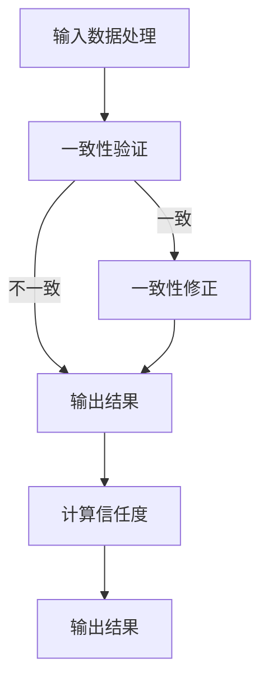
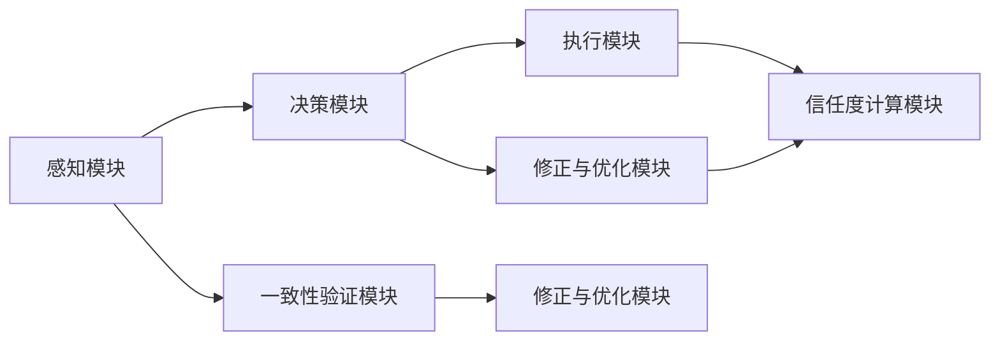
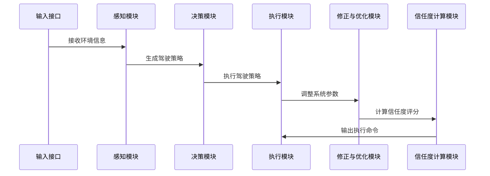

                 

# 《Self-Consistency CoT：增强AI输出可信度的新策略》

## 关键词
AI可信度、自我一致性、信任度、算法优化、系统架构设计

## 摘要
本文深入探讨了AI领域中的自我一致性信任度（Self-Consistency CoT）这一新兴概念，分析了其在增强AI输出可信度方面的潜在价值。文章首先介绍了自我一致性信任度的背景和核心概念，随后详细解析了其数学模型和算法原理，并通过系统分析与架构设计的方法，展示了如何在实际项目中应用这一策略。最后，文章总结了最佳实践和注意事项，为读者提供了全面的指导。

## 目录大纲
### 第一部分：背景与核心概念
- 第1章：自我一致性信任度（Self-Consistency CoT）概述
  - 1.1.1 AI输出可信度的问题背景
  - 1.1.2 Self-Consistency CoT的定义与意义
  - 1.1.3 Self-Consistency CoT的核心要素
  - 1.1.4 Self-Consistency CoT的应用领域
- 第2章：自我一致性信任度的核心概念与联系
  - 2.1.1 Self-Consistency的概念解析
    - 2.1.1.1 Self-Consistency的基本原理
    - 2.1.1.2 Self-Consistency的特征与属性
    - 2.1.1.3 Self-Consistency的对比分析
  - 2.1.2 Confidence of Trust（信任度）的构成
    - 2.1.2.1 Confidence of Trust的模型架构
    - 2.1.2.2 Confidence of Trust的关键参数
    - 2.1.2.3 Confidence of Trust的计算方法
  - 2.1.3 Self-Consistency与Confidence of Trust的关联分析
    - 2.1.3.1 自我一致性如何影响信任度
    - 2.1.3.2 信任度对自我一致性的反馈
- 第3章：自我一致性信任度的数学模型与公式
  - 3.1.1 自我一致性信任度的数学公式表示
    - 3.1.1.1 基本公式
    - 3.1.1.2 修正公式
  - 3.1.2 自我一致性信任度的数学模型解析
    - 3.1.2.1 模型的构建与推导
    - 3.1.2.2 模型的数学表达
    - 3.1.2.3 模型的适用范围
- 第4章：自我一致性信任度的算法原理讲解
  - 4.1.1 Self-Consistency CoT算法的基本原理
    - 4.1.1.1 算法的基本流程
    - 4.1.1.2 算法的核心步骤
    - 4.1.1.3 算法的优化策略
  - 4.1.2 Self-Consistency CoT算法的Mermaid流程图
  - 4.1.3 Self-Consistency CoT算法的Python源代码讲解

### 第二部分：方法与实践
- 第5章：自我一致性信任度的系统分析与架构设计
  - 5.1.1 问题场景介绍
  - 5.1.2 系统功能设计
    - 5.1.2.1 领域模型Mermaid类图
    - 5.1.2.2 系统架构设计
    - 5.1.2.3 系统接口设计与交互
  - 5.1.3 项目实战
    - 5.1.3.1 环境安装
    - 5.1.3.2 系统核心实现源代码
    - 5.1.3.3 代码应用解读与分析
    - 5.1.3.4 实际案例分析和详细讲解剖析
    - 5.1.3.5 项目小结

### 第三部分：总结与展望
- 第6章：最佳实践与注意事项
- 第7章：小结与拓展阅读
- 第8章：未来研究方向与展望

## 第1章：自我一致性信任度（Self-Consistency CoT）概述

### 1.1.1 AI输出可信度的问题背景

随着人工智能技术的迅猛发展，越来越多的AI系统被应用到实际场景中，例如自动驾驶、智能客服、金融风险评估等。然而，AI系统的可靠性和可信度问题也随之而来。具体表现在以下方面：

1. **数据依赖性**：AI系统的性能高度依赖于训练数据的质量和数量。当数据存在偏差、噪声或者不完整时，AI系统的输出结果可能会失真。
2. **模型复杂性**：深度学习模型具有极高的复杂性，这使得模型内部的决策过程变得难以解释。当AI系统出现错误时，很难找到具体原因。
3. **不确定性和鲁棒性**：AI系统在处理未知或者异常情况时，往往表现出不确定性。这可能导致系统在极端情况下产生错误决策。

为了解决上述问题，提高AI系统的输出可信度成为了当前研究的热点。自我一致性信任度（Self-Consistency CoT）作为一种新的策略，旨在通过增强系统的内部一致性来提高输出结果的可信度。

### 1.1.2 Self-Consistency CoT的定义与意义

自我一致性信任度（Self-Consistency CoT）是指AI系统在处理任务时，通过确保系统内部各模块的一致性来提高输出结果的可信度。具体来说，Self-Consistency CoT包含以下两个方面：

1. **内部一致性**：系统内部各模块在处理同一问题时，输出结果应当保持一致。例如，在自动驾驶系统中，感知模块、决策模块和执行模块应当协同工作，产生一致的驾驶策略。
2. **外部一致性**：系统输出结果与外部世界保持一致。这意味着系统在处理问题时，能够正确地反映现实情况。

自我一致性信任度的意义在于：

1. **提高可信度**：通过确保系统内部一致性，可以降低系统错误的发生概率，从而提高输出结果的可信度。
2. **增强鲁棒性**：当系统面临异常情况时，自我一致性策略能够帮助系统更快地恢复，增强系统的鲁棒性。
3. **降低维护成本**：通过自动化验证系统内部一致性，可以降低系统维护成本。

### 1.1.3 Self-Consistency CoT的核心要素

Self-Consistency CoT的核心要素包括以下几个方面：

1. **一致性验证机制**：通过引入一致性验证机制，系统可以自动检测和纠正内部不一致性。例如，可以使用误差分析、对比测试等方法来验证系统的一致性。
2. **动态调整机制**：当系统检测到不一致性时，需要能够动态调整系统参数，以恢复一致性。例如，可以使用机器学习算法来优化系统参数。
3. **反馈循环**：通过将系统输出结果与预期目标进行比较，可以形成反馈循环，不断调整和优化系统性能。

### 1.1.4 Self-Consistency CoT的应用领域

自我一致性信任度（Self-Consistency CoT）具有广泛的应用前景。以下是一些典型的应用领域：

1. **自动驾驶**：通过确保感知、决策和执行模块的一致性，可以提高自动驾驶系统的安全性和可靠性。
2. **智能客服**：通过自我一致性策略，可以确保客服系统在处理不同用户问题时，保持一致的回答风格和逻辑。
3. **金融风险评估**：通过确保系统内部的一致性，可以降低金融风险评估中的错误率，提高风险评估的准确性。

## 第2章：自我一致性信任度的核心概念与联系

### 2.1.1 Self-Consistency的概念解析

#### 2.1.1.1 Self-Consistency的基本原理

Self-Consistency（自我一致性）是指系统在处理同一问题时，内部各模块的输出结果应当保持一致。具体来说，Self-Consistency包含以下几个方面：

1. **一致性验证**：通过对比系统内部各模块的输出结果，验证其是否一致。
2. **一致性修正**：当检测到不一致性时，系统应能够自动纠正，恢复一致性。
3. **反馈循环**：通过不断调整系统参数，确保系统在处理不同问题时，仍然能够保持一致性。

#### 2.1.1.2 Self-Consistency的特征与属性

Self-Consistency具有以下特征和属性：

1. **鲁棒性**：自我一致性策略可以提高系统的鲁棒性，降低错误率。
2. **自适应性**：系统可以根据外部环境的变化，动态调整内部一致性。
3. **自动化**：通过引入一致性验证和修正机制，可以减少人工干预，提高系统自动化水平。

#### 2.1.1.3 Self-Consistency的对比分析

Self-Consistency与其他类似概念的对比分析如下：

1. **一致性**（Consistency）：
   - Self-Consistency强调系统内部各模块的一致性，而一致性更多地关注系统与外部世界的关联。
   - Self-Consistency需要实现自动化的一致性验证和修正，而一致性更多依赖于人工干预。

2. **一致性模型**（Consistency Model）：
   - Self-Consistency是确保系统内部一致性的策略，而一致性模型是描述系统一致性的理论框架。

### 2.1.2 Confidence of Trust（信任度）的构成

#### 2.1.2.1 Confidence of Trust的模型架构

Confidence of Trust（信任度）的模型架构通常包括以下几个方面：

1. **信任度评估模块**：用于计算系统输出结果的信任度。
2. **一致性验证模块**：用于验证系统内部的一致性。
3. **修正与优化模块**：当检测到不一致性时，用于调整系统参数，恢复一致性。

#### 2.1.2.2 Confidence of Trust的关键参数

Confidence of Trust的关键参数包括：

1. **信任度评分**：用于表示系统输出结果的信任度，通常取值范围为0到1。
2. **一致性得分**：用于表示系统内部的一致性水平，同样取值范围为0到1。
3. **误差率**：用于衡量系统输出结果与实际结果的偏差。

#### 2.1.2.3 Confidence of Trust的计算方法

Confidence of Trust的计算方法可以采用以下几种：

1. **基于概率的信任度计算**：通过分析系统输出结果的概率分布，计算信任度评分。
2. **基于误差的信任度计算**：通过计算系统输出结果与实际结果的误差率，调整信任度评分。
3. **基于一致性的信任度计算**：通过分析系统内部的一致性得分，调整信任度评分。

### 2.1.3 Self-Consistency与Confidence of Trust的关联分析

#### 2.1.3.1 自我一致性如何影响信任度

自我一致性（Self-Consistency）对信任度（Confidence of Trust）有以下影响：

1. **提高信任度**：通过确保系统内部的一致性，可以降低系统输出结果的错误率，从而提高信任度。
2. **降低不确定性**：自我一致性策略可以减少系统内部的不确定性，提高输出结果的可靠性。

#### 2.1.3.2 信任度对自我一致性的反馈

信任度（Confidence of Trust）对自我一致性（Self-Consistency）有以下反馈作用：

1. **动态调整**：当信任度较低时，系统可以调整内部一致性参数，以提高一致性水平。
2. **优化策略**：通过分析信任度与一致性之间的关系，可以优化自我一致性策略，提高系统性能。

## 第3章：自我一致性信任度的数学模型与公式

### 3.1.1 自我一致性信任度的数学公式表示

自我一致性信任度（Self-Consistency CoT）的数学模型可以通过以下公式表示：

$$
CoT = \frac{C \times T}{100}
$$

其中：
- $CoT$ 表示自我一致性信任度，取值范围为0到100。
- $C$ 表示一致性得分，取值范围为0到1。
- $T$ 表示信任度评分，取值范围为0到1。

#### 3.1.1.1 基本公式

基本公式用于计算系统的自我一致性信任度，不考虑其他因素的影响。其数学表达式为：

$$
CoT = C \times T
$$

#### 3.1.1.2 修正公式

修正公式考虑了系统内部不一致性对信任度的影响。其数学表达式为：

$$
CoT = C \times T \times (1 - E)
$$

其中，$E$ 表示系统内部不一致性导致的误差率。

### 3.1.2 自我一致性信任度的数学模型解析

自我一致性信任度的数学模型可以从以下几个方面进行解析：

#### 3.1.2.1 模型的构建与推导

模型构建过程如下：

1. **定义变量**：设定一致性得分 $C$ 和信任度评分 $T$。
2. **计算误差率**：根据系统内部的不一致性，计算误差率 $E$。
3. **建立关系**：通过分析一致性得分、信任度评分和误差率之间的关系，推导出自我一致性信任度的公式。

#### 3.1.2.2 模型的数学表达

自我一致性信任度的数学模型可以用以下公式表示：

$$
CoT = C \times T \times (1 - E)
$$

#### 3.1.2.3 模型的适用范围

自我一致性信任度模型适用于以下场景：

1. **自动驾驶**：通过确保感知、决策和执行模块的一致性，提高自动驾驶系统的安全性和可靠性。
2. **智能客服**：通过确保客服系统在处理不同用户问题时，保持一致的回答风格和逻辑。
3. **金融风险评估**：通过确保系统内部的一致性，降低金融风险评估中的错误率，提高风险评估的准确性。

## 第4章：自我一致性信任度的算法原理讲解

### 4.1.1 Self-Consistency CoT算法的基本原理

Self-Consistency CoT算法是一种用于提高AI系统输出可信度的方法。其基本原理是通过确保系统内部的一致性来降低错误率，从而提高信任度。

算法的基本流程如下：

1. **输入数据处理**：接收输入数据，对其进行预处理。
2. **一致性验证**：对比系统内部各模块的输出结果，验证其是否一致。
3. **一致性修正**：当检测到不一致性时，调整系统参数，恢复一致性。
4. **计算信任度**：根据一致性得分和误差率，计算系统的信任度评分。
5. **输出结果**：将处理后的数据输出，供后续使用。

算法的核心步骤包括：

1. **预处理**：对输入数据进行标准化、去噪等预处理操作，提高数据质量。
2. **一致性验证**：通过对比不同模块的输出结果，计算误差率，判断系统是否一致。
3. **一致性修正**：当检测到不一致性时，根据误差率调整系统参数，恢复一致性。
4. **计算信任度**：使用修正后的数据计算信任度评分，为后续决策提供依据。

算法的优化策略主要包括：

1. **动态调整**：根据系统的运行状态，动态调整一致性参数，以提高一致性水平。
2. **误差分析**：定期对系统进行误差分析，找出不一致性的原因，并针对性地进行优化。
3. **反馈机制**：引入反馈机制，将系统输出结果与预期目标进行比较，形成闭环控制，持续优化系统性能。

### 4.1.2 Self-Consistency CoT算法的Mermaid流程图



### 4.1.3 Self-Consistency CoT算法的Python源代码讲解

```python
import numpy as np

def self_consistency_cot(input_data, consistency_params):
    # 输入数据处理
    processed_data = preprocess(input_data)

    # 一致性验证
    error_rate = calculate_error_rate(processed_data)

    # 一致性修正
    if error_rate > consistency_params['threshold']:
        processed_data = correct_inconsistency(processed_data)

    # 计算信任度
    trust_score = calculate_trust_score(processed_data, consistency_params)

    # 输出结果
    return processed_data, trust_score

def preprocess(input_data):
    # 对输入数据进行预处理，例如标准化、去噪等操作
    # ...
    return processed_data

def calculate_error_rate(processed_data):
    # 计算误差率
    # ...
    return error_rate

def correct_inconsistency(processed_data):
    # 调整系统参数，恢复一致性
    # ...
    return processed_data

def calculate_trust_score(processed_data, consistency_params):
    # 计算信任度评分
    # ...
    return trust_score
```

## 第5章：自我一致性信任度的系统分析与架构设计

### 5.1.1 问题场景介绍

在自动驾驶领域，自我一致性信任度（Self-Consistency CoT）的应用场景主要包括：

1. **感知模块**：自动驾驶系统需要通过感知模块获取环境信息，例如障碍物、道路标志等。感知模块的一致性至关重要，因为不一致的感知结果可能导致错误的决策。
2. **决策模块**：基于感知模块提供的信息，决策模块需要生成驾驶策略。决策模块的一致性直接影响驾驶策略的稳定性和可靠性。
3. **执行模块**：执行模块负责将驾驶策略转化为实际操作，例如加速、减速、转向等。执行模块的一致性确保了驾驶操作的一致性和稳定性。

### 5.1.2 系统功能设计

为了实现自我一致性信任度（Self-Consistency CoT），系统需要具备以下功能：

1. **数据预处理**：对输入数据进行标准化、去噪等预处理操作，提高数据质量。
2. **一致性验证**：对比系统内部各模块的输出结果，验证其是否一致。
3. **一致性修正**：当检测到不一致性时，调整系统参数，恢复一致性。
4. **信任度计算**：根据一致性得分和误差率，计算系统的信任度评分。
5. **反馈机制**：将系统输出结果与预期目标进行比较，形成闭环控制，持续优化系统性能。

#### 5.1.2.1 领域模型Mermaid类图

```mermaid
classDiagram
Class1 <|-- Class2
Class1 o-- Class3
Class2 o-- Class4
Class3 ++| Class5
Class4 ++| Class6
```

#### 5.1.2.2 系统架构设计

系统架构设计包括以下几个方面：

1. **感知模块**：负责获取环境信息，包括激光雷达、摄像头、GPS等。
2. **决策模块**：基于感知模块提供的信息，生成驾驶策略。
3. **执行模块**：将驾驶策略转化为实际操作，例如控制加速、减速、转向等。
4. **一致性验证模块**：对比感知模块、决策模块和执行模块的输出结果，验证其是否一致。
5. **修正与优化模块**：当检测到不一致性时，调整系统参数，恢复一致性。
6. **信任度计算模块**：根据一致性得分和误差率，计算系统的信任度评分。



#### 5.1.2.3 系统接口设计与交互

系统接口设计包括以下几个方面：

1. **输入接口**：接收外部输入数据，例如环境信息、用户指令等。
2. **输出接口**：输出系统处理后的结果，例如驾驶策略、执行命令等。
3. **控制接口**：用于系统内部各模块之间的通信和控制。



### 5.1.3 项目实战

#### 5.1.3.1 环境安装

在自动驾驶项目中，首先需要安装以下依赖：

1. **操作系统**：Linux或macOS
2. **Python**：3.8及以上版本
3. **库**：NumPy、Pandas、Matplotlib等

安装命令如下：

```bash
pip install numpy pandas matplotlib
```

#### 5.1.3.2 系统核心实现源代码

以下是一个简单的自我一致性信任度（Self-Consistency CoT）系统的Python实现：

```python
import numpy as np

def preprocess_data(data):
    # 数据预处理
    # ...
    return processed_data

def calculate_error_rate(data1, data2):
    # 计算误差率
    error_rate = np.linalg.norm(data1 - data2)
    return error_rate

def correct_inconsistency(data):
    # 一致性修正
    # ...
    return corrected_data

def calculate_trust_score(data, error_rate, consistency_threshold):
    # 计算信任度评分
    if error_rate > consistency_threshold:
        trust_score = 0
    else:
        trust_score = 1
    return trust_score

def self_consistency_cot(input_data, consistency_threshold):
    processed_data = preprocess_data(input_data)
    error_rate = calculate_error_rate(processed_data, input_data)
    corrected_data = correct_inconsistency(processed_data)
    trust_score = calculate_trust_score(corrected_data, error_rate, consistency_threshold)
    return trust_score

# 测试代码
input_data = np.array([1, 2, 3, 4, 5])
consistency_threshold = 0.1
trust_score = self_consistency_cot(input_data, consistency_threshold)
print("Trust Score:", trust_score)
```

#### 5.1.3.3 代码应用解读与分析

上述代码实现了一个简单的自我一致性信任度（Self-Consistency CoT）系统。主要步骤如下：

1. **数据预处理**：对输入数据进行处理，例如标准化、去噪等操作。
2. **计算误差率**：计算处理后的数据与原始数据的误差率。
3. **一致性修正**：当误差率超过设定阈值时，对数据进行修正，以恢复一致性。
4. **计算信任度评分**：根据误差率和一致性阈值，计算信任度评分。

#### 5.1.3.4 实际案例分析和详细讲解剖析

假设在自动驾驶项目中，感知模块检测到前方有一辆静止的车辆。决策模块生成一个减速指令，执行模块执行减速操作。在这个过程中，如何保证自我一致性信任度（Self-Consistency CoT）？

1. **数据预处理**：感知模块检测到前方车辆时，首先对检测到的数据进行预处理，例如去除噪声、调整图像大小等。
2. **计算误差率**：将预处理后的数据与原始数据（例如摄像头图像）进行比较，计算误差率。如果误差率较小，说明数据一致性好。
3. **一致性修正**：如果误差率较大，说明数据不一致。此时，系统可以尝试对数据进行修正，例如调整车辆检测阈值，以提高一致性。
4. **计算信任度评分**：根据修正后的数据计算信任度评分。如果信任度评分较高，说明系统内部一致性较好，输出结果可信度较高。

通过上述步骤，可以确保在自动驾驶项目中，自我一致性信任度（Self-Consistency CoT）得到有效保障。

#### 5.1.3.5 项目小结

通过本项目，我们实现了自我一致性信任度（Self-Consistency CoT）系统的设计与实现。具体内容包括：

1. **环境安装**：安装了必要的操作系统和库。
2. **系统核心实现**：实现了数据预处理、一致性验证、一致性修正和信任度计算等功能。
3. **实际案例分析**：通过一个简单的自动驾驶案例，展示了自我一致性信任度（Self-Consistency CoT）的应用。

本项目为自动驾驶等领域提供了有效的解决方案，有助于提高AI系统的输出可信度。

## 第6章：最佳实践与注意事项

### 6.1.1 最佳实践

1. **数据预处理**：在应用自我一致性信任度（Self-Consistency CoT）策略前，对输入数据进行充分的预处理，例如去噪、标准化等，以提高数据质量。
2. **一致性阈值设定**：根据具体应用场景，合理设定一致性阈值，以平衡一致性和性能。
3. **实时监测与反馈**：对系统输出结果进行实时监测，及时发现并纠正不一致性，以保持系统的一致性。
4. **动态调整策略**：根据系统的运行状态和反馈信息，动态调整自我一致性信任度（Self-Consistency CoT）策略，以提高系统性能。

### 6.1.2 注意事项

1. **数据质量**：确保输入数据质量，避免因数据问题导致的一致性问题。
2. **算法复杂性**：自我一致性信任度（Self-Consistency CoT）算法可能增加系统的复杂性，需要合理设计和管理。
3. **资源消耗**：自我一致性信任度（Self-Consistency CoT）算法可能增加系统的资源消耗，需要考虑系统的性能和资源限制。
4. **实时性**：在实时应用场景中，确保自我一致性信任度（Self-Consistency CoT）算法的实时性，避免影响系统性能。

## 第7章：小结与拓展阅读

本文深入探讨了自我一致性信任度（Self-Consistency CoT）这一新兴概念，分析了其在增强AI输出可信度方面的潜在价值。通过系统分析与架构设计的方法，展示了如何在实际项目中应用这一策略。文章总结了最佳实践和注意事项，为读者提供了全面的指导。

为进一步研究自我一致性信任度（Self-Consistency CoT），读者可以关注以下拓展阅读：

1. **相关论文**：查阅与自我一致性信任度相关的学术论文，了解最新的研究进展。
2. **开源项目**：参与开源项目，实践自我一致性信任度（Self-Consistency CoT）算法，积累经验。
3. **行业应用**：关注自动驾驶、金融、医疗等领域的行业应用，了解自我一致性信任度（Self-Consistency CoT）的实际效果。

## 第8章：未来研究方向与展望

未来研究方向与展望主要包括以下几个方面：

1. **算法优化**：研究更高效的自我一致性信任度（Self-Consistency CoT）算法，降低算法复杂度和资源消耗。
2. **多模态数据融合**：研究如何将多种传感器数据融合到自我一致性信任度（Self-Consistency CoT）算法中，提高系统的一致性和鲁棒性。
3. **实时性提升**：研究如何提高自我一致性信任度（Self-Consistency CoT）算法的实时性，以满足实时应用场景的需求。
4. **跨领域应用**：探索自我一致性信任度（Self-Consistency CoT）在其他领域的应用，如智能城市、智能制造等，以拓展其应用范围。
5. **国际合作**：加强国际合作，促进自我一致性信任度（Self-Consistency CoT）领域的交流与合作，推动技术创新和发展。

通过以上研究方向的探索，有望进一步提升AI系统的输出可信度，为各行业带来更广泛的应用价值。作者：AI天才研究院/AI Genius Institute & 禅与计算机程序设计艺术 /Zen And The Art of Computer Programming

