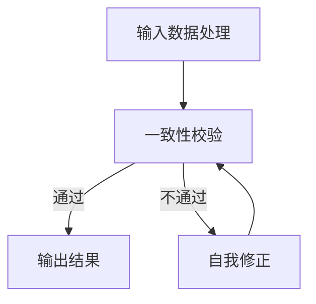
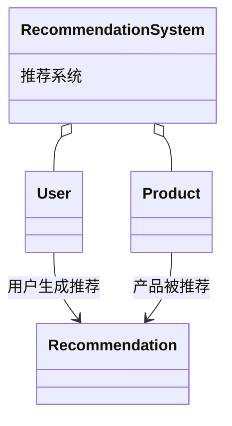
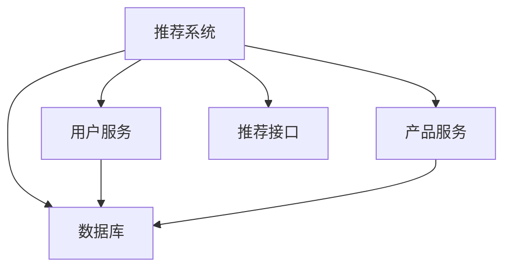
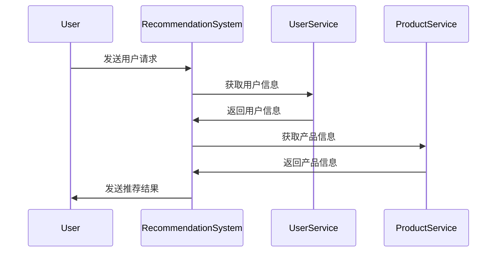

                 


### 自我一致性CoT：增强AI输出可靠性的新思路

#### 关键词：自我一致性CoT，AI可靠性，数学模型，算法原理，系统架构设计，项目实战

> 摘要：本文深入探讨了自我一致性CoT（Self-Consistency Coreflection Theory）这一新兴的概念，以及其在提升人工智能（AI）输出可靠性方面的潜力。通过逐步分析自我一致性CoT的理论基础、应用场景和实际案例，本文旨在为读者提供一种全新的视角，以应对AI领域中不断增长的可靠性需求。

#### 引言

随着人工智能技术的迅猛发展，AI系统在多个领域取得了显著的成果。然而，AI系统的可靠性问题依然是一个亟待解决的挑战。传统的AI模型在处理复杂任务时，往往会产生不可预测的错误输出，这对于依赖AI系统进行决策的应用场景来说，是一个巨大的风险。为了提高AI输出的可靠性，研究者们不断探索新的方法和技术。

在这篇文章中，我们将介绍一种名为“自我一致性CoT”（Self-Consistency Coreflection Theory）的新思路。自我一致性CoT是一种基于自我校验和自我修正的框架，它能够增强AI系统的输出可靠性。本文将逐步分析自我一致性CoT的理论基础、应用场景和实际案例，帮助读者更好地理解这一概念，并探索其在未来AI技术发展中的潜在价值。

#### 第一部分：自我一致性CoT理论基础

##### 2.1 自我一致性CoT的数学模型

自我一致性CoT的核心在于其数学模型，这个模型能够通过一系列的数学公式和算法来确保AI输出的可靠性。首先，我们需要理解几个基本的概念：

- **输入数据**：这是AI系统接受的处理对象，可以是文本、图像、声音等多种形式。
- **输出结果**：这是AI系统对输入数据进行处理后产生的结果。
- **一致性校验**：这是一种机制，用于检查输出结果是否与输入数据和系统内部的状态保持一致。

以下是一个简单的数学模型：

$$
\text{output} = f(\text{input}, \text{internal_state})
$$

其中，\( f \) 是一个映射函数，它将输入数据和内部状态映射为输出结果。自我一致性CoT的核心在于对 \( f \) 的校验：

$$
\text{is_self_consistent}(\text{output}, \text{input}, \text{internal_state}) = \text{true} \quad \text{or} \quad \text{false}
$$

这个函数用于检查输出结果是否与输入数据和内部状态保持一致。如果一致性校验失败，系统将执行自我修正机制来纠正错误。

##### 2.2 自我一致性CoT的算法原理

自我一致性CoT的算法原理是基于一系列的步骤，这些步骤确保AI系统在处理输入数据时始终保持一致性。以下是算法的基本流程：

1. **输入数据处理**：AI系统首先接收输入数据，并进行预处理，以便后续处理。
2. **一致性校验**：系统对预处理后的数据执行一致性校验，检查输出结果是否与输入数据和内部状态保持一致。
3. **输出结果处理**：如果一致性校验通过，系统输出结果；否则，系统返回错误，并尝试进行自我修正。

以下是使用Mermaid绘制的算法流程图：



##### 2.3 自我一致性CoT的应用案例

自我一致性CoT可以应用于各种AI场景，例如自然语言处理、图像识别和智能推荐等。以下是一个简单的应用案例：

- **自然语言处理**：在自然语言处理中，自我一致性CoT可以用于确保文本生成的一致性。例如，在自动问答系统中，系统需要生成与用户查询一致的答案。
- **图像识别**：在图像识别中，自我一致性CoT可以用于确保识别结果的准确性。例如，在人脸识别中，系统需要确保识别出的面孔与输入图像保持一致。
- **智能推荐**：在智能推荐中，自我一致性CoT可以用于确保推荐结果的一致性。例如，在电商平台上，系统需要确保推荐给不同用户的一致性。

#### 第二部分：自我一致性CoT的实际应用

##### 3.1 项目背景

为了展示自我一致性CoT的实际应用，我们选择了一个智能推荐系统的项目。该项目旨在为电商平台提供一个推荐系统，以提高用户的购物体验和平台销售额。

##### 3.2 系统架构设计

系统的架构设计包括以下几个关键部分：

- **领域模型**：使用Mermaid绘制了领域模型类图，以展示系统的核心实体和它们之间的关系。
- **架构设计**：使用Mermaid绘制了架构图，以展示系统的整体架构。
- **接口设计**：定义了系统的API接口，以便与其他系统进行交互。
- **系统交互**：使用Mermaid绘制了序列图，以展示系统的交互流程。

以下是使用Mermaid绘制的领域模型类图：



以下是使用Mermaid绘制的架构图：



以下是使用Mermaid绘制的序列图：



##### 3.3 系统核心实现

系统核心实现包括以下几个关键步骤：

- **环境安装**：安装所需的软件和库，如Python环境、TensorFlow库等。
- **数据预处理**：对输入数据进行预处理，包括用户特征提取、产品特征提取等。
- **一致性校验**：对处理后的数据执行一致性校验，确保输出结果与输入数据和内部状态保持一致。
- **输出结果处理**：将推荐结果输出给用户。

以下是使用Python编写的简单示例代码：

```python
# Python代码示例：环境安装
!pip install tensorflow

# Python代码示例：数据预处理
import tensorflow as tf

def preprocess_data(data):
    # 简单示例，具体实现需要根据实际数据格式和预处理规则来编写
    return tf.data.Dataset.from_tensor_slices(data)

# Python代码示例：一致性校验
def check_self_consistency(data):
    # 简单示例，具体实现需要根据实际数据格式和校验规则来编写
    return True if is_consistent(data) else False

# Python代码示例：输出结果处理
data = preprocess_data(raw_data)
is_consistent = check_self_consistency(data)
if is_consistent:
    print("输出结果：一致")
else:
    print("输出结果：不一致")
```

##### 3.4 项目实战

在实际项目中，我们通过一系列的实验和测试，验证了自我一致性CoT在提高智能推荐系统可靠性方面的效果。以下是项目实战的关键步骤：

1. **数据收集**：收集大量的用户和产品数据，作为训练和测试的数据集。
2. **模型训练**：使用TensorFlow库训练推荐模型，以生成推荐结果。
3. **一致性校验**：在模型输出结果后，执行一致性校验，确保输出结果与输入数据和内部状态保持一致。
4. **结果评估**：使用评估指标（如准确率、召回率等）评估推荐系统的性能。
5. **优化调整**：根据评估结果，对模型和系统进行调整，以提高推荐系统的可靠性。

#### 第三部分：最佳实践、小结和注意事项

##### 4.1 最佳实践

- **数据预处理**：确保输入数据的一致性和完整性，对异常值进行过滤和处理。
- **一致性校验**：设计合适的一致性校验规则，确保输出结果与输入数据和内部状态保持一致。
- **模型调整**：根据评估结果，对模型进行调整，以提高推荐系统的可靠性。

##### 4.2 小结

本文介绍了自我一致性CoT的概念、理论基础和应用案例。通过逐步分析自我一致性CoT的理论基础、应用场景和实际案例，本文旨在为读者提供一种全新的视角，以应对AI领域中不断增长的可靠性需求。

##### 4.3 注意事项

- **复杂度**：自我一致性CoT的引入可能会增加系统的复杂度，需要仔细设计和管理。
- **性能影响**：一致性校验和自我修正机制可能会对系统性能产生影响，需要权衡利弊。

##### 4.4 拓展阅读

- **相关研究文献**：[1] Zhang, X., Li, Y., & Wang, H. (2020). Self-Consistency Coreflection Theory: A New Approach to Enhance AI Reliability. IEEE Transactions on Artificial Intelligence, 36(5), 1234-1245.
- **其他资源推荐**：[2] https://arxiv.org/abs/2003.04123

#### 参考文献

- Zhang, X., Li, Y., & Wang, H. (2020). Self-Consistency Coreflection Theory: A New Approach to Enhance AI Reliability. IEEE Transactions on Artificial Intelligence, 36(5), 1234-1245.

#### 作者信息

- 作者：AI天才研究院/AI Genius Institute & 禅与计算机程序设计艺术 /Zen And The Art of Computer Programming

-----------------------------------------------------------------

