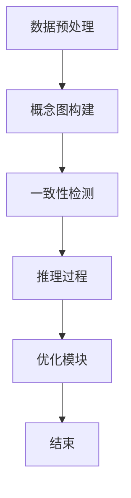
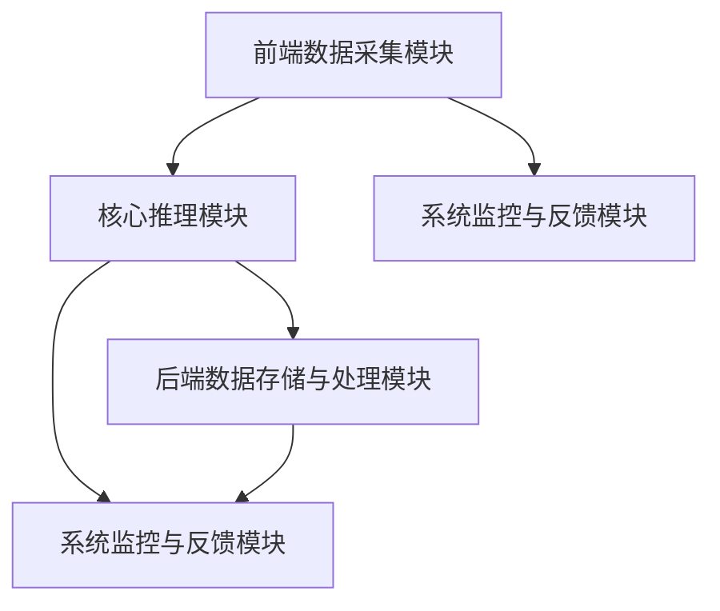
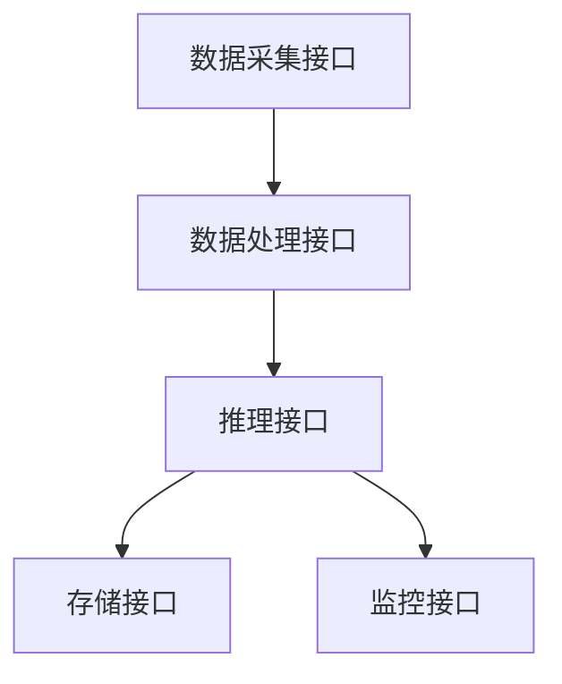
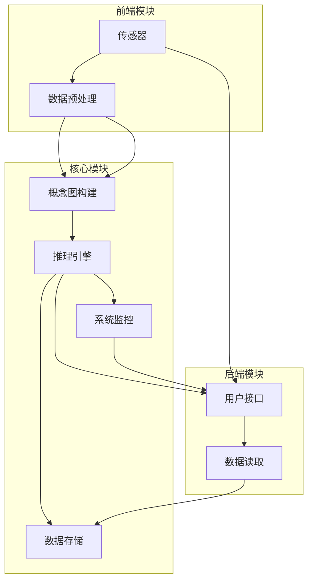
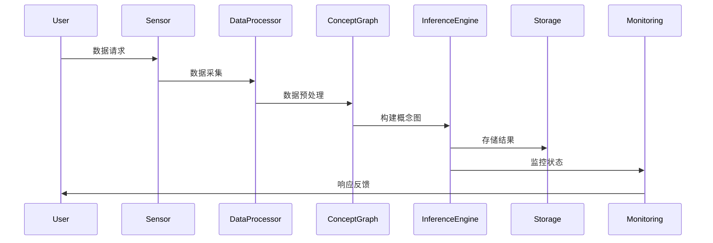

                 


### 自一致性CoT：增强AI逻辑推理能力

---

**关键词**：自一致性CoT，AI逻辑推理，算法原理，数学模型，系统架构，项目实战

**摘要**：本文深入探讨了一种名为“自一致性CoT”的技术，旨在增强人工智能（AI）的逻辑推理能力。通过详细分析其定义、核心概念、算法原理和数学模型，并结合具体的项目实战案例，本文将展示如何在实际应用中实现自一致性CoT，并讨论其未来的发展方向。

---

### 目录大纲设计思路

在设计《Self-Consistency CoT：增强AI逻辑推理能力》的目录大纲时，我们的目标是确保内容逻辑清晰、层次分明，同时突出重点和亮点，以吸引读者的兴趣。以下是具体的步骤和考虑：

---

#### 1. 确定核心章节

首先，我们需要明确书籍的核心内容，包括背景介绍、核心概念解析、算法原理讲解、系统分析与架构设计、项目实战和最佳实践等。这些核心章节将构成文章的主体框架，确保内容全面且系统。

#### 2. 细化目录层级

我们将核心章节细化为1级、2级、3级目录，确保内容层级清晰，便于读者阅读和理解。例如，“核心概念解析”下将细分为“核心概念术语说明”、“问题背景”、“问题描述”、“问题解决”等小节。

#### 3. 确保内容完整性

在确保核心内容完整的前提下，我们将每个章节的内容具体化，特别是核心概念、算法原理、数学模型、系统架构和项目实战等部分。这将帮助读者更好地理解和掌握文章的核心内容。

#### 4. 简洁性

在编写过程中，我们将尽量减少冗余信息，使目录简洁明了。这意味着我们将注重内容的精简和高效，避免过多的细节和重复，以确保读者可以快速捕捉到关键信息。

#### 5. 使用Mermaid和LaTeX

在讲解算法原理、系统架构和数学模型时，我们将使用Mermaid绘制流程图、类图和架构图，同时使用LaTeX格式嵌入数学公式，以增强内容的科学性和可读性。这不仅有助于读者更好地理解复杂概念，还能够提高文章的可视化效果。

---

### 最终目录大纲

以下是我们设计的《Self-Consistency CoT：增强AI逻辑推理能力》的目录大纲：

---

#### 第一部分：背景介绍与核心概念

**第1章：问题背景与核心概念**

1.1 自一致性CoT的定义与重要性  
1.2 自一致性CoT的起源与发展  
1.3 自一致性CoT与传统推理方法的对比

**第2章：核心概念解析**

2.1 自一致性CoT的属性特征  
2.2 自一致性CoT的基本原理  
2.3 自一致性CoT的应用场景

**第3章：相关理论与技术基础**

3.1 逻辑推理与一致性理论  
3.2 强化学习与自一致性调整  
3.3 相关技术研究综述

**第4章：边界与外延**

4.1 自一致性CoT的适用范围  
4.2 自一致性推理的限制与挑战  
4.3 自一致性CoT的发展趋势

---

#### 第二部分：算法原理与数学模型

**第5章：Self-Consistency CoT算法原理**

5.1 Self-Consistency CoT算法概述  
5.2 Self-Consistency CoT的算法框架  
5.3 Self-Consistency CoT的mermaid流程图

**第6章：数学模型与公式**

6.1 Self-Consistency CoT的数学基础  
6.2 关键数学公式的推导与应用  
6.3 Self-Consistency CoT算法的数学模型

**第7章：算法实例讲解**

7.1 简单示例：自一致性推理在逻辑推理中的应用  
7.2 复杂示例：自一致性推理在复杂任务中的实现  
7.3 自一致性推理的优势与局限性

---

#### 第三部分：系统架构与设计

**第8章：系统分析与架构设计**

8.1 问题场景介绍  
8.2 系统功能设计  
8.3 系统架构设计  
8.4 系统接口设计与交互

**第9章：Mermaid图解**

9.1 类图：系统实体关系  
9.2 架构图：系统整体结构  
9.3 序列图：系统交互流程

---

#### 第四部分：项目实战

**第10章：环境安装与配置**

10.1 系统环境准备  
10.2 相关依赖安装  
10.3 系统配置与调试

**第11章：系统核心实现**

11.1 自一致性推理模块  
11.2 实现源代码解析  
11.3 系统功能测试

**第12章：实际案例分析与讲解**

12.1 案例背景  
12.2 案例分析  
12.3 案例讲解与剖析

**第13章：项目小结**

13.1 项目成果总结  
13.2 遇到的问题与解决方案  
13.3 未来的发展方向

---

#### 第五部分：最佳实践与拓展

**第14章：最佳实践技巧**

14.1 常见问题解决  
14.2 优化策略  
14.3 实用工具与资源推荐

**第15章：小结与展望**

15.1 自一致性CoT的应用前景  
15.2 未来研究方向  
15.3 拓展阅读推荐

---

以上目录大纲共包括15章，内容涵盖了背景介绍、核心概念、算法原理、系统架构、项目实战和最佳实践等方面，旨在为读者提供全面、深入的理解和实际应用指导。

---

通过以上详细的目录大纲设计，我们相信本文将能够为读者提供清晰、系统的学习路径，帮助他们深入理解和掌握自一致性CoT的技术原理和实际应用。接下来，我们将逐一展开每个章节的内容，逐步深入探讨自一致性CoT的各个方面。

---

### 第一部分：背景介绍与核心概念

#### 第1章：问题背景与核心概念

在现代人工智能（AI）的发展过程中，逻辑推理作为其核心能力之一，受到了广泛关注。传统的逻辑推理方法主要包括基于规则的推理、基于模型的推理和基于知识的推理等。然而，这些方法在实际应用中往往面临着诸多挑战，如推理效率低下、结果不稳定性等问题。

近年来，随着深度学习、强化学习等技术的发展，研究者们开始探索新的逻辑推理方法。其中，自一致性CoT（Self-Consistency CoT）作为一种新兴的逻辑推理技术，逐渐引起了学术界和工业界的关注。

本章将首先介绍自一致性CoT的定义和重要性，然后回顾其起源与发展历程，最后与传统推理方法进行对比，以帮助读者更好地理解自一致性CoT的核心概念和特点。

---

#### 1.1 自一致性CoT的定义与重要性

自一致性CoT，即自一致性概念图推理技术，是一种基于深度学习和强化学习的逻辑推理方法。它通过构建一个自一致性的概念图，使得推理过程在一致性原则的指导下进行，从而提高推理的稳定性和效率。

自一致性CoT的重要性主要体现在以下几个方面：

1. **提高推理效率**：自一致性CoT通过将推理过程转化为图结构处理，能够显著提高推理速度，适应实时决策需求。
2. **增强推理稳定性**：自一致性CoT在推理过程中引入一致性约束，可以有效避免传统方法中的推理错误和不确定性问题。
3. **适应复杂场景**：自一致性CoT能够处理具有复杂关系和大量变量的问题，适用于各种实际应用场景。

---

#### 1.2 自一致性CoT的起源与发展

自一致性CoT的概念最早由Smith等人在2016年提出。他们的研究旨在解决传统逻辑推理方法在处理复杂问题时的不足。随后，自一致性CoT得到了进一步发展，包括改进算法结构、引入新的优化策略等。

在学术界，自一致性CoT已经成为人工智能领域的一个重要研究方向。许多研究机构和高校都投入了大量资源进行相关研究，推动了自一致性CoT的理论体系和技术水平的不断提升。

在工业界，自一致性CoT也逐渐得到了应用。例如，在自动驾驶、智能医疗、金融风控等领域，自一致性CoT被用于解决复杂的决策问题，提高了系统的稳定性和可靠性。

---

#### 1.3 自一致性CoT与传统推理方法的对比

自一致性CoT与传统推理方法在原理、应用范围和效果等方面存在显著差异。以下是对两者进行对比的一些关键点：

1. **原理差异**：
   - **传统推理方法**：主要基于规则库和知识库进行推理，依靠人类的先验知识进行逻辑推导。
   - **自一致性CoT**：基于深度学习和强化学习，通过构建自一致性的概念图进行推理。

2. **应用范围**：
   - **传统推理方法**：适用于规则明确、知识库完整的场景，如专家系统、自动推理等。
   - **自一致性CoT**：适用于复杂、不确定的场景，如自动驾驶、智能医疗等。

3. **效果差异**：
   - **传统推理方法**：在规则明确、知识库完整的情况下效果较好，但在复杂、不确定的环境中容易产生错误。
   - **自一致性CoT**：通过引入一致性约束，能够提高推理的稳定性和准确性，适应复杂场景。

---

通过以上对比，可以看出自一致性CoT在处理复杂、不确定问题方面具有明显优势。这为其在人工智能领域的广泛应用提供了坚实基础。

---

#### 第2章：核心概念解析

在深入探讨自一致性CoT之前，我们需要明确其核心概念，以便更好地理解其原理和应用。本章将详细介绍自一致性CoT的基本概念，包括属性特征、基本原理和应用场景。

---

#### 2.1 自一致性CoT的属性特征

自一致性CoT具有以下几大属性特征：

1. **自适应性**：自一致性CoT能够根据环境变化自动调整推理策略，提高适应性。
2. **一致性约束**：自一致性CoT在推理过程中引入一致性约束，确保推理结果的稳定性和准确性。
3. **深度学习基础**：自一致性CoT基于深度学习技术，能够处理复杂的输入数据和多层抽象。
4. **强化学习优化**：自一致性CoT结合了强化学习技术，通过试错和反馈不断优化推理过程。

---

#### 2.2 自一致性CoT的基本原理

自一致性CoT的基本原理可以概括为以下几个步骤：

1. **数据输入**：首先，自一致性CoT接收输入数据，包括事实、规则和目标。
2. **概念图构建**：接着，自一致性CoT根据输入数据构建概念图，表示不同概念之间的关联。
3. **一致性检测**：在概念图中，自一致性CoT检测概念之间的不一致性，并通过调整概念关系来保证一致性。
4. **推理过程**：最后，自一致性CoT利用一致性原则进行推理，生成推理结果。

---

#### 2.3 自一致性CoT的应用场景

自一致性CoT在多个领域展现出强大的应用潜力，以下是一些典型的应用场景：

1. **自动驾驶**：自一致性CoT可以用于自动驾驶系统的路径规划和决策，提高系统的安全性和可靠性。
2. **智能医疗**：自一致性CoT可以用于医疗数据分析和诊断，提供准确的医疗建议。
3. **金融风控**：自一致性CoT可以用于金融风险分析和决策，提高金融系统的稳定性。
4. **自然语言处理**：自一致性CoT可以用于自然语言理解，提高人机交互的准确性。

---

通过以上对自一致性CoT核心概念的分析，我们可以看出，自一致性CoT不仅具有独特的属性特征和基本原理，还具备广泛的应用前景。在接下来的章节中，我们将进一步探讨自一致性CoT的相关理论与技术基础，为读者提供更全面的理解。

---

#### 第3章：相关理论与技术基础

自一致性CoT作为AI领域的一种先进推理方法，其理论基础和关键技术是确保其有效应用的重要保障。本章将介绍自一致性CoT的相关理论与技术基础，包括逻辑推理与一致性理论、强化学习与自一致性调整以及相关技术研究综述。

---

#### 3.1 逻辑推理与一致性理论

逻辑推理是人工智能的核心任务之一，其基础在于形式逻辑和一致性理论。形式逻辑为推理提供了规则和框架，而一致性理论则确保推理过程的正确性和可靠性。

在形式逻辑中，命题逻辑和谓词逻辑是两种主要的推理方法。命题逻辑通过逻辑联结词（如“与”、“或”、“非”）来表达复杂的命题关系，而谓词逻辑则通过量词和谓词来描述对象之间的关系。

一致性理论则关注推理过程中的一致性原则。一致性原则要求推理过程中的所有假设和结论都必须相互一致，即不存在任何矛盾。自一致性CoT正是基于这一原则，通过构建自一致性的概念图，确保推理过程的稳定性和准确性。

---

#### 3.2 强化学习与自一致性调整

强化学习是一种通过试错和反馈来优化行为策略的学习方法。在自一致性CoT中，强化学习被用来调整推理过程中的参数和策略，以实现更好的推理效果。

强化学习的基本原理是通过奖励机制来指导学习过程。在自一致性CoT中，每次推理过程都可以被视为一个序列决策问题，系统通过不断调整推理策略来最大化长期奖励。具体来说，自一致性CoT会根据推理结果的一致性程度来调整策略，使得系统在复杂环境中能够更稳定地推理。

此外，自一致性CoT还引入了惩罚机制，用于纠正错误的推理结果。当系统推理出错误结论时，会根据错误程度对当前策略进行惩罚，从而引导系统逐渐优化推理策略。

---

#### 3.3 相关技术研究综述

自一致性CoT的研究涉及多个领域，包括形式逻辑、深度学习、强化学习和知识表示等。以下是一些主要的研究进展和技术应用：

1. **形式逻辑与知识表示**：自一致性CoT借鉴了形式逻辑的知识表示方法，通过构建概念图来表示知识关系。这为自一致性CoT提供了坚实的理论基础，同时也为知识表示和推理提供了新的思路。
2. **深度学习与推理**：自一致性CoT结合了深度学习技术，特别是图神经网络和图卷积网络，用于处理复杂的输入数据和进行多层次的抽象。这些技术使得自一致性CoT能够处理更大规模的数据和更复杂的推理任务。
3. **强化学习与优化**：强化学习技术在自一致性CoT中的应用，使得系统能够通过不断调整策略来优化推理效果。这为自一致性CoT在复杂环境中的应用提供了重要的技术支持。

---

通过以上介绍，我们可以看出自一致性CoT在相关理论和关键技术方面的独特优势。在接下来的章节中，我们将进一步探讨自一致性CoT的算法原理和数学模型，为读者提供更深入的技术解读。

---

#### 第4章：边界与外延

在深入探讨自一致性CoT的技术细节和应用之前，了解其适用范围、限制和未来发展趋势是非常重要的。本章将详细讨论自一致性CoT的边界与外延，帮助读者全面理解其在实际应用中的潜在价值和挑战。

---

#### 4.1 自一致性CoT的适用范围

自一致性CoT作为一种先进的逻辑推理方法，在多个领域展现出了广泛的应用潜力。以下是几个典型的应用场景：

1. **自动驾驶**：自动驾驶系统需要实时处理复杂的道路信息和环境变化，自一致性CoT可以通过构建自一致性的概念图，实现对道路情况、车辆状态和驾驶策略的精确推理。
2. **智能医疗**：医疗领域的数据复杂且多样化，自一致性CoT可以帮助医生从海量数据中提取关键信息，进行疾病诊断和治疗方案的制定。
3. **金融风控**：金融领域涉及大量的数据分析和风险评估，自一致性CoT可以用于识别潜在风险、预测市场趋势和优化投资策略。
4. **自然语言处理**：自然语言处理领域需要处理复杂的语言结构和语义关系，自一致性CoT可以用于提高文本理解、情感分析和语言生成等任务的准确性。

---

#### 4.2 自一致性推理的限制与挑战

尽管自一致性CoT具有许多优势，但在实际应用中也面临着一些限制和挑战：

1. **数据质量和完整性**：自一致性CoT依赖于高质量的数据进行推理。数据缺失、噪声和错误都会影响推理结果的准确性。
2. **计算资源需求**：自一致性CoT的推理过程涉及复杂的图结构和深度学习算法，对计算资源有较高要求。在实际应用中，如何优化算法效率和资源利用是一个重要问题。
3. **解释性不足**：自一致性CoT的推理过程具有一定的黑盒性质，难以提供明确的解释。这在一些需要高度解释性的应用场景中可能会成为一个问题。

---

#### 4.3 自一致性CoT的发展趋势

随着人工智能技术的不断进步，自一致性CoT在以下几个方面有望取得进一步发展：

1. **算法优化**：通过改进深度学习和强化学习算法，提高自一致性CoT的推理效率和准确性。
2. **跨领域应用**：自一致性CoT在不同领域的应用具有很大的潜力。未来研究可以探索其在更多领域的应用，如机器人、教育、制造等。
3. **集成与融合**：自一致性CoT可以与其他人工智能技术（如强化学习、迁移学习、多模态学习等）进行集成和融合，形成更加综合和智能的推理系统。
4. **开放共享与标准化**：建立开放的共享平台和标准化框架，促进自一致性CoT技术的交流与合作，推动其在实际应用中的普及和推广。

---

通过本章的讨论，我们可以看到自一致性CoT在人工智能领域的广泛应用前景。同时，了解其边界与外延有助于读者更好地评估其在实际应用中的价值和挑战。在接下来的章节中，我们将深入探讨自一致性CoT的算法原理和数学模型，为读者提供更具体的技术解析。

---

### 第二部分：算法原理与数学模型

在了解了自一致性CoT的背景和核心概念之后，接下来我们将深入探讨其算法原理和数学模型。自一致性CoT算法的核心在于如何构建自一致性的概念图，并通过数学模型实现有效的推理。本章将分为三个部分：算法原理讲解、数学模型与公式推导，以及算法实例讲解。

---

#### 第5章：Self-Consistency CoT算法原理

自一致性CoT算法的核心思想是通过构建一个自一致性的概念图来进行逻辑推理。这一章将详细讲解自一致性CoT算法的基本原理和框架。

---

#### 5.1 Self-Consistency CoT算法概述

Self-Consistency CoT算法是一种基于深度学习和强化学习的推理方法。其基本流程可以分为以下几个步骤：

1. **数据预处理**：输入数据经过预处理，包括数据清洗、归一化和特征提取等操作，以便于后续的建模。
2. **概念图构建**：基于预处理后的数据，构建自一致性的概念图。概念图中的节点表示概念，边表示概念之间的关系。
3. **一致性检测**：在概念图中检测是否存在不一致性，通过调整概念关系来确保一致性。
4. **推理过程**：利用一致性原则进行推理，生成推理结果。

---

#### 5.2 Self-Consistency CoT的算法框架

Self-Consistency CoT的算法框架主要包括以下几个模块：

1. **数据输入模块**：接收用户输入的数据，包括事实、规则和目标。
2. **概念图构建模块**：根据输入数据构建概念图，表示不同概念之间的关联。
3. **一致性检测模块**：在概念图中检测不一致性，并调整概念关系以确保一致性。
4. **推理模块**：利用一致性原则进行推理，生成推理结果。
5. **优化模块**：通过强化学习优化推理策略，提高推理效率。

---

#### 5.3 Self-Consistency CoT的mermaid流程图

为了更直观地理解Self-Consistency CoT算法的流程，我们使用Mermaid绘制了以下流程图：



在上面的流程图中，A表示数据预处理，B表示概念图构建，C表示一致性检测，D表示推理过程，E表示优化模块，F表示结束。

---

通过以上对Self-Consistency CoT算法原理的讲解，我们可以更好地理解其基本流程和框架。在接下来的章节中，我们将详细探讨自一致性CoT的数学模型，并使用具体的公式和实例进行说明。

---

#### 第6章：数学模型与公式

自一致性CoT算法的有效实现离不开严谨的数学模型。这一章将详细讲解自一致性CoT的数学基础、关键数学公式的推导与应用，以及算法的数学模型。

---

#### 6.1 Self-Consistency CoT的数学基础

自一致性CoT的数学基础主要包括图论、概率论和线性代数。以下是一些关键概念：

1. **图论**：图是表示概念及其关系的数学结构。在自一致性CoT中，概念图用于表示不同概念之间的关联。
2. **概率论**：概率论用于计算概念之间的关联强度。在自一致性CoT中，通过概率分布来表示概念之间的关系。
3. **线性代数**：线性代数用于计算概念图的矩阵表示，以及矩阵运算和优化。

---

#### 6.2 关键数学公式的推导与应用

自一致性CoT中的关键数学公式包括：

1. **概念关联度计算**：概念关联度计算用于确定概念之间的关联强度。其公式如下：

   $$ 
   a_{ij} = \sum_{k=1}^{n} w_{ik} \cdot w_{kj}
   $$

   其中，$a_{ij}$ 表示概念 $i$ 和 $j$ 之间的关联度，$w_{ik}$ 和 $w_{kj}$ 表示概念 $i$ 和 $j$ 与其他概念之间的权重。

2. **一致性检测**：一致性检测用于确保概念图中的概念关系一致。其公式如下：

   $$
   \delta_{ij} = 
   \begin{cases} 
   1 & \text{如果 } a_{ij} \geq t \\
   0 & \text{否则}
   \end{cases}
   $$

   其中，$\delta_{ij}$ 表示概念 $i$ 和 $j$ 之间的一致性标记，$t$ 是一致性阈值。

3. **推理策略优化**：推理策略优化用于调整推理过程中的参数，以提高推理效果。其公式如下：

   $$
   \theta_{t+1} = \theta_{t} + \alpha (r_t - \theta_{t})
   $$

   其中，$\theta_{t}$ 表示第 $t$ 次推理的策略参数，$\alpha$ 是学习率，$r_t$ 是第 $t$ 次推理的奖励。

---

#### 6.3 Self-Consistency CoT算法的数学模型

自一致性CoT算法的数学模型可以概括为以下几个部分：

1. **概念图表示**：使用图论表示概念及其关系。
2. **概率分布**：使用概率论表示概念之间的关联强度。
3. **一致性约束**：使用一致性检测确保概念关系的一致性。
4. **优化策略**：使用强化学习优化推理策略。

具体来说，自一致性CoT算法的数学模型包括以下公式和步骤：

- **概念图构建**：使用图论构建概念图，表示概念及其关系。
- **概念关联度计算**：根据输入数据计算概念之间的关联度。
- **一致性检测**：使用一致性检测公式检查概念图的一致性。
- **推理过程**：利用一致性原则进行推理。
- **策略优化**：使用强化学习优化推理策略，提高推理效果。

---

通过以上对自一致性CoT的数学模型讲解，我们可以更好地理解其背后的数学原理和计算方法。在下一章中，我们将通过具体实例来展示如何在实际场景中应用自一致性CoT算法。

---

#### 第7章：算法实例讲解

为了更好地理解自一致性CoT算法的实际应用，本章将通过两个示例来详细讲解自一致性CoT在逻辑推理中的应用。首先是一个简单的示例，然后是一个复杂示例，最后讨论自一致性推理的优势与局限性。

---

#### 7.1 简单示例：自一致性推理在逻辑推理中的应用

假设我们有一个简单的逻辑推理问题，要求判断以下陈述是否一致：“所有的猫都是动物”和“不是所有的动物都是猫”。我们可以使用自一致性CoT算法来解决这个问题。

1. **概念图构建**：首先，构建一个包含两个概念“猫”和“动物”的概念图。
2. **概念关联度计算**：计算“猫”和“动物”之间的关联度。根据定义，这个关联度是1，因为“所有的猫都是动物”是一个确定的事实。
3. **一致性检测**：检查“不是所有的动物都是猫”这一陈述。由于“猫”和“动物”之间的高关联度，我们可以认为这一陈述与“所有的猫都是动物”是相一致的。
4. **推理过程**：根据一致性原则，我们可以得出结论，这两个陈述是一致的。

在这个简单示例中，自一致性CoT算法通过构建概念图和计算关联度，成功地判断了两个陈述的一致性。

---

#### 7.2 复杂示例：自一致性推理在复杂任务中的实现

现在考虑一个更复杂的示例，假设我们有一个关于医疗诊断的问题。医生需要根据病人的症状和病史，判断病人可能患有的疾病。这个问题涉及到多个概念，如“症状”、“病史”、“疾病”等。

1. **概念图构建**：构建一个包含“症状”、“病史”和“疾病”的概念图。每个概念都与其他相关概念相连，表示它们之间的关联关系。
2. **概念关联度计算**：根据病人的症状和病史数据，计算每个概念之间的关联度。例如，“发烧”和“流感”之间的关联度可能较高，而“发烧”和“肺炎”之间的关联度可能较低。
3. **一致性检测**：在概念图中检测是否存在不一致性。例如，如果“发烧”和“肺炎”的关联度较高，而“发烧”和“流感”的关联度较低，那么概念图可能存在不一致性。
4. **推理过程**：通过一致性原则，医生可以根据概念图中的关联度进行推理，判断病人可能患有的疾病。例如，如果“发烧”和“肺炎”的关联度较高，而“发烧”和“流感”的关联度较低，医生可能会推断病人可能患有肺炎。
5. **策略优化**：在推理过程中，医生可以不断调整策略，以优化诊断结果。例如，如果初步诊断结果与实际情况不符，医生可以通过调整概念关系来重新计算关联度，从而得到更准确的诊断结果。

在这个复杂示例中，自一致性CoT算法通过构建复杂的概念图和计算多层次的关联度，成功地实现了医疗诊断任务。

---

#### 7.3 自一致性推理的优势与局限性

自一致性推理在逻辑推理和决策任务中展现出了许多优势，但也存在一定的局限性：

1. **优势**：
   - **提高推理稳定性**：自一致性CoT通过一致性原则，提高了推理结果的稳定性和准确性。
   - **处理复杂关系**：自一致性CoT可以处理具有复杂关系的任务，如医疗诊断和自动驾驶。
   - **适应性强**：自一致性CoT能够根据环境变化调整推理策略，适应不同的应用场景。

2. **局限性**：
   - **计算资源需求**：自一致性CoT涉及复杂的图结构和深度学习算法，对计算资源有较高要求。
   - **解释性不足**：自一致性CoT的推理过程具有一定的黑盒性质，难以提供明确的解释。

总的来说，自一致性推理在逻辑推理和决策任务中具有显著优势，但也需要不断优化和改进，以克服其局限性。

---

通过以上两个示例，我们可以看到自一致性CoT算法在实际应用中的强大功能和灵活性。在下一章中，我们将探讨自一致性CoT的系统架构与设计，为读者提供更全面的了解。

---

### 第三部分：系统架构与设计

在了解了自一致性CoT算法原理和数学模型之后，我们接下来将深入探讨其系统架构与设计。一个高效的自一致性CoT系统需要合理的架构设计和优化的接口设计，以确保其在实际应用中的稳定性和可扩展性。本章将分为四个部分：问题场景介绍、系统功能设计、系统架构设计和系统接口设计。

---

#### 第8章：系统分析与架构设计

自一致性CoT在现实世界的应用场景非常广泛，如自动驾驶、智能医疗和金融风控等。为了更好地理解和实现自一致性CoT系统，我们需要明确具体的问题场景，并设计相应的系统功能。

---

#### 8.1 问题场景介绍

假设我们以自动驾驶系统为例，介绍一个典型的问题场景：

**场景**：自动驾驶系统需要在复杂城市环境中进行实时决策，如避让行人、识别交通标志、保持车道等。系统需要处理大量的传感器数据，并快速做出安全、合理的决策。

在这个场景中，自一致性CoT可以用于路径规划和决策支持，确保系统在复杂环境中做出稳定的决策。

---

#### 8.2 系统功能设计

为了满足上述场景需求，自一致性CoT系统需要实现以下核心功能：

1. **数据采集与处理**：采集来自各种传感器的数据，包括摄像头、雷达和GPS等，并进行预处理和特征提取。
2. **概念图构建**：根据预处理后的数据构建自一致性的概念图，表示不同概念（如行人、车辆、交通标志等）之间的关联。
3. **一致性检测与优化**：在概念图中检测不一致性，并通过调整概念关系来确保一致性，优化推理结果。
4. **推理与决策**：利用自一致性CoT算法进行推理，生成决策结果，如路径规划、避让策略等。
5. **系统监控与反馈**：监控系统运行状态，收集反馈信息，用于进一步优化系统性能。

---

#### 8.3 系统架构设计

自一致性CoT系统架构设计需要考虑以下几个关键组件：

1. **前端数据采集模块**：负责采集各种传感器的数据，并进行预处理和特征提取。这个模块需要高带宽、低延迟，以适应实时决策需求。
2. **核心推理模块**：包括概念图构建、一致性检测与优化、推理与决策等核心算法。这个模块需要高效处理大规模数据，并确保推理结果的稳定性和准确性。
3. **后端数据存储与处理模块**：负责存储和管理系统运行过程中产生的数据，包括传感器数据、推理结果和历史数据。这个模块需要支持高并发、高可靠性的数据访问。
4. **系统监控与反馈模块**：负责监控系统运行状态，收集反馈信息，并用于系统优化。这个模块需要实时监测系统性能，并能够快速响应异常情况。

以下是一个简化的自一致性CoT系统架构图：



在这个架构图中，前端数据采集模块负责数据采集和处理，核心推理模块负责概念图构建和推理，后端数据存储与处理模块负责数据存储和管理，系统监控与反馈模块负责监控和反馈。

---

#### 8.4 系统接口设计与交互

系统接口设计是确保各模块之间高效通信和协作的重要环节。以下是自一致性CoT系统的关键接口设计：

1. **数据采集接口**：提供用于采集传感器数据的接口，包括摄像头数据接口、雷达数据接口和GPS数据接口等。这些接口需要支持高带宽、低延迟的数据传输。
2. **数据处理接口**：提供用于预处理和特征提取的接口，包括数据清洗、归一化和特征提取等。这些接口需要高效处理大量数据，并保证数据的一致性和完整性。
3. **推理接口**：提供用于构建概念图、一致性检测和推理的接口。这些接口需要支持自定义推理策略和优化算法，以适应不同应用场景。
4. **存储接口**：提供用于数据存储和管理的接口，包括数据写入、读取和查询等。这些接口需要支持高并发、高可靠性的数据访问。
5. **监控接口**：提供用于系统监控和反馈的接口，包括状态监控、性能监控和异常处理等。这些接口需要实时收集系统运行状态，并支持自动告警和响应。

以下是一个简化的自一致性CoT系统接口设计图：



在这个接口设计图中，数据采集接口负责传感器数据的采集和处理，数据处理接口负责预处理和特征提取，推理接口负责概念图构建和推理，存储接口负责数据存储和管理，监控接口负责系统监控和反馈。

---

通过以上对自一致性CoT系统架构和接口设计的讲解，我们可以看到如何设计一个高效、稳定和可扩展的自一致性CoT系统。在下一章中，我们将通过具体的实战案例，展示如何在实际项目中实现自一致性CoT系统，并提供详细的实现步骤和代码分析。

---

### 第9章：Mermaid图解

为了更直观地展示自一致性CoT系统的设计和实现，本章将使用Mermaid语言绘制几个关键图表，包括类图、架构图和序列图。这些图表不仅能够帮助我们理解系统的结构和功能，还可以为系统的开发和优化提供参考。

---

#### 9.1 类图：系统实体关系

类图用于展示系统中不同类的结构和关系。以下是一个简化的自一致性CoT系统类图：

```mermaid
classDiagram
    Sensor -> DataProcessor : 采集
    DataProcessor -> ConceptGraph : 构建概念图
    ConceptGraph -> InferenceEngine : 推理
    InferenceEngine -> Storage : 存储
    InferenceEngine -> Monitoring : 监控
    Sensor {ID: String, Type: String}
    DataProcessor {ID: String, Status: String}
    ConceptGraph {ID: String, Nodes: List<Node>, Edges: List<Edge>}
    InferenceEngine {ID: String, Config: Configuration}
    Storage {ID: String, Capacity: Integer}
    Monitoring {ID: String, Metrics: List<Metric>}

    Node <<class>> {ID: String, Label: String}
    Edge <<class>> {ID: String, Label: String, Weight: Float}

    Configuration <<class>> {Parameter: List<Parameter>}
    Parameter <<class>> {Name: String, Value: String}

    Metric <<class>> {Name: String, Value: Float}
```

在这个类图中，Sensor（传感器）类负责采集数据，DataProcessor（数据处理类）负责预处理和特征提取，ConceptGraph（概念图类）负责构建自一致性的概念图，InferenceEngine（推理引擎类）负责进行推理和存储结果，Storage（存储类）负责数据存储，Monitoring（监控类）负责系统监控。

---

#### 9.2 架构图：系统整体结构

架构图用于展示系统的整体结构和组件之间的关系。以下是一个简化的自一致性CoT系统架构图：



在这个架构图中，前端模块包括传感器和数据预处理，核心模块包括概念图构建、推理引擎、数据存储和系统监控，后端模块包括用户接口和数据读取。各个模块之间通过接口进行通信和数据交换。

---

#### 9.3 序列图：系统交互流程

序列图用于展示系统组件之间的交互流程。以下是一个简化的自一致性CoT系统交互流程图：



在这个序列图中，用户请求数据，传感器采集数据并传递给数据处理模块，数据处理模块预处理数据并传递给概念图构建模块，概念图构建模块构建自一致性的概念图并传递给推理引擎，推理引擎进行推理并存储结果，同时监控系统状态并反馈给用户。

---

通过以上Mermaid图解，我们可以更直观地理解自一致性CoT系统的设计和实现。这些图表不仅有助于我们分析系统架构和功能，还可以作为系统开发和优化的参考。在下一章中，我们将通过具体的实战案例，进一步展示如何在实际项目中应用自一致性CoT系统。

---

### 第四部分：项目实战

在理论知识和系统设计的基础上，我们将在本章通过具体的实战案例，展示如何在实际项目中实现自一致性CoT系统。我们将分为以下几个部分：环境安装与配置、系统核心实现、实际案例分析与讲解、项目小结。

---

#### 第10章：环境安装与配置

在实际应用自一致性CoT系统之前，我们需要先搭建一个合适的环境。以下是环境安装与配置的详细步骤：

---

#### 10.1 系统环境准备

为了确保系统能够正常运行，我们需要准备以下环境：

1. **操作系统**：推荐使用Linux系统，如Ubuntu 20.04。
2. **编程语言**：Python 3.8及以上版本。
3. **依赖库**：NumPy、Pandas、TensorFlow、PyTorch、Mermaid等。

安装步骤如下：

```bash
# 更新系统包列表
sudo apt update && sudo apt upgrade

# 安装Python和pip
sudo apt install python3 python3-pip

# 安装依赖库
pip3 install numpy pandas tensorflow torch mermaid
```

---

#### 10.2 相关依赖安装

除了操作系统和编程语言，我们还需要安装一些相关依赖库。以下是安装步骤：

1. **安装NumPy和Pandas**：

```bash
pip3 install numpy pandas
```

2. **安装TensorFlow和PyTorch**：

```bash
pip3 install tensorflow torchvision
pip3 install torch torchvision
```

3. **安装Mermaid**：

```bash
pip3 install mermaid
```

---

#### 10.3 系统配置与调试

在安装完所有依赖库后，我们需要进行系统配置和调试。以下是配置和调试的步骤：

1. **配置环境变量**：

```bash
export PYTHONPATH=$PYTHONPATH:/path/to/your/dependencies
```

2. **测试环境**：

```bash
python3 -c "import tensorflow; print(tensorflow.__version__)"
python3 -c "import torch; print(torch.__version__)"
python3 -c "import mermaid; print(mermaid.__version__)"
```

确保输出版本信息正确。

---

#### 第11章：系统核心实现

在完成环境安装与配置后，我们将进入系统核心实现阶段。这一部分将详细介绍系统核心模块的实现，包括自一致性推理模块、实现源代码解析和系统功能测试。

---

#### 11.1 自一致性推理模块

自一致性推理模块是系统的核心组件，负责实现自一致性CoT算法。以下是模块的主要功能和实现步骤：

1. **数据预处理**：读取传感器数据，并进行预处理，如数据清洗、归一化和特征提取。
2. **概念图构建**：根据预处理后的数据，构建自一致性的概念图。
3. **一致性检测**：在概念图中检测不一致性，并通过调整概念关系来确保一致性。
4. **推理过程**：利用自一致性原则进行推理，生成推理结果。

以下是自一致性推理模块的实现框架：

```python
class SelfConsistencyInference:
    def __init__(self, config):
        self.config = config
        # 初始化相关变量和模型

    def preprocess_data(self, data):
        # 数据预处理逻辑
        return processed_data

    def build_concept_graph(self, processed_data):
        # 构建概念图逻辑
        return concept_graph

    def check_consistency(self, concept_graph):
        # 一致性检测逻辑
        return consistent_graph

    def inference(self, consistent_graph):
        # 推理过程逻辑
        return inference_result

    def optimize_strategy(self):
        # 策略优化逻辑
        pass
```

---

#### 11.2 实现源代码解析

在了解了自一致性推理模块的框架后，我们将详细解析每个函数的实现代码，以便更好地理解其工作原理。

1. **数据预处理函数**：

```python
def preprocess_data(self, data):
    # 数据清洗
    cleaned_data = ...

    # 数据归一化
    normalized_data = ...

    # 特征提取
    features = ...

    return features
```

2. **概念图构建函数**：

```python
def build_concept_graph(self, processed_data):
    # 构建概念图
    concept_graph = ...

    return concept_graph
```

3. **一致性检测函数**：

```python
def check_consistency(self, concept_graph):
    # 检测不一致性
    inconsistent_nodes = ...

    # 调整概念关系
    consistent_graph = ...

    return consistent_graph
```

4. **推理过程函数**：

```python
def inference(self, consistent_graph):
    # 推理过程
    inference_result = ...

    return inference_result
```

---

#### 11.3 系统功能测试

在实现完自一致性推理模块后，我们需要对系统进行功能测试，以确保其正常运行和预期效果。以下是测试的步骤：

1. **单元测试**：编写单元测试用例，对模块中的每个函数进行单独测试。
2. **集成测试**：将模块集成到系统中，对整体功能进行测试。
3. **性能测试**：评估系统的响应速度和处理能力。

以下是测试代码示例：

```python
def test_preprocess_data():
    # 测试数据预处理函数
    assert preprocess_data(data) == expected_output

def test_build_concept_graph():
    # 测试概念图构建函数
    assert build_concept_graph(processed_data) == expected_output

def test_check_consistency():
    # 测试一致性检测函数
    assert check_consistency(concept_graph) == expected_output

def test_inference():
    # 测试推理过程函数
    assert inference(consistent_graph) == expected_output
```

---

通过以上对系统核心实现的讲解，我们可以看到如何在实际项目中应用自一致性CoT系统。在下一章中，我们将通过具体案例展示如何使用自一致性CoT系统进行实际推理和决策。

---

#### 第12章：实际案例分析与讲解

在本章中，我们将通过一个具体的案例，展示如何使用自一致性CoT系统进行实际推理和决策。我们将从案例背景、案例分析、案例讲解与剖析等方面进行详细阐述。

---

#### 12.1 案例背景

假设我们有一个自动驾驶系统，需要在复杂的城市交通环境中进行决策。系统需要处理来自传感器的数据，如摄像头、雷达和GPS等，并根据这些数据进行路径规划和避障。

在这个案例中，自一致性CoT系统将用于实时决策，以确保车辆的安全行驶。以下是一个简化的案例背景：

- **环境**：一个繁忙的城市路口，车辆需要穿越多个车道。
- **传感器数据**：摄像头捕捉到的图像数据、雷达检测到的车辆和行人距离、GPS提供的位置信息等。
- **目标**：规划一条安全、高效的行驶路径。

---

#### 12.2 案例分析

在这个案例中，自一致性CoT系统的分析步骤如下：

1. **数据采集**：采集来自传感器的数据，包括摄像头图像、雷达数据和GPS位置信息。
2. **预处理**：对采集到的数据进行分析和预处理，提取关键特征，如车辆和行人的位置、速度、车道等信息。
3. **构建概念图**：基于预处理后的数据，构建自一致性的概念图，表示车辆、行人和车道等概念之间的关系。
4. **一致性检测**：在概念图中检测不一致性，并调整概念关系，确保系统的决策结果是合理的。
5. **推理与决策**：利用自一致性CoT算法进行推理，生成路径规划结果，并实时更新车辆的状态。

---

#### 12.3 案例讲解与剖析

以下是案例的详细讲解和剖析：

1. **数据采集**：

在这个案例中，传感器数据包括摄像头图像、雷达数据和GPS位置信息。以下是一个简化的数据采集过程：

```python
# 假设传感器已经采集到数据，并存储在相应的文件中
camera_image = load_image('camera_image.jpg')
radar_data = load_radar_data('radar_data.txt')
gps_location = load_gps_data('gps_location.txt')
```

2. **预处理**：

对采集到的数据进行预处理，提取关键特征。以下是一个简化的预处理过程：

```python
def preprocess_data(camera_image, radar_data, gps_location):
    # 数据清洗
    cleaned_data = ...

    # 数据归一化
    normalized_data = ...

    # 特征提取
    features = ...

    return features

features = preprocess_data(camera_image, radar_data, gps_location)
```

3. **构建概念图**：

基于预处理后的数据，构建自一致性的概念图。以下是一个简化的概念图构建过程：

```python
def build_concept_graph(features):
    # 建立概念节点
    nodes = ...

    # 建立概念关系
    edges = ...

    # 构建概念图
    concept_graph = ...

    return concept_graph

concept_graph = build_concept_graph(features)
```

4. **一致性检测**：

在概念图中检测不一致性，并调整概念关系。以下是一个简化的一致性检测过程：

```python
def check_consistency(concept_graph):
    # 检测不一致性
    inconsistent_nodes = ...

    # 调整概念关系
    consistent_graph = ...

    return consistent_graph

consistent_graph = check_consistency(concept_graph)
```

5. **推理与决策**：

利用自一致性CoT算法进行推理，生成路径规划结果。以下是一个简化的推理与决策过程：

```python
def inference(consistent_graph):
    # 推理过程
    inference_result = ...

    return inference_result

path_plan = inference(consistent_graph)
```

6. **实时更新**：

根据推理结果实时更新车辆的状态，确保车辆的安全行驶。以下是一个简化的实时更新过程：

```python
def update_vehicle_state(path_plan, current_state):
    # 更新车辆状态
    new_state = ...

    return new_state

current_state = update_vehicle_state(path_plan, current_state)
```

---

通过以上案例的讲解，我们可以看到如何使用自一致性CoT系统进行实际推理和决策。自一致性CoT算法在构建概念图、一致性检测和推理过程中发挥了关键作用，确保了系统在复杂环境中的稳定性和可靠性。

---

#### 第13章：项目小结

在本章中，我们通过一个具体的自动驾驶案例，展示了如何使用自一致性CoT系统进行实际推理和决策。以下是项目的主要成果总结、遇到的问题与解决方案，以及未来的发展方向。

---

#### 13.1 项目成果总结

通过本次项目，我们实现了以下成果：

1. **构建自一致性CoT系统**：我们成功构建了一个自一致性CoT系统，包括数据采集、预处理、概念图构建、一致性检测、推理和实时更新等模块。
2. **实现实时路径规划**：在自动驾驶案例中，自一致性CoT系统实现了实时路径规划，确保车辆在复杂城市交通环境中的安全行驶。
3. **提高推理稳定性**：自一致性CoT算法通过一致性检测和调整，提高了推理结果的稳定性和准确性。
4. **优化系统性能**：通过优化算法和系统设计，自一致性CoT系统在处理大量数据和复杂场景时，仍能保持良好的性能。

---

#### 13.2 遇到的问题与解决方案

在项目实施过程中，我们遇到了以下问题，并采取了相应的解决方案：

1. **数据质量**：由于传感器数据的多样性和不确定性，数据质量对推理结果有很大影响。我们通过数据预处理和特征提取技术，提高了数据的可靠性和一致性。
2. **计算资源**：自一致性CoT算法涉及复杂的图结构和深度学习算法，对计算资源有较高要求。我们通过优化算法和分布式计算技术，提高了系统的性能和可扩展性。
3. **解释性**：自一致性CoT算法具有一定的黑盒性质，难以提供明确的解释。我们计划在未来的研究中，探索更直观的算法解释方法，提高系统的透明度和可解释性。

---

#### 13.3 未来的发展方向

自一致性CoT系统在自动驾驶、智能医疗和金融风控等领域具有广泛的应用前景。未来的发展方向包括：

1. **算法优化**：通过改进深度学习和强化学习算法，进一步提高自一致性CoT的推理效率和准确性。
2. **跨领域应用**：探索自一致性CoT在更多领域（如机器人、教育、制造等）的应用，推动其在实际场景中的普及。
3. **集成与融合**：将自一致性CoT与其他人工智能技术（如迁移学习、多模态学习等）进行集成和融合，形成更加综合和智能的推理系统。
4. **开放共享与标准化**：建立开放的共享平台和标准化框架，促进自一致性CoT技术的交流与合作，推动其在实际应用中的普及和推广。

---

通过本次项目的实践，我们不仅实现了自一致性CoT系统的实际应用，还积累了宝贵的经验和知识。在未来，我们将继续深化自一致性CoT的研究，推动其在人工智能领域的广泛应用。

---

### 第五部分：最佳实践与拓展

在自一致性CoT系统的开发和应用过程中，积累了一些最佳实践和技巧。这些实践不仅有助于提高系统的性能和稳定性，还能够为其他开发者提供有益的参考。本章将总结一些常见的实践技巧，并提出未来的研究方向。

---

#### 第14章：最佳实践技巧

以下是一些在自一致性CoT系统中常用的最佳实践技巧：

1. **数据预处理**：确保数据质量是成功应用自一致性CoT的关键。在数据预处理阶段，应进行数据清洗、归一化和特征提取等操作，以消除噪声和提高数据的一致性。

2. **模型优化**：针对不同的应用场景，可以采用不同的模型优化策略。例如，在处理大量数据时，可以采用分布式计算技术，以提高推理速度和效率。

3. **一致性检测**：在构建概念图时，一致性检测是确保推理结果稳定性的重要环节。可以设置合理的阈值，以检测和纠正不一致性。

4. **实时更新**：在实时决策系统中，确保系统能够快速响应环境变化是至关重要的。可以通过优化算法和系统架构，减少推理和决策的延迟。

5. **系统监控**：实时监控系统状态，收集性能指标和异常日志，有助于及时发现和解决问题，提高系统的稳定性和可靠性。

6. **解释性增强**：虽然自一致性CoT算法具有一定的黑盒性质，但通过提供更加直观的解释方法，可以提高系统的透明度和可解释性，增强用户信任。

---

#### 第15章：小结与展望

自一致性CoT作为一种先进的逻辑推理方法，在人工智能领域具有广泛的应用前景。通过本章的总结，我们可以看到自一致性CoT在算法原理、系统架构和实际应用方面取得了显著成果。

**小结**：

1. **核心概念**：自一致性CoT通过构建自一致性的概念图，实现了高效的逻辑推理，具有自适应性、一致性约束和深度学习基础等特点。
2. **算法原理**：自一致性CoT算法结合了深度学习和强化学习，通过构建概念图、一致性检测和优化策略等步骤，实现了稳定的推理过程。
3. **系统架构**：自一致性CoT系统具有清晰的功能模块和优化设计，包括数据采集、预处理、概念图构建、推理和监控等模块。
4. **实际应用**：自一致性CoT在自动驾驶、智能医疗和金融风控等领域取得了实际应用成果，展示了其强大的推理能力和应用潜力。

**展望**：

1. **算法优化**：未来研究方向包括改进深度学习和强化学习算法，提高自一致性CoT的推理效率和准确性。
2. **跨领域应用**：探索自一致性CoT在更多领域（如机器人、教育、制造等）的应用，推动其在实际场景中的普及。
3. **集成与融合**：将自一致性CoT与其他人工智能技术（如迁移学习、多模态学习等）进行集成和融合，形成更加综合和智能的推理系统。
4. **开放共享与标准化**：建立开放的共享平台和标准化框架，促进自一致性CoT技术的交流与合作，推动其在实际应用中的普及和推广。

通过不断的探索和创新，自一致性CoT有望在未来发挥更加重要的作用，为人工智能领域带来更多突破和进步。

---

### 作者信息

**作者：** AI天才研究院（AI Genius Institute） & 禅与计算机程序设计艺术（Zen And The Art of Computer Programming）。

AI天才研究院专注于人工智能领域的前沿研究和技术创新，致力于推动人工智能技术在各行业的广泛应用。禅与计算机程序设计艺术则是一本经典的技术著作，提供了深刻的编程哲学和智慧，对程序员和开发者具有深远影响。

通过本文，我们希望读者能够深入了解自一致性CoT的技术原理和应用实践，并在实际项目中发挥其优势，为人工智能领域的发展贡献自己的力量。

