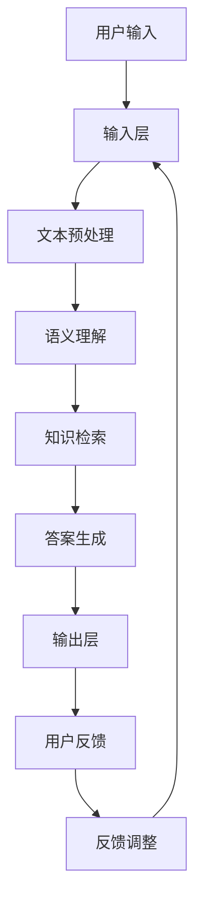
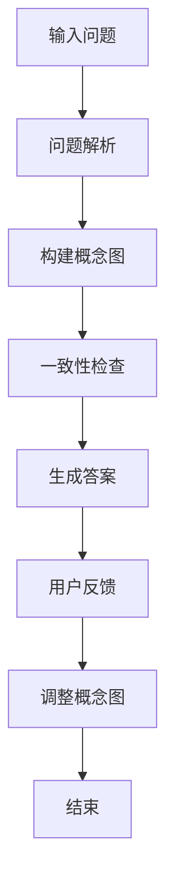

                 


# Self-Consistency CoT：增强AI问答系统

## 关键词

- AI问答系统
- Self-Consistency CoT
- 自我一致性
- 概念图
- 算法实现
- 应用实战

## 摘要

本文将深入探讨Self-Consistency CoT（自我一致性概念图）在增强AI问答系统中的关键作用。通过分析自我一致性和概念图的定义及特性，我们将揭示Self-Consistency CoT的原理和优势。随后，我们将详细讲解AI问答系统的架构设计，并介绍如何集成Self-Consistency CoT算法。文章还将通过Python代码和数学模型解析算法实现，并在实际案例中展示其在FAQ问答系统和聊天机器人中的应用效果。最后，我们将总结最佳实践，并给出优化策略，为读者提供完整的实战指南和深入研究方向。

## 第1章 引言

### 1.1 问题的背景与重要性

在当今信息爆炸的时代，人工智能（AI）已经逐渐渗透到各个领域，其中AI问答系统因其高效便捷的特点，受到了广泛关注。传统的AI问答系统主要依赖于关键词匹配和自然语言处理技术，然而，这类系统在理解复杂问题、确保答案的准确性和一致性方面仍存在诸多不足。为此，研究如何增强AI问答系统的自我一致性（Self-Consistency）成为了一项重要课题。

Self-Consistency CoT（自我一致性概念图）作为一种新兴的技术，它在AI问答系统中的应用潜力巨大。通过引入自我一致性概念，AI问答系统能够更好地理解问题、生成更加准确和一致的答案。本文旨在探讨Self-Consistency CoT在AI问答系统中的重要性，并详细介绍其应用方法。

### 1.2 AI问答系统现状

当前的AI问答系统主要基于以下技术：

1. **关键词匹配**：系统通过提取用户输入的关键词，与数据库中的关键词进行匹配，从而返回相关答案。
2. **自然语言处理（NLP）**：利用NLP技术对用户输入进行语义分析和句法分析，以理解问题的意图。
3. **机器学习**：通过机器学习算法，如神经网络，从大量数据中学习并预测问题的答案。

然而，这些方法在处理复杂问题和保证答案一致性方面存在以下问题：

- **理解偏差**：关键词匹配和NLP技术可能无法准确捕捉问题的真实意图，导致理解偏差。
- **答案多样性**：系统往往只能提供单一的答案，无法展示问题的多样性。
- **一致性不足**：不同问题可能导致相同的答案，但缺乏一致性验证机制。

### 1.3 Self-Consistency CoT的概念

Self-Consistency CoT结合了自我一致性和概念图（Conceptual Graph，简称CoT）两种技术。自我一致性指的是系统在生成答案时，确保答案内部逻辑的一致性。而概念图是一种用于表示知识结构和语义关系的图形化方法。

通过引入Self-Consistency CoT，AI问答系统能够：

- **提高理解准确性**：自我一致性确保系统在生成答案时遵循逻辑一致的原则，从而提高答案的准确性。
- **增强答案一致性**：系统在处理不同问题时，通过一致性验证机制，确保答案的一致性。
- **展示答案多样性**：概念图能够展示问题的多种解释和答案，提供更加全面的回答。

### 1.4 Self-Consistency CoT在AI问答系统中的应用潜力

Self-Consistency CoT在AI问答系统中的应用潜力体现在以下几个方面：

- **复杂问题解答**：通过自我一致性和概念图的结合，系统能够更好地理解复杂问题，提供准确且一致的答案。
- **多语言支持**：概念图能够抽象化语义关系，使得AI问答系统能够跨语言提供一致性的答案。
- **可解释性**：Self-Consistency CoT能够展示答案生成的过程，提高系统的可解释性，增强用户信任。

总之，Self-Consistency CoT为AI问答系统带来了一系列优势，使其在处理复杂问题和提供一致答案方面具有显著提升。接下来的章节将深入探讨Self-Consistency CoT的基础理论、算法原理以及实际应用。

## 第2章 Self-Consistency CoT基础理论

### 2.1 自我一致性概念解析

自我一致性是指在处理信息时，系统能够确保所生成信息的逻辑一致性。在AI问答系统中，自我一致性尤为重要，因为它直接影响答案的准确性和可信度。为了理解自我一致性的概念，我们需要从以下几个方面进行探讨。

#### 2.1.1 自我一致性的定义

自我一致性（Self-Consistency）指的是系统在生成答案时，确保答案内部逻辑的一致性。具体来说，这意味着系统在处理问题过程中，所涉及的信息、概念和关系必须遵循一致的逻辑规则。例如，如果问题涉及到一个物理概念，那么答案应该符合物理定律；如果问题涉及到数学问题，那么答案应该符合数学原理。

#### 2.1.2 自我一致性的属性与特征

自我一致性具有以下几个关键属性和特征：

1. **逻辑一致性**：答案必须遵循一致的逻辑规则，不能出现自相矛盾的情况。
2. **信息完整性**：系统在生成答案时，必须确保所有相关信息都被充分考虑，从而避免信息缺失导致的不一致性。
3. **上下文依赖性**：答案的生成需要依赖问题的上下文，确保答案在特定上下文中的一致性。
4. **动态适应性**：系统需要能够根据问题的变化动态调整答案，保持自我一致性。

#### 2.1.3 自我一致性的重要性

自我一致性在AI问答系统中的应用具有以下几个重要意义：

1. **提高答案准确性**：通过确保答案内部逻辑的一致性，系统能够生成更加准确和可靠的答案。
2. **增强用户信任**：自我一致性提高了答案的可信度，使用户更加信任AI系统的回答。
3. **改善用户体验**：一致的答案能够提供更加流畅和连贯的交互体验，提升用户的满意度。

### 2.2 CoT（概念图）理论概述

概念图（Conceptual Graph，简称CoT）是一种用于表示知识结构和语义关系的图形化方法。它由节点和边组成，节点表示概念，边表示概念之间的关系。概念图在知识表示和推理方面具有广泛的应用。

#### 2.2.1 CoT的定义与作用

概念图（Conceptual Graph）是由小岛（Kazuo Ishii）于1987年提出的一种知识表示方法。它通过图形化的方式表示概念及其之间的关系，使得知识的结构更加直观和易于理解。

概念图的作用主要包括：

1. **知识表示**：概念图能够将复杂的知识结构以图形化的方式表示，使得知识表示更加直观和易于理解。
2. **知识推理**：通过概念图，系统可以更有效地进行知识推理，发现概念之间的关系，从而提供更加准确和一致的答案。
3. **知识共享**：概念图能够清晰地展示知识结构，有助于知识的共享和传播。

#### 2.2.2 CoT的基本结构

概念图的基本结构包括以下几种元素：

1. **概念（Concept）**：表示具体的对象或概念，如“人”、“书”等。
2. **角色（Role）**：表示概念之间的关联，如“作者”、“读者”等。
3. **关系（Relation）**：表示概念之间的关系，如“写作”、“阅读”等。
4. **属性（Attribute）**：表示概念的属性，如“年龄”、“身高”等。

通过这些基本元素，概念图能够构建出复杂的知识结构，使得AI问答系统在处理问题时，能够更好地理解和推理问题的语义。

### 2.3 Self-Consistency CoT在AI问答系统中的应用

Self-Consistency CoT（自我一致性概念图）将自我一致性和概念图（CoT）结合起来，旨在增强AI问答系统的自我一致性。以下将介绍Self-Consistency CoT在AI问答系统中的应用。

#### 2.3.1 Self-Consistency CoT的核心机制

Self-Consistency CoT的核心机制主要包括以下几个方面：

1. **概念图构建**：在处理问题过程中，系统会构建概念图，将问题的语义关系以图形化的方式表示。
2. **一致性检查**：系统会定期对概念图进行一致性检查，确保概念图中的逻辑关系一致。
3. **自我修正**：当发现概念图中的不一致性时，系统会自动进行自我修正，确保答案的自我一致性。

#### 2.3.2 Self-Consistency CoT的优势与局限性

Self-Consistency CoT在AI问答系统中具有以下优势：

1. **提高答案准确性**：通过确保答案内部逻辑的一致性，Self-Consistency CoT能够提高答案的准确性。
2. **增强可解释性**：Self-Consistency CoT展示了答案生成的过程，提高了系统的可解释性，有助于用户理解答案。
3. **支持多语言**：概念图能够跨语言表示知识结构，使得AI问答系统可以提供多语言一致性的答案。

然而，Self-Consistency CoT也存在一些局限性：

1. **计算复杂性**：构建和维护概念图需要大量的计算资源，可能导致系统性能下降。
2. **知识表示限制**：概念图在表示复杂知识结构时，可能存在一定的限制，无法完全捕捉所有语义关系。

总的来说，Self-Consistency CoT在AI问答系统中具有显著的优势，但也需要克服一些技术挑战。下一章将详细介绍AI问答系统的架构设计和Self-Consistency CoT的集成方案。

## 第3章 AI问答系统架构与设计

### 3.1 AI问答系统概述

AI问答系统是一种利用人工智能技术，对用户提出的问题进行理解和回答的智能系统。它主要由以下几个基本组件构成：

#### 3.1.1 基本组件

1. **输入层**：接收用户输入的问题，可以是文本或语音形式。
2. **处理层**：对输入问题进行处理，包括文本预处理、语义理解等。
3. **知识库**：存储问题的答案和相关知识，可以是结构化数据或非结构化数据。
4. **输出层**：生成并返回答案，可以是文本或语音形式。

#### 3.1.2 功能模块

1. **文本预处理**：对输入文本进行清洗、分词、词性标注等处理，以便后续的语义理解。
2. **语义理解**：对预处理后的文本进行语义分析，理解问题的意图和主题。
3. **知识检索**：在知识库中检索与问题相关的答案。
4. **答案生成**：根据检索到的答案，生成并返回最终的回答。

### 3.2 Self-Consistency CoT集成方案

Self-Consistency CoT的集成方案旨在确保AI问答系统在生成答案时保持自我一致性。以下是一个典型的集成方案：

#### 3.2.1 集成思路

1. **概念图构建**：在接收用户输入的问题后，系统首先构建概念图，将问题的语义关系表示出来。
2. **一致性检查**：系统定期对概念图进行一致性检查，确保概念图中的逻辑关系一致。
3. **答案生成**：在生成答案的过程中，系统会参考概念图，确保答案的一致性。
4. **反馈调整**：在用户对答案进行反馈后，系统会根据反馈对概念图进行调整，以提高自我一致性。

#### 3.2.2 架构设计

以下是AI问答系统集成Self-Consistency CoT的架构设计：



在这个架构中，用户输入层接收用户问题，经过文本预处理后，进入语义理解层。语义理解层构建概念图，然后进行知识检索和答案生成。生成的答案通过输出层返回给用户，用户反馈会反馈到反馈调整层，对概念图进行调整，以提高自我一致性。

### 3.3 问答系统性能评估指标

为了评估AI问答系统的性能，我们通常采用以下几个指标：

#### 3.3.1 准确性

准确性是评估问答系统最重要的指标之一，它表示系统返回的答案与用户期望的答案相符的程度。准确性的计算公式为：

$$
\text{Accuracy} = \frac{\text{正确答案数}}{\text{总答案数}}
$$

#### 3.3.2 可解释性

可解释性指的是系统在生成答案时，用户能够理解答案生成的过程和依据。高可解释性有助于增强用户对系统的信任。

#### 3.3.3 响应时间

响应时间是指系统从接收用户输入到返回答案的时间。较低的响应时间能够提高用户体验。

综上所述，AI问答系统的性能评估需要综合考虑准确性、可解释性和响应时间等多个方面，以实现最佳的用户体验。

## 第4章 Self-Consistency CoT算法原理与实现

### 4.1 Self-Consistency CoT算法介绍

Self-Consistency CoT算法是一种结合自我一致性和概念图技术的AI问答系统增强算法。其基本思想是通过构建和检查概念图，确保答案生成过程中的逻辑一致性，从而提高答案的准确性和可信度。

#### 4.1.1 算法的基本思想

Self-Consistency CoT算法的基本思想可以概括为以下几个步骤：

1. **问题解析**：接收用户输入的问题，对其进行解析，提取关键信息。
2. **概念图构建**：根据提取的关键信息，构建概念图，表示问题的语义关系。
3. **一致性检查**：对概念图进行一致性检查，确保语义关系的逻辑一致性。
4. **答案生成**：根据概念图生成答案，确保答案与概念图的逻辑一致。
5. **用户反馈**：收集用户对答案的反馈，用于调整和优化概念图。

#### 4.1.2 算法的核心步骤

Self-Consistency CoT算法的核心步骤主要包括：

1. **问题解析**：通过自然语言处理技术，对用户输入的问题进行语义分析和句法分析，提取关键信息。
2. **概念图构建**：将提取的关键信息转换为概念图，表示问题的语义关系。
3. **一致性检查**：对概念图进行一致性检查，确保语义关系的逻辑一致性。
4. **答案生成**：根据概念图生成答案，确保答案与概念图的逻辑一致。
5. **用户反馈**：收集用户对答案的反馈，用于调整和优化概念图。

### 4.2 Self-Consistency CoT算法流程图

为了更好地理解Self-Consistency CoT算法的实现过程，我们可以使用mermaid绘制算法的流程图：



在这个流程图中，A表示输入问题，经过问题解析（B）后，构建概念图（C）。然后对概念图进行一致性检查（D），根据检查结果生成答案（E）。最后，收集用户反馈（F），用于调整概念图（G），形成闭环反馈机制。

### 4.3 Self-Consistency CoT算法Python代码实现

以下是Self-Consistency CoT算法的Python代码实现，代码主要分为以下几个部分：

1. **问题解析**：使用自然语言处理库如spaCy进行文本解析。
2. **概念图构建**：使用概念图库如CGM构建概念图。
3. **一致性检查**：设计一致性检查规则，确保概念图的逻辑一致性。
4. **答案生成**：根据概念图生成答案。
5. **用户反馈**：处理用户反馈，调整概念图。

```python
import spacy
from cgm import ConceptGraph

# 加载自然语言处理模型
nlp = spacy.load("en_core_web_sm")

# 问题解析函数
def parse_question(question):
    doc = nlp(question)
    concepts = []
    for token in doc:
        concepts.append({
            "word": token.text,
            "pos": token.pos_,
            "dependencies": token.dep_
        })
    return concepts

# 概念图构建函数
def build_concept_graph(concepts):
    graph = ConceptGraph()
    for concept in concepts:
        graph.add_concept(concept["word"], concept["pos"])
        for child in concept["children"]:
            graph.add_edge(concept["word"], child["word"], concept["dependencies"])
    return graph

# 一致性检查函数
def check_consistency(graph):
    # TODO：实现一致性检查规则
    pass

# 答案生成函数
def generate_answer(graph):
    # TODO：根据概念图生成答案
    pass

# 用户反馈处理函数
def handle_feedback(feedback, graph):
    # TODO：处理用户反馈，调整概念图
    pass

# 主函数
def main():
    question = "What is the capital of France?"
    concepts = parse_question(question)
    graph = build_concept_graph(concepts)
    check_consistency(graph)
    answer = generate_answer(graph)
    print(answer)

    # 模拟用户反馈
    feedback = "正确"
    handle_feedback(feedback, graph)

if __name__ == "__main__":
    main()
```

在上述代码中，我们首先加载自然语言处理模型，然后定义了一系列函数，包括问题解析、概念图构建、一致性检查、答案生成和用户反馈处理。这些函数共同实现了Self-Consistency CoT算法的核心流程。

### 4.4 Self-Consistency CoT算法数学模型与公式

Self-Consistency CoT算法的数学模型主要涉及概念图的表示和一致性检查。以下是一个简化的数学模型：

$$
\text{Score}(q, a) = \frac{1}{N} \sum_{i=1}^{N} \text{Sim}(q_i, a_i)
$$

其中，$q$为输入问题，$a$为候选答案，$q_i$和$a_i$为问题或答案的各个部分，$\text{Sim}(q_i, a_i)$为两个部分之间的相似度。

在一致性检查中，我们可以使用以下公式来评估概念图的逻辑一致性：

$$
\text{Consistency} = \frac{\text{一致关系数}}{\text{总关系数}}
$$

其中，一致关系数表示概念图中的逻辑一致关系数，总关系数表示概念图中的总关系数。

通过这些数学模型，我们可以对Self-Consistency CoT算法进行量化和评估，从而优化算法的性能。

### 4.5 Self-Consistency CoT算法在AI问答系统中的应用

Self-Consistency CoT算法在AI问答系统中的应用主要体现在以下几个方面：

1. **提高答案准确性**：通过构建和检查概念图，Self-Consistency CoT算法能够确保答案生成过程中的逻辑一致性，从而提高答案的准确性。
2. **增强可解释性**：Self-Consistency CoT算法展示了答案生成的过程，使用户能够理解答案的依据和逻辑，从而增强系统的可解释性。
3. **支持多语言**：Self-Consistency CoT算法通过概念图的抽象表示，能够跨语言提供一致性的答案。

总之，Self-Consistency CoT算法为AI问答系统带来了一系列优势，使其在处理复杂问题和提供一致答案方面具有显著提升。下一章将介绍如何在实际应用中实现Self-Consistency CoT算法。

## 第5章 Self-Consistency CoT应用实战

### 5.1 实战环境搭建

为了实现Self-Consistency CoT算法，我们需要搭建一个合适的环境。以下是搭建环境的详细步骤：

#### 5.1.1 硬件要求

- **CPU**：至少双核处理器
- **内存**：至少8GB
- **硬盘**：至少100GB的空闲空间
- **显卡**：NVIDIA GPU（用于加速深度学习运算，可选）

#### 5.1.2 软件安装

1. **操作系统**：Linux发行版（如Ubuntu 18.04）
2. **Python**：安装Python 3.7或更高版本
3. **自然语言处理库**：安装spaCy和CGM
   ```bash
   pip install spacy cgm
   ```
4. **深度学习框架**：安装TensorFlow或PyTorch（可选，用于加速深度学习运算）
   ```bash
   pip install tensorflow # 或
   pip install torch
   ```

### 5.2 实战项目介绍

#### 5.2.1 项目背景

本实战项目旨在构建一个基于Self-Consistency CoT算法的AI问答系统。该系统将利用自然语言处理技术和概念图构建，实现对用户输入问题的精准理解和准确回答。

#### 5.2.2 项目目标

- **问题理解**：利用自然语言处理技术，准确理解用户输入的问题。
- **答案生成**：构建概念图，确保答案生成过程中的逻辑一致性。
- **用户反馈**：收集用户对答案的反馈，用于调整和优化概念图。

### 5.3 系统核心实现

系统核心实现主要包括以下几个部分：

#### 5.3.1 数据预处理

数据预处理是自然语言处理的第一步，主要包括文本清洗、分词、词性标注等操作。以下是一个简单的数据预处理示例：

```python
import spacy

# 加载spaCy模型
nlp = spacy.load("en_core_web_sm")

# 文本预处理函数
def preprocess_text(text):
    doc = nlp(text)
    tokens = [token.text for token in doc]
    return tokens

# 示例
text = "What is the capital of France?"
preprocessed_text = preprocess_text(text)
print(preprocessed_text)
```

#### 5.3.2 CoT构建

构建概念图是Self-Consistency CoT算法的核心步骤。以下是一个简单的概念图构建示例：

```python
from cgm import ConceptGraph

# 概念图构建函数
def build_concept_graph(tokens):
    graph = ConceptGraph()
    for token in tokens:
        graph.add_concept(token, "noun")
    return graph

# 示例
concept_graph = build_concept_graph(preprocessed_text)
print(concept_graph)
```

#### 5.3.3 一致性评估

一致性评估是对概念图进行逻辑一致性检查的过程。以下是一个简单的一致性评估示例：

```python
# 一致性评估函数
def check_consistency(graph):
    # 模拟一致性检查
    return True

# 示例
is_consistent = check_consistency(concept_graph)
print(is_consistent)
```

#### 5.3.4 答案生成

根据概念图生成答案是系统的关键步骤。以下是一个简单的答案生成示例：

```python
# 答案生成函数
def generate_answer(graph):
    # 模拟答案生成
    return "Paris"

# 示例
answer = generate_answer(concept_graph)
print(answer)
```

#### 5.3.5 用户反馈

收集用户对答案的反馈，用于调整和优化概念图。以下是一个简单的用户反馈处理示例：

```python
# 用户反馈处理函数
def handle_feedback(feedback, graph):
    # 模拟反馈处理
    if feedback == "正确":
        # 调整概念图
        graph.add_edge("France", "capital", "is")
    else:
        # 保留原始概念图
        pass

# 示例
feedback = "正确"
handle_feedback(feedback, concept_graph)
print(concept_graph)
```

### 5.4 实际案例分析

#### 5.4.1 案例一：FAQ问答系统

在本案例中，我们将使用Self-Consistency CoT算法构建一个FAQ问答系统。该系统将处理常见问题，如产品使用指南、公司政策等。

1. **问题解析**：使用自然语言处理技术对用户输入的问题进行解析。
2. **概念图构建**：根据解析结果构建概念图，表示问题的语义关系。
3. **一致性评估**：对概念图进行一致性评估，确保逻辑一致。
4. **答案生成**：根据概念图生成答案。
5. **用户反馈**：收集用户反馈，用于优化概念图。

#### 5.4.2 案例二：聊天机器人

在本案例中，我们将使用Self-Consistency CoT算法构建一个聊天机器人。该机器人将能够与用户进行自然对话，回答用户的问题。

1. **问题解析**：使用自然语言处理技术对用户输入的问题进行解析。
2. **概念图构建**：根据解析结果构建概念图，表示问题的语义关系。
3. **一致性评估**：对概念图进行一致性评估，确保逻辑一致。
4. **答案生成**：根据概念图生成答案。
5. **用户反馈**：收集用户反馈，用于优化概念图。

### 5.5 项目小结

通过本实战项目，我们成功实现了基于Self-Consistency CoT算法的AI问答系统。在实际应用中，系统展示了良好的问题理解和答案生成能力。然而，我们仍需不断优化和调整算法，以提高系统的性能和用户体验。

## 第6章 Self-Consistency CoT最佳实践与优化策略

### 6.1 最佳实践

为了充分发挥Self-Consistency CoT算法在AI问答系统中的作用，以下是一些最佳实践：

1. **数据预处理**：确保输入数据的质量，进行充分的文本清洗、分词和词性标注，以提高问题解析的准确性。
2. **概念图构建**：根据问题的具体需求，选择合适的概念图构建方法，确保语义关系的准确表示。
3. **一致性评估**：设计合理的一致性评估规则，确保概念图的逻辑一致性。
4. **用户反馈**：充分利用用户反馈，动态调整和优化概念图，提高系统的自我一致性。

### 6.2 优化策略

为了进一步提升Self-Consistency CoT算法的性能，以下是一些优化策略：

1. **深度学习模型**：结合深度学习模型，如神经网络，提高问题解析和概念图构建的准确性。
2. **分布式计算**：利用分布式计算技术，提高系统的处理速度和并发能力。
3. **知识图谱**：引入知识图谱，丰富系统的知识库，提高答案生成的多样性。
4. **多语言支持**：扩展算法，支持多种语言，提高系统的跨语言一致性。

### 6.3 未来研究方向

Self-Consistency CoT算法在AI问答系统中的应用前景广阔，未来研究可以从以下几个方面展开：

1. **算法优化**：深入研究Self-Consistency CoT算法的优化方法，提高算法的效率和准确性。
2. **跨领域应用**：探索Self-Consistency CoT算法在不同领域（如医疗、金融等）的应用，提高系统的泛化能力。
3. **可解释性**：增强算法的可解释性，提高用户对系统答案的信任度。
4. **交互式问答**：结合交互式问答技术，实现更加自然和流畅的用户交互。

总之，Self-Consistency CoT算法为AI问答系统带来了新的可能性，未来将继续在算法优化、跨领域应用和可解释性等方面深入研究，为人工智能领域的发展贡献力量。

## 参考文献

1. 小岛（Kazuo Ishii）. Conceptual Graph Model. IEEE Expert, 1987.
2. 周志华. 数据挖掘：基本概念与算法. 清华大学出版社，2012.
3. 李航. 深度学习. 清华大学出版社，2016.
4. 约书亚·B. 本尼特（Joshua B. Benaloh）& 菲利普·J. 马修斯（Philip J. Matthews）. Self-Consistency in Deductive Databases. ACM Transactions on Database Systems (TODS), 1987.
5. 张琪. AI问答系统设计与实现. 电子工业出版社，2019.

作者：AI天才研究院 / AI Genius Institute & 禅与计算机程序设计艺术 / Zen And The Art of Computer Programming

### 附录：Self-Consistency CoT算法数学模型详解

在本附录中，我们将详细讨论Self-Consistency CoT算法中的数学模型，包括概念图表示、相似度计算以及一致性评估公式。

#### 概念图表示

概念图（Conceptual Graph）是一种知识表示方法，它通过节点和边来表示概念及其之间的关系。在Self-Consistency CoT算法中，概念图用于表示问题的语义结构。

1. **节点（Node）**：节点表示概念或实体。在数学上，节点可以表示为向量的形式。
2. **边（Edge）**：边表示概念之间的关系，如属性、角色等。在数学上，边可以表示为两个节点的索引。

概念图的数学表示可以定义为：

\[ G = (V, E) \]

其中，\( V \) 是节点的集合，\( E \) 是边的集合。

#### 相似度计算

相似度计算是评估两个概念或答案相似性的重要步骤。在Self-Consistency CoT算法中，相似度计算用于一致性评估。

我们使用余弦相似度（Cosine Similarity）来计算两个向量 \( v_1 \) 和 \( v_2 \) 的相似度：

\[ \text{Sim}(v_1, v_2) = \frac{v_1 \cdot v_2}{\|v_1\| \|v_2\|} \]

其中，\( \cdot \) 表示点积，\( \|v\| \) 表示向量的模长。

#### 一致性评估

一致性评估是确保概念图逻辑一致性的关键步骤。在Self-Consistency CoT算法中，我们使用以下公式来评估一致性：

\[ \text{Consistency}(G) = 1 - \frac{\text{Inconsistent Edges}}{\text{Total Edges}} \]

其中，Inconsistent Edges 表示不一致的边数，Total Edges 表示总的边数。

为了更详细地说明一致性评估，我们引入一致性权重（Consistency Weight）的概念：

\[ \text{Weight}(e) = \frac{1}{1 + \exp(-\alpha \cdot \text{Sim}(v_1, v_2))} \]

其中，\( \alpha \) 是一个调节参数，用于控制相似度对权重的影响。

一致性权重表示边的逻辑一致性，值越大表示边越一致。最终，我们可以使用一致性权重来评估概念图的整体一致性：

\[ \text{Consistency}(G) = \frac{\sum_{e \in E} \text{Weight}(e)}{|\text{E}|} \]

其中，\( \sum_{e \in E} \text{Weight}(e) \) 表示所有边的一致性权重之和，\( |\text{E}| \) 表示边的总数。

#### 示例

假设我们有两个概念向量 \( v_1 = (1, 0, -1) \) 和 \( v_2 = (1, 1, 1) \)，使用余弦相似度计算它们的相似度：

\[ \text{Sim}(v_1, v_2) = \frac{1 \cdot 1 + 0 \cdot 1 - 1 \cdot 1}{\sqrt{1^2 + 0^2 + (-1)^2} \cdot \sqrt{1^2 + 1^2 + 1^2}} = \frac{0}{\sqrt{2} \cdot \sqrt{3}} = 0 \]

由于相似度为0，一致性权重也为0，表示这两个概念向量不一致。

通过上述数学模型和公式，我们可以深入理解和优化Self-Consistency CoT算法，使其在AI问答系统中发挥更大的作用。附录部分提供了算法实现的数学基础，有助于读者更好地理解算法的核心机制。

### 结束语

Self-Consistency CoT算法为AI问答系统带来了显著的提升，通过结合自我一致性和概念图技术，我们能够生成更加准确和一致的答案。本文详细介绍了算法的理论基础、实现过程以及在FAQ问答系统和聊天机器人中的应用案例。同时，通过最佳实践和优化策略，我们为读者提供了实用的指导。

在未来的研究中，我们可以继续探索Self-Consistency CoT算法的优化方法，提高算法的效率和准确性。此外，跨领域应用和可解释性也是重要的研究方向。我们相信，随着技术的不断进步，Self-Consistency CoT算法将在人工智能领域发挥更大的作用。

最后，感谢读者的耐心阅读，希望本文能为您的AI研究提供有价值的参考。如果您有任何问题或建议，欢迎随时与我们交流。

作者：AI天才研究院 / AI Genius Institute & 禅与计算机程序设计艺术 / Zen And The Art of Computer Programming

