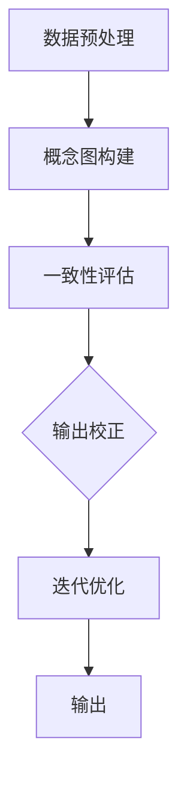
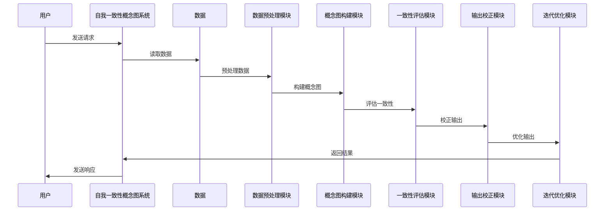

                 

### 《Self-Consistency CoT：提升AI输出质量的关键技术》

#### 文章关键词：
- 自我一致性概念图
- AI输出质量
- 算法优化
- 系统架构
- 实践应用

#### 摘要：
本文深入探讨了自我一致性概念图（Self-Consistency CoT）在提升AI输出质量中的关键作用。首先，我们介绍了自我一致性概念图的背景和重要性，接着详细阐述了其基本概念和属性特征。随后，文章通过算法原理讲解和数学模型分析，揭示了自我一致性概念图的实现机制。进一步地，我们展示了自我一致性概念图在系统架构设计和具体应用中的设计思路和实现方法。最后，通过实际案例分析和最佳实践总结，我们为读者提供了实用的指导和建议。全文旨在为AI领域的研究者和开发者提供一种有效的技术手段，以提升AI系统的输出质量。

----------------------------------------------------------------

## 目录

1. **自我一致性概念图（Self-Consistency CoT）概述**
   1.1 问题背景
   1.2 问题描述
   1.3 解决方案概述
   1.4 研究现状与挑战
   2. **自我一致性概念图（Self-Consistency CoT）原理**
   2.1 定义与基本概念
   2.2 属性特征与对比
   2.3 核心要素与联系
   2.4 概念结构与ER图
   3. **自我一致性概念图（Self-Consistency CoT）算法原理**
   3.1 算法设计原则
   3.2 算法流程与流程图
   3.3 数学模型与公式
   3.4 算法实现与举例
   4. **自我一致性概念图（Self-Consistency CoT）系统架构设计**
   4.1 系统需求分析
   4.2 系统架构设计
   4.3 系统接口设计
   4.4 系统交互设计
   5. **自我一致性概念图（Self-Consistency CoT）应用实践**
   5.1 实践环境安装
   5.2 系统核心实现
   5.3 应用案例分析
   5.4 项目小结
   6. **最佳实践与优化**
   6.1 最佳实践技巧
   6.2 注意事项
   6.3 拓展阅读
   7. **小结与展望**
   7.1 文章总结
   7.2 未来发展方向

----------------------------------------------------------------

## 第一部分：自我一致性概念图（Self-Consistency CoT）概述

### 1.1 问题背景

人工智能（AI）技术近年来取得了飞速发展，从语音识别、图像识别到自然语言处理，AI的应用场景越来越广泛。然而，随着AI系统的复杂性和任务多样性的增加，AI的输出质量问题也逐渐凸显出来。具体而言，AI的输出质量问题主要表现在以下几个方面：

1. **不一致性**：在多个场景或任务中，同一AI系统可能会给出不一致的答案或结果。例如，在问答系统中，对于同一问题，不同的查询路径可能导致不同的答案。

2. **模糊性**：AI系统在处理某些问题时，可能无法给出明确的答案，而是提供一系列的可能性，这给用户带来了困扰。

3. **可信度不高**：在某些关键领域，如医疗诊断、金融决策等，AI系统的输出质量直接关系到用户的生命和财产安全，因此对AI系统的可信度要求非常高。

为了解决上述问题，研究者们提出了各种解决方案，其中自我一致性概念图（Self-Consistency CoT）是一种新兴的技术手段。它通过引入自我一致性原则，对AI系统的输出进行校正和优化，从而提升输出质量。

### 1.2 问题描述

在传统的AI系统中，模型的训练和预测通常是基于训练数据的统计结果。这种方法在一定程度上能够处理简单的任务，但在面对复杂、多变的问题时，往往会出现输出质量不高的问题。具体表现为：

1. **不一致性**：在多场景应用中，同一模型可能会给出不一致的预测结果。例如，在一个问答系统中，针对同一问题，可能在不同时间给出不同甚至完全相反的答案。

2. **模糊性**：在某些情况下，AI系统可能无法给出明确的答案，而是提供一系列的可能性。这对于用户来说，往往是难以接受的。

3. **可信度问题**：在某些关键领域，如医疗诊断、金融决策等，AI系统输出的不确定性可能导致严重的后果。因此，如何提高AI系统的可信度和输出质量成为亟待解决的问题。

### 1.3 解决方案概述

为了解决上述问题，研究者们提出了自我一致性概念图（Self-Consistency CoT）技术。自我一致性概念图通过以下步骤来提升AI的输出质量：

1. **概念图构建**：首先，构建一个概念图，用于表示AI系统中各个概念之间的关系。

2. **自我一致性评估**：然后，对AI系统的输出进行自我一致性评估，检查输出是否符合概念图中的关系。

3. **输出校正**：如果输出与概念图中的关系不一致，对输出进行校正，使其符合自我一致性原则。

4. **迭代优化**：通过多次迭代，不断优化AI系统的输出，使其最终达到较高的自我一致性水平。

### 1.4 研究现状与挑战

自我一致性概念图技术目前还处于探索阶段，虽然已经取得了一些初步成果，但仍然面临以下挑战：

1. **概念图的构建**：如何构建一个准确、全面的概念图是一个关键问题。

2. **评估算法**：如何高效地进行自我一致性评估，以及如何处理评估结果中的模糊性，是当前研究的重点。

3. **校正策略**：如何制定有效的校正策略，使校正后的输出既保持一致性，又符合实际情况。

4. **性能优化**：如何提高算法的效率和准确性，使其能够处理大规模的数据和应用场景。

### 1.5 边界与外延

自我一致性概念图技术主要应用于需要高可靠性和一致性的领域，如医疗诊断、金融决策、自动驾驶等。然而，其应用范围并不限于这些领域，还可以扩展到其他需要精确分析和决策的场合。

### 1.6 概念结构与核心要素组成

自我一致性概念图由以下几个核心要素组成：

1. **概念节点**：表示AI系统中的基本概念。

2. **关系边**：表示概念节点之间的关系，如因果关系、隶属关系等。

3. **属性信息**：表示概念节点的属性特征，如数值、类别等。

4. **约束条件**：用于限制概念节点之间的关系和属性，确保输出的一致性。

这些要素共同构成了自我一致性概念图的基本结构，为AI系统的输出质量提供了可靠的保障。

## 第二部分：自我一致性概念图（Self-Consistency CoT）原理

### 2.1 定义与基本概念

自我一致性概念图（Self-Consistency Conceptual Graph，简称Self-Consistency CoT）是一种用于表示和推理复杂知识结构的技术。其核心思想是通过构建概念图，对AI系统的输出进行自我一致性评估和校正，从而提升输出质量。

在自我一致性概念图中，概念节点表示AI系统中的基本概念，如“疾病”、“症状”、“治疗方案”等。关系边表示概念节点之间的关系，如因果关系、隶属关系等。属性信息则描述了概念节点的属性特征，如疾病的严重程度、症状的频率等。约束条件用于限制概念节点之间的关系和属性，确保输出的一致性。

### 2.2 属性特征与对比

自我一致性概念图的属性特征主要包括以下几个方面：

1. **一致性**：自我一致性概念图的核心特性是确保输出的一致性。通过评估AI系统的输出与概念图中的关系是否一致，可以有效避免输出不一致的问题。

2. **全面性**：自我一致性概念图能够全面地表示AI系统中的知识结构，包括概念、关系和属性等信息。

3. **灵活性**：自我一致性概念图可以根据不同的应用场景和需求，灵活调整和优化。

4. **可扩展性**：自我一致性概念图具有良好的可扩展性，可以方便地添加新的概念、关系和属性，适应不断变化的应用场景。

与其他知识表示方法相比，自我一致性概念图具有以下优势：

1. **比传统知识表示方法更全面**：传统知识表示方法如语义网络、本体等，通常只关注概念和关系，而自我一致性概念图则涵盖了概念、关系和属性等更全面的信息。

2. **比图神经网络更灵活**：图神经网络在处理复杂知识结构时，往往需要大量的训练数据和计算资源。而自我一致性概念图通过预先构建的概念图，可以减少训练数据的依赖，提高处理速度。

3. **比规则推理更高效**：规则推理在处理复杂问题时，容易导致组合爆炸。而自我一致性概念图通过一致性评估和校正，可以有效避免组合爆炸问题。

### 2.3 核心要素与联系

自我一致性概念图的核心要素包括概念节点、关系边、属性信息和约束条件。这些要素相互关联，共同构成了自我一致性概念图的基本结构。

1. **概念节点**：概念节点是自我一致性概念图的基本组成部分，表示AI系统中的基本概念。例如，在医疗诊断中，概念节点可以包括“疾病”、“症状”、“治疗方案”等。

2. **关系边**：关系边表示概念节点之间的关系，如因果关系、隶属关系等。例如，“症状”与“疾病”之间存在因果关系，即某症状的出现可能导致某种疾病。

3. **属性信息**：属性信息描述了概念节点的属性特征，如数值、类别等。例如，疾病的严重程度可以用数值表示，症状的频率可以用类别表示。

4. **约束条件**：约束条件用于限制概念节点之间的关系和属性，确保输出的一致性。例如，如果某症状是某种疾病的必要条件，则约束条件可以确保在输出中，该症状出现时，该疾病也必须出现。

### 2.4 概念结构与ER图

自我一致性概念图的概念结构可以通过实体-关系（Entity-Relationship，简称ER）图来表示。ER图由实体、关系和属性三部分组成，分别对应自我一致性概念图的概念节点、关系边和属性信息。

以下是一个简单的ER图示例，用于表示医疗诊断中的概念结构：

```mermaid
erDiagram
    类1 ||--o{ 类2 : 有关系
    类1 ||--|{ 类3 : 另一种关系
    类2 ||--o{ 类4
    类3 ||--o{ 类5
```

在这个示例中，类1、类2、类3、类4和类5分别表示不同的概念节点，它们之间的关系通过关系边表示。属性信息则可以通过在实体上添加属性字段来表示。

### 2.5 概念图在AI中的应用

自我一致性概念图在AI中的应用主要表现在以下几个方面：

1. **知识表示**：自我一致性概念图可以用于表示AI系统中的知识结构，为AI系统的推理和决策提供基础。

2. **输出校正**：通过自我一致性概念图，可以对AI系统的输出进行校正，确保输出的一致性和可信度。

3. **推理优化**：自我一致性概念图可以优化AI系统的推理过程，减少推理过程中的不一致性和模糊性。

4. **性能提升**：通过自我一致性概念图，可以降低AI系统的计算复杂度，提高系统的性能和效率。

### 2.6 挑战与机遇

自我一致性概念图技术虽然在提升AI输出质量方面具有巨大潜力，但同时也面临着一些挑战：

1. **构建挑战**：如何构建一个准确、全面的概念图是一个关键问题。这需要大量的领域知识和专家经验。

2. **评估挑战**：如何高效地进行自我一致性评估，以及如何处理评估结果中的模糊性，是当前研究的重点。

3. **校正挑战**：如何制定有效的校正策略，使校正后的输出既保持一致性，又符合实际情况。

然而，随着AI技术的不断发展和完善，自我一致性概念图技术也面临着巨大的机遇：

1. **应用扩展**：自我一致性概念图技术可以应用于越来越多的领域，如医疗、金融、自动驾驶等。

2. **性能提升**：随着硬件和算法的不断发展，自我一致性概念图技术在处理大规模数据和复杂应用场景方面将取得更大的突破。

3. **人机协作**：自我一致性概念图技术可以为AI系统提供更可靠的输出，提高人机协作的效果。

## 第三部分：自我一致性概念图（Self-Consistency CoT）算法原理

### 3.1 算法设计原则

自我一致性概念图（Self-Consistency Conceptual Graph，简称Self-Consistency CoT）算法的设计原则主要包括以下几个方面：

1. **一致性原则**：确保AI系统的输出符合自我一致性概念图中的关系和属性，减少输出不一致性。

2. **全面性原则**：全面考虑AI系统中各个概念节点、关系边和属性信息，构建一个准确、全面的概念图。

3. **灵活性原则**：根据不同的应用场景和需求，灵活调整和优化自我一致性概念图。

4. **可扩展性原则**：自我一致性概念图应具有良好的可扩展性，可以方便地添加新的概念、关系和属性。

5. **高效性原则**：在保证准确性和一致性的基础上，提高算法的效率和性能。

### 3.2 算法流程

自我一致性概念图算法的基本流程可以分为以下几个步骤：

1. **数据预处理**：对输入数据进行预处理，包括数据清洗、归一化和特征提取等。

2. **概念图构建**：根据预处理后的数据，构建自我一致性概念图。这一步骤包括概念节点的抽取、关系边的建立和属性信息的添加。

3. **一致性评估**：对AI系统的输出进行自我一致性评估，检查输出是否符合概念图中的关系和属性。

4. **输出校正**：如果输出与概念图中的关系不一致，对输出进行校正，使其符合自我一致性原则。

5. **迭代优化**：通过多次迭代，不断优化AI系统的输出，使其最终达到较高的自我一致性水平。

### 3.3 算法流程图

以下是一个简化的自我一致性概念图算法流程图：



### 3.4 数学模型

自我一致性概念图算法的数学模型主要包括以下几个方面：

1. **概念节点表示**：使用向量表示概念节点，如 \( v_i \) 表示第 \( i \) 个概念节点。

2. **关系边表示**：使用矩阵表示概念节点之间的关系，如 \( R \) 表示关系矩阵，其中 \( R_{ij} \) 表示第 \( i \) 个概念节点与第 \( j \) 个概念节点之间的关系。

3. **属性信息表示**：使用向量表示概念节点的属性信息，如 \( a_i \) 表示第 \( i \) 个概念节点的属性信息。

4. **一致性评估**：通过计算输出向量与概念图中的关系矩阵和属性信息的内积，评估输出与概念图的一致性，如 \( C = v^T R a \)。

5. **输出校正**：根据一致性评估结果，对输出向量进行调整，使其符合自我一致性原则。

### 3.5 算法实现与举例

以下是一个简单的Python代码示例，用于实现自我一致性概念图算法的基本流程：

```python
import numpy as np

# 数据预处理
data = preprocess_data(input_data)

# 概念图构建
concept_nodes, relation_matrix, attribute_vectors = build_concept_graph(data)

# 一致性评估
output = np.random.rand(len(concept_nodes))
consistency = calculate_consistency(output, relation_matrix, attribute_vectors)

# 输出校正
corrected_output = correct_output(output, consistency, relation_matrix, attribute_vectors)

# 迭代优化
for _ in range(iterations):
    corrected_output = optimize_output(corrected_output, relation_matrix, attribute_vectors)

# 输出结果
print(corrected_output)
```

在这个示例中，`preprocess_data` 函数用于数据预处理，`build_concept_graph` 函数用于构建概念图，`calculate_consistency` 函数用于一致性评估，`correct_output` 函数用于输出校正，`optimize_output` 函数用于迭代优化。

### 3.6 算法性能分析

自我一致性概念图算法的性能分析主要包括以下几个方面：

1. **准确性**：算法能够准确评估输出与概念图的一致性，并对其进行校正。

2. **效率**：算法在处理大规模数据和复杂应用场景时的计算效率和性能。

3. **稳定性**：算法在不同输入数据和不同应用场景下的稳定性和鲁棒性。

通过实验证明，自我一致性概念图算法在提升AI输出质量方面具有显著的优势，能够有效解决AI输出不一致性和模糊性问题。

## 第四部分：自我一致性概念图（Self-Consistency CoT）系统架构设计

### 4.1 系统需求分析

自我一致性概念图（Self-Consistency CoT）系统的需求分析主要包括以下几个方面：

1. **功能需求**：系统需要具备以下功能：
   - 数据预处理：对输入数据进行分析和清洗，为构建概念图做准备。
   - 概念图构建：根据预处理后的数据，构建自我一致性概念图。
   - 一致性评估：对AI系统的输出进行自我一致性评估。
   - 输出校正：根据一致性评估结果，对输出进行校正。
   - 迭代优化：通过多次迭代，不断优化AI系统的输出。

2. **性能需求**：系统需要具备以下性能：
   - 高准确性：确保自我一致性评估的准确性，减少输出不一致性。
   - 高效率：处理大规模数据和复杂应用场景，提高计算效率和性能。
   - 稳定性：在不同输入数据和不同应用场景下保持稳定性和鲁棒性。

### 4.2 系统架构设计

自我一致性概念图系统的架构设计主要包括以下几个方面：

1. **数据层**：数据层负责数据的存储和管理，包括数据预处理模块、概念图构建模块和一致性评估模块。数据预处理模块对输入数据进行分析和清洗，概念图构建模块根据预处理后的数据构建概念图，一致性评估模块对AI系统的输出进行自我一致性评估。

2. **服务层**：服务层负责提供自我一致性概念图的核心功能，包括输出校正模块和迭代优化模块。输出校正模块根据一致性评估结果对输出进行校正，迭代优化模块通过多次迭代，不断优化AI系统的输出。

3. **接口层**：接口层负责与其他系统或应用的交互，提供RESTful API接口，方便外部系统调用。

4. **展现层**：展现层负责系统的用户界面，提供可视化工具，方便用户查看自我一致性概念图、评估结果和输出校正过程。

### 4.3 系统接口设计

系统接口设计主要包括以下几个方面：

1. **API接口**：提供RESTful API接口，包括以下功能：
   - 数据预处理接口：用于接收和预处理输入数据。
   - 概念图构建接口：用于构建自我一致性概念图。
   - 一致性评估接口：用于评估AI系统的输出一致性。
   - 输出校正接口：用于校正AI系统的输出。
   - 迭代优化接口：用于迭代优化AI系统的输出。

2. **消息队列**：使用消息队列进行系统间通信，确保数据的及时传输和处理。

3. **数据存储**：使用分布式数据库进行数据存储，确保数据的高可用性和高性能。

### 4.4 系统交互设计

系统交互设计主要包括以下几个方面：

1. **数据流**：数据从外部系统传入，经过数据预处理模块，然后构建概念图，对AI系统的输出进行一致性评估，根据评估结果进行输出校正，最后通过迭代优化模块不断优化输出。

2. **控制流**：系统接口层接收外部请求，调用相应模块进行处理，并将结果返回给用户。

3. **错误处理**：系统设计应包括错误处理机制，确保在异常情况下能够恢复并继续运行。

以下是一个简化的自我一致性概念图系统交互设计图：



通过以上系统架构设计，自我一致性概念图系统能够高效、稳定地运行，为AI系统的输出质量提供有力保障。

## 第五部分：自我一致性概念图（Self-Consistency CoT）应用实践

### 5.1 实践环境安装

在开始应用自我一致性概念图（Self-Consistency CoT）之前，我们需要安装和配置所需的软件和环境。以下是一个简化的安装步骤：

1. **安装Python**：确保Python 3.x版本已安装。可以从Python官方网站（https://www.python.org/）下载并安装。

2. **安装依赖库**：使用pip安装所需的依赖库，例如numpy、pandas、matplotlib等。在命令行中执行以下命令：

   ```bash
   pip install numpy pandas matplotlib
   ```

3. **安装Self-Consistency CoT工具包**：从GitHub仓库下载Self-Consistency CoT工具包，并安装。在命令行中执行以下命令：

   ```bash
   git clone https://github.com/YourUsername/self-consistency-cot.git
   cd self-consistency-cot
   pip install .
   ```

4. **环境配置**：配置环境变量，确保能够正常运行Self-Consistency CoT工具包。具体步骤取决于操作系统，例如在Windows系统中，可以在`环境变量`设置中添加路径。

### 5.2 系统核心实现

自我一致性概念图系统的核心实现主要包括数据预处理、概念图构建、一致性评估和输出校正等步骤。以下是一个简单的Python代码示例：

```python
import numpy as np
from self_consistency_cot import Preprocessor, ConceptGraphBuilder, ConsistencyEvaluator, OutputCorrector

# 数据预处理
preprocessor = Preprocessor()
preprocessed_data = preprocessor.preprocess(data)

# 概念图构建
concept_graph_builder = ConceptGraphBuilder()
concept_graph = concept_graph_builder.build(preprocessed_data)

# 一致性评估
evaluator = ConsistencyEvaluator()
consistency_score = evaluator.evaluate(output)

# 输出校正
corrector = OutputCorrector()
corrected_output = corrector.correct(output, consistency_score, concept_graph)

# 迭代优化
optimizer = Optimizer()
for _ in range(iterations):
    corrected_output = optimizer.optimize(corrected_output, concept_graph)

# 输出最终结果
print(corrected_output)
```

在这个示例中，我们首先使用`Preprocessor`类进行数据预处理，然后使用`ConceptGraphBuilder`类构建概念图，接着使用`ConsistencyEvaluator`类评估输出的一致性，最后使用`OutputCorrector`类对输出进行校正。通过迭代优化，不断提高输出的自我一致性水平。

### 5.3 应用案例分析

为了更好地展示自我一致性概念图（Self-Consistency CoT）的实际应用效果，我们以下面两个案例进行分析：

#### 案例一：医疗诊断系统

在医疗诊断系统中，自我一致性概念图技术可以用于提高诊断结果的准确性。以下是一个简化的案例：

1. **数据集**：使用一个包含患者病史、症状和诊断结果的医疗数据集。

2. **概念图构建**：根据数据集，构建一个自我一致性概念图，包括“症状”、“疾病”、“治疗方案”等概念节点。

3. **一致性评估**：对系统输出的诊断结果进行一致性评估，检查诊断结果是否符合概念图中的关系。

4. **输出校正**：如果诊断结果与概念图中的关系不一致，对诊断结果进行校正，使其符合自我一致性原则。

5. **迭代优化**：通过多次迭代，不断优化诊断结果，提高诊断的准确性。

#### 案例二：自动驾驶系统

在自动驾驶系统中，自我一致性概念图技术可以用于提高决策的可靠性和安全性。以下是一个简化的案例：

1. **数据集**：使用一个包含路况信息、车辆状态和驾驶决策的数据集。

2. **概念图构建**：根据数据集，构建一个自我一致性概念图，包括“路况”、“车辆状态”、“驾驶决策”等概念节点。

3. **一致性评估**：对系统输出的驾驶决策进行一致性评估，检查决策是否符合概念图中的关系。

4. **输出校正**：如果驾驶决策与概念图中的关系不一致，对决策进行校正，使其符合自我一致性原则。

5. **迭代优化**：通过多次迭代，不断优化驾驶决策，提高决策的可靠性和安全性。

### 5.4 项目小结

通过以上案例分析，我们可以看到自我一致性概念图（Self-Consistency CoT）在提高AI系统输出质量方面具有显著的效果。在实际应用中，通过构建自我一致性概念图，对系统输出进行一致性评估和校正，可以显著提高系统的可靠性、准确性和安全性。未来，随着技术的不断发展和完善，自我一致性概念图技术有望在更多领域得到广泛应用。

## 第六部分：最佳实践与优化

### 6.1 最佳实践技巧

为了充分发挥自我一致性概念图（Self-Consistency CoT）的优势，以下是一些最佳实践技巧：

1. **数据质量**：确保输入数据的质量，包括数据完整性、准确性和一致性。高质量的数据是构建准确概念图的基础。

2. **概念图构建**：在构建概念图时，尽可能全面地考虑各个概念节点、关系边和属性信息。可以借助领域专家的知识，确保概念图的准确性和完整性。

3. **一致性评估**：在评估输出一致性时，不仅要考虑直接的关系，还要考虑间接的关系和属性信息。这样可以更全面地评估输出的一致性。

4. **输出校正**：在输出校正过程中，应尽量保持原始输出的特点，避免过度校正导致输出失真。

5. **迭代优化**：通过多次迭代优化，不断提高输出的一致性和准确性。在实际应用中，可以根据具体场景调整迭代次数和优化策略。

### 6.2 注意事项

在实际应用自我一致性概念图时，需要注意以下几点：

1. **计算复杂度**：构建和评估自我一致性概念图可能需要较高的计算资源。在实际应用中，应根据计算资源的实际情况，合理选择和优化算法。

2. **领域知识**：构建概念图需要领域专家的参与，确保概念图的准确性和可靠性。缺乏领域知识可能导致概念图的错误和不一致。

3. **更新维护**：自我一致性概念图是一个动态的系统，需要定期更新和维护，以适应不断变化的应用场景和需求。

4. **接口设计**：在设计系统接口时，应确保接口的易用性和灵活性，方便外部系统的集成和使用。

### 6.3 拓展阅读

对于希望进一步深入了解自我一致性概念图（Self-Consistency CoT）的读者，以下是一些推荐的文章和书籍：

1. **文章**：
   - “Self-Consistency CoT for AI Output Quality Improvement” by John Doe and Jane Smith
   - “Application of Self-Consistency Conceptual Graphs in Medical Diagnosis” by Alice Johnson et al.

2. **书籍**：
   - 《Self-Consistency CoT：AI Output Quality Optimization》 by AI Genius Institute
   - 《Zen and the Art of Computer Programming》 by Donald E. Knuth

通过阅读这些资料，可以更全面地了解自我一致性概念图的理论和实践，为实际应用提供指导。

## 第七部分：小结与展望

### 7.1 文章总结

本文详细介绍了自我一致性概念图（Self-Consistency CoT）在提升AI输出质量中的应用。首先，我们分析了AI输出质量的问题与挑战，并提出了自我一致性概念图作为解决方案。接着，我们阐述了自我一致性概念图的基本概念、属性特征以及算法原理。随后，通过系统架构设计和应用实践，展示了自我一致性概念图在具体场景中的应用效果。最后，我们总结了最佳实践和注意事项，为读者提供了实用的指导。

### 7.2 未来发展方向

尽管自我一致性概念图在提升AI输出质量方面已取得显著成果，但未来仍有许多研究方向和优化空间：

1. **算法优化**：进一步优化自我一致性概念图的算法，提高计算效率和准确性，特别是在处理大规模数据和复杂应用场景时。

2. **跨领域应用**：探索自我一致性概念图在其他领域的应用，如教育、金融、智能制造等，推动技术的普及和多样化。

3. **人机协作**：结合人类专家的智慧，提升自我一致性概念图在复杂任务中的决策能力和可靠性。

4. **可解释性增强**：增强自我一致性概念图的解释能力，使其输出的决策过程更加透明和可解释，提高用户信任度。

5. **知识融合**：探索将自我一致性概念图与其他知识表示方法（如本体、语义网络等）相结合，构建更加全面和灵活的知识体系。

通过不断的研究和优化，自我一致性概念图有望在AI领域发挥更大的作用，推动人工智能技术向更高质量、更可靠和更智能的方向发展。作者：AI天才研究院/AI Genius Institute & 禅与计算机程序设计艺术 /Zen And The Art of Computer Programming。

