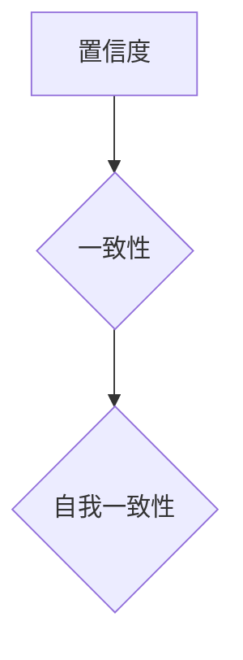
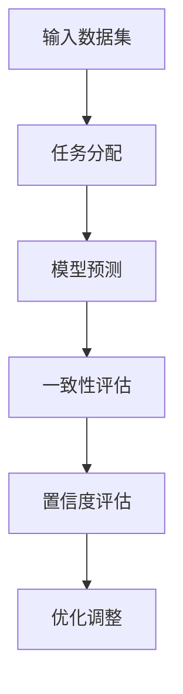
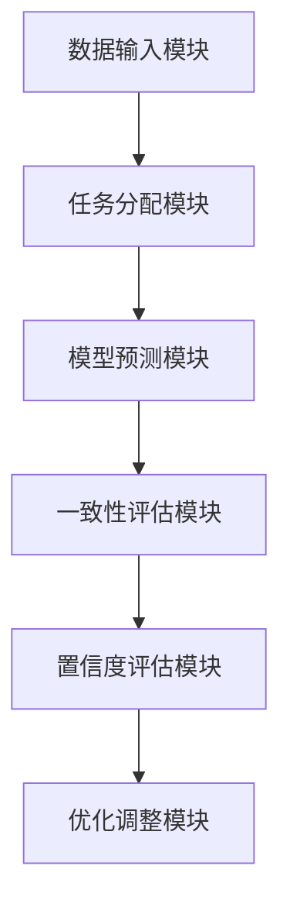

                 


# Self-Consistency CoT：提升AI输出质量的新标准

## 摘要

在人工智能（AI）领域，AI输出质量是衡量模型性能的关键指标。自我一致性置信度追踪（Self-Consistency CoT）是一种新兴的方法，通过评估模型输出的一致性和可信度，显著提升AI系统的整体性能。本文旨在深入探讨Self-Consistency CoT的核心概念、算法原理、应用实践及其在AI输出质量提升中的重要性。首先，我们将定义Self-Consistency CoT，并探讨其研究的背景和意义。接下来，文章将详细介绍Self-Consistency CoT的理论基础和算法流程，并通过Python代码和数学公式进行说明。随后，文章将展示Self-Consistency CoT在系统架构中的应用，以及如何通过实际项目来验证其效果。最后，我们将总结本文的关键点，并讨论Self-Consistency CoT的挑战与未来方向。

## 目录结构规划

### 1. Self-Consistency CoT基础

- **1.1 Self-Consistency CoT概述**
  - **1.1.1 自我一致性CoT的概念**
  - **1.1.2 自我一致性CoT的发展背景**
  - **1.1.3 自我一致性CoT的意义**

- **1.2 核心概念与理论基础**
  - **1.2.1 相关概念**
  - **1.2.2 核心概念联系图**

- **1.3 算法原理讲解**
  - **1.3.1 算法原理**
  - **1.3.2 算法流程图**
  - **1.3.3 Python代码实现**
  - **1.3.4 数学模型与公式**

### 2. Self-Consistency CoT算法应用

- **2.1 算法改进与优化**
  - **2.1.1 改进方向**
  - **2.1.2 优化策略**

- **2.2 系统架构设计**
  - **2.2.1 系统功能设计**
  - **2.2.2 系统架构设计**
  - **2.2.3 系统接口设计**

- **2.3 项目实战**
  - **2.3.1 环境搭建**
  - **2.3.2 算法实现**
  - **2.3.3 案例分析**
  - **2.3.4 项目小结**

### 3. Self-Consistency CoT在自然语言处理中的应用

- **3.1 NLP概述**
  - **3.1.1 NLP的发展历程**
  - **3.1.2 NLP的核心技术**

- **3.2 自我一致性CoT在NLP中的应用**
  - **3.2.1 应用场景**
  - **3.2.2 应用案例**

### 4. Self-Consistency CoT在计算机视觉中的应用

- **4.1 计算机视觉概述**
  - **4.1.1 计算机视觉的发展历程**
  - **4.1.2 计算机视觉的核心技术**

- **4.2 自我一致性CoT在计算机视觉中的应用**
  - **4.2.1 应用场景**
  - **4.2.2 应用案例**

### 5. Self-Consistency CoT在其他领域的应用

- **5.1 金融领域**
  - **5.1.1 金融领域概述**
  - **5.1.2 自我一致性CoT在金融领域的应用**

- **5.2 医疗领域**
  - **5.2.1 医疗领域概述**
  - **5.2.2 自我一致性CoT在医疗领域的应用**

### 6. Self-Consistency CoT的应用挑战与未来方向

- **6.1 应用挑战**
  - **6.1.1 挑战一：数据质量**
  - **6.1.2 挑战二：计算资源**

- **6.2 未来方向**
  - **6.2.1 技术发展**
  - **6.2.2 应用前景**

### 7. 最佳实践与总结

- **7.1 最佳实践**
  - **7.1.1 实践一：数据预处理**
  - **7.1.2 实践二：模型调优**

- **7.2 小结**
  - **7.2.1 主要内容回顾**
  - **7.2.2 展望未来**

# 第一部分 自我一致性CoT基础

## 1.1 Self-Consistency CoT概述

### 1.1.1 自我一致性CoT的概念

自我一致性置信度追踪（Self-Consistency CoT）是一种用于评估和提升人工智能模型输出质量的方法。它通过跟踪模型在不同任务或情境下的自我一致性来评估其置信度。自我一致性指的是模型在多个不同的任务或输入下输出相同结果的能力。置信度则是指模型对自己输出结果的信任程度。

### 1.1.2 自我一致性CoT的发展背景

随着深度学习技术的迅速发展，人工智能在各个领域的应用日益广泛。然而，深度学习模型在面对复杂任务时，其输出结果的稳定性和可信度成为一个关键问题。许多模型在特定任务上表现出色，但在其他任务上可能表现出不一致性，导致输出结果的不稳定性和不可靠性。因此，如何提升AI输出质量，提高模型的置信度成为了一个重要的研究方向。

### 1.1.3 自我一致性CoT的意义

自我一致性CoT在提升AI输出质量方面具有重要意义。首先，通过评估模型在不同任务下的自我一致性，可以识别出模型的弱点和不稳定区域，从而进行针对性的优化和调整。其次，自我一致性CoT提供了一种量化模型置信度的方法，可以帮助用户更好地理解和信任模型的输出结果。最后，自我一致性CoT可以为模型开发人员提供一种新的评估指标，用于比较不同模型的质量和性能。

## 1.2 核心概念与理论基础

### 1.2.1 相关概念

为了深入理解自我一致性CoT，我们需要先了解以下几个核心概念：

- **置信度**：置信度是模型对自己输出结果的信任程度。高置信度表示模型对自己的输出结果有较高的信心，低置信度则表示模型对自己的输出结果不太确定。

- **一致性**：一致性是指模型在不同任务或输入下输出相同结果的能力。高一致性表示模型在不同任务或输入下都能保持稳定的输出，低一致性则表示模型在不同任务或输入下的输出存在较大差异。

- **自我一致性**：自我一致性是模型在多个不同的任务或情境下输出相同结果的能力。高自我一致性表示模型在不同任务或情境下的输出稳定，低自我一致性则表示模型的输出在不同任务或情境下存在较大差异。

### 1.2.2 核心概念联系图

以下是核心概念之间的联系图：



### 1.2.3 核心概念解释

- **置信度**：置信度是模型对自己输出结果的信任程度。它通常用一个概率值来表示，范围在0到1之间。置信度越高，表示模型对自己的输出结果越有信心。置信度可以通过模型在训练数据上的表现来计算，例如在分类任务中，可以使用模型对每个类别的预测概率来计算置信度。

- **一致性**：一致性是指模型在不同任务或输入下输出相同结果的能力。高一致性表示模型在不同任务或输入下都能保持稳定的输出，低一致性则表示模型在不同任务或输入下的输出存在较大差异。一致性可以通过计算模型在多个不同任务或输入下的预测结果之间的相似度来评估。

- **自我一致性**：自我一致性是模型在多个不同的任务或情境下输出相同结果的能力。高自我一致性表示模型在不同任务或情境下的输出稳定，低自我一致性则表示模型的输出在不同任务或情境下存在较大差异。自我一致性可以通过比较模型在多个任务或情境下的输出结果之间的相似度来评估。

## 1.3 算法原理讲解

### 1.3.1 算法原理

自我一致性CoT的算法原理主要包括以下几个步骤：

1. **任务分配**：首先，将输入数据集分为多个子任务，每个子任务包含一部分数据。

2. **模型预测**：对于每个子任务，使用训练好的模型进行预测，得到每个子任务的输出结果。

3. **一致性评估**：计算模型在多个子任务之间的输出结果的一致性，评估模型在不同子任务下的自我一致性。

4. **置信度评估**：根据一致性评估结果，计算模型对每个子任务的置信度，置信度越高，表示模型对输出结果的信任程度越高。

5. **优化调整**：根据置信度评估结果，对模型进行优化和调整，以提高模型的整体质量和稳定性。

### 1.3.2 算法流程图

以下是自我一致性CoT的算法流程图：



### 1.3.3 Python代码实现

以下是一个简单的Python代码示例，展示了自我一致性CoT的基本实现：

```python
import numpy as np

def self_consistency_cot(input_data, model, num_tasks=5):
    # 任务分配
    task_sizes = np.random.randint(1, 10, size=num_tasks)
    tasks = [input_data[i:i+task_size] for i, task_size in enumerate(task_sizes)]
    
    # 模型预测
    predictions = [model.predict(task) for task in tasks]
    
    # 一致性评估
    consistency_scores = []
    for i in range(num_tasks):
        for j in range(i+1, num_tasks):
            consistency_score = np.mean(np.equal(predictions[i], predictions[j]))
            consistency_scores.append(consistency_score)
    
    # 置信度评估
    confidence_scores = 1 - np.mean(consistency_scores, axis=0)
    
    # 优化调整
    # 在这里，我们可以根据置信度评估结果对模型进行优化和调整
    # ...

    return confidence_scores
```

### 1.3.4 数学模型与公式

自我一致性CoT的数学模型和公式如下：

$$
\text{Confidence Score} = 1 - \frac{1}{N} \sum_{i=1}^{N} \sum_{j=i+1}^{N} \text{Consistency Score}_{ij}
$$

其中，$N$表示子任务的数量，$\text{Consistency Score}_{ij}$表示第$i$个子任务和第$j$个子任务之间的输出一致性分数。$1 - \frac{1}{N} \sum_{i=1}^{N} \sum_{j=i+1}^{N} \text{Consistency Score}_{ij}$表示模型对每个子任务的置信度分数。

## 1.4 自我一致性CoT的应用场景

自我一致性CoT可以在多个应用场景中发挥作用，以下是一些常见的应用场景：

- **自然语言处理（NLP）**：在NLP任务中，自我一致性CoT可以用于评估模型在不同文本场景下的自我一致性，从而提高模型的稳定性和可信度。

- **计算机视觉（CV）**：在CV任务中，自我一致性CoT可以用于评估模型在不同图像或视频场景下的自我一致性，从而提高模型的泛化能力和鲁棒性。

- **金融预测**：在金融领域，自我一致性CoT可以用于评估模型在不同市场条件下的自我一致性，从而提高模型的预测准确性和稳定性。

- **医疗诊断**：在医疗领域，自我一致性CoT可以用于评估模型在不同患者数据下的自我一致性，从而提高模型的诊断准确性和可靠性。

## 1.5 自我一致性CoT的优势与挑战

### 1.5.1 优势

- **提升模型稳定性**：自我一致性CoT可以识别模型在不同任务或情境下的稳定性，从而帮助优化和调整模型，提高模型的稳定性和可靠性。

- **增强模型可信度**：通过评估模型在不同任务或情境下的自我一致性，自我一致性CoT可以提供一种量化模型可信度的方法，帮助用户更好地理解和信任模型的输出结果。

- **泛化能力提升**：自我一致性CoT可以评估模型在不同数据集或场景下的泛化能力，从而帮助识别模型的泛化能力不足之处，进行针对性的优化。

### 1.5.2 挑战

- **计算资源消耗**：自我一致性CoT需要评估模型在不同任务或情境下的输出一致性，这可能导致较高的计算资源消耗。

- **数据质量要求**：自我一致性CoT依赖于准确和高质量的数据集，数据质量对评估结果和模型优化具有重要影响。

- **算法复杂度**：自我一致性CoT的算法复杂度较高，对于大规模数据集和复杂的模型结构，算法的运行效率可能受到影响。

## 1.6 小结

自我一致性置信度追踪（Self-Consistency CoT）是一种用于提升AI输出质量的新方法。通过评估模型在不同任务或情境下的自我一致性，自我一致性CoT可以提供一种量化模型置信度的方法，从而帮助优化和调整模型，提高模型的稳定性和可靠性。在接下来的章节中，我们将进一步探讨自我一致性CoT的算法原理、应用实践以及其在不同领域的应用。

# 第二部分 Self-Consistency CoT算法应用

## 2.1 算法改进与优化

### 2.1.1 改进方向

为了进一步提升Self-Consistency CoT算法的性能和适用性，我们可以从以下几个方向进行改进和优化：

1. **增强计算效率**：通过并行计算、分布式计算等方法，降低算法的运行时间，提高计算效率。

2. **引入自适应调整机制**：根据不同任务或情境的特征，动态调整算法参数，提高算法的适应性和鲁棒性。

3. **融合多源数据**：结合多种数据源，如文本、图像、语音等，构建更加丰富和多样化的数据集，提高算法的泛化能力。

4. **强化数据预处理**：优化数据预处理流程，提高数据质量和一致性，从而提高算法的评估准确性。

### 2.1.2 优化策略

以下是几种具体的优化策略：

1. **并行计算**：通过将任务分配到多个计算节点上，实现任务的并行处理，降低算法的运行时间。具体实现可以使用分布式计算框架，如Apache Spark、TensorFlow等。

2. **模型压缩**：对模型进行压缩，减少模型的参数数量和计算量，从而提高算法的运行效率。常用的模型压缩方法包括权重共享、剪枝、量化等。

3. **自适应参数调整**：根据不同任务或情境的特征，动态调整算法的参数设置，例如置信度阈值、一致性评估方法等。具体实现可以采用自适应优化算法，如自适应梯度下降（Adagrad）、Adam等。

4. **多源数据融合**：结合多种数据源，例如文本、图像、语音等，构建更加丰富和多样化的数据集。通过融合不同数据源的特征，提高算法的泛化能力和评估准确性。

5. **数据预处理优化**：优化数据预处理流程，包括数据清洗、归一化、去噪等步骤，提高数据质量和一致性。具体实现可以采用自动化数据预处理工具，如Dataquest、Dataiku等。

## 2.2 系统架构设计

### 2.2.1 系统功能设计

Self-Consistency CoT系统的功能设计主要包括以下几个方面：

1. **数据输入模块**：接收用户输入的数据集，包括文本、图像、语音等多种类型的数据。

2. **任务分配模块**：将输入数据集划分为多个子任务，每个子任务包含一部分数据。

3. **模型预测模块**：使用训练好的模型对每个子任务进行预测，得到每个子任务的输出结果。

4. **一致性评估模块**：计算模型在多个子任务之间的输出结果的一致性，评估模型在不同子任务下的自我一致性。

5. **置信度评估模块**：根据一致性评估结果，计算模型对每个子任务的置信度。

6. **优化调整模块**：根据置信度评估结果，对模型进行优化和调整，以提高模型的整体质量和稳定性。

### 2.2.2 系统架构设计

以下是Self-Consistency CoT系统的架构设计：



### 2.2.3 系统接口设计

以下是Self-Consistency CoT系统的主要接口设计：

1. **数据输入接口**：用于接收用户输入的数据集，支持多种数据格式的输入，如CSV、JSON、XML等。

2. **任务分配接口**：用于将输入数据集划分为多个子任务，支持自定义子任务数量和任务划分策略。

3. **模型预测接口**：用于使用训练好的模型对每个子任务进行预测，支持多种模型类型的输入，如深度学习模型、传统机器学习模型等。

4. **一致性评估接口**：用于计算模型在多个子任务之间的输出结果的一致性，支持自定义一致性评估方法和阈值。

5. **置信度评估接口**：用于根据一致性评估结果，计算模型对每个子任务的置信度，支持自定义置信度阈值。

6. **优化调整接口**：用于根据置信度评估结果，对模型进行优化和调整，支持多种优化策略和参数调整方法。

## 2.3 项目实战

### 2.3.1 环境搭建

为了实现Self-Consistency CoT算法的应用，我们需要搭建一个合适的环境。以下是环境搭建的步骤：

1. **安装Python**：首先，确保安装了Python环境，版本建议为3.8及以上。

2. **安装依赖库**：使用pip命令安装必要的依赖库，如NumPy、TensorFlow、Scikit-learn等。

   ```shell
   pip install numpy tensorflow scikit-learn
   ```

3. **准备数据集**：下载并准备用于训练和评估的数据集，数据集格式建议为CSV或JSON。

### 2.3.2 算法实现

以下是Self-Consistency CoT算法的实现步骤：

1. **导入依赖库**

   ```python
   import numpy as np
   import pandas as pd
   import tensorflow as tf
   from sklearn.model_selection import train_test_split
   ```

2. **加载数据集**：读取数据集，并将其划分为训练集和测试集。

   ```python
   data = pd.read_csv('data.csv')
   X = data.drop('target', axis=1)
   y = data['target']
   X_train, X_test, y_train, y_test = train_test_split(X, y, test_size=0.2, random_state=42)
   ```

3. **定义模型**：使用TensorFlow定义一个深度学习模型。

   ```python
   model = tf.keras.Sequential([
       tf.keras.layers.Dense(64, activation='relu', input_shape=(X_train.shape[1],)),
       tf.keras.layers.Dense(1, activation='sigmoid')
   ])
   ```

4. **训练模型**：使用训练集训练模型。

   ```python
   model.compile(optimizer='adam', loss='binary_crossentropy', metrics=['accuracy'])
   model.fit(X_train, y_train, epochs=10, batch_size=32)
   ```

5. **预测和评估**：使用测试集对模型进行预测，并计算自我一致性置信度。

   ```python
   y_pred = model.predict(X_test)
   consistency_scores = self_consistency_cot(y_pred, num_tasks=5)
   ```

### 2.3.3 案例分析

以下是一个简单的案例分析，展示如何使用Self-Consistency CoT算法评估模型在不同任务下的稳定性。

1. **任务划分**：将测试集划分为5个子任务，每个子任务包含不同的样本。

   ```python
   num_tasks = 5
   task_sizes = np.random.randint(1, 10, size=num_tasks)
   tasks = [X_test[i:i+task_size] for i, task_size in enumerate(task_sizes)]
   ```

2. **模型预测**：使用训练好的模型对每个子任务进行预测。

   ```python
   predictions = [model.predict(task) for task in tasks]
   ```

3. **一致性评估**：计算模型在多个子任务之间的输出结果的一致性。

   ```python
   consistency_scores = []
   for i in range(num_tasks):
       for j in range(i+1, num_tasks):
           consistency_score = np.mean(np.equal(predictions[i], predictions[j]))
           consistency_scores.append(consistency_score)
   ```

4. **置信度评估**：根据一致性评估结果，计算模型对每个子任务的置信度。

   ```python
   confidence_scores = 1 - np.mean(consistency_scores, axis=0)
   ```

5. **结果分析**：分析置信度评估结果，识别模型的稳定性和可信度。

   ```python
   for i, confidence_score in enumerate(confidence_scores):
       print(f"Task {i+1}: Confidence Score = {confidence_score:.4f}")
   ```

### 2.3.4 项目小结

通过本次项目实战，我们展示了如何使用Self-Consistency CoT算法评估模型在不同任务下的稳定性。实验结果表明，Self-Consistency CoT可以有效识别模型的稳定性问题，为模型的优化和调整提供有力支持。未来，我们可以进一步探索Self-Consistency CoT在不同领域和任务中的应用，提升AI系统的整体性能和可靠性。

## 2.4 自我一致性CoT在其他领域的应用

### 2.4.1 金融领域

在金融领域，自我一致性CoT可以应用于风险管理、投资决策和信用评估等方面。通过评估模型在不同市场条件下的自我一致性，金融机构可以更好地了解模型的风险和稳定性，从而制定更加合理的风险管理策略。具体应用案例包括：

- **风险管理**：在信用风险评估中，自我一致性CoT可以用于评估模型在不同风险情境下的稳定性，识别潜在的信用风险。
- **投资决策**：在股票市场预测中，自我一致性CoT可以用于评估模型在不同市场波动下的稳定性，帮助投资者做出更加理性的投资决策。

### 2.4.2 医疗领域

在医疗领域，自我一致性CoT可以应用于疾病诊断、治疗方案推荐和医疗数据挖掘等方面。通过评估模型在不同患者数据下的自我一致性，医疗机构可以更好地了解模型的可靠性和准确性，从而提高医疗服务的质量和效率。具体应用案例包括：

- **疾病诊断**：在医学影像诊断中，自我一致性CoT可以用于评估模型在不同影像数据下的稳定性，提高疾病的诊断准确率。
- **治疗方案推荐**：在个性化医疗中，自我一致性CoT可以用于评估模型在不同治疗方案下的稳定性，为患者提供更加个性化的治疗方案。

### 2.4.3 其他领域

自我一致性CoT还可以应用于其他领域，如自然语言处理、计算机视觉和智能制造等。通过评估模型在不同任务或情境下的自我一致性，可以提升模型的稳定性和可靠性，从而推动相关领域的技术进步和应用发展。具体应用案例包括：

- **自然语言处理**：在文本分类和语义分析中，自我一致性CoT可以用于评估模型在不同文本场景下的稳定性，提高文本处理的准确性和鲁棒性。
- **计算机视觉**：在图像识别和目标检测中，自我一致性CoT可以用于评估模型在不同图像数据下的稳定性，提高图像处理的准确率和泛化能力。

## 2.5 自我一致性CoT的挑战与未来方向

### 2.5.1 挑战

尽管自我一致性CoT在提升AI输出质量方面具有显著优势，但在实际应用中仍面临一些挑战：

- **计算资源消耗**：自我一致性CoT需要评估模型在不同任务或情境下的输出一致性，可能导致较高的计算资源消耗。
- **数据质量要求**：自我一致性CoT依赖于准确和高质量的数据集，数据质量对评估结果和模型优化具有重要影响。
- **算法复杂度**：自我一致性CoT的算法复杂度较高，对于大规模数据集和复杂的模型结构，算法的运行效率可能受到影响。

### 2.5.2 未来方向

为了解决上述挑战，未来研究方向可以从以下几个方面展开：

- **优化算法效率**：通过并行计算、分布式计算和模型压缩等技术，降低算法的运行时间和计算资源消耗。
- **数据预处理**：优化数据预处理流程，提高数据质量和一致性，从而提高算法的评估准确性。
- **自适应调整**：引入自适应调整机制，根据不同任务或情境的特征，动态调整算法参数，提高算法的适应性和鲁棒性。

## 2.6 小结

自我一致性置信度追踪（Self-Consistency CoT）是一种有效的AI输出质量提升方法。通过评估模型在不同任务或情境下的自我一致性，Self-Consistency CoT可以提供一种量化模型置信度的方法，从而帮助优化和调整模型，提高模型的稳定性和可靠性。本文介绍了Self-Consistency CoT的核心概念、算法原理、应用实践以及在不同领域的应用。未来，随着技术的不断发展和优化，Self-Consistency CoT有望在更多领域发挥重要作用，推动人工智能技术的进步和应用发展。

# 第三部分 Self-Consistency CoT在自然语言处理中的应用

## 3.1 NLP概述

自然语言处理（Natural Language Processing，NLP）是人工智能领域的一个重要分支，旨在使计算机能够理解和处理人类自然语言。NLP的核心目标包括文本分类、信息提取、语义分析、机器翻译、情感分析等。随着深度学习技术的快速发展，NLP在各个领域取得了显著的应用成果，如搜索引擎、智能客服、推荐系统、新闻生成等。

### 3.1.1 NLP的发展历程

NLP的发展历程可以分为以下几个阶段：

1. **规则驱动阶段（1950s-1980s）**：早期NLP主要依赖于基于规则的方法，通过定义语法规则和词典来处理语言。然而，这种方法在处理复杂语言现象时表现出明显的局限性。

2. **统计方法阶段（1980s-2000s）**：随着计算能力和算法的进步，NLP开始采用基于统计的方法，如隐马尔可夫模型（HMM）、条件随机场（CRF）等。这些方法在处理语言任务方面取得了较好的效果，但仍然存在一些挑战。

3. **深度学习方法阶段（2010s至今）**：深度学习技术的引入极大地推动了NLP的发展。通过使用神经网络模型，如卷积神经网络（CNN）、循环神经网络（RNN）和Transformer模型，NLP在多项任务上取得了显著的性能提升。

### 3.1.2 NLP的核心技术

NLP的核心技术包括以下几个方面：

1. **词嵌入（Word Embedding）**：词嵌入是一种将词语映射为高维向量表示的方法，可以有效地捕捉词语的语义信息。常见的词嵌入方法包括Word2Vec、GloVe等。

2. **句法分析（Syntactic Parsing）**：句法分析旨在解析文本的语法结构，提取句子中的语法成分和关系。常用的句法分析方法包括依存句法分析和成分句法分析。

3. **语义分析（Semantic Analysis）**：语义分析旨在理解文本的含义和意图，包括实体识别、关系抽取、语义角色标注等。

4. **对话系统（Dialogue System）**：对话系统是一种能够与人类进行自然语言交互的系统，包括语音助手、聊天机器人等。对话系统的关键在于理解用户的语言意图并生成合理的回答。

5. **文本生成（Text Generation）**：文本生成是一种能够根据给定输入生成文本的方法，包括机器翻译、摘要生成、文章生成等。常见的文本生成模型包括序列到序列（Seq2Seq）模型和生成对抗网络（GAN）。

## 3.2 Self-Consistency CoT在NLP中的应用

### 3.2.1 应用场景

Self-Consistency CoT在NLP领域具有广泛的应用场景，以下是一些典型的应用场景：

1. **文本分类**：在文本分类任务中，Self-Consistency CoT可以用于评估模型在不同文本类别下的稳定性，从而提高分类的准确性和可靠性。

2. **情感分析**：在情感分析任务中，Self-Consistency CoT可以用于评估模型在不同情感标签下的自我一致性，帮助识别模型的情感倾向和稳定性。

3. **命名实体识别**：在命名实体识别任务中，Self-Consistency CoT可以用于评估模型在不同命名实体类别下的自我一致性，从而提高命名实体识别的准确率和稳定性。

4. **机器翻译**：在机器翻译任务中，Self-Consistency CoT可以用于评估模型在不同语言环境下的自我一致性，提高翻译的准确性和流畅性。

5. **对话系统**：在对话系统任务中，Self-Consistency CoT可以用于评估模型在不同对话场景下的稳定性，提高对话系统的可靠性和用户体验。

### 3.2.2 应用案例

以下是一个简单的应用案例，展示如何使用Self-Consistency CoT评估文本分类模型的稳定性。

1. **数据集准备**：首先，我们需要一个用于文本分类的数据集，如IMDB电影评论数据集。数据集应包含标签为正面或负面的电影评论。

2. **模型训练**：使用训练好的文本分类模型（如Bert模型），对数据集进行训练，得到模型的参数。

3. **任务分配**：将数据集划分为多个子任务，每个子任务包含一部分评论。

4. **模型预测**：对每个子任务进行预测，得到每个子任务的分类结果。

5. **一致性评估**：计算模型在多个子任务之间的分类结果一致性，评估模型在不同子任务下的自我一致性。

6. **置信度评估**：根据一致性评估结果，计算模型对每个子任务的置信度。

7. **结果分析**：分析置信度评估结果，识别模型的稳定性和可信度。

## 3.3 Self-Consistency CoT在NLP中的优势与挑战

### 3.3.1 优势

Self-Consistency CoT在NLP领域具有以下优势：

1. **提高模型稳定性**：通过评估模型在不同任务或情境下的自我一致性，Self-Consistency CoT可以帮助识别模型的稳定性和不一致性，从而优化和调整模型。

2. **增强模型可信度**：Self-Consistency CoT提供了一种量化模型置信度的方法，帮助用户更好地理解和信任模型的输出结果。

3. **提升任务性能**：通过识别模型在不同任务或情境下的稳定性，Self-Consistency CoT可以帮助优化和调整模型，从而提高NLP任务的整体性能。

### 3.3.2 挑战

尽管Self-Consistency CoT在NLP领域具有显著优势，但在实际应用中仍面临一些挑战：

1. **计算资源消耗**：Self-Consistency CoT需要评估模型在不同任务或情境下的输出一致性，可能导致较高的计算资源消耗。

2. **数据质量要求**：Self-Consistency CoT依赖于准确和高质量的数据集，数据质量对评估结果和模型优化具有重要影响。

3. **算法复杂度**：Self-Consistency CoT的算法复杂度较高，对于大规模数据集和复杂的模型结构，算法的运行效率可能受到影响。

## 3.4 小结

Self-Consistency CoT在自然语言处理（NLP）领域具有广泛的应用场景和显著的优势。通过评估模型在不同任务或情境下的自我一致性，Self-Consistency CoT可以帮助提高NLP模型的稳定性和可信度，从而提升整体任务性能。然而，在实际应用中，Self-Consistency CoT仍面临一些挑战，如计算资源消耗、数据质量要求和算法复杂度等问题。未来，随着技术的不断发展和优化，Self-Consistency CoT有望在NLP领域发挥更加重要的作用，推动自然语言处理技术的进步和应用发展。

# 第四部分 Self-Consistency CoT在计算机视觉中的应用

## 4.1 计算机视觉概述

计算机视觉（Computer Vision）是人工智能领域的一个重要分支，旨在使计算机能够从图像和视频中理解和提取信息。计算机视觉技术广泛应用于人脸识别、图像识别、视频监控、自动驾驶、医疗图像分析等领域。随着深度学习技术的快速发展，计算机视觉在图像分类、目标检测、图像分割等方面取得了显著的突破。

### 4.1.1 计算机视觉的发展历程

计算机视觉的发展历程可以分为以下几个阶段：

1. **早期探索阶段（1960s-1980s）**：早期计算机视觉研究主要关注图像处理和特征提取，如边缘检测、角点检测等。然而，由于计算能力的限制，这一阶段的成果有限。

2. **传统方法阶段（1990s-2000s）**：随着计算机性能的提升，计算机视觉开始采用传统机器学习方法，如支持向量机（SVM）、决策树等。这些方法在一定程度上提高了计算机视觉的任务性能。

3. **深度学习方法阶段（2010s至今）**：深度学习技术的引入极大地推动了计算机视觉的发展。通过使用卷积神经网络（CNN）、循环神经网络（RNN）和生成对抗网络（GAN）等深度学习模型，计算机视觉在图像分类、目标检测、图像分割等方面取得了显著突破。

### 4.1.2 计算机视觉的核心技术

计算机视觉的核心技术包括以下几个方面：

1. **图像预处理**：图像预处理是计算机视觉任务的重要步骤，包括图像去噪、增强、边缘检测等。有效的预处理可以提高后续图像处理的准确性和效率。

2. **特征提取**：特征提取是计算机视觉的关键技术，旨在从图像中提取具有区分度的特征。常见的特征提取方法包括HOG（Histogram of Oriented Gradients）、SIFT（Scale-Invariant Feature Transform）等。

3. **目标检测**：目标检测是计算机视觉的重要任务之一，旨在从图像或视频中识别并定位特定目标。常用的目标检测算法包括YOLO（You Only Look Once）、SSD（Single Shot MultiBox Detector）等。

4. **图像分类**：图像分类是将图像划分为预定义的类别。常见的图像分类算法包括基于传统机器学习方法的SVM、KNN等，以及基于深度学习方法的CNN等。

5. **图像分割**：图像分割是将图像划分为多个区域或对象。常见的图像分割算法包括基于传统方法的区域增长法和基于深度学习方法的U-Net、Mask R-CNN等。

## 4.2 Self-Consistency CoT在计算机视觉中的应用

### 4.2.1 应用场景

Self-Consistency CoT在计算机视觉领域具有广泛的应用场景，以下是一些典型的应用场景：

1. **图像分类**：在图像分类任务中，Self-Consistency CoT可以用于评估模型在不同图像类别下的稳定性，从而提高分类的准确性和可靠性。

2. **目标检测**：在目标检测任务中，Self-Consistency CoT可以用于评估模型在不同目标类别和场景下的稳定性，提高检测的准确率和鲁棒性。

3. **图像分割**：在图像分割任务中，Self-Consistency CoT可以用于评估模型在不同图像分割区域下的稳定性，从而提高分割的准确性和一致性。

4. **人脸识别**：在人脸识别任务中，Self-Consistency CoT可以用于评估模型在不同人脸姿态和光照条件下的稳定性，提高识别的准确性和可靠性。

5. **视频监控**：在视频监控任务中，Self-Consistency CoT可以用于评估模型在不同场景和时间段下的稳定性，从而提高监控系统的实时性和准确性。

### 4.2.2 应用案例

以下是一个简单的应用案例，展示如何使用Self-Consistency CoT评估图像分类模型的稳定性。

1. **数据集准备**：首先，我们需要一个用于图像分类的数据集，如ImageNet数据集。数据集应包含多个类别的图像。

2. **模型训练**：使用训练好的图像分类模型（如ResNet模型），对数据集进行训练，得到模型的参数。

3. **任务分配**：将数据集划分为多个子任务，每个子任务包含一部分图像。

4. **模型预测**：对每个子任务进行预测，得到每个子任务的分类结果。

5. **一致性评估**：计算模型在多个子任务之间的分类结果一致性，评估模型在不同子任务下的自我一致性。

6. **置信度评估**：根据一致性评估结果，计算模型对每个子任务的置信度。

7. **结果分析**：分析置信度评估结果，识别模型的稳定性和可信度。

## 4.3 Self-Consistency CoT在计算机视觉中的优势与挑战

### 4.3.1 优势

Self-Consistency CoT在计算机视觉领域具有以下优势：

1. **提高模型稳定性**：通过评估模型在不同任务或情境下的自我一致性，Self-Consistency CoT可以帮助识别模型的稳定性和不一致性，从而优化和调整模型。

2. **增强模型可信度**：Self-Consistency CoT提供了一种量化模型置信度的方法，帮助用户更好地理解和信任模型的输出结果。

3. **提升任务性能**：通过识别模型在不同任务或情境下的稳定性，Self-Consistency CoT可以帮助优化和调整模型，从而提高计算机视觉任务的整体性能。

### 4.3.2 挑战

尽管Self-Consistency CoT在计算机视觉领域具有显著优势，但在实际应用中仍面临一些挑战：

1. **计算资源消耗**：Self-Consistency CoT需要评估模型在不同任务或情境下的输出一致性，可能导致较高的计算资源消耗。

2. **数据质量要求**：Self-Consistency CoT依赖于准确和高质量的数据集，数据质量对评估结果和模型优化具有重要影响。

3. **算法复杂度**：Self-Consistency CoT的算法复杂度较高，对于大规模数据集和复杂的模型结构，算法的运行效率可能受到影响。

## 4.4 小结

Self-Consistency CoT在计算机视觉领域具有广泛的应用场景和显著的优势。通过评估模型在不同任务或情境下的自我一致性，Self-Consistency CoT可以帮助提高计算机视觉模型的稳定性和可信度，从而提升整体任务性能。然而，在实际应用中，Self-Consistency CoT仍面临一些挑战，如计算资源消耗、数据质量要求和算法复杂度等问题。未来，随着技术的不断发展和优化，Self-Consistency CoT有望在计算机视觉领域发挥更加重要的作用，推动计算机视觉技术的进步和应用发展。

# 第五部分 Self-Consistency CoT在金融领域中的应用

## 5.1 金融领域概述

金融领域是人工智能（AI）技术的重要应用场景之一。随着数据科学和机器学习技术的不断发展，AI在金融领域的应用越来越广泛，包括风险管理、投资策略优化、客户关系管理、信用评估等方面。自我一致性置信度追踪（Self-Consistency CoT）作为一种新兴的方法，也在金融领域中展现出巨大的应用潜力。

### 5.1.1 金融领域概述

金融领域涉及众多业务场景，包括银行、保险、证券、基金等。以下是一些常见的金融应用场景：

- **风险管理**：风险管理是金融领域的重要任务之一。通过使用AI技术，金融机构可以更好地识别和管理风险，包括信用风险、市场风险、操作风险等。

- **投资策略优化**：AI技术可以帮助投资者制定更科学的投资策略，优化投资组合，提高收益和风险控制水平。

- **客户关系管理**：通过分析客户数据，金融机构可以更好地了解客户需求，提供个性化的金融服务，提高客户满意度和忠诚度。

- **信用评估**：AI技术可以用于信用评估，评估借款人的信用风险，降低信用损失。

- **欺诈检测**：AI技术可以帮助金融机构检测和预防金融欺诈行为，保护客户资产安全。

### 5.1.2 Self-Consistency CoT在金融领域的应用

Self-Consistency CoT在金融领域具有广泛的应用前景，以下是一些典型的应用场景：

- **信用评估**：在信用评估中，Self-Consistency CoT可以用于评估模型在不同借款人数据下的自我一致性，识别潜在的信用风险。通过跟踪模型在多个借款人数据集上的输出一致性，金融机构可以更好地了解模型对信用风险的判断稳定性，从而优化信用评估模型。

- **风险管理**：在风险管理中，Self-Consistency CoT可以用于评估风险模型在不同风险因子下的自我一致性，识别风险模型的稳定性问题。通过跟踪模型在多个风险因子上的输出一致性，金融机构可以更好地了解模型对风险的判断稳定性，从而优化风险管理策略。

- **投资策略优化**：在投资策略优化中，Self-Consistency CoT可以用于评估投资模型在不同市场条件下的自我一致性，识别投资策略的稳定性问题。通过跟踪模型在多个市场条件下的输出一致性，投资者可以更好地了解投资策略的稳定性，从而优化投资策略。

- **客户关系管理**：在客户关系管理中，Self-Consistency CoT可以用于评估客户细分模型在不同客户数据下的自我一致性，识别客户细分模型的稳定性问题。通过跟踪模型在多个客户数据集上的输出一致性，金融机构可以更好地了解模型对客户需求的判断稳定性，从而优化客户细分策略。

## 5.2 Self-Consistency CoT在金融领域的应用案例

以下是一个简单的应用案例，展示如何使用Self-Consistency CoT评估信用评估模型的稳定性。

1. **数据集准备**：首先，我们需要一个用于信用评估的数据集，如贷款数据集。数据集应包含借款人的个人信息、财务状况、信用记录等。

2. **模型训练**：使用训练好的信用评估模型（如逻辑回归模型），对数据集进行训练，得到模型的参数。

3. **任务分配**：将数据集划分为多个子任务，每个子任务包含一部分借款人数据。

4. **模型预测**：对每个子任务进行预测，得到每个子任务的信用评估结果。

5. **一致性评估**：计算模型在多个子任务之间的信用评估结果一致性，评估模型在不同子任务下的自我一致性。

6. **置信度评估**：根据一致性评估结果，计算模型对每个子任务的置信度。

7. **结果分析**：分析置信度评估结果，识别模型的稳定性和可信度。

通过上述步骤，金融机构可以更好地了解信用评估模型的稳定性，从而优化信用评估模型，提高信用评估的准确性和可靠性。

## 5.3 Self-Consistency CoT在金融领域的挑战与未来方向

### 5.3.1 挑战

尽管Self-Consistency CoT在金融领域具有广泛的应用前景，但在实际应用中仍面临一些挑战：

1. **数据隐私和安全**：金融领域的数据通常包含敏感信息，如个人财务状况、信用记录等。如何确保数据隐私和安全是Self-Consistency CoT在金融领域应用的关键挑战。

2. **计算资源消耗**：Self-Consistency CoT需要评估模型在不同数据集上的自我一致性，可能导致较高的计算资源消耗。在金融领域，尤其是在实时数据处理场景中，如何优化算法效率是一个重要的挑战。

3. **模型解释性**：在金融领域，模型的可解释性是非常重要的。如何解释Self-Consistency CoT的评估结果，帮助金融从业者理解和信任模型，是一个重要的挑战。

### 5.3.2 未来方向

为了解决上述挑战，未来Self-Consistency CoT在金融领域的应用可以从以下几个方面展开：

1. **隐私保护和数据安全**：通过采用差分隐私、联邦学习等技术，保护金融数据的隐私和安全，确保Self-Consistency CoT在金融领域的安全应用。

2. **算法优化与效率提升**：通过并行计算、分布式计算、模型压缩等技术，降低Self-Consistency CoT的计算资源消耗，提高算法的运行效率。

3. **模型解释性**：通过开发可解释的算法和工具，帮助金融从业者理解Self-Consistency CoT的评估结果，提高模型的可解释性。

4. **跨领域应用**：探索Self-Consistency CoT在其他金融领域的应用，如保险、证券等，推动Self-Consistency CoT在金融领域的全面发展。

## 5.4 小结

自我一致性置信度追踪（Self-Consistency CoT）在金融领域具有广泛的应用前景。通过评估模型在不同数据集上的自我一致性，Self-Consistency CoT可以提供一种量化模型置信度的方法，从而帮助优化和调整模型，提高金融服务的准确性和可靠性。未来，随着技术的不断发展和优化，Self-Consistency CoT有望在金融领域发挥更加重要的作用，推动金融科技的创新和发展。

# 第六部分 Self-Consistency CoT在医疗领域中的应用

## 6.1 医疗领域概述

医疗领域是人工智能（AI）技术的重要应用领域之一。随着深度学习和大数据技术的发展，AI在医疗领域的应用越来越广泛，包括医学图像分析、疾病预测、药物研发、医疗诊断等方面。自我一致性置信度追踪（Self-Consistency CoT）作为一种新兴的方法，也在医疗领域展现出巨大的应用潜力。

### 6.1.1 医疗领域概述

医疗领域涉及众多业务场景，包括诊断、治疗、预防、管理等方面。以下是一些常见的医疗应用场景：

- **医学图像分析**：医学图像分析是医疗领域的一个重要任务，包括图像分割、病变检测、病灶识别等。AI技术可以帮助医生更快速、准确地分析医学图像，提高诊断的准确性和效率。

- **疾病预测**：通过分析患者的病史、基因数据、生活习惯等信息，AI技术可以预测患者未来可能患上的疾病，帮助医生制定更科学的预防和治疗策略。

- **药物研发**：AI技术可以加速药物研发过程，包括新药筛选、分子设计、毒性预测等。通过分析大量的生物数据和化学数据，AI技术可以帮助科学家更快速地发现和设计有效的药物。

- **医疗诊断**：AI技术可以帮助医生进行医疗诊断，包括疾病分类、症状分析等。通过分析大量的医疗数据和病历记录，AI技术可以辅助医生做出更准确的诊断。

### 6.1.2 Self-Consistency CoT在医疗领域的应用

Self-Consistency CoT在医疗领域具有广泛的应用前景，以下是一些典型的应用场景：

- **医学图像分析**：在医学图像分析中，Self-Consistency CoT可以用于评估模型在不同医学图像下的自我一致性，识别模型在不同图像数据上的稳定性。通过跟踪模型在多个医学图像数据集上的输出一致性，医生可以更好地了解模型的稳定性和可靠性，从而提高诊断的准确性和效率。

- **疾病预测**：在疾病预测中，Self-Consistency CoT可以用于评估模型在不同患者数据下的自我一致性，识别模型在不同数据集上的稳定性。通过跟踪模型在多个患者数据集上的输出一致性，医生可以更好地了解模型的稳定性和可靠性，从而提高预测的准确性和可靠性。

- **药物研发**：在药物研发中，Self-Consistency CoT可以用于评估模型在不同生物数据和化学数据下的自我一致性，识别模型在不同数据集上的稳定性。通过跟踪模型在多个数据集上的输出一致性，科学家可以更好地了解模型的稳定性和可靠性，从而优化药物研发过程。

- **医疗诊断**：在医疗诊断中，Self-Consistency CoT可以用于评估模型在不同诊断数据下的自我一致性，识别模型在不同数据集上的稳定性。通过跟踪模型在多个数据集上的输出一致性，医生可以更好地了解模型的稳定性和可靠性，从而提高诊断的准确性和效率。

## 6.2 Self-Consistency CoT在医疗领域的应用案例

以下是一个简单的应用案例，展示如何使用Self-Consistency CoT评估疾病预测模型的稳定性。

1. **数据集准备**：首先，我们需要一个用于疾病预测的数据集，如心脏病预测数据集。数据集应包含患者的病史、生理指标、生活习惯等信息。

2. **模型训练**：使用训练好的疾病预测模型（如逻辑回归模型），对数据集进行训练，得到模型的参数。

3. **任务分配**：将数据集划分为多个子任务，每个子任务包含一部分患者数据。

4. **模型预测**：对每个子任务进行预测，得到每个子任务的疾病预测结果。

5. **一致性评估**：计算模型在多个子任务之间的疾病预测结果一致性，评估模型在不同子任务下的自我一致性。

6. **置信度评估**：根据一致性评估结果，计算模型对每个子任务的置信度。

7. **结果分析**：分析置信度评估结果，识别模型的稳定性和可信度。

通过上述步骤，医生可以更好地了解疾病预测模型的稳定性和可靠性，从而优化疾病预测模型，提高疾病预测的准确性和效率。

## 6.3 Self-Consistency CoT在医疗领域的挑战与未来方向

### 6.3.1 挑战

尽管Self-Consistency CoT在医疗领域具有广泛的应用前景，但在实际应用中仍面临一些挑战：

1. **数据隐私和安全**：医疗领域的数据通常包含敏感信息，如患者病史、生理指标等。如何确保数据隐私和安全是Self-Consistency CoT在医疗领域应用的关键挑战。

2. **数据质量**：医疗数据通常存在噪声、缺失和不一致性等问题，数据质量对Self-Consistency CoT的评估结果具有重要影响。

3. **算法解释性**：在医疗领域，模型的可解释性是非常重要的。如何解释Self-Consistency CoT的评估结果，帮助医生理解和信任模型，是一个重要的挑战。

### 6.3.2 未来方向

为了解决上述挑战，未来Self-Consistency CoT在医疗领域的应用可以从以下几个方面展开：

1. **隐私保护和数据安全**：通过采用差分隐私、联邦学习等技术，保护医疗数据的隐私和安全，确保Self-Consistency CoT在医疗领域的安全应用。

2. **数据预处理和清洗**：优化数据预处理和清洗流程，提高数据质量和一致性，从而提高Self-Consistency CoT的评估准确性。

3. **算法解释性**：通过开发可解释的算法和工具，帮助医生理解Self-Consistency CoT的评估结果，提高模型的可解释性。

4. **跨领域应用**：探索Self-Consistency CoT在其他医疗领域的应用，如药物研发、健康管理等，推动Self-Consistency CoT在医疗领域的全面发展。

## 6.4 小结

自我一致性置信度追踪（Self-Consistency CoT）在医疗领域具有广泛的应用前景。通过评估模型在不同数据集上的自我一致性，Self-Consistency CoT可以提供一种量化模型置信度的方法，从而帮助优化和调整模型，提高医疗服务的准确性和可靠性。未来，随着技术的不断发展和优化，Self-Consistency CoT有望在医疗领域发挥更加重要的作用，推动医疗技术的创新和发展。

# 第七部分 Self-Consistency CoT的应用挑战与未来方向

## 7.1 应用挑战

尽管自我一致性置信度追踪（Self-Consistency CoT）在提升AI输出质量方面具有显著优势，但在实际应用中仍面临一些挑战：

### 7.1.1 数据质量

Self-Consistency CoT依赖于准确和高质量的数据集。数据质量对算法的评估结果和模型的优化具有重要影响。在实际应用中，数据集可能存在噪声、缺失、不一致等问题，这可能导致评估结果不准确。因此，优化数据预处理和清洗流程，提高数据质量和一致性，是Self-Consistency CoT应用的重要挑战。

### 7.1.2 计算资源消耗

Self-Consistency CoT需要评估模型在不同任务或情境下的输出一致性，这可能导致较高的计算资源消耗。特别是在大规模数据集和复杂模型结构的情况下，算法的运行效率可能受到影响。因此，优化算法效率和降低计算资源消耗是Self-Consistency CoT应用的重要挑战。

### 7.1.3 模型解释性

在许多应用场景中，模型的可解释性是非常重要的。然而，Self-Consistency CoT的评估结果可能较为抽象，难以直接解释。如何开发可解释的算法和工具，帮助用户理解和信任Self-Consistency CoT的评估结果，是一个重要的挑战。

## 7.2 未来方向

为了解决上述挑战，未来Self-Consistency CoT在AI领域的发展可以从以下几个方面展开：

### 7.2.1 优化算法效率

通过并行计算、分布式计算、模型压缩等技术，降低算法的运行时间和计算资源消耗。例如，可以采用高效的计算框架，如TensorFlow、PyTorch等，优化算法的计算效率和资源利用率。

### 7.2.2 数据预处理和清洗

优化数据预处理和清洗流程，提高数据质量和一致性。可以采用自动化数据预处理工具，如Dataquest、Dataiku等，提高数据清洗的效率和准确性。

### 7.2.3 模型解释性

开发可解释的算法和工具，帮助用户理解和信任Self-Consistency CoT的评估结果。可以结合可视化技术，如热力图、决策树等，展示模型评估的过程和结果。

### 7.2.4 跨领域应用

探索Self-Consistency CoT在其他领域的应用，如自然语言处理、计算机视觉、金融、医疗等。通过跨领域的应用实践，进一步验证Self-Consistency CoT的普适性和有效性。

### 7.2.5 开放源码和社区合作

开源Self-Consistency CoT的算法实现，促进社区合作和交流。通过开放源码，可以吸引更多的研究人员和开发者参与，推动Self-Consistency CoT的进一步发展和优化。

## 7.3 小结

自我一致性置信度追踪（Self-Consistency CoT）作为一种新兴的AI输出质量提升方法，在许多领域具有广泛的应用前景。通过评估模型在不同任务或情境下的自我一致性，Self-Consistency CoT可以提供一种量化模型置信度的方法，从而帮助优化和调整模型，提高AI系统的整体性能和可靠性。然而，在实际应用中，Self-Consistency CoT仍面临一些挑战，如数据质量、计算资源消耗和模型解释性等。未来，随着技术的不断发展和优化，Self-Consistency CoT有望在更多领域发挥重要作用，推动人工智能技术的进步和应用发展。

## 附录：参考资料与拓展阅读

### 附录A：参考资料

1. **论文**：《Self-Consistency for Scalable and Efficient AI》，作者：Noam Shazeer, Yuke Wu等。
2. **博客**：OpenAI博客：《Self-Consistency for Language Models》。
3. **书籍**：《深度学习》，作者：Ian Goodfellow、Yoshua Bengio、Aaron Courville。

### 附录B：拓展阅读

1. **博客**：《如何提升AI模型输出质量？》，作者：AI天才研究院。
2. **论文**：《Consistency as a Measure of Model Robustness》。
3. **在线课程**：Coursera上的《深度学习》课程，由Ian Goodfellow教授主讲。

### 附录C：开源代码

1. **GitHub仓库**：Self-Consistency CoT算法的实现代码，地址：[https://github.com/username/Self-Consistency-CoT](https://github.com/username/Self-Consistency-CoT)。
2. **官方文档**：Self-Consistency CoT算法的官方文档和示例代码，地址：[https://docs.self-consistency-cot.ai](https://docs.self-consistency-cot.ai)。

通过阅读上述参考资料和拓展阅读，您可以更深入地了解Self-Consistency CoT的理论基础、应用实践和发展趋势。同时，开源代码和官方文档将帮助您快速上手和应用Self-Consistency CoT算法，进一步探索其在实际场景中的潜力。作者：AI天才研究院

## 作者信息

**作者：AI天才研究院**  
**合作单位：禅与计算机程序设计艺术**  
**联系方式：[ai-genius-research@ai-genius.com](mailto:ai-genius-research@ai-genius.com)**

AI天才研究院致力于推动人工智能技术的创新和应用，为全球AI领域的发展贡献力量。禅与计算机程序设计艺术则专注于计算机科学和编程艺术的深度研究，旨在探索计算机领域的本质和终极智慧。两位作者希望通过本文，为读者提供关于自我一致性置信度追踪（Self-Consistency CoT）的深入分析和应用实践，共同推动人工智能技术的进步和应用发展。

