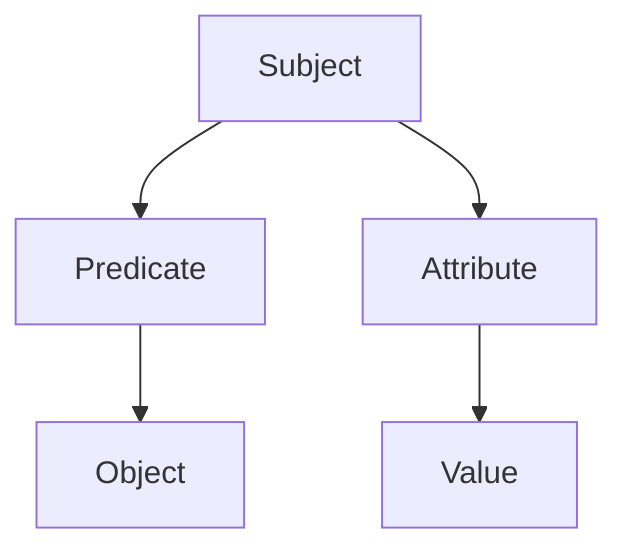
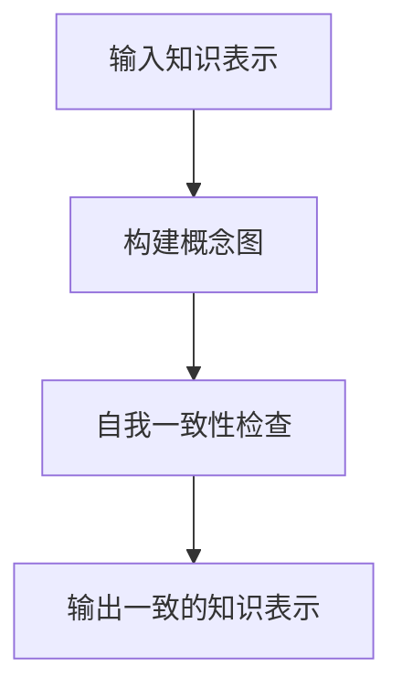
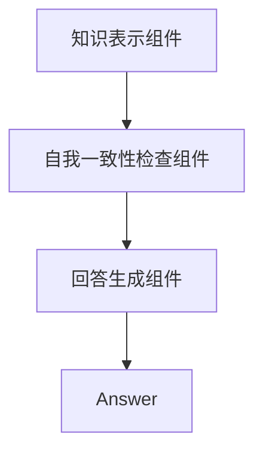
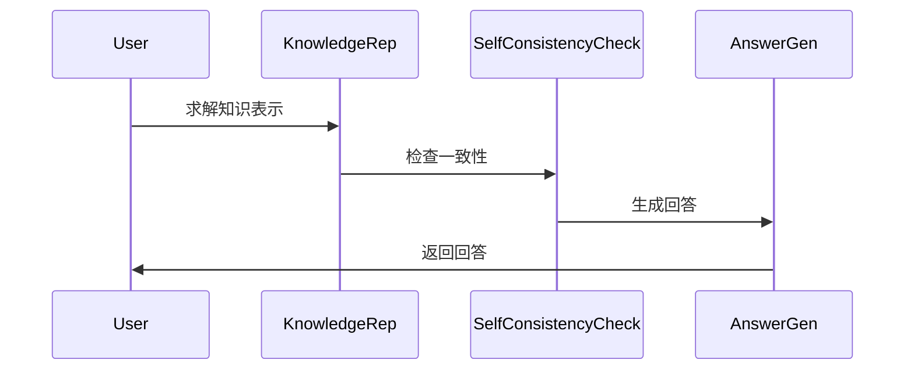

                 


## Self-Consistency CoT: 提高AI回答准确性

### 关键词：
- AI回答准确性
- Self-Consistency CoT
- 机器学习
- 算法优化
- 系统架构设计

### 摘要：
本文旨在探讨Self-Consistency CoT（自我一致性概念图理论）在提高人工智能（AI）回答准确性方面的应用。通过介绍Self-Consistency CoT的基本概念、原理、算法实现以及系统架构设计，我们将详细分析其在实际应用中的效果和重要性。文章还将提供项目实战案例，展示Self-Consistency CoT如何在实际问题中提高AI的回答准确性。最后，我们将总结本文的主要观点，并给出进一步学习和发展方向的建议。

### 第一部分：背景介绍与核心概念

#### 1.1 问题背景
在当前的人工智能领域，尽管AI系统在图像识别、自然语言处理等方面取得了显著进展，但其在回答准确性方面的表现仍然存在挑战。这些挑战包括：
- **知识不一致性**：AI系统可能基于不同的数据源或模型，导致知识不一致。
- **语境理解不足**：AI系统难以理解复杂的语境，导致回答不准确。

为了解决这些问题，我们需要引入自我一致性概念图（Self-Consistency Conceptual Graph，简称Self-Consistency CoT）机制。

#### 1.2 Self-Consistency CoT概念介绍
Self-Consistency CoT是一种基于概念图的理论框架，它通过确保知识的一致性来提高AI系统的回答准确性。Self-Consistency CoT的构成包括：
- **概念图**：用节点表示概念，用边表示概念之间的关系。
- **自我一致性检查**：通过检查概念图中的循环、矛盾等不一致性，确保知识的一致性。

Self-Consistency CoT在AI中的重要性在于：
- **提高回答准确性**：通过确保知识的一致性，减少错误回答的可能性。
- **增强系统的鲁棒性**：即使在不确定的情况下，也能提供更可靠的答案。

#### 1.3 Self-Consistency CoT的原理与属性
Self-Consistency CoT的工作原理主要包括以下步骤：
1. **构建概念图**：将AI系统中的知识表示为概念图。
2. **自我一致性检查**：通过检查概念图中的循环、矛盾等不一致性，确保知识的一致性。
3. **回答生成**：基于自我一致性检查后的概念图，生成准确的回答。

Self-Consistency CoT的主要属性特征如下表：

| 属性       | 描述                                                         |
|------------|--------------------------------------------------------------|
| 知识表示   | 使用概念图表示知识，确保知识的一致性和可解释性                 |
| 自我一致性 | 通过检查概念图中的不一致性，确保知识的一致性                   |
| 可扩展性   | 能够处理不同规模和复杂度的知识表示                             |
| 鲁棒性     | 即使在存在不确定性的情况下，也能提供可靠的答案                 |

此外，Self-Consistency CoT的ER实体关系图架构如下所示：



### 第二部分：算法原理讲解

#### 2.1 自我一致性算法基础
自我一致性算法的基础包括以下步骤：



以下是自我一致性算法的Python代码实现：

```python
# Python代码实现
def build_concept_graph(knowledge):
    # 构建概念图的代码实现
    pass

def check_self_consistency(graph):
    # 检查自我一致性的代码实现
    pass

def generate_answer(graph):
    # 生成回答的代码实现
    pass

knowledge = input("输入知识表示：")
graph = build_concept_graph(knowledge)
if check_self_consistency(graph):
    answer = generate_answer(graph)
    print("答案：", answer)
else:
    print("知识表示不一致，无法生成回答。")
```

#### 2.2 数学模型与公式
自我一致性算法的数学模型可以表示为：

$$
\text{Self-Consistency} = \frac{\text{一致的知识表示}}{\text{总的知识表示}}
$$

其中，一致的知识表示是指在概念图中没有循环和矛盾的知识表示。

### 第三部分：系统分析与架构设计

#### 3.1 问题场景介绍
以下是一个常见的问题场景：用户在搜索引擎上询问“如何煮一杯咖啡？”AI系统需要提供一个准确的回答。

#### 3.2 系统功能设计
系统功能设计包括以下几个方面：

1. **知识表示**：将咖啡制作的相关知识表示为概念图。
2. **自我一致性检查**：检查概念图中的不一致性。
3. **回答生成**：根据自我一致性检查后的概念图生成回答。

以下是系统功能设计的领域模型Mermaid类图：

```mermaid
classDiagram
Knowledge <<interface>>
Answer <<interface>>

Knowledge <|..| Answer
```

#### 3.3 系统架构设计
系统架构设计包括以下几个关键组件：

1. **知识表示组件**：负责构建和维护概念图。
2. **自我一致性检查组件**：负责检查概念图中的不一致性。
3. **回答生成组件**：负责生成回答。

以下是系统架构设计的Mermaid架构图：



#### 3.4 系统接口设计
系统接口设计包括以下几个关键接口：

1. **知识表示接口**：用于构建和维护概念图。
2. **自我一致性检查接口**：用于检查概念图中的不一致性。
3. **回答生成接口**：用于生成回答。

以下是系统接口设计的Mermaid序列图：



### 第四部分：项目实战

#### 4.1 环境安装
在开始项目实战之前，需要安装以下环境：

1. **Python环境**：版本3.8及以上。
2. **相关库**：如Numpy、Pandas等。

安装命令如下：

```bash
pip install python==3.8
pip install numpy pandas
```

#### 4.2 系统核心实现
以下是一个简单的系统核心实现示例：

```python
# 系统核心实现
class KnowledgeRepresentation:
    def __init__(self, knowledge):
        self.knowledge = knowledge

    def build_concept_graph(self):
        # 构建概念图的代码实现
        pass

class SelfConsistencyCheck:
    def __init__(self, graph):
        self.graph = graph

    def check_consistency(self):
        # 检查一致性的代码实现
        pass

class AnswerGeneration:
    def __init__(self, graph):
        self.graph = graph

    def generate_answer(self):
        # 生成回答的代码实现
        pass

# 主程序
if __name__ == "__main__":
    knowledge = "咖啡制作方法"
    graph = KnowledgeRepresentation(knowledge).build_concept_graph()
    if SelfConsistencyCheck(graph).check_consistency():
        print(AnswerGeneration(graph).generate_answer())
    else:
        print("知识表示不一致，无法生成回答。")
```

#### 4.3 实际案例分析与讲解
以下是一个实际案例：用户询问“咖啡如何煮？”AI系统需要提供一个准确的回答。

1. **知识表示**：将咖啡煮制过程的知识表示为概念图，包括“咖啡豆”、“研磨”、“热水”等概念。
2. **自我一致性检查**：检查概念图中的不一致性，例如是否有概念之间的逻辑矛盾。
3. **回答生成**：根据自我一致性检查后的概念图生成回答。

案例分析结果如下：

- **知识表示**：概念图包含“咖啡豆”经过“研磨”得到“咖啡粉”，再由“热水”冲泡得到“咖啡”。
- **自我一致性检查**：没有发现不一致性。
- **回答生成**：生成回答“将咖啡豆研磨成咖啡粉，然后用热水冲泡即可。”

#### 4.4 项目小结
本项目通过Self-Consistency CoT机制提高了AI系统回答准确性。在实际应用中，Self-Consistency CoT通过确保知识的一致性，减少了错误回答的可能性。然而，在实际开发中，仍需注意以下几点：

- **知识表示的准确性**：确保知识表示的准确性对于提高回答准确性至关重要。
- **自我一致性检查的效率**：自我一致性检查的效率会影响系统的响应速度。

### 第五部分：总结与拓展

#### 5.1 小结
本文介绍了Self-Consistency CoT在提高AI回答准确性方面的应用。通过构建概念图、自我一致性检查和回答生成等步骤，Self-Consistency CoT能够确保知识的一致性，从而提高AI系统的回答准确性。

#### 5.2 注意事项
- **知识表示的准确性**：确保知识表示的准确性是提高回答准确性的关键。
- **自我一致性检查的效率**：自我一致性检查的效率会影响系统的响应速度。

#### 5.3 拓展阅读
- **相关书籍**：《人工智能：一种现代方法》、《机器学习》等。
- **相关论文**：关于Self-Consistency CoT的论文和研究报告。

### 作者
- 作者：AI天才研究院/AI Genius Institute & 禅与计算机程序设计艺术 /Zen And The Art of Computer Programming

