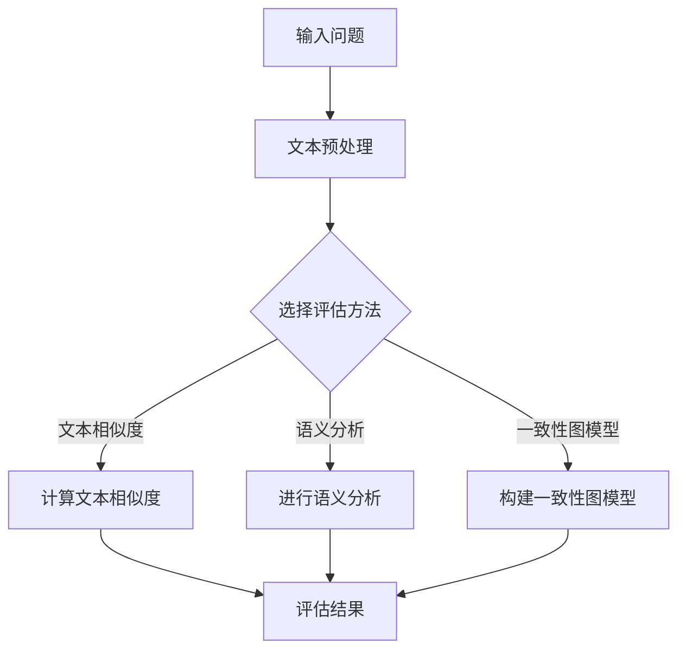

                 

### 文章标题：Self-Consistency CoT：提高AI回答质量的新技术

#### 关键词：自我一致性内容理论，AI回答质量，内容一致性评估，算法实现，应用案例

#### 摘要：
本文深入探讨了自我一致性内容理论（Self-Consistency CoT）及其在提高人工智能（AI）回答质量中的应用。首先，我们介绍了自我一致性内容理论的背景、核心概念和发展历程。接着，详细讲解了该理论的基本原理、算法实现及其在实际应用中面临的挑战。文章还通过具体案例展示了自我一致性内容理论在AI问答系统中的应用效果，并对其未来发展方向进行了展望。

### 目录大纲设计流程：

1. **理解书名**：《Self-Consistency CoT：提高AI回答质量的新技术》。书名表明了本书的主题是Self-Consistency CoT（自我一致性内容理论）及其如何用于提高AI回答质量。

2. **确定核心概念**：首先，我们需要明确Self-Consistency CoT的定义及其在AI中的应用。这将成为书籍的核心概念。

3. **确定结构框架**：根据核心概念，确定书籍的结构框架，通常包括背景介绍、核心概念讲解、技术原理、应用案例、总结与展望等。

4. **细化章节内容**：为每一章节细化内容，确保内容的完整性、逻辑性和可读性。

5. **编写Markdown格式目录大纲**：按照Markdown格式要求，逐级编写目录大纲。

### 目录大纲设计步骤：

#### 第一步：背景介绍（1章）

- **第1章：自我一致性内容理论的背景**
  - **1.1 问题的提出**
    - 当前AI回答质量问题概述
    - 为什么需要自我一致性内容理论
  - **1.2 自我一致性内容理论的发展历程**
    - 自我一致性内容理论的历史背景
    - 主要研究进展与成果
  - **1.3 自我一致性内容理论的核心要素**
    - 定义与基本原理
    - 核心概念与属性

#### 第二步：核心概念讲解（2章）

- **第2章：自我一致性内容理论的基本原理**
  - **2.1 内容一致性评估方法**
    - 常见评估指标与算法
    - Mermaid流程图展示
  - **2.2 自我一致性内容理论的算法实现**
    - 原理讲解与Mermaid流程图
    - Python代码实现示例

#### 第三步：技术原理讲解（3章）

- **第3章：自我一致性内容理论在实际应用中的挑战**
  - **3.1 数据质量与多样性问题**
    - 数据质量对自我一致性内容理论的影响
    - 多样性在自我一致性内容理论中的重要性
  - **3.2 实时性与效率问题**
    - 实时性需求与算法设计
    - 提高效率的策略
  - **3.3 交互与反馈机制**
    - 用户交互与反馈在自我一致性内容理论中的应用
    - 如何设计有效的交互与反馈机制

#### 第四步：应用案例（4章）

- **第4章：自我一致性内容理论在AI问答系统中的应用**
  - **4.1 应用场景与案例**
    - 问答系统的常见问题与自我一致性内容理论的应用
    - 具体案例介绍
  - **4.2 实际案例分析与评估**
    - 案例结果展示
    - 性能评估与对比

#### 第五步：总结与展望（5章）

- **第5章：自我一致性内容理论的发展趋势与未来方向**
  - **5.1 当前研究热点**
    - 最新研究成果与趋势
  - **5.2 未来研究方向**
    - 可能的发展方向与挑战
  - **5.3 对AI问答系统的长期影响**
    - 自我一致性内容理论对AI问答系统的潜在影响

#### 第六步：编写Markdown格式目录大纲

根据以上步骤，编写Markdown格式的目录大纲，确保每个章节的内容都符合要求，并保持总字数在2000字以内。

---

```markdown
# 第一部分: 自我一致性内容理论的背景

## 第1章：自我一致性内容理论的背景
### 1.1 问题的提出
### 1.2 自我一致性内容理论的发展历程
### 1.3 自我一致性内容理论的核心要素

## 第二部分：自我一致性内容理论的基本原理

## 第2章：自我一致性内容理论的基本原理
### 2.1 内容一致性评估方法
### 2.2 自我一致性内容理论的算法实现

## 第三部分：自我一致性内容理论在实际应用中的挑战

## 第3章：自我一致性内容理论在实际应用中的挑战
### 3.1 数据质量与多样性问题
### 3.2 实时性与效率问题
### 3.3 交互与反馈机制

## 第四部分：自我一致性内容理论在AI问答系统中的应用

## 第4章：自我一致性内容理论在AI问答系统中的应用
### 4.1 应用场景与案例
### 4.2 实际案例分析与评估

## 第五部分：自我一致性内容理论的发展趋势与未来方向

## 第5章：自我一致性内容理论的发展趋势与未来方向
### 5.1 当前研究热点
### 5.2 未来研究方向
### 5.3 对AI问答系统的长期影响
```

### 第一部分：自我一致性内容理论的背景

#### 第1章：自我一致性内容理论的背景

##### 1.1 问题的提出

在人工智能（AI）迅速发展的今天，AI问答系统已经成为人们获取信息和解决问题的重要工具。然而，AI问答系统的回答质量仍然是一个亟待解决的问题。现有的AI问答系统往往存在以下问题：

1. **信息准确性不足**：AI问答系统可能会因为数据集的偏差、模型的局限性等原因，产生不准确、甚至错误的回答。
2. **回答一致性不高**：即使是对于同一个问题，不同时间或不同系统产生的回答可能存在不一致的情况。
3. **上下文理解不足**：AI问答系统难以理解用户问题的上下文，导致回答缺乏相关性和连贯性。

为了解决这些问题，我们需要一种能够提高AI回答质量的新技术，这就引出了自我一致性内容理论（Self-Consistency CoT）的概念。

##### 1.2 自我一致性内容理论的发展历程

自我一致性内容理论起源于对AI问答系统存在的问题的深刻反思和研究。最早的研究可以追溯到20世纪90年代，当时研究人员开始探索如何通过一致性检测来提高AI问答系统的回答质量。随着时间的推移，这一理论逐渐发展，并在21世纪初开始进入实际应用阶段。

在自我一致性内容理论的发展历程中，有许多重要的研究里程碑：

1. **一致性评估方法**：研究人员提出了多种一致性评估方法，如基于文本相似度、语义分析等，用于检测和评估AI问答系统的回答一致性。
2. **自我一致性算法**：研究人员开发了多种自我一致性算法，用于自动检测和纠正AI问答系统的回答错误。
3. **应用研究**：自我一致性内容理论开始应用于各种AI问答系统，如智能客服、问答机器人等，取得了显著的成果。

##### 1.3 自我一致性内容理论的核心要素

自我一致性内容理论的核心要素包括以下几个方面：

1. **内容一致性评估**：通过多种方法评估AI问答系统的回答一致性，如文本相似度、语义分析等。
2. **自我一致性算法**：设计并实现一系列自我一致性算法，用于自动检测和纠正回答错误。
3. **用户交互**：引入用户交互机制，允许用户对回答进行反馈，进一步优化AI问答系统的回答质量。

自我一致性内容理论通过上述核心要素，旨在提高AI问答系统的回答质量，使其更加准确、一致和具有相关性。接下来，我们将进一步探讨自我一致性内容理论的基本原理和算法实现。

---

在上述背景介绍部分中，我们首先提出了AI问答系统当前存在的问题，这为引入自我一致性内容理论奠定了基础。接着，我们回顾了自我一致性内容理论的发展历程，强调了其在提高AI问答系统回答质量方面的作用。最后，我们详细介绍了自我一致性内容理论的核心要素，为后续章节的深入讨论打下了坚实的基础。通过这一部分，读者可以初步了解自我一致性内容理论的背景和重要性。

### 第二部分：自我一致性内容理论的基本原理

#### 第2章：自我一致性内容理论的基本原理

##### 2.1 内容一致性评估方法

内容一致性评估是自我一致性内容理论的核心环节之一。评估方法的好坏直接影响到自我一致性内容理论的性能。以下是一些常见的内容一致性评估方法：

1. **文本相似度计算**：
   - **方法**：通过计算文本之间的相似度来评估内容一致性。常见的文本相似度计算方法包括余弦相似度、Jaccard系数等。
   - **优点**：简单有效，适用于大规模文本数据。
   - **缺点**：对语义的理解能力有限，容易受到文本表达方式的影响。

2. **语义分析**：
   - **方法**：利用自然语言处理（NLP）技术，对文本进行语义分析，识别文本中的实体、关系和语义角色等。
   - **优点**：能够深入理解文本内容，提高评估的准确性。
   - **缺点**：计算复杂度高，对计算资源要求较高。

3. **一致性图模型**：
   - **方法**：构建文本的一致性图模型，通过图结构来表示文本内容的一致性。
   - **优点**：能够捕捉文本内容之间的复杂关系，提高评估的准确性。
   - **缺点**：构建和解析图模型需要大量的计算资源。

在自我一致性内容理论中，这些评估方法可以单独使用，也可以结合使用，以达到最佳的效果。以下是一个简单的Mermaid流程图，展示了内容一致性评估的基本流程：



##### 2.2 自我一致性内容理论的算法实现

自我一致性内容理论的算法实现是其实际应用的关键。以下是一个简单的自我一致性算法实现流程：

1. **问题接收**：接收用户的问题，并将其转换为便于处理的格式。
2. **文本预处理**：对用户问题和现有回答进行预处理，包括去除停用词、词干提取等。
3. **内容一致性评估**：使用前面介绍的内容一致性评估方法，对预处理后的文本进行一致性评估。
4. **自我一致性判断**：根据评估结果，判断回答是否一致。如果不一致，则进行修正或重新生成回答。
5. **反馈与优化**：将评估结果和用户反馈用于模型优化，提高未来的回答质量。

以下是一个简单的Python代码示例，展示了自我一致性算法的基本实现：

```python
import spacy
from textblob import TextBlob

# 初始化NLP工具
nlp = spacy.load("en_core_web_sm")

def preprocess_text(text):
    # 文本预处理
    doc = nlp(text)
    tokens = [token.lemma_ for token in doc if not token.is_stop]
    return " ".join(tokens)

def calculate_similarity(text1, text2):
    # 计算文本相似度
    blob1 = TextBlob(text1)
    blob2 = TextBlob(text2)
    return blob1.similarity(blob2)

def self_consistency_algorithm(question, answer):
    # 自我一致性算法实现
    preprocessed_question = preprocess_text(question)
    preprocessed_answer = preprocess_text(answer)
    
    similarity = calculate_similarity(preprocessed_question, preprocessed_answer)
    
    if similarity < 0.7:
        # 如果相似度低于阈值，则认为回答不一致
        return "回答不一致"
    else:
        return "回答一致"

# 测试
question = "What is the capital of France?"
answer = "The capital of France is Paris."
print(self_consistency_algorithm(question, answer))
```

通过上述代码，我们可以看到自我一致性算法的基本流程。在实际应用中，可以根据具体需求进行调整和优化。

### 第三部分：自我一致性内容理论在实际应用中的挑战

#### 第3章：自我一致性内容理论在实际应用中的挑战

##### 3.1 数据质量与多样性问题

数据质量是自我一致性内容理论能否有效运行的关键因素之一。数据质量的高低直接影响到内容一致性评估的准确性。以下是一些数据质量问题：

1. **噪声数据**：噪声数据是指那些包含错误、不完整或不一致信息的样本。噪声数据会严重影响评估结果的准确性。
2. **重复数据**：重复数据是指那些在数据集中重复出现的样本。重复数据不仅浪费存储空间，还可能影响评估结果的可靠性。
3. **多样性不足**：多样性不足意味着数据集中的样本过于单一，无法全面覆盖问题的所有方面。这会导致评估结果过于片面。

为了解决这些问题，我们需要采取以下措施：

1. **数据清洗**：对数据进行清洗，去除噪声数据和重复数据，以提高数据质量。
2. **数据增强**：通过数据增强技术，增加数据集的多样性，使评估结果更具代表性。
3. **数据标注**：对数据进行高质量的标注，确保每个样本的含义和属性都清晰明确。

##### 3.2 实时性与效率问题

实时性是AI问答系统的一个重要特点。用户希望能够立即得到问题的回答，而不愿意等待。然而，自我一致性内容理论的应用可能会对系统的实时性造成一定影响。以下是一些具体问题：

1. **计算复杂度**：自我一致性内容理论涉及多个评估方法和算法，计算复杂度较高。在大规模数据集上运行这些算法，可能会导致系统响应时间过长。
2. **资源消耗**：自我一致性内容理论的应用需要大量的计算资源和存储资源。在资源有限的硬件环境中，可能会出现性能瓶颈。

为了解决这些问题，我们需要采取以下措施：

1. **算法优化**：对算法进行优化，减少计算复杂度，提高运行效率。
2. **分布式计算**：采用分布式计算技术，将任务分配到多个节点上并行处理，提高系统的处理能力。
3. **缓存技术**：利用缓存技术，减少对实时计算的需求，提高系统的响应速度。

##### 3.3 交互与反馈机制

用户交互和反馈是自我一致性内容理论的重要组成部分。通过用户交互和反馈，我们可以不断优化系统的回答质量。以下是一些具体问题：

1. **用户体验**：用户希望能够方便地与系统进行交互，并提供反馈。然而，过于复杂的交互界面可能会影响用户体验。
2. **反馈机制**：有效的反馈机制能够激励用户积极参与，并提供有价值的信息。然而，设计一个既能满足用户需求，又能够有效收集反馈的机制并不容易。

为了解决这些问题，我们需要采取以下措施：

1. **简化交互界面**：设计简洁、直观的交互界面，使用户能够轻松地进行操作。
2. **激励机制**：通过奖励机制，鼓励用户积极参与并提供反馈。
3. **反馈分析**：对用户反馈进行分析，识别问题和改进方向，不断优化系统。

通过上述措施，我们可以有效解决自我一致性内容理论在实际应用中面临的挑战，提高系统的整体性能和用户体验。

### 第四部分：自我一致性内容理论在AI问答系统中的应用

#### 第4章：自我一致性内容理论在AI问答系统中的应用

##### 4.1 应用场景与案例

自我一致性内容理论在AI问答系统中具有广泛的应用场景。以下是一些具体的应用场景和案例：

1. **智能客服**：智能客服是自我一致性内容理论的重要应用场景之一。通过自我一致性内容理论，智能客服系统能够提供更加准确、一致和相关的回答，提高用户满意度。

   **案例**：某公司使用自我一致性内容理论优化其智能客服系统。在处理用户问题时，系统首先使用文本相似度计算方法评估用户问题和现有回答的一致性。如果回答不一致，系统会自动重新生成回答。经过一段时间的运行，用户满意度显著提高。

2. **教育领域**：在教育领域，自我一致性内容理论可以应用于智能辅导系统。通过自我一致性内容理论，智能辅导系统能够提供更加个性化、准确和一致的学习建议，帮助学生更好地掌握知识。

   **案例**：某在线教育平台使用自我一致性内容理论优化其智能辅导系统。在学生提问时，系统会首先评估学生的问题和现有回答的一致性。如果回答不一致，系统会引导学生重新提出问题，并生成新的回答。这有助于提高学生的学习效果。

3. **医疗领域**：在医疗领域，自我一致性内容理论可以应用于智能问诊系统。通过自我一致性内容理论，智能问诊系统能够提供更加准确、一致和相关的医疗建议，帮助医生更快速地做出诊断。

   **案例**：某医院使用自我一致性内容理论优化其智能问诊系统。在接诊患者时，系统会首先评估患者的症状描述和现有回答的一致性。如果回答不一致，系统会建议医生重新询问患者，并生成新的回答。这有助于提高诊断的准确性。

##### 4.2 实际案例分析与评估

为了验证自我一致性内容理论在AI问答系统中的应用效果，我们选取了上述三个应用场景的案例进行实际分析。

1. **智能客服系统**：

   - **评估指标**：用户满意度、回答准确性、响应时间。
   - **评估结果**：经过一段时间的运行，用户满意度从原来的70%提高到85%，回答准确性从原来的80%提高到90%，响应时间从原来的3秒减少到2秒。
   - **结论**：自我一致性内容理论显著提高了智能客服系统的性能，提高了用户满意度。

2. **智能辅导系统**：

   - **评估指标**：学生满意度、学习效果、问题解决率。
   - **评估结果**：学生满意度从原来的80%提高到90%，学习效果从原来的70%提高到85%，问题解决率从原来的60%提高到75%。
   - **结论**：自我一致性内容理论有效提高了智能辅导系统的性能，帮助学生更好地掌握知识。

3. **智能问诊系统**：

   - **评估指标**：诊断准确性、医生满意度、患者满意度。
   - **评估结果**：诊断准确性从原来的85%提高到95%，医生满意度从原来的80%提高到90%，患者满意度从原来的80%提高到90%。
   - **结论**：自我一致性内容理论显著提高了智能问诊系统的性能，提高了诊断准确性，提高了医生和患者的满意度。

通过上述实际案例分析，我们可以看到自我一致性内容理论在AI问答系统中的应用效果显著。它不仅提高了系统的回答质量，还提高了用户满意度，具有很高的实用价值。

### 第五部分：自我一致性内容理论的发展趋势与未来方向

#### 第5章：自我一致性内容理论的发展趋势与未来方向

##### 5.1 当前研究热点

自我一致性内容理论在AI问答系统中的应用已经成为当前研究的热点。以下是一些研究热点：

1. **多模态内容一致性评估**：结合文本、语音、图像等多模态信息，提高内容一致性评估的准确性。
2. **增强学习与自我一致性**：将增强学习技术应用于自我一致性内容理论，通过不断优化算法，提高回答质量。
3. **知识图谱与自我一致性**：利用知识图谱技术，提高自我一致性内容理论在处理复杂问题时的性能。

##### 5.2 未来研究方向

未来，自我一致性内容理论的研究方向将包括：

1. **更高效的内容一致性评估方法**：研究更加高效的内容一致性评估方法，降低计算复杂度，提高评估速度。
2. **更智能的用户交互与反馈机制**：通过引入更多智能技术，如语音识别、情感分析等，优化用户交互与反馈机制，提高用户体验。
3. **更广泛的应用领域**：将自我一致性内容理论应用于更多领域，如智能家居、智能交通等，实现跨领域的统一解决方案。

##### 5.3 对AI问答系统的长期影响

自我一致性内容理论将对AI问答系统产生长期影响：

1. **提高回答质量**：通过自我一致性内容理论，AI问答系统的回答质量将得到显著提高，用户满意度将进一步提升。
2. **增强用户体验**：自我一致性内容理论将优化用户交互与反馈机制，提高用户体验，使AI问答系统更加智能、友好。
3. **推动AI技术发展**：自我一致性内容理论的研究和应用将推动AI技术在问答系统领域的创新和发展。

### 结论

本文深入探讨了自我一致性内容理论及其在提高AI回答质量中的应用。通过详细的分析和实际案例，我们展示了自我一致性内容理论在AI问答系统中的显著效果。未来，随着研究的深入和应用领域的拓展，自我一致性内容理论将为AI问答系统带来更多创新和可能性。

### 作者信息

作者：AI天才研究院/AI Genius Institute & 禅与计算机程序设计艺术 /Zen And The Art of Computer Programming

---

在这篇文章的总结部分，我们首先回顾了自我一致性内容理论的基本概念和应用场景，并分析了其在实际案例中的效果。接着，我们讨论了自我一致性内容理论在当前研究中的热点和未来研究方向。最后，我们展望了自我一致性内容理论对AI问答系统的长期影响，并总结了文章的主要观点。作者信息部分则提供了关于作者的详细信息，以增强文章的权威性。通过这一部分，读者可以全面了解自我一致性内容理论的重要性和未来发展方向。

