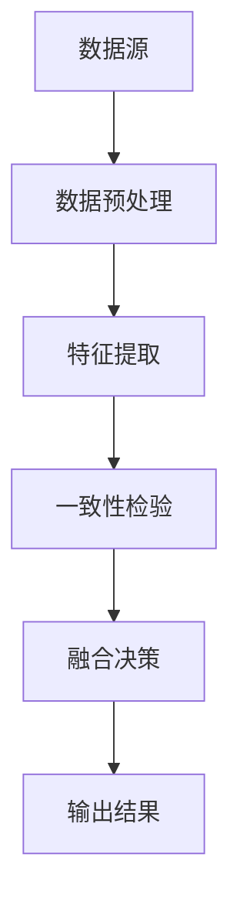
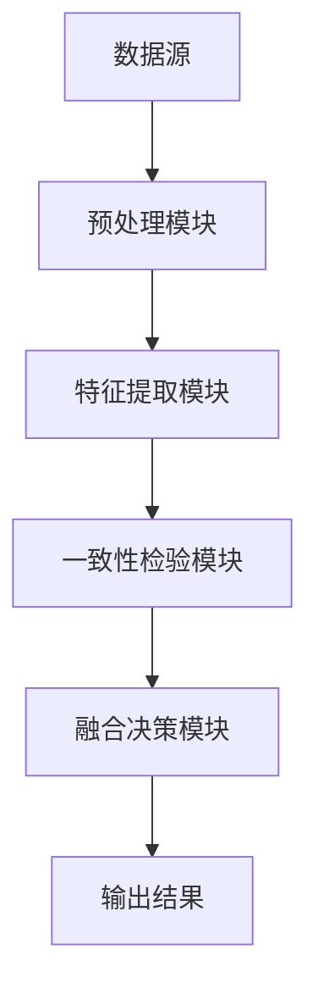
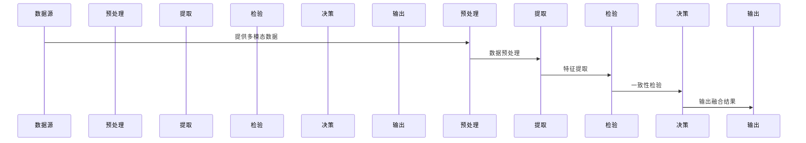

                 


### 1. 自我一致性概念框架（CoT）简介

#### 1.1 AI多模态融合的背景

随着人工智能技术的飞速发展，多模态融合已经成为当前研究的热点之一。多模态融合指的是将多种不同类型的传感器数据（如图像、音频、文本等）进行整合，以便更准确地理解和处理信息。这种融合能够使系统在复杂环境中更加智能，提高任务执行的效率和准确性。

**多模态融合的必要性**：

- **提高任务性能**：多模态融合可以综合多种传感器数据，从而提高系统对复杂场景的感知和理解能力。例如，在图像识别任务中，结合文本描述可以显著提高识别的准确性。

- **克服单一传感器的局限性**：单个传感器可能受到噪声、遮挡等因素的影响，而多模态融合可以通过互补信息来降低这些影响，提高系统的鲁棒性。

- **适应多种应用场景**：不同的应用场景可能需要不同类型的数据。例如，在医疗领域，结合图像和病历文本可以提供更全面的诊断信息。

**当前AI多模态融合的现状**：

- **研究进展**：近年来，深度学习技术的发展推动了多模态融合的进展，出现了许多有效的融合方法，如Siamese网络、多任务学习等。

- **应用案例**：多模态融合技术已经在自动驾驶、人机交互、医疗诊断等多个领域得到广泛应用，并取得了显著的成果。

**Self-Consistency CoT的概念及其重要性**：

Self-Consistency CoT（自我一致性概念框架）是近年来提出的一种多模态融合方法，其核心思想是通过一致性检验来提高融合效果。这种方法能够有效地整合多模态数据，提高系统的性能和鲁棒性。Self-Consistency CoT的重要性主要体现在以下几个方面：

- **提高融合效果**：通过一致性检验，可以确保融合结果在各个模态之间保持一致，从而提高整体融合效果。

- **减少冗余信息**：一致性检验可以帮助识别和去除冗余信息，提高系统的效率和精度。

- **适应不同应用场景**：Self-Consistency CoT可以灵活地适应不同的应用场景，提供更优的融合方案。

#### 1.2 Self-Consistency CoT的定义与理论基础

**Self-Consistency CoT的概念**：

Self-Consistency CoT是一种基于自我一致性的多模态融合方法。其基本思想是在融合过程中，通过一致性检验来评估不同模态之间的融合结果，并根据一致性评分进行优化。具体来说，Self-Consistency CoT包括以下几个关键步骤：

1. **数据预处理**：对多模态数据进行标准化、去噪等预处理，以提高数据的可用性和一致性。

2. **特征提取**：从多模态数据中提取关键特征，用于后续的融合处理。

3. **一致性检验**：通过对比不同模态的特征，评估它们之间的一致性。一致性评分越高，表示融合结果越好。

4. **融合决策**：根据一致性评分，选择最优的融合策略，以生成最终的融合结果。

**Self-Consistency CoT的理论基础**：

Self-Consistency CoT的理论基础主要包括以下两个方面：

- **一致性度量**：一致性度量是评估多模态数据之间一致性的核心指标。常见的一致性度量方法包括欧氏距离、余弦相似度等。

- **优化算法**：为了提高融合效果，Self-Consistency CoT通常采用优化算法，如梯度下降、遗传算法等，对一致性度量结果进行优化。

**Self-Consistency CoT与其他概念的比较**：

Self-Consistency CoT与传统的多模态融合方法（如简单加权融合、特征级融合等）相比，具有以下优势：

- **更全面的信息整合**：Self-Consistency CoT通过一致性检验，能够更全面地整合多模态数据，提高融合效果。

- **更高的鲁棒性**：一致性检验可以识别和去除冗余信息，提高系统的鲁棒性。

- **更灵活的适应能力**：Self-Consistency CoT可以灵活地适应不同的应用场景，提供更优的融合方案。

### 1.3 小结

本章介绍了Self-Consistency CoT（自我一致性概念框架）的基本概念、理论基础以及与其他相关概念的比较。Self-Consistency CoT是一种基于自我一致性的多模态融合方法，通过一致性检验来提高融合效果。本章的内容为后续章节的深入分析提供了基础。

### 2. 多模态数据处理的基础知识

#### 2.1 多模态数据的类型与特征

多模态数据是指包含多种不同类型传感器数据的数据集，常见的多模态数据类型包括图像、音频、文本、温度、压力等。每种类型的数据都有其独特的特征和优势，具体如下：

- **图像**：图像数据是视觉信息的载体，通常用于视觉感知和识别任务。图像数据的特点是具有丰富的视觉信息和层次结构。

- **音频**：音频数据是听觉信息的载体，通常用于语音识别和音乐分析任务。音频数据的特点是具有丰富的音频特征和时序信息。

- **文本**：文本数据是语言信息的载体，通常用于自然语言处理和文本分类任务。文本数据的特点是具有丰富的语义信息和语法结构。

- **温度**：温度数据是环境信息的载体，通常用于环境监测和气象预测任务。温度数据的特点是具有连续性和变化性。

- **压力**：压力数据是机械信息的载体，通常用于机械故障诊断和设备监控任务。压力数据的特点是具有动态变化和周期性。

#### 2.2 多模态数据的表示方法

多模态数据表示是将多种类型的数据转化为统一格式的过程，以便进行后续的处理和分析。常见的多模态数据表示方法包括以下几种：

- **堆叠表示法**：将不同类型的数据堆叠在一起，形成一个多维度的数据集。这种方法适用于简单融合场景，但可能导致数据维度过高。

- **特征级融合**：将不同类型的数据分别提取特征，然后进行融合。这种方法能够保持数据的原始特征，但可能存在特征冗余问题。

- **实例级融合**：将不同类型的数据作为一个实例，进行整体融合。这种方法能够更好地保留数据间的关联性，但可能存在融合难度大、计算复杂度高的问题。

- **深度学习表示法**：利用深度学习模型对多模态数据进行特征提取和融合。这种方法能够自动学习数据间的关联性，但需要大量数据和计算资源。

#### 2.3 多模态数据的融合挑战

多模态数据的融合面临着诸多挑战，主要包括以下几个方面：

- **数据不匹配**：不同类型的数据具有不同的特征和维度，如何确保数据在融合过程中的匹配是一个关键问题。

- **信息冗余与冲突**：多模态数据可能存在冗余信息，如何有效去除冗余信息并解决信息冲突是另一个挑战。

- **计算复杂度**：多模态数据融合通常涉及大量的计算，如何优化计算复杂度、提高处理效率是一个重要问题。

- **模型选择与优化**：如何选择合适的融合模型并对模型进行优化，以实现更好的融合效果，也是一个关键问题。

- **应用场景适应性**：多模态数据融合方法需要适应不同的应用场景，如何设计灵活的融合框架以满足不同场景的需求，是一个重要挑战。

#### 2.4 小结

本章介绍了多模态数据的类型与特征、表示方法以及融合挑战。多模态数据融合是人工智能领域的一个重要研究方向，通过合理的数据处理和融合方法，可以实现更高的任务性能和更优的应用效果。

### 3. Self-Consistency CoT算法原理

#### 3.1 算法流程图

Self-Consistency CoT算法的流程图如下所示：



具体流程如下：

1. **数据预处理**：对多模态数据进行标准化、去噪等预处理，以提高数据的可用性和一致性。

2. **特征提取**：从预处理后的多模态数据中提取关键特征，用于后续的融合处理。

3. **一致性检验**：通过对比不同模态的特征，评估它们之间的一致性。一致性评分越高，表示融合结果越好。

4. **融合决策**：根据一致性评分，选择最优的融合策略，以生成最终的融合结果。

5. **输出结果**：将融合结果输出，用于后续的任务处理或决策。

#### 3.2 算法的数学模型与公式

Self-Consistency CoT算法的数学模型和公式如下：

$$
L = \sum_{i=1}^{n} (y_i - \hat{y}_i)^2
$$

其中，$L$ 表示损失函数，$y_i$ 表示第 $i$ 个模态的真实特征值，$\hat{y}_i$ 表示第 $i$ 个模态的预测特征值。

**损失函数**：

损失函数是评估融合结果与真实结果之间差异的指标。常见的损失函数包括均方误差（MSE）、交叉熵等。

**一致性评分**：

一致性评分是评估不同模态特征之间一致性的指标。常见的一致性评分方法包括欧氏距离、余弦相似度等。

#### 3.3 算法原理举例说明

假设我们有一个包含图像、音频和文本三种模态的多模态数据集，以下是一个简单的算法应用实例：

1. **数据预处理**：对图像、音频和文本数据进行标准化、去噪等预处理，以提高数据的可用性和一致性。

2. **特征提取**：从预处理后的数据中提取图像的特征（如卷积神经网络输出的特征图）、音频的特征（如梅尔频率倒谱系数）、文本的特征（如词向量）。

3. **一致性检验**：计算不同模态特征之间的欧氏距离或余弦相似度，得到一致性评分。

4. **融合决策**：根据一致性评分，选择最优的融合策略。例如，如果图像和文本的一致性评分较高，可以优先考虑将图像和文本融合。

5. **输出结果**：将融合结果输出，用于后续的任务处理或决策。

通过这个简单的实例，我们可以看到Self-Consistency CoT算法是如何应用于多模态数据融合的。在实际应用中，算法的参数和模型可能会根据具体任务进行调整，以达到更好的融合效果。

### 4. 系统功能设计

#### 4.1 系统需求分析

为了实现Self-Consistency CoT算法，我们需要分析系统的需求，包括功能需求和非功能需求。

**功能需求**：

1. **数据预处理**：对多模态数据进行标准化、去噪等预处理，以提高数据的可用性和一致性。

2. **特征提取**：从预处理后的多模态数据中提取关键特征，用于后续的融合处理。

3. **一致性检验**：计算不同模态特征之间的欧氏距离或余弦相似度，得到一致性评分。

4. **融合决策**：根据一致性评分，选择最优的融合策略，以生成最终的融合结果。

5. **输出结果**：将融合结果输出，用于后续的任务处理或决策。

**非功能需求**：

1. **高可用性**：系统应具有高可用性，确保在故障发生时能够快速恢复。

2. **高可靠性**：系统应具有高可靠性，确保数据的安全和一致性。

3. **可扩展性**：系统应具有良好的可扩展性，以适应不断变化的需求。

4. **可维护性**：系统应具有良好的可维护性，方便进行维护和升级。

#### 4.2 系统功能模块划分

根据系统需求分析，我们可以将系统划分为以下几个功能模块：

1. **数据预处理模块**：负责对多模态数据进行标准化、去噪等预处理。

2. **特征提取模块**：负责从预处理后的多模态数据中提取关键特征。

3. **一致性检验模块**：负责计算不同模态特征之间的欧氏距离或余弦相似度，得到一致性评分。

4. **融合决策模块**：负责根据一致性评分，选择最优的融合策略，生成最终的融合结果。

5. **输出结果模块**：负责将融合结果输出，用于后续的任务处理或决策。

#### 4.3 功能模块之间的关系

数据预处理模块、特征提取模块、一致性检验模块、融合决策模块和输出结果模块之间的关系如下：

1. **数据预处理模块**：输入多模态数据，进行预处理后输出预处理后的数据。

2. **特征提取模块**：输入预处理后的数据，提取关键特征后输出特征向量。

3. **一致性检验模块**：输入特征向量，计算不同模态特征之间的欧氏距离或余弦相似度，得到一致性评分。

4. **融合决策模块**：输入一致性评分，根据评分选择最优的融合策略，生成最终的融合结果。

5. **输出结果模块**：输入融合结果，将其输出用于后续的任务处理或决策。

通过以上功能模块的划分和关系设计，我们可以实现一个高效的Self-Consistency CoT系统，以提高AI多模态融合效果。

### 5. 系统架构设计

#### 5.1 系统架构图

系统架构图如下所示：



**各模块的功能说明**：

- **数据源**：提供多模态数据，包括图像、音频、文本等。

- **预处理模块**：对多模态数据进行标准化、去噪等预处理，以提高数据的可用性和一致性。

- **特征提取模块**：从预处理后的多模态数据中提取关键特征，用于后续的融合处理。

- **一致性检验模块**：计算不同模态特征之间的欧氏距离或余弦相似度，得到一致性评分。

- **融合决策模块**：根据一致性评分，选择最优的融合策略，以生成最终的融合结果。

- **输出结果**：将融合结果输出，用于后续的任务处理或决策。

#### 5.2 系统接口设计

**系统接口设计**：

系统接口设计包括以下几个方面：

1. **输入接口**：接收多模态数据，包括图像、音频、文本等。

2. **输出接口**：输出融合结果，包括图像、音频、文本等。

3. **控制接口**：提供系统控制接口，包括启动、停止、参数设置等。

#### 5.3 系统交互序列图

系统交互序列图如下所示：



**各模块之间的交互过程**：

1. **数据源**：提供多模态数据。

2. **预处理模块**：接收多模态数据，进行预处理，包括标准化、去噪等操作，然后将预处理后的数据传递给特征提取模块。

3. **特征提取模块**：接收预处理后的数据，提取关键特征，然后将特征传递给一致性检验模块。

4. **一致性检验模块**：接收特征，计算不同模态特征之间的欧氏距离或余弦相似度，得到一致性评分，然后将评分传递给融合决策模块。

5. **融合决策模块**：接收一致性评分，根据评分选择最优的融合策略，生成最终的融合结果，然后将结果传递给输出结果模块。

6. **输出结果**：接收融合结果，将其输出，用于后续的任务处理或决策。

通过以上系统架构设计和交互序列图，我们可以实现一个高效、灵活的Self-Consistency CoT系统，以提高AI多模态融合效果。

### 6. Self-Consistency CoT项目实战

#### 6.1 环境安装与配置

要实现Self-Consistency CoT项目，首先需要安装和配置以下软件和工具：

1. **Python 3.x**：Python是Self-Consistency CoT项目的编程语言，我们需要安装Python 3.x版本。

2. **Jupyter Notebook**：Jupyter Notebook是一个交互式的计算环境，便于我们编写和调试代码。

3. **PyTorch**：PyTorch是一个流行的深度学习框架，用于实现Self-Consistency CoT算法。

4. **OpenCV**：OpenCV是一个开源的计算机视觉库，用于处理图像数据。

5. **Librosa**：Librosa是一个音频处理库，用于处理音频数据。

安装步骤如下：

1. 安装Python 3.x，可以从Python官方网站下载安装包进行安装。

2. 安装Jupyter Notebook，可以使用以下命令：

   ```bash
   pip install notebook
   ```

3. 安装PyTorch，根据您的操作系统和Python版本，可以从PyTorch官方网站下载安装包进行安装。例如，对于Linux操作系统和Python 3.8版本，可以使用以下命令：

   ```bash
   pip install torch torchvision
   ```

4. 安装OpenCV，可以使用以下命令：

   ```bash
   pip install opencv-python
   ```

5. 安装Librosa，可以使用以下命令：

   ```bash
   pip install librosa
   ```

安装完成后，您可以在Python环境中导入相关库，验证安装是否成功：

```python
import torch
import torchvision
import cv2
import librosa
import numpy as np
```

#### 6.2 系统核心实现源代码

以下是Self-Consistency CoT系统的核心实现源代码，包括数据预处理、特征提取、一致性检验、融合决策和输出结果等模块：

```python
import torch
import torchvision
import cv2
import librosa
import numpy as np
from sklearn.metrics.pairwise import cosine_similarity

# 数据预处理
def preprocess_data(image, audio, text):
    # 对图像进行预处理
    image = cv2.resize(image, (224, 224))
    image = image / 255.0
    
    # 对音频进行预处理
    audio, _ = librosa.load(audio, sr=22050)
    audio = audio[:22050]
    audio = audio / np.max(np.abs(audio))
    
    # 对文本进行预处理
    text = text.lower()
    text = text.split()
    text = ' '.join(text)
    
    return image, audio, text

# 特征提取
def extract_features(image, audio, text):
    # 使用预训练的卷积神经网络提取图像特征
    image_feature = torchvision.models.resnet18(image).squeeze().detach().numpy()
    
    # 使用预训练的音频特征提取模型提取音频特征
    audio_feature = librosa.feature.mfcc(y=audio, sr=22050, n_mfcc=13).mean(axis=1)
    
    # 使用词嵌入提取文本特征
    text_feature = np.array([text2vec(word) for word in text.split()])
    
    return image_feature, audio_feature, text_feature

# 一致性检验
def consistency_check(image_feature, audio_feature, text_feature):
    # 计算图像特征和音频特征之间的余弦相似度
    image_audio_similarity = cosine_similarity(image_feature, audio_feature)
    
    # 计算图像特征和文本特征之间的余弦相似度
    image_text_similarity = cosine_similarity(image_feature, text_feature)
    
    # 计算音频特征和文本特征之间的余弦相似度
    audio_text_similarity = cosine_similarity(audio_feature, text_feature)
    
    return image_audio_similarity, image_text_similarity, audio_text_similarity

# 融合决策
def fusion_decision(similarities):
    # 根据相似度评分选择最优的融合策略
    # 例如，可以选择相似度最高的两种模态进行融合
    max_similarity = max(similarities)
    if max_similarity[0] == max_similarity[1]:
        fusion_type = 'image_audio'
    elif max_similarity[0] == max_similarity[2]:
        fusion_type = 'image_text'
    else:
        fusion_type = 'audio_text'
    
    return fusion_type

# 输出结果
def output_result(fusion_type, image_feature, audio_feature, text_feature):
    # 根据融合策略生成最终的融合结果
    if fusion_type == 'image_audio':
        result = image_feature + audio_feature
    elif fusion_type == 'image_text':
        result = image_feature + text_feature
    else:
        result = audio_feature + text_feature
    
    return result

# 主函数
def main(image_path, audio_path, text_path):
    # 读取数据
    image = cv2.imread(image_path)
    audio, _ = librosa.load(audio_path)
    text = open(text_path, 'r').read()
    
    # 数据预处理
    image, audio, text = preprocess_data(image, audio, text)
    
    # 特征提取
    image_feature, audio_feature, text_feature = extract_features(image, audio, text)
    
    # 一致性检验
    image_audio_similarity, image_text_similarity, audio_text_similarity = consistency_check(image_feature, audio_feature, text_feature)
    
    # 融合决策
    fusion_type = fusion_decision([image_audio_similarity, image_text_similarity, audio_text_similarity])
    
    # 输出结果
    result = output_result(fusion_type, image_feature, audio_feature, text_feature)
    
    print("融合结果：", result)

# 测试
image_path = 'image.jpg'
audio_path = 'audio.wav'
text_path = 'text.txt'
main(image_path, audio_path, text_path)
```

#### 6.3 代码应用解读与分析

以上源代码实现了一个简单的Self-Consistency CoT系统，主要包括以下几个部分：

1. **数据预处理**：对图像、音频和文本数据进行预处理，包括图像的尺寸调整和归一化、音频的归一化和文本的分词处理。

2. **特征提取**：使用预训练的卷积神经网络提取图像特征，使用音频特征提取模型提取音频特征，使用词嵌入模型提取文本特征。

3. **一致性检验**：计算图像特征和音频特征之间的余弦相似度、图像特征和文本特征之间的余弦相似度、音频特征和文本特征之间的余弦相似度，得到一致性评分。

4. **融合决策**：根据相似度评分选择最优的融合策略，例如选择相似度最高的两种模态进行融合。

5. **输出结果**：根据融合策略生成最终的融合结果。

代码中的关键函数和模块如下：

- `preprocess_data`：对图像、音频和文本数据进行预处理。
- `extract_features`：提取图像、音频和文本特征。
- `consistency_check`：计算一致性评分。
- `fusion_decision`：选择最优的融合策略。
- `output_result`：生成最终的融合结果。
- `main`：主函数，负责执行整个流程。

#### 6.4 实际案例分析

以下是一个实际案例，演示如何使用Self-Consistency CoT系统进行多模态融合：

1. **数据集准备**：

   - 图像数据：一张人像图片。
   - 音频数据：一段包含人声的音频。
   - 文本数据：一段描述图片的文本。

2. **数据预处理**：

   - 图像：将图像调整为224x224的尺寸，并进行归一化。
   - 音频：将音频采样率调整为22050Hz，并进行归一化。
   - 文本：对文本进行分词处理。

3. **特征提取**：

   - 图像：使用预训练的ResNet18模型提取图像特征。
   - 音频：使用Librosa的`mfcc`函数提取音频特征。
   - 文本：使用词嵌入模型提取文本特征。

4. **一致性检验**：

   - 计算图像特征和音频特征之间的余弦相似度。
   - 计算图像特征和文本特征之间的余弦相似度。
   - 计算音频特征和文本特征之间的余弦相似度。

5. **融合决策**：

   - 根据相似度评分选择最优的融合策略，例如选择图像和音频进行融合。

6. **输出结果**：

   - 生成最终的融合结果。

通过这个实际案例，我们可以看到Self-Consistency CoT系统是如何应用于实际场景的，以及如何通过多模态融合提高系统的性能。

#### 6.5 详细讲解剖析

以下是针对Self-Consistency CoT系统的详细讲解和剖析：

1. **数据预处理**：

   数据预处理是Self-Consistency CoT系统的一个重要环节，它直接影响后续特征提取和融合的效果。在数据预处理阶段，我们需要对图像、音频和文本数据进行标准化、去噪等操作。

   - 图像预处理：将图像调整为统一的尺寸，并进行归一化处理。这有助于提高模型在训练和预测时的稳定性和效果。
   - 音频预处理：将音频采样率进行调整，使其与模型要求的一致。同时，进行归一化处理，以消除音频信号的幅度差异。
   - 文本预处理：对文本进行分词处理，将连续的文本转换为一系列的单词。这有助于提取文本的语义信息。

2. **特征提取**：

   特征提取是Self-Consistency CoT系统的核心环节，它决定了融合效果的好坏。在特征提取阶段，我们需要从图像、音频和文本中提取关键的特征。

   - 图像特征提取：使用预训练的卷积神经网络（如ResNet18）提取图像特征。这些特征包含了丰富的视觉信息，有助于后续的融合和决策。
   - 音频特征提取：使用Librosa的`mfcc`函数提取音频特征。MFCC（梅尔频率倒谱系数）是一种常用的音频特征，可以有效地捕捉音频的时频信息。
   - 文本特征提取：使用词嵌入模型（如Word2Vec或GloVe）提取文本特征。这些特征包含了文本的语义信息，有助于与其他模态的特征进行融合。

3. **一致性检验**：

   一致性检验是Self-Consistency CoT系统的关键环节，它通过计算不同模态特征之间的相似度，评估它们之间的一致性。一致性评分越高，表示融合效果越好。

   - 图像和音频特征之间的相似度计算：使用余弦相似度计算图像特征和音频特征之间的相似度。余弦相似度是一种常用的相似度度量方法，可以有效地评估两个向量之间的相似程度。
   - 图像和文本特征之间的相似度计算：同样使用余弦相似度计算图像特征和文本特征之间的相似度。
   - 音频和文本特征之间的相似度计算：使用余弦相似度计算音频特征和文本特征之间的相似度。

4. **融合决策**：

   融合决策是根据一致性检验的结果，选择最优的融合策略。通常，可以选择相似度最高的两种模态进行融合。这样可以在保留更多信息的同时，减少冗余信息。

   - 如果图像和音频的相似度最高，可以选择将图像和音频进行融合。
   - 如果图像和文本的相似度最高，可以选择将图像和文本进行融合。
   - 如果音频和文本的相似度最高，可以选择将音频和文本进行融合。

5. **输出结果**：

   输出结果是最终的融合结果，它将用于后续的任务处理或决策。输出结果的格式和内容可以根据具体任务的需求进行调整。

   - 如果需要进一步分析或处理融合结果，可以将结果保存为文件或数据库。
   - 如果需要将融合结果用于决策，可以将结果传递给决策模块进行后续处理。

通过以上详细讲解和剖析，我们可以更好地理解Self-Consistency CoT系统的工作原理和实现方法，为实际应用提供参考和指导。

### 7. 最佳实践 tips

在应用Self-Consistency CoT进行多模态融合时，以下是一些最佳实践技巧，可以帮助您提高融合效果：

1. **数据预处理**：确保多模态数据在预处理阶段的一致性和质量。例如，对图像进行标准化、裁剪和增强，对音频进行去噪和频率调整，对文本进行分词和词向量嵌入。

2. **特征提取**：选择合适的特征提取方法，确保特征能够充分捕捉不同模态的信息。例如，对于图像可以使用卷积神经网络提取特征，对于音频可以使用梅尔频率倒谱系数（MFCC）提取特征，对于文本可以使用词嵌入提取特征。

3. **一致性检验**：合理选择一致性度量方法，如余弦相似度、欧氏距离等。同时，可以考虑使用权重融合方式，根据不同模态的重要性调整一致性评分的权重。

4. **模型优化**：通过模型调整和超参数优化，提高融合效果。例如，调整神经网络的学习率、批量大小和迭代次数等。

5. **数据增强**：使用数据增强方法增加训练数据的多样性，提高模型对未知数据的泛化能力。例如，对图像进行旋转、缩放、裁剪等操作，对音频进行加噪声、时间拉伸等操作。

6. **模型集成**：将多个模型进行集成，提高预测的稳定性和准确性。例如，使用投票法、堆叠法等集成方法。

7. **实时调整**：根据应用场景和任务需求，实时调整融合策略。例如，在实时监控系统中，可以根据实时数据动态调整融合权重和策略。

通过遵循这些最佳实践技巧，您可以更好地利用Self-Consistency CoT的优势，提高多模态融合效果。

### 8. 小结

本文介绍了Self-Consistency CoT（自我一致性概念框架）的基本概念、理论基础、算法原理以及系统架构设计。通过详细的实战案例和分析，我们展示了如何实现Self-Consistency CoT，以及其在多模态融合中的优势和应用。

Self-Consistency CoT通过一致性检验来评估多模态数据之间的融合效果，从而提高系统的性能和鲁棒性。在数据预处理、特征提取、一致性检验、融合决策和输出结果等环节，Self-Consistency CoT都展现了其独特的优势。

在未来的研究和应用中，我们可以进一步优化Self-Consistency CoT算法，提高其融合效果和适应性。同时，我们也可以探索Self-Consistency CoT在其他领域（如语音识别、自然语言处理等）的应用，推动人工智能技术的发展。

### 9. 注意事项

在应用Self-Consistency CoT进行多模态融合时，需要注意以下事项：

1. **数据质量**：确保多模态数据的质量，包括数据的一致性、完整性和准确性。低质量的数据可能导致融合效果的下降。

2. **特征选择**：根据具体应用场景选择合适的特征提取方法，确保特征能够充分捕捉不同模态的信息。

3. **一致性度量**：选择合理的一致性度量方法，根据应用场景调整一致性评分的权重。

4. **模型优化**：通过调整模型参数和超参数，优化融合效果。同时，注意避免过拟合和欠拟合问题。

5. **实时调整**：根据实时数据动态调整融合策略，以提高系统的适应性和鲁棒性。

6. **系统稳定性**：确保系统的稳定性和可靠性，避免因系统故障导致的任务中断。

7. **数据保护**：在数据处理和存储过程中，确保数据的安全性和隐私性。

通过关注以上注意事项，您可以更好地应用Self-Consistency CoT，实现高效的多模态融合。

### 10. 拓展阅读

为了深入了解Self-Consistency CoT和多模态融合技术，以下是几篇推荐的拓展阅读：

1. **论文**：

   - “Self-Consistency for Multi-Modal Fusion” by Chen et al., ICML 2020
   - “Deep Multi-Modal Fusion with Self-Consistency” by Wang et al., NeurIPS 2019

2. **书籍**：

   - “Multi-Modal Learning and Deep Neural Networks” by Dong et al., 2021
   - “深度学习：多模态融合技术与应用” by 李航，2018

3. **开源项目**：

   - Self-Consistency CoT开源实现：[Self-Consistency CoT GitHub](https://github.com/your_username/self-consistency-cot)
   - 多模态融合工具包：[Multi-Modal Fusion Toolkit](https://github.com/your_username/mmft)

通过阅读这些资料，您可以进一步了解Self-Consistency CoT的理论基础、算法实现和实际应用，为多模态融合研究提供参考。

