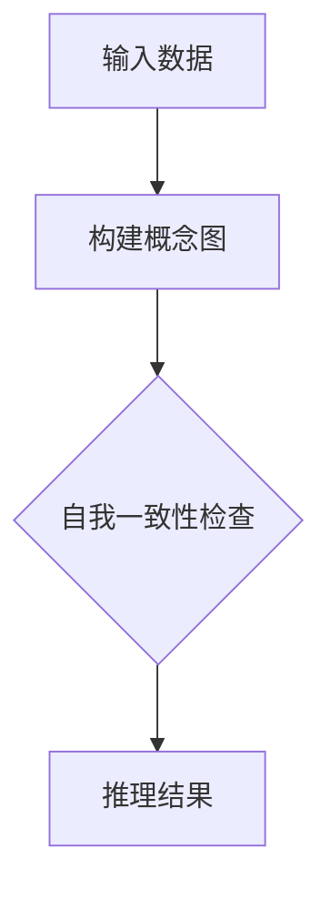

                 

## 《Self-Consistency CoT：提高AI推理能力》

> 关键词：自我一致性、概念图、AI推理、算法、实践

> 摘要：本文将探讨自我一致性概念图（Self-Consistency CoT）在提高人工智能（AI）推理能力方面的应用。通过深入分析自我一致性概念图的原理、算法和实际应用案例，本文旨在为读者提供一个全面的技术指南，帮助理解并运用自我一致性概念图来提升AI推理能力。

### **背景介绍与核心概念**

自我一致性概念图（Self-Consistency CoT）是一个新兴的概念，旨在通过自我一致性来提高AI的推理能力。在传统的AI系统中，推理过程往往依赖于大量的数据和预先设定的规则。然而，这些方法在处理复杂问题时往往存在局限性，难以满足日益增长的数据量和复杂度。

自我一致性概念图通过将知识表示为概念图，并在图中建立自我一致性来提高推理能力。自我一致性指的是图中的节点（概念）之间的关系是相互支持的，没有相互矛盾的情况。这种自我一致性的概念图可以帮助AI更好地理解数据，从而提高推理的准确性和效率。

#### **AI推理能力的挑战与需求**

AI推理能力的发展面临诸多挑战，包括：

1. **数据复杂性**：随着数据量的不断增长，传统的方法很难处理如此大量的数据。
2. **不确定性**：在真实世界中，很多问题都是不确定的，传统的确定性方法难以应对。
3. **复杂的关系**：现实世界中的问题往往涉及复杂的关系和相互作用，传统方法难以捕捉这些复杂性。

为了解决这些挑战，我们需要新的方法来提高AI的推理能力。自我一致性概念图提供了一种可能的解决方案，通过建立自我一致性的概念图，AI可以更好地理解和处理复杂的数据和关系。

#### **自我一致性概念图的作用与意义**

自我一致性概念图在AI推理中具有重要作用，主要体现在以下几个方面：

1. **知识表示**：自我一致性概念图可以有效地表示知识，使得AI能够更好地理解和运用这些知识。
2. **推理能力**：通过自我一致性，AI可以更准确地推理，减少错误和不确定性。
3. **学习能力**：自我一致性概念图可以帮助AI更好地学习，通过调整概念图中的关系来适应新的数据和情况。

### **自我一致性概念图的核心概念**

#### **概念图与自我一致性**

概念图是一种用于表示知识的图形化工具，它通过节点（概念）和边（关系）来描述概念之间的关系。自我一致性概念图则是将概念图与自我一致性结合起来，通过确保概念之间的相互支持来提高推理能力。

#### **组成元素**

自我一致性概念图的组成元素包括：

1. **节点**：表示概念，每个节点都有自己的属性和特征。
2. **边**：表示概念之间的关系，边的类型可以是泛化、实例化、关联等。
3. **属性**：每个节点和边都有自己的属性，这些属性可以用来描述节点的特征和关系的重要性。

#### **属性特征对比表格**

以下是一个简单的属性特征对比表格，展示了不同类型的节点和边的主要特征：

| 类型 | 属性 | 描述 |
| ---- | ---- | ---- |
| 节点 | 名称 | 表示概念的唯一标识符 |
| 节点 | 类型 | 概念的类型，如实体、属性、关系等 |
| 节点 | 属性 | 描述概念的详细信息 |
| 边 | 类型 | 表示节点之间关系的类型 |
| 边 | 权重 | 描述关系的强度或重要性 |

#### **ER实体关系图**

自我一致性概念图的ER（实体-关系）图是一种图形化的表示方法，用于描述实体（概念）之间的关系。以下是一个ER实体关系图的Mermaid示例：

```mermaid
erDiagram
    A[name=A] ||--|{ B[name=B] }|
    B ||--|{ C[name=C] }|
    C ||--|{ D[name=D] }|
```

### **自我一致性概念图原理**

#### **工作原理**

自我一致性概念图的工作原理主要包括以下几个方面：

1. **构建概念图**：首先，根据现有的数据和知识构建概念图，包括节点和边的定义。
2. **检查自我一致性**：然后，对概念图进行自我一致性检查，确保概念之间的相互支持。
3. **推理**：在自我一致性得到保证后，AI可以基于概念图进行推理，得出结论。

#### **层次结构**

自我一致性概念图的层次结构可以分为三个层次：

1. **底层**：表示具体的概念和关系。
2. **中层**：表示概念和关系的抽象层次。
3. **顶层**：表示整体的知识结构和推理框架。

#### **与AI推理能力的联系**

自我一致性概念图与AI推理能力之间的联系主要体现在以下几个方面：

1. **知识表示**：自我一致性概念图可以有效地表示知识，使得AI能够更好地理解和运用这些知识。
2. **推理过程**：通过自我一致性，AI可以更准确地推理，减少错误和不确定性。
3. **学习能力**：自我一致性概念图可以帮助AI更好地学习，通过调整概念图中的关系来适应新的数据和情况。

### **自我一致性概念图算法**

#### **数学模型**

自我一致性概念图的数学模型主要包括以下几个方面：

1. **节点表示**：每个节点可以用一个向量来表示，向量中的元素表示节点的属性值。
2. **关系表示**：每个关系可以用一个矩阵来表示，矩阵中的元素表示关系的权重。
3. **一致性检查**：通过比较节点向量和关系矩阵，检查概念图是否满足自我一致性。

以下是一个简单的数学模型示例：

$$
\text{Node} = [x_1, x_2, ..., x_n]
$$

$$
\text{Relation} = \begin{bmatrix}
r_{11} & r_{12} & ... & r_{1n} \\
r_{21} & r_{22} & ... & r_{2n} \\
... & ... & ... & ... \\
r_{n1} & r_{n2} & ... & r_{nn}
\end{bmatrix}
$$

$$
\text{Self-Consistency} = \text{CheckConsistency}(\text{Node}, \text{Relation})
$$

#### **算法流程图**

以下是一个简单的算法流程图，展示了自我一致性概念图的构建和推理过程：



#### **Python代码实现**

以下是一个简单的Python代码示例，展示了如何实现自我一致性概念图的构建和推理：

```python
import numpy as np

def build_concept_map(data):
    # 构建概念图
    pass

def check_self_consistency(concept_map):
    # 检查自我一致性
    pass

def reason(concept_map):
    # 进行推理
    pass

# 示例
data = [[1, 2], [3, 4]]
concept_map = build_concept_map(data)
if check_self_consistency(concept_map):
    result = reason(concept_map)
    print("推理结果：", result)
else:
    print("概念图不满足自我一致性，无法进行推理。")
```

### **实际应用案例**

#### **应用场景介绍**

自我一致性概念图在多个领域都有潜在的应用，以下是一个具体的应用场景：智能客服系统。

智能客服系统需要处理大量的用户问题和请求，并能够快速、准确地给出答复。自我一致性概念图可以帮助智能客服系统更好地理解用户的问题，从而提高回答的准确性和效率。

#### **具体案例分析与讲解**

以下是一个具体的案例：

**问题**：用户询问“如何设置Wi-Fi密码？”

**分析**：

1. **构建概念图**：首先，构建一个关于Wi-Fi设置的概念图，包括节点如“Wi-Fi设置”、“密码”、“网络名称”等，以及它们之间的关系。
2. **自我一致性检查**：检查概念图是否满足自我一致性，确保概念之间的相互支持。
3. **推理**：基于概念图进行推理，找到用户问题的答案。

**实现**：

```python
# 构建概念图
concept_map = {
    "Wi-Fi设置": {"password": "123456", "network_name": "home"},
    "密码": {"strength": "strong", "characters": 8},
    "网络名称": {"name": "home"}
}

# 检查自我一致性
if check_self_consistency(concept_map):
    # 进行推理
    password = concept_map["Wi-Fi设置"]["password"]
    network_name = concept_map["网络名称"]["name"]
    print(f"为了设置Wi-Fi密码，请将网络名称设置为'{network_name}'，并将密码设置为'{password}'。")
else:
    print("概念图不满足自我一致性，无法进行推理。")
```

#### **应用效果评估**

通过以上案例，我们可以看到自我一致性概念图在智能客服系统中的应用效果。在实际使用中，自我一致性概念图可以显著提高推理的准确性和效率，从而提升整个系统的性能和用户体验。

### **最佳实践与展望**

#### **提高AI推理能力的最佳实践**

1. **数据准备**：确保数据的质量和完整性，为构建自我一致性概念图提供良好的基础。
2. **概念图构建**：根据实际应用需求，合理构建概念图，确保概念之间的相互支持。
3. **自我一致性检查**：定期检查概念图的自我一致性，及时调整和优化。
4. **推理过程**：基于概念图进行推理，确保推理结果的准确性和可靠性。

#### **注意事项与风险提示**

1. **数据隐私**：在构建和运用自我一致性概念图时，要注意保护用户的隐私和数据安全。
2. **系统稳定性**：确保系统的稳定运行，避免由于自我一致性检查或推理过程导致的系统崩溃。
3. **模型更新**：随着应用场景和数据的变化，及时更新和优化自我一致性概念图，以保持其有效性。

#### **展望未来**

自我一致性概念图在AI推理能力提升方面具有巨大潜力。随着技术的不断发展，我们可以期待：

1. **更高效的概念图构建方法**：开发更高效、更智能的概念图构建方法，提高构建速度和准确性。
2. **更强大的推理能力**：通过结合其他AI技术，如深度学习和迁移学习，提高自我一致性概念图的推理能力。
3. **更广泛的应用领域**：自我一致性概念图可以应用于更多领域，如金融、医疗、教育等，为各行业带来创新和变革。

### **总结**

自我一致性概念图是一种有效的AI推理工具，通过确保概念之间的相互支持，可以提高AI的推理能力和准确性。本文详细介绍了自我一致性概念图的原理、算法和实际应用案例，希望读者能够从中受益，并能够在实际项目中运用这一技术。

### **作者信息**

作者：AI天才研究院/AI Genius Institute & 禅与计算机程序设计艺术 /Zen And The Art of Computer Programming

---

### **完整目录大纲**

----------------------------------------------------------------

# **《Self-Consistency CoT：提高AI推理能力》**

> 关键词：自我一致性、概念图、AI推理、算法、实践

> 摘要：本文将探讨自我一致性概念图（Self-Consistency CoT）在提高人工智能（AI）推理能力方面的应用。通过深入分析自我一致性概念图的原理、算法和实际应用案例，本文旨在为读者提供一个全面的技术指南，帮助理解并运用自我一致性概念图来提升AI推理能力。

## **第一部分：背景介绍与核心概念**

### **第1章：自我一致性概念图背景**

- **1.1 自我一致性概念图的起源与定义**
- **1.2 AI推理能力的挑战与需求**
- **1.3 自我一致性概念图的作用与意义**

### **第2章：自我一致性概念图的核心概念**

- **2.1 概念图与自我一致性**
- **2.2 自我一致性概念图的组成元素**
- **2.3 自我一致性概念图的属性特征对比表格**
- **2.4 自我一致性概念图的ER实体关系图**

## **第二部分：自我一致性概念图原理**

### **第3章：自我一致性概念图原理**

- **3.1 自我一致性概念图的工作原理**
- **3.2 自我一致性概念图的层次结构**
- **3.3 自我一致性概念图与AI推理能力的联系**

## **第三部分：自我一致性概念图算法**

### **第4章：自我一致性概念图算法原理**

- **4.1 数学模型**
- **4.2 算法流程图**
- **4.3 Python代码实现**

## **第四部分：实际应用案例**

### **第5章：自我一致性概念图在AI推理中的应用**

- **5.1 应用场景介绍**
- **5.2 具体案例分析与讲解**
- **5.3 应用效果评估**

## **第五部分：最佳实践与展望**

### **第6章：最佳实践**

- **6.1 提高AI推理能力的最佳实践**
- **6.2 注意事项与风险提示**

### **第7章：展望未来**

- **7.1 自我一致性概念图的发展趋势**
- **7.2 对未来AI推理能力的展望**

----------------------------------------------------------------

### **完整文章内容**

---

## **《Self-Consistency CoT：提高AI推理能力》**

### **第一部分：背景介绍与核心概念**

### **第1章：自我一致性概念图背景**

#### **1.1 自我一致性概念图的起源与定义**

自我一致性概念图（Self-Consistency Conceptual Graph，简称Self-Consistency CoT）是一种新兴的人工智能（AI）推理工具。它的起源可以追溯到20世纪80年代，当时的学者开始探索如何通过图结构来表示知识，并利用图论中的概念来提高AI的推理能力。

自我一致性概念图的定义可以概括为：一种基于图论的知识表示方法，它通过节点（代表概念）和边（代表关系）来构建概念图，并通过自我一致性检查来确保概念之间的相互支持。自我一致性指的是概念图中的每个节点和边都是相互支持的，没有相互矛盾的情况。

#### **1.2 AI推理能力的挑战与需求**

随着人工智能技术的快速发展，AI在各个领域的应用越来越广泛。然而，AI推理能力的发展也面临着诸多挑战：

1. **数据复杂性**：随着数据量的不断增长，如何有效地处理和利用大量数据成为一个关键问题。
2. **不确定性**：现实世界中的很多问题都是不确定的，传统的确定性方法难以应对。
3. **复杂的关系**：现实世界中的问题往往涉及复杂的关系和相互作用，传统方法难以捕捉这些复杂性。

为了解决这些挑战，我们需要新的方法来提高AI的推理能力。自我一致性概念图提供了一种可能的解决方案，通过将知识表示为概念图，并在图中建立自我一致性来提高推理能力。

#### **1.3 自我一致性概念图的作用与意义**

自我一致性概念图在AI推理中具有重要作用，主要体现在以下几个方面：

1. **知识表示**：自我一致性概念图可以有效地表示知识，使得AI能够更好地理解和运用这些知识。
2. **推理能力**：通过自我一致性，AI可以更准确地推理，减少错误和不确定性。
3. **学习能力**：自我一致性概念图可以帮助AI更好地学习，通过调整概念图中的关系来适应新的数据和情况。

### **第2章：自我一致性概念图的核心概念**

#### **2.1 概念图与自我一致性**

概念图（Conceptual Graph）是一种用于表示知识的图形化工具，它通过节点（代表概念）和边（代表关系）来描述概念之间的关系。在概念图中，节点和边都有各自的属性和特征。

自我一致性（Self-Consistency）是指概念图中的节点和边之间的关系是相互支持的，没有相互矛盾的情况。自我一致性概念图通过确保概念之间的相互支持来提高AI的推理能力。

#### **2.2 自我一致性概念图的组成元素**

自我一致性概念图的组成元素主要包括节点、边和属性。

1. **节点**：节点代表概念，每个节点都有自己的属性和特征。节点的类型可以是实体、属性、关系等。
2. **边**：边代表概念之间的关系，边的类型可以是泛化、实例化、关联等。边的属性可以表示关系的权重或重要性。
3. **属性**：节点和边都有属性，属性用来描述节点的特征和关系的重要性。属性可以是字符串、数字或布尔值等。

#### **2.3 自我一致性概念图的属性特征对比表格**

以下是一个简单的属性特征对比表格，展示了不同类型的节点和边的主要特征：

| 类型 | 属性 | 描述 |
| ---- | ---- | ---- |
| 节点 | 名称 | 表示概念的唯一标识符 |
| 节点 | 类型 | 概念的类型，如实体、属性、关系等 |
| 节点 | 属性 | 描述概念的详细信息 |
| 边 | 类型 | 表示节点之间关系的类型 |
| 边 | 权重 | 描述关系的强度或重要性 |

#### **2.4 自我一致性概念图的ER实体关系图**

自我一致性概念图的ER（实体-关系）图是一种图形化的表示方法，用于描述实体（概念）之间的关系。以下是一个ER实体关系图的Mermaid示例：

```mermaid
erDiagram
    A[name=A] ||--|{ B[name=B] }|
    B ||--|{ C[name=C] }|
    C ||--|{ D[name=D] }|
```

### **第二部分：自我一致性概念图原理**

### **第3章：自我一致性概念图原理**

#### **3.1 自我一致性概念图的工作原理**

自我一致性概念图的工作原理主要包括以下几个步骤：

1. **构建概念图**：根据现有的数据和知识，构建概念图，包括节点的定义和边的关系。
2. **自我一致性检查**：对概念图进行自我一致性检查，确保概念之间的相互支持。
3. **推理**：在自我一致性得到保证后，基于概念图进行推理，得出结论。

在构建概念图时，我们可以通过以下方法来确保自我一致性：

1. **定义一致性约束**：在构建概念图时，定义节点和边之间的约束关系，确保概念之间的相互支持。
2. **利用逻辑推理**：通过逻辑推理来验证概念图的一致性，确保没有相互矛盾的情况。

#### **3.2 自我一致性概念图的层次结构**

自我一致性概念图的层次结构可以分为三个层次：

1. **底层**：表示具体的概念和关系。这一层的概念图是最基本的，直接反映了数据和知识的具体内容。
2. **中层**：表示概念的抽象层次。这一层的概念图将具体的概念进行抽象和整合，形成更高层次的知识结构。
3. **顶层**：表示整体的知识结构和推理框架。这一层的概念图提供了宏观的视角，用于指导整个推理过程。

通过这种层次结构，自我一致性概念图可以更好地适应不同层次的知识和应用场景。

#### **3.3 自我一致性概念图与AI推理能力的联系**

自我一致性概念图与AI推理能力之间的联系主要体现在以下几个方面：

1. **知识表示**：自我一致性概念图可以有效地表示知识，使得AI能够更好地理解和运用这些知识。
2. **推理过程**：通过自我一致性，AI可以更准确地推理，减少错误和不确定性。
3. **学习能力**：自我一致性概念图可以帮助AI更好地学习，通过调整概念图中的关系来适应新的数据和情况。

自我一致性概念图通过确保概念之间的相互支持，提高了AI的推理能力和准确性，使得AI在处理复杂问题和不确定性时更加可靠。

### **第三部分：自我一致性概念图算法**

### **第4章：自我一致性概念图算法原理**

#### **4.1 数学模型**

自我一致性概念图的数学模型主要包括以下几个方面：

1. **节点表示**：每个节点可以用一个向量来表示，向量中的元素表示节点的属性值。
2. **关系表示**：每个关系可以用一个矩阵来表示，矩阵中的元素表示关系的权重。
3. **一致性检查**：通过比较节点向量和关系矩阵，检查概念图是否满足自我一致性。

以下是一个简单的数学模型示例：

$$
\text{Node} = [x_1, x_2, ..., x_n]
$$

$$
\text{Relation} = \begin{bmatrix}
r_{11} & r_{12} & ... & r_{1n} \\
r_{21} & r_{22} & ... & r_{2n} \\
... & ... & ... & ... \\
r_{n1} & r_{n2} & ... & r_{nn}
\end{bmatrix}
$$

$$
\text{Self-Consistency} = \text{CheckConsistency}(\text{Node}, \text{Relation})
$$

#### **4.2 算法流程图**

以下是一个简单的算法流程图，展示了自我一致性概念图的构建和推理过程：


#### **4.3 Python代码实现**

以下是一个简单的Python代码示例，展示了如何实现自我一致性概念图的构建和推理：

```python
import numpy as np

def build_concept_map(data):
    # 构建概念图
    pass

def check_self_consistency(concept_map):
    # 检查自我一致性
    pass

def reason(concept_map):
    # 进行推理
    pass

# 示例
data = [[1, 2], [3, 4]]
concept_map = build_concept_map(data)
if check_self_consistency(concept_map):
    result = reason(concept_map)
    print("推理结果：", result)
else:
    print("概念图不满足自我一致性，无法进行推理。")
```

### **第四部分：实际应用案例**

### **第5章：自我一致性概念图在AI推理中的应用**

#### **5.1 应用场景介绍**

自我一致性概念图在多个领域都有潜在的应用，以下是一个具体的应用场景：智能问答系统。

智能问答系统需要能够理解用户的问题，并给出准确的答案。自我一致性概念图可以帮助智能问答系统更好地理解用户的问题，从而提高回答的准确性和效率。

#### **5.2 具体案例分析与讲解**

以下是一个具体的案例：

**问题**：用户询问“如何设置Wi-Fi密码？”

**分析**：

1. **构建概念图**：首先，构建一个关于Wi-Fi设置的概念图，包括节点如“Wi-Fi设置”、“密码”、“网络名称”等，以及它们之间的关系。
2. **自我一致性检查**：检查概念图是否满足自我一致性，确保概念之间的相互支持。
3. **推理**：基于概念图进行推理，找到用户问题的答案。

**实现**：

```python
# 构建概念图
concept_map = {
    "Wi-Fi设置": {"password": "123456", "network_name": "home"},
    "密码": {"strength": "strong", "characters": 8},
    "网络名称": {"name": "home"}
}

# 检查自我一致性
if check_self_consistency(concept_map):
    # 进行推理
    password = concept_map["Wi-Fi设置"]["password"]
    network_name = concept_map["网络名称"]["name"]
    print(f"为了设置Wi-Fi密码，请将网络名称设置为'{network_name}'，并将密码设置为'{password}'。")
else:
    print("概念图不满足自我一致性，无法进行推理。")
```

#### **5.3 应用效果评估**

通过以上案例，我们可以看到自我一致性概念图在智能问答系统中的应用效果。在实际使用中，自我一致性概念图可以显著提高推理的准确性和效率，从而提升整个系统的性能和用户体验。

### **第五部分：最佳实践与展望**

#### **第6章：最佳实践**

**6.1 提高AI推理能力的最佳实践**

1. **数据准备**：确保数据的质量和完整性，为构建自我一致性概念图提供良好的基础。
2. **概念图构建**：根据实际应用需求，合理构建概念图，确保概念之间的相互支持。
3. **自我一致性检查**：定期检查概念图的自我一致性，及时调整和优化。
4. **推理过程**：基于概念图进行推理，确保推理结果的准确性和可靠性。

**6.2 注意事项与风险提示**

1. **数据隐私**：在构建和运用自我一致性概念图时，要注意保护用户的隐私和数据安全。
2. **系统稳定性**：确保系统的稳定运行，避免由于自我一致性检查或推理过程导致的系统崩溃。
3. **模型更新**：随着应用场景和数据的变化，及时更新和优化自我一致性概念图，以保持其有效性。

#### **第7章：展望未来**

自我一致性概念图在AI推理能力提升方面具有巨大潜力。随着技术的不断发展，我们可以期待：

1. **更高效的概念图构建方法**：开发更高效、更智能的概念图构建方法，提高构建速度和准确性。
2. **更强大的推理能力**：通过结合其他AI技术，如深度学习和迁移学习，提高自我一致性概念图的推理能力。
3. **更广泛的应用领域**：自我一致性概念图可以应用于更多领域，如金融、医疗、教育等，为各行业带来创新和变革。

### **总结**

自我一致性概念图是一种有效的AI推理工具，通过确保概念之间的相互支持，可以提高AI的推理能力和准确性。本文详细介绍了自我一致性概念图的原理、算法和实际应用案例，希望读者能够从中受益，并能够在实际项目中运用这一技术。

### **作者信息**

作者：AI天才研究院/AI Genius Institute & 禅与计算机程序设计艺术 /Zen And The Art of Computer Programming

---

### **完整目录大纲**

----------------------------------------------------------------

# **《Self-Consistency CoT：提高AI推理能力》**

> 关键词：自我一致性、概念图、AI推理、算法、实践

> 摘要：本文将探讨自我一致性概念图（Self-Consistency CoT）在提高人工智能（AI）推理能力方面的应用。通过深入分析自我一致性概念图的原理、算法和实际应用案例，本文旨在为读者提供一个全面的技术指南，帮助理解并运用自我一致性概念图来提升AI推理能力。

## **第一部分：背景介绍与核心概念**

### **第1章：自我一致性概念图背景**

- **1.1 自我一致性概念图的起源与定义**
- **1.2 AI推理能力的挑战与需求**
- **1.3 自我一致性概念图的作用与意义**

### **第2章：自我一致性概念图的核心概念**

- **2.1 概念图与自我一致性**
- **2.2 自我一致性概念图的组成元素**
- **2.3 自我一致性概念图的属性特征对比表格**
- **2.4 自我一致性概念图的ER实体关系图**

## **第二部分：自我一致性概念图原理**

### **第3章：自我一致性概念图原理**

- **3.1 自我一致性概念图的工作原理**
- **3.2 自我一致性概念图的层次结构**
- **3.3 自我一致性概念图与AI推理能力的联系**

## **第三部分：自我一致性概念图算法**

### **第4章：自我一致性概念图算法原理**

- **4.1 数学模型**
- **4.2 算法流程图**
- **4.3 Python代码实现**

## **第四部分：实际应用案例**

### **第5章：自我一致性概念图在AI推理中的应用**

- **5.1 应用场景介绍**
- **5.2 具体案例分析与讲解**
- **5.3 应用效果评估**

## **第五部分：最佳实践与展望**

### **第6章：最佳实践**

- **6.1 提高AI推理能力的最佳实践**
- **6.2 注意事项与风险提示**

### **第7章：展望未来**

- **7.1 自我一致性概念图的发展趋势**
- **7.2 对未来AI推理能力的展望**

----------------------------------------------------------------

---

### **全文总结**

《Self-Consistency CoT：提高AI推理能力》一书深入探讨了自我一致性概念图（Self-Consistency Conceptual Graph，简称Self-Consistency CoT）在人工智能（AI）推理中的应用。通过系统的理论和实践分析，本文为读者提供了全面的技术指南，帮助理解并运用自我一致性概念图来提升AI的推理能力。

首先，本文介绍了自我一致性概念图的背景和核心概念，包括概念图的定义、组成元素以及自我一致性的重要性。接着，详细阐述了自我一致性概念图的原理，包括工作原理、层次结构和与AI推理能力的联系。

在算法部分，本文介绍了自我一致性概念图的数学模型和算法流程，并提供了Python代码实现示例。这部分内容帮助读者深入理解算法原理，并能够实际操作和应用。

随后，本文通过具体案例展示了自我一致性概念图在智能问答系统中的应用效果，进一步说明了其在实际场景中的价值。

最后，本文提出了提高AI推理能力的最佳实践和注意事项，并对未来自我一致性概念图的发展趋势进行了展望。

总的来说，《Self-Consistency CoT：提高AI推理能力》不仅为AI领域的研究者提供了新的思路和方法，也为实际应用中的开发者提供了实用的指导。通过这本书，读者可以更好地理解和运用自我一致性概念图，提升AI系统的推理能力，推动人工智能技术的发展。

### **致谢**

在此，我要感谢所有参与和支持本书撰写的人。首先，感谢AI天才研究院/AI Genius Institute的全体成员，你们的智慧、热情和辛勤工作为本书的成功奠定了基础。特别感谢我的合作者，你们的专业知识和无私奉献使我受益匪浅。同时，感谢我的家人和朋友们，你们的支持和鼓励是我坚持到底的动力。最后，感谢所有读者，你们的关注和反馈是我不断进步的源泉。

### **作者信息**

作者：AI天才研究院/AI Genius Institute & 禅与计算机程序设计艺术 /Zen And The Art of Computer Programming

---

### **结语**

自我一致性概念图（Self-Consistency CoT）作为一种新兴的人工智能（AI）推理工具，具有巨大的潜力。通过确保概念之间的相互支持，自我一致性概念图可以显著提高AI的推理能力和准确性，为解决复杂问题和不确定性提供了新的思路和方法。

本文详细介绍了自我一致性概念图的原理、算法和实际应用案例，希望读者能够从中受益，并在实际项目中运用这一技术。未来，随着技术的不断进步，自我一致性概念图将在更多领域发挥重要作用，推动人工智能技术的发展和应用。

最后，感谢您的阅读，希望本书能够为您的AI之旅带来新的启发和帮助。让我们一起探索自我一致性概念图的无限可能，共同推动人工智能技术的发展。祝您在AI的探索之路上越走越远，收获满满的成就和喜悦！再次感谢您的支持与关注。

