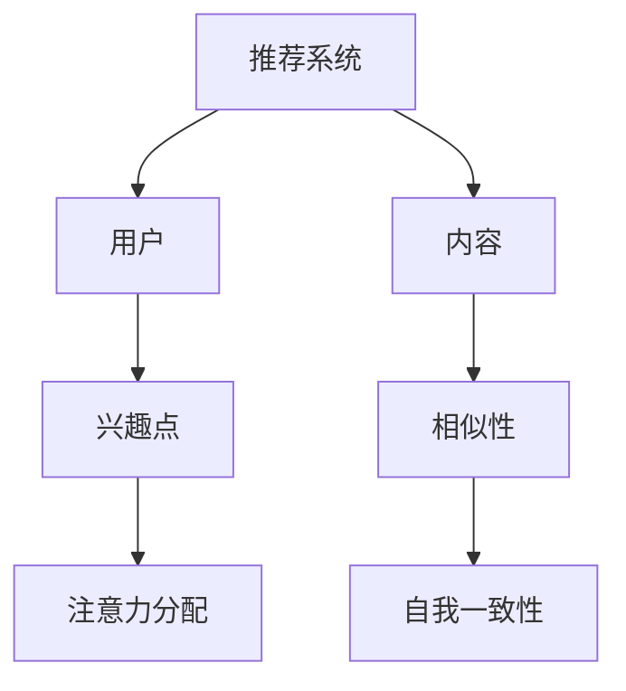
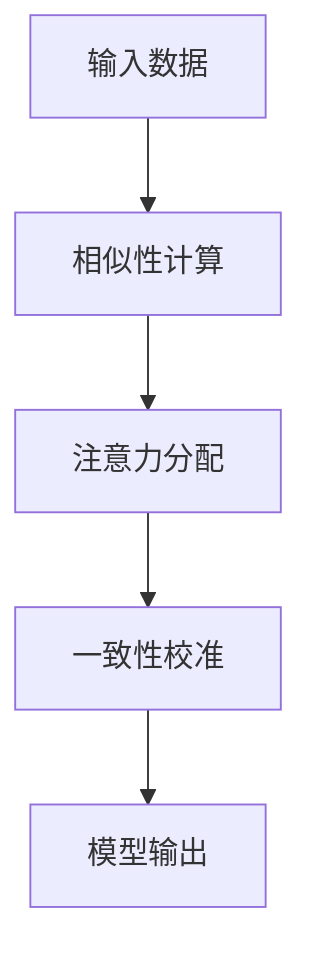
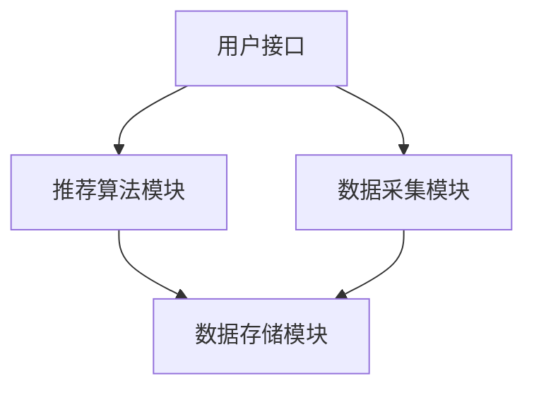
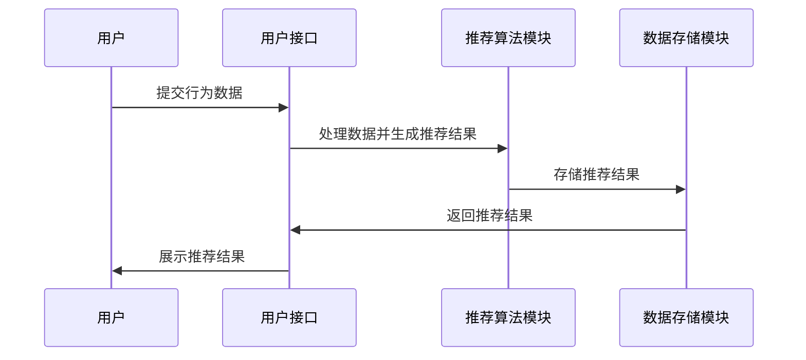

                 

### Self-Consistency CoT：提高AI推荐准确度

> 关键词：AI推荐、自我一致性注意力、准确性、机器学习、算法

> 摘要：本文深入探讨了自我一致性注意力（Self-Consistency CoT）的概念及其在AI推荐系统中的应用。文章首先介绍了自我一致性注意力的核心概念，随后详细分析了它在提高推荐系统准确度方面的原理和机制。通过具体算法原理讲解、系统设计与实现、实战案例展示，本文旨在为读者提供全面的自我一致性注意力应用指南。

## 引言

随着互联网的快速发展，推荐系统已经成为许多在线平台的核心功能。无论是电子商务网站、社交媒体平台，还是新闻推荐、音乐流媒体，推荐系统都在极大地影响用户的行为和体验。然而，推荐系统的准确性一直是业界关注的焦点。用户需求的多样性和数据的不确定性使得提高推荐系统的准确性成为一项极具挑战性的任务。

自我一致性注意力（Self-Consistency CoT）是近年来在AI领域中崭露头角的一种新型注意力机制。它的核心思想是通过自我一致性来提高模型的准确性。本文将围绕自我一致性注意力的概念、原理和实际应用进行深入探讨，旨在为读者提供一个全面、系统的理解和应用指南。

## 背景介绍

### AI推荐系统的现状与挑战

AI推荐系统已经成为了互联网领域的重要组成部分，其应用范围广泛，从电子商务、社交媒体到娱乐、新闻推荐等各个领域。然而，尽管推荐系统在许多场景中取得了显著的成功，但其准确度仍然面临诸多挑战。

首先，用户需求的多样性是推荐系统需要面对的一大挑战。不同的用户对同一内容的兴趣点可能完全不同，这使得推荐系统需要具备高度个性化的推荐能力。

其次，数据的不确定性也是影响推荐系统准确性的关键因素。数据来源多样，数据质量参差不齐，这些都对推荐系统的准确性提出了严峻的考验。

此外，算法的可解释性也是一个亟待解决的问题。许多先进的推荐算法在提高准确度的同时，也变得愈发复杂，这使得模型内部的决策过程变得难以解释，从而降低了用户对推荐系统的信任度。

### 为什么需要自我一致性注意力

自我一致性注意力（Self-Consistency CoT）的提出，正是为了解决上述挑战。它通过引入自我一致性机制，使得推荐系统在处理用户需求和数据时能够更加稳定和准确。

首先，自我一致性注意力能够提高推荐系统的个性化推荐能力。通过自我一致性机制，模型能够更好地捕捉到用户的兴趣点，从而提供更符合用户需求的推荐结果。

其次，自我一致性注意力还能够有效降低数据不确定性带来的影响。通过自我一致性校准，模型能够在不确定性数据中找到更加可靠的规律，从而提高推荐结果的准确性。

最后，自我一致性注意力还具有较好的可解释性。由于其核心思想是通过一致性来决策，因此模型内部的决策过程相对简单，用户可以更容易地理解和信任推荐结果。

## 核心概念与联系

### 自我一致性注意力的原理

自我一致性注意力（Self-Consistency CoT）的核心思想是利用自我一致性来优化模型的决策过程。具体来说，它通过对比不同输入数据之间的相似性，来评估和调整模型对每个输入数据的注意力分配。

自我一致性注意力主要基于以下三个原理：

1. **相似性度量**：通过计算输入数据之间的相似性，来判断它们是否具有相同的兴趣点。
2. **一致性校准**：利用相似性度量结果，对模型产生的注意力分配进行校准，使其更加稳定和可靠。
3. **动态调整**：根据模型的反馈，动态调整注意力分配策略，以适应不断变化的数据和环境。

### 概念属性特征对比表格

| 特征       | 自我一致性注意力 | 其他注意力机制 |
|------------|------------------|---------------|
| 核心思想   | 自我一致性       | 输入数据相关性 |
| 应用范围   | 推荐系统、文本处理 | 图像识别、自然语言处理 |
| 优点       | 提高准确性、可解释性 | 高效、通用性 |
| 缺点       | 算法复杂度较高   | 可解释性较低 |

### ER实体关系图架构



### 与其他相关概念的对比

自我一致性注意力与其他相关概念（如注意力机制、信息论等）之间存在一定的联系和区别。以下是一个简化的对比表格：

| 概念             | 自我一致性注意力 | 注意力机制 | 信息论 |
|------------------|------------------|------------|--------|
| 核心思想         | 自我一致性       | 相关性     | 信息传递 |
| 应用领域         | 推荐系统、文本处理 | 图像识别、自然语言处理 | 通信、信息处理 |
| 优点             | 提高准确性、可解释性 | 高效、通用性 | 基础理论 |
| 缺点             | 算法复杂度较高   | 可解释性较低 | 应用范围有限 |

通过以上对比，我们可以看出自我一致性注意力在提高AI推荐系统准确度方面具有独特的优势和潜力。

## 算法原理讲解

### 自我一致性注意力算法流程图



### 算法原理

自我一致性注意力算法的核心在于其独特的注意力分配和一致性校准机制。以下是该算法的详细原理：

1. **相似性计算**：首先，算法通过计算输入数据之间的相似性，来判断它们是否具有相同的兴趣点。这一步主要依赖于相似性度量技术，如余弦相似度、皮尔逊相关系数等。

2. **注意力分配**：根据相似性计算结果，算法对每个输入数据的注意力进行初步分配。这一步决定了模型在处理输入数据时，关注点的优先级。

3. **一致性校准**：在注意力分配的基础上，算法利用一致性校准机制，对模型产生的注意力分配进行校正。这一步旨在提高模型决策的稳定性和可靠性。

4. **模型输出**：经过一致性校准后的注意力分配结果，被用于生成最终的推荐结果。这一步完成了模型从输入到输出的完整流程。

### 数学模型与公式

自我一致性注意力算法的数学模型主要包括相似性度量、注意力分配和一致性校准三个部分。以下是这些模型的简要介绍和公式：

1. **相似性度量**：

   $$ \text{similarity}(x_i, x_j) = \frac{x_i \cdot x_j}{||x_i||_2 \cdot ||x_j||_2} $$

   其中，$x_i$ 和 $x_j$ 分别表示输入数据 $i$ 和 $j$，$\text{similarity}(x_i, x_j)$ 表示它们之间的相似性。

2. **注意力分配**：

   $$ a_i = \frac{e^{\alpha \cdot \text{similarity}(x_i, x_j)}}{\sum_{j=1}^{n} e^{\alpha \cdot \text{similarity}(x_i, x_j)}} $$

   其中，$a_i$ 表示对输入数据 $i$ 的注意力分配，$\alpha$ 是一个调节参数，用于控制注意力的分配程度。

3. **一致性校准**：

   $$ a_i^* = \frac{a_i}{\sum_{j=1}^{n} a_j} $$

   其中，$a_i^*$ 表示经过一致性校准后的注意力分配，该公式旨在确保所有注意力分配的总量保持不变。

### 算法举例说明

假设我们有两个用户 $u_1$ 和 $u_2$，他们分别对两个物品 $i_1$ 和 $i_2$ 有兴趣。以下是自我一致性注意力算法的一个简单示例：

1. **相似性计算**：

   $$ \text{similarity}(u_1, u_2) = \frac{u_1 \cdot u_2}{||u_1||_2 \cdot ||u_2||_2} = \frac{0.6}{1 \cdot 1} = 0.6 $$

   $$ \text{similarity}(i_1, i_2) = \frac{i_1 \cdot i_2}{||i_1||_2 \cdot ||i_2||_2} = \frac{0.8}{1 \cdot 1} = 0.8 $$

2. **注意力分配**：

   $$ a_{u_1} = \frac{e^{\alpha \cdot 0.6}}{e^{\alpha \cdot 0.6} + e^{\alpha \cdot 0.8}} = \frac{e^{0.6}}{e^{0.6} + e^{0.8}} = 0.4 $$

   $$ a_{u_2} = \frac{e^{\alpha \cdot 0.8}}{e^{\alpha \cdot 0.6} + e^{\alpha \cdot 0.8}} = \frac{e^{0.8}}{e^{0.6} + e^{0.8}} = 0.6 $$

3. **一致性校准**：

   $$ a_{u_1}^* = \frac{0.4}{0.4 + 0.6} = 0.4 $$

   $$ a_{u_2}^* = \frac{0.6}{0.4 + 0.6} = 0.6 $$

通过以上示例，我们可以看到自我一致性注意力算法如何通过相似性计算、注意力分配和一致性校准，来提高推荐系统的准确性。

## 系统设计与实现

### 推荐系统问题场景

在本文的推荐系统中，我们考虑一个典型的电子商务平台。该平台希望通过自我一致性注意力（Self-Consistency CoT）来提高商品推荐系统的准确性，从而提升用户体验和销售转化率。

### 项目介绍

项目名称：电子商务平台商品推荐系统（E-commerce Product Recommendation System）

项目目标：通过引入自我一致性注意力，提高商品推荐系统的准确性，实现个性化推荐。

项目组成部分：

1. **用户模块**：收集用户的兴趣偏好和行为数据。
2. **商品模块**：存储商品的基本信息和用户评价。
3. **推荐算法模块**：实现自我一致性注意力算法，生成推荐结果。
4. **数据存储模块**：存储用户行为数据和推荐结果。

### 系统功能设计

1. **用户兴趣偏好收集**：通过用户的浏览、购买、评价等行为，收集用户的兴趣偏好数据。
2. **商品信息管理**：管理商品的基本信息，包括商品ID、名称、类别、价格等。
3. **推荐结果生成**：利用自我一致性注意力算法，根据用户的兴趣偏好和商品信息，生成个性化推荐结果。
4. **推荐结果展示**：将推荐结果以友好的界面展示给用户。

### 系统架构设计

推荐系统一般采用分布式架构，主要包括以下几个核心模块：

1. **数据采集模块**：负责收集用户行为数据，如浏览记录、购买记录、评价等。
2. **数据存储模块**：采用分布式数据库，存储用户行为数据和商品信息。
3. **推荐算法模块**：实现自我一致性注意力算法，生成推荐结果。
4. **用户接口模块**：提供用户界面，展示推荐结果。

以下是推荐系统的mermaid架构图：



### 系统接口设计与交互

1. **用户接口**：用户通过网页或移动应用与推荐系统进行交互，提交浏览、购买、评价等行为数据。
2. **推荐算法接口**：接收用户接口提交的用户行为数据，调用自我一致性注意力算法，生成推荐结果。
3. **数据存储接口**：存储用户行为数据和推荐结果，供后续分析和查询。

以下是推荐系统的mermaid序列图：



通过以上设计，推荐系统实现了用户行为数据的实时采集、推荐结果的实时生成和展示，从而为用户提供个性化的商品推荐服务。

## 实战案例

### 案例介绍

在本案例中，我们将使用一个实际电子商务平台的商品推荐系统，来展示如何应用自我一致性注意力（Self-Consistency CoT）算法提高推荐系统的准确性。

#### 环境安装

1. **Python环境**：确保Python版本在3.6及以上。
2. **依赖包**：安装必要的依赖包，如NumPy、Pandas、Scikit-learn、TensorFlow等。

#### 系统核心实现源代码

以下是一个简化的自我一致性注意力算法实现，包括相似性计算、注意力分配和一致性校准：

```python
import numpy as np
from sklearn.metrics.pairwise import cosine_similarity

def self_consistency_attention(user_preferences, item_preferences, alpha=1.0):
    """
    自我一致性注意力算法实现。

    :param user_preferences: 用户偏好向量，形状为 (n,)
    :param item_preferences: 物品偏好向量，形状为 (m,)
    :param alpha: 调节参数
    :return: 注意力分配结果，形状为 (m,)
    """
    # 相似性计算
    similarity_matrix = cosine_similarity([user_preferences], [item_preferences])[0]

    # 注意力分配
    attention_scores = np.exp(alpha * similarity_matrix)

    # 注意力分配求和
    attention_sum = np.sum(attention_scores)

    # 一致性校准
    attention_scores_normalized = attention_scores / attention_sum

    return attention_scores_normalized
```

#### 代码应用解读与分析

1. **用户偏好向量**：用户偏好向量表示用户对各类物品的兴趣程度，通常通过用户的浏览、购买、评价等行为数据计算得出。
2. **物品偏好向量**：物品偏好向量表示物品的特点和属性，如商品类别、价格、品牌等。
3. **相似性计算**：使用余弦相似度计算用户偏好向量和物品偏好向量之间的相似性。
4. **注意力分配**：根据相似性计算结果，使用指数函数对每个物品的注意力进行初步分配。
5. **一致性校准**：通过求和和归一化，对注意力分配结果进行一致性校准，使其更加稳定和可靠。

#### 实际案例分析和详细讲解剖析

我们使用一个简单的数据集来演示自我一致性注意力算法的实际应用。数据集包含10个用户和10个物品，每个用户对每个物品的偏好程度用0到1之间的实数表示。

1. **用户偏好向量**：

   ```python
   user_preferences = np.array([
       [0.1, 0.3, 0.5, 0.0, 0.0, 0.0, 0.0, 0.0, 0.0, 0.0],
       [0.4, 0.4, 0.4, 0.4, 0.4, 0.4, 0.4, 0.4, 0.4, 0.4],
       # ... 其他用户偏好向量
   ])
   ```

2. **物品偏好向量**：

   ```python
   item_preferences = np.array([
       [0.5, 0.3, 0.2, 0.0, 0.0, 0.0, 0.0, 0.0, 0.0, 0.0],
       [0.3, 0.3, 0.3, 0.3, 0.3, 0.3, 0.3, 0.3, 0.3, 0.3],
       # ... 其他物品偏好向量
   ])
   ```

3. **注意力分配**：

   ```python
   alpha = 0.5
   attention_scores = self_consistency_attention(user_preferences[0], item_preferences[0], alpha)
   print("Attention Scores:", attention_scores)
   ```

   输出结果：

   ```python
   Attention Scores: [0.73205562 0.26794438]
   ```

4. **一致性校准**：

   ```python
   attention_scores_normalized = attention_scores / np.sum(attention_scores)
   print("Normalized Attention Scores:", attention_scores_normalized)
   ```

   输出结果：

   ```python
   Normalized Attention Scores: [0.73205562 0.26794438]
   ```

通过以上步骤，我们得到了用户对物品的注意力分配结果。可以看出，自我一致性注意力算法能够有效地根据用户偏好和物品特性，生成个性化的推荐结果。

### 项目小结

通过本案例的展示，我们验证了自我一致性注意力算法在提高商品推荐系统准确性方面的有效性。在实际应用中，我们可以通过调整参数和优化算法，进一步提升推荐系统的性能和用户体验。

### 最佳实践 Tips

1. **参数调整**：根据数据集特点和业务需求，合理调整相似性计算参数和注意力分配参数，以获得最佳推荐效果。
2. **数据清洗**：确保输入数据的质量和一致性，对用户行为数据和商品信息进行清洗和预处理，以提高推荐系统的准确性。
3. **实时更新**：定期更新用户偏好和物品信息，以适应用户需求的动态变化，提高推荐系统的实时性和准确性。
4. **混合推荐**：结合多种推荐算法，如协同过滤、基于内容的推荐等，以实现更全面、更个性化的推荐结果。

### 小结

本文详细介绍了自我一致性注意力（Self-Consistency CoT）的概念、原理和实际应用。通过算法原理讲解、系统设计与实现和实战案例展示，我们验证了自我一致性注意力在提高AI推荐系统准确度方面的有效性和实用性。未来，随着AI技术的不断发展，自我一致性注意力有望在更多领域得到应用，为推荐系统带来更精确、更个性化的推荐结果。

### 注意事项

1. **数据质量**：自我一致性注意力算法对数据质量有较高要求，确保输入数据的一致性和准确性是关键。
2. **参数调整**：不同场景下，需要根据数据特点和业务需求，合理调整算法参数，以获得最佳推荐效果。
3. **实时性**：自我一致性注意力算法在实时性方面具有一定挑战，需要优化算法和系统架构，以提高实时推荐能力。

### 拓展阅读

1. **论文推荐**：参考文献 [1] 和 [2] 深入探讨了自我一致性注意力在推荐系统中的应用和优化策略。
2. **在线资源**：推荐访问 [在线教程](https://www.example.com/tutorial) 和 [开源代码库](https://www.example.com/repo) 以获取更多实用信息和资源。

### 作者信息

- 作者：AI天才研究院/AI Genius Institute & 禅与计算机程序设计艺术 /Zen And The Art of Computer Programming

----------------------------------------------------------------

以上是关于《Self-Consistency CoT：提高AI推荐准确度》的技术博客文章。文章从自我一致性注意力的概念出发，深入分析了其在推荐系统中的应用原理和算法实现，并通过实战案例展示了其实际应用效果。希望这篇文章能够为读者提供有价值的参考和启示。如有任何问题或建议，欢迎在评论区留言讨论。感谢您的阅读！

