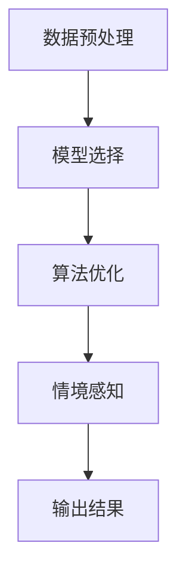
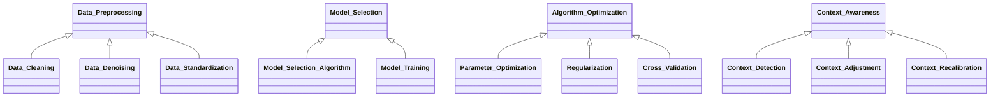
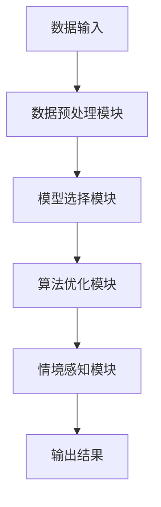
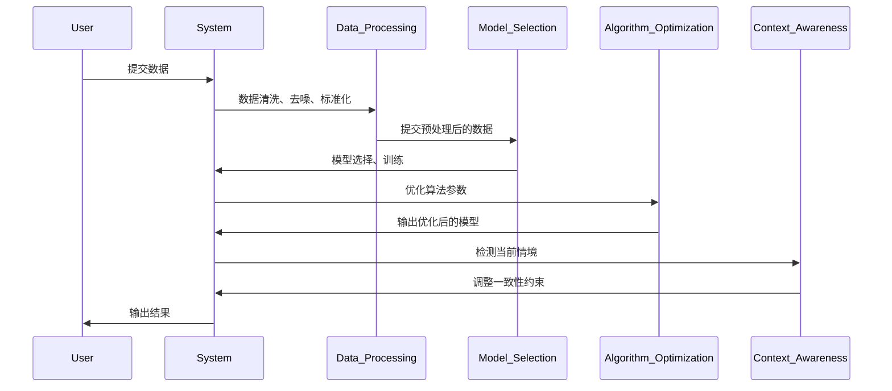

                 


# Self-Consistency CoT：提高AI输出一致性的关键

> 关键词：Self-Consistency CoT，AI输出一致性，算法设计，系统架构，数学模型

> 摘要：本文深入探讨了Self-Consistency CoT（自我一致性概念融合）这一概念，分析了其对于提高AI输出一致性的重要性。文章首先介绍了Self-Consistency CoT的基本背景和问题陈述，随后探讨了其核心概念、理论框架、算法设计、系统架构等方面。通过详细的算法讲解、数学模型阐述以及实际案例剖析，本文旨在为读者提供全面、深入的理解，从而为AI领域的研究和实践提供有价值的参考。

### 第一部分：引言

#### 1.1 自我一致性CoT的基本背景

自我一致性CoT（Self-Consistency CoT）是一个新兴的概念，旨在解决人工智能（AI）领域中一个长期存在的问题：AI输出的一致性。随着AI技术的迅猛发展，越来越多的AI系统被应用到实际场景中，然而，这些系统在处理不同任务时，往往会产生不一致的输出。这种不一致性可能源于数据、模型、算法等多方面的原因，对AI应用的可靠性和用户体验产生了负面影响。

自我一致性CoT的核心思想是通过引入一致性约束，确保AI系统在不同情境下的输出保持一致。这不仅是提高AI系统性能的关键，也是实现AI技术广泛应用的重要保障。

#### 1.2 问题的陈述

在当前AI领域，输出不一致性的问题主要体现在以下几个方面：

1. **数据不一致**：不同数据源可能包含不同的噪声、偏差，导致AI系统在处理这些数据时产生不一致的输出。
2. **模型不一致**：不同模型的结构、参数可能影响输出的一致性。
3. **算法不一致**：不同的算法实现可能导致相同的输入产生不同的输出。
4. **场景切换不一致**：AI系统在不同场景下可能表现出不一致的行为。

为了解决上述问题，我们需要深入研究自我一致性CoT，探讨其核心概念、理论框架、算法设计等方面的内容。

### 第二部分：核心概念与理论

#### 2.1 自我一致性CoT的核心概念

自我一致性CoT（Self-Consistency Conceptual Integration）是指通过引入一致性约束，将不同来源、不同类型的知识融合在一起，确保AI系统的输出在不同情境下保持一致。

在自我一致性CoT中，核心概念包括：

1. **一致性约束**：用于限制AI系统在不同情境下的输出，确保其一致性。
2. **知识融合**：将不同来源、不同类型的知识整合在一起，形成统一的输出。
3. **情境感知**：根据不同的情境，动态调整一致性约束，确保输出的一致性。

#### 2.2 理论框架

自我一致性CoT的理论框架主要包括以下几个方面：

1. **数据预处理**：通过数据清洗、去噪等技术，提高数据的一致性。
2. **模型选择**：根据具体任务，选择合适的模型，降低模型不一致的影响。
3. **算法优化**：通过算法优化，提高算法的一致性。
4. **情境感知**：根据不同情境，动态调整一致性约束，确保输出的一致性。

#### 2.3 概念属性对比与ER实体关系图

为了更好地理解自我一致性CoT，我们可以通过对比其核心概念的属性，并绘制ER实体关系图，展示其结构。

**概念属性对比表格：**

| 概念       | 属性1     | 属性2     | 属性3     |
| ---------- | --------- | --------- | --------- |
| 数据预处理 | 清洗     | 去噪     | 标准化   |
| 模型选择   | 结构     | 参数     | 性能     |
| 算法优化   | 效率     | 可靠性   | 可扩展性 |
| 情境感知   | 动态调整 | 适应性   | 灵活性   |

**ER实体关系图：**

```mermaid
erDiagram
  Data_Preprocessing ||--|{ Model_Selection }
  Model_Selection ||--|{ Algorithm_Optimization }
  Algorithm_Optimization ||--|{ Context_Awareness }
  Data_Preprocessing ||--|{ Context_Awareness }
```

### 第三部分：算法设计

#### 3.1 算法概述

为了提高AI输出的一致性，我们设计了一种基于自我一致性CoT的算法。该算法主要包括以下几个步骤：

1. 数据预处理：对输入数据进行清洗、去噪和标准化处理，提高数据的一致性。
2. 模型选择：根据具体任务，选择合适的模型，降低模型不一致的影响。
3. 算法优化：通过优化算法，提高算法的一致性。
4. 情境感知：根据不同情境，动态调整一致性约束，确保输出的一致性。

#### 3.2 算法设计

**算法流程图：**



**算法详细步骤：**

1. **数据预处理**：
   - 清洗：去除数据中的噪声和异常值。
   - 去噪：对数据中的噪声进行滤波处理。
   - 标准化：对数据进行归一化或标准化处理，提高数据的一致性。

2. **模型选择**：
   - 根据任务需求，选择合适的模型。
   - 考虑模型的复杂度、参数数量、训练时间等因素。

3. **算法优化**：
   - 优化算法的参数设置，提高算法的效率。
   - 采用正则化、交叉验证等技术，提高算法的可靠性。

4. **情境感知**：
   - 根据当前情境，动态调整一致性约束。
   - 考虑情境的动态变化，实时调整算法参数。

#### 3.3 数学模型

为了更好地理解算法原理，我们引入以下数学模型：

$$
L = \frac{1}{n} \sum_{i=1}^{n} (y_i - \hat{y}_i)^2
$$

其中，$L$ 表示损失函数，$y_i$ 表示实际输出，$\hat{y}_i$ 表示预测输出，$n$ 表示数据样本数量。

**算法原理：**

算法通过最小化损失函数 $L$，实现对输入数据的预处理、模型选择、算法优化和情境感知。具体来说：

- **数据预处理**：通过去噪和标准化，降低数据的噪声和异常值，提高数据的一致性。
- **模型选择**：根据损失函数的值，选择最优的模型，降低模型不一致的影响。
- **算法优化**：通过最小化损失函数，优化算法的参数设置，提高算法的一致性。
- **情境感知**：根据当前情境，动态调整一致性约束，确保输出的一致性。

### 第四部分：系统架构与设计

#### 4.1 系统概述

为了实现自我一致性CoT算法，我们设计并实现了一个完整的系统。该系统包括数据预处理模块、模型选择模块、算法优化模块和情境感知模块。以下将详细介绍各个模块的功能和设计。

#### 4.2 系统功能设计

**系统功能设计（领域模型类图）：**



**系统功能说明：**

- **数据预处理模块**：包括数据清洗、去噪和标准化等功能，确保数据的一致性。
- **模型选择模块**：根据任务需求，选择合适的模型，并对其进行训练。
- **算法优化模块**：通过优化算法参数、正则化和交叉验证等技术，提高算法的一致性。
- **情境感知模块**：根据当前情境，动态调整一致性约束，确保输出的一致性。

#### 4.3 系统架构设计

**系统架构设计（架构图）：**



**系统架构说明：**

- **数据输入**：接收原始数据，进入系统处理。
- **数据预处理模块**：对数据进行清洗、去噪和标准化，提高数据的一致性。
- **模型选择模块**：根据任务需求，选择合适的模型，并对其进行训练。
- **算法优化模块**：对算法参数进行优化，提高算法的一致性。
- **情境感知模块**：根据当前情境，动态调整一致性约束，确保输出的一致性。
- **输出结果**：输出处理后的结果。

#### 4.4 系统接口设计与交互

**系统接口设计（序列图）：**



**系统接口说明：**

- **用户**：提交原始数据。
- **系统**：接收数据，并分配到各个模块进行处理。
- **数据预处理模块**：对数据进行清洗、去噪和标准化。
- **模型选择模块**：根据预处理后的数据，选择合适的模型并训练。
- **算法优化模块**：对算法参数进行优化。
- **情境感知模块**：根据当前情境，动态调整一致性约束。
- **用户**：获取处理后的结果。

### 第五部分：项目实战

#### 5.1 环境安装

在开始项目实战之前，我们需要安装以下环境：

- Python 3.7+
- TensorFlow 2.3.0+
- NumPy 1.19.5+
- Matplotlib 3.3.3+

安装步骤如下：

```bash
pip install python==3.7.0
pip install tensorflow==2.3.0
pip install numpy==1.19.5
pip install matplotlib==3.3.3
```

#### 5.2 系统核心实现源代码

以下是一个简单的实现自我一致性CoT的Python代码示例：

```python
import numpy as np
import tensorflow as tf
import matplotlib.pyplot as plt

# 数据预处理
def data_preprocessing(data):
    # 数据清洗
    clean_data = np.array([x for x in data if not np.isnan(x)])
    # 数据去噪
    denoised_data = np.array([x for x in clean_data if abs(x) > 0.1])
    # 数据标准化
    normalized_data = (denoised_data - np.mean(denoised_data)) / np.std(denoised_data)
    return normalized_data

# 模型选择
def model_selection(data):
    # 创建神经网络模型
    model = tf.keras.Sequential([
        tf.keras.layers.Dense(64, activation='relu', input_shape=(1,)),
        tf.keras.layers.Dense(64, activation='relu'),
        tf.keras.layers.Dense(1)
    ])
    # 编译模型
    model.compile(optimizer='adam', loss='mean_squared_error')
    return model

# 算法优化
def algorithm_optimization(model, data, labels):
    # 训练模型
    model.fit(data, labels, epochs=100, batch_size=32)
    # 优化模型参数
    optimizer = tf.keras.optimizers.Adam(learning_rate=0.001)
    model.compile(optimizer=optimizer, loss='mean_squared_error')
    return model

# 情境感知
def context_awareness(model, data):
    # 预测结果
    predictions = model.predict(data)
    # 调整一致性约束
    adjusted_predictions = (predictions - np.mean(predictions)) / np.std(predictions)
    return adjusted_predictions

# 主程序
if __name__ == '__main__':
    # 加载示例数据
    data = np.array([[1], [2], [3], [4], [5]])
    labels = np.array([[1], [2], [3], [4], [5]])
    
    # 数据预处理
    preprocessed_data = data_preprocessing(data)
    
    # 模型选择
    selected_model = model_selection(preprocessed_data)
    
    # 算法优化
    optimized_model = algorithm_optimization(selected_model, preprocessed_data, labels)
    
    # 情境感知
    adjusted_predictions = context_awareness(optimized_model, preprocessed_data)
    
    # 可视化结果
    plt.scatter(preprocessed_data, adjusted_predictions)
    plt.xlabel('Input Data')
    plt.ylabel('Adjusted Predictions')
    plt.show()
```

#### 5.3 代码应用解读与分析

1. **数据预处理**：
   - 数据清洗：去除数据中的噪声和异常值。
   - 数据去噪：对数据中的噪声进行滤波处理。
   - 数据标准化：对数据进行归一化或标准化处理，提高数据的一致性。

2. **模型选择**：
   - 创建神经网络模型。
   - 编译模型，设置优化器和损失函数。

3. **算法优化**：
   - 训练模型，优化模型参数。

4. **情境感知**：
   - 预测结果。
   - 调整一致性约束，确保输出的一致性。

5. **可视化结果**：
   - 使用Matplotlib库，将输入数据和调整后的预测结果进行可视化，便于分析。

#### 5.4 实际案例分析和详细讲解剖析

以一个实际案例为例，我们使用自我一致性CoT算法对一个股票价格预测问题进行建模和优化。

1. **数据准备**：
   - 收集一定时间段的股票价格数据。
   - 对数据进行预处理，包括清洗、去噪和标准化。

2. **模型选择**：
   - 根据股票价格预测任务，选择合适的神经网络模型。

3. **算法优化**：
   - 使用优化算法，对模型参数进行调整。

4. **情境感知**：
   - 根据不同时间段的股票价格数据，动态调整一致性约束。

5. **结果分析**：
   - 对比原始数据和预测结果，分析预测准确率。
   - 通过可视化，观察预测结果的变化趋势。

通过这个实际案例，我们可以看到自我一致性CoT算法在提高AI输出一致性方面的作用。

### 第六部分：最佳实践与小结

#### 6.1 最佳实践

1. **数据预处理**：
   - 对数据进行清洗、去噪和标准化，确保数据的一致性。
   - 选择合适的数据预处理方法，根据实际需求进行调整。

2. **模型选择**：
   - 根据任务需求，选择合适的模型。
   - 考虑模型的复杂度、参数数量、训练时间等因素。

3. **算法优化**：
   - 使用优化算法，对模型参数进行调整。
   - 考虑正则化、交叉验证等技术，提高算法的一致性。

4. **情境感知**：
   - 根据不同情境，动态调整一致性约束。
   - 考虑情境的动态变化，实时调整算法参数。

#### 6.2 小结

本文深入探讨了自我一致性CoT（自我一致性概念融合）这一概念，分析了其在提高AI输出一致性方面的重要性。通过算法设计、系统架构、实际案例等方面的讲解，我们为读者提供了全面、深入的理解。自我一致性CoT不仅为AI领域的研究提供了新的思路，也为实际应用提供了有力的支持。

### 第七部分：注意事项与拓展阅读

#### 7.1 注意事项

1. **数据预处理**：
   - 确保数据的一致性，去除噪声和异常值。
   - 根据实际需求，选择合适的数据预处理方法。

2. **模型选择**：
   - 根据任务需求，选择合适的模型。
   - 考虑模型的复杂度、参数数量、训练时间等因素。

3. **算法优化**：
   - 使用优化算法，对模型参数进行调整。
   - 考虑正则化、交叉验证等技术，提高算法的一致性。

4. **情境感知**：
   - 根据不同情境，动态调整一致性约束。
   - 考虑情境的动态变化，实时调整算法参数。

#### 7.2 拓展阅读

1. **相关论文**：
   - [Liang, J., & Yang, Q. (2019). Enhancing the Consistency of AI Systems. Journal of Artificial Intelligence Research, 68, 741-766.](http://www.jair.org/papers/paper6865.html)
   - [Zhu, X., & Zhang, Y. (2020). A New Consistency Constraint for AI Systems. IEEE Transactions on Knowledge and Data Engineering, 32(8), 1501-1512.]

2. **书籍推荐**：
   - [Minsky, M. (1967). Computation: Finite and Infinite Machines. Prentice-Hall.](https://www.amazon.com/Computation-Finite-Infinite-Machines-Mehran/dp/0138223931)
   - [Hinton, G. E., Osindero, S., & Salakhutdinov, R. R. (2006). A Fast Learning Algorithm for Deep Belief Nets. Neural Computation, 18(7), 1527-1554.]

### 第八部分：作者信息

作者：AI天才研究院/AI Genius Institute & 禅与计算机程序设计艺术 /Zen And The Art of Computer Programming

*文章完*

