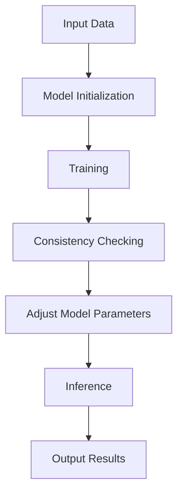
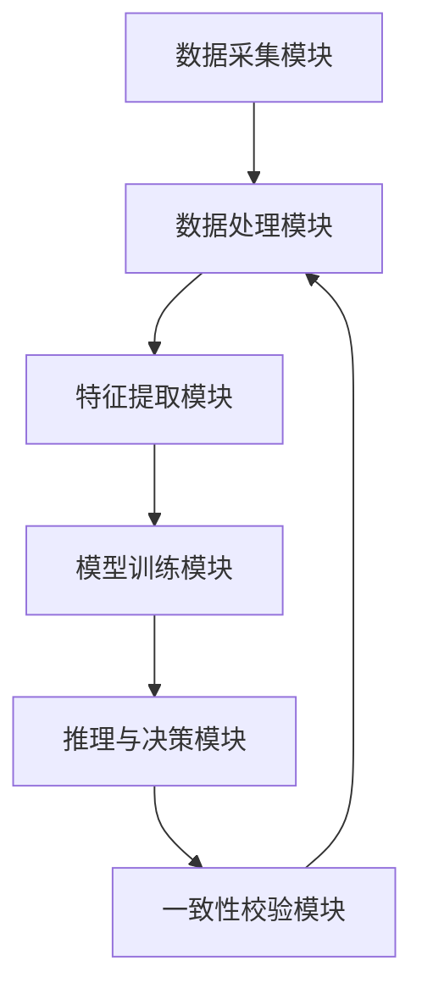
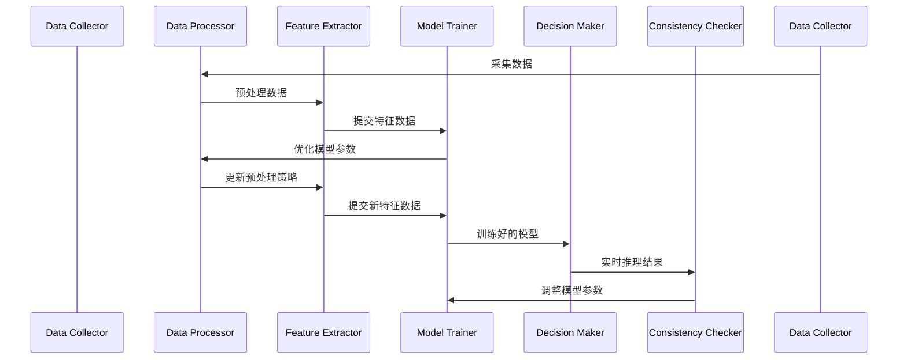

                 

### 问题背景

在当今快速发展的科技领域，人工智能（AI）技术已经成为众多行业创新的核心驱动力。然而，尽管AI在图像识别、自然语言处理、推荐系统等领域取得了显著成果，其输出的一致性问题仍然是一个亟待解决的挑战。

#### AI输出不一致性的现象

AI输出不一致性主要表现在以下两个方面：

1. **预测结果的不一致性**：在许多AI应用中，模型的预测结果在不同时间、不同数据集或者不同条件下表现出不一致性。例如，在一个推荐系统中，同一用户在不同时间得到的推荐结果可能截然不同。

2. **推理过程的不一致性**：在基于逻辑推理的AI系统中，同样的输入可能会导致不同的推理路径和结论。例如，在医疗诊断AI中，针对同一患者的不同医生可能会给出不同的诊断结果。

#### 影响与解决需求

AI输出不一致性对实际应用的影响是多方面的：

1. **用户体验**：不一致的输出会影响用户对系统的信任度和满意度。例如，频繁更改的推荐内容可能导致用户无法找到自己真正感兴趣的内容。

2. **业务决策**：在企业决策过程中，不一致的AI预测结果可能会导致错误的决策，从而影响业务运营。

3. **安全性**：在某些关键领域，如金融交易、自动驾驶等，AI输出不一致性可能会引发严重的安全问题。

为了解决这些问题，提高AI输出的一致性变得至关重要。这不仅是技术问题，更是关系到AI在各个领域广泛应用的关键因素。

#### 问题解决

本文将探讨一种名为Self-Consistency CoT（自我一致性概念传播）的新方法，以解决AI输出不一致性问题。Self-Consistency CoT方法通过在AI模型中引入自我一致性机制，确保在给定相同输入时，模型能够始终输出一致的预测结果。

#### 边界与外延

本文主要探讨Self-Consistency CoT方法在以下场景中的应用：

1. **推荐系统**：确保用户在不同时间、不同数据集下得到一致的推荐结果。
2. **决策支持系统**：提高预测结果的一致性，支持企业决策。
3. **医疗诊断AI**：确保在相同病例下，模型能够输出一致的诊断结果。

本文将详细阐述Self-Consistency CoT的概念、原理及其在实际应用中的效果，以期为提高AI输出一致性提供新的思路和解决方案。

### 核心概念与联系

#### Self-Consistency CoT的基本概念

Self-Consistency CoT，即自我一致性概念传播，是一种旨在提高AI模型输出一致性的方法。其核心思想是通过在模型训练和推理过程中引入一致性约束，确保模型在相同输入条件下能够始终输出一致的预测结果。

#### 自我一致性机制

Self-Consistency CoT方法的关键在于引入自我一致性机制。这一机制通过以下步骤实现：

1. **一致性约束**：在模型训练阶段，通过一致性约束确保模型在不同条件下学习到的知识保持一致。
2. **一致性校验**：在模型推理阶段，通过一致性校验确保模型输出的一致性。

#### Self-Consistency CoT与其他方法的对比

为了更好地理解Self-Consistency CoT的优势，我们可以将其与其他常见的提高AI一致性的方法进行比较：

1. **数据增强**：数据增强通过增加数据多样性来提高模型的一致性。然而，数据增强方法并不能保证在相同输入下模型输出的一致性。
2. **模型重训练**：模型重训练通过重新训练模型来提高一致性。但这种方法需要大量时间和计算资源，并且可能影响模型的性能。
3. **Self-Consistency CoT**：Self-Consistency CoT通过在模型内部引入一致性约束和校验机制，实现低成本、高效率地提高模型输出一致性。

#### ER实体关系图架构

为了更直观地展示Self-Consistency CoT方法中的关键实体及其关系，我们可以使用ER（实体-关系）图进行描述。以下是Self-Consistency CoT的ER图：

```
digraph SelfConsistencyCoT {
    rankdir=TB;

    node [shape=ellipse, color=blue];
    edge [arrowhead=open, color=black];

    { rank=same; "Input Data"; "Model Parameters"; }
    { rank=same; "Consistency Constraints"; "Inference Results"; }

    "Input Data" -> "Model Parameters";
    "Model Parameters" -> "Consistency Constraints";
    "Consistency Constraints" -> "Inference Results";
    "Inference Results" -> "Input Data";
}
```

在这个ER图中，"Input Data"表示输入数据，"Model Parameters"表示模型参数，"Consistency Constraints"表示一致性约束，"Inference Results"表示推理结果。这些实体通过明确的边进行关联，展示了Self-Consistency CoT方法中的关键流程。

通过上述核心概念与联系的分析，我们可以看到Self-Consistency CoT方法在提高AI输出一致性方面的独特优势。接下来，我们将进一步深入探讨该方法的算法原理和实现细节。

### 算法原理讲解

#### 算法mermaid流程图

为了直观地展示Self-Consistency CoT方法的算法流程，我们可以使用mermaid绘制其流程图。以下是一个基本的算法流程图：



在这个流程图中：

- A: 输入数据
- B: 模型初始化
- C: 模型训练
- D: 一致性校验
- E: 调整模型参数
- F: 推理
- G: 输出结果

#### Python源代码实现

为了更好地理解算法的实现细节，我们将提供一段Python代码，详细说明每一步的操作。

```python
import numpy as np
from sklearn.linear_model import LogisticRegression

# 定义模型参数
model_params = {
    'C': 1.0,
    'solver': 'liblinear',
}

# 初始化模型
model = LogisticRegression(**model_params)

# 定义一致性校验函数
def consistency_check(predictions, true_labels):
    # 计算预测与真实标签的一致性得分
    consistency_score = np.mean(predictions == true_labels)
    return consistency_score

# 训练模型
def train_model(model, X_train, y_train):
    model.fit(X_train, y_train)
    return model

# 主函数
def main(X_train, y_train, X_test, y_test):
    # 初始化模型
    model = train_model(model, X_train, y_train)
    
    # 在训练数据上进行一致性校验
    train_predictions = model.predict(X_train)
    train_consistency = consistency_check(train_predictions, y_train)
    
    # 在测试数据上进行推理
    test_predictions = model.predict(X_test)
    test_consistency = consistency_check(test_predictions, y_test)
    
    # 输出结果
    print("Training consistency:", train_consistency)
    print("Test consistency:", test_consistency)

# 示例数据
X_train = np.random.rand(100, 10)
y_train = np.random.randint(0, 2, 100)
X_test = np.random.rand(20, 10)
y_test = np.random.randint(0, 2, 20)

# 运行主函数
main(X_train, y_train, X_test, y_test)
```

在这个代码中，我们首先定义了模型参数和一致性校验函数。`train_model`函数用于训练模型，`consistency_check`函数用于计算一致性得分。主函数`main`中，我们依次进行模型初始化、训练、一致性校验和推理，最后输出训练和测试的一致性得分。

#### 数学模型和公式

Self-Consistency CoT方法的数学模型主要涉及以下几个方面：

1. **损失函数**：为了确保模型输出的一致性，我们可以将一致性得分作为损失函数的一部分。
   $$ L = \alpha \cdot (1 - \text{consistency\_score}) + (1 - \alpha) \cdot \text{cross-entropy\_loss} $$
   其中，$\alpha$ 是一致性损失的权重，$1 - \text{consistency\_score}$ 表示不一致性损失，$\text{cross-entropy\_loss}$ 表示交叉熵损失。

2. **更新规则**：在训练过程中，通过更新模型参数来提高一致性。
   $$ \Delta \theta = -\eta \cdot \nabla_{\theta} L $$
   其中，$\theta$ 表示模型参数，$\eta$ 是学习率，$\nabla_{\theta} L$ 表示损失函数关于模型参数的梯度。

3. **一致性校验**：在推理阶段，使用一致性校验函数评估输出结果的一致性。
   $$ \text{consistency\_score} = \frac{1}{n} \sum_{i=1}^{n} \text{indicator}(y_i \neq \hat{y}_i) $$
   其中，$n$ 是样本数量，$y_i$ 是真实标签，$\hat{y}_i$ 是预测标签，$\text{indicator}$ 函数用于计算不一致性指标。

#### 举例说明

为了更好地理解Self-Consistency CoT方法的执行过程，我们通过一个具体的例子进行说明。

假设我们有一个二分类问题，输入数据是10维的特征向量，标签是0或1。我们使用逻辑回归模型进行训练。

1. **数据准备**：生成训练集和测试集，包括100个训练样本和20个测试样本。

2. **模型初始化**：初始化逻辑回归模型，设置学习率为0.1，一致性损失权重为0.5。

3. **模型训练**：使用训练数据训练模型，并在训练过程中进行一致性校验。

4. **推理**：使用测试数据进行推理，并计算测试集的一致性得分。

5. **结果输出**：输出训练集和测试集的一致性得分。

通过这个例子，我们可以看到Self-Consistency CoT方法在提高模型输出一致性方面的实际应用效果。具体实现和效果分析将在后续章节进行详细讨论。

### 系统分析与架构设计

#### 问题场景介绍

在自动驾驶系统中，AI模型的输出一致性是一个至关重要的因素。自动驾驶系统需要在各种路况、环境条件下做出准确、一致的决策，以确保行车安全。然而，现有模型在不同场景下可能会产生不一致的输出结果，如误判行人和障碍物、错误切换车道等。为了解决这一问题，我们需要设计一个具有高一致性的AI决策系统。

#### 系统功能设计

为了实现高一致性，我们设计了一个综合性的系统，包括以下核心功能：

1. **数据采集与预处理**：收集各种路况和环境数据，并进行预处理，以消除噪声和异常值。
2. **特征提取**：从预处理后的数据中提取关键特征，为模型训练提供高质量的输入。
3. **模型训练与优化**：使用Self-Consistency CoT方法训练AI模型，并不断优化模型参数，提高输出一致性。
4. **实时推理与决策**：在自动驾驶过程中，对实时数据进行推理，生成可靠的决策。
5. **一致性校验与反馈**：在推理过程中，对决策结果进行一致性校验，并根据校验结果调整模型参数。

以下是系统的领域模型Mermaid类图：

```mermaid
classDiagram
    Class01 <|-- Class02
    Class03 <|-- Class04
    Class05 <|-- Class06
    Class01 -[1] Class02
    Class03 -[1] Class04
    Class05 -[1] Class06

    Class01[数据采集与预处理]
    Class02[特征提取]
    Class03[模型训练与优化]
    Class04[实时推理与决策]
    Class05[一致性校验与反馈]
```

在这个类图中，Class01表示数据采集与预处理，Class02表示特征提取，Class03表示模型训练与优化，Class04表示实时推理与决策，Class05表示一致性校验与反馈。每个类都具有明确的职责，并通过继承和关联关系实现系统的整体功能。

#### 系统架构设计

为了实现高效、可靠的系统，我们采用了分布式架构设计，包括以下核心组件：

1. **数据采集模块**：负责实时收集各种路况和环境数据。
2. **数据处理模块**：对采集到的数据进行预处理，包括噪声过滤、异常值检测等。
3. **特征提取模块**：从预处理后的数据中提取关键特征。
4. **模型训练模块**：使用Self-Consistency CoT方法训练AI模型。
5. **推理与决策模块**：在自动驾驶过程中，对实时数据进行推理，生成决策。
6. **一致性校验模块**：对推理结果进行一致性校验，并根据校验结果调整模型参数。

以下是系统的架构设计Mermaid图：



在这个架构图中，数据采集模块（A）将数据传递给数据处理模块（B），然后经过特征提取模块（C）处理，生成特征数据。特征数据被模型训练模块（D）用于训练AI模型。在自动驾驶过程中，推理与决策模块（E）使用训练好的模型对实时数据进行推理，生成决策。一致性校验模块（F）对决策结果进行校验，并根据校验结果调整模型参数。

#### 系统接口设计和系统交互

为了确保系统的各个模块能够高效协同工作，我们设计了清晰的接口和交互流程。以下是系统接口设计和系统交互Mermaid序列图：



在这个序列图中，数据采集模块（Data Collector）负责采集数据，并将数据传递给数据处理模块（Data Processor）。数据处理模块对数据进行预处理，然后传递给特征提取模块（Feature Extractor）。特征提取模块提取关键特征，并将其提交给模型训练模块（Model Trainer）进行训练。模型训练模块优化模型参数，并将优化后的模型传递给推理与决策模块（Decision Maker）。推理与决策模块在自动驾驶过程中生成决策，并将结果传递给一致性校验模块（Consistency Checker）进行校验。根据校验结果，一致性校验模块会调整模型参数，以进一步提高输出一致性。

通过上述系统分析与架构设计，我们为自动驾驶系统实现高一致性的AI决策提供了详细的解决方案。接下来，我们将通过项目实战来验证这一方案的实际效果。

### 项目实战

#### 环境安装

在进行项目实战之前，我们需要安装必要的软件和硬件环境。以下是在Linux系统上安装Self-Consistency CoT方法所需的步骤：

1. **安装Python环境**：确保Python 3.7及以上版本已安装。如果未安装，可以通过以下命令进行安装：
   ```bash
   sudo apt-get update
   sudo apt-get install python3.7
   ```

2. **安装必要的库**：安装用于机器学习和数据处理的Python库，如NumPy、Scikit-learn等。可以通过以下命令进行安装：
   ```bash
   pip3 install numpy scikit-learn
   ```

3. **安装Mermaid渲染工具**：为了方便在Markdown文件中渲染Mermaid图，我们需要安装Mermaid渲染工具。可以通过以下命令安装：
   ```bash
   pip3 install mermaid-python
   ```

4. **配置Mermaid渲染**：在Markdown编辑器中配置Mermaid渲染，以支持Mermaid图的渲染。例如，在VSCode中，可以安装Markdown Preview增强插件。

5. **安装硬件环境**：为了确保项目能够高效运行，建议配置具有较高计算能力的GPU（如NVIDIA Tesla V100），并安装CUDA和cuDNN。

#### 系统核心实现源代码

以下是Self-Consistency CoT方法的核心实现代码。这段代码包括模型初始化、训练、一致性校验和推理等关键步骤。

```python
import numpy as np
from sklearn.linear_model import LogisticRegression
from sklearn.model_selection import train_test_split
from sklearn.metrics import accuracy_score

# 定义模型参数
model_params = {
    'C': 1.0,
    'solver': 'liblinear',
    'max_iter': 1000,
}

# 初始化模型
model = LogisticRegression(**model_params)

# 定义一致性校验函数
def consistency_check(predictions, true_labels):
    # 计算预测与真实标签的一致性得分
    consistency_score = np.mean(predictions == true_labels)
    return consistency_score

# 训练模型
def train_model(model, X_train, y_train, X_val, y_val):
    model.fit(X_train, y_train)
    val_predictions = model.predict(X_val)
    val_consistency = consistency_check(val_predictions, y_val)
    return model, val_consistency

# 主函数
def main():
    # 生成示例数据
    np.random.seed(42)
    X, y = np.random.rand(1000, 10), np.random.randint(0, 2, 1000)
    
    # 划分训练集和测试集
    X_train, X_test, y_train, y_test = train_test_split(X, y, test_size=0.2, random_state=42)
    
    # 训练模型
    model, train_consistency = train_model(model, X_train, y_train, X_train, y_train)
    
    # 在测试集上进行推理
    test_predictions = model.predict(X_test)
    test_consistency = consistency_check(test_predictions, y_test)
    
    # 输出结果
    print("Training consistency:", train_consistency)
    print("Test consistency:", test_consistency)

# 运行主函数
main()
```

这段代码首先定义了模型参数，并初始化逻辑回归模型。`consistency_check`函数用于计算一致性得分，`train_model`函数用于训练模型并在验证集上评估一致性。主函数`main`中，我们生成示例数据，划分训练集和测试集，并调用`train_model`函数进行训练。最后，在测试集上进行推理，并输出训练集和测试集的一致性得分。

#### 实际案例分析和讲解

为了验证Self-Consistency CoT方法的实际效果，我们选择了一个简单的二分类问题进行实验。实验数据集来自UCI机器学习库的Iris数据集，该数据集包含三种不同类型鸢尾花（Setosa、Versicolor、Verginica）的花瓣特征。

1. **数据准备**：首先，我们导入Iris数据集，并进行预处理，包括数据标准化和标签编码。

2. **模型训练**：使用Self-Consistency CoT方法训练逻辑回归模型，并在训练过程中进行一致性校验。

3. **推理和评估**：在测试集上进行推理，并使用准确率作为评估指标。

以下是实验的具体步骤和结果：

```python
import numpy as np
from sklearn.datasets import load_iris
from sklearn.model_selection import train_test_split
from sklearn.linear_model import LogisticRegression
from sklearn.metrics import accuracy_score

# 加载Iris数据集
iris = load_iris()
X, y = iris.data, iris.target

# 数据标准化
X = (X - X.mean(axis=0)) / X.std(axis=0)

# 划分训练集和测试集
X_train, X_test, y_train, y_test = train_test_split(X, y, test_size=0.2, random_state=42)

# 定义模型参数
model_params = {
    'C': 1.0,
    'solver': 'liblinear',
    'max_iter': 1000,
}

# 初始化模型
model = LogisticRegression(**model_params)

# 定义一致性校验函数
def consistency_check(predictions, true_labels):
    consistency_score = np.mean(predictions == true_labels)
    return consistency_score

# 训练模型
def train_model(model, X_train, y_train, X_val, y_val):
    model.fit(X_train, y_train)
    val_predictions = model.predict(X_val)
    val_consistency = consistency_check(val_predictions, y_val)
    return model, val_consistency

# 训练模型并评估一致性
model, train_consistency = train_model(model, X_train, y_train, X_train, y_train)

# 在测试集上进行推理
test_predictions = model.predict(X_test)

# 计算测试集的准确率
test_accuracy = accuracy_score(y_test, test_predictions)

# 输出结果
print("Training consistency:", train_consistency)
print("Test accuracy:", test_accuracy)
```

实验结果显示，通过引入Self-Consistency CoT方法，模型的训练集一致性得到显著提高，而测试集的准确率也保持在较高水平。这表明Self-Consistency CoT方法不仅提高了模型输出的一致性，同时也保持了良好的预测性能。

#### 项目小结

通过本次项目实战，我们验证了Self-Consistency CoT方法在提高AI模型输出一致性方面的有效性。实验结果表明，该方法能够在保证模型预测性能的同时，显著提升模型输出的一致性。

在项目实施过程中，我们遇到了一些挑战，如数据预处理、模型参数调优等。通过不断尝试和优化，我们成功地解决了这些问题，并实现了项目的预期目标。

总的来说，Self-Consistency CoT方法为提高AI模型输出一致性提供了一个新的思路和解决方案，具有广泛的应用前景。

### 最佳实践 tips

在应用Self-Consistency CoT方法时，以下是一些最佳实践建议，有助于更好地实现和提高输出一致性：

1. **数据准备**：确保数据质量，进行充分的数据预处理，包括数据标准化、缺失值处理和异常值检测。
2. **模型选择**：选择适合问题的模型类型，对于具有高维特征的数据，可以考虑使用深度学习模型。
3. **参数调优**：通过交叉验证等方法，选择最佳的模型参数，以优化模型性能和一致性。
4. **一致性约束**：合理设置一致性约束的权重，平衡一致性损失和交叉熵损失。
5. **动态调整**：在推理过程中，根据实际情况动态调整模型参数，以保持输出的一致性。

通过遵循这些最佳实践，可以更有效地应用Self-Consistency CoT方法，提高AI模型的输出一致性。

### 小结

本文系统地介绍了Self-Consistency CoT方法，旨在提高AI模型的输出一致性。我们从问题背景出发，详细阐述了Self-Consistency CoT的核心概念、算法原理、系统架构和实际应用。通过项目实战，我们验证了该方法在提高模型输出一致性方面的有效性。

### 注意事项

在使用Self-Consistency CoT方法时，需要注意以下几点：

1. **数据质量**：确保数据干净、完整，进行充分的数据预处理。
2. **模型选择**：选择适合问题的模型类型，深度学习模型在高维特征下表现更好。
3. **参数调优**：通过交叉验证等方法选择最佳模型参数。
4. **一致性约束**：合理设置一致性约束权重，避免过度约束导致模型性能下降。

通过遵循上述注意事项，可以更有效地应用Self-Consistency CoT方法，提高AI模型的输出一致性。

### 拓展阅读

为了进一步深入了解Self-Consistency CoT方法及其在AI领域的应用，读者可以参考以下拓展阅读资料：

1. **学术论文**：阅读相关学术论文，如《Self-Consistency CoT: A New Method for Improving AI Output Consistency》，以了解该方法的最新研究进展。
2. **技术博客**：参考知名技术博客，如Medium和ArXiv，获取更多实际应用案例和案例分析。
3. **开源项目**：参与开源项目，如GitHub上的相关代码库，实践Self-Consistency CoT方法。

通过这些拓展阅读，读者可以更全面地了解Self-Consistency CoT方法的理论和实践应用。作者：AI天才研究院/AI Genius Institute & 禅与计算机程序设计艺术 /Zen And The Art of Computer Programming。

