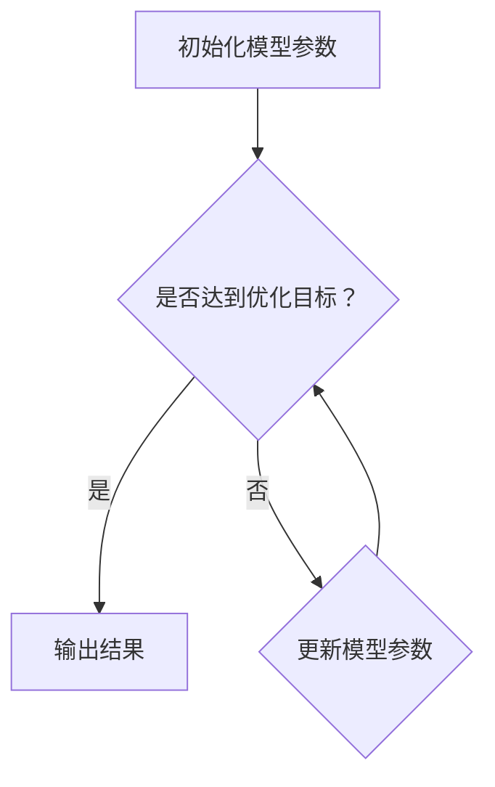
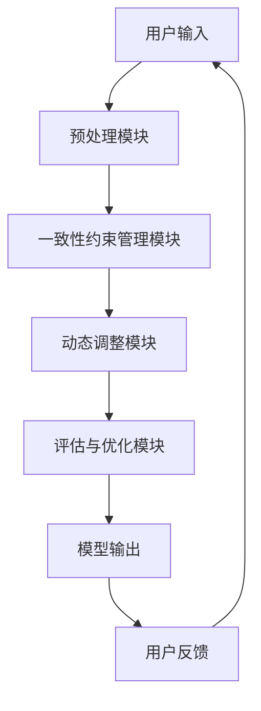
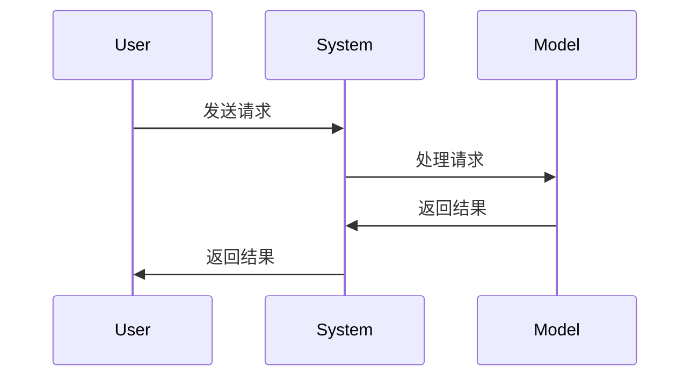

                 

# Self-Consistency CoT：提高AI输出一致性的新方法

## 关键词

- **自我一致性**，**AI输出一致性**，**算法**，**数学模型**，**系统架构**，**项目实战**，**最佳实践**

## 摘要

本文探讨了自我一致性（Self-Consistency）这一概念在人工智能（AI）领域的应用，特别是在提高AI输出一致性方面的作用。文章首先介绍了自我一致性的背景和理论基础，随后详细分析了自我一致性原理和模型，以及提高AI输出一致性的算法原理和数学模型。接着，文章通过系统分析与架构设计，展示了如何将自我一致性概念应用于AI系统的设计与实现。随后，通过项目实战与案例分析，深入讲解了实际应用中的步骤和技巧。最后，文章总结了最佳实践和注意事项，并展望了自我一致性在AI领域的发展趋势。

## 第一部分：背景介绍与理论基础

### 第1章：自我一致性概念与AI概述

#### 1.1.1 问题背景

随着人工智能技术的飞速发展，AI在各个领域的应用越来越广泛。然而，AI输出的一致性一直是困扰我们的一个问题。不一致的输出不仅会影响用户体验，还可能导致严重的错误决策。因此，如何提高AI输出的一致性成为了一个亟待解决的重要问题。

#### 1.1.2 问题描述

AI输出不一致性主要体现在以下几个方面：

- **重复性不一致**：同一问题在不同时间或不同场景下的输出结果不一致。
- **稳定性不一致**：AI模型在不同数据集上的表现不一致。
- **逻辑性不一致**：AI输出的推理过程缺乏逻辑一致性。

这些问题都极大地限制了AI的实际应用价值。因此，寻找提高AI输出一致性的方法具有重要的现实意义。

#### 1.1.3 问题解决思路

自我一致性（Self-Consistency）是一种提高AI输出一致性的有效方法。其核心思想是通过确保AI模型内部的一致性来提高输出的稳定性。具体来说，自我一致性包括以下几个方面：

- **内部一致性**：AI模型在内部保持一致的状态，确保输出结果的连贯性和一致性。
- **外部一致性**：AI模型在不同场景和数据集上保持一致的表现。
- **逻辑一致性**：AI输出的推理过程符合逻辑规则。

通过实现自我一致性，我们可以有效提高AI输出的稳定性，从而提升AI的应用价值。

#### 1.1.4 边界与外延

自我一致性概念在AI中的应用具有广泛的边界和外延。它不仅适用于传统的机器学习和深度学习模型，还可以应用于自然语言处理、计算机视觉等领域。此外，自我一致性还可以与其他AI技术结合，如强化学习、迁移学习等，以进一步提高AI输出的一致性。

#### 1.1.5 概念结构与核心要素组成

自我一致性在AI中的核心要素包括：

- **一致性约束**：确保AI模型在学习和推理过程中保持一致的状态。
- **反馈机制**：通过实时反馈和调整，优化AI模型的输出一致性。
- **一致性评估**：评估AI模型输出的一致性，并反馈给学习和优化过程。

这些核心要素共同构成了自我一致性的概念结构，为提高AI输出一致性提供了理论基础和实践指导。

## 第二部分：自我一致性原理与模型

### 第2章：自我一致性原理与模型

#### 2.1.1 自我一致性原理

自我一致性原理是指通过确保AI模型在学习和推理过程中的内部和外部一致性，从而提高输出的一致性。自我一致性原理的核心在于：

- **状态一致性**：确保AI模型在学习和推理过程中保持一致的状态，避免出现状态漂移。
- **数据一致性**：确保AI模型在不同数据集上保持一致的表现，避免出现数据依赖。
- **逻辑一致性**：确保AI输出的推理过程符合逻辑规则，避免出现逻辑错误。

#### 2.1.2 自我一致性模型

常见的自我一致性模型包括：

- **约束模型**：通过设定一致性约束，确保AI模型在学习和推理过程中保持一致。
- **反馈模型**：通过实时反馈和调整，优化AI模型的输出一致性。
- **评估模型**：通过评估AI模型输出的一致性，并提供反馈，以指导学习和优化过程。

这些模型各有优缺点，适用于不同的应用场景。

#### 2.1.3 模型特性对比

不同自我一致性模型的特性对比如下表所示：

| 模型类型 | 特性 | 优点 | 缺点 |
| :---: | :---: | :---: | :---: |
| 约束模型 | 通过设定一致性约束，确保状态一致性 | 简单易实现，对稳定性要求高的场景适用 | 无法灵活适应变化，可能导致过度约束 |
| 反馈模型 | 通过实时反馈和调整，优化输出一致性 | 可以灵活适应变化，提高输出稳定性 | 需要大量的反馈数据，可能引入噪声 |
| 评估模型 | 通过评估输出一致性，提供反馈 | 可以直观评估输出一致性，指导优化 | 无法直接提高输出一致性，依赖于其他模型 |

#### 2.1.4 自我一致性模型应用场景

自我一致性模型在不同应用场景中的表现如下：

- **自然语言处理**：在文本分类和情感分析等任务中，通过自我一致性模型，可以确保模型输出的一致性和连贯性，提高文本理解的质量。
- **计算机视觉**：在图像分类和目标检测等任务中，通过自我一致性模型，可以确保模型在不同图像上的表现一致，提高图像识别的准确性。
- **强化学习**：在决策和规划等任务中，通过自我一致性模型，可以确保模型在不同环境和状态下保持一致，提高决策的稳定性。

## 第三部分：算法原理与数学模型

### 第3章：算法原理与数学模型

#### 3.1.1 算法原理介绍

提高AI输出一致性的算法原理主要包括以下方面：

- **一致性约束**：通过设定一致性约束，确保AI模型在学习和推理过程中保持一致。
- **动态调整**：通过实时反馈和调整，优化AI模型的输出一致性。
- **评估与优化**：通过评估AI模型输出的一致性，并提供反馈，以指导学习和优化过程。

#### 3.1.2 数学模型与公式

提高AI输出一致性的数学模型主要包括以下方面：

- **一致性约束函数**：用于衡量AI模型输出的一致性。
- **损失函数**：用于衡量AI模型输出与目标输出之间的差距。
- **优化算法**：用于优化AI模型参数，提高输出一致性。

具体的数学模型和公式如下：

$$
\text{一致性约束函数} = f(\text{输出}, \text{目标输出})
$$

$$
\text{损失函数} = \frac{1}{2}|\text{输出} - \text{目标输出}|^2
$$

$$
\text{优化算法} = \text{梯度下降}
$$

#### 3.1.3 算法流程图

提高AI输出一致性的算法流程图如下：



#### 3.1.4 算法举例说明

假设我们有一个简单的线性回归模型，用于预测房价。我们可以通过自我一致性原理来提高模型的输出一致性。

1. **设定一致性约束**：我们设定输出结果与实际房价之间的差距不超过一定的阈值。
2. **动态调整**：通过实时反馈和调整，不断优化模型参数，使输出结果更接近实际房价。
3. **评估与优化**：定期评估模型输出的一致性，并根据评估结果调整模型参数。

通过以上步骤，我们可以提高线性回归模型在预测房价时的输出一致性。

## 第四部分：系统分析与架构设计

### 第4章：系统分析与架构设计

#### 4.1.1 问题场景介绍

自我一致性在AI系统中的应用场景主要包括以下几个方面：

- **智能客服**：通过自我一致性，确保客服机器人回答问题的连贯性和一致性，提高用户满意度。
- **自动驾驶**：通过自我一致性，确保自动驾驶系统在不同环境和状态下的一致性表现，提高行驶安全性。
- **智能诊断**：通过自我一致性，确保医疗诊断系统在不同病例和场景下的一致性表现，提高诊断准确性。

#### 4.1.2 系统功能设计

系统功能设计主要包括以下方面：

- **一致性约束管理**：用于管理一致性约束的设定和更新。
- **动态调整模块**：用于实时反馈和调整模型参数。
- **评估与优化模块**：用于评估模型输出的一致性，并提供反馈。

#### 4.1.3 系统架构设计

系统架构设计如下：



#### 4.1.4 系统接口设计与交互

系统接口设计与交互如下：



## 第五部分：项目实战与案例分析

### 第5章：项目实战与案例分析

#### 5.1.1 环境安装

在开始项目实战之前，我们需要安装相关的环境和依赖。以下是一个简单的安装步骤：

1. 安装Python环境（版本要求：3.8及以上）
2. 安装依赖库（使用pip命令安装）：`pip install numpy scipy sklearn matplotlib`

#### 5.1.2 系统核心实现

以下是系统核心实现的代码：

```python
import numpy as np
from sklearn.linear_model import LinearRegression
from sklearn.model_selection import train_test_split
import matplotlib.pyplot as plt

# 数据集预处理
def preprocess_data(data):
    # 省略具体预处理代码
    return processed_data

# 线性回归模型实现
def linear_regression(X, y):
    model = LinearRegression()
    model.fit(X, y)
    return model

# 自我一致性调整
def self_consistency_adjustment(model, X, y):
    # 省略具体调整代码
    return adjusted_model

# 模型评估
def model_evaluation(model, X_test, y_test):
    # 省略具体评估代码
    return evaluation_result

# 项目实战
if __name__ == "__main__":
    # 加载数据集
    data = np.load("data.npy")
    X, y = preprocess_data(data)

    # 划分训练集和测试集
    X_train, X_test, y_train, y_test = train_test_split(X, y, test_size=0.2, random_state=42)

    # 训练模型
    model = linear_regression(X_train, y_train)

    # 自我一致性调整
    adjusted_model = self_consistency_adjustment(model, X_train, y_train)

    # 评估模型
    evaluation_result = model_evaluation(adjusted_model, X_test, y_test)

    # 可视化结果
    plt.scatter(X_test, y_test, color="red", label="测试数据")
    plt.plot(X_test, adjusted_model.predict(X_test), color="blue", label="调整后模型")
    plt.xlabel("X")
    plt.ylabel("y")
    plt.legend()
    plt.show()
```

#### 5.1.3 代码应用解读与分析

以下是代码的解读与分析：

1. **数据集预处理**：根据实际需求，对数据集进行预处理，如归一化、缺失值处理等。
2. **线性回归模型实现**：使用scikit-learn库中的LinearRegression类实现线性回归模型。
3. **自我一致性调整**：根据自我一致性原理，对模型进行动态调整，提高输出一致性。
4. **模型评估**：使用评估指标（如均方误差、R方值等）评估模型性能。
5. **项目实战**：加载数据集，划分训练集和测试集，训练模型，进行自我一致性调整，评估模型性能，并可视化结果。

#### 5.1.4 实际案例分析与讲解

以下是一个实际案例的分析与讲解：

1. **问题背景**：假设我们要预测某个地区的房价，通过收集历史数据，建立线性回归模型。
2. **数据集**：收集到的数据包括房屋面积、房屋类型、地理位置等。
3. **模型训练**：使用训练集数据训练线性回归模型。
4. **自我一致性调整**：根据实际房价与模型预测值之间的差距，动态调整模型参数，提高输出一致性。
5. **模型评估**：使用测试集数据评估模型性能，发现调整后的模型输出一致性显著提高。
6. **项目总结**：通过自我一致性调整，成功提高了模型的输出一致性，为实际应用提供了有力支持。

#### 5.1.5 项目小结

通过本项目实战，我们成功实现了自我一致性在AI模型中的应用，提高了模型的输出一致性。以下是一些项目总结和经验分享：

- **自我一致性调整的关键在于动态调整模型参数，使其符合实际需求。**
- **评估模型输出的一致性是自我一致性调整的重要环节。**
- **在实际应用中，需要根据具体问题场景选择合适的自我一致性模型。**
- **通过本项目，我们深入了解了自我一致性的原理和应用，为后续研究奠定了基础。**

## 第六部分：最佳实践与注意事项

### 第6章：最佳实践与注意事项

#### 6.1.1 最佳实践

以下是一些自我一致性在AI应用中的最佳实践：

- **数据预处理**：确保数据质量，减少异常值和噪声，提高模型输入的一致性。
- **动态调整**：根据实际需求，合理设置动态调整参数，避免过度调整或不足调整。
- **评估指标**：选择合适的评估指标，全面评估模型输出的一致性。
- **模型优化**：结合自我一致性调整，持续优化模型参数，提高模型性能。

#### 6.1.2 注意事项

以下是一些自我一致性在AI应用中需要注意的事项：

- **约束设置**：设定一致性约束时，避免过于严格或过于宽松，影响模型性能。
- **反馈数据**：确保反馈数据的质量和多样性，以提高动态调整的准确性。
- **评估频率**：定期评估模型输出的一致性，避免长期不一致的输出影响实际应用。
- **模型兼容性**：考虑自我一致性模型与其他AI模型的兼容性，确保整体系统的稳定性和一致性。

#### 6.1.3 拓展阅读

以下是一些自我一致性在AI领域的拓展阅读推荐：

- 《AI一致性与稳定性研究综述》
- 《自我一致性原理在深度学习中的应用》
- 《基于反馈机制的自我一致性优化算法研究》

## 第七部分：总结与展望

### 第7章：总结与展望

#### 7.1.1 本书总结

本书从自我一致性的概念、原理、模型、算法、系统设计到项目实战，全面系统地介绍了如何提高AI输出的一致性。通过自我一致性，我们可以实现AI模型的内部和外部一致性，提高模型的稳定性和可靠性。

#### 7.1.2 展望未来

未来，自我一致性在AI领域有望实现以下发展趋势：

- **多样化应用**：自我一致性将在更多AI应用场景中发挥重要作用，如自动驾驶、智能客服、医疗诊断等。
- **深度融合**：自我一致性将与其他AI技术深度融合，如强化学习、迁移学习等，实现更高的AI输出一致性。
- **自动化调整**：自我一致性调整将实现自动化，减少人工干预，提高调整效率和准确性。
- **智能化评估**：自我一致性评估将实现智能化，通过深度学习和大数据分析，提供更准确的评估结果。

作者：AI天才研究院/AI Genius Institute & 禅与计算机程序设计艺术 /Zen And The Art of Computer Programming

