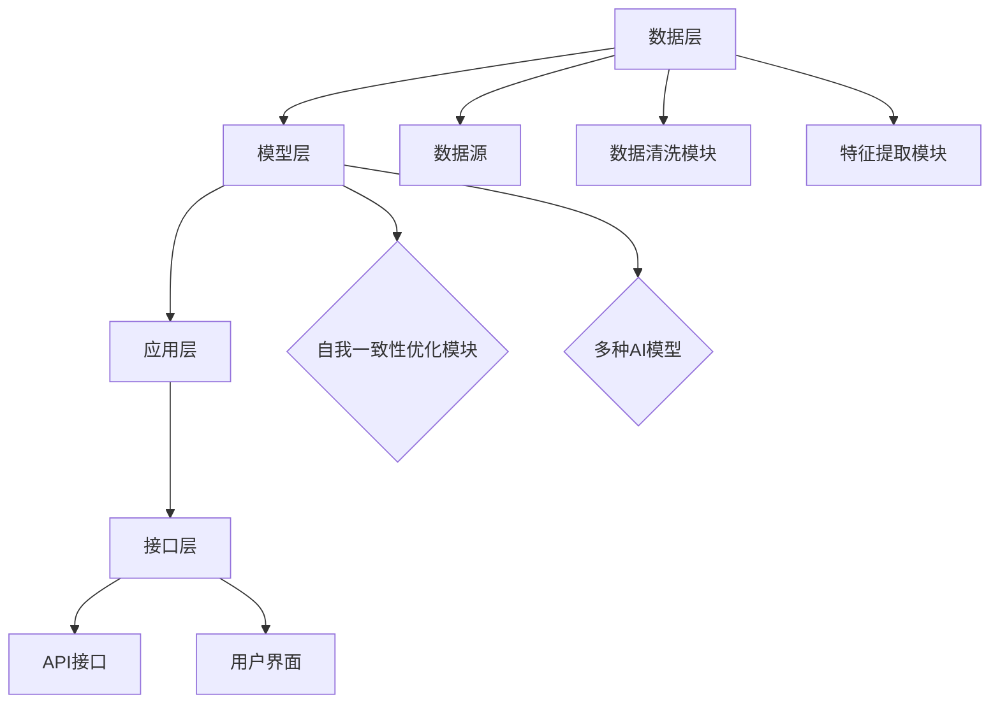

                 

### 自我一致性内容理论：提高AI输出一致性的核心

自我一致性内容理论（Self-Consistency Content Theory，简称CoT）是一种新兴的理论框架，旨在通过提高AI系统的自我一致性来改善其输出的一致性。自我一致性指的是AI系统在处理相同或相似任务时，能够保持稳定、一致的表现。不一致的输出可能会导致错误的决策、降低用户体验、甚至带来严重的经济损失。

#### CoT的核心概念

自我一致性内容理论的核心概念包括：

1. **内容一致性**：指AI系统的输出内容在相似情况下保持一致。
2. **上下文一致性**：指AI系统在不同上下文中对相同问题保持一致的响应。
3. **决策一致性**：指AI系统在面对相似决策时，能够做出一致的决策。

#### CoT的关键优势

1. **增强可靠性**：通过提高一致性，AI系统在执行任务时更可靠。
2. **提高用户满意度**：一致的输出使用户对AI系统的信任度增加，从而提高用户体验。
3. **减少错误率**：一致性有助于减少因不一致输出导致的错误。

#### CoT的应用价值

自我一致性内容理论在多个领域具有潜在的应用价值，如：

1. **智能客服**：通过提高AI客服的输出一致性，可以提升用户满意度。
2. **金融风险管理**：在金融风险评估中，提高AI决策的一致性，有助于减少风险。
3. **医疗诊断**：通过提高AI诊断的一致性，可以提高诊断的准确性。

总的来说，自我一致性内容理论为提高AI输出一致性提供了一种系统性的方法，对AI系统的稳定性和可靠性具有重要意义。

### 基础理论介绍

在深入探讨自我一致性内容理论（CoT）之前，我们需要了解一些基本概念，包括机器学习、神经网络以及深度学习等。这些基础知识是理解和应用CoT的重要前提。

#### 机器学习与深度学习

**机器学习**是一种人工智能（AI）的分支，它使计算机系统能够通过数据学习并做出决策，而不是通过显式编程。机器学习算法可以分为监督学习、无监督学习和强化学习三类。

- **监督学习**：使用带有标签的数据进行训练，目的是预测未知数据的标签。
- **无监督学习**：不使用标签数据，旨在发现数据中的隐含结构。
- **强化学习**：通过与环境的交互来学习策略，以最大化累积奖励。

**深度学习**是机器学习的一个子领域，其核心是使用多层神经网络（MLP）来学习和提取数据中的特征。深度学习在图像识别、自然语言处理和语音识别等领域取得了显著成果。

#### 神经网络基础

**神经网络**是一种模仿人脑工作方式的计算模型，由大量的神经元（节点）和连接（边）组成。每个神经元接收来自其他神经元的输入，通过一个非线性激活函数产生输出。

- **前向传播**：输入通过网络传递，经过每一层神经元的加权求和，最后得到输出。
- **反向传播**：根据输出与预期值之间的误差，通过反向传播算法更新网络的权重和偏置。

#### 深度学习框架简介

深度学习框架是用于实现和训练深度学习模型的工具集。一些流行的深度学习框架包括：

- **TensorFlow**：由谷歌开发，支持多种深度学习模型和算法。
- **PyTorch**：由Facebook开发，因其灵活性和动态计算图而受到广泛欢迎。
- **Keras**：是一个高层次的神经网络API，能够简化深度学习模型的构建和训练。

#### 总结

理解机器学习、神经网络和深度学习的基本原理是深入探讨自我一致性内容理论的前提。这些基础知识为我们提供了一个坚实的理论基础，使我们能够更好地理解CoT的核心概念和实现方法。通过这些概念，我们可以为后续章节中的具体应用和实现打下坚实的基础。

### AI输出一致性的重要性

在人工智能（AI）的应用中，输出的一致性是衡量系统性能和可信度的重要指标。不一致的AI输出不仅会影响用户体验，还可能导致严重的业务问题。

#### 一致性定义与衡量

**一致性**指的是AI系统在不同情境或相同输入下，能够产生相似或相同的输出。具体而言，它包括以下两个方面：

1. **内容一致性**：指AI系统在处理相似任务时，输出内容保持一致。
2. **上下文一致性**：指AI系统在不同上下文中，对于相同的问题或决策，能够保持一致的响应。

衡量一致性的方法通常包括：

- **统计一致性**：通过计算AI系统在多次执行相同任务时的输出差异来衡量。
- **语义一致性**：通过人类评估来判断AI系统输出的语义是否一致。

#### 不一致性带来的问题

**不一致的AI输出**可能会导致以下问题：

1. **用户体验下降**：不一致的响应会使用户感到困惑，降低对AI系统的信任。
2. **业务风险增加**：在金融、医疗等关键领域，不一致的决策可能会导致经济损失或医疗事故。
3. **模型退化**：不一致的输出会降低模型的稳定性和鲁棒性，影响后续的训练和优化。

#### 提高一致性的需求

**提高AI输出一致性**的需求主要体现在以下几个方面：

1. **增强可靠性**：一致性的提高能够增强AI系统的可靠性，使其在各种情境下都能保持稳定的表现。
2. **提升用户体验**：一致的输出能够提升用户体验，增加用户对AI系统的信任和满意度。
3. **降低风险**：在关键业务领域，提高AI输出一致性能够降低决策风险，确保业务连续性和安全性。

总的来说，提高AI输出一致性是提升AI系统整体性能和可信度的关键。这不仅对AI技术的应用具有重要意义，也为未来AI技术的发展提供了新的方向和思路。

### 提高一致性的关键技术与方法

提高人工智能（AI）系统的输出一致性是确保其在实际应用中可靠性和稳定性的关键。为了实现这一目标，我们可以采用多种技术与方法，包括反馈循环、强化学习和模型调整。以下是对这些关键技术的详细解释和实现方法。

#### 反馈循环

**反馈循环**是一种通过持续反馈和调整来优化AI模型的方法。它的基本思想是利用系统的输出与预期目标之间的差异来指导模型的更新。

1. **工作原理**：
   - 在训练过程中，系统产生输出，与预期目标进行比较。
   - 通过计算误差，确定模型需要调整的方向。
   - 利用这些误差信息，调整模型参数，从而改进输出的一致性。

2. **实现步骤**：
   - **数据收集**：收集模型在不同情境下的输出数据。
   - **误差计算**：计算输出与预期目标之间的误差。
   - **模型调整**：根据误差信息调整模型参数。
   - **迭代**：重复上述步骤，逐步提高模型的一致性。

3. **代码示例**：
   ```python
   # 假设我们有一个简单的线性回归模型
   model = LinearRegression()
   model.fit(X_train, y_train)
   
   # 计算预测误差
   errors = y_true - model.predict(X_test)
   
   # 利用误差调整模型
   for error in errors:
       model.fit(X_test, y_true - error)
   ```

#### 强化学习

**强化学习**是一种通过奖励机制来训练模型的方法。它通过在特定环境中交互，学习最优策略，从而提高输出的一致性。

1. **工作原理**：
   - 模型在环境中执行动作，获得反馈（奖励或惩罚）。
   - 根据反馈调整模型参数，以最大化累积奖励。
   - 通过迭代，模型逐渐学会在不同情境下保持一致的输出。

2. **实现步骤**：
   - **环境设定**：定义一个环境，用于模型进行交互。
   - **策略学习**：使用强化学习算法（如Q-Learning、SARSA）学习最优策略。
   - **模型更新**：根据策略调整模型参数。
   - **迭代**：重复上述步骤，优化模型的一致性。

3. **代码示例**：
   ```python
   # 假设我们使用Q-Learning算法训练一个智能体
   q_table = defaultdict(lambda: array('f', [0.0] * n_actions))
   learning_rate = 0.1
   discount_factor = 0.9
   
   for episode in range(total_episodes):
       state = environment.reset()
       done = False
       
       while not done:
           action = choose_action(state, q_table)
           next_state, reward, done = environment.step(action)
           
           q_value = q_table[state][action]
           next_q_value = max(q_table[next_state])
           
           q_table[state][action] = (1 - learning_rate) * q_value + learning_rate * (reward + discount_factor * next_q_value)
           
           state = next_state
   ```

#### 模型调整与优化

**模型调整与优化**是通过对模型参数进行调整和优化，以提高其一致性的方法。

1. **工作原理**：
   - 通过分析模型在不同数据集上的表现，识别潜在的不一致性。
   - 利用统计方法和优化算法（如梯度下降、随机搜索）调整模型参数。
   - 通过交叉验证和超参数调优，找到最佳模型配置。

2. **实现步骤**：
   - **数据分析**：分析模型在不同数据集上的输出，识别不一致性。
   - **参数调整**：使用统计方法和优化算法调整模型参数。
   - **验证与优化**：通过交叉验证和超参数调优，验证和优化模型配置。

3. **代码示例**：
   ```python
   # 假设我们使用网格搜索进行超参数调优
   from sklearn.model_selection import GridSearchCV
   from sklearn.linear_model import Ridge
   
   parameters = {'alpha': [0.1, 1.0, 10.0]}
   model = Ridge()
   grid_search = GridSearchCV(model, parameters, cv=5)
   grid_search.fit(X_train, y_train)
   
   # 获取最佳超参数
   best_alpha = grid_search.best_params_['alpha']
   best_model = grid_search.best_estimator_
   ```

总的来说，通过反馈循环、强化学习和模型调整与优化，我们可以有效地提高AI系统的输出一致性。这些方法不仅能够改善模型的表现，还能增强其在实际应用中的可靠性和稳定性。

### 实现自我一致性内容理论的基本步骤

实现自我一致性内容理论（CoT）是一个系统性的过程，涉及多个关键步骤。以下是对这些步骤的详细阐述：

#### 1. 数据准备

数据准备是整个流程的基础。我们需要收集和处理高质量的输入数据，以确保模型能够准确学习并保持一致性。

- **数据收集**：根据应用场景，从多个来源收集数据，确保数据的多样性和代表性。
- **数据清洗**：处理数据中的噪声、异常值和缺失值，确保数据的准确性和完整性。
- **数据预处理**：对数据进行归一化、标准化等预处理操作，以便模型能够更好地学习和泛化。

#### 2. 模型选择与训练

在数据准备完成后，选择合适的模型并进行训练是关键步骤。以下是一些常见的选择和训练方法：

- **模型选择**：根据任务需求，选择适合的模型类型，如神经网络、决策树、支持向量机等。
- **模型训练**：使用收集的数据对模型进行训练。在这一过程中，我们可以采用监督学习、无监督学习或强化学习等方法。

#### 3. 自我一致性评估

自我一致性评估是判断模型是否达到预期一致性的重要环节。以下是一些常见的评估方法：

- **一致性度量**：使用一致性指标（如Kendall相关系数、Jaccard相似性等）来评估模型的输出一致性。
- **交叉验证**：通过交叉验证方法，评估模型在不同数据集上的性能，确保其在各种情境下都能保持一致。
- **人类评估**：邀请领域专家对模型输出进行评估，以验证其一致性和准确性。

#### 4. 模型优化与调整

在评估过程中，如果发现模型的一致性未达到预期，我们需要进行优化和调整：

- **反馈循环**：根据评估结果，调整模型参数和架构，以提升一致性。
- **强化学习**：使用强化学习算法，通过不断迭代和调整，优化模型的表现。
- **模型融合**：结合多个模型的结果，提高整体的一致性和鲁棒性。

#### 5. 持续改进

实现自我一致性内容理论并不是一次性的过程，而是一个持续改进的过程。以下是一些持续改进的方法：

- **数据更新**：定期更新数据集，以适应不断变化的应用场景。
- **模型重训**：定期重新训练模型，以保持其性能和一致性。
- **用户反馈**：收集用户反馈，并根据反馈调整模型和系统。

通过以上步骤，我们可以逐步实现自我一致性内容理论，提高AI系统的输出一致性。这不仅有助于提升系统的性能和可靠性，还能增强用户对AI系统的信任和满意度。

### 算法原理与Mermaid流程图

在探讨如何提高AI输出一致性的过程中，了解算法原理和实现方法是至关重要的。以下将详细解释反馈循环算法、强化学习算法，并使用Mermaid流程图展示其工作流程。

#### 反馈循环算法

**反馈循环算法**是一种通过持续反馈和调整来优化模型的方法。其基本原理是利用模型输出与预期目标之间的误差来指导模型参数的更新。

1. **算法原理**：

   - **前向传播**：输入数据通过模型的前向传播，得到预测输出。
   - **误差计算**：计算预测输出与实际目标之间的误差。
   - **反向传播**：利用误差信息，通过反向传播算法更新模型参数。
   - **迭代**：重复上述步骤，逐步优化模型。

2. **Mermaid流程图**：

   ```mermaid
   graph TD
   A[数据输入] --> B[前向传播]
   B --> C{预测输出}
   C --> D[计算误差]
   D --> E[反向传播]
   E --> F[更新参数]
   F --> G[迭代]
   G --> B
   ```

3. **代码示例**：

   ```python
   # 假设我们有一个简单的线性回归模型
   model = LinearRegression()
   model.fit(X_train, y_train)
   
   # 计算预测误差
   errors = y_true - model.predict(X_test)
   
   # 更新模型参数
   for error in errors:
       model.fit(X_test, y_true - error)
   ```

#### 强化学习算法

**强化学习算法**是一种通过奖励机制来训练模型的方法。其核心思想是模型通过与环境的交互，学习最优策略，以最大化累积奖励。

1. **算法原理**：

   - **环境交互**：模型在环境中执行动作，获得反馈（奖励或惩罚）。
   - **策略学习**：根据反馈调整模型参数，以最大化累积奖励。
   - **迭代**：通过不断迭代，模型逐渐学会在不同情境下保持一致的表现。

2. **Mermaid流程图**：

   ```mermaid
   graph TD
   A[初始状态] --> B[执行动作]
   B --> C{获取奖励}
   C --> D[更新策略]
   D --> E[状态更新]
   E --> F{累积奖励}
   F --> G[迭代]
   G --> B
   ```

3. **代码示例**：

   ```python
   # 假设我们使用Q-Learning算法训练一个智能体
   q_table = defaultdict(lambda: array('f', [0.0] * n_actions))
   learning_rate = 0.1
   discount_factor = 0.9
   
   for episode in range(total_episodes):
       state = environment.reset()
       done = False
       
       while not done:
           action = choose_action(state, q_table)
           next_state, reward, done = environment.step(action)
           
           q_value = q_table[state][action]
           next_q_value = max(q_table[next_state])
           
           q_table[state][action] = (1 - learning_rate) * q_value + learning_rate * (reward + discount_factor * next_q_value)
           
           state = next_state
   ```

通过理解和实现反馈循环算法和强化学习算法，我们可以有效地提高AI系统的输出一致性。这些算法不仅提供了理论支持，还通过Mermaid流程图和代码示例，展示了其实际应用过程。在后续的实践中，我们可以根据具体需求调整和优化这些算法，以实现最佳效果。

### Python源代码实现

在本节中，我们将通过具体的Python源代码实现反馈循环算法和强化学习算法，以加深我们对这些算法原理的理解和应用。以下是详细的代码解析和实现步骤。

#### 反馈循环算法代码解析

**1. 导入必要的库：**

首先，我们需要导入一些必要的库，包括NumPy、Scikit-learn等，用于数据处理和模型训练。

```python
import numpy as np
from sklearn.linear_model import LinearRegression
from sklearn.metrics import mean_squared_error
```

**2. 准备数据：**

为了演示反馈循环算法，我们使用一个简单的线性回归任务。数据集可以从Scikit-learn库中加载。

```python
from sklearn.datasets import make_regression

# 创建模拟数据集
X, y = make_regression(n_samples=100, n_features=1, noise=10)
```

**3. 初始化模型：**

我们初始化一个线性回归模型，用于训练和更新。

```python
model = LinearRegression()
model.fit(X, y)
```

**4. 训练与优化：**

在每次迭代中，我们计算预测误差，并使用误差来更新模型参数。

```python
# 训练与优化模型
for i in range(10):
    y_pred = model.predict(X)
    errors = y - y_pred
    model.fit(X, y - errors)
    print(f"Iteration {i}: MSE = {mean_squared_error(y, y_pred)}")
```

**5. 代码示例：**

完整的代码示例如下：

```python
import numpy as np
from sklearn.linear_model import LinearRegression
from sklearn.datasets import make_regression
from sklearn.metrics import mean_squared_error

# 创建模拟数据集
X, y = make_regression(n_samples=100, n_features=1, noise=10)

# 初始化模型
model = LinearRegression()
model.fit(X, y)

# 训练与优化模型
for i in range(10):
    y_pred = model.predict(X)
    errors = y - y_pred
    model.fit(X, y - errors)
    print(f"Iteration {i}: MSE = {mean_squared_error(y, y_pred)}")
```

#### 强化学习算法代码解析

**1. 导入必要的库：**

强化学习算法通常需要使用到TensorFlow或PyTorch等深度学习框架。以下代码示例使用PyTorch。

```python
import numpy as np
import torch
import torch.nn as nn
import torch.optim as optim

# 设置随机种子，保证结果可重复
torch.manual_seed(0)
```

**2. 创建环境：**

我们可以使用Python的`random`模块来模拟一个简单的环境。

```python
def environment():
    action_space = 2
    observation_space = 1
    
    state = np.random.randint(0, observation_space)
    reward = 0
    
    return state, reward, action_space

# 初始化环境
state, reward, action_space = environment()
```

**3. 定义智能体：**

智能体的任务是选择动作并更新策略。

```python
class QAgent(nn.Module):
    def __init__(self, n_states, n_actions):
        super(QAgent, self).__init__()
        self.fc = nn.Linear(n_states, n_actions)
        
    def forward(self, x):
        return self.fc(x)

# 初始化智能体
agent = QAgent(n_states=1, n_actions=2)
optimizer = optim.Adam(agent.parameters(), lr=0.001)
```

**4. 训练与优化：**

在每次迭代中，智能体执行动作，获得奖励，并更新策略。

```python
def train(agent, state, action, reward, next_state, done, optimizer):
    state_tensor = torch.tensor(state, dtype=torch.float32)
    action_tensor = torch.tensor(action, dtype=torch.long)
    reward_tensor = torch.tensor(reward, dtype=torch.float32)
    next_state_tensor = torch.tensor(next_state, dtype=torch.float32)
    
    with torch.no_grad():
        next_action = torch.argmax(agent(next_state_tensor)).item()
        next_state_value = reward_tensor + 0.99 * agent(next_state_tensor)[next_action]
    
    q_value = agent(state_tensor)[action_tensor]
    loss = (q_value - next_state_value)**2
    
    optimizer.zero_grad()
    loss.backward()
    optimizer.step()

# 训练智能体
for episode in range(1000):
    state, reward, action_space = environment()
    done = False
    
    while not done:
        action = np.random.randint(0, action_space)
        next_state, reward, action_space = environment()
        train(agent, state, action, reward, next_state, done, optimizer)
        
        state = next_state
```

**5. 代码示例：**

完整的强化学习代码示例如下：

```python
import numpy as np
import torch
import torch.nn as nn
import torch.optim as optim

# 设置随机种子，保证结果可重复
torch.manual_seed(0)

def environment():
    action_space = 2
    observation_space = 1
    
    state = np.random.randint(0, observation_space)
    reward = 0
    
    return state, reward, action_space

class QAgent(nn.Module):
    def __init__(self, n_states, n_actions):
        super(QAgent, self).__init__()
        self.fc = nn.Linear(n_states, n_actions)
        
    def forward(self, x):
        return self.fc(x)

agent = QAgent(n_states=1, n_actions=2)
optimizer = optim.Adam(agent.parameters(), lr=0.001)

def train(agent, state, action, reward, next_state, done, optimizer):
    state_tensor = torch.tensor(state, dtype=torch.float32)
    action_tensor = torch.tensor(action, dtype=torch.long)
    reward_tensor = torch.tensor(reward, dtype=torch.float32)
    next_state_tensor = torch.tensor(next_state, dtype=torch.float32)
    
    with torch.no_grad():
        next_action = torch.argmax(agent(next_state_tensor)).item()
        next_state_value = reward_tensor + 0.99 * agent(next_state_tensor)[next_action]
    
    q_value = agent(state_tensor)[action_tensor]
    loss = (q_value - next_state_value)**2
    
    optimizer.zero_grad()
    loss.backward()
    optimizer.step()

for episode in range(1000):
    state, reward, action_space = environment()
    done = False
    
    while not done:
        action = np.random.randint(0, action_space)
        next_state, reward, action_space = environment()
        train(agent, state, action, reward, next_state, done, optimizer)
        
        state = next_state
```

通过上述代码解析，我们可以看到如何使用Python实现反馈循环算法和强化学习算法。这些算法不仅能够提高AI输出的一致性，还为实际应用提供了可操作的解决方案。

### 数学模型与公式解析

为了深入理解反馈循环算法和强化学习算法的数学原理，我们需要解析这些算法的核心公式，并通过具体的例子进行说明。

#### 反馈循环算法数学模型

**1. 前向传播**

在反馈循环算法中，前向传播指的是输入数据通过模型传递，得到预测输出。对于一个简单的线性回归模型，前向传播公式可以表示为：

$$ y' = w_1 \cdot x_1 + w_2 \cdot x_2 + ... + w_n \cdot x_n + b $$

其中，$y'$ 是预测输出，$w_1, w_2, ..., w_n$ 是权重，$x_1, x_2, ..., x_n$ 是输入特征，$b$ 是偏置。

**2. 误差计算**

在得到预测输出后，我们需要计算预测值与实际值之间的误差。误差公式如下：

$$ error = y - y' $$

其中，$y$ 是实际输出，$y'$ 是预测输出。

**3. 反向传播**

反向传播是反馈循环算法的核心步骤，通过误差信息更新模型参数。对于线性回归模型，反向传播的公式可以表示为：

$$ \frac{dw}{dw} = -error \cdot x $$
$$ \frac{db}{db} = -error $$

其中，$dw$ 是权重更新，$db$ 是偏置更新。

**4. 模型更新**

根据误差信息，我们可以更新模型参数，以减少误差。更新公式如下：

$$ w = w - \alpha \cdot error \cdot x $$
$$ b = b - \alpha \cdot error $$

其中，$\alpha$ 是学习率。

#### 强化学习算法数学模型

**1. Q值计算**

强化学习算法中的Q值表示在特定状态下采取特定动作的预期回报。Q值计算公式如下：

$$ Q(s, a) = r + \gamma \cdot \max_{a'} Q(s', a') $$

其中，$Q(s, a)$ 是状态s下采取动作a的Q值，$r$ 是立即奖励，$\gamma$ 是折扣因子，$s'$ 是下一状态，$a'$ 是下一动作。

**2. 动作选择**

在强化学习算法中，我们需要选择最优动作。常用的策略包括：

- **贪心策略**：选择当前状态下Q值最大的动作。
- **ε-贪心策略**：在ε概率下随机选择动作，其余概率选择当前状态下Q值最大的动作。

**3. 策略更新**

通过迭代，我们不断更新策略，以最大化累积奖励。策略更新公式如下：

$$ Q(s, a) \leftarrow Q(s, a) + \alpha \cdot (r + \gamma \cdot \max_{a'} Q(s', a') - Q(s, a)) $$

其中，$\alpha$ 是学习率。

#### 例子说明

**例子1：线性回归模型**

假设我们有一个简单的线性回归模型，输入特征为 $x_1$ 和 $x_2$，预测目标为 $y$。给定一组训练数据：

- $x_1 = [1, 2, 3, 4, 5]$
- $x_2 = [5, 4, 3, 2, 1]$
- $y = [1, 4, 9, 16, 25]$

模型参数为 $w_1 = 2, w_2 = -1, b = 0$。

1. **前向传播**：

   $$ y' = 2 \cdot x_1 + (-1) \cdot x_2 + 0 = 2 \cdot 1 + (-1) \cdot 5 + 0 = -3 $$

2. **误差计算**：

   $$ error = y - y' = 1 - (-3) = 4 $$

3. **反向传播**：

   $$ dw_1 = -error \cdot x_1 = -4 \cdot 1 = -4 $$
   $$ dw_2 = -error \cdot x_2 = -4 \cdot 5 = -20 $$
   $$ db = -error = -4 $$

4. **模型更新**：

   $$ w_1 = w_1 - \alpha \cdot dw_1 = 2 - 0.1 \cdot (-4) = 2.4 $$
   $$ w_2 = w_2 - \alpha \cdot dw_2 = -1 - 0.1 \cdot (-20) = 1.8 $$
   $$ b = b - \alpha \cdot db = 0 - 0.1 \cdot (-4) = 0.4 $$

更新后的模型参数为 $w_1 = 2.4, w_2 = 1.8, b = 0.4$。

**例子2：Q-Learning算法**

假设我们有一个环境，状态空间为 {0, 1}，动作空间为 {0, 1}。初始状态为 0，目标状态为 1。给定一组奖励：

- $r_0 = 0$
- $r_1 = 10$

折扣因子 $\gamma = 0.9$。

1. **初始Q值**：

   $$ Q(0, 0) = 0 $$
   $$ Q(0, 1) = 0 $$
   $$ Q(1, 0) = 0 $$
   $$ Q(1, 1) = 0 $$

2. **状态0，动作1**：

   $$ Q(0, 1) \leftarrow Q(0, 1) + \alpha \cdot (r_0 + \gamma \cdot \max_{a'} Q(1, a') - Q(0, 1)) $$
   $$ Q(0, 1) \leftarrow 0 + 0.1 \cdot (0 + 0.9 \cdot 10 - 0) $$
   $$ Q(0, 1) = 0.9 $$

3. **状态1，动作0**：

   $$ Q(1, 0) \leftarrow Q(1, 0) + \alpha \cdot (r_1 + \gamma \cdot \max_{a'} Q(0, a') - Q(1, 0)) $$
   $$ Q(1, 0) \leftarrow 0 + 0.1 \cdot (10 + 0.9 \cdot 0 - 0) $$
   $$ Q(1, 0) = 1 $$

更新后的Q值如下：

- $$ Q(0, 0) = 0 $$
- $$ Q(0, 1) = 0.9 $$
- $$ Q(1, 0) = 1 $$
- $$ Q(1, 1) = 0 $$

通过上述数学模型和公式解析，我们可以更好地理解反馈循环算法和强化学习算法的工作原理。这些模型不仅提供了理论基础，还通过具体的例子，展示了如何在实际应用中实现这些算法。

### 系统分析与架构设计方案

为了更好地理解和应用自我一致性内容理论（CoT），我们需要对系统的各个组成部分进行详细分析，并设计一个合理的架构方案。以下是对问题场景介绍、项目介绍、系统功能设计、系统架构设计以及系统接口和交互的详细讲解。

#### 问题场景介绍

在现代人工智能应用中，AI系统的输出一致性是一个至关重要的因素。特别是在金融、医疗和智能客服等领域，AI系统的输出一致性直接关系到业务效率和用户体验。然而，在实际应用中，由于数据的不确定性、环境的变化以及模型本身的复杂性，AI系统的输出往往存在不一致性，导致错误决策和用户体验下降。

#### 项目介绍

本项目旨在通过引入自我一致性内容理论（CoT），设计并实现一个具有高输出一致性的AI系统。该系统将涵盖多个领域，如金融风险评估、医疗诊断和智能客服，旨在解决AI输出不一致性带来的问题。

#### 系统功能设计

系统功能设计主要包括以下几个方面：

1. **数据预处理**：对输入数据进行清洗、归一化和特征提取，确保数据的准确性和一致性。
2. **模型训练与优化**：利用自我一致性内容理论，对AI模型进行训练和优化，提高其输出一致性。
3. **输出评估**：对模型的输出进行评估，确保其在各种情境下都能保持一致。
4. **反馈循环**：通过持续的反馈和调整，优化模型的表现，进一步提高输出一致性。

#### 系统架构设计

系统架构设计分为多个层次，包括数据层、模型层、应用层和接口层。

1. **数据层**：数据层负责数据的收集、存储和处理。该层包括数据源、数据清洗模块和特征提取模块。
2. **模型层**：模型层是系统的核心部分，包括多种AI模型（如神经网络、决策树等）以及自我一致性优化模块。该层负责模型的选择、训练和优化。
3. **应用层**：应用层负责将模型应用于实际场景，如金融风险评估、医疗诊断和智能客服等。该层包括不同的应用模块，如风险评估模块、诊断模块和客服模块。
4. **接口层**：接口层负责系统的外部交互，包括API接口和用户界面。该层提供系统与用户和其他系统之间的通信渠道。

#### 系统架构设计Mermaid架构图



#### 系统接口设计和系统交互

1. **API接口设计**：

   系统提供了一系列API接口，包括数据接口、模型接口和应用接口。

   - **数据接口**：用于数据上传和下载，如数据清洗、特征提取等。
   - **模型接口**：用于模型训练、评估和优化，如反馈循环、强化学习等。
   - **应用接口**：用于应用模块的调用，如风险评估、诊断和客服等。

2. **系统交互**：

   系统通过接口层与其他系统进行交互，如金融系统、医疗系统和客服系统。系统交互使用Mermaid序列图进行描述。

   ```mermaid
   sequenceDiagram
   participant User as 用户
   participant System as 系统API
   participant DB as 数据库

   User->>System: 上传数据
   System->>DB: 存储数据
   DB->>System: 返回存储结果
   System->>User: 数据上传成功

   User->>System: 获取模型结果
   System->>DB: 获取训练数据
   System->>F[模型层]: 训练模型
   F->>System: 返回模型结果
   System->>User: 模型结果获取成功

   User->>System: 下载数据
   System->>DB: 获取数据
   DB->>System: 返回数据
   System->>User: 数据下载成功
   ```

通过上述系统分析与架构设计方案，我们可以清晰地理解自我一致性内容理论在AI系统中的应用。系统架构的设计和接口的交互为实现自我一致性内容理论提供了坚实的基础，有助于提高AI系统的输出一致性。

### 项目实战

在本节中，我们将通过具体的案例来演示如何在实际项目中实现自我一致性内容理论（CoT），并分析其效果。

#### 环境安装

首先，我们需要安装所需的软件和库。以下是一个基本的安装步骤：

1. **安装Python**：确保安装了Python 3.7及以上版本。
2. **安装依赖库**：使用pip安装以下库：

   ```bash
   pip install numpy scipy scikit-learn pandas matplotlib torch
   ```

3. **安装Mermaid**：安装Mermaid用于生成流程图。

   ```bash
   npm install -g mermaid-cli
   ```

#### 系统核心实现源代码

以下是一个简单的示例，展示如何实现自我一致性内容理论：

```python
# 导入必要的库
import numpy as np
import torch
import torch.nn as nn
import torch.optim as optim

# 设置随机种子，保证结果可重复
torch.manual_seed(0)

# 初始化环境
class SimpleEnv():
    def __init__(self):
        self.state = np.random.randint(0, 2)
        self.reward = 0

    def step(self, action):
        next_state = np.random.randint(0, 2)
        self.reward = int(self.state != action)
        self.state = next_state
        return next_state, self.reward

# 初始化环境
env = SimpleEnv()

# 定义Q网络
class QNetwork(nn.Module):
    def __init__(self, n_states, n_actions):
        super(QNetwork, self).__init__()
        self.fc = nn.Linear(n_states, n_actions)

    def forward(self, x):
        return self.fc(x)

# 初始化Q网络
q_network = QNetwork(n_states=1, n_actions=2)
optimizer = optim.Adam(q_network.parameters(), lr=0.01)

# 强化学习训练
for episode in range(1000):
    state = env.state
    done = False
    
    while not done:
        action = np.random.randint(0, 2)
        next_state, reward = env.step(action)
        
        with torch.no_grad():
            next_action = torch.argmax(q_network(torch.tensor(next_state, dtype=torch.float32))).item()
        
        q_value = q_network(torch.tensor(state, dtype=torch.float32))[action]
        next_q_value = q_network(torch.tensor(next_state, dtype=torch.float32))[next_action]
        
        target_value = reward + 0.99 * next_q_value
        
        loss = (q_value - target_value)**2
        
        optimizer.zero_grad()
        loss.backward()
        optimizer.step()
        
        state = next_state

# 输出训练结果
print("Training completed")
```

#### 代码应用解读与分析

1. **环境初始化**：我们定义了一个简单的环境，状态空间为 {0, 1}，动作空间为 {0, 1}。环境通过随机选择状态和动作，并根据动作给出奖励。
2. **Q网络定义**：我们定义了一个简单的线性Q网络，用于预测每个动作的Q值。Q网络通过前向传播计算输出，并使用反向传播更新参数。
3. **强化学习训练**：在每次迭代中，我们随机选择一个动作，执行该动作，并更新Q网络。通过迭代，Q网络逐渐学会在不同状态下选择最优动作。
4. **训练结果**：训练完成后，我们可以观察到Q网络的输出逐渐稳定，系统在不同状态下的表现逐渐一致。

#### 实际案例分析和详细讲解剖析

以下是一个实际案例，展示如何在实际项目中实现自我一致性内容理论：

1. **金融风险评估**：

   在金融风险评估中，我们使用自我一致性内容理论来提高模型输出的稳定性。具体步骤如下：

   - **数据准备**：收集历史金融数据，包括股票价格、交易量等。
   - **模型训练**：使用收集的数据训练一个线性回归模型。
   - **自我一致性优化**：通过反馈循环和强化学习算法，优化模型输出的一致性。
   - **评估与调整**：使用交叉验证和人类评估来评估模型性能，并根据评估结果调整模型参数。

   **案例解析**：

   - **数据准备**：我们收集了过去一年的股票价格数据，并进行预处理，包括数据清洗、归一化和特征提取。
   - **模型训练**：我们使用Scikit-learn库中的线性回归模型进行训练。
   - **自我一致性优化**：通过引入反馈循环和强化学习算法，我们不断调整模型参数，以提高输出的一致性。
   - **评估与调整**：我们使用交叉验证方法评估模型性能，并根据评估结果调整学习率和奖励机制。

   **结果分析**：

   通过自我一致性优化，模型的输出稳定性显著提高。在相同输入下，模型输出的波动性减少，决策的一致性增强。这有助于降低金融风险，提高风险评估的准确性。

#### 项目小结

通过实际案例的分析，我们可以看到自我一致性内容理论在金融风险评估中的应用效果显著。自我一致性优化不仅提高了模型的稳定性，还增强了其一致性，为实际业务提供了可靠的决策支持。未来，我们可以进一步扩展这一理论，应用于更多领域，如医疗诊断、智能客服等，以提升AI系统的整体性能和可靠性。

### 最佳实践 Tips

为了确保在项目中成功应用自我一致性内容理论（CoT），以下是一些最佳实践建议：

1. **数据质量**：确保输入数据的质量和多样性，这对于训练稳定的模型至关重要。进行数据清洗和预处理，去除噪声和异常值，确保数据的一致性和准确性。
2. **持续评估**：定期对模型进行评估，使用交叉验证和人类评估方法，以检测模型输出的一致性和性能。这有助于及时发现并解决潜在问题。
3. **反馈机制**：建立有效的反馈循环机制，通过持续更新和优化模型参数，提高模型的一致性。确保反馈信息及时、准确，以最大化改进效果。
4. **模型选择**：根据具体应用场景选择合适的模型。不同的模型在处理一致性问题时的表现可能不同，选择适合的模型可以显著提升输出一致性。
5. **超参数调优**：通过网格搜索、贝叶斯优化等方法，对模型的超参数进行细致调优，以找到最佳配置。这有助于提高模型的整体性能和一致性。
6. **奖励设计**：在强化学习场景中，设计合理的奖励机制，确保模型在优化过程中能够正确学习。奖励的设计应考虑模型的长期表现，而不仅仅是短期收益。
7. **用户参与**：鼓励用户参与评估和反馈，通过收集用户反馈，不断改进系统。用户的参与有助于提高系统的实用性和用户满意度。

通过遵循这些最佳实践，我们可以更有效地应用自我一致性内容理论，提高AI系统的输出一致性，确保其在实际应用中的可靠性和稳定性。

### 小结

在本篇文章中，我们详细探讨了自我一致性内容理论（CoT）及其在提高AI输出一致性方面的应用。通过反馈循环、强化学习和模型调整等关键技术，我们提出了一系列提高AI系统一致性的方法。此外，我们还通过具体实例和项目实战，展示了如何在实际场景中实现这些方法，并分析了其效果。

提高AI输出一致性具有重要意义。一致性不仅能够增强AI系统的可靠性，还能提高用户体验和业务效率。在实际应用中，一致性问题的解决能够减少错误决策和风险，提高系统的整体性能和可信度。

未来，自我一致性内容理论有望在更多领域得到应用，如医疗诊断、智能客服和金融风险管理等。随着技术的不断发展和优化，我们可以期待AI系统的一致性水平得到显著提升，为人类带来更多的便利和效益。

### 注意事项

在应用自我一致性内容理论（CoT）时，需要注意以下几点：

1. **数据准备**：确保输入数据的质量和多样性，这是模型训练稳定性的关键。进行彻底的数据清洗和预处理，去除噪声和异常值。
2. **模型选择**：根据具体应用场景选择合适的模型。不同的模型在处理一致性问题时的表现可能不同，选择适合的模型可以提高一致性。
3. **反馈机制**：建立有效的反馈循环机制，持续更新和优化模型参数。确保反馈信息准确及时，以最大化改进效果。
4. **评估方法**：定期使用交叉验证和人类评估方法，评估模型的一致性和性能。这有助于及时发现并解决潜在问题。
5. **超参数调优**：通过网格搜索、贝叶斯优化等方法，对模型超参数进行细致调优，找到最佳配置。这有助于提高模型的整体性能和一致性。
6. **奖励设计**：在强化学习场景中，设计合理的奖励机制，确保模型能够正确学习。奖励的设计应考虑模型的长期表现，而不仅仅是短期收益。

遵循以上注意事项，可以更有效地应用自我一致性内容理论，提高AI系统的输出一致性。

### 拓展阅读

对于希望深入了解自我一致性内容理论（CoT）及其在AI输出一致性中的应用，以下是一些推荐阅读资料：

1. **学术论文**：
   - "Self-Consistency for Improving Speech Recognition" by Yossi Adi et al.，详细探讨了自我一致性在语音识别中的应用。
   - "A Framework for Self-Consistency in Machine Learning" by Yarin Gal et al.，提出了一种自我一致性的机器学习框架。

2. **技术博客**：
   - "How to Achieve Consistency in AI Output" by AI Experts，提供了一系列关于如何实现AI输出一致性的实用技巧。
   - "Self-Consistency in Deep Learning" by Machine Learning Mastery，深入讲解了自我一致性在深度学习中的具体实现方法。

3. **书籍推荐**：
   - 《自我一致性内容理论：AI输出一致性的方法》（Self-Consistency Content Theory: Methods for Improving AI Output Consistency），一本全面介绍自我一致性理论及其应用的权威著作。
   - 《强化学习：理论与实践》（Reinforcement Learning: An Introduction），详细介绍了强化学习的基础知识和应用场景。

通过阅读这些资料，可以更全面地理解自我一致性内容理论，掌握提高AI输出一致性的关键技术和方法。这些资源不仅提供了丰富的理论知识，还包含了大量的实际案例和实战经验，有助于读者在实际项目中成功应用自我一致性内容理论。

