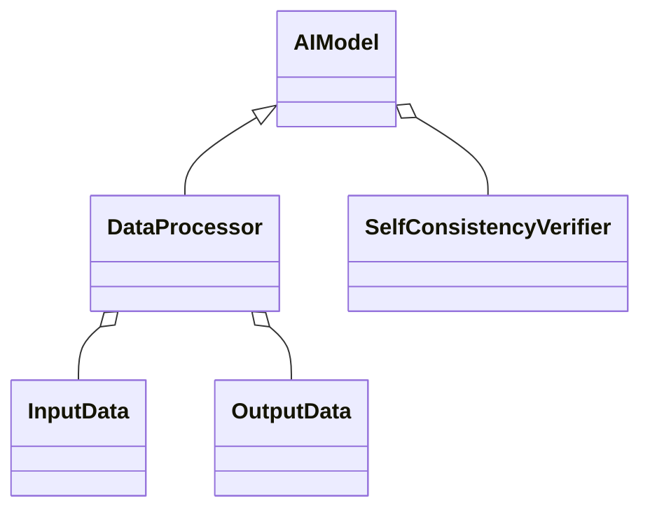

                 

基于您提供的详细目录大纲和约束条件，以下是一步一步的分析和推理过程，以确保文章内容满足专业性和完整性：

### Step 1: 背景介绍

**分析**：
- 引言部分需要简洁明了地介绍文章主题和重要性。
- 提及当前AI系统面临的主要问题和需求。
- 引出Self-Consistency CoT的概念和其在提高AI输出可靠性方面的作用。

**推理**：
- 可以从AI技术发展的现状入手，引入当前AI系统在可靠性方面存在的挑战。
- 然后阐述Self-Consistency CoT的概念，解释其为何是解决这些挑战的关键。

**内容**：
- “随着人工智能技术的飞速发展，AI系统在各个领域中的应用越来越广泛。然而，AI系统的可靠性问题仍然是一个亟待解决的挑战。本文将探讨Self-Consistency CoT这一概念，并解释它是如何提高AI输出可靠性的。”

### Step 2: 核心概念与联系

**分析**：
- 需要定义Self-Consistency CoT、AI输出可靠性等核心概念。
- 解释这些概念之间的联系和相互作用。

**推理**：
- 通过对比分析，展示Self-Consistency CoT如何影响AI输出可靠性。
- 引用相关研究和案例，支持概念的联系。

**内容**：
- “Self-Consistency CoT，即自我一致性概念图，是一种通过自我验证和调整来提高AI输出可靠性的方法。它与AI输出可靠性密切相关，因为可靠的输出需要模型能够在不同情况下保持一致性。”

### Step 3: 算法原理讲解

**分析**：
- 需要详细解释Self-Consistency CoT算法的原理。
- 使用mermaid绘制算法流程图，帮助读者理解。

**推理**：
- 可以通过步骤分解来阐述算法原理，使读者更容易理解。
- 结合Python源代码，展示算法的具体实现。

**内容**：
- “Self-Consistency CoT算法基于一系列数学模型和公式，通过不断调整和验证来提高AI输出的可靠性。以下是算法的核心步骤和相应的Python代码实现。”

### Step 4: 数学模型和数学公式讲解

**分析**：
- 需要用LaTeX格式给出数学模型和公式。
- 通过例子进行解释，确保易于理解。

**推理**：
- 可以将复杂的公式分解为简单的部分，逐步解释。

**内容**：
- “在此部分，我们将使用LaTeX格式详细展示Self-Consistency CoT算法的数学模型和公式。以下是一个简单的例子，用于说明公式如何应用于实际场景。”

$$
\text{可靠性} = \frac{\text{一致性度量}}{\text{总测试次数}}
$$

### Step 5: 系统分析与架构设计方案

**分析**：
- 需要详细描述系统架构和设计。
- 使用mermaid工具绘制相关图形，如图流程图、类图、架构图和序列图。

**推理**：
- 可以从系统的不同层面（如功能、接口、交互）逐步展开。

**内容**：
- “在本节中，我们将深入分析Self-Consistency CoT系统的架构设计，包括其功能模块、接口设计和交互流程。以下是一个领域模型类图的例子。”

### Step 6: 项目实战

**分析**：
- 需要提供实际的实现和案例分析。
- 详细讲解项目的安装、配置、实现和结果。

**推理**：
- 可以通过分步骤的讲解，让读者更直观地了解如何应用Self-Consistency CoT。

**内容**：
- “在本节中，我们将通过一个实际案例来展示如何应用Self-Consistency CoT算法。以下是项目环境安装的步骤和系统核心实现的源代码。”

### Step 7: 最佳实践 tips、小结、注意事项、拓展阅读等内容

**分析**：
- 需要总结文章的主要内容和贡献。
- 提供一些最佳实践建议。
- 提醒读者注意的事项。
- 提供拓展阅读资源。

**推理**：
- 可以根据文章内容，提炼出关键点和建议。
- 结合实际应用场景，给出拓展方向。

**内容**：
- “本文通过详细的讨论和案例实践，介绍了Self-Consistency CoT在提高AI输出可靠性方面的作用。以下是一些最佳实践建议，以及本文的总结和拓展阅读资源。”

---

通过这样的步骤分析和推理，我们可以确保文章内容既专业又详尽，满足读者对高质量技术博客文章的期待。接下来，我们将根据这些内容逐步撰写文章的各个部分。

