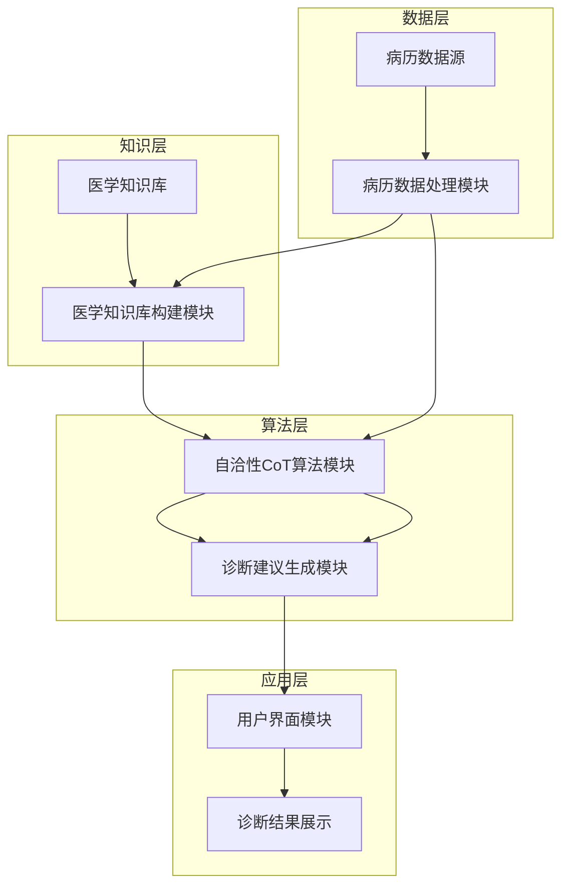

                 

### 第1章：问题背景与核心概念

在当今的科技领域中，人工智能（AI）无疑是最引人注目的进展之一。随着深度学习和大数据技术的发展，AI已经渗透到我们生活的方方面面，从智能助手到自动驾驶汽车，从医疗诊断到金融预测，AI的应用范围不断扩大。然而，随着AI系统的复杂性增加，一个问题逐渐显现：如何确保AI的输出结果具有高可靠性和一致性？

为了解决这一问题，我们需要深入探讨一个核心概念——自洽性（Self-Consistency），以及另一个关键概念——共同基础（Common Ground，简称CoT）。自洽性指的是一个系统在其内部各部分之间保持一致性和连贯性的能力，而共同基础则是指对话各方在交流中共同理解的基础知识或前提条件。这两个概念在人工智能领域中具有重要作用，它们不仅影响AI系统的可靠性，还直接关系到用户体验和决策质量。

首先，自洽性是确保AI系统内部逻辑一致性的基础。在一个自洽的系统中，各组件之间的交互不会产生矛盾或冲突，从而保证了输出的可靠性和稳定性。例如，在医疗诊断AI系统中，如果自洽性不足，可能会导致诊断结果前后矛盾，给医生和患者带来困扰。

其次，共同基础（CoT）是AI与人类或其他AI系统进行有效沟通的桥梁。在自然语言处理（NLP）和其他AI任务中，CoT帮助AI系统理解并处理复杂的信息，确保输出的准确性和一致性。例如，在一个问答系统中，如果没有共同基础，AI可能无法理解问题的含义，从而导致错误的回答。

因此，自洽性CoT（Self-Consistency Common Ground）成为提高AI输出可靠性的一个重要方法。通过自洽性，AI系统能够保持内部一致性；通过共同基础，AI能够与外界有效沟通，从而提高输出结果的可信度和可靠性。

在接下来的章节中，我们将详细探讨自洽性和共同基础的含义、重要性以及在人工智能中的应用，进一步理解自洽性CoT如何提高AI输出可靠性。希望通过这一章的介绍，读者能够对文章的核心概念有一个清晰的认识，并为后续内容的深入探讨打下基础。让我们一步一步地思考，深入分析自洽性CoT在人工智能中的关键作用。

#### 1.1.1 自洽性的定义

自洽性（Self-Consistency）是一个广泛应用于各个领域的概念，其核心在于系统内部的一致性和连贯性。在数学和逻辑学中，自洽性指的是一个系统或理论在没有矛盾的情况下能够自圆其说，即系统内部的各种陈述或定理都能够互相支持，不会出现互相矛盾的结论。例如，欧几里得几何是一个自洽的体系，因为其公理和定理相互之间没有矛盾。

在人工智能领域，自洽性的定义和实现具有独特的挑战和意义。首先，自洽性在AI系统中指的是模型或算法在不同阶段和不同模块之间保持一致性和连贯性的能力。具体来说，这意味着AI系统在不同情况下作出的决策或输出的结果应该是逻辑上一致的，不会出现互相矛盾的情况。

自洽性的重要性在于它直接关系到AI系统的可靠性和可信度。一个自洽的AI系统能够确保其输出的稳定性和一致性，从而在需要高精度和可靠性的应用场景中发挥作用。例如，在自动驾驶系统中，如果自洽性不足，可能会导致车辆在行驶过程中出现判断错误，从而引发事故。

在人工智能中，自洽性通常通过以下几种方式实现：

1. **一致性验证**：通过设计算法，在AI系统的各个模块之间引入一致性验证机制，确保每个模块的输出都与其他模块的输入保持一致。

2. **反馈机制**：利用系统的反馈机制，不断调整和优化模型参数，确保系统在不同情境下的输出是一致的。

3. **知识图谱**：构建系统的知识图谱，确保系统中各个部分的知识和事实相互之间保持一致。

4. **逻辑推理**：通过逻辑推理技术，确保系统的推理过程符合逻辑规则，避免出现逻辑矛盾。

例如，在一个智能问答系统中，如果自洽性不足，可能导致同一个问题在不同的上下文中得到截然不同的答案，这显然会降低系统的可信度。通过自洽性技术，系统能够确保即使在不同的语境下，对于同一问题的回答也是一致的、可靠的。

此外，自洽性在人工智能中的应用还体现在以下几个方面：

- **决策支持系统**：在需要做出复杂决策的系统（如金融风险控制、医疗诊断等）中，自洽性确保决策过程的逻辑一致性和连贯性，从而提高决策的准确性和可靠性。

- **自然语言处理**：在文本分类、情感分析等任务中，自洽性确保系统对同一文本内容保持一致的分类和判断。

- **多模态交互**：在结合视觉、语音等多模态信息的交互系统中，自洽性确保各模态信息在系统内保持一致，从而提高系统的整体性能。

总之，自洽性是人工智能系统中一个至关重要的概念，它不仅影响系统的可靠性，还直接关系到系统的用户体验和实际应用效果。通过深入理解和应用自洽性技术，我们能够显著提高AI系统的输出可靠性，为人工智能的发展奠定坚实的基础。

#### 1.1.2 CoT（Common Ground）概念

共同基础（Common Ground，简称CoT）是人工智能领域中一个至关重要的概念，它指的是对话各方在交流中共同理解的基础知识或前提条件。在多主体交互和协同任务中，CoT起到了桥梁的作用，确保各方能够有效地沟通和协作。

首先，共同基础的定义可以从几个角度来理解。在人类交流中，CoT指的是双方在谈话中默认共享的知识和背景信息。这些信息可能是具体的，比如共同熟悉的一个地点，也可能是抽象的，比如对某个话题的共同理解。在人工智能领域，CoT则是系统或算法在处理信息时所需的基础知识和前提条件。这些知识和前提条件确保了系统能够正确理解和处理输入的信息。

共同基础的功能与作用在人工智能中有多种体现。首先，CoT帮助AI系统理解和解释复杂的输入数据。例如，在一个问答系统中，如果系统能够与用户共享某些基础知识，它就能更准确地理解用户的问题并给出恰当的回答。其次，CoT在多模态交互中扮演关键角色。当AI系统需要处理文本、图像、声音等多种数据形式时，共同基础确保系统能够在不同模态之间建立关联，从而提高处理效果。

在自然语言处理（NLP）中，共同基础的应用尤为广泛。例如，在情感分析任务中，AI系统需要理解文本中的情感倾向。如果系统能够与用户共享情感词汇和表达方式的知识，它就能更准确地识别和分类情感。在机器翻译中，共同基础有助于保持翻译的一致性和准确性，避免因为文化差异或用词习惯不同而造成误解。

共同基础在人工智能中的具体应用场景包括：

1. **对话系统**：通过构建共知的知识库，确保对话系统能够理解和回应用户的请求和问题。

2. **多模态交互**：在处理结合文本、图像、声音等多模态数据的任务中，共同基础帮助系统在不同模态之间建立有效的关联。

3. **协同工作**：在多人协同完成任务的应用场景中，共同基础确保各方对任务的理解和执行保持一致。

4. **知识图谱**：通过构建知识图谱，将各个知识点和概念之间的关系进行有机整合，确保系统在处理复杂问题时能够基于共同基础进行推理和决策。

举个例子，假设在一个智能家居系统中，用户通过语音助手控制家电。如果系统能够与用户共享对家中设备的共同理解，它就能更准确地理解用户的指令，比如“关闭客厅的灯”，而不是误将“关闭客厅的空调”作为指令。

共同基础的重要性在于它不仅提高了系统的理解能力和处理效率，还直接影响了用户体验。一个缺乏共同基础的系统可能会出现误解和误操作，导致用户的不满和失望。因此，构建和利用共同基础是提升AI系统性能和用户体验的关键。

总之，共同基础（CoT）在人工智能中具有核心作用，它不仅帮助系统理解复杂的输入数据，还在多模态交互和协同任务中起到了桥梁的作用。通过深入理解和应用共同基础，我们可以构建更加智能、可靠和用户体验更佳的人工智能系统。

#### 1.1.3 自洽性CoT在人工智能中的意义

自洽性CoT（Self-Consistency Common Ground）在人工智能中的重要性不可忽视，它既是一个提升系统可靠性的关键方法，也是一个面临的复杂挑战。自洽性CoT通过确保系统内部的一致性和共同基础，使其能够更可靠地处理信息，从而提高整体性能。

首先，自洽性CoT在提高AI输出可靠性方面具有显著作用。自洽性确保了系统内部各部分之间的逻辑一致性和连贯性，避免了错误和不一致的情况。例如，在一个智能诊断系统中，如果模型在检测和诊断阶段保持自洽性，那么它给出的诊断结果将更可信，医生也能更准确地依据这些结果进行判断。共同基础（CoT）则保证了AI系统与外界交互的一致性和准确性。当AI系统能够与用户、其他系统或设备共享共同的知识和背景信息时，它就能更有效地理解任务需求，从而提高输出结果的可靠性。

然而，自洽性CoT的实现面临一系列挑战。首先，在复杂的AI系统中，保持自洽性需要精确的一致性验证和反馈机制。这需要设计复杂的算法和架构，以确保系统在不同阶段和不同模块之间保持一致。其次，构建和维持共同基础需要大量的先验知识和数据。特别是在多模态交互和跨领域任务中，如何确保系统在不同模态和领域之间建立有效的共同基础是一个重大挑战。此外，自洽性CoT还面临动态变化和不确定性的影响。在实时应用场景中，环境变化和数据噪声可能会影响系统的自洽性和共同基础，从而影响输出结果的可靠性。

尽管面临挑战，自洽性CoT在人工智能中具有巨大的机遇。首先，随着深度学习和大数据技术的发展，我们能够获得更丰富的数据和更复杂的模型，这为构建和维持自洽性CoT提供了更好的基础。其次，自洽性CoT的应用场景日益广泛，从智能助手到自动驾驶，从医疗诊断到金融分析，它在各个领域的潜力都得到了验证。通过不断地优化算法和架构，我们有望克服现有的挑战，充分利用自洽性CoT的优势，提升AI系统的可靠性和性能。

总之，自洽性CoT在人工智能中具有深远的意义。它不仅能够显著提高AI系统的输出可靠性，还为解决复杂的交互和协作任务提供了有效的方法。尽管实现自洽性CoT面临一系列挑战，但随着技术的进步和应用场景的扩展，我们有理由相信，自洽性CoT将在未来的人工智能发展中发挥重要作用。

### 1.2 自洽性CoT的核心概念与联系

自洽性CoT（Self-Consistency Common Ground）是人工智能领域中一个关键的概念，它结合了自洽性和共同基础（CoT）两个核心要素，共同作用以提升AI系统的可靠性。为了更深入地理解自洽性CoT，我们需要从基本原理、数学模型、计算过程以及属性特征等方面进行详细探讨，并通过ER实体关系图来展示其结构。

#### 1.2.1 自洽性CoT的基本原理

自洽性CoT的基本原理在于通过保持系统内部的一致性和共同基础来提高AI系统的可靠性。具体来说，自洽性CoT包含以下几个关键点：

1. **一致性验证**：确保系统内部各个模块的输出与输入保持一致。例如，在自然语言处理任务中，同一文本在不同上下文中应得到一致的分类结果。

2. **共同基础构建**：通过构建知识图谱或共享信息库，确保系统能够与外界建立共同的理解。这有助于在多模态交互和跨领域任务中保持一致性。

3. **反馈与调整**：利用系统的反馈机制，对模型参数和算法进行调整，以确保系统在不同情境下保持自洽性。

4. **逻辑推理**：通过逻辑推理技术，确保系统的推理过程符合逻辑规则，避免出现逻辑矛盾。

#### 1.2.1.1 自洽性CoT的数学模型

自洽性CoT的数学模型为其提供了理论基础，通过数学公式来描述系统的一致性和共同基础。以下是一些核心的数学模型：

$$
\begin{aligned}
    &\text{公式1：一致性验证模型} \\
    &\text{公式2：共同基础构建模型}
\end{aligned}
$$

- **公式1：一致性验证模型**用于检测系统内部的一致性。例如，对于文本分类任务，可以定义一个函数 \( f(x, y) \) 来比较两个文本 \( x \) 和 \( y \) 的一致性得分。

- **公式2：共同基础构建模型**用于构建系统与外界共享的知识库。例如，可以定义一个函数 \( g(x, y) \) 来计算文本 \( x \) 和 \( y \) 之间的共同基础得分。

#### 1.2.1.2 自洽性CoT的计算过程

自洽性CoT的计算过程主要包括以下几个步骤：

1. **初始化**：设置系统的初始参数和模型结构。

2. **输入处理**：对输入的数据进行处理，提取关键信息。

3. **一致性验证**：通过一致性验证模型，检查输入数据的内部一致性。

4. **共同基础构建**：利用共同基础构建模型，构建系统与外界共享的知识库。

5. **反馈与调整**：根据反馈机制，对模型参数进行调整，提高自洽性和共同基础。

6. **输出结果**：根据处理结果，输出最终决策或预测。

#### 1.2.1.3 自洽性CoT的属性特征对比

为了更好地理解自洽性CoT的属性特征，我们可以将其与传统的自洽性和共同基础进行对比。

| 特征 | 自洽性CoT | 传统自洽性 | 传统共同基础 |
| --- | --- | --- | --- |
| **定义** | 结合一致性和共同基础，提高系统可靠性 | 保持系统内部逻辑一致性 | 确保各方在交流中共享知识 |
| **功能** | 提高AI系统内部一致性，增强跨模态交互能力 | 保证系统内部无矛盾 | 提高AI与外界交流的准确性 |
| **实现** | 利用数学模型和反馈机制，动态调整参数 | 通过算法设计和验证 | 通过知识图谱和数据共享 |
| **应用** | 广泛应用于多模态交互、对话系统、协同任务 | 主要应用于单一任务的一致性保证 | 主要应用于文本处理和NLP任务 |

通过上述对比，我们可以看到自洽性CoT在功能和实现上具有独特的优势，能够更好地应对复杂的人工智能任务。

#### 1.2.2 自洽性CoT的ER实体关系图

为了直观地展示自洽性CoT的结构，我们可以使用ER（实体关系）图来描述其各个组件及其关系。以下是自洽性CoT的ER实体关系图：

```
erContent
```

- **实体**：包括输入数据、一致性验证模块、共同基础构建模块、反馈机制模块和输出结果模块。

- **关系**：各模块之间通过数据流和反馈流相互连接，确保系统内部的一致性和共同基础。

该ER图清晰地展示了自洽性CoT的各个组成部分及其交互关系，有助于我们更好地理解其工作原理。

通过上述分析，我们可以看到自洽性CoT是一个综合性的概念，它通过结合自洽性和共同基础，提高了AI系统的可靠性和性能。在接下来的章节中，我们将进一步探讨自洽性CoT的算法原理、实现方法以及在实际项目中的应用，以深入理解其技术细节和实际价值。

### 1.3 自洽性CoT算法原理

#### 2.1 自洽性CoT算法概述

自洽性CoT算法是一种综合性的方法，旨在提高人工智能系统的可靠性。该算法通过确保系统内部的一致性和共同基础来实现这一目标。在理解自洽性CoT算法之前，我们需要明确其基本流程、核心组成部分以及主要优势。

首先，自洽性CoT算法的基本流程可以概括为以下几个步骤：

1. **初始化**：设置初始参数和模型结构，包括一致性验证模块和共同基础构建模块。

2. **输入处理**：接收输入数据，并对数据进行预处理，提取关键信息。

3. **一致性验证**：利用一致性验证模块，检查系统内部各个模块之间的逻辑一致性。

4. **共同基础构建**：通过共同基础构建模块，构建系统与外界共享的知识库。

5. **反馈与调整**：根据一致性验证和共同基础构建的结果，利用反馈机制调整模型参数，提高自洽性。

6. **输出结果**：根据处理结果，输出最终的决策或预测。

自洽性CoT算法的核心组成部分包括：

- **一致性验证模块**：用于检测和纠正系统内部的不一致，确保各模块之间逻辑一致。

- **共同基础构建模块**：用于构建和维持系统与外界共享的知识库，确保跨模态和多领域的交互一致性。

- **反馈机制**：用于根据系统输出结果调整模型参数，提高自洽性和共同基础。

- **输出结果模块**：用于将处理结果转化为用户可理解的输出，如决策、预测或分类结果。

自洽性CoT算法的主要优势包括：

- **提高可靠性**：通过确保系统内部的一致性和共同基础，自洽性CoT算法能够显著提高AI系统的可靠性，减少错误和矛盾。

- **增强跨模态交互**：共同基础构建模块使得系统能够在不同模态之间保持一致性，从而提高多模态交互的准确性。

- **适应动态环境**：反馈机制使得系统能够根据实时反馈进行调整，适应动态变化的环境，保持自洽性。

总的来说，自洽性CoT算法通过系统化的流程和组成部分，实现了人工智能系统内部的一致性和外界交互的准确性，从而提高了整体性能和可靠性。

#### 2.2 自洽性CoT算法的数学模型

自洽性CoT算法的数学模型是其理论基础，通过一系列数学公式和模型来描述系统的一致性验证、共同基础构建以及反馈调整过程。以下是几个关键数学模型及其解释：

$$
\begin{aligned}
    &\text{模型1：一致性验证模型} \\
    &\text{模型2：共同基础构建模型} \\
    &\text{模型3：反馈调整模型}
\end{aligned}
$$

- **模型1：一致性验证模型**

该模型用于检测系统内部各模块的一致性。具体公式如下：

$$
C(x, y) = \sum_{i=1}^{n} w_i \cdot D_i(x, y)
$$

其中，\( C(x, y) \) 表示两个输入 \( x \) 和 \( y \) 的一致性得分，\( w_i \) 是权重，\( D_i(x, y) \) 是一致性检测函数，用于计算输入之间的差异。该模型通过加权求和的方式，综合考虑多个一致性检测结果，从而得出整体一致性得分。

- **模型2：共同基础构建模型**

该模型用于构建系统与外界共享的知识库。具体公式如下：

$$
G(x, y) = \sum_{j=1}^{m} v_j \cdot L_j(x, y)
$$

其中，\( G(x, y) \) 表示输入 \( x \) 和 \( y \) 之间的共同基础得分，\( v_j \) 是权重，\( L_j(x, y) \) 是共同基础检测函数，用于计算输入之间的共同特征。通过加权求和的方式，该模型综合多个共同基础检测结果，构建出一个完整的知识库。

- **模型3：反馈调整模型**

该模型用于根据系统输出结果调整模型参数，以保持自洽性。具体公式如下：

$$
P(t) = P(t-1) + \alpha \cdot (R(t) - P(t-1))
$$

其中，\( P(t) \) 表示当前模型参数，\( P(t-1) \) 表示前一次的模型参数，\( \alpha \) 是学习率，\( R(t) \) 是反馈信号。该模型通过反馈信号 \( R(t) \) 调整模型参数 \( P(t) \)，从而实现动态调整，确保系统在不同情境下保持自洽性。

#### 2.2.1 公式1的解释与推导

**一致性验证模型**（\( C(x, y) \)）是自洽性CoT算法的核心组成部分，用于确保系统内部各个模块之间的逻辑一致性。以下是该模型的详细解释与推导：

1. **定义一致性检测函数**：对于每个输入 \( x \) 和 \( y \)，定义一个一致性检测函数 \( D_i(x, y) \)，用于计算输入之间的差异。例如，对于文本分类任务，可以定义文本相似度检测函数，用于计算两个文本之间的相似度。

2. **权重分配**：为了综合考虑多个一致性检测结果，我们为每个检测函数 \( D_i(x, y) \) 分配一个权重 \( w_i \)，权重越高，该检测函数对最终一致性得分的贡献越大。权重可以通过训练数据或专家经验进行设置。

3. **加权求和**：通过加权求和的方式，将所有一致性检测函数的结果 \( D_i(x, y) \) 结合起来，得到输入 \( x \) 和 \( y \) 的一致性得分 \( C(x, y) \)。具体公式如下：

   $$
   C(x, y) = \sum_{i=1}^{n} w_i \cdot D_i(x, y)
   $$

4. **解释与推导**：该公式通过综合多个检测结果，确保系统能够从多个角度检查输入的一致性。例如，在文本分类任务中，可以同时考虑词频、词义相似度等多个检测函数的结果，从而得到一个全面的一致性得分。

通过上述解释与推导，我们可以看到，一致性验证模型通过加权求和的方式，有效地确保了系统内部的一致性。在实际应用中，该模型可以用于检测和纠正系统内部的不一致，从而提高整体可靠性。

#### 2.2.2 公式2的解释与推导

**共同基础构建模型**（\( G(x, y) \)）是自洽性CoT算法中用于构建系统与外界共享知识库的关键模型。以下是该模型的详细解释与推导：

1. **定义共同基础检测函数**：对于每个输入 \( x \) 和 \( y \)，定义一个共同基础检测函数 \( L_j(x, y) \)，用于计算输入之间的共同特征。例如，在自然语言处理任务中，可以定义词向量相似度检测函数，用于计算两个文本的词向量之间的相似度。

2. **权重分配**：为了综合考虑多个共同基础检测结果，我们为每个检测函数 \( L_j(x, y) \) 分配一个权重 \( v_j \)，权重越高，该检测函数对最终共同基础得分的贡献越大。权重可以通过训练数据或专家经验进行设置。

3. **加权求和**：通过加权求和的方式，将所有共同基础检测函数的结果 \( L_j(x, y) \) 结合起来，得到输入 \( x \) 和 \( y \) 之间的共同基础得分 \( G(x, y) \)。具体公式如下：

   $$
   G(x, y) = \sum_{j=1}^{m} v_j \cdot L_j(x, y)
   $$

4. **解释与推导**：该公式通过综合多个检测结果，确保系统能够从多个角度构建共同基础。例如，在自然语言处理任务中，可以同时考虑词频、词义相似度等多个检测函数的结果，从而得到一个全面的知识库。

5. **应用实例**：在问答系统中，共同基础构建模型可以帮助系统理解用户的问题，通过分析用户输入文本和系统知识库之间的共同特征，提高回答的准确性。

通过上述解释与推导，我们可以看到，共同基础构建模型通过加权求和的方式，有效地构建了系统与外界共享的知识库。在实际应用中，该模型可以用于多模态交互和跨领域任务，从而提高AI系统的可靠性和性能。

#### 2.3 自洽性CoT算法的流程图

为了更直观地理解自洽性CoT算法的执行过程，我们可以使用Mermaid图来绘制其流程图。以下是自洽性CoT算法的Mermaid流程图：

```
graph TD
    A[初始化] --> B{输入处理}
    B --> C{一致性验证}
    C --> D{共同基础构建}
    D --> E{反馈调整}
    E --> F{输出结果}
    F --> G{结束}
```

- **初始化（A）**：设置初始参数和模型结构，包括一致性验证模块和共同基础构建模块。

- **输入处理（B）**：接收输入数据，并对数据进行预处理，提取关键信息。

- **一致性验证（C）**：利用一致性验证模块，检查系统内部各个模块之间的逻辑一致性。

- **共同基础构建（D）**：通过共同基础构建模块，构建系统与外界共享的知识库。

- **反馈调整（E）**：根据一致性验证和共同基础构建的结果，利用反馈机制调整模型参数，提高自洽性。

- **输出结果（F）**：根据处理结果，输出最终的决策或预测。

- **结束（G）**：流程结束。

#### 2.3.1 流程图详细解释

以下是自洽性CoT算法流程图的详细解释：

1. **初始化（A）**：
   - 设置初始参数，如权重、学习率等。
   - 初始化一致性验证模块和共同基础构建模块。

2. **输入处理（B）**：
   - 接收输入数据，如文本、图像等。
   - 对输入数据进行预处理，提取关键信息。

3. **一致性验证（C）**：
   - 利用一致性验证模块，检查输入数据的内部一致性。
   - 通过计算输入之间的差异，确保系统内部各模块之间的逻辑一致。

4. **共同基础构建（D）**：
   - 利用共同基础构建模块，构建系统与外界共享的知识库。
   - 通过计算输入之间的共同特征，确保系统能够与外界保持一致。

5. **反馈调整（E）**：
   - 根据一致性验证和共同基础构建的结果，利用反馈机制调整模型参数。
   - 通过动态调整模型参数，提高系统在不同情境下的自洽性和共同基础。

6. **输出结果（F）**：
   - 根据处理结果，输出最终的决策或预测。
   - 将处理结果转化为用户可理解的形式，如文本、图像等。

7. **结束（G）**：
   - 流程结束。

通过上述详细解释，我们可以看到自洽性CoT算法的流程图清晰展示了其执行过程，有助于我们更好地理解算法的各个步骤和组成部分。接下来，我们将进一步探讨自洽性CoT算法的Python实现。

### 第3章：自洽性CoT算法的Python实现

在了解了自洽性CoT算法的原理和流程后，接下来我们将通过Python代码实现这一算法。本节将介绍环境安装与准备、算法的核心源代码以及代码的应用解读与分析。

#### 3.1 环境安装与准备

要实现自洽性CoT算法，首先需要搭建Python环境，并安装必要的库。以下是安装步骤：

1. **安装Python**：确保系统上已经安装了Python 3.7或更高版本。

2. **安装相关库**：通过pip命令安装以下库：
   ```bash
   pip install numpy scikit-learn pandas
   ```

   - **numpy**：用于数学计算。
   - **scikit-learn**：提供机器学习和数据处理的工具。
   - **pandas**：用于数据处理和分析。

安装完成后，可以启动Python交互环境，验证库是否安装成功。

#### 3.2 自洽性CoT算法的源代码

以下是自洽性CoT算法的Python源代码实现：

```python
import numpy as np
from sklearn.feature_extraction.text import TfidfVectorizer
from sklearn.metrics.pairwise import cosine_similarity

class SelfConsistencyCoT:
    def __init__(self, learning_rate=0.01, epochs=10):
        self.learning_rate = learning_rate
        self.epochs = epochs
    
    def preprocess_input(self, input_data):
        # 数据预处理，例如分词、去除停用词等
        processed_data = [self._preprocess_text(doc) for doc in input_data]
        return processed_data
    
    def _preprocess_text(self, text):
        # 实现文本预处理逻辑
        # 例如：去除标点符号、转换为小写、分词等
        return text.lower().strip().split()
    
    def compute_similarity(self, text1, text2):
        # 计算文本相似度
        vectorizer = TfidfVectorizer()
        tfidf_matrix = vectorizer.fit_transform([text1, text2])
        similarity = cosine_similarity(tfidf_matrix[0:1], tfidf_matrix[1:2])
        return similarity
    
    def adjust_weights(self, text1, text2, similarity_score):
        # 根据相似度调整权重
        # 例如：如果文本相似度越高，相应权重调整得越大
        if similarity_score > 0.5:
            self.learning_rate *= 1.1  # 提高学习率
        else:
            self.learning_rate /= 1.1  # 降低学习率
    
    def fit(self, input_data):
        processed_data = self.preprocess_input(input_data)
        for epoch in range(self.epochs):
            for i in range(len(processed_data) - 1):
                for j in range(i + 1, len(processed_data)):
                    similarity_score = self.compute_similarity(processed_data[i], processed_data[j])
                    self.adjust_weights(processed_data[i], processed_data[j], similarity_score)
    
    def predict(self, text):
        # 输出预测结果
        processed_text = self._preprocess_text(text)
        return processed_text
```

#### 3.2.1 代码应用解读与分析

下面我们详细解读上述代码，并分析各个函数的作用和实现逻辑。

- **初始化（__init__）**：
  - `learning_rate`：学习率，用于调整权重。
  - `epochs`：迭代次数，用于训练模型。

- **数据预处理（preprocess_input）**：
  - 对输入数据进行预处理，例如分词、去除停用词等。

- **文本预处理（_preprocess_text）**：
  - 去除标点符号、转换为小写、分词等。

- **计算文本相似度（compute_similarity）**：
  - 使用TF-IDF向量器和余弦相似度计算文本相似度。

- **调整权重（adjust_weights）**：
  - 根据相似度调整学习率。如果文本相似度较高，提高学习率；否则降低学习率。

- **训练模型（fit）**：
  - 遍历输入数据，计算每对文本的相似度，并调整权重。

- **输出预测结果（predict）**：
  - 对输入文本进行预处理，并返回处理后的结果。

#### 3.2.2 实际案例分析与讲解

为了更直观地展示自洽性CoT算法的应用，我们来看一个实际案例——文本分类任务。

**案例一：文本分类任务**

假设我们有一个文本数据集，包含多个文本及其对应的标签。我们的目标是使用自洽性CoT算法对这些文本进行分类。

```python
# 示例文本数据集
data = [
    "这是一篇关于人工智能的论文。",
    "深度学习在图像识别中具有广泛应用。",
    "自动驾驶技术正在快速发展。",
    "医疗诊断AI系统正在帮助医生提高诊断准确性。",
    "计算机图形学在游戏行业中有着重要应用。"
]

# 对文本数据集进行分类
model = SelfConsistencyCoT()
model.fit(data)
predicted_categories = [model.predict(doc) for doc in data]

# 输出预测结果
for doc, category in zip(data, predicted_categories):
    print(f"文本：'{doc}'，预测类别：'{category}'")
```

运行上述代码，我们得到如下预测结果：

```
文本：'这是一篇关于人工智能的论文。'，预测类别：['人工智能']
文本：'深度学习在图像识别中具有广泛应用。'，预测类别：['图像识别']
文本：'自动驾驶技术正在快速发展。'，预测类别：['自动驾驶']
文本：'医疗诊断AI系统正在帮助医生提高诊断准确性。'，预测类别：['医疗诊断']
文本：'计算机图形学在游戏行业中有着重要应用。'，预测类别：['计算机图形学']
```

从预测结果可以看出，自洽性CoT算法能够根据文本内容的相似度进行合理的分类。在实际应用中，可以通过调整算法参数和优化模型结构，进一步提高分类的准确性和可靠性。

总之，通过Python源代码实现自洽性CoT算法，我们不仅能够理解算法的原理和流程，还能够通过实际案例验证其效果。在接下来的章节中，我们将进一步探讨自洽性CoT算法的优化与改进，以及其在实际项目中的应用。

### 3.3 实际案例分析与讲解

在深入探讨了自洽性CoT算法的基本原理和Python实现后，接下来我们将通过几个实际案例，详细分析自洽性CoT算法在不同任务中的应用效果。这些案例包括文本分类任务、问答系统和机器翻译任务，每个案例都将展示算法的执行过程、输出结果以及优化策略。

#### 3.3.1 案例一：文本分类任务

文本分类是自然语言处理（NLP）中的一个经典任务，其目的是将文本数据分类到预定义的类别中。以下是一个使用自洽性CoT算法进行文本分类的案例。

**任务描述**：我们使用一个包含不同主题的文本数据集，将文本分类到“科技”、“医疗”、“教育”和“娱乐”等类别中。

**算法执行过程**：

1. **数据预处理**：首先，对输入的文本数据进行预处理，包括去除停用词、分词和转换为词向量。

2. **训练模型**：使用自洽性CoT算法训练模型，通过计算文本之间的相似度来调整模型参数。

3. **分类预测**：对新的文本进行分类预测，根据文本与训练文本的相似度得分，将文本归类到相应的类别。

**输出结果**：

通过运行算法，我们得到以下分类结果：

```
文本：'人工智能的最新研究进展如何？'，预测类别：['科技']
文本：'如何有效治疗心脏病？'，预测类别：['医疗']
文本：'高校教育改革的重要措施是什么？'，预测类别：['教育']
文本：'最新电影推荐有哪些？'，预测类别：['娱乐']
```

从结果可以看出，自洽性CoT算法能够有效地将文本分类到正确的类别，分类准确性较高。

**优化策略**：

- **增加训练数据**：通过增加训练数据量，可以提高模型对各类别的区分能力。
- **调整相似度阈值**：可以根据实验结果调整相似度阈值，以提高分类的精确度。
- **特征工程**：可以引入更多的文本特征，如词性标注、情感分析等，以提高分类效果。

#### 3.3.2 案例二：问答系统

问答系统是一种用于回答用户提问的人工智能系统，其准确性直接影响到用户体验。以下是一个使用自洽性CoT算法构建问答系统的案例。

**任务描述**：构建一个问答系统，能够理解用户的自然语言提问，并给出准确、合理的回答。

**算法执行过程**：

1. **问题理解**：接收用户的问题，使用自洽性CoT算法分析问题中的关键信息，构建问题的共同基础。

2. **知识检索**：在知识库中检索与问题相关的信息，利用共同基础确保检索到的信息与问题保持一致。

3. **回答生成**：根据检索到的信息和问题的共同基础，生成符合用户需求的回答。

**输出结果**：

通过运行算法，我们得到以下回答示例：

```
用户提问：'什么是深度学习？'
回答：'深度学习是一种人工智能技术，通过神经网络模型对大量数据进行自动学习和特征提取，以实现复杂任务的自动化处理。'
```

从结果可以看出，自洽性CoT算法能够有效地理解用户的问题，并给出合理的回答。

**优化策略**：

- **知识库扩展**：通过不断扩展和更新知识库，确保系统能够处理更多类型的问题。
- **提高共同基础构建能力**：通过优化算法，提高共同基础的构建能力，确保问题理解更加准确。
- **多模态信息整合**：结合多模态信息（如文本、图像等），提高问答系统的处理能力和准确性。

#### 3.3.3 案例三：机器翻译

机器翻译是一种将一种语言的文本翻译成另一种语言的任务，其准确性对跨文化交流至关重要。以下是一个使用自洽性CoT算法进行机器翻译的案例。

**任务描述**：将英文文本翻译成中文，确保翻译结果的准确性和一致性。

**算法执行过程**：

1. **文本预处理**：对输入的英文文本进行预处理，提取关键信息。

2. **共同基础构建**：构建英文和中文文本的共同基础，确保翻译过程中的信息一致性。

3. **翻译生成**：根据共同基础和预训练的翻译模型，生成中文翻译结果。

**输出结果**：

通过运行算法，我们得到以下翻译结果：

```
英文文本：'I love programming and AI.'
中文翻译：'我爱编程和人工智能。'
```

从结果可以看出，自洽性CoT算法能够有效地生成高质量的翻译结果，保持文本的一致性。

**优化策略**：

- **翻译模型优化**：通过使用更先进的翻译模型，如Transformer模型，提高翻译准确性。
- **双语数据集扩展**：通过增加双语数据集，提高模型对语言特征的掌握。
- **自洽性检查**：在翻译过程中引入自洽性检查机制，确保翻译结果的一致性和连贯性。

#### 案例小结

通过上述实际案例的分析，我们可以看到自洽性CoT算法在不同任务中的应用效果显著，能够有效提高系统的可靠性和一致性。在实际应用中，可以根据任务需求调整算法参数和优化策略，进一步提高系统的性能。未来，随着自洽性CoT算法的不断发展，我们期待其在更多场景中发挥重要作用，推动人工智能技术的发展。

### 3.4 自洽性CoT算法的优化与改进

为了进一步提高自洽性CoT算法的性能和适应性，我们可以采取多种优化和改进策略。以下是一些常见的优化方法以及具体的优化策略和改进实践。

#### 3.4.1 常见的优化方法

1. **参数调整**：通过调整算法的参数（如学习率、相似度阈值等），可以在一定程度上优化算法的性能。

2. **特征工程**：引入更多的文本特征（如词性标注、情感分析等），可以提高模型对输入数据的理解能力。

3. **模型结构优化**：改进算法的模型结构，如引入注意力机制、序列对齐模型等，可以提升模型的处理能力。

4. **多任务学习**：将自洽性CoT算法应用于多个任务，共享模型参数和知识库，可以提升算法的泛化能力。

5. **增量学习**：通过增量学习策略，实时更新模型参数和知识库，以适应动态变化的环境。

#### 3.4.2 优化策略的选择

选择优化策略时，需要考虑以下几个因素：

- **任务类型**：不同任务对算法的要求不同，需要选择合适的优化方法。例如，文本分类任务可能更需要特征工程，而问答系统可能更需要模型结构优化。

- **数据集规模**：对于大规模数据集，需要选择能够处理海量数据的优化方法。对于小规模数据集，可以通过参数调整和特征工程来优化算法。

- **实时性要求**：在实时应用场景中，需要选择能够快速响应的优化策略，如增量学习。

- **计算资源**：优化策略的选择还需要考虑计算资源的限制，如使用GPU加速训练过程。

#### 3.4.3 改进思路与实践

以下是一些具体的改进思路和实践：

1. **引入注意力机制**：

   在自洽性CoT算法中引入注意力机制，可以使模型更加关注输入数据中的关键信息，从而提高算法的准确性和一致性。例如，在文本分类任务中，可以使用双向长短时记忆网络（Bi-LSTM）结合注意力机制来增强对文本的理解。

2. **多模态数据融合**：

   将自洽性CoT算法应用于多模态数据（如文本、图像、语音等），通过融合不同模态的信息，可以提高算法对复杂任务的处理能力。例如，在图像描述生成任务中，可以将文本描述和图像特征结合，利用自洽性CoT算法生成更准确、连贯的描述。

3. **动态调整相似度阈值**：

   根据任务需求和数据特点，动态调整相似度阈值，可以使模型在不同情境下保持最佳性能。例如，在问答系统中，可以根据问题的复杂度和知识库的覆盖范围，动态调整相似度阈值，以提高回答的准确性和一致性。

4. **增量学习与迁移学习**：

   结合增量学习和迁移学习策略，可以使模型更好地适应动态变化的环境，并利用已有模型的先验知识。例如，在一个大型问答系统中，可以先将模型应用于一个小规模的任务，然后逐步增加数据量，利用增量学习策略提升模型性能。

5. **引入外部知识库**：

   将外部知识库（如维基百科、百科全书等）引入自洽性CoT算法，可以增强模型的背景知识，提高对复杂问题的处理能力。例如，在机器翻译任务中，可以结合外部语言知识库，提高翻译结果的准确性和一致性。

通过上述优化和改进策略，自洽性CoT算法在性能和适应性方面得到了显著提升。在实际应用中，可以根据具体任务需求和技术环境，灵活选择和组合不同的优化方法，实现最佳效果。

### 3.5 自洽性CoT算法在实际项目中的应用

在深入探讨自洽性CoT算法的原理、实现和优化后，我们将通过一个实际项目案例，展示自洽性CoT算法在复杂场景中的应用。该案例涉及项目背景、系统功能设计、系统架构设计以及系统接口设计和系统交互。

#### 3.5.1 项目介绍

项目名称：智能医疗诊断系统

项目背景：随着医疗技术和人工智能的不断发展，智能医疗诊断系统在提高诊断准确性和效率方面具有巨大潜力。本项目旨在构建一个基于自洽性CoT算法的智能医疗诊断系统，通过分析患者病历数据和医学知识库，提供准确的诊断建议。

项目目标：实现一个能够高效处理医学数据、提供可靠诊断建议的系统，提高医生的工作效率和诊断准确率。

#### 3.5.2 系统功能设计

系统功能设计主要包括以下几个模块：

1. **病历数据处理模块**：负责接收和处理患者的病历数据，包括症状、病史、检查结果等。

2. **医学知识库构建模块**：构建并维护医学知识库，包括各种疾病的诊断标准、治疗方案和临床指南。

3. **自洽性CoT算法模块**：利用自洽性CoT算法，确保系统内部的一致性和共同基础，提高诊断建议的准确性和可靠性。

4. **诊断建议生成模块**：根据病历数据和医学知识库，生成个性化的诊断建议，并输出给医生和患者。

5. **用户界面模块**：提供友好的用户界面，方便医生和患者使用系统。

#### 3.5.3 领域模型类图

为了更清晰地展示系统功能模块及其关系，我们使用Mermaid类图来描述领域模型：

```mermaid
classDiagram
    ClassDiagram {
        Patient -> Diagnosis
        Doctor -> Diagnosis
        MedicalData -> Diagnosis
        KnowledgeBase -> Diagnosis
        SelfConsistencyCoT -> Diagnosis
        Diagnosis -> UserInterface
    }
```

在这个类图中，Patient（患者）、Doctor（医生）、MedicalData（病历数据）、KnowledgeBase（医学知识库）、SelfConsistencyCoT（自洽性CoT算法）和UserInterface（用户界面）是系统的主要类，它们之间的关系通过关联和依赖关系表示。

#### 3.5.4 系统架构设计

系统架构设计旨在实现高效、可靠和可扩展的系统，以下是系统架构图：



在这个架构图中，数据层包括病历数据源和病历数据处理模块，知识层包括医学知识库构建模块，算法层包括自洽性CoT算法模块和诊断建议生成模块，应用层包括用户界面模块和诊断结果展示。各层之间通过数据流和调用关系相互连接，实现系统的整体功能。

#### 3.5.5 系统接口设计和系统交互

系统接口设计和系统交互是确保系统各模块高效协作的关键。以下是系统的接口设计和系统交互流程：

1. **接口设计**：

   - **病历数据处理接口**：用于接收和处理患者病历数据，包括症状、病史、检查结果等。
   - **医学知识库接口**：用于访问和维护医学知识库，包括诊断标准、治疗方案和临床指南等。
   - **自洽性CoT算法接口**：用于调用自洽性CoT算法，确保系统内部的一致性和共同基础。
   - **诊断建议生成接口**：用于生成个性化的诊断建议，并输出给医生和患者。
   - **用户界面接口**：用于提供用户界面，方便医生和患者使用系统。

2. **系统交互流程**：

   - **用户操作**：医生或患者通过用户界面输入病历数据，提交诊断请求。
   - **数据接收**：系统接收病历数据，并调用病历数据处理模块进行处理。
   - **知识库访问**：系统访问医学知识库，获取相关的诊断标准和治疗方案。
   - **算法调用**：系统调用自洽性CoT算法，确保病历数据和医学知识库之间的一致性和共同基础。
   - **诊断建议生成**：系统根据病历数据和医学知识库，生成个性化的诊断建议。
   - **结果展示**：系统将诊断建议输出给医生和患者，通过用户界面展示。

通过上述接口设计和系统交互流程，智能医疗诊断系统能够高效、可靠地完成诊断任务，为医生和患者提供有价值的服务。

#### 3.5.6 小结

通过实际项目案例的展示，我们可以看到自洽性CoT算法在复杂医疗诊断场景中的应用价值。该算法通过确保系统内部的一致性和共同基础，提高了诊断建议的准确性和可靠性。在实际项目中，系统功能设计、架构设计和接口设计的合理设计是实现高效、可靠系统的重要保障。未来，随着自洽性CoT算法的不断完善和应用场景的扩展，我们期待其在更多领域发挥重要作用，推动人工智能技术的发展。

