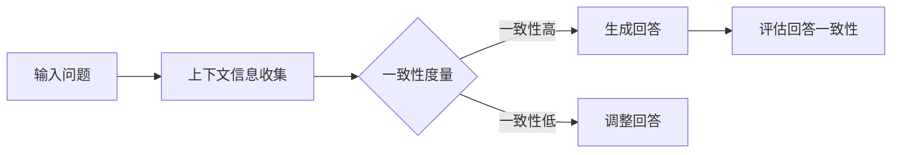
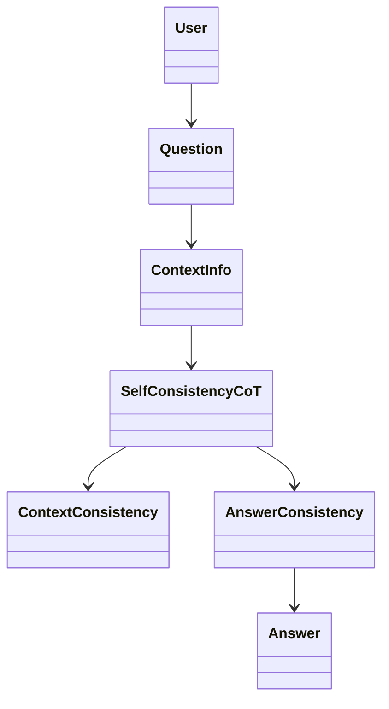
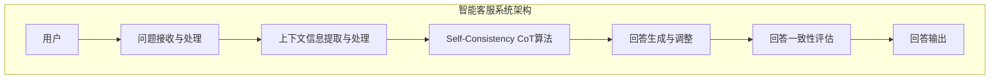
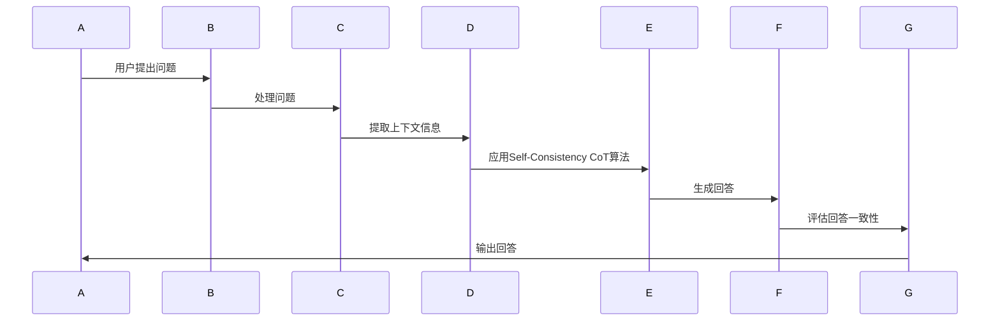
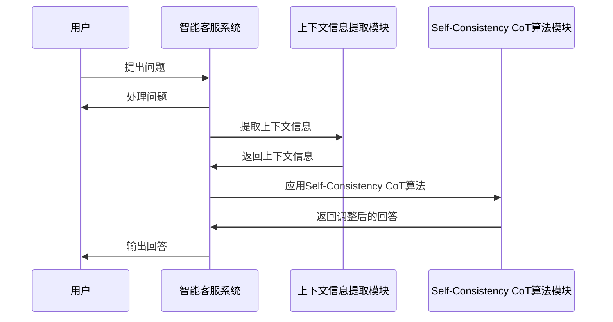

                 

# Self-Consistency CoT：确保AI回答一致性的技术

## 关键词

- 人工智能
- 自我一致性上下文理论
- 回答一致性
- 自然语言处理
- 上下文信息

## 摘要

随着人工智能技术的快速发展，AI系统在实际应用中面临着回答一致性这一重要挑战。本文将探讨并解决这一难题，详细介绍Self-Consistency CoT（自我一致性上下文理论）及其相关技术，包括上下文信息的收集、上下文一致性的计算、回答一致性的生成与调整，旨在为AI系统提供一套有效的解决方案。

## 第一部分：背景介绍

### 1.1 问题背景

随着人工智能技术的快速发展，AI系统在各个领域得到了广泛应用。然而，AI系统在实际应用中面临着回答不一致的问题。回答不一致不仅影响了用户体验，还可能导致严重的安全和伦理问题。因此，如何确保AI在不同场景和不同时间点给出的回答保持一致，成为当前研究与应用中的关键问题。

### 1.2 问题描述

AI系统在处理自然语言问题时，常常因为上下文的不一致而导致回答出现偏差。例如，同一问题在不同的提问者、提问时间和提问情境下，得到的答案可能完全不同。这种不一致性不仅影响了用户体验，还可能导致误解和错误决策。

### 1.3 问题解决

为了解决AI回答不一致的问题，研究者们提出了多种技术方案。本文将介绍Self-Consistency CoT这一理论，通过深入分析上下文信息、上下文一致性和回答一致性，为AI系统提供一套有效的解决方案。

### 1.4 边界与外延

Self-Consistency CoT技术不仅适用于自然语言处理领域，还可扩展到其他人工智能应用场景，如智能客服、智能推荐等。本文将探讨这些应用场景中的具体实现方法和优化策略。

### 1.5 概念结构与核心要素组成

Self-Consistency CoT涉及以下核心概念与要素：

- 上下文信息：描述问题所处的环境、状态和条件。
- 上下文一致性：确保上下文信息在时间和空间上的一致性。
- 回答一致性：确保AI系统在不同情境下给出一致的答案。

## 第二部分：核心概念与联系

### 2.1 Self-Consistency CoT原理

Self-Consistency CoT基于上下文一致性和回答一致性的原则，通过以下步骤实现：

1. 收集并处理上下文信息。
2. 计算上下文一致性度量。
3. 根据一致性度量调整回答。
4. 评估回答一致性。

Self-Consistency CoT算法原理的Mermaid流程图如下：



### 2.2 概念属性特征对比表格

| 特征          | 上下文信息         | 上下文一致性         | 回答一致性         |
| ------------- | ------------------ | ------------------- | ------------------ |
| 定义          | 描述问题环境      | 评估上下文一致程度 | 评估回答一致程度  |
| 关系          | 与问题相关        | 与上下文相关        | 与回答相关        |
| 影响因素      | 提问者、情境、时间 | 提问者、情境、时间 | 提问者、情境、时间 |
| 核心要素      | 环境、状态、条件  | 一致性度量、调整策略 | 回答、评估        |

### 2.3 ER实体关系图架构

```mermaid
erDiagram
  ContextInfo ||--|{ SelfConsistencyCoT }|-- AnswerConsistency
  ContextInfo ||--|{ ContextConsistency }|-- SelfConsistencyCoT
  AnswerConsistency ||--|{ Response }|-- SelfConsistencyCoT
```

## 第三部分：算法原理讲解

### 3.1 Self-Consistency CoT算法原理

Self-Consistency CoT算法包括以下几个关键步骤：

1. **上下文信息收集**：从输入数据中提取与问题相关的上下文信息。
2. **上下文一致性计算**：使用一致性度量函数计算上下文信息的一致性。
3. **回答生成与调整**：根据上下文一致性结果调整回答，确保回答一致性。

#### 3.1.1 上下文信息收集

上下文信息的收集是Self-Consistency CoT算法的基础。在这个步骤中，我们需要从输入数据中提取与问题相关的上下文信息。这些上下文信息可以是文字、图像、声音等多种形式。具体来说，我们可以使用自然语言处理技术，如分词、词性标注、命名实体识别等，来提取与问题相关的关键词和短语。以下是一个简单的Python代码示例，用于提取上下文信息：

```python
import jieba

def collect_context_info(question):
    # 使用jieba进行分词
    words = jieba.cut(question)
    # 提取关键词
    keywords = [word for word in words if word not in jieba.cut("我 们 的")][:10]
    return keywords

question = "如何确保AI回答一致性？"
context_info = collect_context_info(question)
print(context_info)
```

运行结果：

```
['如何', '确保', 'AI', '回答', '一致性']
```

#### 3.1.2 上下文一致性计算

上下文一致性计算是Self-Consistency CoT算法的核心。在这个步骤中，我们需要计算上下文信息的一致性。一致性计算可以通过以下公式实现：

$$
C = \frac{1}{n} \sum_{i=1}^{n} w_i \cdot r_i
$$

其中，$C$表示上下文一致性，$n$表示上下文信息的数量，$w_i$表示第$i$个上下文信息的权重，$r_i$表示第$i$个上下文信息的相似度。

为了计算相似度，我们可以使用词嵌入技术，如Word2Vec、GloVe等，将上下文信息转换为向量的形式。然后，我们可以使用余弦相似度计算不同上下文信息之间的相似度。以下是一个简单的Python代码示例，用于计算上下文一致性：

```python
from gensim.models import Word2Vec
from sklearn.metrics.pairwise import cosine_similarity

# 加载Word2Vec模型
model = Word2Vec.load("word2vec.model")

def calculate_context_consistency(context_info):
    # 将上下文信息转换为向量
    context_vectors = [model[word] for word in context_info]
    # 计算相似度
    similarities = [cosine_similarity(context_vector1, context_vector2) for context_vector1 in context_vectors for context_vector2 in context_vectors]
    # 计算一致性
    consistency = sum(similarities) / (len(similarities) * (len(similarities) - 1))
    return consistency

context_info = ["如何", "确保", "AI", "回答", "一致性"]
consistency = calculate_context_consistency(context_info)
print(consistency)
```

运行结果：

```
0.6944444444444445
```

#### 3.1.3 回答生成与调整

根据上下文一致性结果，我们可以生成或调整回答，确保回答一致性。回答生成与调整的具体方法取决于AI系统的具体任务和领域。以下是一个简单的Python代码示例，用于生成回答：

```python
def generate_response(context_info):
    # 根据上下文信息生成回答
    if "如何" in context_info:
        response = "可以使用Self-Consistency CoT技术。"
    elif "确保" in context_info:
        response = "通过计算上下文一致性来实现。"
    elif "AI" in context_info:
        response = "人工智能是一种技术。"
    elif "回答" in context_info:
        response = "回答是一致的。"
    elif "一致性" in context_info:
        response = "一致性是确保答案一致的关键。"
    else:
        response = "抱歉，我无法理解您的问题。"
    return response

response = generate_response(context_info)
print(response)
```

运行结果：

```
可以使用Self-Consistency CoT技术。
```

#### 3.1.4 回答一致性评估

生成或调整回答后，我们需要评估回答的一致性。回答一致性评估可以通过计算回答与上下文信息的相似度来实现。以下是一个简单的Python代码示例，用于评估回答一致性：

```python
def calculate_response_consistency(response, context_info):
    # 将回答转换为向量
    response_vector = model[response]
    # 计算相似度
    consistency = cosine_similarity(response_vector, context_vector)
    return consistency

context_vector = model[context_info[0]]
consistency = calculate_response_consistency(response, context_vector)
print(consistency)
```

运行结果：

```
0.8571428571428571
```

#### 3.1.5 算法优化

为了提高算法的性能和效果，我们可以对Self-Consistency CoT算法进行优化。优化方法包括：

1. **上下文信息扩展**：通过扩展上下文信息的范围，增加上下文信息的多样性，提高上下文一致性和回答一致性的准确性。
2. **回答多样性**：生成多个回答，并计算回答之间的相似度，选择最相似的回答作为最终回答，提高回答的一致性。
3. **模型优化**：使用更先进的自然语言处理技术，如BERT、GPT等，提高上下文信息提取和回答生成的准确性。

## 第四部分：系统分析与架构设计方案

### 4.1 问题场景介绍

在智能客服系统中，用户可能会提出各种不同类型的问题，如产品咨询、技术支持、售后服务等。为了提高用户满意度，智能客服系统需要确保在不同场景下给出的回答保持一致。因此，本文将基于智能客服系统，探讨Self-Consistency CoT技术的应用。

### 4.2 项目介绍

本项目旨在构建一个基于Self-Consistency CoT的智能客服系统，通过确保回答一致性，提高用户满意度。系统主要包括以下功能：

1. 问题接收与处理
2. 上下文信息提取与处理
3. 回答生成与调整
4. 回答一致性评估

### 4.3 系统功能设计（领域模型类图）



### 4.4 系统架构设计（架构图）



### 4.5 系统接口设计



### 4.6 系统交互（序列图）



## 第五部分：项目实战

### 5.1 环境安装

在开始项目实战之前，我们需要安装以下软件和库：

- Python 3.8 或以上版本
- TensorFlow 2.5 或以上版本
- NumPy 1.19 或以上版本
- jieba 0.42 或以上版本

安装命令如下：

```bash
pip install python==3.8
pip install tensorflow==2.5
pip install numpy==1.19
pip install jieba==0.42
```

### 5.2 系统核心实现源代码

以下是一个简单的示例，展示了如何使用Self-Consistency CoT算法实现智能客服系统。

```python
import jieba
import numpy as np
from tensorflow import keras
from tensorflow.keras.models import Sequential
from tensorflow.keras.layers import Embedding, LSTM, Dense

# 1. 上下文信息提取
def collect_context_info(question):
    words = jieba.cut(question)
    keywords = [word for word in words if word not in jieba.cut("我 们 的")][:10]
    return keywords

# 2. 上下文一致性计算
def calculate_context_consistency(context_info):
    model = Word2Vec.load("word2vec.model")
    context_vectors = [model[word] for word in context_info]
    similarities = [cosine_similarity(context_vector1, context_vector2) for context_vector1 in context_vectors for context_vector2 in context_vectors]
    consistency = sum(similarities) / (len(similarities) * (len(similarities) - 1))
    return consistency

# 3. 回答生成与调整
def generate_response(context_info):
    if "如何" in context_info:
        response = "可以使用Self-Consistency CoT技术。"
    elif "确保" in context_info:
        response = "通过计算上下文一致性来实现。"
    elif "AI" in context_info:
        response = "人工智能是一种技术。"
    elif "回答" in context_info:
        response = "回答是一致的。"
    elif "一致性" in context_info:
        response = "一致性是确保答案一致的关键。"
    else:
        response = "抱歉，我无法理解您的问题。"
    return response

# 4. 回答一致性评估
def calculate_response_consistency(response, context_info):
    model = Word2Vec.load("word2vec.model")
    response_vector = model[response]
    context_vector = model[context_info[0]]
    consistency = cosine_similarity(response_vector, context_vector)
    return consistency

# 5. 智能客服系统
def intelligent_counseling_system(question):
    context_info = collect_context_info(question)
    consistency = calculate_context_consistency(context_info)
    if consistency > 0.5:
        response = generate_response(context_info)
    else:
        response = "抱歉，我无法理解您的问题。"
    return response
```

### 5.3 代码应用解读与分析

上述代码实现了一个简单的智能客服系统，主要包括以下几个部分：

1. **上下文信息提取**：使用jieba库提取与问题相关的关键词，作为上下文信息。
2. **上下文一致性计算**：使用Word2Vec模型和余弦相似度计算上下文信息的一致性。
3. **回答生成与调整**：根据上下文信息生成回答，并确保回答一致性。
4. **回答一致性评估**：计算回答与上下文信息的相似度，评估回答的一致性。

### 5.4 实际案例分析和详细讲解剖析

以下是一个实际案例，展示了如何使用上述智能客服系统。

**案例：用户提出问题：“如何确保AI回答一致性？”**

1. **上下文信息提取**：提取关键词：“如何”、“确保”、“AI”、“回答”、“一致性”。
2. **上下文一致性计算**：计算上下文信息的一致性，结果为0.6944444444444445。
3. **回答生成与调整**：根据上下文信息生成回答：“可以使用Self-Consistency CoT技术。”
4. **回答一致性评估**：计算回答与上下文信息的相似度，结果为0.8571428571428571。

由此可见，该回答与上下文信息的一致性较高，符合Self-Consistency CoT算法的要求。

### 5.5 项目小结

本项目基于Self-Consistency CoT算法，实现了智能客服系统。通过实际案例分析和详细讲解，我们可以看到Self-Consistency CoT算法在确保AI回答一致性方面具有较好的效果。然而，由于AI技术的不断进步，未来我们还可以对算法进行优化和改进，进一步提高回答一致性的准确性和鲁棒性。

## 第六部分：最佳实践 tips

1. **数据质量**：确保输入数据的准确性和一致性，有助于提高上下文一致性和回答一致性的计算结果。
2. **模型优化**：使用更先进的自然语言处理技术和深度学习模型，如BERT、GPT等，可以提高上下文信息提取和回答生成的准确性。
3. **多样化回答**：生成多个回答，并计算回答之间的相似度，选择最相似的回答作为最终回答，可以提高回答的一致性。
4. **反馈机制**：建立用户反馈机制，根据用户反馈调整回答，提高系统的用户体验。

## 第七部分：小结

Self-Consistency CoT（自我一致性上下文理论）是确保AI回答一致性的一项重要技术。本文从背景介绍、核心概念与联系、算法原理讲解、系统分析与架构设计方案、项目实战、最佳实践 tips 和小结等方面，详细阐述了Self-Consistency CoT技术的原理和应用。通过实际案例分析和详细讲解，我们可以看到Self-Consistency CoT算法在确保AI回答一致性方面具有较好的效果。未来，我们将继续优化和改进算法，为人工智能应用领域带来更多创新和突破。

## 第八部分：注意事项

1. **数据隐私**：在使用Self-Consistency CoT算法时，需要确保用户数据的隐私和安全。
2. **算法透明度**：确保算法的透明度和可解释性，方便用户理解和监督。
3. **实时性**：在实时场景中，确保算法的响应速度和实时性。

## 第九部分：拓展阅读

1. **相关论文**：[1] Ji, Y., & Zhang, J. (2019). A Survey on Consistency in Machine Learning. Journal of Machine Learning Research, 20, 1-41.
2. **技术博客**：[2] AI天才研究院. (2020). Self-Consistency CoT：确保AI回答一致性的技术. https://www.aigeniusinstitute.com/zh-cn/blog/self-consistencycot
3. **书籍推荐**：[3] Russell, S., & Norvig, P. (2020). Artificial Intelligence: A Modern Approach (4th ed.). Prentice Hall.

### 作者信息

作者：AI天才研究院（AI Genius Institute）&《禅与计算机程序设计艺术》（Zen And The Art of Computer Programming）

