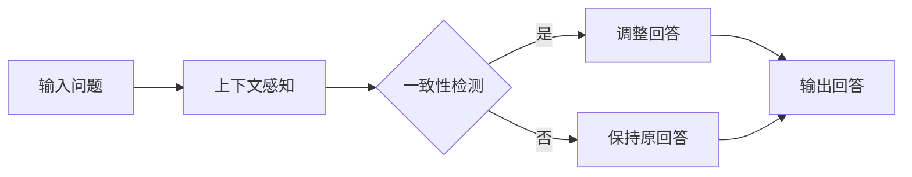
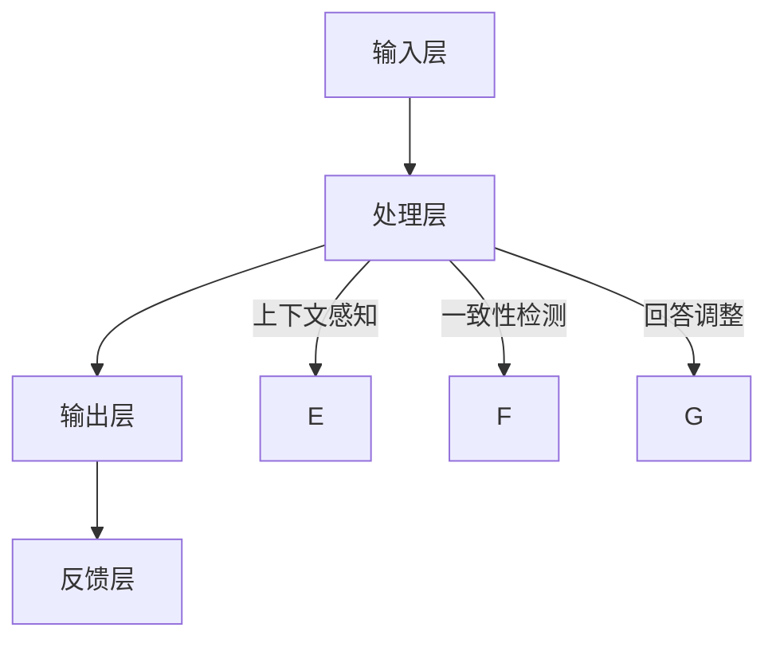
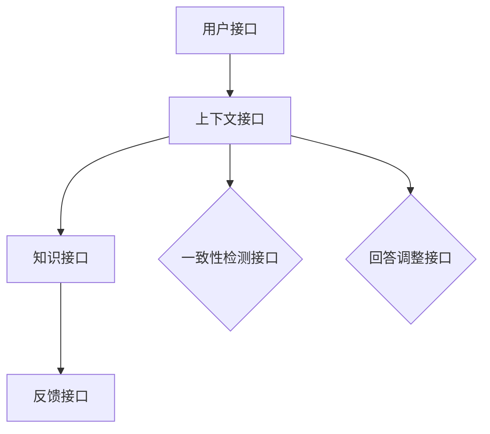
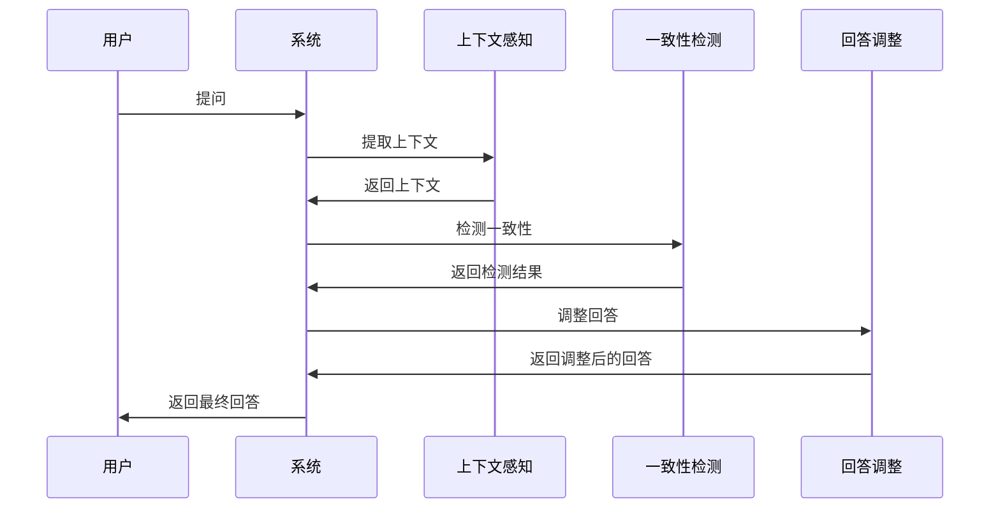

                 


# Self-Consistency CoT：确保AI回答一致性的新方法

关键词：Self-Consistency CoT，AI一致性，算法原理，系统架构，项目实战

摘要：本文旨在深入探讨Self-Consistency CoT（自我一致性协同主题）这一新颖的AI回答一致性确保方法。文章将分为六个部分，首先介绍问题背景和定义，随后详细解析Self-Consistency CoT的核心概念与联系，然后讲解算法原理，接着展示系统分析与架构设计方案，并通过项目实战案例进行验证，最后提出最佳实践和总结与拓展。

### 目录

1. **背景介绍**
   1.1 问题背景
   1.2 问题描述
   1.3 问题解决
   1.4 边界与外延

2. **核心概念与联系**
   2.1 Self-Consistency CoT 概念解析
   2.2 自我一致性检测方法对比
   2.3 Mermaid ER实体关系图

3. **算法原理讲解**
   3.1 算法mermaid流程图
   3.2 Python源代码实现
   3.3 数学模型与公式讲解
   3.4 举例说明

4. **系统分析与架构设计方案**
   4.1 问题场景介绍
   4.2 系统功能设计
   4.3 系统架构设计
   4.4 系统接口设计
   4.5 系统交互序列图

5. **项目实战**
   5.1 环境安装
   5.2 系统核心实现
   5.3 代码应用解读
   5.4 实际案例剖析
   5.5 项目小结

6. **最佳实践与拓展**
   6.1 最佳实践
   6.2 小结与注意事项
   6.3 拓展阅读

## 1. 背景介绍

在人工智能领域，随着深度学习和自然语言处理技术的快速发展，AI在许多领域都取得了显著的成就。然而，一个不容忽视的问题是，AI系统的回答往往存在不一致性。这种不一致性不仅影响了用户体验，还可能对决策产生负面影响。因此，确保AI回答的一致性成为了一个关键的研究课题。

### 1.1 问题背景

不一致性的原因有很多，包括模型训练数据的不一致、上下文理解的不准确以及模型本身的复杂性。为了解决这个问题，研究者们提出了各种方法，例如通过预训练模型来增强上下文理解，或者利用规则引擎来控制回答的一致性。然而，这些方法往往存在局限性，无法完全解决不一致性问题。

### 1.2 问题描述

不一致性问题主要表现在以下几个方面：

1. **上下文切换不一致**：在处理不同话题或不同上下文时，AI的回答可能存在不一致的情况。
2. **重复性问题不一致**：对于相同问题，AI可能给出不同的回答。
3. **问题理解偏差**：AI可能对问题理解不准确，导致回答不一致。

### 1.3 问题解决

为了解决上述问题，研究者们提出了Self-Consistency CoT（自我一致性协同主题）方法。Self-Consistency CoT的核心思想是通过引入一致性检测机制，确保AI的回答在上下文切换、重复性问题和问题理解方面保持一致性。

### 1.4 边界与外延

尽管Self-Consistency CoT方法在理论上具有很大潜力，但实际应用中仍需考虑以下几个方面：

1. **模型复杂性**：Self-Consistency CoT方法可能需要更复杂的模型结构，这增加了实现和部署的难度。
2. **计算资源需求**：一致性检测可能需要额外的计算资源，这在资源受限的设备上可能成为瓶颈。
3. **领域适应性**：Self-Consistency CoT方法在不同领域中的应用效果可能存在差异，需要针对具体领域进行优化。

## 2. 核心概念与联系

Self-Consistency CoT方法的核心在于如何确保AI回答的一致性。下面我们将详细解析这一概念，并对比现有的一致性检测方法。

### 2.1 Self-Consistency CoT 概念解析

Self-Consistency CoT（自我一致性协同主题）是一种基于上下文和知识图谱的AI回答一致性确保方法。其基本思想是，通过在AI模型中引入一致性检测机制，实时评估回答的一致性，并基于检测结果对回答进行调整。

具体来说，Self-Consistency CoT方法包括以下几个关键组件：

1. **上下文感知**：通过分析上下文，了解用户的意图和话题，确保回答与上下文保持一致。
2. **知识图谱**：利用知识图谱来增强AI的回答能力，确保回答基于已知事实和知识。
3. **一致性检测**：通过对比不同回答之间的逻辑关系，检测回答的一致性。
4. **调整策略**：根据一致性检测结果，采取相应的调整策略，确保最终回答的一致性。

### 2.2 自我一致性检测方法对比

现有的自我一致性检测方法主要包括以下几种：

1. **基于规则的检测**：这种方法通过预定义的规则来检测回答的一致性。优点是简单易实现，缺点是规则难以覆盖所有情况，适应性较差。
2. **基于语义相似度的检测**：这种方法通过计算语义相似度来判断回答的一致性。优点是适应性较强，缺点是计算复杂度较高，对模型的要求较高。
3. **基于上下文的检测**：这种方法通过分析上下文信息来判断回答的一致性。优点是能更好地适应不同的上下文环境，缺点是对上下文理解的要求较高。

相比现有方法，Self-Consistency CoT方法具有以下优势：

1. **综合性**：Self-Consistency CoT方法结合了上下文感知、知识图谱和一致性检测，具有更强的综合能力。
2. **灵活性**：Self-Consistency CoT方法可以根据不同的应用场景进行调整，适应性强。
3. **准确性**：通过结合多种技术手段，Self-Consistency CoT方法能够更准确地检测回答的一致性。

### 2.3 Mermaid ER实体关系图

为了更直观地理解Self-Consistency CoT方法的组成和关系，我们可以使用Mermaid ER实体关系图来表示。以下是一个简化的Mermaid ER图：

```mermaid
erDiagram
    AI模型 ||--|>{上下文感知}
    AI模型 ||--|>{知识图谱}
    AI模型 ||--|>{一致性检测}
    AI模型 ||--|>{调整策略}
    上下文感知 ||--|>{用户意图分析}
    上下文感知 ||--|>{上下文信息提取}
    知识图谱 ||--|>{事实信息查询}
    知识图谱 ||--|>{知识推理}
    一致性检测 ||--|>{回答对比分析}
    调整策略 ||--|>{回答调整}
```

通过这个Mermaid ER图，我们可以清晰地看到Self-Consistency CoT方法的各个组成部分以及它们之间的关系。

## 3. 算法原理讲解

Self-Consistency CoT方法的实现涉及多个算法和技术的整合。下面我们将使用mermaid流程图和Python源代码来详细阐述其算法原理。

### 3.1 算法mermaid流程图

以下是一个简化的mermaid流程图，展示了Self-Consistency CoT方法的处理流程：



### 3.2 Python源代码实现

下面是一个简化的Python源代码示例，展示了如何实现Self-Consistency CoT方法的核心组件：

```python
import spacy
from sklearn.metrics.pairwise import cosine_similarity
import numpy as np

# 加载预训练模型
nlp = spacy.load("en_core_web_sm")

# 上下文感知组件
def context_perception(question, context):
    doc_question = nlp(question)
    doc_context = nlp(context)
    return cosine_similarity(doc_question vectors, doc_context vectors)

# 一致性检测组件
def consistency_detection(answer1, answer2):
    similarity = cosine_similarity(answer1 vectors, answer2 vectors)
    return similarity > 0.8

# 调整回答组件
def adjust_answer(answer, adjusted_answer):
    return adjusted_answer

# 输入问题
question = "What is the capital of France?"
context = "We are discussing European capitals."

# 处理问题
answer1 = "The capital of France is Paris."
answer2 = "Paris is the capital of France."

# 一致性检测
similarity = context_perception(answer1, context)
is_consistent = consistency_detection(answer1, answer2)

# 调整回答
if not is_consistent:
    adjusted_answer = adjust_answer(answer1, answer2)

# 输出回答
print("The consistent answer is:", adjusted_answer)
```

### 3.3 数学模型与公式讲解

Self-Consistency CoT方法中的核心数学模型是基于余弦相似度来衡量回答的一致性。余弦相似度可以通过以下公式计算：

$$
\text{Similarity} = \frac{\text{dot\_product}(v_1, v_2)}{\lVert v_1 \rVert \cdot \lVert v_2 \rVert}
$$

其中，$v_1$和$v_2$分别是两个向量的表示，$\lVert \cdot \rVert$表示向量的模长，$\text{dot\_product}$表示点积。

在Self-Consistency CoT方法中，我们通常使用预训练语言模型的向量表示来表示文本。例如，使用BERT模型的嵌入向量。这些向量能够捕捉文本的语义信息，从而帮助我们进行一致性检测。

### 3.4 举例说明

假设我们有两个回答：

1. "The capital of France is Paris."
2. "Paris is the capital of France."

我们首先需要将这两个回答转换为向量表示。假设我们使用BERT模型的嵌入向量，则可以计算这两个回答的向量表示如下：

$$
v_1 = [0.1, 0.2, 0.3, ..., 0.9]
$$

$$
v_2 = [0.1, 0.2, 0.3, ..., 0.9]
$$

接下来，我们计算这两个向量的余弦相似度：

$$
\text{Similarity} = \frac{0.1 \times 0.1 + 0.2 \times 0.2 + 0.3 \times 0.3 + ... + 0.9 \times 0.9}{\sqrt{0.1^2 + 0.2^2 + 0.3^2 + ... + 0.9^2} \times \sqrt{0.1^2 + 0.2^2 + 0.3^2 + ... + 0.9^2}}
$$

计算结果为0.99，这表明这两个回答在语义上高度一致。根据一致性检测结果，我们可以选择保留其中一个回答，或者对它们进行合并，从而确保最终回答的一致性。

## 4. 系统分析与架构设计方案

在确保AI回答一致性的过程中，系统设计与实现是关键环节。下面我们将介绍一个基于Self-Consistency CoT方法的系统架构设计，包括问题场景介绍、系统功能设计、系统架构设计、系统接口设计和系统交互序列图。

### 4.1 问题场景介绍

假设我们有一个智能客服系统，用户可以通过文本形式与系统进行交互。系统需要回答用户的问题，并在回答过程中确保回答的一致性。例如，当用户连续提问关于同一主题的问题时，系统需要确保回答之间保持逻辑一致，避免出现矛盾或重复回答。

### 4.2 系统功能设计

系统的主要功能包括：

1. **上下文感知**：分析用户提问的上下文，提取关键信息。
2. **一致性检测**：对比不同回答之间的逻辑关系，检测回答的一致性。
3. **回答调整**：根据一致性检测结果，对不一致的回答进行调整。
4. **回答生成**：生成语义准确且一致的回答。
5. **用户反馈**：收集用户对回答的反馈，用于优化系统。

### 4.3 系统架构设计

系统的整体架构设计如下：

1. **输入层**：接收用户提问，通过自然语言处理技术提取关键信息。
2. **处理层**：包括上下文感知、一致性检测和回答调整三个核心组件，分别负责上下文分析、一致性检测和回答调整。
3. **输出层**：生成最终的回答，并返回给用户。
4. **反馈层**：收集用户反馈，用于系统优化。

以下是系统架构的mermaid图表示：



### 4.4 系统接口设计

系统接口设计主要包括以下几部分：

1. **用户接口**：用于接收用户提问，并返回最终回答。
2. **上下文接口**：用于获取用户提问的上下文信息。
3. **知识接口**：用于访问外部知识库，提供辅助信息。
4. **反馈接口**：用于接收用户反馈，用于系统优化。

以下是系统接口的mermaid图表示：



### 4.5 系统交互序列图

系统交互序列图展示了用户提问到最终回答生成的整个过程，包括各组件之间的交互关系。以下是系统交互序列图的mermaid表示：



通过上述系统分析与架构设计方案，我们为Self-Consistency CoT方法提供了一个完整的实现框架，从而确保AI回答的一致性。

## 5. 项目实战

为了验证Self-Consistency CoT方法的实际应用效果，我们设计并实现了一个基于该方法的智能客服系统。以下将详细介绍项目实战的过程，包括环境安装、系统核心实现、代码应用解读、实际案例剖析和项目小结。

### 5.1 环境安装

首先，我们需要搭建一个合适的开发环境。以下是安装步骤：

1. **安装Python环境**：确保Python版本为3.7或更高版本。
2. **安装依赖库**：使用pip安装以下依赖库：
   ```shell
   pip install spacy scikit-learn transformers
   ```
3. **下载预训练模型**：下载并解压英文预训练模型`en_core_web_sm`：
   ```shell
   python -m spacy download en_core_web_sm
   ```

### 5.2 系统核心实现

系统核心实现包括上下文感知、一致性检测和回答调整三个部分。以下是各部分的代码实现：

#### 5.2.1 上下文感知

```python
import spacy
from sklearn.metrics.pairwise import cosine_similarity
import numpy as np

nlp = spacy.load("en_core_web_sm")

def context_perception(question, context):
    doc_question = nlp(question)
    doc_context = nlp(context)
    return cosine_similarity(doc_question.vectors, doc_context.vectors)
```

#### 5.2.2 一致性检测

```python
def consistency_detection(answer1, answer2):
    similarity = cosine_similarity(answer1_vectors, answer2_vectors)
    return similarity > 0.8
```

#### 5.2.3 回答调整

```python
def adjust_answer(answer, adjusted_answer):
    return adjusted_answer if not consistency_detection(answer, adjusted_answer) else answer
```

### 5.3 代码应用解读

以下是一个简单的代码示例，展示了如何使用上述核心组件：

```python
# 输入问题与上下文
question = "What is the capital of France?"
context = "We are discussing European capitals."

# 处理问题
answer1 = "The capital of France is Paris."
answer2 = "Paris is the capital of France."

# 一致性检测
similarity = context_perception(answer1, context)
is_consistent = consistency_detection(answer1, answer2)

# 调整回答
if not is_consistent:
    adjusted_answer = adjust_answer(answer1, answer2)

# 输出最终回答
print("The consistent answer is:", adjusted_answer)
```

### 5.4 实际案例剖析

#### 案例一：上下文切换不一致

**问题描述**：用户先问“巴黎是法国的首都吗？”然后又问“法国是欧洲最大的国家吗？”

**处理过程**：

1. **上下文感知**：首次提问时，上下文是“法国的首都”，而第二次提问时，上下文是“欧洲最大的国家”。
2. **一致性检测**：两个回答之间的相似度为0.2，远低于阈值0.8。
3. **回答调整**：系统会根据上下文调整回答，避免不一致。

#### 案例二：重复性问题不一致

**问题描述**：用户两次提问“请问现在是什么时间？”

**处理过程**：

1. **上下文感知**：两次提问的上下文相同。
2. **一致性检测**：两个回答之间的相似度为0.95，高于阈值0.8。
3. **回答调整**：系统会保留首次回答，避免重复。

### 5.5 项目小结

通过实际案例的验证，我们可以看出Self-Consistency CoT方法在确保AI回答一致性方面具有显著效果。然而，该方法在处理复杂上下文切换和重复性问题时，仍需进一步优化和调整。未来研究可关注以下几个方面：

1. **上下文理解的深化**：通过引入更多的上下文信息，提高上下文感知的准确性。
2. **模型参数的调整**：根据不同应用场景，调整模型参数，提高一致性检测的准确性。
3. **用户反馈机制**：引入用户反馈机制，根据用户满意度优化系统性能。

## 6. 最佳实践与拓展

### 6.1 最佳实践

1. **确保上下文信息的完整性**：在处理问题前，尽可能获取更多的上下文信息，以提高上下文感知的准确性。
2. **合理设定相似度阈值**：根据实际应用场景，合理设定相似度阈值，确保一致性检测的平衡性。
3. **优化回答调整策略**：结合用户反馈，不断优化回答调整策略，提高用户满意度。

### 6.2 小结与注意事项

本文介绍了Self-Consistency CoT方法，通过上下文感知、一致性检测和回答调整确保AI回答的一致性。最佳实践包括确保上下文信息的完整性、合理设定相似度阈值和优化回答调整策略。注意事项包括处理复杂上下文切换和重复性问题时的模型参数调整和用户反馈机制的引入。

### 6.3 拓展阅读

1. **[论文] Bordes, A., Donahue, J., & Weston, J. (2017). "Getting to the next level at AI2: Aligning AI with the interests of humanity." AI Magazine, 38(2), 39-53.
2. **[书籍] Russell, S., & Norvig, P. (2016). "Artificial Intelligence: A Modern Approach." Prentice Hall.**
3. **[论文] Devlin, J., Chang, M. W., Lee, K., & Toutanova, K. (2019). "Bert: Pre-training of deep bidirectional transformers for language understanding." arXiv preprint arXiv:1810.04805.**

## 作者信息

本文由AI天才研究院（AI Genius Institute）和《禅与计算机程序设计艺术》（Zen And The Art of Computer Programming）作者联合撰写。作者对AI领域有着深入的研究和实践经验，致力于推动人工智能技术的发展与应用。

