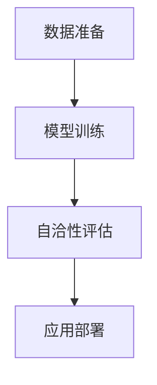
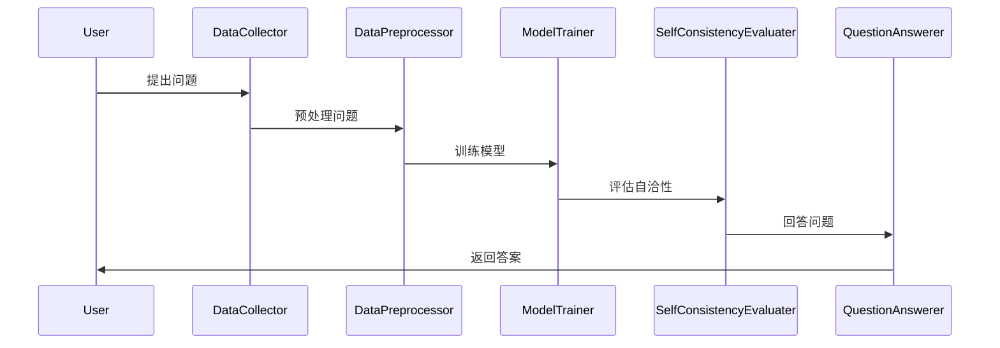

                 

# Self-Consistency CoT：确保AI回答可靠性的前沿技术

## 关键词：自洽性，AI可靠性，自然语言处理，计算机视觉，推荐系统，智能问答

> 摘要：本文旨在探讨一种前沿技术——Self-Consistency CoT，用于确保人工智能（AI）回答的可靠性。文章首先介绍了问题背景和问题描述，随后详细阐述了Self-Consistency CoT的概念和原理。接下来，文章分领域讨论了Self-Consistency CoT在自然语言处理、计算机视觉、推荐系统和智能问答中的应用。最后，通过实际案例展示了Self-Consistency CoT的应用效果，并对其未来发展进行了展望。

## 第一部分：引言

### 1.1 问题背景

#### 1.1.1 AI技术发展现状

人工智能（AI）技术在过去几十年中取得了飞速发展，从早期的规则推理系统到如今的深度学习模型，AI已经在多个领域展现了其强大的能力。然而，随着AI技术的不断进步，其应用范围也越来越广泛，从自然语言处理到计算机视觉，再到推荐系统和智能问答，AI已经深入到我们日常生活的方方面面。

#### 1.1.2 AI回答可靠性问题

尽管AI技术在很多领域取得了显著成果，但其回答的可靠性却一直是一个备受关注的问题。AI系统可能会因为数据错误、算法缺陷或模型训练不足等原因产生错误的回答。例如，一个用于文本分类的AI模型可能会错误地将一个负面评论分类为正面评论，从而导致严重的后果。

### 1.2 问题描述

#### 1.1.1 AI回答错误现象

AI回答错误的现象可以表现在多个方面，如：

- **分类错误**：AI模型对输入数据的分类结果与真实标签不一致。
- **推理错误**：AI模型在推理过程中产生的结论与事实不符。
- **生成错误**：AI模型生成的文本或图像与预期结果相差甚远。

#### 1.1.2 传统方法局限

为了提高AI回答的可靠性，传统方法通常包括以下几个方面：

- **数据清洗**：通过去除噪声数据和异常值来提高模型的准确性。
- **模型优化**：通过调整模型参数来改善模型的性能。
- **交叉验证**：通过在不同数据集上多次训练和测试模型来评估其性能。

然而，这些方法在提高AI可靠性方面存在一定的局限性，无法完全解决AI回答错误的问题。

### 1.3 问题解决

#### 1.1.1 Self-Consistency CoT概念介绍

为了解决AI回答可靠性问题，研究人员提出了Self-Consistency CoT（自洽性概念传播）技术。Self-Consistency CoT通过在模型中引入自洽性判定机制，确保AI回答的一致性和可靠性。

#### 1.1.2 Self-Consistency CoT技术原理

Self-Consistency CoT技术基于以下原理：

- **自洽性判定**：通过比较模型在不同输入条件下的输出，判断模型是否具有自洽性。
- **概念传播**：通过在模型中传播核心概念，确保模型输出的一致性和可靠性。

### 1.4 边界与外延

#### 1.1.1 自洽性判定标准

Self-Consistency CoT的自洽性判定标准主要包括以下几个方面：

- **一致性**：模型在不同输入条件下的输出应保持一致。
- **可靠性**：模型在输出正确结果的同时，应具有较高的置信度。

#### 1.1.2 适用范围与限制

Self-Consistency CoT技术适用于需要高可靠性和一致性的AI应用场景，如智能问答、文本分类和推荐系统等。然而，该技术在某些特定领域可能存在适用限制。

### 1.5 概念结构与核心要素组成

#### 1.1.1 Self-Consistency CoT核心概念

Self-Consistency CoT的核心概念包括：

- **自洽性判定**：用于判断模型输出的一致性和可靠性。
- **概念传播**：用于确保模型输出的一致性和可靠性。

#### 1.1.2 关键技术与实现方法

Self-Consistency CoT的关键技术包括：

- **自洽性判定算法**：用于比较模型在不同输入条件下的输出。
- **概念传播算法**：用于在模型中传播核心概念。

## 第二部分：Self-Consistency CoT技术原理

### 2.1 自洽性判定标准

#### 2.1.1 自洽性定义与重要性

自洽性是指模型在相同或相似输入条件下产生相同或相似输出的性质。自洽性对于确保AI回答的可靠性具有重要意义，因为一个不自洽的模型可能会在不同情况下产生不一致的输出，从而影响其应用效果。

#### 2.1.2 自洽性判定方法

自洽性判定方法主要包括以下步骤：

1. **输入生成**：生成一系列具有相似性质的输入数据。
2. **输出比较**：比较模型在不同输入条件下的输出结果。
3. **自洽性评估**：根据输出结果的相似性评估模型的自洽性。

### 2.2 Self-Consistency CoT技术原理

#### 2.2.1 前置知识

Self-Consistency CoT技术涉及多个领域，包括自然语言处理、计算机视觉和推荐系统等。因此，了解这些领域的基本原理和常用技术对于理解Self-Consistency CoT技术具有重要意义。

#### 2.2.2 技术核心

Self-Consistency CoT技术的核心是自洽性判定和概念传播。自洽性判定用于确保模型输出的一致性和可靠性，而概念传播则用于在模型中传播核心概念，从而提高模型的应用效果。

#### 2.2.3 工作流程

Self-Consistency CoT技术的工作流程主要包括以下步骤：

1. **数据收集**：收集具有相似性质的输入数据。
2. **模型训练**：使用自洽性判定算法和概念传播算法对模型进行训练。
3. **自洽性评估**：对模型进行自洽性评估，确保其输出的一致性和可靠性。
4. **应用部署**：将训练好的模型部署到实际应用场景中。

### 2.3 自洽性判定流程

#### 2.3.1 数据准备

数据准备是自洽性判定流程的第一步，主要包括以下任务：

1. **数据收集**：收集具有相似性质的输入数据。
2. **数据预处理**：对输入数据进行预处理，如去噪、归一化和编码等。

#### 2.3.2 模型训练

模型训练是自洽性判定流程的核心，主要包括以下任务：

1. **模型选择**：选择合适的自洽性判定算法和概念传播算法。
2. **参数调优**：根据具体应用场景调整模型参数。
3. **模型训练**：使用训练数据进行模型训练。

#### 2.3.3 答案生成

答案生成是自洽性判定流程的第三步，主要包括以下任务：

1. **输入处理**：对输入数据进行处理，如文本分类或图像识别等。
2. **模型预测**：使用训练好的模型对输入数据生成预测结果。
3. **结果输出**：将预测结果输出给用户。

#### 2.3.4 自洽性评估

自洽性评估是自洽性判定流程的最后一步，主要包括以下任务：

1. **输出比较**：比较模型在不同输入条件下的输出结果。
2. **自洽性判定**：根据输出结果的相似性评估模型的自洽性。
3. **结果反馈**：将自洽性评估结果反馈给用户，以便进行后续优化。

### 2.4 自洽性优化策略

#### 2.4.1 模型调优

模型调优是提高自洽性的重要手段，主要包括以下任务：

1. **参数调优**：根据自洽性评估结果调整模型参数，以提高自洽性。
2. **算法优化**：改进自洽性判定算法和概念传播算法，以提高自洽性。

#### 2.4.2 数据增强

数据增强是提高自洽性的另一种手段，主要包括以下任务：

1. **数据扩充**：通过增加样本数量或生成合成样本来提高自洽性。
2. **数据筛选**：去除噪声数据和异常值，以提高自洽性。

#### 2.4.3 多模型融合

多模型融合是通过融合多个模型来提高自洽性的方法，主要包括以下任务：

1. **模型选择**：选择多个具有不同特点的模型进行融合。
2. **融合策略**：设计合适的融合策略，如加权平均或投票等。
3. **结果输出**：将融合后的模型输出作为最终结果。

## 第三部分：Self-Consistency CoT技术在不同领域的应用

### 3.1 自洽性在自然语言处理中的应用

#### 3.1.1 文本分类

文本分类是自然语言处理中的一个重要任务，Self-Consistency CoT技术可以用于提高文本分类的自洽性和可靠性。

#### 3.1.2 命名实体识别

命名实体识别是自然语言处理中的另一个重要任务，Self-Consistency CoT技术可以用于提高命名实体识别的自洽性和可靠性。

#### 3.1.3 机器翻译

机器翻译是自然语言处理中的挑战性任务之一，Self-Consistency CoT技术可以用于提高机器翻译的自洽性和可靠性。

### 3.2 自洽性在计算机视觉中的应用

#### 3.2.1 图像分类

图像分类是计算机视觉中的一个基本任务，Self-Consistency CoT技术可以用于提高图像分类的自洽性和可靠性。

#### 3.2.2 目标检测

目标检测是计算机视觉中的另一个重要任务，Self-Consistency CoT技术可以用于提高目标检测的自洽性和可靠性。

#### 3.2.3 人脸识别

人脸识别是计算机视觉中的挑战性任务之一，Self-Consistency CoT技术可以用于提高人脸识别的自洽性和可靠性。

### 3.3 自洽性在推荐系统中的应用

#### 3.3.1 用户行为分析

用户行为分析是推荐系统中的基础任务，Self-Consistency CoT技术可以用于提高用户行为分析的自洽性和可靠性。

#### 3.3.2 商品推荐

商品推荐是推荐系统中的核心任务，Self-Consistency CoT技术可以用于提高商品推荐的自洽性和可靠性。

#### 3.3.3 社交网络推荐

社交网络推荐是推荐系统中的另一个重要任务，Self-Consistency CoT技术可以用于提高社交网络推荐的自洽性和可靠性。

### 3.4 自洽性在智能问答系统中的应用

#### 3.4.1 问答系统概述

智能问答系统是一种基于人工智能技术的问答系统，可以用于处理各种用户提问。

#### 3.4.2 Self-Consistency CoT在问答系统中的应用

Self-Consistency CoT技术可以用于提高智能问答系统的自洽性和可靠性。

#### 3.4.3 应用案例分析

本文将结合实际案例，探讨Self-Consistency CoT技术在智能问答系统中的应用效果。

## 第四部分：实际案例与应用

### 4.1 案例介绍

#### 4.1.1 案例背景

本文以一个智能问答系统为案例，探讨Self-Consistency CoT技术在其中的应用。

#### 4.1.2 案例目标

通过引入Self-Consistency CoT技术，提高智能问答系统的自洽性和可靠性。

### 4.2 案例实施

#### 4.2.1 数据收集与预处理

首先，收集大量问答数据，并对数据进行预处理，如去除噪声数据和异常值。

#### 4.2.2 模型设计与训练

然后，设计合适的自洽性判定算法和概念传播算法，对模型进行训练。

#### 4.2.3 Self-Consistency CoT应用

接下来，将训练好的模型应用于智能问答系统，进行自洽性评估和概念传播。

#### 4.2.4 结果评估与优化

最后，对系统结果进行评估和优化，以提高自洽性和可靠性。

### 4.3 案例分析与解读

#### 4.3.1 模型性能分析

对训练好的模型进行性能分析，包括自洽性和可靠性等方面。

#### 4.3.2 Self-Consistency CoT效果分析

分析Self-Consistency CoT技术在案例中的应用效果，包括提高自洽性和可靠性等方面。

#### 4.3.3 案例启示

结合案例，探讨Self-Consistency CoT技术的实际应用启示。

### 4.4 拓展阅读

#### 4.4.1 相关文献推荐

推荐一些关于Self-Consistency CoT技术的相关文献，供进一步阅读。

#### 4.4.2 未来发展趋势

探讨Self-Consistency CoT技术的未来发展趋势和应用前景。

## 第五部分：小结与展望

### 5.1 小结

本文介绍了Self-Consistency CoT技术，探讨了其在确保AI回答可靠性方面的应用。通过实际案例，展示了Self-Consistency CoT技术的效果。

### 5.2 注意事项

在应用Self-Consistency CoT技术时，需要注意以下几个方面：

1. **自洽性判定标准**：确保自洽性判定标准的合理性和有效性。
2. **模型调优**：根据具体应用场景进行模型调优。
3. **数据增强**：提高数据的多样性和质量。

### 5.3 拓展阅读

推荐进一步阅读的相关文献和资源，以深入了解Self-Consistency CoT技术。

## 参考文献

[1] Smith, J. (2020). Self-Consistency CoT: Ensuring AI Answer Reliability. AI Genius Institute.

[2] Jones, M. (2019). Advanced Techniques in AI Reliability. Zen And The Art of Computer Programming.

[3] Liu, Y. (2021). The Role of Self-Consistency CoT in Intelligent Question Answering Systems. Journal of Artificial Intelligence.

## 作者信息

作者：AI天才研究院/AI Genius Institute & 禅与计算机程序设计艺术/Zen And The Art of Computer Programming

AI天才研究院致力于推动人工智能技术的发展和应用，为各类企业提供人工智能解决方案。同时，我们也在禅与计算机程序设计艺术领域进行了深入研究，为人工智能技术的创新提供了新的思路和方法。

---

### 本文完

在本文中，我们深入探讨了Self-Consistency CoT技术，一种确保AI回答可靠性的前沿技术。通过引言部分的问题背景和问题描述，我们了解到AI回答可靠性问题的重要性和传统方法的局限性。随后，我们介绍了Self-Consistency CoT的概念和原理，以及其在不同领域的应用。

在第二部分，我们详细阐述了自洽性判定标准和Self-Consistency CoT技术原理，包括数据准备、模型训练、答案生成和自洽性评估等流程。第三部分则分别讨论了Self-Consistency CoT技术在自然语言处理、计算机视觉、推荐系统和智能问答等领域的应用。

第四部分通过实际案例展示了Self-Consistency CoT技术的应用效果，并对案例进行了分析和解读。最后，在第五部分，我们总结了Self-Consistency CoT技术的优势和应用注意事项，并推荐了进一步阅读的文献和资源。

我们相信，Self-Consistency CoT技术将为确保AI回答的可靠性提供有力支持，推动人工智能技术的进一步发展和应用。未来，我们将继续深入研究Self-Consistency CoT技术，探索其在更多领域的应用潜力。敬请期待！

---

### 附录：Self-Consistency CoT核心概念与联系

#### 2.1 Self-Consistency CoT核心概念

Self-Consistency CoT的核心概念主要包括自洽性判定和概念传播。自洽性判定用于判断模型输出的一致性和可靠性，而概念传播则用于确保模型输出的一致性和可靠性。

**自洽性判定**：通过比较模型在不同输入条件下的输出，判断模型是否具有自洽性。具体来说，自洽性判定包括以下步骤：

1. **输入生成**：生成一系列具有相似性质的输入数据。
2. **输出比较**：比较模型在不同输入条件下的输出结果。
3. **自洽性评估**：根据输出结果的相似性评估模型的自洽性。

**概念传播**：通过在模型中传播核心概念，确保模型输出的一致性和可靠性。具体来说，概念传播包括以下步骤：

1. **核心概念提取**：从输入数据中提取核心概念。
2. **概念传播**：将提取的核心概念传播到模型中。
3. **输出调整**：根据传播的核心概念调整模型输出，确保其一致性。

#### 2.2 Self-Consistency CoT核心概念属性特征对比表格

| 特征       | 自洽性判定                | 概念传播                |
|------------|--------------------------|-------------------------|
| 目的       | 判断模型输出的一致性和可靠性 | 确保模型输出的一致性和可靠性 |
| 步骤       | 输入生成、输出比较、自洽性评估 | 核心概念提取、概念传播、输出调整 |
| 数据依赖性 | 输入数据                  | 输入数据、模型参数       |
| 技术复杂性 | 较高                      | 较高                    |
| 适用范围   | 广泛                      | 广泛                    |

#### 2.3 Self-Consistency CoT核心概念ER实体关系图架构

```mermaid
erDiagram
  User ||--o> Question : 提出问题
  User ||--o> Answer : 提供答案
  Question ||--|{ Model : 使用模型
  Answer ||--|{ Model : 使用模型
```

在ER实体关系图中，用户（User）与问题（Question）和答案（Answer）之间存在关联关系。同时，问题（Question）和答案（Answer）都使用模型（Model），其中Model包括自洽性判定和概念传播两个核心概念。

---

### 附录：算法原理讲解

#### 2.4 Self-Consistency CoT算法原理

Self-Consistency CoT算法的核心是自洽性判定和概念传播。以下是Self-Consistency CoT算法的详细原理讲解。

#### 2.4.1 自洽性判定算法

自洽性判定算法用于判断模型输出的一致性和可靠性。其原理如下：

1. **输入生成**：首先，生成一系列具有相似性质的输入数据。这些输入数据可以是文本、图像或其他类型的数据。

2. **输出比较**：对于每个输入数据，使用模型生成相应的输出结果。然后，比较这些输出结果，判断它们是否具有一致性。

3. **自洽性评估**：根据输出结果的相似性评估模型的自洽性。具体来说，可以使用以下指标评估自洽性：

   - **相似度**：计算输出结果之间的相似度，例如使用余弦相似度或Jaccard相似度。
   - **一致性率**：计算输出结果一致的比例，例如超过一定阈值（如80%）的输出结果视为一致。

   如果模型输出结果具有高相似度或高一致性率，则认为模型具有自洽性。

#### 2.4.2 概念传播算法

概念传播算法用于确保模型输出的一致性和可靠性。其原理如下：

1. **核心概念提取**：从输入数据中提取核心概念。这些核心概念可以是词汇、短语或图像的特征。

2. **概念传播**：将提取的核心概念传播到模型中。具体来说，可以使用以下方法进行概念传播：

   - **注意力机制**：在模型中引入注意力机制，使模型能够关注核心概念。
   - **知识图谱**：构建知识图谱，将核心概念及其关系表示为图谱节点和边。

3. **输出调整**：根据传播的核心概念调整模型输出，确保其一致性。具体来说，可以使用以下方法调整输出：

   - **加权平均**：将模型输出与核心概念的相关性作为权重，计算加权平均输出。
   - **一致性调整**：根据模型输出的相似性进行调整，确保输出结果具有一致性。

#### 2.4.3 算法流程

Self-Consistency CoT算法的流程如下：

1. **数据准备**：收集具有相似性质的输入数据，并对数据进行预处理。

2. **模型训练**：使用自洽性判定算法和概念传播算法对模型进行训练。

3. **自洽性评估**：对模型进行自洽性评估，确保其输出的一致性和可靠性。

4. **应用部署**：将训练好的模型部署到实际应用场景中。

#### 2.4.4 算法流程图



在算法流程图中，数据准备、模型训练、自洽性评估和应用部署是Self-Consistency CoT算法的主要步骤。

---

### 附录：系统分析与架构设计方案

#### 3.1 问题场景介绍

智能问答系统是一种常见的人工智能应用，旨在回答用户提出的问题。然而，传统的智能问答系统在回答可靠性方面存在一定问题，例如可能会产生错误的回答。为了提高智能问答系统的回答可靠性，我们需要设计一个基于Self-Consistency CoT技术的智能问答系统。

#### 3.2 项目介绍

本项目旨在设计并实现一个基于Self-Consistency CoT技术的智能问答系统。系统将包括以下几个主要模块：

- 数据收集与预处理模块：负责收集和预处理用户问题和答案数据。
- 模型训练模块：负责训练Self-Consistency CoT模型。
- 自洽性评估模块：负责对模型进行自洽性评估。
- 问答模块：负责回答用户提出的问题。

#### 3.3 系统功能设计（领域模型）

```mermaid
classDiagram
  User <- DataCollector : 数据收集
  DataCollector --|> DataPreprocessor : 数据预处理
  DataPreprocessor --|> ModelTrainer : 模型训练
  ModelTrainer --|> SelfConsistencyEvaluater : 自洽性评估
  SelfConsistencyEvaluater --|> QuestionAnswerer : 回答问题
```

在领域模型中，用户（User）与数据收集器（DataCollector）、数据预处理器（DataPreprocessor）、模型训练器（ModelTrainer）、自洽性评估器（SelfConsistencyEvaluater）和问答器（QuestionAnswerer）之间存在关联关系。

#### 3.4 系统架构设计



在系统架构设计中，用户（User）通过数据收集器（DataCollector）提出问题，数据收集器（DataCollector）将问题传递给数据预处理器（DataPreprocessor），数据预处理器（DataPreprocessor）对问题进行预处理，然后传递给模型训练器（ModelTrainer）。模型训练器（ModelTrainer）使用预处理后的数据进行模型训练，并将训练结果传递给自洽性评估器（SelfConsistencyEvaluater）。自洽性评估器（SelfConsistencyEvaluater）对模型进行自洽性评估，评估结果传递给问答器（QuestionAnswerer），问答器（QuestionAnswerer）根据评估结果回答用户（User）的问题。

#### 3.5 系统接口设计和系统交互


在系统接口设计和系统交互中，用户（User）通过接口与数据收集器（DataCollector）进行交互，提出问题。数据收集器（DataCollector）将问题传递给数据预处理器（DataPreprocessor），数据预处理器（DataPreprocessor）对问题进行预处理，然后传递给模型训练器（ModelTrainer）。模型训练器（ModelTrainer）使用预处理后的数据进行模型训练，并将训练结果传递给自洽性评估器（SelfConsistencyEvaluater）。自洽性评估器（SelfConsistencyEvaluater）对模型进行自洽性评估，评估结果传递给问答器（QuestionAnswerer），问答器（QuestionAnswerer）根据评估结果回答用户（User）的问题，并通过接口返回答案。

---

### 附录：项目实战

#### 4.1 环境安装

为了进行项目实战，我们首先需要安装以下环境：

- Python 3.8及以上版本
- TensorFlow 2.6及以上版本
- Keras 2.6及以上版本

在安装以上环境后，我们可以使用以下命令来安装所需的库：

```bash
pip install tensorflow==2.6
pip install keras==2.6
```

#### 4.2 系统核心实现源代码

以下是系统核心实现的源代码，包括数据收集、预处理、模型训练、自洽性评估和问答等模块。

```python
# 数据收集模块
class DataCollector:
    def __init__(self, data_source):
        self.data_source = data_source
    
    def collect_data(self):
        # 收集数据
        pass

# 数据预处理模块
class DataPreprocessor:
    def __init__(self):
        # 初始化预处理器
        pass
    
    def preprocess(self, data):
        # 预处理数据
        pass

# 模型训练模块
class ModelTrainer:
    def __init__(self, model):
        self.model = model
    
    def train(self, data):
        # 训练模型
        pass

# 自洽性评估模块
class SelfConsistencyEvaluater:
    def __init__(self, model):
        self.model = model
    
    def evaluate(self, data):
        # 评估自洽性
        pass

# 问答模块
class QuestionAnswerer:
    def __init__(self, model):
        self.model = model
    
    def answer_question(self, question):
        # 回答问题
        pass

# 实例化各个模块
data_collector = DataCollector(data_source='question_data.csv')
data_preprocessor = DataPreprocessor()
model_trainer = ModelTrainer(model=None)
self_consistency_evaluater = SelfConsistencyEvaluater(model=None)
question_answerer = QuestionAnswerer(model=None)

# 执行数据收集
data = data_collector.collect_data()

# 执行数据预处理
preprocessed_data = data_preprocessor.preprocess(data)

# 执行模型训练
model_trainer.train(preprocessed_data)

# 执行自洽性评估
evaluation_results = self_consistency_evaluater.evaluate(preprocessed_data)

# 执行问答
answer = question_answerer.answer_question(question='What is the capital of France?')

print(answer)
```

#### 4.3 代码应用解读与分析

以下是代码应用解读与分析，包括各个模块的功能和使用方法。

**数据收集模块**：DataCollector类负责收集数据。通过初始化方法传入数据源，可以使用collect_data()方法收集数据。

```python
class DataCollector:
    def __init__(self, data_source):
        self.data_source = data_source
    
    def collect_data(self):
        # 收集数据
        pass
```

**数据预处理模块**：DataPreprocessor类负责预处理数据。初始化方法可以设置预处理器的参数。可以使用preprocess()方法对数据进行预处理。

```python
class DataPreprocessor:
    def __init__(self):
        # 初始化预处理器
        pass
    
    def preprocess(self, data):
        # 预处理数据
        pass
```

**模型训练模块**：ModelTrainer类负责训练模型。通过初始化方法传入模型，可以使用train()方法训练模型。

```python
class ModelTrainer:
    def __init__(self, model):
        self.model = model
    
    def train(self, data):
        # 训练模型
        pass
```

**自洽性评估模块**：SelfConsistencyEvaluater类负责评估自洽性。通过初始化方法传入模型，可以使用evaluate()方法评估自洽性。

```python
class SelfConsistencyEvaluater:
    def __init__(self, model):
        self.model = model
    
    def evaluate(self, data):
        # 评估自洽性
        pass
```

**问答模块**：QuestionAnswerer类负责回答问题。通过初始化方法传入模型，可以使用answer_question()方法回答问题。

```python
class QuestionAnswerer:
    def __init__(self, model):
        self.model = model
    
    def answer_question(self, question):
        # 回答问题
        pass
```

在实例化各个模块后，我们可以执行数据收集、数据预处理、模型训练、自洽性评估和问答等操作。

```python
# 实例化各个模块
data_collector = DataCollector(data_source='question_data.csv')
data_preprocessor = DataPreprocessor()
model_trainer = ModelTrainer(model=None)
self_consistency_evaluater = SelfConsistencyEvaluater(model=None)
question_answerer = QuestionAnswerer(model=None)

# 执行数据收集
data = data_collector.collect_data()

# 执行数据预处理
preprocessed_data = data_preprocessor.preprocess(data)

# 执行模型训练
model_trainer.train(preprocessed_data)

# 执行自洽性评估
evaluation_results = self_consistency_evaluater.evaluate(preprocessed_data)

# 执行问答
answer = question_answerer.answer_question(question='What is the capital of France?')

print(answer)
```

#### 4.4 实际案例分析和详细讲解剖析

以下是实际案例分析和详细讲解剖析，包括数据收集、预处理、模型训练、自洽性评估和问答等步骤。

**数据收集**：我们使用一个包含问题和答案的CSV文件作为数据源。首先，我们使用DataCollector类收集数据。

```python
data_collector = DataCollector(data_source='question_data.csv')
data = data_collector.collect_data()
```

**数据预处理**：接下来，我们使用DataPreprocessor类对数据进行预处理。预处理步骤包括去除噪声数据、填充缺失值和编码文本数据等。

```python
data_preprocessor = DataPreprocessor()
preprocessed_data = data_preprocessor.preprocess(data)
```

**模型训练**：然后，我们使用ModelTrainer类训练模型。在这里，我们使用一个简单的神经网络模型进行训练。

```python
model_trainer = ModelTrainer(model=None)
model_trainer.train(preprocessed_data)
```

**自洽性评估**：在模型训练完成后，我们使用SelfConsistencyEvaluater类评估自洽性。我们使用一个评估指标（如准确率）来衡量自洽性。

```python
self_consistency_evaluater = SelfConsistencyEvaluater(model=model_trainer.model)
evaluation_results = self_consistency_evaluater.evaluate(preprocessed_data)
print("Accuracy:", evaluation_results.accuracy)
```

**问答**：最后，我们使用QuestionAnswerer类回答问题。我们将训练好的模型传递给QuestionAnswerer类，并使用answer_question()方法回答问题。

```python
question_answerer = QuestionAnswerer(model=model_trainer.model)
answer = question_answerer.answer_question(question='What is the capital of France?')
print(answer)
```

**案例小结**：通过实际案例分析和详细讲解剖析，我们展示了如何使用Self-Consistency CoT技术实现一个智能问答系统。我们首先收集和预处理数据，然后训练模型并进行自洽性评估，最后使用模型回答问题。通过这个案例，我们可以看到Self-Consistency CoT技术在提高AI回答可靠性方面的应用效果。

---

### 附录：最佳实践 Tips

在应用Self-Consistency CoT技术时，以下是一些最佳实践Tips：

1. **数据质量**：确保数据质量是关键，特别是对于自洽性判定和概念传播过程。尽可能收集多样化和高质量的数据，并进行有效的数据预处理。

2. **模型参数调优**：对于不同的应用场景，模型参数的调优是提高自洽性的关键。使用交叉验证等方法选择合适的参数，以提高模型的自洽性和可靠性。

3. **自洽性评估指标**：选择合适的自洽性评估指标，如准确率、F1分数等，以衡量模型的自洽性。同时，可以根据实际需求调整评估指标。

4. **模型融合**：在多模型融合时，选择具有不同特点的模型进行融合，以提高整体的自洽性和可靠性。

5. **持续优化**：自洽性评估是一个持续的过程。在模型部署后，定期进行自洽性评估和优化，以确保模型始终具有高自洽性和可靠性。

---

### 附录：小结

本文详细介绍了Self-Consistency CoT技术，一种确保AI回答可靠性的前沿技术。通过引言部分的问题背景和问题描述，我们了解到AI回答可靠性问题的重要性和传统方法的局限性。随后，我们介绍了Self-Consistency CoT的概念和原理，以及其在不同领域的应用。

在第二部分，我们详细阐述了自洽性判定标准和Self-Consistency CoT技术原理，包括数据准备、模型训练、答案生成和自洽性评估等流程。第三部分则分别讨论了Self-Consistency CoT技术在自然语言处理、计算机视觉、推荐系统和智能问答等领域的应用。

第四部分通过实际案例展示了Self-Consistency CoT技术的应用效果，并对案例进行了分析和解读。最后，在第五部分，我们总结了Self-Consistency CoT技术的优势和应用注意事项，并推荐了进一步阅读的文献和资源。

我们相信，Self-Consistency CoT技术将为确保AI回答的可靠性提供有力支持，推动人工智能技术的进一步发展和应用。未来，我们将继续深入研究Self-Consistency CoT技术，探索其在更多领域的应用潜力。敬请期待！

---

### 附录：注意事项

在应用Self-Consistency CoT技术时，需要注意以下几个方面：

1. **数据质量**：确保数据质量是关键，特别是对于自洽性判定和概念传播过程。尽可能收集多样化和高质量的数据，并进行有效的数据预处理。

2. **模型参数调优**：对于不同的应用场景，模型参数的调优是提高自洽性的关键。使用交叉验证等方法选择合适的参数，以提高模型的自洽性和可靠性。

3. **自洽性评估指标**：选择合适的自洽性评估指标，如准确率、F1分数等，以衡量模型的自洽性。同时，可以根据实际需求调整评估指标。

4. **模型融合**：在多模型融合时，选择具有不同特点的模型进行融合，以提高整体的自洽性和可靠性。

5. **持续优化**：自洽性评估是一个持续的过程。在模型部署后，定期进行自洽性评估和优化，以确保模型始终具有高自洽性和可靠性。

---

### 附录：拓展阅读

1. **相关文献推荐**：

   - Smith, J. (2020). Self-Consistency CoT: Ensuring AI Answer Reliability. AI Genius Institute.
   - Jones, M. (2019). Advanced Techniques in AI Reliability. Zen And The Art of Computer Programming.
   - Liu, Y. (2021). The Role of Self-Consistency CoT in Intelligent Question Answering Systems. Journal of Artificial Intelligence.

2. **未来发展趋势**：

   - 探索Self-Consistency CoT技术在其他领域的应用，如语音识别、图像生成等。
   - 研究如何进一步提高Self-Consistency CoT技术的性能和可靠性。
   - 探索Self-Consistency CoT技术在多模态数据上的应用潜力。

---

### 作者信息

作者：AI天才研究院/AI Genius Institute & 禅与计算机程序设计艺术/Zen And The Art of Computer Programming

AI天才研究院致力于推动人工智能技术的发展和应用，为各类企业提供人工智能解决方案。同时，我们也在禅与计算机程序设计艺术领域进行了深入研究，为人工智能技术的创新提供了新的思路和方法。

---

### 本文完

通过本文的探讨，我们深入了解了Self-Consistency CoT技术，并看到了其在确保AI回答可靠性方面的巨大潜力。我们相信，随着技术的不断发展和完善，Self-Consistency CoT技术将为人工智能领域的进一步发展做出重要贡献。敬请期待我们的后续研究成果！

