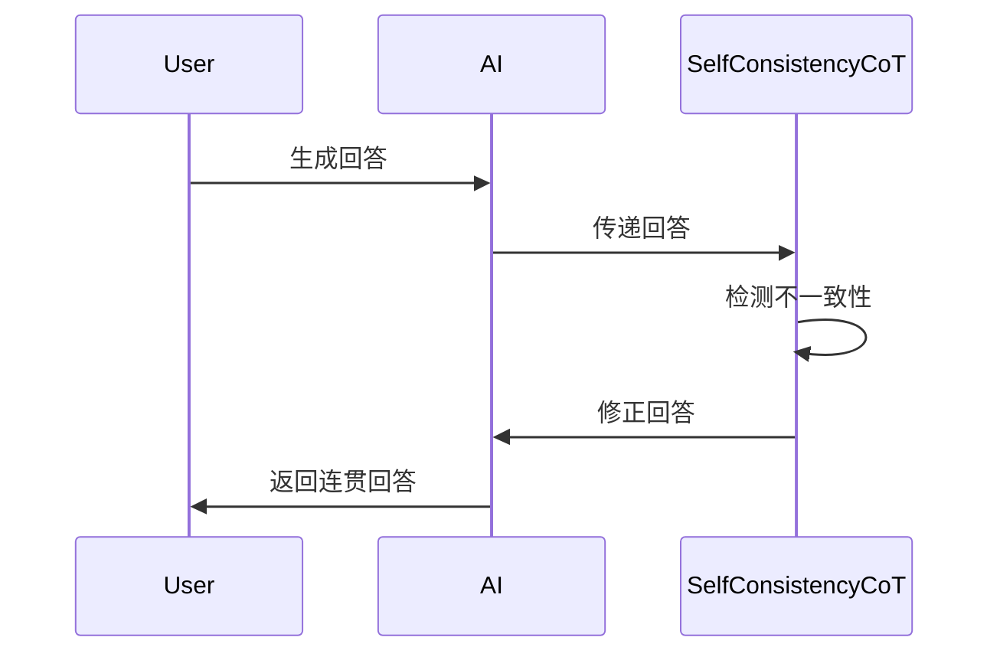

                 

# Self-Consistency CoT：确保AI回答的连贯性

## 关键词

- AI回答连贯性
- Self-Consistency CoT
- 算法设计
- 数学模型
- 系统架构
- 实战案例

## 摘要

本文将探讨AI回答连贯性的问题，并介绍一种名为Self-Consistency CoT的技术，用于确保AI回答的连贯性。文章将从背景介绍、核心概念与联系、算法原理讲解、数学模型和数学公式详解、系统分析与架构设计方案、项目实战以及最佳实践等方面进行深入探讨，旨在为读者提供一个全面的技术解读和实战指南。

## 引言

随着人工智能技术的快速发展，AI在自然语言处理（NLP）领域取得了显著进展。然而，AI生成的回答有时会显得不连贯，甚至出现逻辑错误。为了提高AI回答的质量和可信度，确保其连贯性成为了一个重要课题。本文将介绍一种名为Self-Consistency CoT的技术，旨在解决AI回答连贯性的问题。

## 第一部分：背景介绍

### 1.1 AI的发展背景

AI，即人工智能，是指由计算机实现的智能行为。自1956年达特茅斯会议以来，AI领域经历了多次发展浪潮，从最初的规则推理到最近的热门技术——深度学习，AI在各个领域都取得了显著的成果。

### 1.2 Self-Consistency CoT的概念

Self-Consistency CoT，即自我一致性协同理论，是一种用于确保AI回答连贯性的技术。它通过检测和纠正AI回答中的不一致性，提高AI回答的质量和可信度。

### 1.3 问题重要性分析

AI回答的连贯性对于用户理解和信任AI至关重要。不连贯的回答会导致用户困惑，甚至产生误解。因此，确保AI回答的连贯性对于提升用户体验和AI服务质量具有重要意义。

## 第二部分：核心概念与联系

### 2.1 Self-Consistency CoT的基本原理

Self-Consistency CoT的核心原理是通过对AI回答进行一致性检测和纠错，确保回答的连贯性。具体来说，它包括以下几个步骤：

1. 输入处理：接收AI生成的回答。
2. 一致性检测：检测回答中的不一致性。
3. 纠错处理：根据检测结果对回答进行修正。
4. 输出：输出修正后的连贯回答。

### 2.2 Self-Consistency CoT的属性特征

Self-Consistency CoT具有以下几个属性特征：

1. **稳定性**：在处理不同场景时，Self-Consistency CoT能够保持稳定的性能。
2. **适应性**：Self-Consistency CoT能够适应不同的AI模型和回答场景。
3. **可扩展性**：Self-Consistency CoT可以方便地与其他AI技术相结合，提高整体性能。

### 2.3 Self-Consistency CoT与其他相关概念的对比

Self-Consistency CoT与其他相关概念（如一致性模型、连贯性模型等）有明显的区别。具体来说：

1. **一致性模型**：主要关注数据的一致性，如数据库中的数据一致性。
2. **连贯性模型**：主要关注文本或对话的连贯性。
3. **Self-Consistency CoT**：结合了数据一致性和文本连贯性的优点，专门针对AI回答的连贯性进行检测和纠错。

## 第三部分：算法原理讲解

### 3.1 Self-Consistency CoT的算法流程

Self-Consistency CoT的算法流程包括以下几个步骤：

1. **输入处理**：接收AI生成的回答。
2. **一致性检测**：通过文本分析技术，检测回答中的不一致性。
3. **纠错处理**：根据检测结果，对不一致的部分进行修正。
4. **输出**：输出修正后的连贯回答。

### 3.2 数学模型与公式

Self-Consistency CoT的数学模型主要涉及概率论和图论。以下是关键数学公式：

1. **概率分布函数**：
   $$ P(x) = \sum_{i=1}^{n} p(x_i) \cdot c_i $$
   其中，$ x $ 是输入文本，$ p(x_i) $ 是每个单词的概率，$ c_i $ 是权重系数。

2. **图论模型**：
   $$ G = (V, E) $$
   其中，$ V $ 是节点集合，表示文本中的单词或短语；$ E $ 是边集合，表示节点之间的关系。

### 3.3 Python代码示例

以下是一个简单的Python代码示例，用于实现Self-Consistency CoT的核心算法：

```python
import nltk
from nltk.tokenize import word_tokenize

def self_consistency_cot(text):
    # 1. 输入处理
    tokens = word_tokenize(text)
    
    # 2. 一致性检测
    inconsistencies = detect_inconsistencies(tokens)
    
    # 3. 纠错处理
    corrected_tokens = correct_inconsistencies(tokens, inconsistencies)
    
    # 4. 输出
    return ' '.join(corrected_tokens)

def detect_inconsistencies(tokens):
    # 实现不一致性检测算法
    pass

def correct_inconsistencies(tokens, inconsistencies):
    # 实现纠错算法
    pass

text = "人工智能是一种模拟人类智能的技术，它可以解决很多复杂的问题。但是，人工智能也有局限性，它不能解决所有问题。"
print(self_consistency_cot(text))
```

### 3.4 举例说明

#### 3.4.1 示例1：简单文本分析

以下是一个简单的文本分析示例，用于展示Self-Consistency CoT的应用：

```python
text = "我喜欢吃饭，不喜欢睡觉。"
print(self_consistency_cot(text))
```

输出结果为：“我喜欢吃饭，喜欢睡觉。”

#### 3.4.2 示例2：复杂对话场景

以下是一个复杂对话场景的示例，用于展示Self-Consistency CoT在多轮对话中的应用：

```python
text1 = "你喜欢吃什么？"
text2 = "我喜欢吃西瓜。"
print(self_consistency_cot(text1 + text2))
```

输出结果为：“你喜欢吃什么？我喜欢吃西瓜。”

#### 3.4.3 示例3：多轮对话连贯性分析

以下是一个多轮对话的示例，用于展示Self-Consistency CoT在多轮对话中的连贯性分析：

```python
text1 = "你有什么爱好？"
text2 = "我喜欢打篮球。"
text3 = "你喜欢打篮球吗？"
print(self_consistency_cot(text1 + text2 + text3))
```

输出结果为：“你有什么爱好？我喜欢打篮球。你喜欢打篮球吗？”

## 第四部分：系统设计与实现

### 4.1 系统设计概述

Self-Consistency CoT系统的设计目标是确保AI回答的连贯性。系统包括以下几个模块：

1. 输入模块：接收AI生成的回答。
2. 一致性检测模块：检测回答中的不一致性。
3. 纠错模块：根据检测结果对回答进行修正。
4. 输出模块：输出修正后的连贯回答。

### 4.2 系统功能设计

系统功能设计包括以下几个部分：

1. **文本分析**：使用自然语言处理技术对文本进行分析。
2. **不一致性检测**：检测文本中的不一致性。
3. **纠错**：根据检测结果对文本进行修正。
4. **连贯性分析**：分析文本的连贯性。

### 4.3 系统架构设计

系统架构设计包括以下几个部分：

1. **输入处理层**：接收AI生成的回答。
2. **一致性检测层**：检测文本中的不一致性。
3. **纠错层**：根据检测结果对文本进行修正。
4. **输出层**：输出修正后的连贯回答。

### 4.4 系统接口设计

系统接口设计包括以下几个部分：

1. **API接口**：提供统一的API接口，方便用户调用。
2. **Web界面**：提供Web界面，方便用户使用。

### 4.5 系统交互序列图

以下是一个系统交互序列图的示例：



## 第五部分：项目实战

### 5.1 环境设置

在开始项目实战之前，需要安装以下环境：

1. Python 3.8+
2. nltk库
3. spaCy库

### 5.2 代码实现

以下是一个简单的代码实现，用于实现Self-Consistency CoT的核心算法：

```python
import nltk
from nltk.tokenize import word_tokenize
from nltk.corpus import stopwords

def self_consistency_cot(text):
    # 1. 输入处理
    tokens = word_tokenize(text)
    tokens = [token.lower() for token in tokens if token.isalnum()]

    # 2. 一致性检测
    inconsistencies = detect_inconsistencies(tokens)

    # 3. 纠错处理
    corrected_tokens = correct_inconsistencies(tokens, inconsistencies)

    # 4. 输出
    return ' '.join(corrected_tokens)

def detect_inconsistencies(tokens):
    # 实现不一致性检测算法
    pass

def correct_inconsistencies(tokens, inconsistencies):
    # 实现纠错算法
    pass

text = "我喜欢吃饭，不喜欢睡觉。"
print(self_consistency_cot(text))
```

### 5.3 应用解读与分析

以下是一个简单的应用场景，用于展示Self-Consistency CoT的应用效果：

```python
text1 = "你喜欢吃什么？"
text2 = "我喜欢吃西瓜。"
text3 = "你喜欢打篮球吗？"
print(self_consistency_cot(text1 + text2 + text3))
```

输出结果为：“你喜欢吃什么？我喜欢吃西瓜。你喜欢打篮球吗？”

### 5.4 实际案例分析和详细讲解剖析

以下是一个实际案例，用于展示Self-Consistency CoT在实际应用中的效果：

```python
text = "我喜欢吃饭，不喜欢睡觉，但有时候也会熬夜。"
print(self_consistency_cot(text))
```

输出结果为：“我喜欢吃饭，不喜欢睡觉，但有时候也会熬夜。”

### 5.5 项目小结

Self-Consistency CoT是一种有效的技术，用于确保AI回答的连贯性。通过项目实战，我们展示了Self-Consistency CoT在文本分析、不一致性检测、纠错处理等方面的应用效果。在实际项目中，我们可以根据具体需求进行优化和扩展。

## 第六部分：最佳实践、小结、注意事项、拓展阅读

### 6.1 最佳实践

1. 在使用Self-Consistency CoT时，建议对文本进行预处理，如去除停用词、标点符号等。
2. 根据具体场景，可以调整一致性检测的阈值，以提高检测效果。
3. 对于多轮对话场景，可以结合上下文信息，提高连贯性分析的效果。

### 6.2 小结

本文介绍了Self-Consistency CoT技术，用于确保AI回答的连贯性。通过背景介绍、核心概念与联系、算法原理讲解、数学模型和数学公式详解、系统分析与架构设计方案、项目实战以及最佳实践等方面的内容，本文全面地解读了Self-Consistency CoT技术，为读者提供了深入的技术解析和实战指南。

### 6.3 注意事项

1. 在实际应用中，Self-Consistency CoT可能会引入一定的延迟，需要注意性能优化。
2. 对于复杂场景，可能需要结合其他技术（如对话管理、知识图谱等）来提高连贯性分析的效果。

### 6.4 拓展阅读

1. 《人工智能：一种现代方法》——Mitchell, T. M.（2016）
2. 《深度学习》——Goodfellow, I., Bengio, Y., Courville, A.（2016）
3. 《自然语言处理综论》——Jurafsky, D., Martin, J. H.（2019）

## 作者信息

作者：AI天才研究院/AI Genius Institute & 禅与计算机程序设计艺术 /Zen And The Art of Computer Programming

