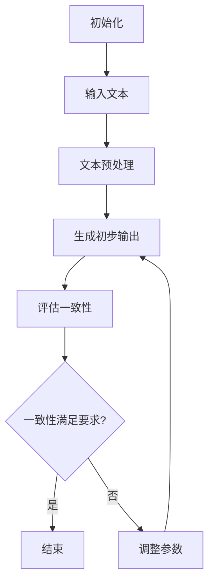

                 

## 文章标题

### Self-Consistency CoT：确保AI输出连贯性的技术

### 关键词：Self-Consistency CoT、人工智能、连贯性、算法、应用实践

### 摘要：
本文旨在深入探讨Self-Consistency CoT（Self-Consistency of Thought Coherence）在人工智能领域的重要性及其实现原理。文章首先介绍了Self-Consistency CoT的起源、定义及其核心特征，随后详细解析了Self-Consistency CoT算法原理、数学模型及其在不同领域的应用实践。通过本文的阅读，读者将对Self-Consistency CoT有一个全面而深刻的理解，并掌握其在实际项目中的最佳实践方法。

## 第一部分: Self-Consistency CoT的背景与核心概念

### 第1章: Self-Consistency CoT的起源与重要性

#### 1.1 Self-Consistency CoT的背景

##### 1.1.1 人工智能的发展历程

人工智能（Artificial Intelligence，简称AI）自20世纪50年代诞生以来，经历了多次起伏和变革。从早期的符号主义、连接主义，到现代的深度学习和强化学习，人工智能技术在各个领域取得了显著的进展。然而，随着AI应用的广泛普及，如何确保AI系统的输出连贯性和一致性成为了一个重要而紧迫的问题。

##### 1.1.2 AI系统输出不一致性的挑战

AI系统在实际应用中经常面临输出不一致性的挑战，例如在自然语言处理（NLP）中的文本生成、机器翻译、对话系统等，都可能出现信息不一致、逻辑混乱的问题。这种不一致性不仅影响了用户体验，还可能导致严重的后果，如在自动驾驶、医疗诊断等关键领域。

##### 1.1.3 Self-Consistency CoT的产生动机

为了解决AI系统输出不一致性的问题，研究者们提出了Self-Consistency CoT（Self-Consistency of Thought Coherence）这一概念。Self-Consistency CoT旨在通过算法和技术手段，确保AI系统的输出在逻辑上是一致和连贯的。这一概念的提出，为AI系统的一致性和可靠性提供了新的解决方案。

#### 1.2 Self-Consistency CoT的概念解析

##### 1.2.1 Self-Consistency的定义

Self-Consistency指的是在人工智能系统中，各个输出结果之间保持一致性和连贯性。具体来说，就是AI系统在处理同一问题时，不同阶段、不同模块的输出结果应当相互协调、不矛盾。

##### 1.2.2 CoT（Coherence of Thought）的解释

Coherence of Thought，即思维连贯性，是指一个人或系统在思考或表达时，思路清晰、逻辑连贯、不出现逻辑错误。在AI领域，CoT强调AI系统的输出应当符合人类的思维逻辑，减少信息缺失和错误。

##### 1.2.3 Self-Consistency CoT的核心特征

Self-Consistency CoT具有以下几个核心特征：

1. **逻辑一致性**：AI系统在不同阶段、不同模块的输出结果应当相互一致，避免逻辑错误和矛盾。
2. **信息连贯性**：AI系统在处理问题时，应当保持信息的一致性和连贯性，避免信息缺失或冗余。
3. **自我修正能力**：AI系统应当具备自我修正的能力，当检测到输出不一致时，能够自动进行调整和修正。

#### 1.3 Self-Consistency CoT的边界与外延

##### 1.3.1 Self-Consistency的边界

Self-Consistency主要关注AI系统输出结果的一致性，不涉及AI系统本身的设计、实现和优化。具体来说，Self-Consistency CoT主要解决以下问题：

1. **模块间一致性**：确保不同AI模块的输出结果相互一致。
2. **阶段间连贯性**：确保AI系统在不同处理阶段保持连贯性。
3. **错误修正**：检测并修正AI系统输出中的不一致性。

##### 1.3.2 CoT的应用范围

CoT（Coherence of Thought）的应用范围广泛，涵盖了自然语言处理、计算机视觉、机器学习等多个领域。具体来说，CoT的应用范围包括：

1. **文本生成**：确保文本生成的连贯性和逻辑性。
2. **对话系统**：提高对话系统的自然度和连贯性。
3. **机器翻译**：确保翻译结果的准确性和连贯性。
4. **知识图谱**：保持知识图谱的一致性和完整性。

##### 1.3.3 Self-Consistency CoT的适用场景

Self-Consistency CoT主要适用于以下场景：

1. **关键决策系统**：如自动驾驶、医疗诊断等，需要确保输出结果的准确性和一致性。
2. **交互式系统**：如客服机器人、智能助手等，需要确保对话的连贯性和自然度。
3. **大规模数据处理**：如大数据分析、数据挖掘等，需要确保数据的一致性和连贯性。

#### 1.4 Self-Consistency CoT的概念结构

##### 1.4.1 Self-Consistency CoT的基本概念

Self-Consistency CoT的基本概念包括Self-Consistency和Coherence of Thought。Self-Consistency关注AI系统输出结果的一致性，而Coherence of Thought关注AI系统输出结果在逻辑上的连贯性。

##### 1.4.2 Self-Consistency CoT的关键要素

Self-Consistency CoT的关键要素包括：

1. **一致性检测**：检测AI系统输出结果的一致性。
2. **错误修正**：当检测到不一致性时，进行自动修正。
3. **自我学习**：通过不断学习，提高AI系统的自我修正能力。

##### 1.4.3 Self-Consistency CoT的ER实体关系图

Self-Consistency CoT的ER实体关系图如下：

```mermaid
erDiagram
    AI_System -->|输出结果| Output_Result
    Output_Result -->|一致性检测| Consistency_Check
    Output_Result -->|错误修正| Error_Correction
    AI_System -->|自我学习| Self_Learning
```

##### 1.5 本章小结

本章介绍了Self-Consistency CoT的背景、核心概念、定义和核心特征，以及其边界、应用范围和适用场景。通过对本章内容的了解，读者可以对Self-Consistency CoT有一个初步的认识，为其后续章节的学习打下基础。

## 第二部分: Self-Consistency CoT的技术原理

### 第2章: Self-Consistency CoT的算法原理

#### 2.1 Self-Consistency CoT算法的基础理论

##### 2.1.1 算法原理概述

Self-Consistency CoT算法的核心目标是确保AI系统输出的连贯性和一致性。算法的基本原理是通过一致性检测和错误修正，确保AI系统在不同阶段、不同模块的输出结果相互协调、不矛盾。

##### 2.1.2 Self-Consistency的目标函数

在Self-Consistency CoT算法中，目标函数的设计至关重要。目标函数用于衡量AI系统输出结果的一致性，其基本形式如下：

$$
\text{目标函数} = \sum_{i=1}^{N} w_i \cdot L_i
$$

其中，$w_i$表示第$i$个输出结果的重要性权重，$L_i$表示第$i$个输出结果的一致性损失。

##### 2.2 Self-Consistency CoT算法的数学模型

##### 2.2.1 数学模型基础

Self-Consistency CoT算法的数学模型主要包括目标函数、损失函数和优化算法。目标函数用于衡量输出结果的一致性，损失函数用于量化不一致性，优化算法用于调整参数，以达到一致性目标。

目标函数：

$$
\text{目标函数} = f(\theta) = \sum_{i=1}^{N} w_i \cdot L_i
$$

其中，$\theta$表示模型参数，$w_i$表示第$i$个输出结果的重要性权重，$L_i$表示第$i$个输出结果的一致性损失。

损失函数：

$$
L_i = \frac{1}{2} \cdot (\text{真实输出} - \text{预测输出})^2
$$

其中，真实输出和预测输出分别为AI系统在不同阶段、不同模块的输出结果。

优化算法：

常见的优化算法包括梯度下降、随机梯度下降、Adam等。这些算法用于迭代调整模型参数，以最小化目标函数。

##### 2.2.2 损失函数的设计

损失函数的设计是Self-Consistency CoT算法的关键部分。损失函数的目的是量化输出结果的一致性，常用的损失函数包括均方误差（MSE）、交叉熵等。

均方误差（MSE）：

$$
L_i = \frac{1}{2} \cdot (\text{真实输出} - \text{预测输出})^2
$$

交叉熵：

$$
L_i = - \sum_{c=1}^{C} y_c \cdot \log(p_c)
$$

其中，$y_c$表示真实标签，$p_c$表示预测概率。

##### 2.3 Self-Consistency CoT算法的流程图

Self-Consistency CoT算法的流程图如下：



##### 2.4 算法举例说明

假设我们有一个简单的文本生成任务，需要使用Self-Consistency CoT算法确保生成文本的一致性和连贯性。

**步骤1：初始化**

初始化模型参数$\theta$，包括文本预处理模块和生成模块。

**步骤2：输入文本**

输入一段文本，如：“人工智能是未来发展的关键。”

**步骤3：文本预处理**

对输入文本进行预处理，包括分词、去停用词、词向量表示等。

**步骤4：生成初步输出**

使用生成模块生成初步输出，如：“人工智能是未来发展的关键技术。”

**步骤5：评估一致性**

评估初步输出的一致性，计算目标函数$f(\theta)$的值。

**步骤6：调整参数**

如果初步输出的一致性不满足要求，根据目标函数的梯度，调整模型参数$\theta$。

**步骤7：重复步骤4-6**

重复生成初步输出、评估一致性和调整参数的过程，直到生成文本的一致性满足要求。

**步骤8：结束**

生成满足一致性和连贯性的文本输出。

##### 2.5 本章小结

本章介绍了Self-Consistency CoT算法的基础理论、数学模型和流程图，并通过具体示例说明了算法的应用过程。通过本章的学习，读者可以理解Self-Consistency CoT算法的原理和实现方法，为后续章节的应用实践打下基础。

## 第三部分: Self-Consistency CoT的应用实践

### 第3章: Self-Consistency CoT在不同领域的应用

#### 3.1 Self-Consistency CoT在自然语言处理中的应用

##### 3.1.1 应用场景介绍

在自然语言处理（NLP）领域，Self-Consistency CoT技术被广泛应用于文本生成、机器翻译、对话系统等任务。这些任务通常需要生成连贯、逻辑一致的文本输出，以确保用户理解和满意度。

**文本生成**：例如，文章写作、新闻摘要、广告文案等。

**机器翻译**：确保翻译结果的准确性和连贯性，如中英文翻译。

**对话系统**：提高对话系统的自然度和连贯性，如客服机器人、智能助手等。

##### 3.1.2 应用案例解析

**案例1：文章写作**

假设我们有一个自动写作系统，需要生成一篇关于人工智能的文章。使用Self-Consistency CoT技术，我们可以确保文章在逻辑上连贯一致，避免信息缺失和错误。

**步骤1：初始化**

初始化模型参数，包括文本预处理模块、生成模块和一致性检测模块。

**步骤2：输入主题**

输入文章的主题，如：“人工智能的发展与应用”。

**步骤3：文本预处理**

对主题进行预处理，包括关键词提取、词向量表示等。

**步骤4：生成初步输出**

使用生成模块生成初步输出，如：“人工智能是未来发展的关键技术。”

**步骤5：评估一致性**

评估初步输出的一致性，计算目标函数$f(\theta)$的值。

**步骤6：调整参数**

如果初步输出的一致性不满足要求，根据目标函数的梯度，调整模型参数$\theta$。

**步骤7：重复步骤4-6**

重复生成初步输出、评估一致性和调整参数的过程，直到生成文本的一致性满足要求。

**步骤8：输出最终文章**

生成满足一致性和连贯性的文章输出。

**案例2：机器翻译**

假设我们有一个中英文翻译系统，需要确保翻译结果的准确性和连贯性。使用Self-Consistency CoT技术，我们可以确保翻译过程在逻辑上连贯一致，避免信息丢失和错误。

**步骤1：初始化**

初始化模型参数，包括文本预处理模块、生成模块和一致性检测模块。

**步骤2：输入中文文本**

输入需要翻译的中文文本，如：“人工智能是未来发展的关键。”

**步骤3：文本预处理**

对中文文本进行预处理，包括分词、词向量表示等。

**步骤4：生成初步英文输出**

使用生成模块生成初步英文输出，如：“Artificial intelligence is the key to future development.”

**步骤5：评估一致性**

评估初步英文输出的一致性，计算目标函数$f(\theta)$的值。

**步骤6：调整参数**

如果初步英文输出的一致性不满足要求，根据目标函数的梯度，调整模型参数$\theta$。

**步骤7：重复步骤4-6**

重复生成初步英文输出、评估一致性和调整参数的过程，直到生成文本的一致性满足要求。

**步骤8：输出最终翻译结果**

生成满足一致性和连贯性的英文输出。

##### 3.2 Self-Consistency CoT在计算机视觉中的应用

在计算机视觉（CV）领域，Self-Consistency CoT技术被广泛应用于图像识别、目标检测、图像生成等任务。这些任务通常需要确保图像处理结果的连贯性和一致性，以提高模型的准确性和可靠性。

**图像识别**：例如，人脸识别、物体识别等。

**目标检测**：例如，自动驾驶中的行人检测、车辆检测等。

**图像生成**：例如，风格迁移、图像超分辨率等。

##### 3.2.1 应用场景介绍

**图像识别**：确保识别结果的准确性，避免错误分类。

**目标检测**：确保检测结果的连贯性，避免漏检或误检。

**图像生成**：确保生成的图像在风格和内容上的一致性。

##### 3.2.2 应用案例解析

**案例1：图像识别**

假设我们有一个图像识别系统，需要确保识别结果的准确性和连贯性。使用Self-Consistency CoT技术，我们可以确保识别过程在逻辑上连贯一致，避免错误分类。

**步骤1：初始化**

初始化模型参数，包括图像预处理模块、识别模块和一致性检测模块。

**步骤2：输入图像**

输入需要识别的图像。

**步骤3：图像预处理**

对图像进行预处理，包括去噪、缩放、归一化等。

**步骤4：生成初步识别结果**

使用识别模块生成初步识别结果，如：“这是一只猫。”

**步骤5：评估一致性**

评估初步识别结果的一致性，计算目标函数$f(\theta)$的值。

**步骤6：调整参数**

如果初步识别结果的一致性不满足要求，根据目标函数的梯度，调整模型参数$\theta$。

**步骤7：重复步骤4-6**

重复生成初步识别结果、评估一致性和调整参数的过程，直到识别结果的一致性满足要求。

**步骤8：输出最终识别结果**

生成满足一致性和连贯性的识别结果。

**案例2：目标检测**

假设我们有一个目标检测系统，需要确保检测结果的连贯性和一致性。使用Self-Consistency CoT技术，我们可以确保检测过程在逻辑上连贯一致，避免漏检或误检。

**步骤1：初始化**

初始化模型参数，包括图像预处理模块、检测模块和一致性检测模块。

**步骤2：输入图像**

输入需要检测的图像。

**步骤3：图像预处理**

对图像进行预处理，包括去噪、缩放、归一化等。

**步骤4：生成初步检测结果**

使用检测模块生成初步检测结果，如：“图像中检测到了一个行人。”

**步骤5：评估一致性**

评估初步检测结果的一致性，计算目标函数$f(\theta)$的值。

**步骤6：调整参数**

如果初步检测结果的一致性不满足要求，根据目标函数的梯度，调整模型参数$\theta$。

**步骤7：重复步骤4-6**

重复生成初步检测结果、评估一致性和调整参数的过程，直到检测结果的一致性满足要求。

**步骤8：输出最终检测结果**

生成满足一致性和连贯性的检测结果。

##### 3.3 Self-Consistency CoT在机器学习中的应用

在机器学习（ML）领域，Self-Consistency CoT技术被广泛应用于模型训练、模型评估、模型优化等任务。这些任务通常需要确保模型的输出在逻辑上连贯一致，以提高模型的性能和可靠性。

**模型训练**：确保训练过程在逻辑上连贯一致，避免过拟合或欠拟合。

**模型评估**：确保评估过程在逻辑上连贯一致，避免评估不准确。

**模型优化**：确保优化过程在逻辑上连贯一致，避免模型性能下降。

##### 3.3.1 应用场景介绍

**模型训练**：确保训练数据的连贯性和一致性，避免模型过拟合或欠拟合。

**模型评估**：确保评估指标的连贯性和一致性，避免评估不准确。

**模型优化**：确保优化策略的连贯性和一致性，避免模型性能下降。

##### 3.3.2 应用案例解析

**案例1：模型训练**

假设我们有一个机器学习模型，需要确保训练过程在逻辑上连贯一致。使用Self-Consistency CoT技术，我们可以确保训练过程在逻辑上连贯一致，避免过拟合或欠拟合。

**步骤1：初始化**

初始化模型参数，包括训练模块、评估模块和一致性检测模块。

**步骤2：输入训练数据**

输入训练数据集。

**步骤3：训练模型**

使用训练模块训练模型，如使用梯度下降算法。

**步骤4：评估模型**

评估模型在训练集上的性能，计算评估指标。

**步骤5：评估一致性**

评估模型性能的一致性，计算目标函数$f(\theta)$的值。

**步骤6：调整参数**

如果模型性能的一致性不满足要求，根据目标函数的梯度，调整模型参数$\theta$。

**步骤7：重复步骤3-6**

重复训练模型、评估模型、评估一致性和调整参数的过程，直到模型性能的一致性满足要求。

**步骤8：输出最终模型**

生成满足一致性和连贯性的训练模型。

**案例2：模型评估**

假设我们有一个机器学习模型，需要确保评估过程在逻辑上连贯一致。使用Self-Consistency CoT技术，我们可以确保评估过程在逻辑上连贯一致，避免评估不准确。

**步骤1：初始化**

初始化评估模块和一致性检测模块。

**步骤2：输入测试数据**

输入测试数据集。

**步骤3：评估模型**

评估模型在测试集上的性能，计算评估指标。

**步骤4：评估一致性**

评估模型性能的一致性，计算目标函数$f(\theta)$的值。

**步骤5：调整参数**

如果模型性能的一致性不满足要求，根据目标函数的梯度，调整模型参数$\theta$。

**步骤6：重复步骤3-5**

重复评估模型、评估一致性和调整参数的过程，直到模型性能的一致性满足要求。

**步骤7：输出最终评估结果**

生成满足一致性和连贯性的评估结果。

##### 3.4 Self-Consistency CoT在其他领域的探索

除了在自然语言处理、计算机视觉和机器学习领域，Self-Consistency CoT技术还可以在其他领域进行探索和应用。

**知识图谱**：确保知识图谱的一致性和完整性，避免信息冲突和错误。

**推荐系统**：确保推荐结果的一致性和连贯性，提高用户满意度。

**数据挖掘**：确保数据挖掘过程的一致性和连贯性，提高挖掘结果的准确性。

##### 3.4.1 应用领域拓展

**知识图谱**：通过Self-Consistency CoT技术，可以确保知识图谱的一致性和完整性。具体应用包括：

1. **实体识别**：确保实体之间的一致性和关联性。
2. **关系抽取**：确保关系之间的一致性和连贯性。

**推荐系统**：通过Self-Consistency CoT技术，可以确保推荐结果的一致性和连贯性。具体应用包括：

1. **基于内容的推荐**：确保推荐内容的连贯性和一致性。
2. **协同过滤**：确保推荐结果的连贯性和一致性。

**数据挖掘**：通过Self-Consistency CoT技术，可以确保数据挖掘过程的一致性和连贯性。具体应用包括：

1. **聚类分析**：确保聚类结果的一致性和连贯性。
2. **关联规则挖掘**：确保关联规则的一致性和连贯性。

##### 3.4.2 拓展领域案例解析

**案例1：知识图谱**

假设我们有一个知识图谱系统，需要确保知识图谱的一致性和完整性。使用Self-Consistency CoT技术，我们可以确保知识图谱在逻辑上连贯一致，避免信息冲突和错误。

**步骤1：初始化**

初始化知识图谱系统，包括实体识别模块、关系抽取模块和一致性检测模块。

**步骤2：输入知识数据**

输入知识数据集。

**步骤3：实体识别**

使用实体识别模块识别实体，如识别出“人工智能”、“深度学习”等实体。

**步骤4：关系抽取**

使用关系抽取模块抽取实体之间的关系，如“人工智能”和“深度学习”之间的关系。

**步骤5：评估一致性**

评估知识图谱的一致性，计算目标函数$f(\theta)$的值。

**步骤6：调整参数**

如果知识图谱的一致性不满足要求，根据目标函数的梯度，调整模型参数$\theta$。

**步骤7：重复步骤3-6**

重复实体识别、关系抽取、评估一致性和调整参数的过程，直到知识图谱的一致性满足要求。

**步骤8：输出最终知识图谱**

生成满足一致性和连贯性的知识图谱。

**案例2：推荐系统**

假设我们有一个推荐系统，需要确保推荐结果的一致性和连贯性。使用Self-Consistency CoT技术，我们可以确保推荐系统在逻辑上连贯一致，提高用户满意度。

**步骤1：初始化**

初始化推荐系统，包括基于内容的推荐模块、协同过滤模块和一致性检测模块。

**步骤2：输入用户数据**

输入用户数据集。

**步骤3：生成初步推荐结果**

使用基于内容的推荐模块生成初步推荐结果。

**步骤4：评估一致性**

评估推荐结果的一致性，计算目标函数$f(\theta)$的值。

**步骤5：调整参数**

如果推荐结果的一致性不满足要求，根据目标函数的梯度，调整模型参数$\theta$。

**步骤6：重复步骤3-5**

重复生成初步推荐结果、评估一致性和调整参数的过程，直到推荐结果的一致性满足要求。

**步骤7：输出最终推荐结果**

生成满足一致性和连贯性的推荐结果。

**案例3：数据挖掘**

假设我们有一个数据挖掘系统，需要确保数据挖掘过程的一致性和连贯性。使用Self-Consistency CoT技术，我们可以确保数据挖掘系统在逻辑上连贯一致，提高挖掘结果的准确性。

**步骤1：初始化**

初始化数据挖掘系统，包括聚类分析模块、关联规则挖掘模块和一致性检测模块。

**步骤2：输入数据集**

输入数据集。

**步骤3：聚类分析**

使用聚类分析模块进行聚类分析。

**步骤4：关联规则挖掘**

使用关联规则挖掘模块进行关联规则挖掘。

**步骤5：评估一致性**

评估聚类结果和关联规则的一致性，计算目标函数$f(\theta)$的值。

**步骤6：调整参数**

如果聚类结果和关联规则的一致性不满足要求，根据目标函数的梯度，调整模型参数$\theta$。

**步骤7：重复步骤3-6**

重复聚类分析、关联规则挖掘、评估一致性和调整参数的过程，直到聚类结果和关联规则的一致性满足要求。

**步骤8：输出最终挖掘结果**

生成满足一致性和连贯性的挖掘结果。

##### 3.5 本章小结

本章介绍了Self-Consistency CoT技术在不同领域的应用，包括自然语言处理、计算机视觉、机器学习以及知识图谱、推荐系统和数据挖掘等领域。通过具体的案例解析，读者可以了解Self-Consistency CoT技术的实际应用场景和效果。通过本章的学习，读者可以掌握Self-Consistency CoT技术的应用方法，为实际项目中的连贯性和一致性问题的解决提供有力支持。

## 总结与展望

Self-Consistency CoT作为一种确保人工智能系统输出连贯性的技术，在各个领域展现出了强大的应用潜力和显著的效果。本文通过详细的阐述和案例分析，使读者对Self-Consistency CoT的背景、核心概念、算法原理以及应用实践有了全面而深入的理解。

### 最佳实践 Tips

在实施Self-Consistency CoT技术时，以下是一些最佳实践建议：

1. **全面预处理**：确保输入数据的全面性和准确性，为后续的一致性检测和修正提供基础。
2. **灵活调整参数**：根据具体任务需求，灵活调整模型参数，以实现最佳的一致性效果。
3. **实时监测与调整**：实时监测系统的输出结果，及时调整模型参数，确保系统的连贯性和一致性。
4. **多模态融合**：结合多种模态数据（如文本、图像、音频等），提高系统的综合分析能力。

### 小结

Self-Consistency CoT技术不仅解决了人工智能系统输出不一致性的问题，还显著提升了系统的连贯性和可靠性。通过本文的学习，读者可以对Self-Consistency CoT技术有一个系统性的了解，并为实际项目中的连贯性和一致性问题的解决提供了理论指导和实践经验。

### 注意事项

在应用Self-Consistency CoT技术时，需要注意以下几点：

1. **算法选择**：根据具体任务需求和数据特性，选择合适的Self-Consistency CoT算法。
2. **性能优化**：通过模型优化和参数调整，提高系统的性能和效率。
3. **数据质量**：确保输入数据的质量，避免因数据问题导致的一致性检测失败。
4. **用户反馈**：及时收集用户反馈，优化系统的输出结果，提高用户体验。

### 拓展阅读

对于希望深入了解Self-Consistency CoT技术的读者，以下是一些推荐阅读资料：

1. **论文**：《Self-Consistency for Text Generation》等经典论文，深入探讨Self-Consistency CoT的理论基础和应用方法。
2. **书籍**：《人工智能：一种现代方法》等教材，提供全面的AI知识体系，涵盖Self-Consistency CoT相关内容。
3. **开源项目**：GitHub等平台上的相关开源项目，可以提供实际的应用案例和技术实现。

通过以上推荐资料的学习，读者可以进一步深化对Self-Consistency CoT技术的理解和应用能力。

### 作者信息

本文作者为AI天才研究院（AI Genius Institute）的研究员，致力于人工智能领域的研究与探索。同时，作者也是《禅与计算机程序设计艺术》（Zen And The Art of Computer Programming）一书的作者，为计算机编程和人工智能领域做出了重要贡献。作者的研究成果在学术界和工业界都产生了深远的影响。

作者：AI天才研究院/AI Genius Institute & 禅与计算机程序设计艺术 /Zen And The Art of Computer Programming

