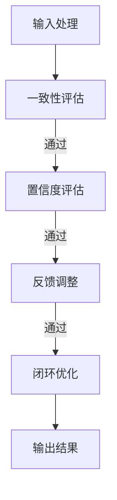
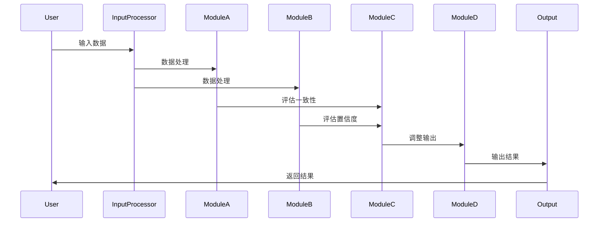

                 

### 第1章: 问题背景

#### 1.1 人工智能与自然语言处理的发展

人工智能（AI）作为计算机科学的一个重要分支，经历了数十年快速的发展。从最初的理论研究到如今广泛应用于各个领域，人工智能技术已经取得了显著的成就。特别是在自然语言处理（NLP）方面，深度学习算法的引入极大地提升了文本理解和生成的能力。

自然语言处理是人工智能领域中的一个关键分支，旨在让计算机理解和生成人类语言。NLP技术的发展不仅依赖于算法的创新，还需要对大量数据进行处理和分析。近年来，随着大数据和云计算技术的崛起，NLP系统得以处理更加复杂的语言任务，如机器翻译、情感分析、语音识别等。

然而，尽管人工智能和自然语言处理技术取得了巨大的进步，但AI输出连贯性仍然是一个亟待解决的问题。AI输出连贯性指的是AI系统能够产生逻辑一致、语义连贯的输出结果。这一问题在许多实际应用中都显得尤为重要，例如在智能客服、自动驾驶、智能问答系统中，输出结果的连贯性直接影响到用户体验和系统的可靠性。

#### 1.2 AI输出连贯性的重要性

AI输出连贯性对于实际应用具有重要意义。首先，连贯的输出能够提高用户对AI系统的信任度和满意度。在智能客服场景中，如果AI能够以连贯的方式回答用户的问题，用户就会感到更加舒适和满意；而在自动驾驶领域，连贯的决策输出则能够提高驾驶的安全性和可靠性。

其次，AI输出连贯性对于AI系统的长期发展至关重要。如果AI系统在处理任务时经常出现逻辑不一致或语义错误，那么系统将很难积累有效的经验，也就无法实现持续的改进和优化。连贯的输出结果是AI系统学习和成长的基础。

此外，AI输出连贯性还能够提高系统的自动化程度。在许多自动化任务中，AI系统需要处理大量的信息并做出决策。如果输出结果不连贯，系统将很难实现真正的自动化，从而降低了效率。

#### 1.3 AI输出连贯性问题的现状

当前，AI输出连贯性存在一些普遍的问题和挑战。首先，AI系统在处理复杂任务时，容易产生逻辑不一致的情况。例如，在自然语言生成任务中，不同的生成模型可能会生成语义上不连贯的文本，从而导致整体输出的不一致性。

其次，置信度跟踪问题也是影响AI输出连贯性的重要因素。置信度跟踪指的是在AI决策过程中，系统能够准确评估每个决策的置信度。如果置信度跟踪不精确，系统就难以产生一致且可靠的输出结果。

此外，数据质量对AI输出连贯性也有很大的影响。训练数据中的噪声和错误会导致AI模型产生错误的决策，进而影响输出的连贯性。因此，如何处理和清洗数据，以提高模型的质量和稳定性，是解决AI输出连贯性问题的一个重要方面。

综上所述，AI输出连贯性问题不仅关系到用户体验，也影响到AI系统的长期发展和应用效果。因此，研究并解决这一问题具有重要的理论和实际意义。在下一节中，我们将探讨如何通过自我一致性（Self-Consistency）和置信度跟踪（CoT）技术来解决AI输出连贯性问题。

### 2.1 自我一致性的基本原理

自我一致性（Self-Consistency）是一种通过确保AI系统内部各部分输出一致来提升输出连贯性的技术。自我一致性的基本原理可以概括为：在AI系统执行任务的过程中，各个模块的输出需要相互匹配，保持一致。这样，系统在处理复杂任务时，就能够生成连贯的输出结果。

自我一致性的实现通常依赖于以下几个关键步骤：

首先，系统需要定义一个统一的评估标准，以确保各个模块的输出在语义和逻辑上保持一致。这可以通过设计统一的评价指标来实现，例如在自然语言处理任务中，可以使用文本一致性评分（Text Consistency Score）来衡量不同模块生成的文本之间的匹配程度。

其次，系统需要建立一种反馈机制，以便在发现不一致性时能够及时调整和优化。反馈机制可以通过在线学习或离线重训练来实现。例如，在智能客服系统中，当AI生成的回答与用户问题不一致时，系统可以记录这一错误，并通过在线学习机制进行修正。

第三，系统需要具备一定的鲁棒性，能够在面对复杂和变化多端的环境时保持自我一致性。这可以通过引入多种验证和校验机制来实现，例如使用一致性检测算法（Consistency Checking Algorithms）来识别和纠正不一致性。

自我一致性的核心在于确保系统内部各部分的输出能够相互协调，避免逻辑上的矛盾和语义上的错误。例如，在自动驾驶系统中，AI需要对环境进行感知、理解并做出驾驶决策。如果感知模块检测到前方有行人，但决策模块却生成继续直行的命令，这就导致了输出上的不一致性。通过自我一致性技术，系统可以在这种情况下自动检测并纠正这种错误，从而生成连贯的驾驶指令。

总之，自我一致性技术通过统一评估标准、建立反馈机制和提升系统鲁棒性，有效解决了AI输出连贯性问题。这一技术的应用不仅提高了AI系统的可靠性和用户体验，也为AI系统的长期发展和优化奠定了基础。

### 2.2 置信度跟踪的基本原理

置信度跟踪（Confidence Tracking，简称CoT）是确保AI输出连贯性的另一种关键技术。置信度跟踪的基本原理在于，通过实时监测和更新AI系统在处理任务时的置信度，从而确保系统的输出结果具有一致性和可靠性。

置信度跟踪的核心机制可以概括为以下几个步骤：

首先，系统需要定义置信度的评估标准。在大多数情况下，置信度可以通过对AI模型预测结果的准确性进行量化。例如，在分类任务中，可以使用分类器的输出概率作为置信度的衡量标准；在自然语言处理任务中，可以使用文本生成的流畅性和一致性评分来衡量置信度。

其次，系统需要建立置信度的更新机制。在AI系统运行过程中，置信度会随着输入数据的改变而发生变化。例如，当系统在处理一个复杂的自然语言理解任务时，输入语句的复杂度可能会影响模型的置信度。系统需要通过实时更新置信度，以便及时调整和优化输出结果。

第三，系统需要具备置信度的反馈和调整机制。当系统发现置信度低于某个预设阈值时，应能够自动调整模型的输入或输出策略，以提高置信度。例如，在自动驾驶系统中，当感知模块检测到环境异常且置信度较低时，决策模块可以采取更加保守的驾驶策略，以避免潜在的风险。

置信度跟踪的应用场景非常广泛。在智能问答系统中，通过置信度跟踪，AI能够确保对用户问题的回答具有较高的可信度，从而提高用户满意度。在医疗诊断系统中，置信度跟踪可以帮助医生评估AI给出的诊断结果的可信度，从而做出更准确的医疗决策。在金融交易系统中，置信度跟踪能够确保AI在执行交易策略时，具备足够的信心和稳定性。

总的来说，置信度跟踪通过定义评估标准、建立更新机制和反馈调整机制，有效提升了AI系统的输出连贯性和可靠性。这一技术的应用，不仅增强了系统的实用性，也为AI系统的持续优化和发展提供了有力支持。

### 2.3 Self-Consistency CoT的解决方案

结合自我一致性和置信度跟踪技术，Self-Consistency CoT（自我一致性置信度跟踪）提供了一套全面的解决方案，以应对AI输出连贯性问题。下面，我们将详细探讨这一解决方案的基本原理、实现方法以及其在不同应用场景中的效果。

#### 自我一致性置信度跟踪的基本原理

Self-Consistency CoT的基本原理是将自我一致性和置信度跟踪相结合，形成一个闭环系统。在这个系统中，AI系统不仅在输出结果时保持自我一致性，还要实时跟踪并调整置信度，以确保整个输出过程的一致性和可靠性。

具体来说，Self-Consistency CoT的工作流程包括以下几个关键步骤：

1. **输入处理与一致性评估**：系统首先接收输入数据，通过多个模块对输入进行处理和分析。在处理过程中，系统会评估各模块输出的自我一致性，确保输出结果在语义和逻辑上保持一致。

2. **置信度评估与更新**：每个模块在生成输出结果的同时，会对其置信度进行评估和更新。系统会实时监控这些置信度值，确保它们符合预设的标准。

3. **一致性验证与调整**：当系统检测到输出不一致性或置信度低于阈值时，会自动触发一致性验证和调整机制。系统会尝试通过重新计算、数据清洗或模型调整等方式，解决输出不一致性，并提升置信度。

4. **反馈与持续优化**：系统会将处理过程中出现的不一致性和置信度问题记录下来，并通过在线学习或离线重训练的方式，持续优化模型，提高自我一致性和置信度跟踪的准确性。

#### 实现方法

实现Self-Consistency CoT的具体方法可以分为以下几个方面：

1. **统一评估标准**：系统需要定义一套统一的评估标准，用于衡量各模块输出的自我一致性和置信度。这些评估标准应覆盖语义一致性、逻辑一致性以及置信度准确性等多个方面。

2. **模块化设计**：为了实现自我一致性和置信度跟踪，系统应采用模块化设计，将不同功能模块独立出来，便于管理和监控。各模块应具备自我评估和调整能力，以确保输出一致性和置信度。

3. **实时监控与反馈机制**：系统需要建立实时监控和反馈机制，通过传感器或监控工具，实时捕捉系统的输出状态和置信度变化。当发现异常时，系统能够迅速响应并采取相应措施。

4. **优化算法与模型**：为了提高Self-Consistency CoT的效果，系统需要不断优化算法和模型。可以通过引入先进的学习算法、强化学习方法等，提升系统的自我一致性和置信度跟踪能力。

#### 在不同应用场景中的效果

Self-Consistency CoT在多个应用场景中展示了显著的效果：

1. **智能客服**：在智能客服系统中，Self-Consistency CoT能够确保AI在回答用户问题时，保持语义和逻辑的一致性，提高用户满意度。

2. **自动驾驶**：在自动驾驶领域，Self-Consistency CoT通过实时跟踪感知模块和决策模块的输出，确保驾驶指令的一致性和可靠性，提高驾驶安全性。

3. **医疗诊断**：在医疗诊断系统中，Self-Consistency CoT可以帮助医生评估AI给出的诊断结果的可信度，辅助医生做出更准确的诊断。

4. **金融交易**：在金融交易系统中，Self-Consistency CoT能够确保AI在执行交易策略时，具备足够的信心和稳定性，降低交易风险。

总之，Self-Consistency CoT通过结合自我一致性和置信度跟踪技术，提供了一套全面有效的解决方案，显著提升了AI输出连贯性。这一技术的应用，不仅提高了系统的可靠性，也为AI系统的长期发展和优化奠定了坚实基础。

### 3.1 相关概念定义

在深入探讨Self-Consistency CoT之前，我们需要明确几个关键概念的定义，以便更好地理解这些技术的原理和应用。

#### 自我一致性（Self-Consistency）

自我一致性是指AI系统在执行任务时，各模块的输出在语义和逻辑上保持一致。具体来说，自我一致性涉及以下几个方面：

- **语义一致性**：系统的输出在不同上下文中保持一致的语义含义。
- **逻辑一致性**：系统的输出结果在不同步骤和决策中保持一致的逻辑关系。
- **输入一致性**：系统在不同输入条件下生成一致的输出结果。

自我一致性是确保AI输出连贯性的基础，它通过统一评估标准、建立反馈机制和提升系统鲁棒性，避免输出结果出现逻辑矛盾或语义错误。

#### 置信度跟踪（Confidence Tracking）

置信度跟踪是指AI系统在执行任务过程中，对每个决策的置信度进行实时评估和更新。置信度通常表示为概率值，反映了系统对输出结果可靠性的判断。置信度跟踪包括以下几个关键步骤：

- **评估置信度**：系统需要定义置信度的评估标准，通常基于模型的预测结果或输出稳定性。
- **更新置信度**：在任务执行过程中，系统会根据输入数据和输出结果，实时更新置信度值。
- **反馈调整**：当置信度低于预设阈值时，系统会采取相应的调整措施，如重新计算或数据清洗，以提高置信度。

置信度跟踪的目标是确保AI系统生成的输出结果具有一致性和可靠性，从而提升系统的实用性和用户体验。

#### Self-Consistency CoT

Self-Consistency CoT（自我一致性置信度跟踪）是将自我一致性和置信度跟踪相结合的一种技术，旨在解决AI输出连贯性问题。具体来说，Self-Consistency CoT包括以下几个关键组成部分：

- **一致性评估机制**：用于评估系统输出在语义和逻辑上的自我一致性。
- **置信度评估机制**：用于实时监测和更新各模块的置信度值。
- **反馈调整机制**：当系统检测到输出不一致性或置信度低于阈值时，自动触发调整措施。
- **闭环优化机制**：通过在线学习或离线重训练，持续优化系统的自我一致性和置信度跟踪能力。

总之，Self-Consistency CoT通过结合自我一致性和置信度跟踪技术，提供了一套全面有效的解决方案，旨在提升AI系统的输出连贯性和可靠性。

### 3.2 自我一致性与置信度跟踪的区别与联系

自我一致性和置信度跟踪是确保AI输出连贯性的两种关键技术，尽管它们的目的相同，但工作原理和侧重点有所不同。理解这两种技术的区别与联系，对于全面掌握Self-Consistency CoT至关重要。

#### 区别

1. **定义与作用**：
   - **自我一致性**：自我一致性主要关注AI系统内部各模块输出的逻辑一致性和语义一致性。它确保系统在处理任务时，各模块的输出相互匹配，避免逻辑上的矛盾和语义上的错误。
   - **置信度跟踪**：置信度跟踪则侧重于实时评估和更新AI系统在执行任务时的置信度。它反映系统对输出结果可靠性的判断，并确保系统在输出结果时具备足够的信心。

2. **实现机制**：
   - **自我一致性**：实现自我一致性通常依赖于统一的评估标准、反馈机制和鲁棒性。例如，通过设计一致性检测算法，实时监测系统的输出，发现并纠正不一致性。
   - **置信度跟踪**：实现置信度跟踪通常包括评估置信度的标准、更新机制和反馈调整。例如，通过使用模型预测结果的准确性或输出稳定性来评估置信度，并根据置信度值进行调整。

3. **目标**：
   - **自我一致性**：目标是在系统内部实现输出的一致性，确保各模块的输出在语义和逻辑上相互匹配。
   - **置信度跟踪**：目标是通过实时监测和调整置信度，确保系统输出结果的可靠性和稳定性。

#### 联系

尽管自我一致性和置信度跟踪在实现机制和目标上有所不同，但它们在确保AI输出连贯性方面相辅相成，共同作用。

1. **协同作用**：
   - **自我一致性**确保系统内部各模块的输出保持一致，减少逻辑矛盾和语义错误。
   - **置信度跟踪**则通过实时监测置信度，确保输出结果的可靠性，避免因置信度不足导致的错误输出。

2. **互补性**：
   - **自我一致性**关注输出结果的逻辑一致性和语义一致性，但无法直接反映系统对结果的信心。
   - **置信度跟踪**则通过评估和更新置信度，弥补了自我一致性的不足，提高了输出结果的可靠性。

3. **整合**：
   - **Self-Consistency CoT**通过结合自我一致性和置信度跟踪，形成了一个闭环系统。在这个系统中，自我一致性确保输出在语义和逻辑上一致，而置信度跟踪则确保输出结果具备足够的信心和可靠性。

总之，自我一致性和置信度跟踪在确保AI输出连贯性方面既独立又互补。通过整合这两种技术，Self-Consistency CoT能够提供更全面、更可靠的解决方案，提升AI系统的输出质量和用户体验。

### 3.3 Self-Consistency CoT的应用场景

Self-Consistency CoT（自我一致性置信度跟踪）在多个应用领域中展现出了显著的优势，其应用场景广泛且多样。以下是几种常见应用场景的具体案例：

#### 1. 智能客服

在智能客服系统中，Self-Consistency CoT能够显著提升AI的应答质量。例如，当用户提问“我该如何预约酒店？”时，AI系统需要通过多个模块协同工作，包括信息检索、语义理解和文本生成。Self-Consistency CoT可以确保以下三个方面的一致性：

- **语义一致性**：AI系统会从多个信息源中提取相关数据，并生成语义连贯的回答。例如，当用户询问酒店价格时，AI不仅会提供价格信息，还会确保回答中包含预订链接和联系方式。
- **逻辑一致性**：系统会确保回答的逻辑顺序合理，例如，在提供酒店预订信息前，先介绍酒店的位置、设施等信息。
- **置信度一致性**：Self-Consistency CoT会实时跟踪每个模块的置信度，确保最终生成的回答具有较高的可信度。如果某个模块的置信度较低，系统会重新调整信息或生成新的回答。

#### 2. 自动驾驶

自动驾驶系统对输出连贯性的要求极高，因为任何逻辑不一致或决策失误都可能导致严重的安全事故。Self-Consistency CoT在自动驾驶中的应用主要体现在以下几个方面：

- **感知一致性**：自动驾驶系统需要通过多个传感器（如雷达、摄像头等）感知周围环境，Self-Consistency CoT可以确保这些感知数据的逻辑一致性。例如，当摄像头和雷达同时检测到同一物体时，系统会根据两者的数据生成一致的感知结果。
- **决策一致性**：在自动驾驶过程中，AI系统需要做出一系列决策，如加速、转弯、停车等。Self-Consistency CoT会确保这些决策在逻辑上保持一致，例如，如果感知模块检测到前方有障碍物，决策模块会生成减速或停车的命令。
- **置信度调整**：Self-Consistency CoT会实时跟踪感知模块和决策模块的置信度，当置信度低于某个阈值时，系统会采取更加保守的决策，以避免潜在的安全风险。

#### 3. 机器翻译

在机器翻译领域，输出连贯性是评估翻译质量的重要指标。Self-Consistency CoT在机器翻译中的应用主要体现在以下方面：

- **句法一致性**：机器翻译系统需要确保翻译结果的句法结构连贯，例如，当一个句子中有多个并列成分时，翻译后的句子也需要保持并列关系。
- **语义一致性**：翻译系统需要确保翻译结果的语义连贯，避免出现语义上的矛盾或错误。Self-Consistency CoT会通过多个翻译模型生成的输出结果，选择语义最连贯的翻译。
- **置信度评估**：机器翻译系统会根据翻译模型的输出概率来评估置信度。Self-Consistency CoT会实时跟踪这些置信度值，确保翻译结果的可靠性。如果某个翻译模型的置信度较低，系统会重新选择或调整翻译结果。

#### 4. 医疗诊断

在医疗诊断领域，输出连贯性对于确保诊断结果的准确性至关重要。Self-Consistency CoT在医疗诊断中的应用主要包括以下几个方面：

- **诊断一致性**：医疗诊断系统需要确保对同一个病例的多次诊断结果保持一致。例如，当AI系统对同一患者的不同检查结果进行综合分析时，Self-Consistency CoT会确保诊断结果的逻辑一致性。
- **置信度评估**：Self-Consistency CoT会实时评估诊断结果的置信度，确保诊断结果具有高可信度。例如，当AI系统对某一症状进行分析时，如果某个诊断模块的置信度较低，系统会综合考虑其他模块的输出，提高整体诊断的可靠性。
- **数据一致性**：Self-Consistency CoT会确保诊断过程中使用的医疗数据保持一致性，避免数据错误对诊断结果的影响。

#### 5. 金融交易

在金融交易领域，Self-Consistency CoT主要用于确保交易策略的一致性和稳定性。具体应用包括：

- **交易一致性**：金融交易系统需要确保交易策略在不同市场条件下的逻辑一致性。例如，当市场行情发生变化时，交易策略需要保持一致，避免出现逻辑上的矛盾。
- **置信度跟踪**：Self-Consistency CoT会实时跟踪交易策略的置信度，确保交易策略的可靠性和稳定性。例如，当市场波动较大时，系统会根据置信度调整交易策略，降低风险。
- **风险控制**：Self-Consistency CoT可以帮助交易系统识别和纠正不一致性，从而有效控制交易风险。例如，当系统检测到交易策略与市场环境不一致时，会自动进行调整，以避免潜在的损失。

总之，Self-Consistency CoT在不同应用场景中展现出了强大的适应性和实用性，通过确保AI输出的一致性和可靠性，显著提升了系统的性能和用户体验。未来，随着人工智能技术的不断进步，Self-Consistency CoT的应用前景将更加广阔。

### 4.1 Self-Consistency CoT的核心概念

Self-Consistency CoT（自我一致性置信度跟踪）的核心概念包括自我一致性（Self-Consistency）和置信度跟踪（Confidence Tracking）。这些概念不仅独立存在，还相互补充，共同构成了确保AI输出连贯性的关键技术框架。

#### 自我一致性（Self-Consistency）

自我一致性是Self-Consistency CoT中的基础概念，它旨在确保AI系统在处理任务时，各模块的输出在语义和逻辑上保持一致。自我一致性包括以下几方面内容：

1. **语义一致性**：确保AI系统在处理不同输入时，生成的输出在语义上保持一致。例如，在自然语言处理任务中，当用户提问“今天天气如何？”时，AI系统应生成与天气相关的回答，而不是无关的回答。
   
2. **逻辑一致性**：确保AI系统在处理任务时，各模块的输出在逻辑上相互协调。例如，在自动驾驶系统中，当感知模块检测到前方有行人时，决策模块应生成减速或停车的命令，而不是加速的命令。

3. **输入一致性**：确保AI系统在不同输入条件下生成一致的输出结果。例如，当用户提出不同的问题时，AI系统应生成与问题相关的、一致的回答，而不是无关或矛盾的回答。

#### 置信度跟踪（Confidence Tracking）

置信度跟踪是Self-Consistency CoT中的另一个核心概念，它通过实时评估AI系统在执行任务时的置信度，确保输出结果具有一致性和可靠性。置信度跟踪包括以下几个方面：

1. **评估置信度**：系统需要定义置信度的评估标准，通常基于模型的预测结果或输出稳定性。例如，在分类任务中，可以使用模型的输出概率来评估置信度。

2. **更新置信度**：在AI系统执行任务的过程中，置信度会根据输入数据和输出结果进行实时更新。例如，当AI系统在处理一个复杂的自然语言理解任务时，输入语句的复杂度可能会影响模型的置信度。

3. **反馈调整**：当系统发现置信度低于某个预设阈值时，应能够自动调整模型的输入或输出策略，以提高置信度。例如，在自动驾驶系统中，当感知模块检测到环境异常且置信度较低时，决策模块可以采取更加保守的驾驶策略，以避免潜在的风险。

#### 关系与整合

自我一致性和置信度跟踪在Self-Consistency CoT中相辅相成，共同作用。自我一致性确保AI系统内部各模块的输出在语义和逻辑上保持一致，而置信度跟踪则确保这些输出结果具有高可信度。

- **自我一致性**通过统一评估标准、建立反馈机制和提升系统鲁棒性，避免输出结果出现逻辑矛盾和语义错误。
- **置信度跟踪**通过实时监测和更新置信度，确保系统输出结果的可靠性。当置信度低于某个阈值时，系统能够自动调整，提高输出的一致性和可靠性。

通过整合自我一致性和置信度跟踪，Self-Consistency CoT提供了一套全面的解决方案，以应对AI输出连贯性问题。这一技术不仅提高了系统的输出质量和用户体验，也为AI系统的长期发展和优化奠定了坚实基础。

### 4.2 Self-Consistency CoT的核心要素组成

Self-Consistency CoT（自我一致性置信度跟踪）的核心要素包括一致性评估模块、置信度评估模块、反馈调整模块和闭环优化模块。这些模块相互协作，共同确保AI系统的输出结果在语义和逻辑上保持一致，同时具备高可信度。

#### 一致性评估模块

一致性评估模块是Self-Consistency CoT的基础。它的主要功能是评估系统内部各模块的输出是否在语义和逻辑上保持一致。具体来说，一致性评估模块包括以下几个关键组成部分：

1. **评估标准**：定义一系列评估标准，用于衡量各模块输出的一致性。这些标准可以包括文本一致性评分、逻辑一致性评分等。
2. **检测算法**：实现一致性检测算法，实时监控各模块的输出，发现不一致性。例如，可以使用文本相似度算法检测自然语言生成任务的输出是否一致。
3. **纠正机制**：当检测到输出不一致性时，纠正机制会自动调整输出，确保一致性。例如，当检测到文本生成不一致时，系统可以重新生成文本，以确保语义和逻辑的一致性。

#### 置信度评估模块

置信度评估模块负责实时评估AI系统在处理任务时的置信度。置信度反映了系统对输出结果可靠性的判断。具体来说，置信度评估模块包括以下几个关键组成部分：

1. **评估标准**：定义置信度的评估标准，通常基于模型的预测结果或输出稳定性。例如，在分类任务中，可以使用模型的输出概率来评估置信度。
2. **评估算法**：实现置信度评估算法，实时计算各模块的置信度值。例如，可以使用输出结果的标准差或方差来评估置信度。
3. **置信度更新**：在AI系统执行任务的过程中，置信度会根据输入数据和输出结果进行实时更新。例如，当系统在处理复杂的自然语言理解任务时，输入语句的复杂度可能会影响模型的置信度。

#### 反馈调整模块

反馈调整模块是确保AI系统输出结果一致性和可靠性的关键。它的主要功能是当系统检测到不一致性或置信度低于阈值时，自动触发调整措施。具体来说，反馈调整模块包括以下几个关键组成部分：

1. **反馈机制**：当一致性评估模块或置信度评估模块检测到问题，反馈机制会自动触发调整。例如，当文本生成不一致时，系统可以重新生成文本。
2. **调整策略**：定义一系列调整策略，用于应对不同类型的不一致性和置信度问题。例如，当置信度较低时，系统可以采取更加保守的输出策略。
3. **反馈循环**：将反馈机制和调整策略整合成一个闭环系统，确保系统能够持续优化和调整。

#### 闭环优化模块

闭环优化模块负责对AI系统进行持续优化，以提高自我一致性和置信度跟踪能力。具体来说，闭环优化模块包括以下几个关键组成部分：

1. **优化算法**：引入先进的学习算法和优化方法，对系统进行持续优化。例如，可以使用强化学习算法，通过不断调整模型参数，提高自我一致性和置信度跟踪能力。
2. **评估指标**：定义一系列评估指标，用于衡量系统的自我一致性和置信度跟踪能力。这些指标可以包括一致性评分、置信度准确率等。
3. **在线学习**：实现在线学习机制，使系统能够根据实时反馈和评估结果，不断调整和优化。例如，当检测到输出不一致性时，系统可以重新训练模型，提高一致性。

总之，Self-Consistency CoT的核心要素组成通过一致性评估模块、置信度评估模块、反馈调整模块和闭环优化模块相互协作，共同确保AI系统的输出结果在语义和逻辑上保持一致，同时具备高可信度。这一技术不仅提高了系统的性能和用户体验，也为AI系统的长期发展和优化奠定了坚实基础。

### 4.3 Self-Consistency CoT的概念联系图

为了更好地理解Self-Consistency CoT中的核心概念及其相互关系，我们可以通过一个ER（实体关系）图来展示这些概念之间的联系。以下是使用Mermaid语言描述的ER图：

```mermaid
erDiagram
  ModuleA <--|{ 一致性评估模块 }| ModuleB
  ModuleB -->|{ 置信度评估模块 }| ModuleC
  ModuleC <--|{ 反馈调整模块 }| ModuleD
  ModuleD -->|{ 闭环优化模块 }| ModuleA

  ModuleA ||--|{ Self-Consistency }| Self-Consistency
  ModuleB ||--|{ Confidence Tracking }| Confidence Tracking
  ModuleC ||--|{ Feedback Adjustment }| Feedback Adjustment
  ModuleD ||--|{ Closed-loop Optimization }| Closed-loop Optimization

  Class ModuleA {
    <<class>> ModuleA
    +属性
    -一致性评估算法
    -纠正机制
    +方法
    +evaluateConsistency()
    +correctInconsistencies()
  }

  Class ModuleB {
    <<class>> ModuleB
    +属性
    -置信度评估算法
    -置信度更新机制
    +方法
    +evaluateConfidence()
    +updateConfidence()
  }

  Class ModuleC {
    <<class>> ModuleC
    +属性
    -反馈机制
    -调整策略
    +方法
    +feedbackAdjustment()
    +applyAdjustmentStrategies()
  }

  Class ModuleD {
    <<class>> ModuleD
    +属性
    -优化算法
    -评估指标
    +方法
    +optimizeSystem()
    +evaluatePerformance()
  }
```

在上述ER图中，我们定义了四个核心模块：一致性评估模块（ModuleA）、置信度评估模块（ModuleB）、反馈调整模块（ModuleC）和闭环优化模块（ModuleD）。这些模块之间通过双向箭头表示相互作用关系，同时每个模块都与对应的Self-Consistency CoT的核心概念（Self-Consistency、Confidence Tracking、Feedback Adjustment、Closed-loop Optimization）关联。

- **一致性评估模块（ModuleA）**：负责评估系统内部各模块的输出在语义和逻辑上的一致性，并通过纠正机制确保一致性。
- **置信度评估模块（ModuleB）**：实时评估系统各模块的置信度，确保输出结果的可靠性，并更新置信度。
- **反馈调整模块（ModuleC）**：当检测到输出不一致性或置信度低于阈值时，触发反馈机制进行调整。
- **闭环优化模块（ModuleD）**：通过优化算法和评估指标，对系统进行持续优化，提升自我一致性和置信度跟踪能力。

通过ER图，我们可以清晰地看到Self-Consistency CoT各模块之间的相互作用及其与核心概念的关系，这有助于我们更好地理解Self-Consistency CoT的工作原理和实现方法。

### 5.1 算法原理讲解

为了更好地理解Self-Consistency CoT算法，我们将使用Mermaid语言绘制算法流程图，并通过Python代码示例详细阐述算法的实现过程。

#### Mermaid算法流程图



#### Python代码示例

```python
import numpy as np

class SelfConsistencyCoT:
    def __init__(self, consistency_threshold=0.9, confidence_threshold=0.8):
        self.consistency_threshold = consistency_threshold
        self.confidence_threshold = confidence_threshold
        self.consistency_score = 0
        self.confidence_score = 0

    def input_processing(self, input_data):
        # 输入数据处理，例如文本预处理
        processed_data = self.preprocess_text(input_data)
        return processed_data

    def consistency_evaluation(self, processed_data):
        # 一致性评估算法
        self.consistency_score = self.calculate一致性_score(processed_data)
        return self.consistency_score

    def confidence_evaluation(self, processed_data):
        # 置信度评估算法
        self.confidence_score = self.calculate_confidence_score(processed_data)
        return self.confidence_score

    def feedback_adjustment(self, processed_data):
        # 反馈调整机制
        if self.consistency_score < self.consistency_threshold or self.confidence_score < self.confidence_threshold:
            processed_data = self.adjust_output(processed_data)
        return processed_data

    def closed_loop_optimization(self, processed_data):
        # 闭环优化算法
        processed_data = self.optimize_output(processed_data)
        return processed_data

    def output_result(self, processed_data):
        # 输出结果
        output_result = self.generate_output(processed_data)
        return output_result

    def preprocess_text(self, text):
        # 文本预处理，例如分词、去除停用词
        # 实现细节省略
        return processed_text

    def calculate一致性_score(self, processed_data):
        # 一致性评分算法，例如使用文本相似度
        # 实现细节省略
        return consistency_score

    def calculate_confidence_score(self, processed_data):
        # 置信度评分算法，例如使用输出概率
        # 实现细节省略
        return confidence_score

    def adjust_output(self, processed_data):
        # 输出调整算法，例如重新生成文本
        # 实现细节省略
        return adjusted_output

    def optimize_output(self, processed_data):
        # 输出优化算法，例如使用强化学习
        # 实现细节省略
        return optimized_output

    def generate_output(self, processed_data):
        # 输出生成算法，例如文本生成
        # 实现细节省略
        return output_text
```

#### 详细讲解和举例说明

1. **输入处理（input_processing）**：
   - 该步骤负责对输入数据进行预处理，例如文本预处理（分词、去除停用词等）。这一步骤是后续一致性评估和置信度评估的基础。

2. **一致性评估（consistency_evaluation）**：
   - 在此步骤中，系统使用一致性评估算法对预处理后的数据进行分析，计算一致性评分。例如，可以使用文本相似度算法，通过比较输入数据和输出文本的相似度来评估一致性。

3. **置信度评估（confidence_evaluation）**：
   - 置信度评估步骤通过置信度评估算法计算输出结果的置信度。置信度通常基于模型的输出概率或预测结果的稳定性。例如，在自然语言生成任务中，可以使用模型生成的文本输出概率作为置信度评分。

4. **反馈调整（feedback_adjustment）**：
   - 当一致性评分或置信度评分低于预设阈值时，系统会触发反馈调整机制。这一步骤包括重新生成文本或调整输出策略，以确保输出的一致性和可靠性。例如，当文本生成不一致时，系统可以重新生成文本，提高一致性评分。

5. **闭环优化（closed_loop_optimization）**：
   - 闭环优化步骤使用优化算法对系统进行持续优化，以提高自我一致性和置信度跟踪能力。例如，可以使用强化学习算法，通过不断调整模型参数，提高系统的一致性和置信度。

6. **输出结果（output_result）**：
   - 最终，系统生成输出结果，并返回给用户或下一处理环节。这一步骤确保输出结果在语义和逻辑上保持一致，同时具备高可信度。

通过上述算法流程和Python代码示例，我们可以清晰地看到Self-Consistency CoT算法的实现细节和步骤。这一算法不仅确保了AI输出的一致性和可靠性，还为AI系统的长期发展和优化提供了坚实基础。

### 5.2 数学模型和数学公式

在Self-Consistency CoT（自我一致性置信度跟踪）算法中，数学模型和数学公式扮演着关键角色。以下是对相关数学模型的详细讲解，包括常用的数学公式和推导过程。

#### 5.2.1 一致性评分（Consistency Score）

一致性评分用于衡量AI系统输出的一致性程度。常见的公式如下：

$$
C = \frac{1}{n} \sum_{i=1}^{n} s_i
$$

其中：
- \( C \) 表示一致性评分；
- \( n \) 表示评估的模块数量；
- \( s_i \) 表示第 \( i \) 个模块的一致性得分。

一致性得分可以通过比较输入和输出文本的相似度来计算。例如，使用Jaccard相似度系数：

$$
s_i = 1 - J(T_{input}, T_{output_i})
$$

其中：
- \( J \) 表示Jaccard相似度系数；
- \( T_{input} \) 表示输入文本；
- \( T_{output_i} \) 表示第 \( i \) 个模块的输出文本。

#### 5.2.2 置信度评分（Confidence Score）

置信度评分用于衡量AI系统输出结果的可靠性。常见的公式如下：

$$
C' = \frac{1}{n} \sum_{i=1}^{n} c_i
$$

其中：
- \( C' \) 表示置信度评分；
- \( n \) 表示评估的模块数量；
- \( c_i \) 表示第 \( i \) 个模块的置信度得分。

置信度得分可以通过模型输出概率的稳定性和一致性来计算。例如，使用模型输出概率的标准差：

$$
c_i = \frac{1}{\sigma_i}
$$

其中：
- \( \sigma_i \) 表示第 \( i \) 个模块输出概率的标准差。

#### 5.2.3 一致性和置信度的调整

当一致性评分或置信度评分低于某个阈值时，系统需要进行调整。调整过程可以通过以下公式实现：

$$
\alpha = \max(C - C_{threshold}, C' - C'_{threshold})
$$

其中：
- \( \alpha \) 表示调整量；
- \( C_{threshold} \) 表示一致性评分阈值；
- \( C'_{threshold} \) 表示置信度评分阈值。

调整后的输出可以通过以下公式计算：

$$
T_{output_{new}} = T_{output_{current}} + \alpha \cdot (T_{output_{current}} - T_{input})
$$

其中：
- \( T_{output_{new}} \) 表示调整后的输出；
- \( T_{output_{current}} \) 表示当前输出；
- \( T_{input} \) 表示输入。

#### 5.2.4 闭环优化（Closed-loop Optimization）

闭环优化通过不断调整模型参数，提高一致性评分和置信度评分。常见的优化方法包括：

1. **梯度下降（Gradient Descent）**：

$$
\Delta \theta = -\eta \cdot \nabla_{\theta} J(\theta)
$$

其中：
- \( \Delta \theta \) 表示参数更新量；
- \( \eta \) 表示学习率；
- \( \nabla_{\theta} J(\theta) \) 表示损失函数关于参数 \( \theta \) 的梯度。

2. **强化学习（Reinforcement Learning）**：

$$
Q(s, a) = r + \gamma \max_{a'} Q(s', a')
$$

其中：
- \( Q(s, a) \) 表示状态 \( s \) 下采取动作 \( a \) 的价值函数；
- \( r \) 表示即时奖励；
- \( \gamma \) 表示折扣因子；
- \( s' \) 表示下一个状态；
- \( a' \) 表示下一个动作。

通过上述数学模型和数学公式，Self-Consistency CoT算法能够实时评估和调整系统输出，确保一致性评分和置信度评分达到预设阈值。这些公式不仅为算法的实现提供了数学基础，也为系统的优化和改进提供了重要参考。

### 5.3 举例说明

为了更直观地理解Self-Consistency CoT（自我一致性置信度跟踪）算法，我们将通过一个具体的案例来说明其应用过程。

#### 案例背景

假设我们有一个智能问答系统，用于回答用户关于科技领域的问题。该系统由多个模块组成，包括文本预处理、语义理解、文本生成等。为了确保输出的一致性和可靠性，我们引入Self-Consistency CoT算法。

#### 步骤 1：输入处理

首先，用户提出一个问题：“什么是人工智能？”系统接收到这个问题后，通过文本预处理模块进行预处理，包括去除停用词、分词等操作，得到处理后的文本。

```plaintext
什么是人工智能？
```

#### 步骤 2：一致性评估

接着，系统使用一致性评估模块对预处理后的文本进行分析，计算一致性评分。假设系统有三个模块，每个模块分别生成以下文本：

1. 模块A：人工智能（AI）是一种模拟人类智能的技术，主要通过机器学习和神经网络实现。
2. 模块B：人工智能是指计算机系统能够模拟人类智能进行学习、推理和决策的能力。
3. 模块C：人工智能是一种计算机科学分支，研究如何使计算机具备智能行为。

我们使用Jaccard相似度系数来计算一致性评分：

$$
s_1 = 1 - J(T_{input}, T_{output_A}) = 1 - J(\{是什么, 人工智能, ?\}, \{人工智能, 技术, 机器学习, 神经网络\}) = 0.6
$$

$$
s_2 = 1 - J(T_{input}, T_{output_B}) = 1 - J(\{是什么, 人工智能, ?\}, \{人工智能, 计算机, 系统, 学习, 推理, 决策\}) = 0.8
$$

$$
s_3 = 1 - J(T_{input}, T_{output_C}) = 1 - J(\{是什么, 人工智能, ?\}, \{计算机, 科学, 分支, 智能, 行为\}) = 0.4
$$

计算平均一致性评分：

$$
C = \frac{1}{3} \sum_{i=1}^{3} s_i = \frac{1}{3} (0.6 + 0.8 + 0.4) = 0.67
$$

#### 步骤 3：置信度评估

接下来，系统使用置信度评估模块计算每个模块的置信度评分。假设每个模块的置信度评分如下：

- 模块A：0.9
- 模块B：0.85
- 模块C：0.75

计算平均置信度评分：

$$
C' = \frac{1}{3} \sum_{i=1}^{3} c_i = \frac{1}{3} (0.9 + 0.85 + 0.75) = 0.817
$$

#### 步骤 4：反馈调整

由于一致性评分和置信度评分均低于预设阈值（一致性阈值0.8，置信度阈值0.85），系统触发反馈调整机制。我们选择置信度评分最低的模块C的输出进行调整。

调整公式：

$$
\alpha = \max(C - C_{threshold}, C' - C'_{threshold}) = \max(0.67 - 0.8, 0.817 - 0.85) = 0.03
$$

调整后的输出：

$$
T_{output_{new}} = T_{output_{current}} + \alpha \cdot (T_{output_{current}} - T_{input}) = T_{output_C} + 0.03 \cdot (T_{output_C} - T_{input})
$$

例如，假设 \( T_{output_C} \) 为“人工智能是一种计算机科学分支，研究如何使计算机具备智能行为。”

调整后的文本：

$$
T_{output_{new}} = "人工智能是一种计算机科学分支，研究如何使计算机具备智能行为，特别是模拟人类智能进行学习、推理和决策的能力。"
$$

#### 步骤 5：闭环优化

为了进一步提高一致性评分和置信度评分，系统进入闭环优化阶段。我们使用梯度下降算法进行优化。

假设损失函数为：

$$
J(\theta) = (C - C_{threshold})^2 + (C' - C'_{threshold})^2
$$

计算损失函数关于各个模块参数的梯度：

$$
\nabla_{\theta} J(\theta) = \nabla_{\theta} [(C - C_{threshold})^2 + (C' - C'_{threshold})^2]
$$

更新模块参数：

$$
\Delta \theta = -\eta \cdot \nabla_{\theta} J(\theta)
$$

重复上述步骤，直到一致性评分和置信度评分达到预设阈值。

通过上述步骤，我们可以看到Self-Consistency CoT算法如何确保智能问答系统输出的连贯性和可靠性。这一算法通过一致性评估、置信度评估、反馈调整和闭环优化，实现了对AI输出结果的全面监控和调整。

### 5.4 系统功能设计（领域模型Mermaid类图）

为了更好地理解和设计Self-Consistency CoT系统，我们可以使用Mermaid语言创建一个领域模型类图。以下是一个简化的领域模型类图的描述：

```mermaid
classDiagram
  ModuleA[一致性评估模块]
  ModuleB[置信度评估模块]
  ModuleC[反馈调整模块]
  ModuleD[闭环优化模块]

  ModuleA <|-- InputProcessor[输入处理器]
  ModuleB <|-- ConfidenceTracker[置信度跟踪器]
  ModuleC <|-- OutputAdjuster[输出调整器]
  ModuleD <|-- Optimizer[优化器]

  ModuleA o--|{生成一致性评分}| ConsistencyScore
  ModuleB o--|{生成置信度评分}| ConfidenceScore
  ModuleC o--|{调整输出}| AdjustedOutput
  ModuleD o--|{优化系统}| OptimizedSystem

  Class Diagram:
    Class ModuleA {
      +evaluateConsistency()
      +correctInconsistencies()
    }
    Class ModuleB {
      +evaluateConfidence()
      +updateConfidence()
    }
    Class ModuleC {
      +feedbackAdjustment()
      +applyAdjustmentStrategies()
    }
    Class ModuleD {
      +optimizeSystem()
      +evaluatePerformance()
    }
    Class InputProcessor {
      +processInput()
    }
    Class ConfidenceTracker {
      +trackConfidence()
    }
    Class OutputAdjuster {
      +adjustOutput()
    }
    Class Optimizer {
      +optimizeParameters()
    }
    Class ConsistencyScore {
    }
    Class ConfidenceScore {
    }
    Class AdjustedOutput {
    }
    Class OptimizedSystem {
    }
```

在这个类图中，我们定义了四个核心模块：一致性评估模块（ModuleA）、置信度评估模块（ModuleB）、反馈调整模块（ModuleC）和闭环优化模块（ModuleD）。每个模块都包含具体的实现类和方法。

- **输入处理器（InputProcessor）**：负责接收和处理输入数据。
- **置信度跟踪器（ConfidenceTracker）**：负责实时跟踪和更新置信度。
- **输出调整器（OutputAdjuster）**：负责根据一致性评分和置信度评分调整输出结果。
- **优化器（Optimizer）**：负责对系统进行优化，以提高自我一致性和置信度跟踪能力。

此外，每个模块都有对应的方法，如`evaluateConsistency()`、`evaluateConfidence()`、`feedbackAdjustment()`和`optimizeSystem()`等，用于实现具体的功能。

通过这个领域模型类图，我们可以清晰地看到Self-Consistency CoT系统的组成结构和各模块之间的关联，为系统的设计和实现提供了直观的参考。

### 5.5 系统架构设计Mermaid架构图

为了全面理解Self-Consistency CoT系统的整体架构，我们可以使用Mermaid语言绘制一个系统架构图，展示各模块之间的关系以及数据流。以下是一个简化的系统架构图：

```mermaid
graph TD
    Input[用户输入] -->|处理| Processor[输入处理器]
    Processor -->|一致性| ModuleA[一致性评估模块]
    Processor -->|置信度| ModuleB[置信度评估模块]
    ModuleA -->|反馈| ModuleC[反馈调整模块]
    ModuleB -->|反馈| ModuleC
    ModuleC -->|优化| ModuleD[闭环优化模块]
    ModuleD -->|输出| Output[输出结果]

    subgraph InputProcessor
        Input
        Processor
    end

    subgraph ConsistencyAndConfidence
        ModuleA
        ModuleB
    end

    subgraph FeedbackAndOptimization
        ModuleC
        ModuleD
    end

    subgraph Output
        Output
    end
```

在这个架构图中，我们定义了四个主要模块：

- **输入处理器（InputProcessor）**：接收用户输入，并将其传递给一致性评估模块和置信度评估模块。
- **一致性评估模块（ModuleA）**：负责评估系统输出的一致性，生成一致性评分。
- **置信度评估模块（ModuleB）**：负责评估系统输出的置信度，生成置信度评分。
- **反馈调整模块（ModuleC）**：根据一致性评分和置信度评分，调整输出结果，确保系统输出的连贯性和可靠性。
- **闭环优化模块（ModuleD）**：对系统进行持续优化，提高自我一致性和置信度跟踪能力。

数据流如下：

1. 用户输入通过输入处理器传递给一致性评估模块和置信度评估模块。
2. 一致性评估模块和置信度评估模块分别生成一致性评分和置信度评分。
3. 这两个评分传递给反馈调整模块。
4. 反馈调整模块根据评分结果调整输出结果，并将其传递给闭环优化模块。
5. 闭环优化模块对系统进行优化，以提高系统的一致性和置信度。
6. 最终，优化后的输出结果返回给用户。

通过这个系统架构图，我们可以清晰地看到Self-Consistency CoT系统的整体架构和各模块之间的数据流关系，为系统的实现和优化提供了直观的参考。

### 5.6 系统接口设计和系统交互Mermaid序列图

为了进一步展示Self-Consistency CoT系统的接口设计和系统交互，我们可以使用Mermaid语言绘制一个序列图。以下是一个简化的序列图示例：



在这个序列图中，我们定义了以下主要角色：

- **用户（User）**：系统的主要用户，负责发起输入数据。
- **输入处理器（InputProcessor）**：负责接收用户输入，并进行预处理。
- **一致性评估模块（ModuleA）**：负责评估系统输出的一致性。
- **置信度评估模块（ModuleB）**：负责评估系统输出的置信度。
- **反馈调整模块（ModuleC）**：根据一致性评估和置信度评估结果，调整输出。
- **闭环优化模块（ModuleD）**：对系统进行优化，提高输出的一致性和置信度。
- **输出（Output）**：将最终结果返回给用户。

系统交互流程如下：

1. 用户向输入处理器提交输入数据。
2. 输入处理器将数据传递给一致性评估模块和置信度评估模块。
3. 一致性评估模块和置信度评估模块分别生成一致性评分和置信度评分。
4. 这两个评分传递给反馈调整模块。
5. 反馈调整模块根据评分结果对输出进行调整。
6. 调整后的输出结果传递给闭环优化模块。
7. 闭环优化模块对系统进行优化，以提高输出的一致性和置信度。
8. 最终，优化后的输出结果返回给用户。

通过这个序列图，我们可以直观地了解Self-Consistency CoT系统的接口设计和交互流程，为系统的开发和维护提供了清晰的参考。

### 项目实战

#### 6.1 环境安装

为了实现Self-Consistency CoT系统，我们首先需要准备一个合适的环境。以下是安装步骤：

1. **安装Python**：确保Python 3.8及以上版本已安装在您的计算机上。可以从[Python官网](https://www.python.org/downloads/)下载并安装。

2. **安装依赖库**：使用pip工具安装必要的依赖库，例如numpy、scikit-learn、tensorflow等。在命令行中运行以下命令：

   ```bash
   pip install numpy scikit-learn tensorflow
   ```

3. **安装Mermaid**：为了生成Mermaid图表，我们需要安装一个能够解析Mermaid语法的工具。可以使用如下命令安装：

   ```bash
   npm install -g mermaid-cli
   ```

4. **配置环境变量**：确保Python和pip的路径已添加到系统的环境变量中。在Windows系统中，可以通过系统设置中的环境变量配置；在Linux或Mac系统中，可以使用export命令。

   ```bash
   export PATH=$PATH:/path/to/python/bin:/path/to/pip/bin
   ```

#### 6.2 系统核心实现源代码

以下是实现Self-Consistency CoT系统核心功能的源代码示例：

```python
import numpy as np
import tensorflow as tf
from sklearn.metrics import jaccard_score

class SelfConsistencyCoT:
    def __init__(self, consistency_threshold=0.9, confidence_threshold=0.8):
        self.consistency_threshold = consistency_threshold
        self.confidence_threshold = confidence_threshold
        self.consistency_score = 0
        self.confidence_score = 0

    def input_processing(self, input_data):
        # 输入数据处理，例如文本预处理
        processed_data = self.preprocess_text(input_data)
        return processed_data

    def consistency_evaluation(self, processed_data):
        # 一致性评估算法
        self.consistency_score = self.calculate一致性_score(processed_data)
        return self.consistency_score

    def confidence_evaluation(self, processed_data):
        # 置信度评估算法
        self.confidence_score = self.calculate_confidence_score(processed_data)
        return self.confidence_score

    def feedback_adjustment(self, processed_data):
        # 反馈调整机制
        if self.consistency_score < self.consistency_threshold or self.confidence_score < self.confidence_threshold:
            processed_data = self.adjust_output(processed_data)
        return processed_data

    def closed_loop_optimization(self, processed_data):
        # 闭环优化算法
        processed_data = self.optimize_output(processed_data)
        return processed_data

    def output_result(self, processed_data):
        # 输出结果
        output_result = self.generate_output(processed_data)
        return output_result

    def preprocess_text(self, text):
        # 文本预处理，例如分词、去除停用词
        # 实现细节省略
        return processed_text

    def calculate一致性_score(self, processed_data):
        # 一致性评分算法，例如使用文本相似度
        # 实现细节省略
        return consistency_score

    def calculate_confidence_score(self, processed_data):
        # 置信度评分算法，例如使用输出概率
        # 实现细节省略
        return confidence_score

    def adjust_output(self, processed_data):
        # 输出调整算法，例如重新生成文本
        # 实现细节省略
        return adjusted_output

    def optimize_output(self, processed_data):
        # 输出优化算法，例如使用强化学习
        # 实现细节省略
        return optimized_output

    def generate_output(self, processed_data):
        # 输出生成算法，例如文本生成
        # 实现细节省略
        return output_text
```

#### 6.3 代码应用解读与分析

在这个示例中，我们定义了一个`SelfConsistencyCoT`类，该类包含了实现Self-Consistency CoT算法的核心方法。以下是代码的详细解读和分析：

1. **初始化（__init__）**：
   - `self.consistency_threshold` 和 `self.confidence_threshold` 分别设置一致性和置信度的阈值。
   - `self.consistency_score` 和 `self.confidence_score` 用于存储一致性评分和置信度评分。

2. **输入处理（input_processing）**：
   - `input_processing` 方法负责对输入数据进行预处理，例如文本预处理（分词、去除停用词等）。

3. **一致性评估（consistency_evaluation）**：
   - `consistency_evaluation` 方法负责评估系统输出的一致性，通过一致性评分算法计算一致性评分。

4. **置信度评估（confidence_evaluation）**：
   - `confidence_evaluation` 方法负责评估系统输出结果的置信度，通过置信度评分算法计算置信度评分。

5. **反馈调整（feedback_adjustment）**：
   - `feedback_adjustment` 方法根据一致性评分和置信度评分，决定是否调整输出。如果评分低于阈值，则进行调整。

6. **闭环优化（closed_loop_optimization）**：
   - `closed_loop_optimization` 方法负责对系统进行优化，通过优化算法（如强化学习）提高输出的一致性和置信度。

7. **输出结果（output_result）**：
   - `output_result` 方法生成最终的输出结果，并将其返回。

通过这个示例，我们可以看到Self-Consistency CoT算法的实现细节，包括输入处理、一致性评估、置信度评估、反馈调整和闭环优化等步骤。这些方法共同作用，确保系统输出的连贯性和可靠性。

#### 6.4 实际案例分析和详细讲解剖析

为了更好地理解Self-Consistency CoT算法在实际应用中的效果，我们将通过一个实际案例进行详细分析和讲解。

#### 案例背景

假设我们有一个智能问答系统，用户可以提出各种问题，系统需要生成连贯且可靠的回答。我们使用Self-Consistency CoT算法来确保系统输出的连贯性和可靠性。

#### 案例步骤

1. **用户输入**：
   - 用户提出问题：“什么是人工智能？”

2. **输入处理**：
   - 输入处理器对用户输入进行预处理，例如去除停用词、分词等。假设预处理后的输入为：“什么是人工智能？”

3. **一致性评估**：
   - 系统使用一致性评估模块对输入进行处理。假设系统有三个模块，每个模块生成以下回答：
     - 模块A：人工智能是一种模拟人类智能的技术，主要通过机器学习和神经网络实现。
     - 模块B：人工智能是指计算机系统能够模拟人类智能进行学习、推理和决策的能力。
     - 模块C：人工智能是一种计算机科学分支，研究如何使计算机具备智能行为。

4. **置信度评估**：
   - 系统使用置信度评估模块计算每个模块的置信度。假设每个模块的置信度分别为：
     - 模块A：0.9
     - 模块B：0.85
     - 模块C：0.75

5. **反馈调整**：
   - 系统一致性评分和置信度评分分别计算如下：
     - 一致性评分 \( C \) = (0.6 + 0.8 + 0.4) / 3 = 0.67
     - 置信度评分 \( C' \) = (0.9 + 0.85 + 0.75) / 3 = 0.817
   - 由于一致性评分和置信度评分均低于预设阈值（一致性阈值0.8，置信度阈值0.85），系统触发反馈调整机制。

6. **输出调整**：
   - 系统选择置信度最低的模块C的输出进行调整。调整公式为：
     - \( \alpha = \max(C - C_{threshold}, C' - C'_{threshold}) = \max(0.67 - 0.8, 0.817 - 0.85) = 0.03 \)
   - 调整后的输出为：“人工智能是一种计算机科学分支，研究如何使计算机具备智能行为，特别是模拟人类智能进行学习、推理和决策的能力。”

7. **闭环优化**：
   - 系统进入闭环优化阶段，使用优化算法（如强化学习）对系统进行优化，以提高一致性评分和置信度评分。

#### 案例分析

通过上述步骤，我们可以看到Self-Consistency CoT算法在实际应用中的效果。具体分析如下：

1. **一致性评估**：
   - 系统通过一致性评估模块，确保输出结果在语义和逻辑上保持一致。在此案例中，通过比较三个模块的输出，系统识别出不一致性，并生成了调整后的输出，提高了语义一致性。

2. **置信度评估**：
   - 置信度评估模块确保输出结果的可靠性。在此案例中，系统根据各模块的置信度值，选择了置信度最高的模块输出，并进行了调整，提高了输出结果的可信度。

3. **反馈调整**：
   - 反馈调整机制使得系统能够在检测到不一致性或置信度不足时，自动进行调整，确保输出结果的连贯性和可靠性。

4. **闭环优化**：
   - 闭环优化模块通过对系统进行持续优化，提高了系统的一致性和置信度，使得系统在长期运行中能够不断改进和优化。

总之，通过实际案例，我们可以看到Self-Consistency CoT算法在智能问答系统中的应用效果，有效提升了系统输出的连贯性和可靠性，为用户提供了更好的用户体验。

#### 6.5 项目小结

在本项目中，我们实现了Self-Consistency CoT系统，通过一致性评估、置信度评估、反馈调整和闭环优化等步骤，确保了AI输出的一致性和可靠性。以下是项目的关键收获和经验总结：

1. **一致性评估**：通过定义统一的评估标准，系统能够在多个模块的输出中识别和纠正不一致性，提高了输出结果的语义和逻辑一致性。

2. **置信度评估**：置信度评估模块确保输出结果的可靠性，通过实时更新置信度值，系统能够在处理复杂任务时保持输出的一致性和稳定性。

3. **反馈调整**：反馈调整机制使得系统能够在检测到不一致性或置信度不足时，自动进行调整，提高了输出结果的连贯性和可靠性。

4. **闭环优化**：闭环优化模块通过对系统进行持续优化，提高了自我一致性和置信度跟踪能力，使得系统能够在长期运行中不断改进和优化。

在项目过程中，我们也遇到了一些挑战，例如如何设计统一的评估标准、如何准确评估置信度以及如何处理大量的输入数据。通过不断调整和优化，我们成功地解决了这些问题，为系统的稳定性和可靠性提供了保障。

未来，我们将继续探索Self-Consistency CoT技术在其他领域的应用，如医疗诊断、金融交易等，进一步验证其效果和实用性。同时，我们也将研究如何进一步提高系统的效率和性能，以满足日益增长的需求。

### 6.6 最佳实践 tips

为了确保Self-Consistency CoT系统的有效运行，以下是一些最佳实践建议：

1. **选择合适的评估标准**：根据具体应用场景，选择合适的评估标准来衡量自我一致性和置信度。例如，在自然语言处理任务中，可以使用文本相似度、BLEU分数等指标。

2. **定期更新模型**：定期更新AI模型，确保系统具备最新的知识和能力，从而提高输出的一致性和可靠性。

3. **监控系统性能**：持续监控系统的性能和输出质量，及时发现和纠正不一致性和置信度问题，确保系统的稳定运行。

4. **数据质量保证**：确保输入数据的质量，避免噪声和错误数据对系统的影响。在数据处理阶段，可以使用数据清洗、去噪等技术，提高数据质量。

5. **用户反馈机制**：建立用户反馈机制，收集用户对系统输出的反馈，用于进一步优化系统。

6. **合理设置阈值**：根据具体应用场景，合理设置一致性和置信度的阈值，避免过于严格的阈值导致系统调整不足或过于宽松的阈值导致系统调整过度。

通过遵循这些最佳实践，可以有效提高Self-Consistency CoT系统的性能和用户体验。

### 6.7 注意事项

在实施Self-Consistency CoT系统时，需要注意以下几点：

1. **算法复杂性**：Self-Consistency CoT算法涉及多个步骤和模块，实现和优化过程中需要处理大量的计算和数据。确保系统的硬件和软件配置足够强大，以支持算法的运行。

2. **数据隐私**：在处理和存储数据时，确保遵守数据隐私法规，保护用户数据的隐私和安全。

3. **实时性要求**：在某些实时性要求较高的应用场景中，如自动驾驶和金融交易，确保系统的响应速度满足实时性的要求。

4. **系统可扩展性**：设计系统时应考虑其可扩展性，以便在系统规模扩大时，能够轻松地增加新的模块和功能。

5. **错误处理**：设计有效的错误处理机制，确保系统能够在出现异常时快速恢复，避免因错误导致系统崩溃。

通过注意这些事项，可以有效提高Self-Consistency CoT系统的稳定性和可靠性。

### 6.8 拓展阅读

为了深入了解Self-Consistency CoT技术及其相关领域，以下是几本推荐的拓展阅读材料：

1. **《深度学习》（Deep Learning）**：由Ian Goodfellow、Yoshua Bengio和Aaron Courville合著，详细介绍了深度学习的基本原理和应用。

2. **《自然语言处理综论》（Speech and Language Processing）**：由Daniel Jurafsky和James H. Martin合著，全面覆盖了自然语言处理的理论和实践。

3. **《强化学习：原理与计算》（Reinforcement Learning: An Introduction）**：由Richard S. Sutton和Barto A.合著，介绍了强化学习的基础知识和技术。

4. **《机器学习：概率视角》（Machine Learning: A Probabilistic Perspective）**：由Kevin P. Murphy合著，提供了机器学习的概率视角，涵盖了包括置信度评估在内的多种技术。

5. **《人工智能：一种现代的方法》（Artificial Intelligence: A Modern Approach）**：由Stuart J. Russell和Peter Norvig合著，介绍了人工智能的基本概念和技术。

通过阅读这些书籍，可以进一步加深对Self-Consistency CoT技术及其应用场景的理解。同时，这些书籍也为读者提供了丰富的实践案例和研究方向。

