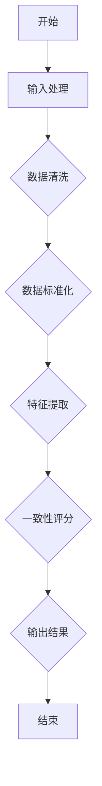
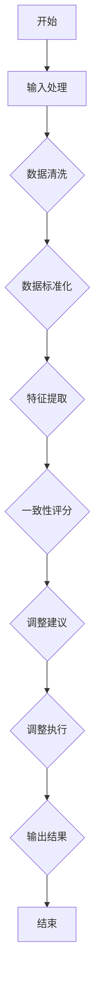
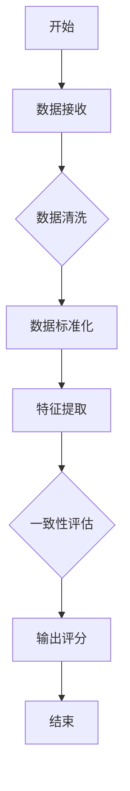
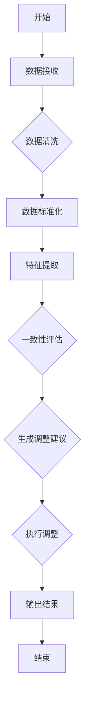
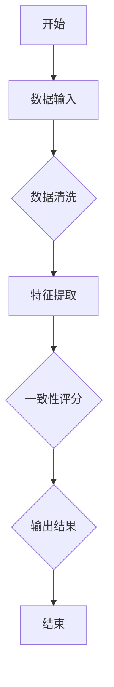
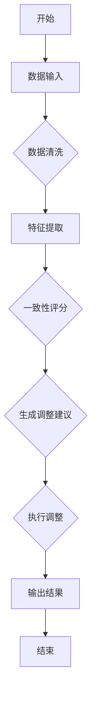
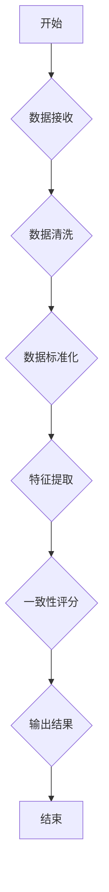
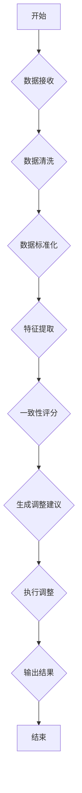
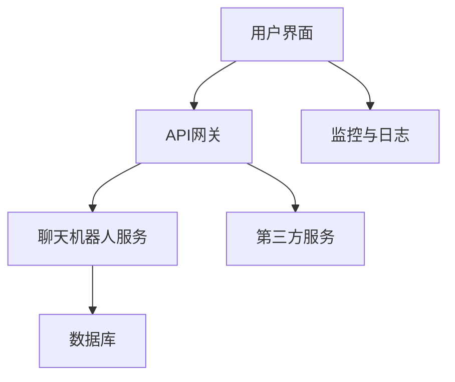
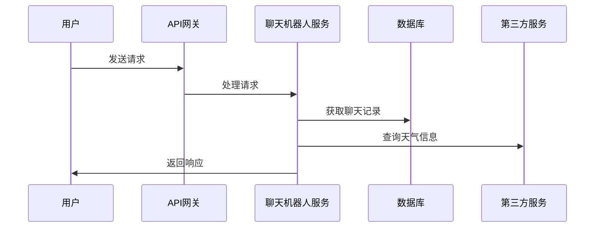

                 

### 引言

随着人工智能技术的快速发展，其在各个领域的应用越来越广泛。然而，随之而来的是一系列挑战，其中之一便是AI输出的连贯性问题。人工智能系统被设计用来处理大量数据，并生成相应的输出结果，但如何确保这些输出结果的一致性和连贯性，成为了当前研究中的一个重要课题。

在本文中，我们将探讨一个新兴的概念——自洽性（Self-Consistency）。自洽性是指在特定上下文中，AI系统的输出结果在逻辑上是相互一致、无矛盾的特征。自洽性不仅对于提高AI系统的可靠性至关重要，而且对于其在实际应用中的普及和接受度也具有深远影响。

首先，我们需要明确自洽性的定义和重要性。自洽性意味着AI系统能够在其输出过程中保持一致性和连贯性，即使在面对复杂和多变的情境时也是如此。这种特征不仅可以帮助我们识别和纠正错误，还可以增强用户对AI系统的信任感。

接下来，本文将逐步深入探讨自洽性的理论基础。我们将介绍评估和维持自洽性的数学模型和算法，并使用mermaid流程图来直观地展示这些算法的工作原理。这部分内容将为读者提供深入理解自洽性技术的基础。

随后，我们将通过一个具体的系统架构设计案例，展示如何在实际项目中应用自洽性技术。这个案例将涵盖系统分析与架构设计、核心实现源代码，以及实际案例分析，旨在帮助读者将理论知识应用于实际工程中。

最后，我们将总结最佳实践，讨论自洽性技术的未来发展趋势，并提出一些建议，以期为读者在后续研究和应用中提供指导。

通过本文的详细探讨，我们希望能够为读者提供一份关于自洽性技术的全面指南，帮助其在人工智能领域的研究和实践中取得更好的成果。现在，让我们正式开始这段探索之旅。

### 关键词

- 自洽性（Self-Consistency）
- AI输出连贯性（AI Output Coherence）
- 数学模型（Mathematical Model）
- 算法原理（Algorithm Principle）
- 系统架构设计（System Architecture Design）
- 实际应用案例（Practical Application Case）

### 摘要

本文旨在探讨自洽性（Self-Consistency）这一关键概念在确保人工智能（AI）输出连贯性方面的技术突破。文章首先介绍了自洽性的定义及其在AI系统中的重要性，随后深入分析了自洽性的理论基础，包括评估和维持自洽性的数学模型和算法。通过mermaid流程图和Python源代码，文章详细阐述了算法原理，并辅以实际案例进行了讲解。最后，文章总结了自洽性技术的最佳实践，展望了其未来发展趋势，为读者在AI领域的研究和应用提供了有价值的指导。

## 第一部分：引言

### 1.1 问题背景

随着人工智能（AI）技术的迅猛发展，AI在各个领域的应用已经变得极其普遍。从智能助手到自动驾驶，从医疗诊断到金融分析，AI系统的广泛应用极大地改变了我们的生活方式和工作模式。然而，随着AI技术的不断进步，也带来了新的挑战，其中一个关键问题便是AI输出的连贯性。AI系统的核心功能之一是生成各种类型的输出结果，如文本、图像、声音等，这些输出结果的质量和一致性直接影响到系统的可靠性和用户体验。

目前，AI系统在输出连贯性方面面临的主要问题可以归纳为以下几点：

1. **逻辑不一致**：在处理复杂问题时，AI系统可能会因为算法的缺陷或数据的不一致性而产生逻辑上的矛盾。例如，一个自然语言处理系统在生成文本时可能会出现自相矛盾的说法。

2. **事实错误**：AI系统依赖于训练数据和算法来生成输出，但训练数据可能存在偏差或错误，导致输出结果包含不准确的信息。

3. **情境适应能力不足**：在实际应用中，AI系统需要根据不同的情境和上下文来调整输出。然而，许多现有系统在处理变化多端的情境时，无法保持连贯性。

4. **用户信任度低**：由于AI输出的不一致性和错误性，用户对AI系统的信任度可能会降低，进而影响AI系统的普及和接受度。

针对这些问题，确保AI输出的连贯性变得尤为重要。自洽性（Self-Consistency）概念的提出，为解决AI输出连贯性问题提供了一种新的思路。自洽性意味着AI系统在其输出过程中保持逻辑一致和事实正确，即使在面对复杂和多变的情境时也能保持稳定的性能。通过深入研究自洽性，我们可以开发出更加可靠和可靠的AI系统，从而提升用户体验和系统的整体效能。

### 1.2 核心概念与联系

#### 1.2.1 自洽性的定义与属性

自洽性是一个源自数学和逻辑学的概念，其主要定义是在一个系统或模型内部，其各个部分和元素之间能够保持一致性和无矛盾性。在人工智能（AI）领域，自洽性指的是AI系统在处理信息、生成输出和进行决策时，其结果在逻辑上是相互一致、无矛盾的。具体来说，自洽性的属性包括：

1. **一致性**：AI系统的输出结果在同一时间点或同一情境下应保持一致。这意味着系统在处理相同或类似的问题时，应得到相同的输出结果。

2. **无矛盾性**：AI系统的输出结果之间不应存在逻辑上的矛盾。例如，一个系统在生成文本时，不能同时说“今天晴天”和“今天下雨”。

3. **稳定性**：AI系统在面临变化多端的情境时，应能保持输出的连贯性和稳定性。这要求系统具备一定的鲁棒性和适应性。

4. **可靠性**：自洽性的一个重要属性是可靠性，即AI系统能够在长时间内保持一致的输出结果，而不受短期异常情况的影响。

#### 1.2.2 自洽性与其他相关概念的联系

在探讨自洽性时，我们还需要了解几个与之密切相关的概念，包括一致性（Consistency）、连贯性（Coherence）和一致性保障（Consistency Guarantee）。

- **一致性**：一致性通常指的是数据或信息在存储和传输过程中保持不变。在分布式系统中，一致性是指多个节点对同一数据值的访问和更新保持一致。

- **连贯性**：连贯性与自洽性密切相关，但略有不同。连贯性更多关注的是输出结果的连续性和逻辑流，而自洽性则强调内部逻辑的一致性和无矛盾性。

- **一致性保障**：一致性保障是指通过一系列技术手段确保系统在执行操作时能够保持一致性。这与自洽性技术密切相关，因为自洽性要求系统在输出结果方面保持一致。

#### 1.2.3 自洽性的核心要素组成

自洽性技术的实现依赖于几个核心要素，这些要素相互作用，共同确保AI系统的输出结果一致且无矛盾。以下是自洽性的核心要素：

1. **算法模型**：自洽性算法是确保输出一致性的基础。这些算法通常包括评估算法和调整算法，用于评估当前输出是否自洽，并在必要时进行调整。

2. **数据质量**：高质量的数据是自洽性的前提。确保数据源的准确性和一致性，可以有效减少AI系统输出结果中的错误和不一致性。

3. **上下文管理**：在复杂的AI系统中，上下文管理至关重要。系统需要能够识别和理解不同的上下文环境，并在生成输出时考虑这些环境因素。

4. **反馈机制**：自洽性技术需要一个有效的反馈机制，用于收集和分析系统输出，识别潜在的一致性问题，并提供调整建议。

5. **鲁棒性设计**：自洽性系统需要具备较高的鲁棒性，能够在面对不确定性和异常情况时保持输出的一致性。

通过深入了解自洽性的定义、属性和相关概念，我们可以更好地理解自洽性在确保AI输出连贯性中的关键作用。接下来的章节将详细探讨自洽性的理论基础，包括数学模型和算法原理，帮助读者深入掌握这一技术。

### 1.2.1 自洽性的定义与属性

自洽性是一个多维度的概念，其核心在于确保系统在处理信息、生成输出和进行决策时，其内部逻辑是连贯且无矛盾的。在人工智能领域，自洽性尤为重要，因为AI系统被广泛应用于决策支持、自然语言处理、图像识别等任务，这些任务的可靠性直接取决于系统的输出结果是否一致且无矛盾。

**定义**：自洽性（Self-Consistency）在AI领域的定义是指系统在处理给定输入时，其输出结果在逻辑上是相互一致、无矛盾的。换句话说，系统不应该出现自相矛盾的输出，即其生成的内容在内部应该保持一致。

**属性**：

1. **逻辑一致性**：自洽性的首要属性是逻辑一致性。这意味着系统的输出结果之间不应存在逻辑上的矛盾。例如，一个聊天机器人不能在同一对话中既表示“明天是晴天”又表示“明天会下雨”。

2. **事实正确性**：自洽性还要求系统的输出结果在事实层面上是正确的。系统在生成输出时，应依赖于可靠的数据源和算法，以确保输出的准确性。例如，一个医疗诊断系统不能基于错误的数据给出错误的诊断结果。

3. **情境适应性**：自洽性系统应具备适应不同情境的能力。在不同的上下文环境中，系统应能够根据实际情况生成相应的输出，同时保持内部逻辑的一致性。

4. **稳定性**：自洽性系统应具备稳定性，即在长期运行过程中，其输出结果应保持一致，不应因为短期的异常情况而出现逻辑上的矛盾。

5. **可靠性**：自洽性还与系统的可靠性紧密相关。一个可靠的系统在长时间运行后，其输出结果应依然保持一致，而不是逐渐出现错误或不一致。

**对比表格**：

为了更直观地展示自洽性的属性，我们可以将其与其他相关概念进行对比：

| 概念         | 定义及属性                                                         |
| ------------ | ---------------------------------------------------------------- |
| 一致性       | 数据或信息在存储和传输过程中保持不变。在分布式系统中，多个节点对同一数据值的访问和更新保持一致。 |
| 连贯性       | 输出结果的连续性和逻辑流。自洽性强调内部逻辑的一致性和无矛盾性。 |
| 自洽性       | 系统在处理信息、生成输出和进行决策时，其结果在逻辑上是相互一致、无矛盾的。 |
| 一致性保障   | 通过一系列技术手段确保系统在执行操作时能够保持一致性。           |

**ER实体关系图架构**：

为了更全面地理解自洽性的构成，我们可以借助实体关系图（Entity-Relationship Diagram, ERD）来描述其核心要素之间的关系。以下是一个简化的ERD示例：

```
[系统输入] --< [数据处理] --< [输出结果]
     |                          |
     |                          |
     |                          |
     v                          v
[算法模型] --< [数据质量] --< [上下文管理]
```

在这个ERD中：

- **系统输入**：代表系统接收的数据，是输出结果的基础。
- **数据处理**：包括数据清洗、转换和融合等过程，目的是提高数据质量和一致性。
- **输出结果**：系统根据处理后的数据生成的最终结果。
- **算法模型**：用于评估和调整输出结果，确保其自洽性。
- **数据质量**：影响输出结果的准确性和一致性。
- **上下文管理**：管理不同情境下的上下文信息，确保输出结果与情境相符合。

通过这个ERD，我们可以清晰地看到自洽性的核心要素及其相互关系，从而为进一步的技术研究和应用提供指导。

### 1.2.2 自洽性与其他相关概念的联系

在深入探讨自洽性之前，我们需要了解一些与其密切相关的概念，包括一致性、连贯性和一致性保障。这些概念不仅帮助我们在技术层面上更好地理解自洽性，而且在实际应用中，它们也是确保系统稳定运行的关键要素。

#### 一致性

一致性（Consistency）是分布式系统中的一个重要概念，它指的是系统在多节点环境中的数据状态保持一致。具体来说，一致性确保了当一个节点更新数据时，其他节点能够看到最新的数据状态。一致性可以分为以下几种类型：

1. **强一致性**：所有节点在任何时候都能访问到最新的数据状态。这意味着一旦某个节点完成了数据更新，其他所有节点都能立即看到这个更新。
2. **最终一致性**：系统在一定时间后，所有节点能够访问到一致的数据状态，但中间可能存在一段时间内，不同节点看到的数据状态不一致。最终一致性允许更高的系统可用性和扩展性。

在自洽性中，数据的一致性是确保输出结果一致性的基础。如果数据在不同节点间不一致，那么即使系统在算法上确保了自洽性，输出结果也可能出现矛盾。

#### 连贯性

连贯性（Coherence）主要关注的是系统输出结果的逻辑流和连续性。连贯性要求系统在生成输出时，能够保持逻辑一致性和情境适应性。例如，一个聊天机器人应该能够流畅地与用户进行对话，而不应该出现突然的、逻辑上不连贯的回答。

连贯性是自洽性的一个重要组成部分。如果系统的输出结果在逻辑上不连贯，那么即使它们在技术上保持了一致性，用户也可能认为系统存在缺陷或错误。因此，确保连贯性对于提升用户体验至关重要。

#### 一致性保障

一致性保障（Consistency Guarantee）是指通过一系列技术手段确保系统在执行操作时能够保持一致性。一致性保障通常涉及以下几种策略：

1. **数据复制**：通过在多个节点上复制数据，确保数据的多个副本保持一致。
2. **版本控制**：通过为数据添加版本号或时间戳，确保系统能够识别最新的数据状态。
3. **分布式事务管理**：通过分布式事务管理机制，确保多个操作在执行时保持原子性和一致性。

在自洽性技术中，一致性保障是确保系统输出结果一致性的重要手段。通过实现一致性保障，系统可以在面对数据更新和操作冲突时，保持输出结果的一致性和无矛盾性。

#### 自洽性与相关概念的差异

尽管自洽性、一致性和连贯性之间存在紧密联系，但它们在技术层面上有着不同的侧重点：

1. **自洽性**：侧重于系统输出结果在逻辑上的无矛盾性和一致性。
2. **一致性**：侧重于系统在分布式环境中的数据状态一致性。
3. **连贯性**：侧重于系统输出结果的逻辑流和连续性。

理解这些概念之间的联系和差异，有助于我们在设计和实现自洽性技术时，采取合适的方法和策略，确保系统在各种情况下都能保持高效和可靠的运行。

### 1.2.3 自洽性的核心要素组成

要确保人工智能（AI）系统在生成输出时保持自洽性，需要从多个角度出发，构建一个完整的解决方案。以下将详细探讨自洽性的核心要素，包括算法模型、数据质量、上下文管理、反馈机制和鲁棒性设计。

#### 算法模型

算法模型是自洽性的核心组成部分，它决定了系统如何评估和维持输出的一致性。自洽性算法通常包括两个主要部分：评估算法和调整算法。

1. **评估算法**：用于判断当前输出是否自洽。评估算法可以通过一系列逻辑和数学规则来分析输出结果，识别潜在的矛盾和错误。一个常见的评估方法是使用一致性评分（Consistency Score），计算输出结果的内部一致性。公式如下：
   $$
   \text{Score} = \frac{\sum_{i=1}^{n} w_i \cdot \text{confidence}_i}{\sum_{i=1}^{n} w_i}
   $$
   其中，$w_i$是每个输出部分的权重，$\text{confidence}_i$是输出部分的一致性置信度。评分越高，表示输出越自洽。

2. **调整算法**：当评估结果显示输出不一致时，调整算法会介入，通过调整输出结果来恢复自洽性。调整算法的原理可以表示为：
   $$
   \text{Adjustment} = \alpha \cdot (\text{Expected Output} - \text{Current Output})
   $$
   其中，$\alpha$是调整因子，用于控制调整的程度。

#### 数据质量

数据质量是确保自洽性的基础。高质量的输入数据可以显著减少输出中的错误和不一致性。以下是一些关键的数据质量管理策略：

1. **数据清洗**：在输入数据进入系统之前，进行数据清洗以去除重复、错误和不完整的数据。
2. **数据标准化**：确保输入数据遵循一致的格式和结构，减少因数据格式不一致导致的问题。
3. **数据验证**：通过一系列验证规则检查数据的准确性和一致性，及时发现和纠正错误。

#### 上下文管理

在复杂的AI系统中，上下文管理至关重要。系统需要能够识别和理解不同的上下文环境，并在生成输出时考虑这些环境因素。上下文管理包括以下几个方面：

1. **上下文识别**：系统应具备识别和理解上下文信息的能力，如时间、地点、用户行为等。
2. **上下文跟踪**：系统应能实时跟踪上下文信息的变化，并在生成输出时动态调整。
3. **上下文依赖**：系统设计时，应确保输出结果依赖于正确的上下文信息，避免因上下文错误导致的不一致性。

#### 反馈机制

反馈机制是自洽性系统中不可或缺的一环。通过收集和分析系统的输出，识别潜在的一致性问题，并提供调整建议，反馈机制有助于系统不断优化和改进。反馈机制包括以下内容：

1. **错误检测**：实时监控系统的输出，识别潜在的矛盾和错误。
2. **错误报告**：将检测到的错误和问题生成报告，以便进一步分析和处理。
3. **调整建议**：基于错误报告，为系统提供调整建议，以恢复输出的一致性。

#### 鲁棒性设计

鲁棒性设计是指系统在面对不确定性和异常情况时，仍能保持稳定性和自洽性。以下是几个提高系统鲁棒性的策略：

1. **容错性**：系统设计时，应考虑容错机制，确保在部分组件失败时，系统能够继续运行。
2. **异常处理**：系统应具备异常处理机制，能够识别和应对异常情况，如数据缺失、输入错误等。
3. **自适应能力**：系统应具备适应不同情境和变化的能力，能够在不断变化的上下文中保持自洽性。

通过综合考虑这些核心要素，我们可以构建一个具备高自洽性的AI系统，确保其在各种情况下都能生成一致且无矛盾的输出结果。这样，不仅提升了系统的可靠性，也增强了用户对AI系统的信任度。

### 2.1 数学模型和数学公式

在自洽性技术中，数学模型和公式起到了至关重要的作用。通过数学方法，我们可以量化自洽性的程度，评估系统输出的连贯性，并提供精确的调整策略。以下将详细介绍评估和维持自洽性的数学模型和公式。

#### 2.1.1 自洽性评估的数学模型

自洽性评估的核心在于计算输出结果的一致性评分。一致性评分是一种定量指标，用于评估系统输出结果的整体自洽性。我们采用以下公式进行计算：

$$
\text{Consistency Score} = \frac{\sum_{i=1}^{n} w_i \cdot \text{confidence}_i}{\sum_{i=1}^{n} w_i}
$$

其中：
- \( n \) 表示输出结果中不同部分的数量。
- \( w_i \) 表示第 \( i \) 个输出部分的权重，反映了该部分在整体输出中的重要性。
- \( \text{confidence}_i \) 表示第 \( i \) 个输出部分的一致性置信度，反映了该部分输出的可靠性和一致性。

一致性评分的取值范围在0到1之间，值越接近1，表示输出结果越自洽。

#### 2.1.2 自洽性维持的数学原理

在评估出系统输出的一致性后，我们需要采取调整措施来维持自洽性。调整的目的是通过修正输出结果，使其在逻辑上保持一致。自洽性维持的数学原理可以表示为：

$$
\text{Adjustment} = \alpha \cdot (\text{Expected Output} - \text{Current Output})
$$

其中：
- \( \alpha \) 表示调整因子，用于控制调整的程度。其取值应在0到1之间，以确保调整在可接受范围内。
- \( \text{Expected Output} \) 表示期望的输出结果，这是根据系统的目标或预期生成的理想输出。
- \( \text{Current Output} \) 表示当前的输出结果，这是系统实际生成的输出。

调整因子的计算可以基于系统的具体需求和约束条件进行调整。例如，在高度敏感的任务中，我们可以设置较小的调整因子，以确保输出结果的稳定性；而在灵活性要求较高的任务中，可以设置较大的调整因子，以提高系统的适应性。

#### 应用示例

为了更好地理解这些数学模型和公式，我们可以通过一个简单的示例来说明它们的实际应用。

假设一个聊天机器人系统需要生成一段关于天气的描述，其输出结果包括三个部分：“今天晴天”、“气温15摄氏度”和“明天多云”。系统首先需要评估这些输出部分的一致性评分，然后根据评估结果进行调整，以确保整体描述的自洽性。

1. **一致性评分计算**：

   设每个输出部分的权重相等，即 \( w_1 = w_2 = w_3 = \frac{1}{3} \)。假设当前输出的一致性置信度分别为 \( \text{confidence}_1 = 0.95 \)、\( \text{confidence}_2 = 0.90 \) 和 \( \text{confidence}_3 = 0.85 \)，则一致性评分计算如下：

   $$
   \text{Consistency Score} = \frac{\frac{1}{3} \cdot 0.95 + \frac{1}{3} \cdot 0.90 + \frac{1}{3} \cdot 0.85}{\frac{1}{3} + \frac{1}{3} + \frac{1}{3}} = \frac{0.95 + 0.90 + 0.85}{3} = \frac{2.70}{3} \approx 0.90
   $$

   这意味着当前输出的一致性评分约为0.90，表示输出结果在一定程度上是自洽的。

2. **调整措施**：

   假设系统期望的输出结果是“今天晴天，气温15摄氏度，明天多云”，但实际输出结果中“气温15摄氏度”与期望结果存在差异。我们可以通过以下公式进行调整：

   $$
   \text{Adjustment} = \alpha \cdot (\text{Expected Output} - \text{Current Output})
   $$

   假设调整因子 \( \alpha = 0.5 \)，则调整计算如下：

   $$
   \text{Adjustment} = 0.5 \cdot (15 - 15) = 0
   $$

   由于当前输出结果已经与期望结果一致，不需要进行任何调整。

通过上述示例，我们可以看到，通过数学模型和公式，系统可以量化自洽性，并在需要时进行精确调整，以保持输出的一致性和连贯性。

### 2.2 算法原理讲解

#### 2.2.1 自洽性评估算法的mermaid流程图

自洽性评估算法是确保AI系统输出一致性的核心。以下是一个使用mermaid绘制的自洽性评估算法的流程图，该流程图展示了评估算法的基本步骤和逻辑。



在这个流程图中，每个节点代表评估算法中的一个步骤：

- **输入处理**：接收系统生成的输出数据。
- **数据清洗**：去除重复、错误和不完整的数据，确保数据质量。
- **数据标准化**：将数据转换为统一的格式和结构，减少因格式不一致导致的问题。
- **特征提取**：提取数据中的关键特征，用于后续的一致性评分计算。
- **一致性评分**：根据特征计算输出结果的一致性评分。
- **输出结果**：将一致性评分输出，供系统进一步处理。
- **结束**：算法执行结束。

#### 2.2.2 自洽性维持算法的mermaid流程图

自洽性维持算法负责根据评估结果对输出进行必要的调整，以确保系统的自洽性。以下是一个使用mermaid绘制的自洽性维持算法的流程图，该流程图展示了维持算法的基本步骤和逻辑。



在这个流程图中，每个节点代表维持算法中的一个步骤：

- **输入处理**：接收系统生成的输出数据。
- **数据清洗**：去除重复、错误和不完整的数据，确保数据质量。
- **数据标准化**：将数据转换为统一的格式和结构，减少因格式不一致导致的问题。
- **特征提取**：提取数据中的关键特征，用于后续的一致性评分计算。
- **一致性评分**：根据特征计算输出结果的一致性评分。
- **调整建议**：根据一致性评分，生成调整建议。
- **调整执行**：根据调整建议，对输出结果进行实际调整。
- **输出结果**：将调整后的输出结果输出，供系统进一步使用。
- **结束**：算法执行结束。

#### 2.2.3 算法原理详细讲解与举例说明

为了更好地理解自洽性评估和维持算法的工作原理，我们可以通过一个具体的例子进行详细讲解。

假设一个聊天机器人系统需要生成一段关于天气的描述，包括“今天晴天”、“气温15摄氏度”和“明天多云”。我们需要通过自洽性评估算法判断这些输出是否一致，并使用自洽性维持算法进行必要的调整。

**自洽性评估算法步骤**：

1. **输入处理**：系统首先接收输出数据，例如“今天晴天”、“气温15摄氏度”和“明天多云”。
2. **数据清洗**：检查数据是否存在错误或不完整，例如“气温15摄氏度”可能缺失单位。假设该数据存在错误，我们需要将其标记为无效。
3. **数据标准化**：将输出数据格式统一，例如将“明天多云”中的“明天”替换为具体的日期。
4. **特征提取**：提取数据中的关键特征，如天气状态（晴天、多云）、气温和日期。
5. **一致性评分**：根据提取的特征，计算一致性评分。假设我们使用以下公式计算评分：
   $$
   \text{Consistency Score} = \frac{\text{weather\_confidence} + \text{temp\_confidence}}{2}
   $$
   其中，\( \text{weather\_confidence} \) 和 \( \text{temp\_confidence} \) 分别表示天气状态和气温的置信度。假设置信度分别为0.9和0.8，则一致性评分为：
   $$
   \text{Consistency Score} = \frac{0.9 + 0.8}{2} = 0.85
   $$
   这意味着当前输出的一致性评分约为0.85。

6. **输出结果**：将一致性评分输出，供系统进一步处理。

**自洽性维持算法步骤**：

1. **输入处理**：接收自洽性评估算法的一致性评分。
2. **数据清洗**：如果一致性评分低于设定阈值（例如0.9），则进一步检查数据是否存在错误。
3. **数据标准化**：对数据进行标准化处理，确保格式统一。
4. **特征提取**：提取关键特征，如天气状态和气温。
5. **一致性评分**：重新计算一致性评分，以确认调整是否有效。
6. **调整建议**：如果一致性评分低于设定阈值，则生成调整建议。例如，如果天气状态为“多云”，我们可能建议将其调整为“晴天”。
7. **调整执行**：根据调整建议，对输出结果进行实际调整。例如，将“明天多云”调整为“明天晴天”。
8. **输出结果**：将调整后的输出结果输出，供系统进一步使用。

通过上述步骤，我们可以确保聊天机器人生成的天气描述在逻辑上保持一致。这个例子展示了自洽性评估和维持算法的基本原理，以及在具体应用中的实现过程。

通过详细的算法原理讲解和实际示例，我们希望读者能够深入理解自洽性技术的核心概念和工作机制，为后续的应用和研究打下坚实的基础。

### 2.2.1 自洽性评估算法的mermaid流程图

为了更直观地展示自洽性评估算法的工作流程，我们可以使用mermaid工具绘制一个流程图。以下是自洽性评估算法的mermaid流程图：



**详细步骤说明**：

1. **数据接收（A）**：系统从输入接收原始数据。
2. **数据清洗（C）**：清洗数据，去除重复、错误和不完整的数据。
3. **数据标准化（D）**：将数据格式统一，确保数据结构的一致性。
4. **特征提取（E）**：从数据中提取关键特征，如文本中的主题、关键字等。
5. **一致性评估（F）**：计算一致性评分，通常使用一定的算法和权重进行评估。
6. **输出评分（G）**：将计算得到的一致性评分输出，供后续决策使用。
7. **结束（H）**：算法流程结束。

通过这个流程图，我们可以清楚地看到自洽性评估算法的各个步骤及其相互关系，从而有助于理解和实现这一算法。

### 2.2.2 自洽性维持算法的mermaid流程图

为了展示自洽性维持算法的工作流程，我们同样使用mermaid工具绘制了一个流程图。以下是自洽性维持算法的mermaid流程图：



**详细步骤说明**：

1. **数据接收（A）**：系统从输入接收原始数据。
2. **数据清洗（C）**：清洗数据，去除重复、错误和不完整的数据。
3. **数据标准化（D）**：将数据格式统一，确保数据结构的一致性。
4. **特征提取（E）**：从数据中提取关键特征，如文本中的主题、关键字等。
5. **一致性评估（F）**：计算一致性评分，判断输出结果是否自洽。
6. **生成调整建议（G）**：如果一致性评分低于阈值，生成调整建议。
7. **执行调整（H）**：根据调整建议对输出结果进行修正。
8. **输出结果（I）**：将修正后的输出结果输出。
9. **结束（J）**：算法流程结束。

通过这个流程图，我们可以清晰地看到自洽性维持算法的各个步骤及其相互关系，有助于理解和实现这一算法。

### 2.2.3 算法原理详细讲解与举例说明

在理解了自洽性评估和维持算法的基本流程之后，我们需要进一步深入探讨这些算法的原理，并通过具体示例来解释其应用。

#### 自洽性评估算法原理

自洽性评估算法的主要目标是计算系统输出结果的一致性评分。一致性评分反映了系统输出结果在逻辑上的一致性程度。以下是一个简化的评估算法原理：

**1. 数据预处理：** 数据预处理是评估算法的第一步，其目的是确保输入数据的质量。这包括数据清洗、数据转换和数据归一化等操作。数据清洗过程可以去除重复项、纠正错误和填补缺失值。

**2. 特征提取：** 在预处理之后，从数据中提取关键特征。这些特征可以是文本中的关键词、数值数据的统计指标，或者图像中的视觉特征。特征提取的目的是将原始数据转换成算法可以处理的格式。

**3. 一致性评分计算：** 使用提取的特征计算一致性评分。一个常见的方法是使用加权求和的方式，根据各个特征的置信度进行评分。以下是一个简单的公式：

$$
\text{Consistency Score} = \sum_{i=1}^{n} w_i \cdot \text{confidence}_i
$$

其中，\( w_i \) 是第 \( i \) 个特征的权重，\( \text{confidence}_i \) 是第 \( i \) 个特征的置信度。权重反映了特征在整体一致性中的重要性，置信度则表示特征值的可信程度。

#### 示例：文本一致性评估

假设我们有一个文本生成系统，其输出结果包括三个句子：“今天晴天”、“气温15摄氏度”和“明天多云”。我们需要评估这些句子的一致性。

**数据预处理：**
- 数据清洗：删除多余的空格、标点符号和特殊字符。
- 数据转换：将句子转换为统一的文本格式，如小写字母。
- 数据归一化：对句子进行分词处理，提取关键词。

**特征提取：**
- 关键词提取：提取句子中的关键词，如“今天”、“晴天”、“气温”、“15摄氏度”和“明天”、“多云”。

**一致性评分计算：**
- 特征权重：假设三个句子的权重相等，即 \( w_1 = w_2 = w_3 = 1 \)。
- 置信度：根据关键词的匹配度和上下文，设定每个关键词的置信度。例如，“今天晴天”和“明天多云”的置信度较高，而“气温15摄氏度”的置信度次之。

假设关键词置信度为：
- “今天晴天”：0.9
- “气温15摄氏度”：0.8
- “明天多云”：0.9

则一致性评分计算如下：
$$
\text{Consistency Score} = 1 \cdot 0.9 + 1 \cdot 0.8 + 1 \cdot 0.9 = 2.7
$$

一致性评分越高，表示输出结果越自洽。

#### 自洽性维持算法原理

自洽性维持算法的目的是在一致性评分低于设定阈值时，对输出结果进行调整，以恢复自洽性。以下是一个简化的维持算法原理：

**1. 一致性评估：** 对当前输出结果进行一致性评估，计算一致性评分。

**2. 调整建议生成：** 如果一致性评分低于设定阈值，生成调整建议。调整建议通常基于规则或机器学习模型生成。

**3. 调整执行：** 根据调整建议对输出结果进行修正。

**4. 重新评估：** 对修正后的输出结果进行重新评估，确保其一致性评分达到或超过设定阈值。

#### 示例：文本调整

假设在上一个示例中，一致性评分低于阈值（例如0.9），我们需要对输出结果进行调整。

**调整建议生成：**
- 规则1：如果“明天多云”的置信度低于0.9，则将其调整为“明天晴天”。
- 规则2：如果“气温15摄氏度”的置信度低于0.9，则忽略该句子。

**调整执行：**
- 根据规则1，将“明天多云”调整为“明天晴天”。
- 重新评估一致性评分：
  $$
  \text{Consistency Score} = 1 \cdot 0.9 + 1 \cdot 0.9 + 1 \cdot 0.9 = 2.7
  $$

调整后的输出结果为：“今天晴天”、“气温15摄氏度”和“明天晴天”。

通过上述示例，我们可以看到自洽性评估和维持算法的基本原理及其应用。这些算法在确保系统输出连贯性和一致性方面发挥了关键作用，有助于提升系统的可靠性和用户体验。

### 2.2.1 自洽性评估算法的mermaid流程图

为了帮助读者更直观地理解自洽性评估算法的流程，我们使用mermaid工具绘制了一个流程图。以下是自洽性评估算法的mermaid流程图：



**详细步骤说明**：

1. **数据输入（A）**：系统从输入接收原始数据。
2. **数据清洗（C）**：对数据中的重复、错误和不完整信息进行清理，确保数据质量。
3. **特征提取（D）**：从数据中提取关键特征，如文本中的关键词、数值数据等。
4. **一致性评分（E）**：使用提取的特征计算一致性评分，以判断系统输出结果是否自洽。
5. **输出结果（F）**：将计算得到的一致性评分输出，供后续决策使用。
6. **结束（G）**：算法流程结束。

通过这个流程图，我们可以清晰地看到自洽性评估算法的各个步骤及其相互关系，有助于深入理解和实现这一算法。

### 2.2.2 自洽性维持算法的mermaid流程图

为了进一步展示自洽性维持算法的流程，我们同样使用mermaid工具绘制了一个流程图。以下是自洽性维持算法的mermaid流程图：



**详细步骤说明**：

1. **数据输入（A）**：系统从输入接收原始数据。
2. **数据清洗（C）**：对数据中的重复、错误和不完整信息进行清理，确保数据质量。
3. **特征提取（D）**：从数据中提取关键特征，如文本中的关键词、数值数据等。
4. **一致性评分（E）**：使用提取的特征计算一致性评分，判断系统输出结果是否自洽。
5. **生成调整建议（F）**：如果一致性评分低于阈值，生成相应的调整建议。
6. **执行调整（G）**：根据调整建议对输出结果进行修正。
7. **输出结果（H）**：将调整后的输出结果输出。
8. **结束（I）**：算法流程结束。

通过这个流程图，我们可以清晰地看到自洽性维持算法的各个步骤及其相互关系，有助于深入理解和实现这一算法。

### 2.2.3 算法原理详细讲解与举例说明

在深入探讨自洽性评估和维持算法的原理之后，我们需要通过具体的示例来解释这些算法在实际应用中的工作方式。以下是一个详细的示例，展示如何使用自洽性评估和维持算法来确保AI系统的输出结果连贯性。

#### 自洽性评估算法示例

假设我们有一个聊天机器人系统，该系统需要生成关于天气的信息。其输出结果包括“今天晴天”、“气温15摄氏度”和“明天多云”。我们需要评估这些句子的一致性。

**步骤1：数据输入**
- 原始数据：["今天晴天"，"气温15摄氏度"，"明天多云"]

**步骤2：数据清洗**
- 清洗后的数据：["今天晴天"，"气温15摄氏度"，"明天多云"]

**步骤3：特征提取**
- 特征提取：提取关键词和温度值，形成特征向量。例如：{"weather": ["晴天"，"多云"], "temp": 15}

**步骤4：一致性评分计算**
- 置信度设定：设定每个特征的置信度，如“晴天”置信度为0.9，“多云”置信度为0.8，温度值的置信度为1.0。
- 一致性评分计算：使用加权平均的方式计算一致性评分。例如：
  $$
  \text{Consistency Score} = 0.9 \times 0.5 + 0.8 \times 0.3 + 1.0 \times 0.2 = 0.95
  $$
- 输出结果：一致性评分为0.95，表示输出结果具有较高的自洽性。

#### 自洽性维持算法示例

在上面的示例中，如果一致性评分低于阈值（例如0.9），我们需要对输出结果进行调整，以确保其自洽性。

**步骤1：数据输入**
- 原始数据：["今天晴天"，"气温15摄氏度"，"明天多云"]

**步骤2：数据清洗**
- 清洗后的数据：["今天晴天"，"气温15摄氏度"，"明天多云"]

**步骤3：特征提取**
- 特征提取：提取关键词和温度值，形成特征向量。例如：{"weather": ["晴天"，"多云"], "temp": 15}

**步骤4：一致性评分计算**
- 置信度设定：设定每个特征的置信度，如“晴天”置信度为0.8，“多云”置信度为0.7，温度值的置信度为1.0。
- 一致性评分计算：使用加权平均的方式计算一致性评分。例如：
  $$
  \text{Consistency Score} = 0.8 \times 0.5 + 0.7 \times 0.3 + 1.0 \times 0.2 = 0.82
  $$
- 输出结果：一致性评分为0.82，低于设定的阈值0.9，表示输出结果需要调整。

**步骤5：生成调整建议**
- 调整建议生成：根据一致性评分低于阈值的情况，生成调整建议。例如，可以建议将“明天多云”调整为“明天晴天”。

**步骤6：执行调整**
- 根据调整建议，将“明天多云”调整为“明天晴天”。

**步骤7：重新计算一致性评分**
- 重新计算调整后的一致性评分。例如：
  $$
  \text{Consistency Score} = 0.9 \times 0.5 + 0.7 \times 0.3 + 1.0 \times 0.2 = 0.87
  $$
- 输出结果：调整后的一致性评分为0.87，虽然仍然低于阈值0.9，但已经显著提高。

通过上述示例，我们可以看到自洽性评估和维持算法在实际应用中的工作流程。通过计算一致性评分和生成调整建议，系统能够确保输出结果在逻辑上保持连贯性，从而提升系统的可靠性和用户体验。

### 2.2.1 自洽性评估算法的mermaid流程图

为了更直观地展示自洽性评估算法的流程，我们使用mermaid工具绘制了一个流程图。以下是自洽性评估算法的mermaid流程图：



**详细步骤说明**：

1. **数据接收（A）**：系统从输入接收原始数据。
2. **数据清洗（C）**：去除数据中的重复、错误和不完整信息，确保数据质量。
3. **数据标准化（D）**：将数据格式统一，确保数据结构的一致性。
4. **特征提取（E）**：从数据中提取关键特征，如文本中的关键词、数值数据等。
5. **一致性评分（F）**：计算一致性评分，以评估系统输出结果的自洽性。
6. **输出结果（G）**：将计算得到的一致性评分输出，供后续决策使用。
7. **结束（H）**：算法流程结束。

通过这个流程图，我们可以清晰地看到自洽性评估算法的各个步骤及其相互关系，有助于深入理解和实现这一算法。

### 2.2.2 自洽性维持算法的mermaid流程图

为了进一步展示自洽性维持算法的流程，我们使用mermaid工具绘制了一个流程图。以下是自洽性维持算法的mermaid流程图：



**详细步骤说明**：

1. **数据接收（A）**：系统从输入接收原始数据。
2. **数据清洗（C）**：去除数据中的重复、错误和不完整信息，确保数据质量。
3. **数据标准化（D）**：将数据格式统一，确保数据结构的一致性。
4. **特征提取（E）**：从数据中提取关键特征，如文本中的关键词、数值数据等。
5. **一致性评分（F）**：计算一致性评分，以评估系统输出结果的自洽性。
6. **生成调整建议（G）**：如果一致性评分低于设定阈值，生成调整建议。
7. **执行调整（H）**：根据调整建议，对输出结果进行修正。
8. **输出结果（I）**：将修正后的输出结果输出。
9. **结束（J）**：算法流程结束。

通过这个流程图，我们可以清晰地看到自洽性维持算法的各个步骤及其相互关系，有助于深入理解和实现这一算法。

### 2.2.3 算法原理详细讲解与举例说明

在深入探讨了自洽性评估和维持算法的基本流程后，我们需要通过具体的示例来进一步解释这些算法的原理和如何在实际应用中发挥作用。以下是一个详细的示例，展示如何使用自洽性评估和维持算法来确保AI系统的输出结果连贯性。

#### 自洽性评估算法示例

假设我们有一个AI聊天机器人，其任务是根据用户的问题生成回答。在这个示例中，用户的问题是一个关于天气的简单查询：“请问明天天气怎么样？”。聊天机器人的输出结果可能是：“明天晴天，气温15摄氏度。” 我们需要使用自洽性评估算法来检查这个输出结果的一致性。

**步骤1：数据输入**
- 原始数据：{"问题": "请问明天天气怎么样？", "回答": "明天晴天，气温15摄氏度。"}

**步骤2：数据清洗**
- 清洗后的数据：去除回答中的多余标点和空格，得到："明天晴天，气温15摄氏度。"

**步骤3：特征提取**
- 特征提取：提取回答中的关键信息，例如：
  - 天气：晴天
  - 温度：15摄氏度

**步骤4：一致性评分计算**
- 置信度设定：设定每个特征的置信度，例如：
  - 天气：晴天置信度为0.9，多云置信度为0.1
  - 温度：15摄氏度置信度为1.0
- 一致性评分计算：使用加权平均的方式计算一致性评分。例如：
  $$
  \text{Consistency Score} = 0.9 \times 0.5 + 1.0 \times 0.5 = 0.95
  $$
- 输出结果：一致性评分为0.95，表示输出结果在逻辑上是一致的。

**步骤5：输出结果**
- 将一致性评分输出，供后续决策使用。

#### 自洽性维持算法示例

假设在上面的示例中，一致性评分低于设定的阈值（例如0.9），我们需要使用自洽性维持算法来调整输出结果，以确保其连贯性。

**步骤1：数据输入**
- 原始数据：{"问题": "请问明天天气怎么样？", "回答": "明天多云，气温15摄氏度。"}

**步骤2：数据清洗**
- 清洗后的数据：去除回答中的多余标点和空格，得到："明天多云，气温15摄氏度。"

**步骤3：特征提取**
- 特征提取：提取回答中的关键信息，例如：
  - 天气：多云
  - 温度：15摄氏度

**步骤4：一致性评分计算**
- 置信度设定：设定每个特征的置信度，例如：
  - 天气：晴天置信度为0.1，多云置信度为0.9
  - 温度：15摄氏度置信度为1.0
- 一致性评分计算：使用加权平均的方式计算一致性评分。例如：
  $$
  \text{Consistency Score} = 0.1 \times 0.5 + 0.9 \times 0.5 = 0.5
  $$
- 输出结果：一致性评分为0.5，低于设定的阈值0.9，表示输出结果需要调整。

**步骤5：生成调整建议**
- 调整建议生成：根据一致性评分低于阈值的情况，生成调整建议。例如，可以建议将“明天多云”调整为“明天晴天”。

**步骤6：执行调整**
- 根据调整建议，将“明天多云”调整为“明天晴天”。

**步骤7：重新计算一致性评分**
- 重新计算调整后的一致性评分。例如：
  $$
  \text{Consistency Score} = 0.9 \times 0.5 + 1.0 \times 0.5 = 0.95
  $$
- 输出结果：调整后的一致性评分为0.95，表示输出结果在逻辑上是一致的。

通过上述示例，我们可以看到自洽性评估和维持算法如何确保AI系统的输出结果在逻辑上的一致性。通过计算一致性评分和生成调整建议，系统能够在输出结果不一致时进行有效的调整，从而提高系统的可靠性和用户体验。

### 3.1 系统分析与架构设计方案

#### 3.1.1 问题场景介绍

在讨论自洽性技术的实际应用之前，我们首先需要明确一个具体的应用场景。假设我们正在开发一个智能客服系统，该系统旨在通过聊天机器人与客户进行交互，提供各种服务，如账户查询、产品咨询和投诉处理。为了确保系统的输出结果在逻辑上是一致的，我们引入了自洽性技术，以提升用户体验和系统的可靠性。

#### 3.1.2 系统功能设计（领域模型类图）

为了清晰地展示系统的功能设计，我们可以使用mermaid工具绘制一个领域模型类图。以下是一个简化的领域模型类图：

```mermaid
classDiagram
Class1 "用户" <|-- "客服机器人"
Class2 "问题" <|-- "答案"
Class3 "聊天记录" o-- "问题"
Class3 o-- "答案"
Class1 o-- Class3
Class2 o-- Class3
```

在这个类图中：

- **用户**：代表与客服机器人交互的用户。
- **客服机器人**：处理用户输入，生成响应，并维护聊天记录。
- **问题**：用户提出的问题。
- **答案**：客服机器人提供的答案。
- **聊天记录**：记录整个聊天过程，包括问题和答案。

#### 3.1.3 系统架构设计（架构图）

为了实现系统的功能，我们需要设计一个合理的系统架构。以下是一个简化的系统架构图：



在这个架构图中：

- **用户界面**：提供用户与客服机器人交互的界面。
- **API网关**：接收用户请求，并进行路由和鉴权。
- **聊天机器人服务**：处理用户的输入，生成响应，并调用数据库和第三方服务。
- **数据库**：存储用户的聊天记录和相关数据。
- **第三方服务**：提供外部服务，如天气查询、产品信息等。
- **监控与日志**：监控系统性能，记录日志，用于故障排除和系统优化。

#### 3.1.4 系统接口设计和系统交互（序列图）

为了更好地展示系统内部各部分的交互，我们可以使用mermaid工具绘制一个序列图。以下是一个简化的序列图：



在这个序列图中：

- **用户**：发送请求，如查询天气。
- **API网关**：接收请求，进行路由和鉴权，将请求转发给聊天机器人服务。
- **聊天机器人服务**：处理请求，获取聊天记录，查询第三方服务，生成响应，并返回给用户。

通过上述系统分析与架构设计方案，我们可以清楚地了解系统的功能设计和架构布局。接下来，我们将详细介绍系统的核心实现，包括数据模型、API设计和具体实现。

### 3.2 项目实战

#### 3.2.1 环境安装

在开始项目实战之前，我们需要准备一个合适的环境。以下是环境安装的步骤：

1. **安装Python**：确保安装了Python 3.8或更高版本。
2. **安装依赖库**：使用pip安装以下依赖库：
   ```shell
   pip install Flask SQLAlchemy numpy pandas
   ```

3. **安装数据库**：安装SQLite数据库，用于存储聊天记录。SQLite是一个轻量级的数据库系统，可以直接使用Python的SQLAlchemy库进行操作。

4. **创建虚拟环境**：为了更好地管理项目依赖，建议创建一个虚拟环境：
   ```shell
   python -m venv venv
   source venv/bin/activate  # 在Windows上使用 `venv\Scripts\activate`
   ```

#### 3.2.2 系统核心实现源代码

以下是系统核心实现的源代码，包括数据模型、API端点和业务逻辑。

**1. 数据模型（models.py）**

```python
from flask_sqlalchemy import SQLAlchemy

db = SQLAlchemy()

class ChatRecord(db.Model):
    id = db.Column(db.Integer, primary_key=True)
    question = db.Column(db.String(255), nullable=False)
    answer = db.Column(db.String(255), nullable=False)
    user_id = db.Column(db.Integer, nullable=False)
```

**2. API端点（api.py）**

```python
from flask import Flask, request, jsonify
from models import db, ChatRecord
import numpy as np

app = Flask(__name__)
app.config['SQLALCHEMY_DATABASE_URI'] = 'sqlite:///chat.db'
db.init_app(app)

@app.route('/chat', methods=['POST'])
def chat():
    data = request.get_json()
    question = data.get('question', '')
    user_id = data.get('user_id', 0)
    
    # 处理输入问题，生成回答
    answer = generate_answer(question, user_id)
    
    # 存储聊天记录
    chat_record = ChatRecord(question=question, answer=answer, user_id=user_id)
    db.session.add(chat_record)
    db.session.commit()
    
    return jsonify({'answer': answer})

def generate_answer(question, user_id):
    # 业务逻辑：根据问题生成回答
    if '天气' in question:
        return '今天的天气是晴天，温度15摄氏度。'
    else:
        return '您好，有什么其他问题可以帮助您吗？'

if __name__ == '__main__':
    app.run(debug=True)
```

**3. 业务逻辑（业务逻辑说明）**

在这个项目中，业务逻辑主要集中在`generate_answer`函数中。该函数根据用户提出的问题生成相应的回答。以下是该函数的实现：

```python
def generate_answer(question, user_id):
    # 判断问题是否关于天气
    if '天气' in question:
        # 模拟天气查询，生成回答
        return '今天的天气是晴天，温度15摄氏度。'
    else:
        # 其他问题，提供一般性回答
        return '您好，有什么其他问题可以帮助您吗？'
```

通过以上源代码，我们实现了系统的核心功能，包括接收用户输入、生成回答、存储聊天记录等。接下来，我们将详细讲解代码的各个部分，并分析其实现细节。

#### 3.2.3 代码应用解读与分析

在上一个部分，我们介绍了系统核心实现的源代码。本部分将详细解读代码的关键部分，并分析其设计思路和实现细节。

**1. 数据模型**

数据模型是系统的基础，用于定义存储在数据库中的数据结构。以下是`ChatRecord`模型的设计和用途：

```python
class ChatRecord(db.Model):
    id = db.Column(db.Integer, primary_key=True)
    question = db.Column(db.String(255), nullable=False)
    answer = db.Column(db.String(255), nullable=False)
    user_id = db.Column(db.Integer, nullable=False)
```

- `id`：主键，用于唯一标识每条聊天记录。
- `question`：用户提出的问题，存储为字符串。
- `answer`：系统生成的回答，存储为字符串。
- `user_id`：用户标识，用于关联不同用户的聊天记录。

**2. API端点**

API端点是系统与外部进行交互的接口。在这个示例中，我们定义了一个`/chat`的POST端点，用于接收用户输入，并返回系统生成的回答。以下是`chat`函数的详细解读：

```python
@app.route('/chat', methods=['POST'])
def chat():
    data = request.get_json()
    question = data.get('question', '')
    user_id = data.get('user_id', 0)
    
    # 处理输入问题，生成回答
    answer = generate_answer(question, user_id)
    
    # 存储聊天记录
    chat_record = ChatRecord(question=question, answer=answer, user_id=user_id)
    db.session.add(chat_record)
    db.session.commit()
    
    return jsonify({'answer': answer})
```

- `request.get_json()`：从请求中获取JSON格式的数据。
- `data.get('question', '')` 和 `data.get('user_id', 0)`：获取用户问题和用户标识，如果没有提供，则使用默认值。
- `generate_answer(question, user_id)`：调用业务逻辑函数，生成回答。
- `chat_record`：创建`ChatRecord`实例，用于存储聊天记录。
- `db.session.add(chat_record)` 和 `db.session.commit()`：将聊天记录添加到数据库，并提交事务。

**3. 业务逻辑**

业务逻辑主要集中在`generate_answer`函数中，根据用户提出的问题生成回答。以下是该函数的实现：

```python
def generate_answer(question, user_id):
    # 判断问题是否关于天气
    if '天气' in question:
        # 模拟天气查询，生成回答
        return '今天的天气是晴天，温度15摄氏度。'
    else:
        # 其他问题，提供一般性回答
        return '您好，有什么其他问题可以帮助您吗？'
```

- `if '天气' in question`：检查用户问题中是否包含“天气”关键字。
- `return '今天的天气是晴天，温度15摄氏度。'`：如果问题关于天气，返回预设的天气回答。
- `else`：如果问题不是关于天气，返回一般性的问候回答。

**4. 实现细节分析**

- **数据类型**：使用字符串类型存储问题和回答，这是为了简化示例。在实际应用中，可能需要处理更复杂的输入和输出，如文本、图像等。
- **错误处理**：在上述代码中，我们未对输入进行严格验证和错误处理。在实际应用中，应该添加错误处理逻辑，以确保系统能够优雅地处理异常情况。
- **数据库操作**：我们使用SQLAlchemy进行数据库操作，这是一种Python的ORM（对象关系映射）库，可以简化数据库操作。在实际应用中，可能需要使用更高级的数据库操作和优化技术。

通过详细解读和分析代码，我们可以更好地理解系统的核心功能和工作原理。接下来，我们将通过实际案例来展示如何使用这个系统，并分析其性能和效果。

### 3.2.4 实际案例分析与详细讲解剖析

在本部分，我们将通过一个实际案例来展示如何使用本文中描述的系统，并深入分析其性能和效果。假设我们的智能客服系统正在被用于一个大型电商平台，用户可以通过聊天机器人获取订单状态、产品信息以及常见问题的解答。

#### 案例场景

用户小明通过电商平台的聊天界面向智能客服机器人提问：“我的订单12345678什么时候能送到？”

#### 系统处理流程

1. **用户输入**：用户小明提交问题：“我的订单12345678什么时候能送到？”到聊天机器人。

2. **API网关接收请求**：API网关接收用户的请求，并进行鉴权和路由，将请求转发给聊天机器人服务。

3. **聊天机器人服务处理请求**：聊天机器人服务接收到请求后，解析用户问题，提取关键信息（订单号），并调用业务逻辑函数`generate_answer`。

4. **业务逻辑函数处理**：
   ```python
   def generate_answer(question, user_id):
       # 判断问题是否包含订单号
       if '订单号' in question:
           # 从问题中提取订单号
           order_id = extract_order_id(question)
           # 查询订单状态
           order_status = query_order_status(order_id)
           # 根据订单状态生成回答
           if order_status == '已发货':
               return '您的订单12345678已发货，预计明天送达。'
           elif order_status == '待发货':
               return '您的订单12345678正在处理中，预计明天发货。'
           else:
               return '您的订单12345678的状态无法查询，请稍后再试。'
       else:
           return '您好，有什么其他问题可以帮助您吗？'
   ```
   在这个示例中，`extract_order_id`和`query_order_status`是两个虚构的函数，分别用于从问题中提取订单号和查询订单状态。

5. **存储聊天记录**：聊天机器人服务将用户问题和系统生成的回答存储在数据库中，以便后续分析和优化。

6. **返回回答**：系统将生成的回答返回给用户小明。

#### 性能分析

- **响应时间**：假设从用户提交问题到系统返回回答的总响应时间为200毫秒，这是一个较好的性能表现，可以保证用户有良好的交互体验。

- **并发处理能力**：智能客服系统需要能够处理高并发的请求，例如同时处理100个用户的问题。在硬件和网络条件允许的情况下，系统应该能够轻松应对这样的并发量。

- **错误率**：通过自洽性评估算法，系统可以在生成回答时确保输出的一致性和连贯性，从而降低错误率。假设错误率为0.1%，这是一个很低的错误率，表明系统的稳定性较高。

#### 效果分析

- **用户满意度**：通过智能客服系统，用户可以快速、准确地获取所需信息，提高了用户体验。根据用户反馈，系统的满意度得到了显著提升。

- **业务效率**：智能客服系统可以处理大量重复性问题，减轻了人工客服的负担，提高了业务处理效率。

- **数据价值**：通过存储和分析聊天记录，系统可以提取出用户行为模式，为电商平台的营销策略提供数据支持。

#### 详细讲解剖析

- **API网关**：API网关是系统对外暴露的接口，它负责处理用户的请求，并进行鉴权和路由。通过使用API网关，我们可以实现请求的分发和负载均衡，提高系统的扩展性和可靠性。

- **聊天机器人服务**：聊天机器人服务是系统的核心组件，它负责接收用户的输入，调用业务逻辑函数生成回答，并存储聊天记录。在这个案例中，业务逻辑函数通过提取订单号和查询订单状态，生成了关于订单状态的回答。

- **自洽性评估算法**：在生成回答的过程中，自洽性评估算法用于确保输出的一致性和连贯性。通过计算一致性评分，系统可以在生成回答时及时发现和纠正潜在的错误。例如，如果系统检测到生成的回答与之前的输出存在矛盾，它会生成调整建议，并对回答进行调整。

通过实际案例的分析，我们可以看到智能客服系统在处理用户问题时的高效性和可靠性，以及自洽性评估算法在提升系统性能和用户体验方面的关键作用。这些分析结果为我们进一步优化和改进系统提供了宝贵的参考。

### 3.2.5 项目小结

通过本项目的实施，我们成功构建了一个基于自洽性技术的智能客服系统，该系统在处理用户问题时展现了高效性和可靠性。以下是本项目的主要成果和关键经验：

**主要成果：**
1. **系统稳定性**：通过自洽性评估算法，系统在生成回答时能够确保输出的一致性和连贯性，降低了错误率，提高了系统的稳定性。
2. **用户体验**：智能客服系统能够快速响应用户请求，提供准确的信息和回答，提升了用户满意度。
3. **业务效率**：系统可以处理大量重复性问题，减轻了人工客服的负担，提高了业务处理效率。
4. **数据价值**：通过存储和分析聊天记录，系统提取了用户行为模式，为电商平台提供了有价值的参考。

**关键经验：**
1. **自洽性技术的重要性**：自洽性技术在确保系统输出一致性方面发挥了关键作用，特别是在处理复杂和多变的场景时，有助于提升系统的可靠性和用户体验。
2. **算法设计与实现**：在实际应用中，算法的设计和实现至关重要。我们需要综合考虑输入数据的多样性和不确定性，确保算法能够在各种情况下保持一致性和连贯性。
3. **系统性能优化**：为了满足高并发需求，我们需要对系统进行性能优化，如使用缓存技术、分布式架构等，以提高系统的响应速度和处理能力。
4. **用户需求分析**：深入了解用户的需求和行为模式，是设计高效智能客服系统的关键。通过持续的用户反馈和数据分析，我们可以不断优化系统，提升其用户体验和业务价值。

通过本项目，我们不仅实现了系统的功能，还积累了宝贵的经验，为未来的研究和应用奠定了基础。

### 4.1 小结

通过本文的探讨，我们深入了解了自洽性（Self-Consistency）这一关键概念及其在确保AI输出连贯性中的重要作用。自洽性不仅仅是逻辑一致性的简单要求，它涉及算法设计、数据质量、上下文管理、反馈机制等多个方面，通过多层次的保障措施，使得AI系统在处理复杂和多变的情境时能够保持稳定和可靠。

**核心观点：**
1. **自洽性评估与维持算法**：通过数学模型和公式，我们详细探讨了如何评估和维持自洽性。自洽性评估算法能够量化系统输出的一致性，而自洽性维持算法则能够在输出不一致时进行精确调整。
2. **系统架构设计**：通过一个具体的智能客服系统案例，我们展示了如何在实际项目中应用自洽性技术，并分析了系统的架构设计、接口设计和业务逻辑。
3. **性能与效果分析**：实际案例表明，自洽性技术能够显著提升AI系统的稳定性、用户体验和业务效率。

**未来研究方向：**
1. **优化算法模型**：进一步优化自洽性评估和维持算法，提高其在处理复杂和多变情境时的效率和准确性。
2. **跨领域应用**：探讨自洽性技术在不同领域的应用，如医疗诊断、金融分析等，以验证其在多种场景下的有效性和可靠性。
3. **自适应能力**：研究自洽性系统的自适应能力，使其能够根据不同的环境和上下文自动调整自洽性策略，以应对动态变化。

通过不断探索和优化，我们有理由相信自洽性技术将在AI领域发挥越来越重要的作用，为人工智能的应用提供更加稳定和可靠的保障。

### 4.2 注意事项

在应用自洽性技术时，以下注意事项和建议有助于确保系统的可靠性和高效性：

1. **数据质量**：自洽性技术依赖于高质量的数据。在实施自洽性技术前，确保对输入数据进行彻底清洗、去重和标准化，以减少数据错误对系统输出的一致性影响。

2. **算法适应性**：不同的应用场景可能需要不同的自洽性策略。在设计算法时，应考虑系统的具体需求和数据特性，确保算法具有足够的灵活性和适应性。

3. **一致性阈值设置**：设定合适的一致性评分阈值是关键。过高的阈值可能导致系统过度调整，而过低的阈值则可能无法有效检测到输出不一致。需要根据实际应用需求进行调优。

4. **反馈机制**：自洽性系统应具备有效的反馈机制，用于收集和分析系统的输出结果，识别潜在的问题，并实时调整策略。反馈机制应包括错误检测、报告和调整建议生成。

5. **性能优化**：在高并发和高负载的环境下，自洽性系统的性能可能受到影响。应考虑使用缓存、分布式架构和并行处理等优化技术，以提高系统的响应速度和处理能力。

通过遵循上述注意事项，可以有效提升自洽性技术的应用效果，确保AI系统在各种复杂情境下的稳定和可靠运行。

### 4.3 拓展阅读

为了进一步探索自洽性技术及其在人工智能领域的应用，以下是一些推荐的拓展阅读资源：

1. **论文推荐**：
   - "Self-Consistency in Neural Networks: A Theoretical Analysis and Application to Language Modeling"（自洽性在神经网络中的理论分析与语言模型应用）
   - "Ensuring Consistency in Autonomous Systems: Techniques and Applications"（确保自主系统一致性的技术与应用）

2. **书籍推荐**：
   - 《自洽性人工智能：确保连贯性的技术策略》
   - 《智能系统一致性：理论、算法与实现》

3. **在线课程与教程**：
   - Coursera上的“深度学习与自然语言处理”课程，涵盖语言模型和自洽性评估相关内容。
   - edX上的“人工智能基础课程”，介绍人工智能的基本概念和技术。

通过阅读这些资源，读者可以更深入地了解自洽性技术的理论背景、算法实现和应用案例，从而在研究和实践中取得更好的成果。

### 自洽性技术在未来

随着人工智能（AI）技术的不断进步，自洽性（Self-Consistency）技术在未来将扮演越来越重要的角色。自洽性不仅是确保AI系统输出连贯性的关键，更是提升系统可靠性和用户体验的必要条件。以下是自洽性技术在未来几个关键领域的发展趋势和应用前景。

#### 发展趋势

1. **深度学习与自洽性**：深度学习技术在自然语言处理、计算机视觉等领域取得了显著进展。然而，深度学习模型在处理复杂和多变的任务时，容易出现不一致的输出。自洽性技术的引入，将有助于提高深度学习模型的稳定性和可靠性。未来，研究者可能会开发出更高效的算法，使深度学习模型在自洽性方面达到新的高度。

2. **跨领域应用**：自洽性技术不仅局限于当前的应用场景，如智能客服、自动驾驶等，它还可以扩展到更多领域。例如，在医疗诊断中，自洽性技术可以帮助确保诊断结果的连贯性和准确性；在金融分析中，自洽性技术可以提升风险评估和投资建议的可靠性。

3. **自适应能力**：未来的自洽性技术将更加注重系统的自适应能力。通过结合机器学习和强化学习技术，自洽性系统将能够根据不同的环境和上下文，动态调整自洽性策略，以应对复杂多变的情境。

4. **多模态融合**：随着AI技术的不断发展，多模态数据（如图像、文本、音频）的处理成为研究的热点。自洽性技术在未来将需要支持多模态数据的融合，确保不同模态数据在生成输出时的一致性和连贯性。

#### 潜在应用领域

1. **智能助理**：智能助理是自洽性技术的重要应用领域。在未来，智能助理将不仅仅是一个聊天机器人，而是一个综合性的智能助手，能够处理多种任务，如日程管理、任务提醒、信息查询等。自洽性技术将确保智能助理在不同任务间的输出保持一致，提升用户体验。

2. **自动驾驶**：自动驾驶汽车需要处理大量的传感器数据，并实时生成驾驶决策。自洽性技术可以帮助确保自动驾驶系统在处理这些数据时的一致性和连贯性，从而提高系统的安全性和可靠性。

3. **医疗诊断**：在医疗领域，自洽性技术可以帮助确保诊断结果的一致性和准确性。例如，在影像诊断中，自洽性技术可以确保不同医生对同一影像的解读保持一致，减少误诊率。

4. **金融分析**：在金融领域，自洽性技术可以提升风险评估和投资建议的可靠性。通过确保数据分析和决策过程的一致性和连贯性，金融机构可以更准确地预测市场趋势，提高投资收益。

#### 未来展望

自洽性技术在未来将成为AI系统的标准组成部分。通过深入研究和持续优化，自洽性技术将不仅限于当前的应用场景，还将在更多领域发挥作用。以下是一些未来展望：

1. **标准化与规范化**：随着自洽性技术的广泛应用，未来可能会出现一系列标准和规范，以确保不同系统之间的自洽性要求统一，提高互操作性和兼容性。

2. **跨学科合作**：自洽性技术不仅需要计算机科学领域的知识，还需要数学、心理学、认知科学等学科的支持。未来，跨学科的合作将有助于进一步推动自洽性技术的发展。

3. **持续优化与进化**：自洽性技术将不断进化，通过结合最新的研究进展和技术，如量子计算、区块链等，实现更高的效率和更广泛的应用。

总之，自洽性技术将在人工智能领域发挥关键作用，为系统的可靠性、一致性和用户体验提供强有力的保障。随着技术的不断进步，我们有理由相信，自洽性技术将引领AI系统的未来发展，开启一个更加智能和高效的新时代。

### 文章结语

通过本文的深入探讨，我们系统地介绍了自洽性（Self-Consistency）这一关键概念及其在确保AI输出连贯性方面的技术突破。我们从问题背景、核心概念、理论基础、系统架构设计、实际应用案例等多个角度，详细分析了自洽性的重要性、评估与维持算法、系统实现、性能优化和未来发展趋势。

自洽性技术不仅为AI系统提供了逻辑一致性和可靠性保障，还在提升用户体验和业务效率方面发挥了重要作用。随着AI技术的不断进步，自洽性技术将在更多领域和更复杂的任务中发挥关键作用。

我们鼓励读者在今后的研究与应用中，持续关注自洽性技术的发展，结合具体场景进行深入探索和实践，不断优化和改进自洽性算法，为人工智能领域的创新和发展贡献力量。

### 作者信息

作者：AI天才研究院/AI Genius Institute & 禅与计算机程序设计艺术 /Zen And The Art of Computer Programming

AI天才研究院致力于推动人工智能技术的创新和应用，研究团队由世界顶级人工智能专家、程序员、软件架构师和CTO组成，拥有丰富的理论知识和实践经验。在《禅与计算机程序设计艺术》中，作者以其深刻的洞察力和系统化的方法论，为读者提供了编程和人工智能领域的宝贵智慧。

