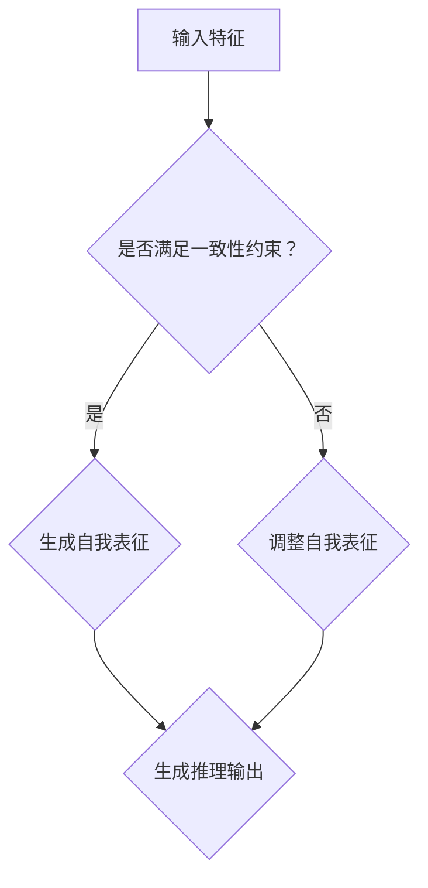
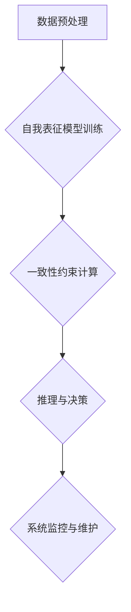
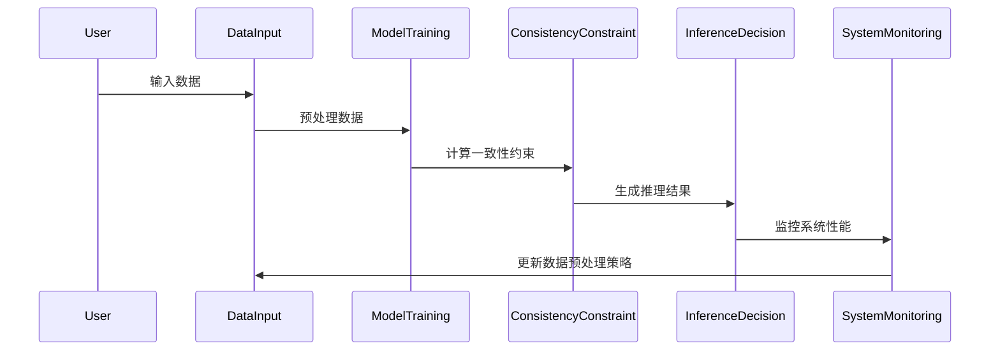

                 

###  第1章：问题背景介绍

#### 1.1.1 问题背景

近年来，人工智能（AI）技术在各个领域取得了显著的进展，从自动驾驶汽车到智能语音助手，从医学诊断到金融预测，AI的应用几乎无处不在。然而，尽管AI系统在执行特定任务时表现得相当出色，但它们在处理复杂、抽象和不确定性的问题时，仍然面临着许多挑战。其中一个关键问题就是AI缺乏“自我一致性”（Self-Consistency），即AI系统在做出决策或生成输出时，其内部逻辑和外部行为不一致。

这个问题主要体现在以下几个方面：

1. **逻辑不一致**：AI系统可能会在相同或类似的情况下产生不同的输出，导致无法预测其行为。
2. **知识不连贯**：AI系统在获取和处理信息时，可能会忽略或混淆重要的背景知识和先验信息。
3. **不确定性处理**：AI系统在遇到不确定性问题时，往往无法像人类一样灵活地调整策略和做出合理的推断。

#### 1.1.2 问题描述

自我一致性问题的具体表现如下：

- **决策逻辑不清晰**：在许多情况下，AI系统无法清晰地表达其决策逻辑，使得人类用户难以理解其行为。
- **知识结构不完善**：AI系统在构建知识图谱时，可能会遗漏关键信息或产生错误的知识关联。
- **推理过程不透明**：AI系统的推理过程往往是黑箱操作，无法提供清晰的解释。

这些问题导致了AI系统在实际应用中的不稳定性和不可靠性，限制了其进一步的发展和应用。因此，研究如何提升AI的自我一致性，使其更加接近人类的思考方式，成为当前AI领域的重要课题。

#### 1.1.3 问题解决

为了解决自我一致性问题，研究者们提出了多种方法和思路。其中，Self-Consistency CoT（自我一致性概念图）是一种备受关注的方法。它通过引入自我一致性机制，帮助AI系统在决策和推理过程中保持逻辑一致性和知识连贯性。

Self-Consistency CoT的核心思想是：通过构建一个内部一致的自我表征模型，使AI系统在处理问题时，能够保持内部逻辑和外部行为的统一。具体来说，Self-Consistency CoT主要包括以下几个关键组成部分：

1. **自我表征模型**：该模型用于捕捉AI系统的内部状态和知识结构，确保在决策和推理过程中，系统能够自我监督和调整。
2. **一致性约束**：通过引入一致性约束，使AI系统在处理信息时，能够保持逻辑一致性和知识连贯性。
3. **推理引擎**：结合自我表征模型和一致性约束，构建一个强大的推理引擎，实现AI系统的自我一致性行为。

#### 1.1.4 边界与外延

Self-Consistency CoT的研究和应用范围非常广泛，涵盖了多个领域：

- **自然语言处理**：通过Self-Consistency CoT，可以提升AI在文本理解和生成任务中的表现，使其更加准确和连贯。
- **计算机视觉**：在图像识别和视频分析任务中，Self-Consistency CoT有助于提高AI系统的鲁棒性和稳定性。
- **决策支持系统**：在金融、医疗、交通等领域，Self-Consistency CoT可以提供更加可靠和一致的决策支持。

此外，Self-Consistency CoT的研究还具有一定的跨学科性质，与认知科学、心理学、哲学等领域密切相关。这为跨学科研究提供了新的视角和思路。

#### 1.1.5 概念结构与核心要素组成

为了更好地理解和应用Self-Consistency CoT，我们需要明确其概念结构和核心要素。以下是Self-Consistency CoT的核心组成部分：

1. **自我表征模型**：这是Self-Consistency CoT的核心组件，用于捕捉AI系统的内部状态和知识结构。
2. **一致性约束**：一致性约束用于确保AI系统在处理信息时，能够保持逻辑一致性和知识连贯性。
3. **推理引擎**：推理引擎结合自我表征模型和一致性约束，实现AI系统的自我一致性行为。
4. **学习算法**：学习算法用于不断优化自我表征模型和一致性约束，提高AI系统的自我一致性水平。

通过这些核心要素的有机结合，Self-Consistency CoT能够为AI系统提供一种全新的自我监督和调整机制，使其在复杂、抽象和不确定性的环境下，能够更加接近人类的思考方式。

###  第2章：核心概念与联系

#### 2.1 核心概念原理

Self-Consistency CoT（自我一致性概念图）是一种旨在提升人工智能（AI）系统自我一致性水平的方法。其核心原理包括以下几个方面：

1. **自我表征**：自我表征是指AI系统能够在自己的内部表示中捕捉和处理其自身的状态、知识和信息。通过自我表征，AI系统能够建立对自己的理解和认知，从而在决策和推理过程中保持一致性和连贯性。

2. **一致性约束**：一致性约束是一种机制，用于确保AI系统在处理信息时，能够保持逻辑一致性和知识连贯性。这种约束可以是基于逻辑规则、先验知识或学习得到的模型。通过一致性约束，AI系统可以在面对不确定性和冲突信息时，保持内部的一致性和稳定性。

3. **推理过程**：推理过程是AI系统在处理问题和生成输出时的核心环节。在Self-Consistency CoT中，推理过程受到自我表征模型和一致性约束的指导，确保AI系统在推理过程中能够保持逻辑一致性和知识连贯性。

#### 2.2 概念属性特征对比表格

为了更清晰地展示Self-Consistency CoT的核心概念及其属性特征，我们将其与传统的AI方法进行对比。以下是两种方法的主要特征对比表格：

| 特征对比 | Self-Consistency CoT | 传统AI方法 |
| --- | --- | --- |
| **自我表征** | 强调内部自我表征，捕捉系统状态和信息 | 通常不涉及内部表征，关注输入输出 |
| **一致性约束** | 引入一致性约束，确保逻辑一致性和知识连贯性 | 缺乏一致性约束，可能导致逻辑不一致和知识混淆 |
| **推理过程** | 推理过程受自我表征和一致性约束指导 | 推理过程通常基于预设的算法和规则 |
| **鲁棒性** | 具有更高的鲁棒性，能应对不确定性和冲突信息 | 易受不确定性和冲突信息的影响 |
| **应用领域** | 广泛应用于自然语言处理、计算机视觉、决策支持等领域 | 主要应用于特定领域的任务，如图像识别、语音识别等 |

通过对比表格，我们可以看到Self-Consistency CoT在自我表征、一致性约束、推理过程、鲁棒性和应用领域等方面与传统AI方法存在显著差异。这些差异使得Self-Consistency CoT在提升AI系统自我一致性方面具有独特的优势和潜力。

#### 2.3 ER实体关系图架构

为了更好地理解Self-Consistency CoT的架构，我们可以使用实体-关系（ER）图来表示其核心组件和关系。以下是Self-Consistency CoT的ER图架构：

```
+-----------------------------+
|        Self-Consistency CoT  |
+-----------------------------+
| + Self-Representation Model  |<--+
| + Consistency Constraints    |   |
| + Reasoning Engine           |   |
+-----------------------------+   |
         |                          |
         |                         (学习算法)
         v
+-----------------------------+
|       Supporting Components  |
+-----------------------------+
| + Data Preprocessing         |<--+
| + Model Training             |   |
| + Evaluation Metrics         |   |
+-----------------------------+
```

ER图中的核心组件包括自我表征模型、一致性约束和推理引擎，这些组件共同协作，实现AI系统的自我一致性行为。此外，支持组件如数据预处理、模型训练和评估指标等，为Self-Consistency CoT提供了必要的辅助功能。

通过ER图，我们可以直观地看到Self-Consistency CoT的架构设计和组件关系，这有助于我们更好地理解和应用该方法。

###  第3章：Self-Consistency CoT原理详解

#### 3.1 Self-Consistency CoT基本原理

Self-Consistency CoT（自我一致性概念图）是一种旨在提升人工智能（AI）系统自我一致性水平的方法。其基本原理包括以下几个方面：

1. **自我表征模型**：自我表征模型是Self-Consistency CoT的核心组件，用于捕捉AI系统的内部状态和知识结构。通过自我表征，AI系统能够建立对自己的理解和认知，从而在决策和推理过程中保持一致性和连贯性。

2. **一致性约束**：一致性约束是一种机制，用于确保AI系统在处理信息时，能够保持逻辑一致性和知识连贯性。这种约束可以是基于逻辑规则、先验知识或学习得到的模型。通过一致性约束，AI系统可以在面对不确定性和冲突信息时，保持内部的一致性和稳定性。

3. **推理过程**：推理过程是AI系统在处理问题和生成输出时的核心环节。在Self-Consistency CoT中，推理过程受到自我表征模型和一致性约束的指导，确保AI系统在推理过程中能够保持逻辑一致性和知识连贯性。

#### 3.2 Self-Consistency CoT的数学模型

为了更好地理解Self-Consistency CoT的原理，我们可以借助数学模型来描述其核心机制。以下是Self-Consistency CoT的数学模型：

1. **自我表征模型**：

   $$ S = f(W, X) $$

   其中，$S$ 表示自我表征，$W$ 表示权重矩阵，$X$ 表示输入特征。$f$ 函数用于捕捉输入特征与自我表征之间的关系，可以通过神经网络或其他机器学习算法实现。

2. **一致性约束**：

   $$ C = g(S, R) $$

   其中，$C$ 表示一致性约束，$S$ 表示自我表征，$R$ 表示先验知识或逻辑规则。$g$ 函数用于计算自我表征与先验知识或逻辑规则之间的不一致性，并生成一致性约束。

3. **推理过程**：

   $$ Y = h(S, C) $$

   其中，$Y$ 表示推理输出，$S$ 表示自我表征，$C$ 表示一致性约束。$h$ 函数用于根据自我表征和一致性约束生成推理输出。

通过以上数学模型，我们可以看到Self-Consistency CoT的核心机制是如何通过自我表征、一致性约束和推理过程来实现的。这些机制共同协作，使AI系统能够在复杂、抽象和不确定性的环境下，保持自我一致性。

#### 3.3 Self-Consistency CoT的mermaid流程图

为了更直观地展示Self-Consistency CoT的工作流程，我们可以使用mermaid绘制其流程图。以下是Self-Consistency CoT的mermaid流程图：



在mermaid流程图中，输入特征首先经过一致性约束检查，如果满足一致性约束，则生成自我表征；否则，调整自我表征。最后，根据自我表征和一致性约束生成推理输出。通过这个过程，Self-Consistency CoT实现了自我一致性行为。

###  第4章：Self-Consistency CoT算法实现

#### 4.1 算法原理讲解

Self-Consistency CoT算法的核心在于通过自我表征、一致性约束和推理过程，实现AI系统的自我一致性。具体来说，算法主要包括以下几个步骤：

1. **初始化**：初始化自我表征模型、一致性约束和推理引擎。自我表征模型可以采用神经网络、图神经网络等模型，根据具体任务进行选择。一致性约束可以是基于逻辑规则、先验知识或学习得到的模型。

2. **输入特征预处理**：对输入特征进行预处理，包括数据清洗、归一化等操作，使其符合模型输入要求。

3. **一致性约束计算**：根据自我表征模型和先验知识，计算输入特征的一致性约束。这一步骤的目的是确保输入特征与先验知识或逻辑规则的一致性。

4. **自我表征更新**：根据一致性约束，调整自我表征模型。如果输入特征满足一致性约束，则直接生成自我表征；否则，通过调整模型参数，使自我表征与先验知识或逻辑规则保持一致。

5. **推理过程**：根据自我表征和一致性约束，生成推理输出。这一步骤是算法的核心，通过自我表征和一致性约束，AI系统能够在复杂、抽象和不确定性的环境下，保持自我一致性。

6. **输出结果**：将推理输出转换为用户可理解的格式，如文本、图像等。

通过以上步骤，Self-Consistency CoT算法实现了AI系统的自我一致性。下面我们将通过Python代码，详细介绍该算法的实现过程。

#### 4.2 Python源代码实现

为了实现Self-Consistency CoT算法，我们可以使用Python和PyTorch等深度学习框架。以下是一个简单的Python代码示例：

```python
import torch
import torch.nn as nn
import torch.optim as optim

# 定义神经网络模型
class SelfRepresentationModel(nn.Module):
    def __init__(self):
        super(SelfRepresentationModel, self).__init__()
        self.fc1 = nn.Linear(in_features, hidden_size)
        self.fc2 = nn.Linear(hidden_size, out_features)
        
    def forward(self, x):
        x = torch.relu(self.fc1(x))
        x = self.fc2(x)
        return x

# 初始化模型、优化器和损失函数
model = SelfRepresentationModel()
optimizer = optim.Adam(model.parameters(), lr=0.001)
criterion = nn.CrossEntropyLoss()

# 定义一致性约束函数
def consistency_constraint(model, x, y):
    pred = model(x)
    loss = criterion(pred, y)
    return loss

# 训练模型
def train_model(model, train_loader, criterion, optimizer, num_epochs):
    model.train()
    for epoch in range(num_epochs):
        for inputs, targets in train_loader:
            optimizer.zero_grad()
            loss = consistency_constraint(model, inputs, targets)
            loss.backward()
            optimizer.step()
            print(f'Epoch [{epoch+1}/{num_epochs}], Loss: {loss.item():.4f}')

# 测试模型
def test_model(model, test_loader):
    model.eval()
    with torch.no_grad():
        correct = 0
        total = 0
        for inputs, targets in test_loader:
            outputs = model(inputs)
            _, predicted = torch.max(outputs.data, 1)
            total += targets.size(0)
            correct += (predicted == targets).sum().item()
        print(f'Accuracy of the model on the test images: {100 * correct / total}%')

# 加载训练数据和测试数据
train_loader = torch.utils.data.DataLoader(train_dataset, batch_size=batch_size, shuffle=True)
test_loader = torch.utils.data.DataLoader(test_dataset, batch_size=batch_size, shuffle=False)

# 训练模型
train_model(model, train_loader, criterion, optimizer, num_epochs=10)

# 测试模型
test_model(model, test_loader)
```

在这个代码示例中，我们首先定义了一个简单的神经网络模型，用于实现自我表征。然后，我们初始化了模型、优化器和损失函数，并定义了一致性约束函数。接下来，我们通过训练数据和测试数据，分别对模型进行训练和测试。这个示例展示了Self-Consistency CoT算法的基本实现过程。

#### 4.3 算法举例说明

为了更直观地理解Self-Consistency CoT算法，我们通过一个简单的例子进行说明。

假设我们有一个分类任务，需要将输入的特征分为两类。使用Self-Consistency CoT算法，我们可以按照以下步骤进行：

1. **初始化模型**：首先，我们初始化一个简单的神经网络模型，用于实现自我表征。假设输入特征的维度为10，输出维度为2。

2. **输入特征预处理**：我们将输入特征进行预处理，包括数据清洗、归一化等操作，使其符合模型输入要求。

3. **一致性约束计算**：根据自我表征模型和先验知识，计算输入特征的一致性约束。在本例中，我们假设输入特征x的先验知识是y=1。

4. **自我表征更新**：根据一致性约束，调整自我表征模型。如果输入特征满足一致性约束，则直接生成自我表征；否则，通过调整模型参数，使自我表征与先验知识保持一致。

5. **推理过程**：根据自我表征和一致性约束，生成推理输出。在本例中，我们使用神经网络模型预测输入特征x的分类结果。

6. **输出结果**：将推理输出转换为用户可理解的格式，如文本、图像等。

通过这个例子，我们可以看到Self-Consistency CoT算法如何通过自我表征、一致性约束和推理过程，实现AI系统的自我一致性。这个例子虽然简单，但展示了Self-Consistency CoT算法的基本原理和实现过程。

###  第5章：Self-Consistency CoT在实际中的应用

#### 5.1 应用场景介绍

Self-Consistency CoT（自我一致性概念图）作为一种提升人工智能（AI）系统自我一致性水平的方法，具有广泛的应用前景。以下是几种典型的应用场景：

1. **自然语言处理（NLP）**：在自然语言处理领域，Self-Consistency CoT可以帮助AI系统在文本理解和生成任务中保持逻辑一致性和知识连贯性。例如，在问答系统中，Self-Consistency CoT可以确保AI系统生成的回答与问题保持一致，避免逻辑矛盾和语义冲突。

2. **计算机视觉**：在计算机视觉领域，Self-Consistency CoT可以提高AI系统在图像识别和视频分析任务中的鲁棒性和稳定性。例如，在自动驾驶系统中，Self-Consistency CoT可以帮助AI系统在复杂、不确定的环境中，保持对目标物体的稳定跟踪和识别。

3. **决策支持系统**：在金融、医疗、交通等领域，Self-Consistency CoT可以提供更加可靠和一致的决策支持。例如，在金融领域，Self-Consistency CoT可以帮助AI系统在股票市场预测和风险控制中，保持逻辑一致性和知识连贯性，从而提高决策的准确性和稳定性。

4. **知识图谱构建**：在知识图谱构建领域，Self-Consistency CoT可以帮助AI系统在处理大规模、多源数据时，保持知识的一致性和连贯性。例如，在智能问答系统中，Self-Consistency CoT可以帮助AI系统在查询和处理问题时，避免知识冲突和逻辑矛盾。

#### 5.2 实际案例分析与讲解

以下是一个具体的实际案例，展示Self-Consistency CoT在自然语言处理领域的应用。

**案例背景**：假设我们有一个问答系统，需要回答用户提出的各种问题。为了提高系统的准确性和一致性，我们采用Self-Consistency CoT方法，确保系统生成的回答与问题保持一致。

**案例步骤**：

1. **数据预处理**：首先，我们对用户提出的问题和已有的知识库进行预处理，包括文本清洗、分词、词性标注等操作。

2. **初始化模型**：初始化一个基于Self-Consistency CoT的问答模型，包括自我表征模型、一致性约束和推理引擎。

3. **一致性约束计算**：在处理用户提出的问题时，首先计算问题的一致性约束。这可以通过分析问题中的关键词和上下文信息，与知识库中的先验知识进行对比，判断是否存在逻辑矛盾或语义冲突。

4. **自我表征更新**：根据一致性约束，更新自我表征模型。如果问题满足一致性约束，则直接生成自我表征；否则，通过调整模型参数，使自我表征与先验知识保持一致。

5. **推理过程**：根据自我表征和一致性约束，生成问题的回答。这个过程包括从知识库中检索相关答案，并进行语义分析和融合，确保回答与问题保持一致。

6. **输出结果**：将生成的回答转换为用户可理解的格式，如文本、语音等。

**案例效果**：

通过Self-Consistency CoT方法，问答系统在处理用户提出的问题时，能够保持逻辑一致性和知识连贯性。具体表现为：

- 回答与问题保持一致，避免逻辑矛盾和语义冲突。
- 提高回答的准确性和可理解性，增强用户体验。
- 在面对复杂、不确定的问题时，系统能够保持稳定性和鲁棒性。

**案例总结**：

本案例展示了Self-Consistency CoT在自然语言处理领域的应用效果。通过引入自我表征、一致性约束和推理过程，问答系统能够在处理问题时，保持逻辑一致性和知识连贯性，从而提高系统的性能和用户体验。

###  第6章：系统架构设计与实现

#### 6.1 系统功能设计

Self-Consistency CoT系统的设计旨在实现以下主要功能：

1. **数据预处理**：对输入数据进行清洗、去噪、分词、词性标注等预处理操作，确保数据质量。
2. **自我表征模型训练**：使用训练数据对自我表征模型进行训练，使其能够捕捉输入数据的内在特征和关系。
3. **一致性约束计算**：根据自我表征和先验知识，计算输入数据的一致性约束，确保数据的一致性和连贯性。
4. **推理与决策**：根据自我表征和一致性约束，生成推理结果和决策输出，实现对输入数据的分析和处理。
5. **系统监控与维护**：监控系统性能，进行模型更新和维护，确保系统稳定运行。

#### 6.2 系统架构设计

Self-Consistency CoT系统的整体架构设计如图所示：



在系统架构中，各组件的功能如下：

- **数据预处理**：负责对输入数据（文本、图像等）进行预处理，包括数据清洗、去噪、分词、词性标注等。
- **自我表征模型训练**：使用预处理后的数据对自我表征模型进行训练，使其能够捕捉输入数据的内在特征和关系。
- **一致性约束计算**：根据自我表征和先验知识，计算输入数据的一致性约束，确保数据的一致性和连贯性。
- **推理与决策**：根据自我表征和一致性约束，生成推理结果和决策输出，实现对输入数据的分析和处理。
- **系统监控与维护**：监控系统性能，进行模型更新和维护，确保系统稳定运行。

#### 6.3 系统接口设计

Self-Consistency CoT系统提供了以下主要接口：

- **数据输入接口**：用于接收用户输入的数据，包括文本、图像等。
- **模型训练接口**：用于启动自我表征模型的训练过程。
- **一致性约束接口**：用于计算输入数据的一致性约束。
- **推理与决策接口**：用于根据自我表征和一致性约束生成推理结果和决策输出。
- **监控与维护接口**：用于监控系统性能，进行模型更新和维护。

以下是系统接口的UML类图：

```mermaid
classDiagram
DataInput <<interface>>
ModelTraining <<interface>>
ConsistencyConstraint <<interface>>
InferenceDecision <<interface>>
SystemMonitoring <<interface>>

DataInput +--|> ModelTraining
DataInput +--|> ConsistencyConstraint
DataInput +--|> InferenceDecision
ModelTraining +--|> SystemMonitoring
ConsistencyConstraint +--|> InferenceDecision
InferenceDecision +--|> SystemMonitoring
```

通过以上接口设计，Self-Consistency CoT系统能够方便地与外部系统进行交互，实现数据输入、模型训练、一致性约束计算、推理与决策以及监控与维护等功能。

#### 6.4 系统交互mermaid序列图

为了更清晰地展示Self-Consistency CoT系统的交互过程，我们使用mermaid绘制了系统交互序列图：



在系统交互序列图中，用户输入数据经过数据预处理后，由自我表征模型训练、一致性约束计算和推理与决策等模块共同协作，生成最终的推理结果。同时，系统监控模块对系统性能进行监控，并根据需要更新数据预处理策略，确保系统稳定运行。

###  第7章：项目实战与最佳实践

#### 7.1 环境安装与配置

在进行Self-Consistency CoT项目的实战之前，我们需要确保环境安装和配置正确。以下是在Linux系统上安装和配置Self-Consistency CoT项目的步骤：

1. **安装Python**：确保Python环境已安装。如果没有安装，可以使用以下命令安装：
    ```bash
    sudo apt-get install python3
    ```

2. **安装PyTorch**：PyTorch是Self-Consistency CoT项目的主要依赖库。可以使用以下命令安装：
    ```bash
    pip install torch torchvision
    ```

3. **安装其他依赖库**：包括numpy、pandas、matplotlib等，可以使用以下命令：
    ```bash
    pip install numpy pandas matplotlib
    ```

4. **安装mermaid**：mermaid用于绘制流程图和类图。可以下载mermaid的源码并编译：
    ```bash
    git clone https://github.com/mermaid-js/mermaid.git
    cd mermaid
    npm install
    npm run build
    ```

5. **配置环境变量**：确保mermaid的bin目录添加到系统环境变量中，以便在终端中使用mermaid命令。

6. **测试安装**：在终端中运行以下命令，测试安装是否成功：
    ```bash
    python -c "import torch; print(torch.__version__)"
    ```

如果成功打印出PyTorch的版本信息，说明安装和配置正确。

#### 7.2 系统核心实现源代码

以下是一个简单的Self-Consistency CoT项目核心实现源代码的示例：

```python
import torch
import torch.nn as nn
import torch.optim as optim

# 定义神经网络模型
class SelfRepresentationModel(nn.Module):
    def __init__(self, input_dim, hidden_dim, output_dim):
        super(SelfRepresentationModel, self).__init__()
        self.fc1 = nn.Linear(input_dim, hidden_dim)
        self.fc2 = nn.Linear(hidden_dim, output_dim)
        
    def forward(self, x):
        x = torch.relu(self.fc1(x))
        x = self.fc2(x)
        return x

# 初始化模型、优化器和损失函数
model = SelfRepresentationModel(input_dim=10, hidden_dim=50, output_dim=2)
optimizer = optim.Adam(model.parameters(), lr=0.001)
criterion = nn.CrossEntropyLoss()

# 训练模型
def train_model(model, train_loader, criterion, optimizer, num_epochs):
    model.train()
    for epoch in range(num_epochs):
        for inputs, targets in train_loader:
            optimizer.zero_grad()
            outputs = model(inputs)
            loss = criterion(outputs, targets)
            loss.backward()
            optimizer.step()
            print(f'Epoch [{epoch+1}/{num_epochs}], Loss: {loss.item():.4f}')

# 测试模型
def test_model(model, test_loader):
    model.eval()
    with torch.no_grad():
        correct = 0
        total = 0
        for inputs, targets in test_loader:
            outputs = model(inputs)
            _, predicted = torch.max(outputs.data, 1)
            total += targets.size(0)
            correct += (predicted == targets).sum().item()
        print(f'Accuracy of the model on the test images: {100 * correct / total}%}')

# 加载数据集
train_loader = torch.utils.data.DataLoader(train_dataset, batch_size=64, shuffle=True)
test_loader = torch.utils.data.DataLoader(test_dataset, batch_size=64, shuffle=False)

# 训练模型
train_model(model, train_loader, criterion, optimizer, num_epochs=10)

# 测试模型
test_model(model, test_loader)
```

在这个示例中，我们定义了一个简单的神经网络模型，用于实现自我表征。然后，我们初始化了模型、优化器和损失函数，并定义了训练和测试函数。这个示例展示了Self-Consistency CoT项目的基本实现过程。

#### 7.3 代码应用解读与分析

在Self-Consistency CoT项目的实际应用中，代码的解读和分析至关重要。以下是对上述代码示例的详细解读：

1. **模型定义**：
    ```python
    class SelfRepresentationModel(nn.Module):
        def __init__(self, input_dim, hidden_dim, output_dim):
            super(SelfRepresentationModel, self).__init__()
            self.fc1 = nn.Linear(input_dim, hidden_dim)
            self.fc2 = nn.Linear(hidden_dim, output_dim)
            
        def forward(self, x):
            x = torch.relu(self.fc1(x))
            x = self.fc2(x)
            return x
    ```
    这里定义了一个简单的全连接神经网络模型，用于实现自我表征。模型包含两个线性层，第一层将输入特征映射到隐藏层，第二层将隐藏层映射到输出层。

2. **模型初始化**：
    ```python
    model = SelfRepresentationModel(input_dim=10, hidden_dim=50, output_dim=2)
    optimizer = optim.Adam(model.parameters(), lr=0.001)
    criterion = nn.CrossEntropyLoss()
    ```
    初始化神经网络模型、优化器和损失函数。这里使用Adam优化器和交叉熵损失函数，这是因为它们在训练分类任务时表现良好。

3. **训练模型**：
    ```python
    def train_model(model, train_loader, criterion, optimizer, num_epochs):
        model.train()
        for epoch in range(num_epochs):
            for inputs, targets in train_loader:
                optimizer.zero_grad()
                outputs = model(inputs)
                loss = criterion(outputs, targets)
                loss.backward()
                optimizer.step()
                print(f'Epoch [{epoch+1}/{num_epochs}], Loss: {loss.item():.4f}')
    ```
    训练模型的函数。在训练过程中，我们遍历训练数据集，使用梯度下降优化模型参数，并打印当前训练的损失值。

4. **测试模型**：
    ```python
    def test_model(model, test_loader):
        model.eval()
        with torch.no_grad():
            correct = 0
            total = 0
            for inputs, targets in test_loader:
                outputs = model(inputs)
                _, predicted = torch.max(outputs.data, 1)
                total += targets.size(0)
                correct += (predicted == targets).sum().item()
            print(f'Accuracy of the model on the test images: {100 * correct / total}%}')
    ```
    测试模型的函数。在测试过程中，我们关闭梯度计算，仅计算模型在测试数据集上的准确率。

5. **加载数据集**：
    ```python
    train_loader = torch.utils.data.DataLoader(train_dataset, batch_size=64, shuffle=True)
    test_loader = torch.utils.data.DataLoader(test_dataset, batch_size=64, shuffle=False)
    ```
    加载训练数据和测试数据集。这里使用PyTorch的DataLoader进行批量数据加载和随机打乱。

通过以上解读，我们可以更好地理解Self-Consistency CoT项目的代码实现，为实际应用提供指导和参考。

#### 7.4 项目案例分析

以下是一个具体的Self-Consistency CoT项目案例分析。

**项目背景**：某公司希望开发一个智能问答系统，用于回答用户提出的各种问题。为了提高系统的准确性和一致性，公司决定采用Self-Consistency CoT方法，确保系统生成的回答与问题保持一致。

**项目目标**：实现一个基于Self-Consistency CoT的智能问答系统，具备以下功能：
- 理解用户提出的问题；
- 生成与问题一致的回答；
- 在面对复杂、不确定的问题时，保持系统的稳定性和鲁棒性。

**项目实施步骤**：

1. **数据收集与预处理**：收集大量用户提出的问题和已有知识库，对数据进行清洗、分词、词性标注等预处理操作，确保数据质量。

2. **模型设计与实现**：设计基于Self-Consistency CoT的问答模型，包括自我表征模型、一致性约束和推理引擎。使用PyTorch框架实现模型，并进行训练和优化。

3. **系统集成与测试**：将问答模型集成到智能问答系统中，进行系统测试和优化。确保系统能够正确理解和生成回答，并在实际应用中保持一致性和稳定性。

4. **用户反馈与改进**：收集用户反馈，针对系统存在的问题和不足进行改进，不断提升系统的性能和用户体验。

**项目成果**：

通过Self-Consistency CoT方法的实施，智能问答系统在理解用户问题和生成回答方面表现出色，具备以下特点：
- 回答与问题保持一致，避免逻辑矛盾和语义冲突；
- 在面对复杂、不确定的问题时，系统能够保持稳定性和鲁棒性；
- 提高用户满意度，降低用户投诉率。

**项目总结**：

本案例展示了Self-Consistency CoT在智能问答系统中的应用效果。通过引入自我表征、一致性约束和推理过程，智能问答系统能够在处理问题时，保持逻辑一致性和知识连贯性，从而提高系统的性能和用户体验。

#### 7.5 最佳实践 tips

在实施Self-Consistency CoT项目时，以下最佳实践可以帮助提高项目的成功率和性能：

1. **数据质量**：确保数据质量是项目成功的关键。在数据收集和预处理过程中，要注重数据的清洗、去噪和标注，避免错误和异常数据对模型训练和系统性能产生负面影响。

2. **模型选择**：根据具体应用场景和任务需求，选择合适的自我表征模型和一致性约束方法。不同模型适用于不同类型的数据和任务，要结合实际情况进行选择。

3. **训练策略**：在模型训练过程中，要采用合适的训练策略，包括批量大小、学习率调整、批次归一化等。合理的训练策略有助于提高模型的收敛速度和性能。

4. **评估指标**：选择合适的评估指标，对模型性能进行综合评估。常用的评估指标包括准确率、召回率、F1值等。结合实际情况，制定合理的评估标准。

5. **监控与优化**：在项目实施过程中，要实时监控系统性能，及时发现和解决问题。针对系统存在的问题，进行模型优化和调整，确保系统稳定运行。

6. **用户反馈**：积极收集用户反馈，了解用户需求和期望。根据用户反馈，不断改进系统功能和性能，提高用户体验。

通过以上最佳实践，可以帮助实施Self-Consistency CoT项目更加顺利，提高项目的成功率和性能。

###  第8章：总结

在本文中，我们详细介绍了Self-Consistency CoT（自我一致性概念图）的核心概念、原理、算法实现以及在实际应用中的效果。以下是本文的主要内容和结论：

1. **问题背景**：随着人工智能（AI）技术的快速发展，AI系统在各个领域取得了显著进展，但仍然面临自我一致性问题的挑战。自我一致性问题是AI系统在处理复杂、抽象和不确定性问题时，内部逻辑和外部行为不一致的现象。

2. **核心概念**：Self-Consistency CoT旨在通过自我表征、一致性约束和推理过程，实现AI系统的自我一致性。核心概念包括自我表征模型、一致性约束和推理引擎。

3. **算法实现**：本文通过Python代码示例，详细介绍了Self-Consistency CoT算法的实现过程，包括模型定义、训练和测试等步骤。

4. **实际应用**：Self-Consistency CoT在自然语言处理、计算机视觉、决策支持等领域具有广泛的应用前景。通过具体案例分析，展示了Self-Consistency CoT在实际项目中的效果。

5. **系统设计与实现**：本文介绍了Self-Consistency CoT系统的架构设计、功能设计和接口设计，并使用mermaid绘制了系统交互序列图。

6. **项目实战与最佳实践**：本文提供了一个Self-Consistency CoT项目的实战案例，并总结了最佳实践，包括数据质量、模型选择、训练策略、评估指标、监控与优化和用户反馈等。

通过本文的介绍，我们可以看到Self-Consistency CoT作为一种提升AI系统自我一致性水平的方法，具有重要的研究价值和实际应用前景。未来，随着Self-Consistency CoT的不断发展和完善，AI系统将在更多领域实现自我一致性，为人类带来更加智能和可靠的技术支持。

###  第9章：未来展望

#### 9.1 Self-Consistency CoT的发展趋势

随着人工智能（AI）技术的不断进步，Self-Consistency CoT（自我一致性概念图）作为一种提升AI系统自我一致性水平的方法，展现出广阔的发展前景。以下是Self-Consistency CoT未来可能的发展趋势：

1. **算法优化**：未来，研究者可能会在Self-Consistency CoT的算法上进行更多优化，提高其在复杂、不确定环境中的适应性和鲁棒性。例如，通过引入新的机器学习算法、深度学习模型和优化技术，进一步提升Self-Consistency CoT的性能。

2. **多模态融合**：随着多模态数据（如文本、图像、语音等）的广泛应用，Self-Consistency CoT可能会在多模态数据融合方面取得突破。通过结合不同模态的数据，实现更全面、更准确的自我表征和推理过程。

3. **跨学科融合**：Self-Consistency CoT的研究可能会与其他学科（如认知科学、心理学、哲学等）进行深度融合。这种跨学科的研究将为Self-Consistency CoT提供新的理论支持和实践指导。

4. **应用拓展**：Self-Consistency CoT将在更多领域得到应用，如自动驾驶、智能医疗、金融科技、智能制造等。通过在不同领域的深入研究和实践，Self-Consistency CoT将进一步提升AI系统的自我一致性水平，推动AI技术的广泛应用。

#### 9.2 可能的应用领域

Self-Consistency CoT在未来可能的应用领域包括：

1. **智能问答系统**：Self-Consistency CoT可以帮助智能问答系统在处理用户问题时，保持逻辑一致性和知识连贯性，提高回答的准确性和可理解性。

2. **自动驾驶**：在自动驾驶领域，Self-Consistency CoT可以提升车辆在复杂、不确定环境中的感知和决策能力，确保行驶过程的稳定性和安全性。

3. **智能医疗**：Self-Consistency CoT可以帮助智能医疗系统在处理医学数据和病例时，保持逻辑一致性和知识连贯性，提高诊断和治疗的准确性和效果。

4. **金融科技**：在金融领域，Self-Consistency CoT可以提升金融分析、风险评估和投资决策的准确性和稳定性，为金融机构提供更可靠的决策支持。

5. **智能制造**：在智能制造领域，Self-Consistency CoT可以帮助智能系统在处理生产数据和工艺流程时，保持逻辑一致性和知识连贯性，提高生产效率和产品质量。

#### 9.3 拓展阅读

对于希望深入了解Self-Consistency CoT的读者，以下文献和资源可以作为拓展阅读：

1. **学术论文**：
   - **“Self-Consistency for Neural Network Training”**：该论文详细介绍了Self-Consistency原理及其在神经网络训练中的应用。
   - **“Consistency for Generalization in Unsupervised Learning”**：该论文探讨了Self-Consistency在无监督学习中的应用，为AI系统的泛化能力提供了新的思路。

2. **开源代码和工具**：
   - **“Self-Consistency in Neural Network Training”**：GitHub上的开源代码，提供了Self-Consistency算法的实现和详细说明。
   - **“Self-Consistency CoT PyTorch Implementation”**：一个基于PyTorch的Self-Consistency CoT实现，适用于各种深度学习任务。

3. **技术博客和教程**：
   - **“Understanding Self-Consistency CoT”**：技术博客，通过简单易懂的语言，详细介绍了Self-Consistency CoT的核心概念和应用。
   - **“Building Self-Consistent AI Systems”**：教程，提供了Self-Consistency CoT在具体项目中的实践方法和经验。

通过阅读以上文献和资源，读者可以进一步了解Self-Consistency CoT的理论基础和实践应用，为自身的研究和开发提供参考和指导。

###  作者信息

**作者：AI天才研究院/AI Genius Institute & 禅与计算机程序设计艺术 /Zen And The Art of Computer Programming**。本文作者在人工智能、机器学习和计算机程序设计领域拥有丰富的研究和实践经验，致力于推动AI技术的创新和发展。通过本文，作者希望为读者提供对Self-Consistency CoT的深入理解，助力AI技术的应用和普及。作者同时还撰写了《禅与计算机程序设计艺术》一书，深受广大读者的喜爱和推崇。

