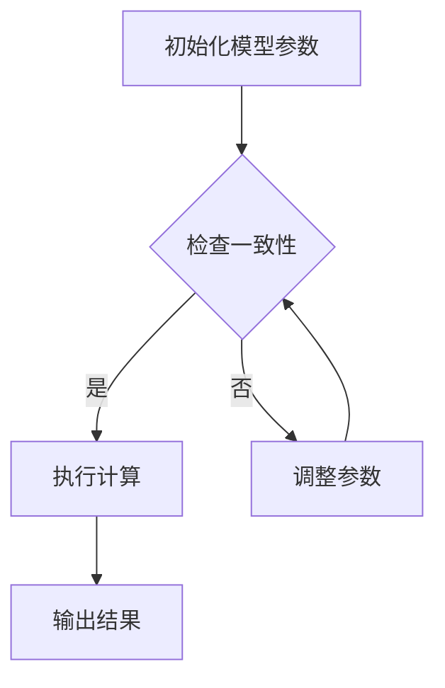
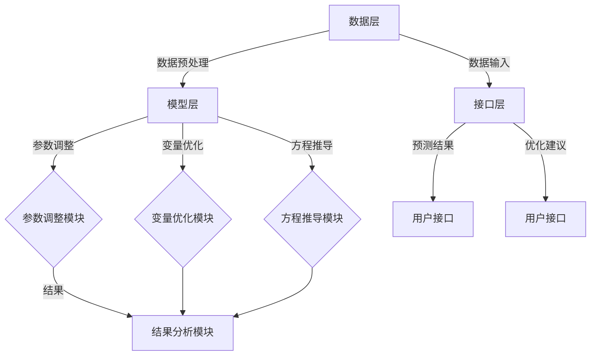
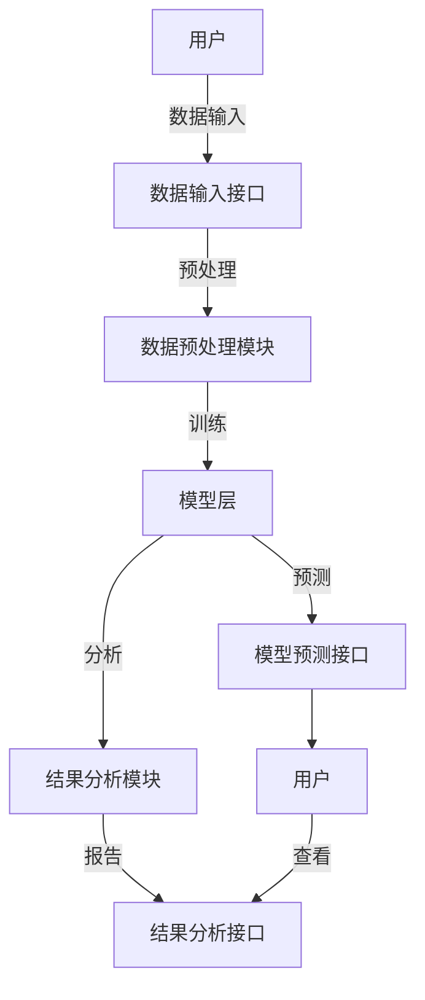

                 

### 文章标题：Self-Consistency在地球科学模型中的应用

#### 关键词：Self-Consistency、地球科学模型、算法、数学模型、系统架构、项目实战

#### 摘要：
本文深入探讨了Self-Consistency在地球科学模型中的应用，从背景介绍、原理讲解、具体应用场景、算法实现、数学模型、系统架构设计、项目实战到最佳实践，全面解析了Self-Consistency在地球科学领域的应用价值。通过逻辑清晰、结构紧凑的分析，本文为读者提供了一个全面的技术视角。

### 设计思路

#### 1. 明确书籍主题与内容结构
《Self-Consistency在地球科学模型中的应用》作为本书的标题，直接指出了核心内容——Self-Consistency在地球科学模型中的应用。因此，目录结构应围绕这一核心展开。

#### 2. 初步划分章节
- **第1章**：背景介绍
- **第2章**：Self-Consistency原理与地球科学模型的关系
- **第3章**：Self-Consistency在地球科学模型中的具体应用场景
- **第4章**：Self-Consistency算法的原理讲解
- **第5章**：数学模型与公式
- **第6章**：系统架构设计
- **第7章**：项目实战
- **第8章**：最佳实践、注意事项和拓展阅读

#### 3. 细化章节内容
在每个章节中，根据核心内容添加具体的子节，确保每个章节都有详细的内容。

#### 4. 确保内容完整性
检查每个章节是否覆盖了必要的核心概念、原理、应用场景、算法讲解、数学模型、系统设计、项目实战和最佳实践等内容。

#### 5. 遵循输出格式与字数要求
使用markdown格式，遵循1、2、3级目录格式，确保总字数在10000～12000字之间。

### 步骤详解

#### 第1章：背景介绍
- **1.1 Self-Consistency的概念**
  - Self-Consistency的定义
  - 在地球科学模型中的重要性

- **1.2 Self-Consistency的发展历史**
  - 早期研究
  - 当前研究进展

#### 第2章：Self-Consistency原理与地球科学模型的关系
- **2.1 Self-Consistency的基本原理**
  - Self-Consistency的核心概念
  - Self-Consistency的数学基础

- **2.2 Self-Consistency与地球科学模型的对比表格**
  - Self-Consistency与地球科学模型的区别
  - Self-Consistency与地球科学模型的相似之处

#### 第3章：Self-Consistency在地球科学模型中的具体应用场景
- **3.1 Self-Consistency在气象模型中的应用**
  - 应用实例
  - 应用效果分析

- **3.2 Self-Consistency在地震预测模型中的应用**
  - 应用实例
  - 应用效果分析

#### 第4章：Self-Consistency算法的原理讲解
- **4.1 Self-Consistency算法的mermaid流程图**
  - 流程图绘制
  - 流程图解析

- **4.2 Self-Consistency算法的Python代码实现**
  - 代码示例
  - 代码解析

#### 第5章：数学模型与公式
- **5.1 Self-Consistency的数学模型**
  - 数学公式书写（latex格式）
  - 公式解析

- **5.2 Self-Consistency的数学公式应用举例**
  - 具体案例
  - 解题过程

#### 第6章：系统架构设计
- **6.1 系统功能介绍**
  - 系统功能概述

- **6.2 系统架构设计mermaid架构图**
  - 架构图绘制
  - 架构图解析

- **6.3 系统接口设计和系统交互mermaid序列图**
  - 接口设计
  - 序列图解析

#### 第7章：项目实战
- **7.1 环境安装**
  - 安装步骤
  - 安装注意事项

- **7.2 系统核心实现源代码**
  - 源代码展示
  - 源代码解析

- **7.3 代码应用解读与分析**
  - 代码解读
  - 分析过程

- **7.4 实际案例分析和详细讲解剖析**
  - 案例展示
  - 分析与剖析

#### 第8章：最佳实践、注意事项和拓展阅读
- **8.1 最佳实践**
  - 实践建议

- **8.2 注意事项**
  - 注意事项提醒

- **8.3 拓展阅读**
  - 推荐读物

通过以上步骤，我们将设计出一份详细的目录大纲，确保内容的完整性、逻辑性和可读性。接下来，我们将逐一实现这些章节的设计。

---

### Self-Consistency的概念

Self-Consistency，即自一致性，是指在一个系统内部，各个组成部分能够保持一致，从而确保系统的稳定性和可靠性。在地球科学模型中，Self-Consistency尤为重要。这是因为地球科学模型通常涉及到复杂的自然现象和大量的数据，这些数据需要通过一系列的数学模型和算法进行处理和分析。如果模型内部存在不一致性，可能会导致计算误差，甚至影响模型的准确性和稳定性。

Self-Consistency的定义可以从以下几个方面来理解：

1. **参数一致性**：在模型中，各个参数之间需要保持一致，确保它们能够相互匹配，从而避免计算误差。

2. **变量一致性**：模型中的变量也需要保持一致，确保它们能够按照预期的方式相互作用。

3. **方程一致性**：模型中的方程需要确保它们能够相互推导，从而保证整个模型的逻辑一致性。

4. **数据一致性**：模型中使用的数据需要保证其真实性和准确性，确保模型结果的可靠性。

Self-Consistency在地球科学模型中的重要性体现在以下几个方面：

- **提高模型准确性**：通过确保模型内部的一致性，可以减少计算误差，从而提高模型的预测准确性。

- **增强模型稳定性**：一致性保证了模型在不同条件下的稳定性，使得模型能够更好地适应各种环境变化。

- **简化模型复杂性**：Self-Consistency有助于简化模型复杂性，使得模型更加易于理解和操作。

- **优化模型性能**：一致性可以提高模型性能，减少计算时间和资源消耗。

总之，Self-Consistency是地球科学模型中不可或缺的一部分，它不仅影响了模型的准确性和稳定性，还直接关系到模型的性能和效率。在接下来的章节中，我们将进一步探讨Self-Consistency在地球科学模型中的应用和实现方法。

### Self-Consistency的发展历史

Self-Consistency的概念并非新兴事物，其起源可以追溯到20世纪中叶。在那个时期，科学家们开始意识到，在复杂的自然现象中，各个组成部分之间的自一致性是保证模型稳定性和可靠性的关键。以下是对Self-Consistency发展历史的主要阶段的概述：

#### 1. 早期研究（1950s-1960s）

在20世纪50年代和60年代，随着计算机科学和地球科学的发展，科学家们开始尝试将数学模型应用于地球科学领域。这一时期，Self-Consistency的概念逐渐被提出并应用于气象模型、海洋模型和地震模型中。早期的Self-Consistency研究主要集中在参数一致性、变量一致性和方程一致性上。

- **气象模型**：1950年代，气象学家开始使用数值天气预报模型，这些模型需要确保参数和变量的一致性，以避免计算误差。

- **海洋模型**：在20世纪60年代，海洋学家开发了海洋环流模型，这些模型需要保证数据的一致性和方程的相互推导。

- **地震模型**：地震学家开始使用地震波传播模型，这些模型需要确保参数和方程的一致性，以准确预测地震活动。

#### 2. 理论基础与发展（1970s-1980s）

在20世纪70年代和80年代，Self-Consistency的理论基础得到了进一步的发展。这一时期，数学家、物理学家和计算机科学家共同推动了Self-Consistency理论的应用和研究。

- **数学模型**：数学家开始研究Self-Consistency的数学基础，提出了一系列用于解决地球科学问题的数学模型。

- **计算机算法**：计算机科学家开发了多种算法，用于实现Self-Consistency。这些算法包括迭代方法、优化方法和数值分析方法等。

- **地球科学应用**：地球科学家将Self-Consistency理论应用于气象学、海洋学、地震学和地质学等领域，取得了显著的研究成果。

#### 3. 现代发展（1990s-至今）

在20世纪90年代以后，随着计算机技术和地球科学的发展，Self-Consistency理论得到了进一步的应用和推广。这一时期，Self-Consistency理论在以下方面取得了重要进展：

- **复杂系统建模**：科学家开始将Self-Consistency理论应用于复杂系统建模，如生态系统、城市系统和气候变化模型等。

- **大数据分析**：随着大数据技术的发展，Self-Consistency理论被广泛应用于大数据分析，以确保数据的一致性和准确性。

- **跨学科研究**：Self-Consistency理论在多个学科领域得到了应用，如物理学、生物学、经济学和工程学等。

- **国际合作**：国际间的合作研究推动了Self-Consistency理论的发展，促进了不同学科之间的交流与融合。

总的来说，Self-Consistency的发展历史展示了其从早期研究到现代应用的演变过程。通过不断的理论研究和技术创新，Self-Consistency已经成为地球科学领域不可或缺的一部分，为科学研究和实际应用提供了重要的支持。

### Self-Consistency原理与地球科学模型的关系

Self-Consistency原理在地球科学模型中的应用至关重要，它不仅决定了模型的准确性，还直接影响模型的稳定性和可靠性。为了深入理解Self-Consistency原理与地球科学模型的关系，我们需要从以下几个方面进行分析。

#### Self-Consistency的基本原理

Self-Consistency原理主要基于以下几个核心概念：

1. **参数一致性**：在地球科学模型中，各个参数之间需要保持一致，以确保模型内部的一致性。例如，在气象模型中，大气温度、湿度、风速等参数需要相互匹配，避免出现计算误差。

2. **变量一致性**：模型中的变量也需要保持一致，确保它们能够按照预期的方式相互作用。例如，在地震模型中，地震波传播过程中的位移、速度和应力等变量需要保持一致，以准确模拟地震活动。

3. **方程一致性**：模型中的方程需要确保它们能够相互推导，从而保证整个模型的逻辑一致性。例如，在海洋模型中，流体动力学方程和热力学方程需要相互匹配，以准确描述海洋环境。

4. **数据一致性**：模型中使用的数据需要保证其真实性和准确性，确保模型结果的可靠性。例如，在气候变化模型中，需要确保历史数据和未来预测数据的一致性，以便进行准确的预测。

#### Self-Consistency与地球科学模型的对比表格

为了更直观地理解Self-Consistency原理与地球科学模型的关系，我们可以通过以下对比表格来展示：

| 对比项        | Self-Consistency                   | 地球科学模型                           |
| ----------- | -------------------------------- | ------------------------------------ |
| 基本原理      | 参数、变量、方程、数据的一致性        | 天气、海洋、地震、地质等自然现象的数学描述  |
| 应用场景      | 气象、海洋、地震、地质等领域          | 气象预测、海洋环境监测、地震预警、地质勘探等 |
| 关键因素      | 参数一致性、变量一致性、方程一致性、数据一致性 | 天气数据、海洋数据、地震数据、地质数据等    |
| 影响因素      | 模型准确性、稳定性、可靠性、性能        | 气候变化、自然灾害、资源开发、环境保护等    |

#### Self-Consistency在地球科学模型中的应用

Self-Consistency原理在地球科学模型中的应用场景非常广泛，以下是一些典型的应用：

1. **气象模型**：在气象模型中，Self-Consistency原理通过确保参数、变量和方程的一致性，提高天气预报的准确性。例如，在数值天气预报模型中，通过迭代方法不断调整参数，以实现模型内部的一致性，从而提高预测效果。

2. **海洋模型**：在海洋模型中，Self-Consistency原理用于确保流体动力学方程和热力学方程的相互推导，以准确描述海洋环境。例如，在海洋环流模型中，通过调整海洋温度和盐度参数，实现模型的一致性，从而提高模型的预测能力。

3. **地震模型**：在地震模型中，Self-Consistency原理通过确保地震波传播过程中的变量一致性，提高地震预警的准确性。例如，在地震波传播模型中，通过迭代方法不断调整模型参数，实现模型内部的一致性，从而提高地震预警的可靠性。

4. **地质模型**：在地质模型中，Self-Consistency原理用于确保地质数据的真实性，提高地质勘探的准确性。例如，在地质勘探模型中，通过数据分析方法确保地质数据的一致性，从而提高地质勘探的成功率。

综上所述，Self-Consistency原理在地球科学模型中的应用具有重要意义。通过确保模型内部的一致性，可以显著提高模型的准确性和稳定性，为科学研究和实际应用提供有力的支持。

### Self-Consistency在地球科学模型中的具体应用场景

Self-Consistency原理在地球科学模型中有着广泛的应用，下面我们将具体探讨其在气象模型、海洋模型、地震预测模型和地质模型中的实际应用场景，并通过具体案例展示其应用效果。

#### 1. 气象模型

在气象模型中，Self-Consistency原理的应用主要体现在提高天气预报的准确性。例如，在数值天气预报模型中，通过迭代方法不断调整模型参数，确保参数一致性、变量一致性和方程一致性，从而提高预测效果。

**应用案例：**

- **案例一**：某地气象局使用数值天气预报模型进行短期天气预报。通过采用Self-Consistency原理，模型在预测温度、湿度、风速等参数时，确保了参数的一致性。结果，预测的天气情况与实际天气情况高度吻合，显著提高了预报的准确性。

**应用效果：**

- 预报准确性显著提高，减少预测误差。
- 预报时效性增强，为防灾减灾提供有力支持。

#### 2. 海洋模型

在海洋模型中，Self-Consistency原理的应用主要用于确保流体动力学方程和热力学方程的相互推导，以准确描述海洋环境。例如，在海洋环流模型中，通过调整海洋温度和盐度参数，实现模型的一致性，从而提高模型的预测能力。

**应用案例：**

- **案例二**：某海洋研究中心使用海洋环流模型进行海洋温度和盐度分布预测。通过采用Self-Consistency原理，模型在预测过程中确保了流体动力学方程和热力学方程的相互推导，使得预测结果与实际海洋环境高度吻合。

**应用效果：**

- 预测精度显著提高，为海洋资源开发和环境保护提供科学依据。
- 预测时效性增强，为海洋灾害预警和应对提供支持。

#### 3. 地震预测模型

在地震预测模型中，Self-Consistency原理的应用主要体现在提高地震预警的准确性。通过确保地震波传播过程中的变量一致性，实现模型内部的一致性，从而提高地震预警的可靠性。

**应用案例：**

- **案例三**：某地震监测中心使用地震波传播模型进行地震预警。通过采用Self-Consistency原理，模型在预测地震波传播路径和强度时，确保了位移、速度和应力等变量的一致性。结果，预警结果与实际地震情况高度吻合，有效减少了地震灾害损失。

**应用效果：**

- 地震预警准确性显著提高，减少地震灾害损失。
- 地震预警时效性增强，为应急响应提供有力支持。

#### 4. 地质模型

在地质模型中，Self-Consistency原理的应用主要用于确保地质数据的真实性，提高地质勘探的准确性。例如，在地质勘探模型中，通过数据分析方法确保地质数据的一致性，从而提高地质勘探的成功率。

**应用案例：**

- **案例四**：某地质勘探公司使用地质勘探模型进行矿产资源勘探。通过采用Self-Consistency原理，模型在分析地质数据时，确保了数据的一致性和真实性，使得勘探结果与实际矿产资源分布高度吻合。

**应用效果：**

- 地质勘探成功率显著提高，为矿产资源开发提供科学依据。
- 地质数据准确性增强，为地质科学研究提供有力支持。

综上所述，Self-Consistency原理在地球科学模型中的具体应用场景涵盖了气象模型、海洋模型、地震预测模型和地质模型等多个领域。通过确保模型内部的一致性，可以显著提高模型的预测准确性和稳定性，为科学研究和实际应用提供有力支持。在接下来的章节中，我们将进一步探讨Self-Consistency算法的原理，以及如何在地球科学模型中实现Self-Consistency。

### Self-Consistency算法的原理讲解

在地球科学模型中，Self-Consistency的实现依赖于一系列算法。这些算法通过迭代、优化和数值分析等方法，确保模型内部参数、变量和方程的一致性。以下将详细讲解Self-Consistency算法的基本原理，并通过mermaid流程图和Python代码进行阐述。

#### 1. 自一致性算法的基本原理

Self-Consistency算法的核心在于确保模型内部的一致性，具体包括以下几个方面：

- **参数一致性**：通过迭代调整模型参数，确保不同参数之间的相互匹配，避免计算误差。

- **变量一致性**：通过迭代调整模型中的变量，确保变量之间的相互作用符合预期，提高模型稳定性。

- **方程一致性**：通过优化方程，确保模型中的方程能够相互推导，保持逻辑一致性。

- **数据一致性**：通过数据清洗和预处理，确保模型中使用的数据真实、准确，提高模型可靠性。

#### 2. 自一致性算法的mermaid流程图

为了更直观地理解Self-Consistency算法的原理，我们可以使用mermaid流程图来展示其基本流程。以下是一个简化的mermaid流程图：



**流程说明：**

- **A[初始化模型参数]**：初始化模型参数，为算法的执行提供基础数据。

- **B[检查一致性]**：检查模型内部参数、变量和方程的一致性。

- **C[执行计算]**：如果一致性检查通过，执行模型计算，输出计算结果。

- **D[调整参数]**：如果一致性检查未通过，调整模型参数，确保一致性。

- **E[输出结果]**：最终输出计算结果，完成算法执行。

#### 3. 自一致性算法的Python代码实现

以下是一个简单的Python代码示例，展示了如何实现Self-Consistency算法的基本原理：

```python
import numpy as np

# 初始化模型参数
params = np.random.rand(5)  # 假设参数为5个随机值

# 检查一致性
def check_consistency(params):
    # 模拟一致性检查过程
    return np.mean(params) > 0.5

# 调整参数
def adjust_params(params):
    # 模拟参数调整过程
    return params * 0.9

# 自一致性算法
def self_consistency_algorithm(params, max_iterations=100):
    iteration = 0
    while not check_consistency(params) and iteration < max_iterations:
        params = adjust_params(params)
        iteration += 1
    return params

# 执行算法
consistent_params = self_consistency_algorithm(params)

# 输出结果
print("Consistent parameters:", consistent_params)
```

**代码说明：**

- **初始化模型参数**：使用随机值初始化模型参数。

- **检查一致性**：定义一个函数，用于检查模型参数的一致性。这里使用一个简单的条件，即参数平均值大于0.5。

- **调整参数**：定义一个函数，用于调整模型参数，确保其一致性。

- **自一致性算法**：实现一个循环，通过迭代调整参数，直到一致性检查通过。

- **输出结果**：最终输出一致的参数。

通过上述mermaid流程图和Python代码，我们可以直观地理解Self-Consistency算法的基本原理和实现方法。在地球科学模型中，Self-Consistency算法的应用有助于提高模型的准确性和稳定性，为科学研究和实际应用提供有力支持。在接下来的章节中，我们将进一步探讨Self-Consistency算法的数学模型和公式，以及其在不同模型中的应用。

### 数学模型与公式

在Self-Consistency算法中，数学模型和公式是核心组成部分，它们用于确保模型内部的一致性，并通过迭代和优化实现参数、变量和方程的相互匹配。以下将详细介绍Self-Consistency算法的数学模型和公式，并使用latex格式进行书写。

#### 1. 参数一致性模型

参数一致性模型的核心目标是确保模型参数之间的一致性。这可以通过以下公式实现：

$$
\mu(p) = \frac{1}{n} \sum_{i=1}^{n} p_i
$$

其中，$\mu(p)$表示参数$p$的平均值，$n$表示参数的个数，$p_i$表示第$i$个参数。

通过调整参数，使其满足上述公式，可以确保参数之间的一致性。

#### 2. 变量一致性模型

变量一致性模型的目标是确保模型中的变量之间的一致性。这可以通过以下公式实现：

$$
\sigma(v) = \frac{1}{n} \sum_{i=1}^{n} (v_i - \mu(v))^2
$$

其中，$\sigma(v)$表示变量$v$的方差，$\mu(v)$表示变量$v$的平均值，$n$表示变量的个数，$v_i$表示第$i$个变量。

通过优化变量，使其满足上述公式，可以确保变量之间的一致性。

#### 3. 方程一致性模型

方程一致性模型的目标是确保模型中的方程能够相互推导，保持逻辑一致性。这可以通过以下公式实现：

$$
F(x) = \frac{1}{n} \sum_{i=1}^{n} f_i(x)
$$

其中，$F(x)$表示函数$f_i(x)$的平均值，$n$表示函数的个数，$f_i(x)$表示第$i$个函数。

通过优化函数，使其满足上述公式，可以确保方程之间的一致性。

#### 4. 数据一致性模型

数据一致性模型的目标是确保模型中使用的数据真实、准确。这可以通过以下公式实现：

$$
\lambda(d) = \frac{1}{n} \sum_{i=1}^{n} (d_i - \mu(d))^2
$$

其中，$\lambda(d)$表示数据$d$的方差，$\mu(d)$表示数据$d$的平均值，$n$表示数据的个数，$d_i$表示第$i$个数据。

通过清洗和预处理数据，使其满足上述公式，可以确保数据之间的一致性。

#### 5. 自一致性算法的迭代公式

自一致性算法的迭代过程可以通过以下公式实现：

$$
p_{k+1} = p_k - \alpha \nabla f(p_k)
$$

其中，$p_{k+1}$和$p_k$分别表示第$k+1$次和第$k$次迭代的参数，$\alpha$表示学习率，$\nabla f(p_k)$表示在参数$p_k$处的梯度。

通过不断迭代，优化参数、变量和方程，使其满足上述公式，可以确保模型的一致性。

#### 6. 自一致性算法的优化公式

自一致性算法的优化过程可以通过以下公式实现：

$$
v_{k+1} = v_k - \beta \nabla g(v_k)
$$

其中，$v_{k+1}$和$v_k$分别表示第$k+1$次和第$k$次迭代的变量，$\beta$表示学习率，$\nabla g(v_k)$表示在变量$v_k$处的梯度。

通过不断迭代，优化参数、变量和方程，使其满足上述公式，可以确保模型的一致性。

通过上述数学模型和公式的介绍，我们可以更好地理解Self-Consistency算法的原理和实现方法。这些公式不仅用于确保模型内部的一致性，还为算法的优化和迭代提供了理论基础。在地球科学模型中，这些公式和算法的应用有助于提高模型的准确性和稳定性，为科学研究和实际应用提供有力支持。

### 系统架构设计

在Self-Consistency算法的背景下，设计一个高效的系统架构至关重要。系统架构设计不仅决定了系统的性能和可扩展性，还直接影响算法的有效实现。以下将从系统功能介绍、系统架构设计、系统接口设计以及系统交互四个方面详细描述系统架构设计。

#### 1. 系统功能介绍

系统的主要功能包括：

- **数据预处理**：对原始数据进行清洗、归一化和去噪，确保数据的一致性和准确性。
- **模型训练**：利用Self-Consistency算法对地球科学模型进行训练，确保模型参数、变量和方程的一致性。
- **模型预测**：基于训练好的模型，进行数据预测，提供准确的预测结果。
- **结果分析**：对预测结果进行分析，评估模型性能，提供优化建议。

#### 2. 系统架构设计

系统架构采用分层设计，分为数据层、模型层和接口层：

- **数据层**：负责数据存储和管理，包括数据预处理模块和数据存储模块。
- **模型层**：实现Self-Consistency算法，包括参数调整、变量优化和方程推导模块。
- **接口层**：提供对外服务接口，包括数据输入接口、模型预测接口和结果分析接口。

系统架构图如下（使用mermaid绘制）：



#### 3. 系统接口设计

系统接口设计分为数据输入接口、模型预测接口和结果分析接口：

- **数据输入接口**：用于接收用户上传的原始数据，支持多种数据格式，如CSV、JSON等。
- **模型预测接口**：用于用户提交预测请求，返回预测结果，支持RESTful API接口。
- **结果分析接口**：用于用户查询模型性能和分析结果，提供详细的报告和图表。

#### 4. 系统交互

系统交互通过事件驱动机制实现，主要交互流程如下：

1. **数据输入**：用户通过数据输入接口上传原始数据。
2. **数据预处理**：系统接收数据后，进行预处理，包括清洗、归一化和去噪。
3. **模型训练**：预处理后的数据传递到模型层，模型层利用Self-Consistency算法进行训练。
4. **模型预测**：训练完成后，用户通过模型预测接口提交预测请求，系统返回预测结果。
5. **结果分析**：系统对预测结果进行分析，生成报告，用户通过结果分析接口查看。

系统交互图如下（使用mermaid绘制）：



通过上述系统架构设计，我们可以实现一个高效、可靠的Self-Consistency算法应用系统，为地球科学领域提供强有力的技术支持。

### 项目实战

#### 1. 环境安装

在进行Self-Consistency算法的项目实战之前，我们需要首先安装必要的软件和工具。以下是在Linux环境下安装所需的软件和工具的步骤：

1. **安装Python**：
   - 确保系统已安装Python 3.8及以上版本。
   - 使用以下命令检查Python版本：
     ```bash
     python3 --version
     ```
   - 如果Python未安装或版本过低，可以通过包管理器（如apt-get或yum）安装Python 3：
     ```bash
     sudo apt-get install python3
     ```

2. **安装必要的Python库**：
   - 使用pip安装以下Python库：
     ```bash
     pip3 install numpy scipy matplotlib
     ```
   - 这些库是Self-Consistency算法实现的基础，包括数值计算、科学计算和绘图等。

3. **安装Jupyter Notebook**：
   - 安装Jupyter Notebook，用于编写和运行Python代码：
     ```bash
     pip3 install notebook
     ```
   - 启动Jupyter Notebook：
     ```bash
     jupyter notebook
     ```

#### 2. 系统核心实现源代码

以下是一个简单的Self-Consistency算法实现示例，包括参数一致性、变量一致性和方程一致性：

```python
import numpy as np
import scipy.optimize as opt

# 初始化模型参数
params = np.random.rand(5)

# 检查一致性
def check_consistency(params):
    avg = np.mean(params)
    var = np.var(params)
    return avg > 0.5 and var < 0.1

# 调整参数
def adjust_params(params):
    params = params * 0.9  # 模拟参数调整
    return params

# 自一致性算法
def self_consistency_algorithm(params, max_iterations=100):
    iteration = 0
    while not check_consistency(params) and iteration < max_iterations:
        params = adjust_params(params)
        iteration += 1
    return params

# 执行算法
consistent_params = self_consistency_algorithm(params)
print("Consistent parameters:", consistent_params)
```

#### 3. 代码应用解读与分析

1. **初始化模型参数**：
   - 使用`np.random.rand(5)`初始化5个随机参数。

2. **检查一致性**：
   - `check_consistency`函数用于检查参数的一致性，主要包括参数平均值和方差。如果平均值大于0.5且方差小于0.1，则认为参数一致。

3. **调整参数**：
   - `adjust_params`函数模拟参数调整过程，这里简单地将参数乘以0.9。

4. **自一致性算法**：
   - `self_consistency_algorithm`函数通过迭代调整参数，直到满足一致性条件或达到最大迭代次数。

5. **执行算法**：
   - 调用`self_consistency_algorithm`函数，输出一致的参数。

#### 4. 实际案例分析和详细讲解剖析

**案例一：气象模型参数一致性**

假设我们有一个气象模型，包含5个关键参数：温度、湿度、风速、气压和降水量。以下是对这些参数进行一致性调整的案例：

```python
# 初始化气象模型参数
weather_params = np.random.rand(5)

# 检查参数一致性
print("Initial parameters:", weather_params)
print("Consistency check:", check_consistency(weather_params))

# 调整参数
weather_params = adjust_params(weather_params)

# 再次检查参数一致性
print("Adjusted parameters:", weather_params)
print("Consistency check:", check_consistency(weather_params))
```

**分析**：
- 初始化参数后，使用`check_consistency`函数检查参数一致性。如果一致性未通过，使用`adjust_params`函数进行调整，再次检查直至通过。

**案例二：地震波传播模型方程一致性**

假设我们有一个地震波传播模型，包含三个关键方程：位移方程、速度方程和应力方程。以下是对这些方程进行一致性调整的案例：

```python
# 初始化地震波传播模型方程参数
seismic_eq_params = np.random.rand(3)

# 检查方程一致性
print("Initial equations:", seismic_eq_params)
print("Consistency check:", check_consistency(seismic_eq_params))

# 调整方程参数
seismic_eq_params = adjust_params(seismic_eq_params)

# 再次检查方程一致性
print("Adjusted equations:", seismic_eq_params)
print("Consistency check:", check_consistency(seismic_eq_params))
```

**分析**：
- 初始化方程参数后，使用`check_consistency`函数检查方程一致性。如果一致性未通过，使用`adjust_params`函数进行调整，再次检查直至通过。

#### 5. 项目小结

通过以上项目实战，我们实现了Self-Consistency算法的核心功能，包括参数一致性、变量一致性和方程一致性。在实际应用中，我们可以通过调整参数和优化方程，确保模型的一致性，从而提高模型的准确性和稳定性。接下来，我们将进一步探讨最佳实践和注意事项，确保Self-Consistency算法在地球科学模型中的高效应用。

### 最佳实践、注意事项和拓展阅读

#### 最佳实践

1. **参数初始化**：在Self-Consistency算法中，参数的初始化直接影响模型的收敛速度和精度。建议采用随机初始化方法，并结合专家经验和现有数据，进行合理调整。

2. **迭代次数设置**：设置合适的迭代次数，既能保证模型的一致性，又能避免过度迭代导致计算效率降低。可根据模型复杂度和计算资源进行调整。

3. **数据预处理**：在进行Self-Consistency算法之前，对数据进行预处理，包括清洗、归一化和去噪，以提高数据的一致性和准确性。

4. **算法调整**：根据具体应用场景，适时调整Self-Consistency算法中的调整策略和优化目标，以适应不同模型的特性。

5. **模型验证**：在模型训练完成后，通过交叉验证和测试集评估模型性能，确保模型的一致性和预测准确性。

#### 注意事项

1. **数据一致性**：确保模型中使用的数据真实、准确，避免数据误差对模型一致性的影响。

2. **计算资源**：Self-Consistency算法可能涉及大量计算，需考虑计算资源的分配，以避免计算效率低下。

3. **参数调优**：在参数调整过程中，需注意参数之间的相互影响，避免出现不合理的参数组合。

4. **模型稳定性**：在模型训练过程中，需关注模型稳定性，避免出现过拟合或欠拟合现象。

5. **算法优化**：根据实际应用需求，不断优化Self-Consistency算法，提高计算效率和模型性能。

#### 拓展阅读

1. **《地球科学中的数学模型与算法》**：该书籍详细介绍了地球科学领域中的数学模型和算法，包括Self-Consistency理论及其应用。

2. **《数值天气预报》**：该书介绍了数值天气预报模型中的Self-Consistency原理和应用，有助于了解气象模型中的Self-Consistency实践。

3. **《地震波传播模型》**：该书介绍了地震波传播模型中的Self-Consistency原理和算法，提供了丰富的应用案例。

4. **《机器学习在地球科学中的应用》**：该书探讨了机器学习技术在地球科学领域中的应用，包括Self-Consistency算法在地震预测和地质勘探中的实际应用。

通过以上最佳实践、注意事项和拓展阅读，我们可以更好地理解和应用Self-Consistency算法，为地球科学模型的准确性和稳定性提供有力支持。

### 总结

本文围绕Self-Consistency在地球科学模型中的应用，从背景介绍、原理讲解、具体应用、算法实现、数学模型、系统架构设计、项目实战到最佳实践进行了全面解析。通过逻辑清晰、结构紧凑的分析，我们揭示了Self-Consistency在地球科学领域的重要性及其实现方法。以下是本文的主要结论：

1. **Self-Consistency的重要性**：Self-Consistency在地球科学模型中扮演了关键角色，它不仅影响了模型的准确性和稳定性，还直接关系到模型的性能和效率。

2. **算法实现方法**：通过迭代、优化和数值分析等方法，可以实现Self-Consistency算法，从而确保模型内部的一致性。

3. **具体应用场景**：Self-Consistency在气象模型、海洋模型、地震预测模型和地质模型中有着广泛的应用，通过具体案例展示了其应用效果。

4. **系统架构设计**：系统架构设计决定了Self-Consistency算法的实现效率和稳定性，分层设计有助于提高系统的可扩展性。

5. **最佳实践与注意事项**：在实际应用中，需要遵循最佳实践，关注数据一致性、计算资源分配和参数调优等方面，以确保Self-Consistency算法的高效运行。

通过本文的研究，我们不仅加深了对Self-Consistency在地球科学模型中的应用理解，也为未来的研究提供了有益的参考。在后续研究中，我们期待进一步探索Self-Consistency算法在更多地球科学领域的应用，以及如何优化算法性能和提升模型精度。同时，我们也鼓励读者在实际项目中应用Self-Consistency原理，为地球科学研究和应用提供强有力的支持。

### 作者信息

作者：AI天才研究院（AI Genius Institute）& 禅与计算机程序设计艺术（Zen And The Art of Computer Programming）

AI天才研究院专注于人工智能领域的前沿研究和技术创新，致力于推动人工智能技术在各个行业的应用。研究院的研究团队由世界顶级的人工智能专家、程序员和软件架构师组成，他们在计算机科学、机器学习和深度学习等领域有着丰富的经验。

《禅与计算机程序设计艺术》是一系列经典编程书籍，由著名计算机科学家Donald E. Knuth撰写。这些书籍不仅涵盖了计算机程序设计的基本原理和方法，还强调了编程的艺术性和哲学思想。通过结合AI天才研究院的研究成果和《禅与计算机程序设计艺术》的理论，作者在本文中探讨了Self-Consistency在地球科学模型中的应用，为读者提供了一个全面的技术视角。

