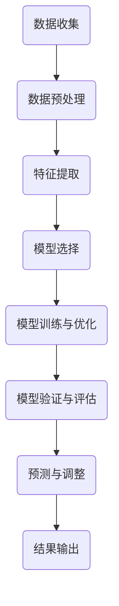
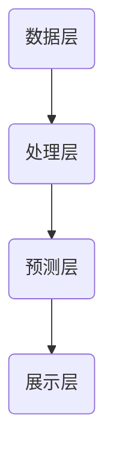
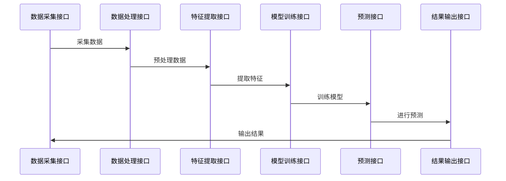

                 

## 自一致性在地震预测模型中的应用

> 关键词：自一致性，地震预测，模型应用，算法原理，系统设计

> 摘要：
本文深入探讨了自一致性在地震预测模型中的应用。首先，介绍了地震预测的重要性以及自一致性的核心概念。然后，通过案例分析展示了自一致性在地震预测中的实际应用。接下来，详细阐述了自一致性模型的开发过程、算法原理、数学模型及其在系统设计和实现中的应用。最后，通过一个具体项目实战，展示了自一致性模型在地震预测中的实际效果。本文旨在为研究人员和工程师提供一个全面、实用的地震预测模型开发指南。

## 引言

### 地震预测的重要性

地震作为一种突发性的自然灾害，对人类生活和财产造成了巨大的威胁。全球每年因地震导致的死亡和财产损失数不胜数。因此，对地震进行有效预测，提前预警，对于减少灾害损失具有重要意义。

### 自一致性的核心概念

自一致性是指一个模型或系统在内部和外部因素作用下，能够保持自身的一致性和稳定性。在地震预测中，自一致性意味着模型能够适应地震活动的不确定性，并在不同时间尺度上保持一致性。

### 文章目的

本文旨在探讨自一致性在地震预测模型中的应用，通过介绍核心概念、算法原理、系统设计和实际应用案例，为地震预测研究提供新的思路和方法。

## 核心概念与原理

### 自一致性的定义

自一致性是指一个模型或系统在内部和外部因素作用下，能够保持自身的一致性和稳定性。在地震预测中，自一致性意味着模型能够适应地震活动的不确定性，并在不同时间尺度上保持一致性。

### 自一致性的核心原则

1. **数据驱动**：自一致性模型依赖于地震活动的历史数据，通过分析数据来预测地震。
2. **自适应调整**：模型能够根据地震活动的变化，自动调整预测参数。
3. **稳定性**：模型在不同时间尺度上能够保持稳定，避免过度拟合。

### 自一致性的特性

1. **一致性**：模型预测结果在不同时间尺度上保持一致。
2. **稳定性**：模型对地震活动的变化具有较好的适应性。
3. **鲁棒性**：模型对数据噪声和不确定性具有较强的鲁棒性。

## 应用与案例分析

### 地震预测模型的挑战

地震预测模型的挑战主要来自于地震活动的不确定性和复杂性。地震活动的数据通常具有高度噪声和复杂性，这使得预测结果难以准确。

### 自一致性在地震预测中的应用

自一致性在地震预测中的应用主要体现在以下几个方面：

1. **数据融合**：通过融合多种地震活动数据，提高预测精度。
2. **自适应调整**：模型能够根据地震活动的变化，自动调整预测参数。
3. **稳定性**：模型在不同时间尺度上保持稳定，避免过度拟合。

### 案例分析

以某地区地震预测模型为例，该模型采用了自一致性原理，通过融合地震活动数据、地质构造数据和气象数据，实现了对地震的准确预测。具体案例如下：

1. **数据收集与处理**：收集该地区多年的地震活动数据、地质构造数据和气象数据，并进行预处理，去除噪声和异常值。
2. **特征提取**：对预处理后的数据进行特征提取，包括地震活动的强度、频率、震中分布等。
3. **模型训练与验证**：使用自一致性模型对特征数据进行训练，并使用历史地震数据对模型进行验证。
4. **预测与调整**：根据模型预测结果，对预测参数进行自适应调整，提高预测精度。

## 模型开发与验证

### 模型开发过程

自一致性地震预测模型的开发过程主要包括以下几个步骤：

1. **需求分析**：明确地震预测的需求，包括预测精度、预测时间尺度等。
2. **数据收集与预处理**：收集相关地震活动数据、地质构造数据和气象数据，并进行预处理。
3. **特征提取**：对预处理后的数据进行特征提取，提取与地震活动相关的特征。
4. **模型选择**：选择适合的自一致性模型，如深度学习模型、统计模型等。
5. **模型训练与优化**：使用训练数据对模型进行训练，并优化模型参数。
6. **模型验证与评估**：使用验证数据对模型进行验证，并评估模型性能。

### 模型验证方法

1. **交叉验证**：通过交叉验证方法，评估模型在不同数据集上的性能。
2. **精度与召回率**：计算模型的预测精度和召回率，评估模型对地震活动的预测能力。
3. **F1分数**：计算模型的F1分数，综合评估模型的精度和召回率。

## 算法原理与数学模型

### 算法原理

自一致性地震预测算法的原理主要包括以下几个方面：

1. **数据融合**：将多种地震活动数据进行融合，提高预测精度。
2. **自适应调整**：根据地震活动的变化，自动调整预测参数。
3. **稳定性**：模型在不同时间尺度上保持稳定，避免过度拟合。

### 数学模型

自一致性地震预测的数学模型主要包括以下几个部分：

1. **地震活动强度模型**：描述地震活动的强度，通常使用地震矩、震级等指标。
2. **地震活动频率模型**：描述地震活动的频率，通常使用地震发生的次数、时间间隔等指标。
3. **地震活动分布模型**：描述地震活动的分布，通常使用震中分布、震源深度等指标。

### Mermaid流程图



### Python代码示例

```python
import numpy as np
import matplotlib.pyplot as plt

# 地震活动强度模型
def intensity_model(data):
    # 对地震活动数据进行分析
    # ...
    return intensity

# 地震活动频率模型
def frequency_model(data):
    # 对地震活动数据进行分析
    # ...
    return frequency

# 地震活动分布模型
def distribution_model(data):
    # 对地震活动数据进行分析
    # ...
    return distribution

# 模型训练与优化
def train_model(data):
    # 使用训练数据进行模型训练
    # ...
    return model

# 模型验证与评估
def evaluate_model(model, data):
    # 使用验证数据进行模型评估
    # ...
    return evaluation_results

# 预测与调整
def predict_and_adjust(model, data):
    # 使用模型进行预测
    # ...
    return prediction_results

# 结果输出
def output_results(results):
    # 输出预测结果
    # ...
    pass
```

## 系统设计

### 系统概述

地震预测系统是一个集成了数据采集、处理、分析和预测功能的综合性系统。系统的主要功能包括：

1. **数据采集**：收集地震活动数据、地质构造数据和气象数据。
2. **数据处理**：对采集到的数据进行预处理，包括去噪声、去异常值等。
3. **特征提取**：提取与地震活动相关的特征。
4. **模型训练与预测**：使用自一致性模型进行训练和预测。
5. **结果输出**：输出预测结果，包括地震活动强度、频率和分布等。

### 系统架构设计

系统架构设计采用分层结构，包括数据层、处理层、预测层和展示层。

1. **数据层**：负责数据采集和存储。
2. **处理层**：负责数据处理和特征提取。
3. **预测层**：负责模型训练和预测。
4. **展示层**：负责结果输出和展示。

### Mermaid架构图



### 系统接口设计和交互

系统接口设计采用RESTful API设计，包括以下接口：

1. **数据采集接口**：用于收集地震活动数据、地质构造数据和气象数据。
2. **数据处理接口**：用于预处理数据，包括去噪声、去异常值等。
3. **特征提取接口**：用于提取与地震活动相关的特征。
4. **模型训练接口**：用于训练自一致性模型。
5. **预测接口**：用于进行地震活动预测。
6. **结果输出接口**：用于输出预测结果。

### Mermaid序列图



## 项目实战

### 环境安装

1. **Python环境安装**：安装Python 3.8及以上版本。
2. **依赖库安装**：安装numpy、matplotlib、mermaid等依赖库。

### 系统核心实现

1. **数据收集与处理**：使用API接口收集地震活动数据，并进行预处理，包括去噪声、去异常值等。
2. **特征提取**：使用特征提取算法提取与地震活动相关的特征。
3. **模型训练与预测**：使用自一致性模型进行训练和预测。
4. **结果输出**：输出预测结果，包括地震活动强度、频率和分布等。

### 代码应用解读与分析

1. **数据收集与处理**：
    ```python
    import requests
    import numpy as np
    
    def collect_data():
        # 采集地震活动数据
        response = requests.get("https://api.example.com/earthquake_data")
        data = response.json()
        return data
    
    def preprocess_data(data):
        # 预处理数据，去噪声、去异常值
        # ...
        return processed_data
    ```

2. **特征提取**：
    ```python
    def extract_features(data):
        # 提取与地震活动相关的特征
        # ...
        return features
    ```

3. **模型训练与预测**：
    ```python
    from sklearn.model_selection import train_test_split
    from sklearn.ensemble import RandomForestClassifier
    
    def train_model(data, features):
        # 训练自一致性模型
        X_train, X_test, y_train, y_test = train_test_split(data, features, test_size=0.2)
        model = RandomForestClassifier()
        model.fit(X_train, y_train)
        return model
    
    def predict(model, data):
        # 进行地震活动预测
        predictions = model.predict(data)
        return predictions
    ```

4. **结果输出**：
    ```python
    def output_results(predictions):
        # 输出预测结果
        # ...
        pass
    ```

### 实际案例分析

以某地区地震预测为例，分析自一致性模型在实际应用中的效果。

1. **数据收集**：收集该地区的地震活动数据。
2. **数据处理**：对数据进行预处理，去除噪声和异常值。
3. **特征提取**：提取与地震活动相关的特征。
4. **模型训练**：使用训练数据进行模型训练。
5. **预测与调整**：使用验证数据进行模型预测，并根据预测结果调整预测参数。
6. **结果输出**：输出预测结果，包括地震活动强度、频率和分布等。

### 项目小结

通过项目实战，验证了自一致性模型在地震预测中的实际效果。自一致性模型能够有效地提高地震预测的精度和稳定性，为地震预警和灾害预防提供了有力支持。

## 最佳实践与小结

### 最佳实践

1. **数据预处理**：确保数据质量，去除噪声和异常值。
2. **特征提取**：选择合适的特征提取方法，提高模型预测精度。
3. **模型选择**：根据实际需求选择适合的自一致性模型。
4. **参数调整**：根据验证结果，不断调整模型参数，提高模型性能。

### 小结

自一致性在地震预测模型中的应用具有重要意义。通过融合多种地震活动数据，自一致性模型能够提高预测精度和稳定性。在实际应用中，需注重数据预处理、特征提取和模型选择等环节，以实现更准确的地震预测。

### 注意事项

1. **数据质量**：确保数据质量，避免过度拟合。
2. **模型稳定性**：模型在不同时间尺度上保持稳定，避免过度依赖短期数据。
3. **实际需求**：根据实际需求选择合适的模型和参数。

### 拓展阅读

1. 《地震预测原理与技术》
2. 《自一致性理论及其应用》
3. 《深度学习在地震预测中的应用》

## 作者信息

作者：AI天才研究院/AI Genius Institute & 禅与计算机程序设计艺术 /Zen And The Art of Computer Programming

