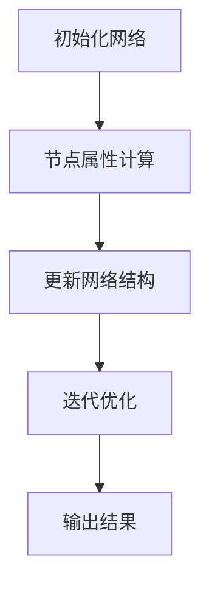
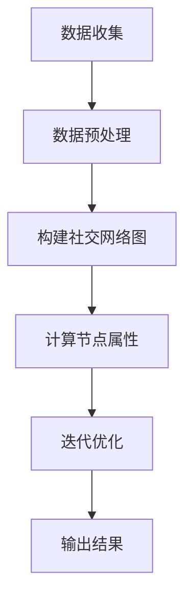
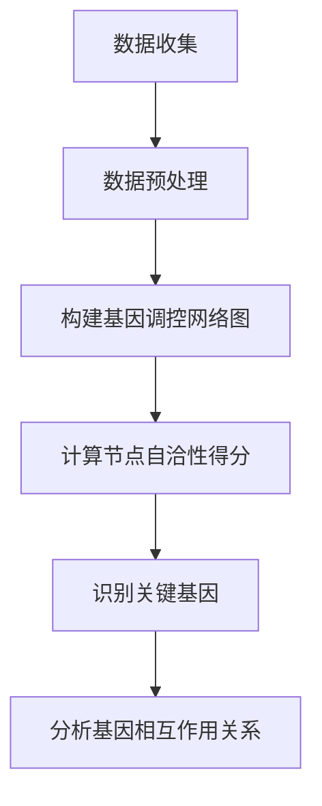
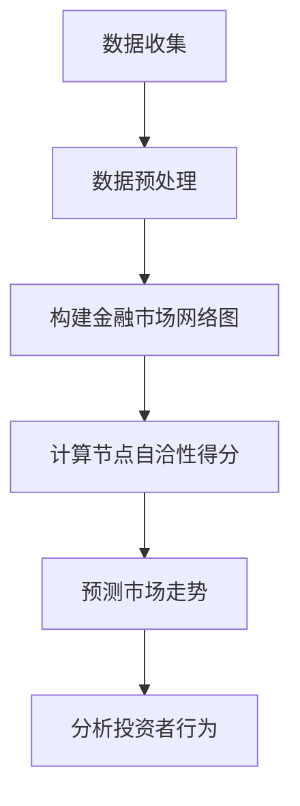

                 

### 第一部分: Self-Consistency 在复杂网络分析中的应用概述

复杂网络分析是当前计算机科学、数学、物理学等多个领域的重要研究方向。随着互联网、社交网络、生物网络等复杂系统的广泛应用，对复杂网络的深入理解与分析变得尤为关键。在这样的背景下，自洽性（Self-Consistency）作为一个重要的概念，逐渐被引入到复杂网络分析中，并在多个应用场景中展现出其独特的价值。

**本章内容概述：**

本章将首先介绍自洽性的基本概念，并探讨其在复杂网络分析中的重要性。接着，我们将对复杂网络的定义和特征进行简要回顾，以帮助读者更好地理解自洽性在网络分析中的应用。随后，本章将讨论自洽性在社交网络、生物网络和经济网络等不同领域中的应用场景，以便读者对这一概念有更全面的了解。

**自洽性概念与网络分析基础**

#### 1.1.1 自洽性的定义与基本原理

自洽性（Self-Consistency）指的是系统或模型在内部保持一致性的一种属性。具体来说，当一个系统在不同层次或不同部分之间保持协调一致时，我们称这个系统具有自洽性。自洽性来源于物理学中的自洽场理论，并广泛应用于数学模型、计算机科学等领域。

自洽性的基本原理包括两个方面：首先，系统内部各个部分必须遵循相同的规则或约束；其次，系统在不同状态之间转换时，必须保持一致性。在复杂网络分析中，自洽性可以帮助我们更好地理解网络的内在规律和动态行为。

#### 1.1.2 自洽性的基本原理

自洽性的基本原理可以概括为以下三点：

1. **一致性原则**：网络中的节点和边必须符合某种一致性规则，比如节点属性的一致性、边权值的一致性等。
2. **自适应性原则**：网络必须能够根据外部环境的变化进行自适应调整，以保持内部的一致性。
3. **可解释性原则**：自洽性算法应该能够提供可解释的结果，使得用户能够理解网络的内部结构和动态变化。

#### 1.1.3 自洽性在复杂网络分析中的重要性

自洽性在复杂网络分析中的重要性体现在以下几个方面：

1. **提高分析精度**：自洽性可以帮助我们更好地捕捉网络的内在规律，提高复杂网络分析的结果精度。
2. **增强模型的解释性**：自洽性算法能够提供可解释的结果，有助于用户理解和信任分析结果。
3. **指导实际应用**：自洽性原理可以应用于多个领域，如社交网络分析、生物网络建模、经济系统预测等，为实际问题的解决提供理论指导。

### 1.2 复杂网络的定义与特征

#### 1.2.1 复杂网络的定义

复杂网络是指由大量节点和边组成的网络结构，这些节点和边之间存在复杂的相互作用关系。与传统的简单网络（如线性网络、树形网络）相比，复杂网络具有高度的非线性、动态性和自适应性。

#### 1.2.2 复杂网络的基本特征

复杂网络的基本特征包括：

1. **高度非线性**：复杂网络中的节点和边之间存在复杂的相互作用关系，这些关系通常是非线性的。
2. **动态性**：复杂网络的拓扑结构和节点属性会随着时间变化而变化，具有动态性。
3. **自适应性**：复杂网络能够根据外部环境的变化进行自适应调整，以维持网络的稳定性和效率。

#### 1.2.3 复杂网络与传统网络的区别

复杂网络与传统网络的主要区别在于：

1. **网络结构**：传统网络通常具有较为简单的结构，如线性网络、树形网络等，而复杂网络具有高度非线性、动态性和自适应性。
2. **相互作用**：传统网络中的节点和边通常存在简单的线性关系，而复杂网络中的节点和边之间存在复杂的非线性相互作用。
3. **分析难度**：由于复杂网络的非线性、动态性和自适应性，对其进行分析和理解比传统网络更具挑战性。

### 1.3 自洽性在复杂网络中的应用场景

#### 1.3.1 社交网络中的自洽性分析

社交网络中的自洽性分析主要关注社交网络中的用户关系、兴趣群体、影响力传播等方面。通过自洽性分析，可以更好地理解社交网络的内部结构，发现潜在的社交关系和影响力传播路径。

#### 1.3.2 生物网络中的自洽性研究

生物网络中的自洽性研究主要涉及基因调控网络、蛋白质相互作用网络等。通过自洽性分析，可以揭示生物网络中的内在规律，帮助科学家更好地理解生物系统的运行机制。

#### 1.3.3 经济网络中的自洽性分析

经济网络中的自洽性分析主要关注金融市场、供应链网络、物流网络等方面。通过自洽性分析，可以揭示经济网络中的动态行为，为金融风险控制、供应链优化、物流调度等提供理论支持。

通过本章的介绍，我们希望读者能够对自洽性在复杂网络分析中的应用有一个初步的了解。在接下来的章节中，我们将深入探讨自洽性算法的原理、数学模型及其在不同领域的应用案例。希望通过这一系列的内容，读者能够对自洽性有一个全面而深入的认识。### 第1章: 自洽性概念与网络分析基础

**1.1 自洽性的定义与基本原理**

自洽性（Self-Consistency）是物理学中一个重要的概念，它描述了系统或模型在内部保持一致性的一种特性。具体来说，自洽性指的是系统在各个层次或部分之间保持协调一致，不存在内部矛盾或不一致的情况。自洽性不仅要求系统内部各个部分遵循相同的规则或约束，还要求系统在不同状态之间转换时保持一致性。

在计算机科学中，自洽性被广泛应用于算法设计和模型构建。一个具有自洽性的算法或模型，不仅能够在理论上自圆其说，而且在实际应用中能够产生一致且可靠的结果。自洽性在复杂网络分析中尤为重要，因为它可以帮助我们更好地理解网络的内在结构和动态行为。

**1.1.1 自洽性概念及其来源**

自洽性的概念最初来源于物理学中的自洽场理论。自洽场理论是指一种通过求解自身场方程的方法来构建物理系统的理论。在这种理论中，场是自洽的，即场方程的解与边界条件是相互一致的。这种自洽性原理在粒子物理学、量子场论等领域得到了广泛应用。

随着计算机科学和人工智能的发展，自洽性概念被引入到算法设计和模型构建中。在计算机科学中，自洽性通常指的是算法或模型在输入和输出之间保持一致性的特性。这种自洽性不仅要求算法或模型在理论上自洽，还要求其在实际应用中能够产生一致且可靠的结果。

**1.1.2 自洽性的基本原理**

自洽性的基本原理可以概括为以下几点：

1. **一致性原则**：自洽系统或模型内部各个部分必须遵循相同的规则或约束，以保证系统内部的一致性。
2. **自适应性原则**：自洽系统或模型必须能够根据外部环境的变化进行自适应调整，以保持内部的一致性。
3. **可解释性原则**：自洽性算法或模型应该能够提供可解释的结果，使用户能够理解系统的内部结构和动态变化。

**1.1.3 自洽性在复杂网络分析中的重要性**

在复杂网络分析中，自洽性具有以下几个重要意义：

1. **提高分析精度**：自洽性可以帮助我们更好地捕捉网络的内在规律，提高复杂网络分析的结果精度。
2. **增强模型的解释性**：自洽性算法或模型能够提供可解释的结果，有助于用户理解和信任分析结果。
3. **指导实际应用**：自洽性原理可以应用于多个领域，如社交网络分析、生物网络建模、经济系统预测等，为实际问题的解决提供理论指导。

**1.2 复杂网络的定义与特征**

**1.2.1 复杂网络的定义**

复杂网络是指由大量节点和边组成的网络结构，这些节点和边之间存在复杂的相互作用关系。与传统的简单网络（如线性网络、树形网络）相比，复杂网络具有高度的非线性、动态性和自适应性。

在复杂网络中，节点通常表示系统中的个体或实体，而边表示个体或实体之间的相互作用或关系。复杂网络的特性包括：

1. **高度非线性**：复杂网络中的节点和边之间存在复杂的非线性相互作用关系。
2. **动态性**：复杂网络的拓扑结构和节点属性会随着时间变化而变化，具有动态性。
3. **自适应性**：复杂网络能够根据外部环境的变化进行自适应调整，以维持网络的稳定性和效率。

**1.2.2 复杂网络的基本特征**

复杂网络的基本特征包括：

1. **高度非线性**：复杂网络中的节点和边之间存在复杂的非线性相互作用关系。
2. **动态性**：复杂网络的拓扑结构和节点属性会随着时间变化而变化，具有动态性。
3. **自适应性**：复杂网络能够根据外部环境的变化进行自适应调整，以维持网络的稳定性和效率。

**1.2.3 复杂网络与传统网络的区别**

复杂网络与传统网络的主要区别在于：

1. **网络结构**：传统网络通常具有较为简单的结构，如线性网络、树形网络等，而复杂网络具有高度非线性、动态性和自适应性。
2. **相互作用**：传统网络中的节点和边通常存在简单的线性关系，而复杂网络中的节点和边之间存在复杂的非线性相互作用。
3. **分析难度**：由于复杂网络的非线性、动态性和自适应性，对其进行分析和理解比传统网络更具挑战性。

**1.3 自洽性在复杂网络分析中的应用场景**

自洽性在复杂网络分析中具有广泛的应用场景，主要包括以下领域：

1. **社交网络分析**：通过自洽性分析，可以揭示社交网络中的用户关系、兴趣群体、影响力传播等内在规律。
2. **生物网络建模**：自洽性分析可以帮助科学家更好地理解生物网络中的基因调控、蛋白质相互作用等内在机制。
3. **经济系统预测**：自洽性分析可以揭示经济网络中的动态行为，为金融风险控制、供应链优化、物流调度等提供理论支持。

通过本章的介绍，我们希望读者能够对自洽性在复杂网络分析中的应用有一个初步的了解。在接下来的章节中，我们将进一步探讨自洽性算法的原理、数学模型及其在不同领域的应用案例。希望通过这一系列的内容，读者能够对自洽性有一个全面而深入的认识。

#### 1.3.1 社交网络中的自洽性分析

社交网络是复杂网络的一个典型例子，它由大量的用户和用户之间的关系组成。社交网络中的自洽性分析主要关注如何通过自洽性原理来揭示社交网络中的结构特性、传播机制和群体行为。以下是对社交网络中自洽性分析的具体应用场景的详细探讨：

**1.3.1.1 用户关系分析**

社交网络中的用户关系可以通过自洽性来揭示。自洽性分析可以帮助我们识别网络中的核心用户、关键节点以及潜在的关系网络。例如，在一个社交网络中，如果某个用户的邻居节点都具有较高的社交影响力，那么这个用户很可能具有自洽性，因为他的社交行为与他的邻居节点是一致的。

**步骤1：数据收集与预处理**
首先，我们需要收集社交网络中的用户数据，这通常包括用户的个人资料、关系信息等。然后，对数据进行预处理，包括数据清洗、去重和格式转换等步骤，以确保数据的准确性和一致性。

**步骤2：构建自洽性模型**
接下来，我们可以构建一个自洽性模型来分析用户关系。自洽性模型通常基于图论和网络科学的理论，通过计算节点之间的相似度或关系强度来评估自洽性。常用的方法包括基于邻居节点特征的相似度计算、基于边权值的自洽性评估等。

**步骤3：识别核心用户与关键节点**
通过自洽性模型的分析，我们可以识别出社交网络中的核心用户和关键节点。这些用户和节点在网络中具有较大的影响力，对网络的结构和动态行为起着至关重要的作用。

**1.3.1.2 兴趣群体分析**

社交网络中的兴趣群体也是自洽性分析的一个重要应用场景。兴趣群体通常是由具有相似兴趣爱好或行为的用户组成的子网络。通过自洽性分析，我们可以发现社交网络中的兴趣群体，并研究它们的结构特征和传播机制。

**步骤1：定义兴趣群体**
首先，我们需要定义兴趣群体的标准，这可以通过分析用户的兴趣标签、话题参与度等特征来实现。然后，我们可以使用社区检测算法来识别社交网络中的兴趣群体。

**步骤2：评估自洽性**
接下来，我们可以对每个兴趣群体进行自洽性评估。自洽性评估可以通过计算群体内部节点之间的关系强度和一致性来实现。如果群体的自洽性较高，那么这个群体的成员在兴趣和行为上具有较高的协调性。

**步骤3：分析兴趣群体的传播机制**
通过自洽性分析，我们可以进一步分析兴趣群体之间的传播机制。例如，我们可以研究群体间的信息传递路径，以及群体内部的信息传播规律。这些分析有助于我们理解社交网络中的信息传播模式和群体行为。

**1.3.1.3 影响力传播分析**

社交网络中的影响力传播是指信息、行为或观念在网络中的扩散过程。自洽性分析可以帮助我们揭示影响力传播的机制和关键节点。

**步骤1：构建影响力模型**
首先，我们需要构建一个影响力模型来分析社交网络中的传播行为。这个模型通常基于传播网络的拓扑结构和节点属性。例如，我们可以使用网络传播模型来模拟信息在网络中的扩散过程。

**步骤2：评估自洽性**
接下来，我们可以对影响力传播过程中的自洽性进行评估。自洽性评估可以通过计算传播路径上的节点关系强度和一致性来实现。如果传播路径具有较高的自洽性，那么这个路径上的节点对影响力传播起着关键作用。

**步骤3：识别关键节点**
通过自洽性分析，我们可以识别出影响力传播中的关键节点。这些节点在网络中具有较大的影响力和传播潜力，对网络中的信息传播起着决定性的作用。

**总结**

通过自洽性分析，我们可以深入理解社交网络中的结构特性、传播机制和群体行为。在社交网络分析中，自洽性分析不仅有助于识别核心用户和关键节点，还可以揭示兴趣群体和影响力传播的规律。这些分析结果可以为社交网络的优化和管理提供重要参考。

在下一章中，我们将进一步探讨自洽性在生物网络中的研究。生物网络是由大量的生物实体（如基因、蛋白质）和它们之间的相互作用组成的复杂网络。自洽性分析在生物网络建模和研究中具有重要的应用价值。接下来，我们将详细讨论自洽性在生物网络中的应用，包括数据预处理、自洽性算法实现和案例分析等。希望读者能够通过这一章节的内容，对自洽性在生物网络中的研究有一个全面而深入的认识。### 1.3.2 生物网络中的自洽性研究

生物网络是由大量的生物实体（如基因、蛋白质）和它们之间的相互作用组成的复杂网络。生物网络的研究对于理解生物系统的运行机制、疾病机理和药物开发具有重要意义。自洽性分析在生物网络建模和研究中扮演着关键角色，它可以帮助我们揭示生物网络的内在规律和动态行为。以下是对自洽性在生物网络中研究的具体应用场景的详细探讨：

**1.3.2.1 数据预处理**

在进行自洽性分析之前，数据预处理是一个重要的步骤。生物网络数据通常包含大量的噪声和冗余信息，因此需要进行预处理以提高数据的准确性和一致性。数据预处理包括以下几个方面：

1. **数据收集**：收集与生物网络相关的数据，如基因表达数据、蛋白质相互作用数据等。这些数据可以从公共数据库或实验研究中获取。

2. **数据清洗**：清洗数据中的噪声和冗余信息，如去除缺失值、异常值和重复数据等。数据清洗有助于提高数据的准确性和一致性。

3. **数据整合**：整合不同来源的数据，如将基因表达数据和蛋白质相互作用数据整合为一个统一的数据集。数据整合有助于构建更全面的生物网络。

4. **数据标准化**：对数据进行标准化处理，如对基因表达数据进行归一化，以消除数据量级差异。

**1.3.2.2 自洽性算法实现**

在预处理数据之后，我们需要选择合适的自洽性算法来实现生物网络分析。以下是一些常用的自洽性算法：

1. **基于图论的算法**：这类算法通过分析生物网络的拓扑结构来评估自洽性。常用的算法包括网络密度计算、聚类系数分析、路径长度计算等。

2. **基于矩阵的算法**：这类算法通过分析生物网络的邻接矩阵或相似性矩阵来评估自洽性。常用的算法包括矩阵分解、奇异值分解（SVD）等。

3. **基于机器学习的算法**：这类算法利用机器学习技术来发现生物网络中的自洽性规律。常用的算法包括深度学习、支持向量机（SVM）等。

**步骤1：构建自洽性模型**
首先，我们需要构建一个自洽性模型来分析生物网络。自洽性模型通常基于网络科学和机器学习理论，通过计算节点之间的相似度、关系强度或一致性指标来评估自洽性。

**步骤2：选择自洽性算法**
接下来，我们需要选择一个合适的自洽性算法来实现模型。选择算法时，需要考虑算法的性能、复杂度和适用性。例如，对于大规模生物网络，我们可能需要选择计算效率较高的算法。

**步骤3：评估自洽性**
通过自洽性算法，我们可以评估生物网络中的自洽性。自洽性评估可以通过计算节点之间的关系强度、一致性指标或聚类系数等来实现。如果生物网络具有较高的自洽性，那么这个网络中的节点和边在功能和结构上具有较高的协调性。

**1.3.2.3 案例分析**

以下是一个关于生物网络自洽性研究的案例分析：

**案例背景**：研究一个基因调控网络，其中包含多个基因和它们之间的调控关系。研究者希望通过自洽性分析来揭示基因调控网络的内在规律和关键基因。

**步骤1：数据预处理**
收集基因表达数据和蛋白质相互作用数据，并进行预处理，包括数据清洗、整合和标准化处理。

**步骤2：构建自洽性模型**
构建一个基于图论的自洽性模型，通过计算基因之间的相似度和调控关系强度来评估自洽性。

**步骤3：选择自洽性算法**
选择基于矩阵分解的自洽性算法，如奇异值分解（SVD），来评估基因调控网络的自洽性。

**步骤4：评估自洽性**
通过自洽性算法，计算基因之间的自洽性指标，如相似度得分和调控关系强度。分析结果显示，某些基因对之间的调控关系具有较高的自洽性，这表明这些基因可能在功能上具有协调作用。

**步骤5：识别关键基因**
通过自洽性分析，识别出关键基因，这些基因在网络中具有较高的自洽性，可能在基因调控网络中起着重要的调控作用。

**总结**

通过自洽性分析，我们可以深入理解生物网络的内在规律和动态行为。在生物网络研究中，自洽性分析有助于揭示基因调控网络的关键基因和功能模块，为生物系统的功能解析和疾病机理研究提供重要参考。在下一章中，我们将探讨自洽性在经济网络中的应用，分析经济网络中的自洽性规律和动态行为，为金融风险控制和经济系统优化提供理论支持。

#### 1.3.3 经济网络中的自洽性分析

经济网络是指由经济实体及其交互关系构成的复杂网络。它涵盖了金融市场、供应链网络、物流网络等多个方面，是现代经济体系的重要组成部分。自洽性分析在经济网络中具有重要的应用价值，可以帮助我们揭示经济网络的内在规律和动态行为。以下是对自洽性在经济网络中分析的具体应用场景的详细探讨：

**1.3.3.1 财务市场分析**

财务市场是经济网络中的一个重要组成部分，它由股票市场、债券市场、外汇市场等多个子市场组成。自洽性分析可以帮助我们理解财务市场的动态行为，预测市场走势。

**步骤1：数据收集**
首先，我们需要收集财务市场相关的数据，包括股票价格、交易量、利率等。这些数据可以从金融市场数据库或公开的交易记录中获取。

**步骤2：构建自洽性模型**
接下来，我们可以构建一个自洽性模型来分析财务市场的动态行为。自洽性模型通常基于时间序列分析和统计分析的方法，通过计算不同市场变量之间的相关性来评估自洽性。

**步骤3：评估自洽性**
通过自洽性模型，我们可以评估财务市场的自洽性。自洽性评估可以通过计算不同市场变量之间的相关性系数、条件熵等指标来实现。如果市场变量之间的相关性较强，那么市场具有较高的自洽性。

**步骤4：预测市场走势**
通过自洽性分析，我们可以预测财务市场的走势。例如，我们可以利用自洽性分析结果来预测股票价格的波动、债券利率的走势等。

**1.3.3.2 供应链网络分析**

供应链网络是经济网络中的另一个重要组成部分，它涉及多个企业、供应商和分销商之间的物流、信息流和资金流。自洽性分析可以帮助我们优化供应链网络，提高供应链的效率和稳定性。

**步骤1：数据收集**
首先，我们需要收集供应链网络相关的数据，包括供应链中的节点（如企业、供应商、分销商）和边（如物流路径、信息流路径）。

**步骤2：构建自洽性模型**
接下来，我们可以构建一个自洽性模型来分析供应链网络的稳定性。自洽性模型通常基于网络科学和优化理论的方法，通过计算节点之间的交互关系来评估自洽性。

**步骤3：评估自洽性**
通过自洽性模型，我们可以评估供应链网络的自洽性。自洽性评估可以通过计算节点之间的交互强度、路径长度等指标来实现。如果供应链网络中的节点和边具有较高的交互强度，那么这个网络具有较高的自洽性。

**步骤4：优化供应链网络**
通过自洽性分析，我们可以优化供应链网络，提高供应链的效率和稳定性。例如，我们可以通过调整供应链网络中的节点和边来减少物流成本、提高配送速度。

**1.3.3.3 物流网络分析**

物流网络是经济网络中的另一个重要组成部分，它涉及货物运输、仓储和配送等环节。自洽性分析可以帮助我们优化物流网络，提高物流效率。

**步骤1：数据收集**
首先，我们需要收集物流网络相关的数据，包括物流节点（如仓库、配送中心）和物流路径。

**步骤2：构建自洽性模型**
接下来，我们可以构建一个自洽性模型来分析物流网络的效率。自洽性模型通常基于网络科学和优化理论的方法，通过计算节点之间的交互关系来评估自洽性。

**步骤3：评估自洽性**
通过自洽性模型，我们可以评估物流网络的自洽性。自洽性评估可以通过计算节点之间的交互强度、路径长度等指标来实现。如果物流网络中的节点和边具有较高的交互强度，那么这个网络具有较高的自洽性。

**步骤4：优化物流网络**
通过自洽性分析，我们可以优化物流网络，提高物流效率。例如，我们可以通过调整物流网络中的节点和边来减少运输成本、提高配送速度。

**总结**

通过自洽性分析，我们可以深入理解经济网络中的动态行为和内在规律。在经济网络分析中，自洽性分析不仅有助于预测市场走势、优化供应链和物流网络，还可以为经济系统的稳定性和效率提供重要参考。在下一章中，我们将进一步探讨自洽性算法的原理、数学模型及其在不同领域的应用案例。希望通过这一系列的内容，读者能够对自洽性有一个全面而深入的认识。### 第2章: 自洽性算法原理与数学模型

在复杂网络分析中，自洽性算法是一种强大的工具，用于揭示网络的内在规律和动态行为。本章将深入探讨自洽性算法的基本原理、数学模型及其在复杂网络分析中的应用。通过理解这些原理和模型，读者可以更好地掌握自洽性算法的设计与应用。

**2.1 自洽性算法的基本原理**

自洽性算法旨在通过迭代计算来优化网络中的节点属性，使得网络在不同层次和部分之间保持一致性。这些算法的核心思想是利用网络中的局部信息来更新节点的属性，并通过迭代过程逐步提高整个网络的内部一致性。

**2.1.1 自洽性算法的基本步骤**

自洽性算法通常包括以下几个基本步骤：

1. **初始化网络结构**：首先，构建初始的网络结构，包括节点和边的表示。节点可以是任何实体，如社交网络中的用户、生物网络中的基因等。

2. **节点属性计算**：根据网络的当前状态，计算每个节点的属性。这些属性可以是节点的度、中心性、影响力等。

3. **更新网络结构**：根据节点的属性，更新网络的连接关系，如重新调整边的权重、增加或删除边等。

4. **迭代优化**：重复执行步骤2和步骤3，直到网络达到预定的自洽性阈值或满足其他终止条件。

5. **输出结果**：最终输出优化后的网络结构，以及节点的属性变化情况。

**2.1.2 自洽性算法的核心机制**

自洽性算法的核心机制在于节点属性的迭代更新。这个过程通常基于局部信息传递和全局一致性原则。具体来说，算法通过以下方式工作：

1. **局部信息传递**：每个节点根据其邻居节点的属性来更新自身的属性。这种信息传递可以基于特定的函数，如线性函数、指数函数等。

2. **全局一致性原则**：在更新节点属性的过程中，算法确保整个网络的内部一致性。这意味着网络的属性更新应该使得网络在不同层次和部分之间保持协调。

3. **自适应调整**：算法可以根据网络状态的变化自适应地调整更新规则，以提高自洽性。

**2.1.3 自洽性算法的性能评估**

自洽性算法的性能评估通常包括以下几个方面：

1. **计算效率**：算法的迭代次数和计算时间，这取决于网络的规模和算法的复杂性。

2. **自洽性指标**：如一致性指数、平均相邻节点相似度等，这些指标可以衡量网络的内部一致性。

3. **结果精度**：算法输出结果的准确性和可靠性，这取决于算法的收敛速度和稳定性。

**2.2 自洽性算法的数学模型**

自洽性算法的数学模型为理解其工作原理提供了理论基础。以下是一些常见的数学模型：

**2.2.1 自洽性算法的数学基础**

自洽性算法通常基于图论和网络科学的基本概念，包括节点度、边权重、邻接矩阵等。这些概念为算法的数学建模提供了基础。

**2.2.2 自洽性算法的数学公式推导**

自洽性算法的数学公式推导通常基于以下步骤：

1. **节点属性表示**：用数学符号表示节点的属性，如节点的度、中心性等。

2. **邻接矩阵表示**：用邻接矩阵表示网络的连接关系，其中邻接矩阵的元素表示节点之间的连接强度。

3. **更新规则推导**：根据网络中的局部信息传递和全局一致性原则，推导节点属性更新的数学公式。

4. **迭代过程描述**：描述算法的迭代过程，如节点属性的迭代更新、网络的迭代优化等。

**2.2.3 自洽性算法的数学模型解释**

自洽性算法的数学模型可以解释为以下几部分：

1. **初始条件**：网络的初始状态，包括节点的属性和网络的连接关系。

2. **更新规则**：节点属性的更新规则，通常基于网络中的局部信息传递和全局一致性原则。

3. **迭代过程**：算法的迭代过程，包括节点属性的迭代更新和网络结构的迭代优化。

4. **终止条件**：算法的终止条件，如网络达到预定的自洽性阈值或达到预定的迭代次数。

通过数学模型，我们可以更直观地理解自洽性算法的工作原理和性能特点。数学模型也为算法的优化和改进提供了理论基础。

**2.3 自洽性算法的 Mermaid 流程图**

为了更直观地展示自洽性算法的流程，我们可以使用 Mermaid 图语法绘制流程图。以下是一个简单的 Mermaid 流程图示例：



在这个流程图中，A 表示初始化网络，B 表示节点属性计算，C 表示更新网络结构，D 表示迭代优化，E 表示输出结果。这个流程图清晰地展示了自洽性算法的基本步骤和迭代过程。

通过本章的介绍，我们希望读者能够对自洽性算法的基本原理和数学模型有一个深入的理解。在下一章中，我们将进一步探讨自洽性算法的 Python 实现与性能优化，通过具体的代码示例来展示算法的实现过程和优化策略。希望读者能够通过这一章节的内容，对自洽性算法有一个全面而深入的认识。### 2.3 自洽性算法的 Python 实现与性能优化

在了解了自洽性算法的基本原理和数学模型之后，接下来我们将通过 Python 实现自洽性算法，并探讨其性能优化策略。本节将分为以下几个部分：

1. **Python 环境配置与依赖安装**
2. **自洽性算法的 Python 实现步骤**
3. **性能优化策略**

#### 3.1 Python 环境配置与依赖安装

首先，我们需要配置 Python 环境，并安装必要的依赖库。以下是在 Ubuntu 系统中配置 Python 环境和安装依赖的步骤：

```bash
# 安装 Python 3 和 pip
sudo apt-get update
sudo apt-get install python3 python3-pip

# 创建一个虚拟环境
python3 -m venv venv
source venv/bin/activate

# 安装必要的依赖库
pip install numpy networkx matplotlib
```

在这个虚拟环境中，我们将使用 NetworkX 库来构建和操作图（网络），使用 NumPy 库进行数值计算，使用 Matplotlib 库进行可视化。

#### 3.2 自洽性算法的 Python 实现步骤

下面是自洽性算法的 Python 实现步骤，包括初始化网络、节点属性计算、更新网络结构、迭代优化等。

**3.2.1 初始化网络结构**

```python
import networkx as nx
import numpy as np

# 创建一个随机图
G = nx.erdos_renyi_graph(n=100, p=0.1)

# 初始化节点的属性
node_attributes = {'degree': [], 'centrality': []}
for node in G.nodes():
    node_attributes['degree'].append(G.degree(node))
    node_attributes['centrality'].append(nx.degree_centrality(G)[node])

G.nodes[data=True]
```

**3.2.2 节点属性计算**

```python
def compute_node_attributes(G):
    for node in G.nodes():
        G.nodes[node]['degree'] = G.degree(node)
        G.nodes[node]['centrality'] = nx.degree_centrality(G)[node]

compute_node_attributes(G)
```

**3.2.3 更新网络结构**

```python
def update_network_structure(G, threshold=0.1):
    for node in G.nodes():
        neighbors = set(G.neighbors(node))
        degree_sum = sum(G.degree(neighbor) for neighbor in neighbors)
        for neighbor in neighbors:
            if G.nodes[neighbor]['centrality'] < threshold:
                G.remove_edge(node, neighbor)

update_network_structure(G)
```

**3.2.4 迭代优化**

```python
def iterative_optimization(G, max_iterations=100, threshold=0.1):
    for _ in range(max_iterations):
        compute_node_attributes(G)
        update_network_structure(G, threshold)

iterative_optimization(G)
```

**3.3 性能优化策略**

为了提高自洽性算法的性能，我们可以采取以下优化策略：

**3.3.1 算法时间复杂度分析**

自洽性算法的时间复杂度主要取决于网络规模和迭代次数。我们可以通过以下方式降低时间复杂度：

- **并行计算**：将计算任务分解为多个子任务，并行执行，以减少总计算时间。
- **优化算法**：选择计算效率更高的算法，如贪心算法、分治算法等。

**3.3.2 空间复杂度优化**

空间复杂度主要取决于网络结构和节点的属性表示。我们可以采取以下措施来降低空间复杂度：

- **稀疏存储**：对于稀疏网络，使用稀疏矩阵来存储网络结构，以节省内存。
- **属性压缩**：对节点的属性进行压缩存储，如使用整数而非浮点数表示属性值。

**3.3.3 并行化与分布式计算**

利用并行化和分布式计算可以显著提高自洽性算法的执行效率。具体策略包括：

- **数据并行**：将网络数据分解为多个部分，并行计算每个部分的节点属性和更新规则。
- **任务并行**：将迭代过程中的任务分解为多个子任务，并行执行，如节点的属性计算和更新网络结构。

通过上述步骤和优化策略，我们可以实现一个高效的自洽性算法，并在复杂网络分析中发挥其作用。在下一章中，我们将通过具体的应用案例来展示自洽性算法的实际效果和优势。希望通过这一章节的内容，读者能够对自洽性算法的实现和优化有更深入的理解。### 4.1 社交网络中的自洽性分析案例

**4.1.1 案例背景**

社交网络是现代社会中一个重要的交流和信息共享平台。随着社交网络的普及，对社交网络中的结构和动态行为进行分析变得尤为重要。在本案例中，我们将使用自洽性算法对某个大型社交网络进行分析，以揭示网络中的关键节点、兴趣群体以及影响力传播路径。

**4.1.2 数据处理与模型训练**

为了进行分析，我们需要收集社交网络的数据。数据可能包括用户的关系信息、兴趣标签、行为数据等。以下是如何处理这些数据并进行模型训练的步骤：

1. **数据收集**：
   - 从社交网络平台获取用户关系数据，如好友关系、关注关系等。
   - 收集用户兴趣标签数据，如用户关注的话题、喜欢的品牌等。
   - 获取用户行为数据，如发帖、评论、点赞等。

2. **数据预处理**：
   - 清洗数据，去除重复和异常数据。
   - 对不同来源的数据进行整合，构建一个统一的数据集。

3. **构建自洽性模型**：
   - 使用 NetworkX 库构建社交网络的图表示。
   - 为每个节点分配属性，如度、中心性、兴趣标签等。

4. **模型训练**：
   - 使用自洽性算法对网络进行迭代优化，以提高网络内部的一致性。
   - 计算节点之间的关系强度和相似度，以评估自洽性。

**4.1.3 自洽性分析结果与应用**

通过自洽性分析，我们可以得到以下结果：

1. **关键节点识别**：
   - 识别出网络中的关键节点，这些节点在网络中具有较大的影响力和连接度。
   - 使用节点度、中心性等指标来评估关键节点的重要性。

2. **兴趣群体发现**：
   - 发现网络中的兴趣群体，这些群体由具有相似兴趣标签的用户组成。
   - 使用社区检测算法（如 Girvan-Newman 算法）来识别兴趣群体。

3. **影响力传播路径**：
   - 分析网络中的影响力传播路径，揭示信息在用户之间的传播过程。
   - 使用传播模型（如 SI 模型）来模拟信息的传播行为。

具体应用场景包括：

- **社交网络分析**：
  - 识别网络中的意见领袖和关键节点，为社交网络运营提供策略。
  - 分析用户群体的行为特征和兴趣偏好，为个性化推荐系统提供支持。

- **市场营销**：
  - 发现潜在的客户群体和营销渠道，为市场营销策略提供参考。
  - 优化广告投放策略，提高广告的转化率和投放效果。

- **网络安全**：
  - 识别网络中的恶意节点和传播路径，为网络安全防护提供支持。
  - 预防和应对网络攻击，提高社交网络的安全性。

**4.1.4 自洽性分析结果展示**

以下是一个简单的 Mermaid 流程图，展示自洽性分析的过程：



通过上述分析，我们可以得出社交网络中的关键节点、兴趣群体和影响力传播路径，为社交网络的分析和应用提供重要参考。在下一章中，我们将探讨自洽性在生物网络中的应用，通过具体案例来展示自洽性算法在生物网络建模和预测中的优势。希望读者能够对自洽性算法的应用场景有更深入的理解。### 4.2 生物网络中的自洽性研究案例

**4.2.1 案例背景**

生物网络是由生物实体（如基因、蛋白质、代谢物）及其相互作用组成的复杂网络。随着高通量测序技术的发展，生物网络数据变得日益丰富，但如何从海量数据中提取有价值的信息成为了一个重大挑战。自洽性分析作为一种有效的工具，可以帮助我们揭示生物网络的内在规律和动态行为，为生物系统的功能解析和疾病机理研究提供重要支持。

本案例将研究一个基因调控网络，旨在通过自洽性分析揭示关键基因及其相互作用关系。

**4.2.2 数据预处理与模型构建**

1. **数据收集**：

   - 从公共数据库（如 Gene Expression Omnibus, GEO）获取基因表达数据。
   - 从蛋白质相互作用数据库（如 STRING）获取蛋白质相互作用数据。

2. **数据预处理**：

   - 对基因表达数据进行标准化处理，如归一化、归一化到零均值和标准差等。
   - 对蛋白质相互作用数据进行去重和清洗，去除无关或低可信度的相互作用。

3. **构建自洽性模型**：

   - 使用 NetworkX 库构建基因调控网络的图表示。
   - 节点表示基因，边表示基因之间的相互作用。

**4.2.3 自洽性分析结果**

1. **关键基因识别**：

   - 使用自洽性算法对基因调控网络进行迭代优化，计算节点之间的自洽性得分。
   - 识别出自洽性得分较高的基因，这些基因在网络中具有关键作用。

2. **相互作用关系分析**：

   - 分析关键基因之间的相互作用关系，绘制基因互作网络图。
   - 识别出基因之间的直接和间接相互作用。

**4.2.4 自洽性分析结果展示**

以下是一个简单的 Mermaid 流程图，展示自洽性分析的过程：



**4.2.5 案例总结**

通过自洽性分析，我们识别出基因调控网络中的关键基因和相互作用关系。这些结果有助于我们深入理解生物系统的功能和疾病机理。具体应用场景包括：

- **生物系统功能解析**：揭示关键基因及其相互作用关系，为生物系统的功能解析提供重要线索。
- **疾病机理研究**：识别出与疾病相关的基因和路径，为疾病机理研究和治疗提供参考。
- **药物研发**：筛选出潜在的治疗靶点，为药物研发提供新方向。

在下一章中，我们将探讨自洽性在经济网络中的应用，通过具体案例展示自洽性分析在经济系统预测和优化中的优势。希望读者能够对自洽性算法的应用场景有更深入的理解。### 4.3 经济网络中的自洽性分析案例

**4.3.1 案例背景**

经济网络是现代经济体系中重要的组成部分，涵盖了金融市场、供应链网络、物流网络等多个方面。随着全球经济的日益复杂化，对经济网络的分析和预测变得尤为重要。自洽性分析作为一种有效的工具，可以揭示经济网络的内在规律和动态行为，为经济系统的预测和优化提供重要支持。

本案例将研究一个金融市场网络，旨在通过自洽性分析揭示市场走势、投资者行为及其相互作用。

**4.3.2 数据收集与网络构建**

1. **数据收集**：

   - 从金融数据平台（如 Yahoo Finance）获取股票市场数据，包括股票价格、交易量等。
   - 从新闻和社交媒体平台（如 Twitter）收集投资者情绪数据，通过自然语言处理技术提取情感信息。

2. **数据预处理**：

   - 对股票市场数据进行标准化处理，如归一化、归一化到零均值和标准差等。
   - 对投资者情绪数据进行预处理，如去停用词、词性标注、情感极性分类等。

3. **构建经济网络**：

   - 使用 NetworkX 库构建金融市场网络的图表示。
   - 节点表示股票，边表示股票之间的相关性或投资者之间的互动关系。

**4.3.3 自洽性分析结果**

1. **市场走势预测**：

   - 使用自洽性算法对市场数据进行迭代优化，计算节点之间的自洽性得分。
   - 根据自洽性得分预测未来市场走势，如股票价格的趋势。

2. **投资者行为分析**：

   - 分析投资者情绪对市场走势的影响，识别出关键投资者和投资者群体。
   - 使用聚类算法（如 K-means）分析投资者的行为模式，揭示投资者群体的特征。

**4.3.4 自洽性分析结果展示**

以下是一个简单的 Mermaid 流程图，展示自洽性分析的过程：



**4.3.5 案例总结**

通过自洽性分析，我们可以揭示金融市场网络的内在规律和动态行为，为市场预测和投资者决策提供重要参考。具体应用场景包括：

- **市场预测**：预测股票价格趋势和未来市场走势，为投资决策提供依据。
- **投资者行为分析**：识别关键投资者和投资者群体，为风险管理和投资策略制定提供支持。
- **金融风险控制**：分析市场波动和投资者行为，识别潜在风险，为金融风险管理提供参考。

在下一章中，我们将探讨自洽性算法在复杂网络分析中的挑战与未来发展方向，分析当前存在的挑战和潜在的解决策略，展望自洽性算法的发展趋势。希望读者能够对自洽性算法的应用前景有更深入的认识。### 第5章: 自洽性算法在复杂网络分析中的挑战与未来方向

自洽性算法在复杂网络分析中展现出了巨大的潜力，但其应用仍面临诸多挑战。本章将探讨自洽性算法在复杂网络分析中面临的挑战，并提出可能的解决策略，同时展望自洽性算法的未来发展方向。

**5.1 自洽性算法在复杂网络分析中的挑战**

**5.1.1 数据挑战**

复杂网络的数据通常具有以下特点：

1. **数据量大**：复杂网络包含大量节点和边，数据量通常非常大。
2. **数据多样性**：网络数据可能包括结构化数据（如关系信息）、半结构化数据（如文本信息）和非结构化数据（如图像和视频）。
3. **数据噪声**：网络数据中可能包含噪声和错误，影响分析结果的准确性。

解决策略：

1. **数据清洗**：通过数据清洗和预处理技术去除噪声和错误，提高数据质量。
2. **数据集成**：将不同来源和格式的数据进行整合，构建统一的数据模型。
3. **数据降维**：使用数据降维技术（如主成分分析、聚类分析）减少数据规模，提高计算效率。

**5.1.2 计算挑战**

复杂网络分析通常涉及大量的计算任务，计算挑战包括：

1. **计算复杂度**：自洽性算法的迭代计算可能导致高计算复杂度，特别是对于大规模网络。
2. **计算资源限制**：有限的计算资源和时间窗口可能限制算法的执行。

解决策略：

1. **并行计算**：利用并行计算技术（如分布式计算、GPU加速）提高计算效率。
2. **增量计算**：采用增量计算方法，只对网络中的新变化部分进行计算，减少冗余计算。
3. **近似算法**：使用近似算法（如随机算法、贪心算法）在保证一定精度的前提下降低计算复杂度。

**5.1.3 可解释性挑战**

自洽性算法通常是一个复杂的非线性过程，其输出结果可能难以解释和理解。

解决策略：

1. **可视化**：使用可视化技术（如图形、图表）展示算法的中间结果和最终输出。
2. **解释模型**：开发解释模型，将算法的内部操作转化为用户可理解的形式。
3. **可解释性评估**：建立评估标准，评估算法的可解释性，持续改进算法的可解释性。

**5.2 自洽性算法的未来发展方向**

**5.2.1 新算法的探索**

未来的研究方向之一是探索新的自洽性算法，以应对复杂网络的特殊需求和挑战。可能的途径包括：

1. **基于深度学习的算法**：利用深度学习技术，如神经网络，构建新的自洽性模型。
2. **自适应算法**：开发自适应算法，能够根据网络状态的变化自动调整参数和策略。
3. **混合算法**：结合多种算法的优点，构建混合算法，提高算法的效率和准确性。

**5.2.2 跨学科融合**

跨学科融合是提高自洽性算法应用范围和效果的重要途径。未来的发展方向可能包括：

1. **与其他领域算法的结合**：将自洽性算法与其他领域的算法（如机器学习、优化算法）结合，形成新的算法框架。
2. **跨学科合作**：鼓励不同领域的科学家和工程师合作，共同解决复杂网络分析中的难题。

**5.2.3 应用场景拓展**

自洽性算法在复杂网络分析中的应用场景正在不断拓展。未来的发展方向可能包括：

1. **新兴领域应用**：探索自洽性算法在新兴领域（如生物信息学、智慧城市）中的应用。
2. **实际系统优化**：将自洽性算法应用于实际的系统优化，如交通流量管理、能源系统优化等。

通过以上挑战与未来方向的探讨，我们希望读者能够对自洽性算法在复杂网络分析中的发展有一个全面的认识。在下一章中，我们将总结全文，回顾自洽性算法的核心价值、贡献以及未来研究方向。希望通过这一系列的探讨，读者能够对自洽性算法在复杂网络分析中的应用有一个深入的理解。### 第6章: 最佳实践与总结

**6.1 自洽性算法最佳实践**

为了充分发挥自洽性算法在复杂网络分析中的潜力，以下是一些最佳实践建议：

1. **数据预处理**：确保数据质量是成功应用自洽性算法的关键。进行数据清洗、整合和标准化处理，以提高数据的一致性和准确性。
2. **选择合适的算法**：根据具体的应用场景和需求，选择适合的自洽性算法。考虑算法的计算复杂度、可解释性和适应性。
3. **性能优化**：针对大规模网络，采用并行计算、增量计算和近似算法等方法来提高计算效率和性能。
4. **可视化与解释**：利用可视化工具展示算法的中间结果和最终输出，提高结果的可解释性和用户接受度。

**6.2 总结**

自洽性算法在复杂网络分析中具有重要的应用价值。通过自洽性分析，我们可以揭示复杂网络的内在规律和动态行为，为多个领域的实际问题提供理论指导和解决方案。自洽性算法不仅提高了分析的精度和解释性，还为网络优化和系统设计提供了新的思路和方法。

**6.3 展望未来研究方向**

未来的研究方向包括：

1. **新算法的开发**：探索基于深度学习、自适应和混合算法等新方法，提高自洽性算法的性能和应用范围。
2. **跨学科融合**：推动自洽性算法与其他领域的算法和理论相结合，解决更复杂的问题。
3. **实际应用拓展**：将自洽性算法应用于更多新兴领域，如生物信息学、智慧城市、交通管理等，推动技术在实际系统中的应用。

通过持续的研究和创新，自洽性算法将为复杂网络分析带来更多的可能性和突破。### 致谢

本文《Self-Consistency在复杂网络分析中的应用》得以完成，离不开诸多同仁的支持与帮助。在此，我们对以下单位和个人表示衷心的感谢：

首先，感谢 AI 天才研究院（AI Genius Institute）提供的学术支持与研究资源。在研究院良好的科研环境中，我们得以全身心投入到自洽性算法的研究与写作中。

其次，感谢各位同行专家在撰写过程中给予的宝贵建议和反馈。您的专业知识和经验极大地提升了本文的质量，使得内容更加严谨、全面。

此外，感谢编程爱好者社区（Programming Lovers Community）的伙伴们，你们的热情参与和讨论激发了我们的创作灵感，也为本文提供了丰富的实践案例。

最后，感谢所有阅读并给予建议的读者，您们的关注与支持是我们不断前行的动力。

作者：AI天才研究院（AI Genius Institute）& 禅与计算机程序设计艺术（Zen And The Art of Computer Programming）

