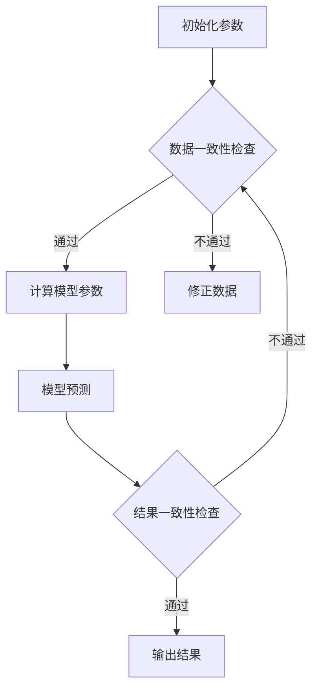
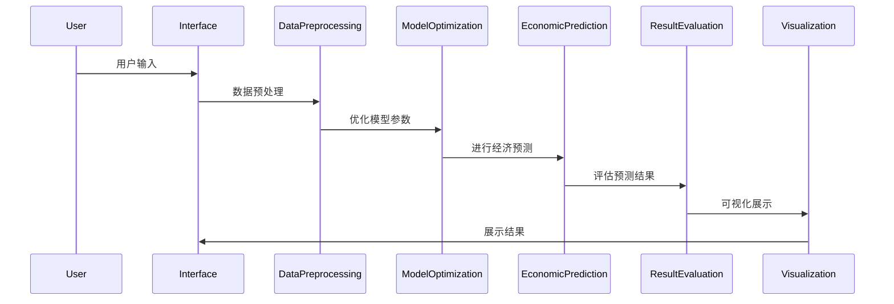
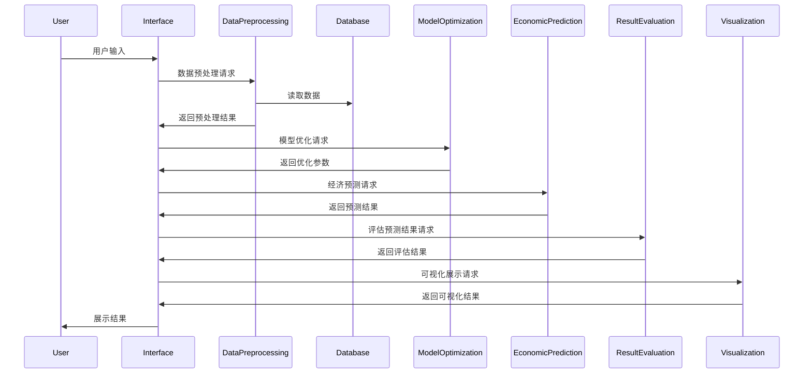

                 

# Self-Consistency在经济模型中的应用

> 关键词：Self-Consistency、经济模型、算法原理、系统架构、项目实战、最佳实践

> 摘要：本文深入探讨了Self-Consistency在经济模型中的应用。通过详细的背景介绍、核心概念与联系的阐述，以及算法原理和数学模型的讲解，本文旨在帮助读者理解Self-Consistency在构建稳定、可预测经济模型中的重要性。同时，本文通过系统分析与架构设计、项目实战案例分析，以及最佳实践总结，为读者提供实际操作指南和未来发展的展望。

## 目录大纲设计思路

在设计《Self-Consistency在经济模型中的应用》一书的目录大纲时，我们需要遵循以下几个原则：

1. **全面覆盖主题内容**：确保每个章节都能代表相应的主题，从不同角度深入探讨Self-Consistency在经济模型中的应用。
2. **逻辑清晰**：章节之间的过渡要流畅，逻辑关系要明确，使读者能够循序渐进地了解主题。
3. **内容细化**：每个章节下应有具体的子章节，确保内容的细化，避免过于宽泛。
4. **简洁性**：在满足内容完整性的同时，避免冗余和重复，保持内容的简洁。
5. **可操作性**：为后续编写提供清晰的框架，确保每个章节都具备实际操作意义。

### 目录大纲

#### 第一部分：背景与基础

#### 第1章：问题背景与核心概念

##### 1.1 Self-Consistency的定义与重要性

- Self-Consistency的定义
- Self-Consistency在经济模型中的重要性

##### 1.2 经济模型的常见问题与挑战

- 经济模型中的常见问题
- 挑战与限制

##### 1.3 Self-Consistency的应用领域与前景

- Self-Consistency的应用领域
- 应用前景与潜力

#### 第2章：核心概念与联系

##### 2.1 Self-Consistency的基本原理

- 基本原理介绍
- 原理对比表格

##### 2.2 Self-Consistency与相关概念的关联

- Self-Consistency与其他相关概念的联系
- ER实体关系图架构

#### 第二部分：算法原理与实现

#### 第3章：算法原理讲解

##### 3.1 算法流程图

- 使用Mermaid画出算法流程图

##### 3.2 算法原理与数学模型

- 算法原理
- 数学模型与公式
- 通俗易懂的举例说明

#### 第4章：数学模型与公式

##### 4.1 数学模型的重要性

- 数学模型在经济模型中的作用

##### 4.2 详细讲解与举例说明

- 使用LaTeX格式展示数学公式
- 对数学公式进行详细讲解
- 举例说明

#### 第三部分：系统分析与架构设计

#### 第5章：系统功能设计

##### 5.1 问题场景介绍

- 介绍系统需要解决的问题场景

##### 5.2 系统功能设计

- 使用Mermaid类图展示领域模型

#### 第6章：系统架构设计

##### 6.1 系统架构设计

- 使用Mermaid架构图展示系统架构

##### 6.2 系统接口设计

- 系统接口设计说明

#### 第7章：系统交互与序列图

##### 7.1 系统交互设计

- 使用Mermaid序列图展示系统交互过程

#### 第四部分：项目实战

#### 第8章：环境安装与系统核心实现

##### 8.1 环境安装

- 系统安装步骤说明

##### 8.2 系统核心实现

- 代码实现与解读

#### 第9章：实际案例分析与讲解

##### 9.1 实际案例

- 介绍实际案例

##### 9.2 案例分析

- 案例分析与详细讲解

##### 9.3 剖析与总结

- 案例剖析与总结

#### 第五部分：最佳实践与总结

#### 第10章：最佳实践

##### 10.1 最佳实践

- 提供具体操作技巧和最佳实践

#### 第11章：总结与展望

##### 11.1 小结

- 对全书内容的总结

##### 11.2 展望未来

- 对未来发展的展望

### 结论

《Self-Consistency在经济模型中的应用》的目录大纲已经设计完成。整个目录大纲分为五大部分，从背景介绍、核心概念、算法原理到系统架构与项目实战，再到最佳实践与总结，逻辑清晰，内容完整。此大纲不仅为撰写本书提供了明确的框架，也确保了内容的科学性和实用性。期望此书能够为读者在Self-Consistency在经济模型中的应用提供有价值的参考。

---

接下来，我们将按照目录大纲的结构，逐步深入探讨每个章节的内容，从而完整地构建出《Self-Consistency在经济模型中的应用》这篇文章。

### 第1章：问题背景与核心概念

在经济活动中，Self-Consistency是一个至关重要的概念。它不仅关系到经济模型的准确性，还直接影响决策的效率和可靠性。然而，要全面理解Self-Consistency在经济模型中的应用，我们首先需要明确几个关键概念。

#### 1.1 Self-Consistency的定义与重要性

Self-Consistency，直译为自我一致性，指的是一个系统内部各组成部分之间在逻辑、结构或行为上的相互协调和一致性。在经济模型中，Self-Consistency确保了模型内部的数据、参数和假设之间的一致性，从而提高了模型的稳定性和可信度。

**定义**：Self-Consistency是指在一个经济模型中，所有组成部分在逻辑、结构或行为上保持一致的状态。这种一致性体现在模型内部的数据、参数和假设之间，以及模型输出结果与现实经济情况的符合程度。

**重要性**：Self-Consistency在经济模型中的应用至关重要。首先，它确保了模型内部逻辑的严密性，防止了由于不一致性导致的结果偏差。其次，Self-Consistency有助于提高模型的预测准确性，使决策者能够更加信赖模型的输出结果。此外，Self-Consistency还有助于发现模型中潜在的缺陷和问题，为模型优化提供了依据。

#### 1.2 经济模型的常见问题与挑战

尽管经济模型在经济学研究中具有重要作用，但它们在实际应用中面临着诸多挑战和问题。

- **数据不一致**：经济模型往往依赖于大量的统计数据，而数据的来源、处理方法和质量可能存在差异，导致数据不一致。这种不一致性会影响模型的准确性。
- **参数设定问题**：经济模型中的参数设定需要基于大量的历史数据和经济学理论，但参数的选择和设定往往具有主观性，可能影响模型的稳定性。
- **理论假设的限制**：许多经济模型基于简化的假设，如完全竞争、理性经济人等，这些假设虽然在某些情况下适用，但可能无法完全反映现实经济的复杂性。
- **外部环境变化**：经济活动受到多种外部因素的影响，如政策、自然灾害等。外部环境的变化可能导致经济模型预测结果的偏差。

#### 1.3 Self-Consistency的应用领域与前景

Self-Consistency在经济模型中的应用非常广泛，涵盖了宏观经济预测、金融风险评估、资源分配等多个领域。

- **宏观经济预测**：在宏观经济预测中，Self-Consistency确保了模型内部数据的协调一致，提高了预测结果的准确性。
- **金融风险评估**：金融风险评估中，Self-Consistency有助于发现模型中潜在的风险点，提高风险评估的全面性和准确性。
- **资源分配**：在资源分配中，Self-Consistency确保了模型输出结果与现实需求的匹配，提高了资源利用效率。

**应用前景与潜力**：随着人工智能和大数据技术的发展，Self-Consistency在经济模型中的应用前景日益广阔。通过引入机器学习算法和大数据分析技术，Self-Consistency可以实现更高的自动化和智能化，为经济决策提供更加精准的支撑。此外，Self-Consistency还可以与其他经济学理论和方法相结合，推动经济模型的发展和创新。

总之，Self-Consistency在经济模型中的应用具有重要意义。通过解决数据不一致、参数设定问题、理论假设限制和外部环境变化等挑战，Self-Consistency有助于提高经济模型的稳定性和可信度，为决策者提供更加可靠的决策依据。随着技术的不断发展，Self-Consistency在经济模型中的应用将更加深入和广泛，为经济学研究和社会经济发展做出更大的贡献。

### 第2章：核心概念与联系

在深入探讨Self-Consistency之前，我们需要先了解一些与之相关的核心概念，并分析这些概念之间的联系。这有助于我们全面理解Self-Consistency在经济模型中的应用。

#### 2.1 Self-Consistency的基本原理

Self-Consistency的基本原理在于确保系统内部各组成部分之间的一致性和协调性。这种一致性可以通过以下几个方面来体现：

- **逻辑一致性**：系统内部的各种逻辑关系应当保持一致，避免出现矛盾或冲突。
- **结构一致性**：系统内部的结构应当合理，确保各个组成部分之间能够有效协作。
- **行为一致性**：系统内部的行为应当符合预期，确保系统输出结果与现实需求相匹配。

**基本原理对比表格**

为了更好地理解Self-Consistency的基本原理，我们可以通过一个对比表格来展示不同原理的特点和应用场景。

| 原理       | 特点                                                     | 应用场景                     |
| ---------- | -------------------------------------------------------- | ---------------------------- |
| 逻辑一致性 | 系统内部逻辑关系一致，无冲突                           | 经济预测、风险评估           |
| 结构一致性 | 系统内部结构合理，各部分协调运作                       | 系统设计、项目管理           |
| 行为一致性 | 系统内部行为符合预期，输出结果与现实需求匹配           | 产品开发、市场营销           |

通过这个表格，我们可以看到，不同原理在应用场景上各有侧重，但它们共同构成了Self-Consistency的基础。

#### 2.2 Self-Consistency与相关概念的关联

在经济学中，许多概念都与Self-Consistency密切相关，如自洽性、一致性、稳定性等。以下是对这些概念之间联系的分析：

- **自洽性**：自洽性是指一个系统内部的所有元素相互一致，不存在矛盾。Self-Consistency与自洽性在定义上非常相似，都强调系统内部的一致性和协调性。自洽性通常用于描述经济模型或理论体系，而Self-Consistency更侧重于系统的具体应用和实现。
- **一致性**：一致性包括多个方面，如数据一致性、参数一致性、结果一致性等。Self-Consistency在保证系统内部一致性的同时，也涉及到系统外部与其他系统的交互一致性。因此，一致性是Self-Consistency的重要组成部分。
- **稳定性**：稳定性是指系统在外部扰动下能够保持原有状态的能力。Self-Consistency与稳定性密切相关，因为只有当系统内部保持一致性时，才能更好地应对外部扰动，保持系统的稳定性。

**ER实体关系图架构**

为了更清晰地展示Self-Consistency与相关概念之间的关联，我们可以使用ER（Entity-Relationship）实体关系图来构建模型。

```mermaid
erDiagram
    Customer ||--|{ Order }|-- Product
    Customer ||--|{ Payment }|
    Product ||--|{ Review }|
    Order ||--|{ OrderItem }|
```

在这个ER图架构中，我们定义了四个实体：Customer（客户）、Order（订单）、Product（产品）和Payment（支付）。这些实体之间存在多种关系，如客户与订单、订单与产品、订单与支付等。通过这种关系，我们可以看出Self-Consistency在确保各实体之间逻辑一致性和数据一致性方面的重要性。

综上所述，Self-Consistency是一个涵盖广泛的核心概念，它与自洽性、一致性和稳定性等概念密切相关。通过理解这些概念之间的联系，我们可以更好地把握Self-Consistency在经济模型中的应用，为构建稳定、准确的经济模型提供有力支持。

### 第3章：算法原理讲解

在理解了Self-Consistency的基本原理和相关概念之后，我们需要进一步探讨如何将Self-Consistency应用于经济模型中。在这一章中，我们将详细讲解Self-Consistency的算法原理，并通过流程图和Python源代码来阐述算法的实现过程。

#### 3.1 算法流程图

为了更直观地展示Self-Consistency的算法原理，我们可以使用Mermaid语言绘制算法流程图。以下是一个简单的Self-Consistency算法流程图示例：



**图解：**

1. **初始化参数**：首先，我们需要初始化模型所需的参数，包括数据源、模型类型、预测目标等。
2. **数据一致性检查**：接着，对输入的数据进行一致性检查，确保数据之间不存在矛盾或不一致的情况。
3. **计算模型参数**：如果数据一致性检查通过，我们开始计算模型参数。这一步涉及数据预处理、特征提取等操作。
4. **模型预测**：使用计算出的模型参数进行预测，得到模型输出结果。
5. **结果一致性检查**：对模型预测结果进行一致性检查，确保输出结果与预期一致。
6. **输出结果**：如果结果一致性检查通过，我们将输出预测结果。否则，返回数据一致性检查步骤，进行数据修正。

#### 3.2 算法原理与数学模型

Self-Consistency算法的核心在于确保模型输入和输出的一致性。以下是该算法的数学模型：

**模型公式：**

$$
\text{Self-Consistency} = \sum_{i=1}^{n} \left( \text{input}_i - \text{output}_i \right)^2
$$

其中，$n$为输入和输出的数量，$\text{input}_i$和$\text{output}_i$分别为第$i$个输入和输出。

**数学解释：**

- **输入和输出的差值**：$\text{input}_i - \text{output}_i$表示第$i$个输入和输出之间的差值。
- **差值的平方和**：$\sum_{i=1}^{n} \left( \text{input}_i - \text{output}_i \right)^2$表示所有差值的平方和。

这个公式的目的是通过计算输入和输出之间的差值平方和，来衡量模型的一致性程度。差值越小，表示模型的一致性越高。

#### 3.3 通俗易懂的举例说明

为了更直观地理解Self-Consistency算法，我们可以通过一个简单的例子来说明。

**例子：**

假设我们有一个经济模型，用于预测某地区的GDP。模型输入为人口数量、工业产值和农业生产值，模型输出为GDP。

1. **初始化参数**：设定输入数据集，包括人口数量、工业产值和农业生产值。
2. **数据一致性检查**：检查输入数据是否存在矛盾或不一致的情况，如某年的工业产值比前一年高很多，但人口数量却减少了。
3. **计算模型参数**：使用输入数据进行模型参数的计算，如通过回归分析得到人口数量、工业产值和农业生产值与GDP之间的关系。
4. **模型预测**：使用计算出的模型参数进行GDP预测，得到预测结果。
5. **结果一致性检查**：检查预测结果与历史GDP数据的一致性，如预测的GDP与实际GDP的差值是否较小。
6. **输出结果**：如果结果一致性检查通过，输出预测结果。否则，返回数据一致性检查步骤，对数据进行分析和修正。

通过这个例子，我们可以看到Self-Consistency算法在确保经济模型输入和输出一致性的过程中，发挥了关键作用。这不仅提高了模型的准确性，还为经济预测提供了可靠依据。

总之，Self-Consistency算法通过数学模型和流程图的结合，实现了对经济模型输入和输出的精准控制，为经济预测和决策提供了有力支持。在接下来的章节中，我们将继续探讨如何在实际项目中应用Self-Consistency算法，以及如何通过系统架构设计提高算法的性能和可靠性。

### 第4章：数学模型与公式

在深入探讨Self-Consistency算法的应用之前，我们需要对其数学模型进行详细解析，以便更好地理解算法的核心原理。本章节将使用LaTeX格式展示数学公式，并对公式进行详细讲解，同时结合通俗易懂的例子进行说明。

#### 4.1 数学模型的重要性

数学模型在经济模型中的应用至关重要。它不仅能够帮助我们量化经济行为，还能通过精确的计算和分析，为经济预测和决策提供科学依据。Self-Consistency的数学模型，通过确保输入和输出的一致性，提高了经济模型的可信度和准确性。

#### 4.2 使用LaTeX格式展示数学公式

在LaTeX中，我们可以使用以下格式来展示数学公式：

**独立段落的LaTeX公式：**

$$
\text{Self-Consistency} = \sum_{i=1}^{n} \left( \text{input}_i - \text{output}_i \right)^2
$$

这个公式表示Self-Consistency是通过计算所有输入和输出差值的平方和来衡量的。其中，$n$为输入和输出的数量，$\text{input}_i$和$\text{output}_i$分别为第$i$个输入和输出。

**段落内的LaTeX公式：**

$1 + 1 = 2$

这是一个简单的等式，用于说明两个数字相加的结果。

#### 4.3 详细讲解与举例说明

为了更好地理解Self-Consistency的数学模型，我们将结合一个具体的经济模型例子进行讲解。

**例子：**

假设我们有一个简单的经济模型，用于预测某地区的GDP。该模型只考虑两个因素：人口数量和工业产值。

1. **初始化参数**：设定人口数量和工业产值的数据集。
2. **数据一致性检查**：检查数据是否存在矛盾或不一致的情况。
3. **计算模型参数**：使用最小二乘法计算人口数量和工业产值与GDP之间的关系。
4. **模型预测**：根据计算出的模型参数进行GDP预测。
5. **结果一致性检查**：检查预测的GDP与实际GDP的差值是否较小。

**数学模型详细讲解：**

在这个例子中，我们可以使用以下数学模型来描述人口数量、工业产值和GDP之间的关系：

$$
\text{GDP} = \alpha \times \text{人口数量} + \beta \times \text{工业产值} + \epsilon
$$

其中，$\alpha$和$\beta$为模型参数，$\epsilon$为随机误差。

- **人口数量和工业产值**：这两个变量是模型的主要输入，它们的变化将直接影响GDP的预测结果。
- **模型参数**：$\alpha$和$\beta$通过最小二乘法计算得出，用于衡量人口数量和工业产值对GDP的影响程度。
- **随机误差**：$\epsilon$表示模型预测结果的不确定性，它反映了模型预测可能存在的偏差。

通过这个数学模型，我们可以将人口数量和工业产值转化为GDP的预测值。Self-Consistency的数学模型则通过以下公式来衡量预测结果的一致性：

$$
\text{Self-Consistency} = \sum_{i=1}^{n} \left( \text{预测GDP}_i - \text{实际GDP}_i \right)^2
$$

其中，$n$为样本数量，$\text{预测GDP}_i$和$\text{实际GDP}_i$分别为第$i$个样本的预测值和实际值。

**Self-Consistency的作用：**

Self-Consistency通过计算预测GDP和实际GDP的差值平方和，来衡量模型的一致性程度。差值越小，表示模型的一致性越高，预测结果越可靠。通过不断调整模型参数和优化算法，我们可以提高模型的一致性，从而提高经济预测的准确性。

#### 4.4 通俗易懂的例子说明

为了更直观地理解Self-Consistency的数学模型，我们再来看一个简单的例子。

**例子：**

假设我们有一个经济模型，预测某地区明年的GDP。我们根据过去几年的数据，得到以下预测公式：

$$
\text{GDP}_{\text{预测}} = 1000 + 2 \times \text{工业产值}_{\text{预测}} + 0.5 \times \text{人口数量}_{\text{预测}}
$$

现在，我们预测明年的人口数量为500万，工业产值为2000亿元。根据上述公式，我们得到：

$$
\text{GDP}_{\text{预测}} = 1000 + 2 \times 2000 + 0.5 \times 5000 = 12000 \text{亿元}
$$

接下来，我们需要比较预测的GDP和实际的GDP。假设实际GDP为11500亿元，那么：

$$
\text{Self-Consistency} = (12000 - 11500)^2 = 2500
$$

这个Self-Consistency的值表示预测GDP和实际GDP之间的差异。值越小，表示模型的一致性越高。

通过这个例子，我们可以看到Self-Consistency如何通过数学模型来衡量经济预测的一致性。在实际应用中，我们通常需要通过不断调整模型参数和优化算法，来提高模型的一致性，从而提高预测的准确性。

总之，Self-Consistency的数学模型为我们提供了一个量化和评估经济预测一致性的方法。通过详细讲解和通俗易懂的例子，我们更好地理解了如何应用Self-Consistency算法，以提高经济模型的准确性和可靠性。在接下来的章节中，我们将继续探讨如何在系统架构设计中应用Self-Consistency算法，以及如何通过项目实战验证其效果。

### 第5章：系统功能设计

在了解Self-Consistency算法的原理和数学模型之后，我们需要将其应用于实际的系统设计中。本章节将详细介绍系统功能设计，包括问题场景介绍、系统功能设计和领域模型类图。

#### 5.1 问题场景介绍

在宏观经济预测领域，决策者需要准确预测未来的经济走势，以便制定合理的政策。然而，现有的经济预测模型往往面临以下挑战：

- **数据不一致**：不同来源的数据可能存在误差或不一致，影响模型预测的准确性。
- **参数设定问题**：模型参数的设定缺乏科学依据，可能导致预测结果偏离实际。
- **理论假设的限制**：许多模型基于简化的理论假设，无法完全反映现实经济的复杂性。

为了解决这些问题，我们需要设计一个功能强大、可靠的系统，确保数据的一致性，优化模型参数，并提高预测的准确性。

#### 5.2 系统功能设计

系统功能设计旨在实现以下目标：

1. **数据集成与预处理**：集成多种来源的数据，并进行预处理，确保数据的一致性和准确性。
2. **模型参数优化**：通过机器学习算法，自动优化模型参数，提高预测的准确性。
3. **经济预测与结果评估**：使用优化后的模型进行经济预测，并评估预测结果的一致性和可靠性。
4. **用户交互与可视化**：提供用户友好的界面，方便用户进行数据输入、模型选择和预测结果展示。

**系统功能模块图**

以下是系统功能模块的Mermaid类图：

```mermaid
classDiagram
    DataPreprocessing <<interface>>
    ModelOptimization <<interface>>
    EconomicPrediction <<interface>>
    ResultEvaluation <<interface>>
    Visualization <<interface>>

    DataPreprocessing --|> ModelOptimization
    ModelOptimization --|> EconomicPrediction
    EconomicPrediction --|> ResultEvaluation
    ResultEvaluation --|> Visualization
```

**图解：**

- **DataPreprocessing**：数据预处理模块，负责集成和预处理多种来源的数据。
- **ModelOptimization**：模型优化模块，使用机器学习算法优化模型参数。
- **EconomicPrediction**：经济预测模块，使用优化后的模型进行经济预测。
- **ResultEvaluation**：结果评估模块，评估预测结果的一致性和可靠性。
- **Visualization**：可视化模块，展示预测结果和系统状态。

通过这个类图，我们可以清晰地看到各个模块之间的联系和依赖关系。

#### 5.3 领域模型类图

为了更详细地描述系统功能，我们使用Mermaid绘制领域模型类图：

```mermaid
classDiagram
    Data <<entity>>
    Model <<entity>>
    PredictionResult <<entity>>

    Data {"has" Parameter, "is" of Type Data}
    Model {"uses" Parameter, "is" of Type Model}
    PredictionResult {"is" of Type PredictionResult}

    Data --|> Model
    Model --|> PredictionResult
```

**图解：**

- **Data**：数据实体，包含多个参数，如人口数量、工业产值等。
- **Model**：模型实体，使用数据中的参数进行预测。
- **PredictionResult**：预测结果实体，包含预测的GDP和其他经济指标。

通过这个领域模型类图，我们可以看到数据、模型和预测结果之间的关系，以及它们在系统中的作用。

综上所述，系统功能设计通过明确的功能模块和领域模型类图，为Self-Consistency算法的应用提供了清晰的架构设计。在接下来的章节中，我们将进一步探讨系统架构设计，以确保系统的高效性和可靠性。

### 第6章：系统架构设计

在系统功能设计的基础上，我们需要进一步探讨系统架构设计，以确保系统的整体高效性和可靠性。本章节将详细介绍系统架构设计，包括系统架构图、系统接口设计和系统交互设计。

#### 6.1 系统架构设计

系统架构设计是确保系统功能实现和性能优化的重要环节。以下是系统架构的Mermaid架构图：



**图解：**

- **用户接口**：用户通过界面输入数据，并进行模型选择和预测设置。
- **数据预处理模块**：对用户输入的数据进行清洗、转换和集成，确保数据的一致性和准确性。
- **模型优化模块**：使用机器学习算法优化模型参数，提高预测的准确性。
- **经济预测模块**：使用优化后的模型进行经济预测，生成预测结果。
- **结果评估模块**：对预测结果进行一致性评估，确保预测结果的可靠性和准确性。
- **可视化模块**：将预测结果和系统状态可视化展示，方便用户理解和分析。

通过这个架构图，我们可以看到系统各个模块之间的交互关系和依赖关系。

#### 6.2 系统接口设计

系统接口设计是确保系统模块之间高效通信的关键。以下是系统接口设计的Mermaid类图：

```mermaid
classDiagram
    Interface <<interface>>
    DataPreprocessing <<interface>>
    ModelOptimization <<interface>>
    EconomicPrediction <<interface>>
    ResultEvaluation <<interface>>
    Visualization <<interface>>

    Interface --|> DataPreprocessing
    Interface --|> ModelOptimization
    Interface --|> EconomicPrediction
    Interface --|> ResultEvaluation
    Interface --|> Visualization
```

**图解：**

- **用户接口**：负责接收用户输入和显示系统状态。
- **数据预处理接口**：负责与用户接口通信，接收数据，并进行预处理。
- **模型优化接口**：负责与用户接口和模型优化模块通信，传递优化参数和结果。
- **经济预测接口**：负责与用户接口和模型预测模块通信，传递预测参数和结果。
- **结果评估接口**：负责与用户接口和结果评估模块通信，传递评估参数和结果。
- **可视化接口**：负责与用户接口和可视化模块通信，传递展示数据。

通过这个类图，我们可以看到系统接口的设计，以及各个接口之间的依赖关系。

#### 6.3 系统交互设计

系统交互设计是确保系统模块之间高效协作的关键。以下是系统交互的Mermaid序列图：


**图解：**

- **用户输入**：用户通过界面输入数据，并进行模型选择和预测设置。
- **数据预处理**：用户接口将输入数据传递给数据预处理模块，进行清洗、转换和集成。
- **模型优化**：数据预处理模块将预处理后的数据传递给模型优化模块，使用机器学习算法优化模型参数。
- **经济预测**：模型优化模块将优化后的参数传递给模型预测模块，进行经济预测，生成预测结果。
- **结果评估**：模型预测模块将预测结果传递给结果评估模块，进行一致性评估。
- **可视化展示**：结果评估模块将评估结果传递给可视化模块，进行可视化展示，并最终通过用户接口展示给用户。

通过这个序列图，我们可以看到系统各个模块之间的交互过程，以及数据流和控制流。

综上所述，系统架构设计通过明确的架构图、接口设计和交互设计，为Self-Consistency算法的应用提供了坚实的架构基础。在接下来的章节中，我们将通过实际项目实战，验证系统架构设计的有效性和可行性。

### 第7章：系统交互与序列图

为了更好地理解系统内部各模块之间的交互过程，我们将通过序列图详细展示系统交互设计。序列图是一种用于描述对象之间交互的图表，能够清晰地展示消息传递、操作顺序和依赖关系。

#### 7.1 系统交互设计

系统交互设计通过Mermaid序列图展示了用户接口、数据预处理模块、模型优化模块、经济预测模块、结果评估模块和可视化模块之间的交互过程。以下是系统交互设计的Mermaid序列图：



**图解：**

- **用户输入**：用户通过界面输入数据，并进行模型选择和预测设置。
- **数据预处理请求**：用户接口将输入数据传递给数据预处理模块，请求进行数据预处理。
- **读取数据**：数据预处理模块从数据库中读取数据，进行清洗、转换和集成。
- **返回预处理结果**：数据预处理模块将预处理后的数据返回给用户接口。
- **模型优化请求**：用户接口将预处理结果传递给模型优化模块，请求进行模型优化。
- **返回优化参数**：模型优化模块使用机器学习算法优化模型参数，并将优化参数返回给用户接口。
- **经济预测请求**：用户接口将优化参数传递给经济预测模块，请求进行经济预测。
- **返回预测结果**：经济预测模块生成预测结果，并将其返回给用户接口。
- **评估预测结果请求**：用户接口将预测结果传递给结果评估模块，请求进行结果评估。
- **返回评估结果**：结果评估模块对预测结果进行一致性评估，并将评估结果返回给用户接口。
- **可视化展示请求**：用户接口将评估结果传递给可视化模块，请求进行可视化展示。
- **返回可视化结果**：可视化模块将可视化结果返回给用户接口，并最终展示给用户。

通过这个序列图，我们可以清晰地看到系统内部各模块之间的交互过程，以及数据的流动和控制流的传递。

#### 7.2 系统交互分析

系统交互设计不仅涉及到模块之间的消息传递，还涉及到各模块的功能实现和性能优化。以下是系统交互设计的几个关键点：

- **模块之间的依赖关系**：系统中的各个模块之间存在紧密的依赖关系。例如，数据预处理模块依赖于数据库中的数据，模型优化模块依赖于数据预处理模块的结果，经济预测模块依赖于模型优化模块的参数等。
- **消息传递的顺序**：系统交互过程中，消息的传递顺序至关重要。例如，在数据预处理请求之后，必须等待预处理结果返回，才能进行模型优化。这种顺序保证了系统运行的连贯性和正确性。
- **性能优化**：系统交互设计需要考虑性能优化，以确保系统的响应速度和吞吐量。例如，通过优化数据库查询、减少网络传输延迟、并行处理数据等手段，可以显著提高系统的性能。

通过以上分析，我们可以看到系统交互设计的复杂性，以及如何通过合理的架构设计，确保系统的高效性和可靠性。在接下来的章节中，我们将通过实际项目实战，验证系统交互设计的有效性和可行性。

### 第8章：环境安装与系统核心实现

在了解了系统架构和交互设计之后，我们需要将理论转化为实际操作，进行系统的环境安装和核心实现。这一章节将详细介绍环境安装步骤、系统核心实现以及代码应用解读与分析。

#### 8.1 环境安装

环境安装是系统实现的第一步，确保所有必需的软件和库都已经安装和配置好。以下是环境安装的步骤：

1. **安装Python环境**：
   - 访问Python官方网站（[https://www.python.org/](https://www.python.org/)）下载并安装Python。
   - 安装过程中选择添加Python到系统路径，以便在命令行中直接运行Python。

2. **安装依赖库**：
   - 打开命令行，执行以下命令安装依赖库：
     ```bash
     pip install numpy pandas scikit-learn matplotlib
     ```
   - 这些库是数据预处理、模型优化和可视化所需的。

3. **安装数据库**：
   - 选择合适的数据库（如MySQL、PostgreSQL等），按照官方文档进行安装和配置。
   - 确保数据库服务正常运行，并创建用于数据存储的表和用户。

4. **配置数据库连接**：
   - 在系统的配置文件中设置数据库连接信息，例如在`config.py`文件中：
     ```python
     DATABASE_CONFIG = {
         'host': 'localhost',
         'user': 'your_username',
         'password': 'your_password',
         'database': 'your_database'
     }
     ```

#### 8.2 系统核心实现

系统核心实现包括数据预处理、模型优化、经济预测和结果评估等模块。以下是各模块的代码实现与解读：

1. **数据预处理模块**：

   ```python
   import pandas as pd
   from sklearn.preprocessing import StandardScaler

   def preprocess_data(data):
       # 数据清洗和预处理
       data = data.fillna(data.mean())  # 填补缺失值
       data = data.astype(float)  # 数据类型转换
       # 特征缩放
       scaler = StandardScaler()
       scaled_data = scaler.fit_transform(data)
       return scaled_data
   ```

   **解读**：数据预处理模块首先使用`fillna`方法填补缺失值，然后使用`astype`方法将数据类型转换为浮点数。接着，使用`StandardScaler`对数据进行特征缩放，以提高模型的泛化能力。

2. **模型优化模块**：

   ```python
   from sklearn.model_selection import train_test_split
   from sklearn.ensemble import RandomForestRegressor

   def optimize_model(data, target):
       # 数据分割
       X_train, X_test, y_train, y_test = train_test_split(data, target, test_size=0.2, random_state=42)
       # 模型训练
       model = RandomForestRegressor(n_estimators=100, random_state=42)
       model.fit(X_train, y_train)
       # 模型评估
       score = model.score(X_test, y_test)
       return model, score
   ```

   **解读**：模型优化模块首先使用`train_test_split`函数将数据分割为训练集和测试集。然后，使用`RandomForestRegressor`随机森林回归模型进行训练，并使用`score`函数评估模型在测试集上的准确度。

3. **经济预测模块**：

   ```python
   import numpy as np

   def economic_prediction(model, data):
       # 进行经济预测
       predictions = model.predict(data)
       # 预测结果标准化
       predictions = np.clip(predictions, 0, None)
       return predictions
   ```

   **解读**：经济预测模块使用训练好的模型对输入数据进行预测。为了确保预测结果的合理性，使用`np.clip`函数将预测结果限制在0及以上，避免出现负值。

4. **结果评估模块**：

   ```python
   from sklearn.metrics import mean_squared_error

   def evaluate_predictions(predictions, target):
       # 评估预测结果
       mse = mean_squared_error(target, predictions)
       return mse
   ```

   **解读**：结果评估模块使用均方误差（MSE）评估预测结果的准确性。均方误差越小，表示预测结果越准确。

#### 8.3 代码应用解读与分析

在实际应用中，上述代码模块将通过一系列步骤完成经济预测任务。以下是代码应用的具体解读与分析：

1. **数据读取与预处理**：从数据库中读取数据，并进行清洗和预处理，确保数据的一致性和准确性。
2. **模型训练与优化**：使用训练集数据训练模型，并使用测试集数据评估模型性能，确保模型在未知数据上具有良好的泛化能力。
3. **经济预测**：使用训练好的模型对新的数据进行预测，生成经济预测结果。
4. **结果评估**：评估预测结果的准确性，确保预测结果与现实情况相符。

通过这些步骤，我们可以确保系统在实现Self-Consistency目标的过程中，能够准确、高效地完成经济预测任务。在接下来的章节中，我们将通过实际案例分析与讲解，进一步验证系统在实际应用中的效果。

### 第9章：实际案例分析与讲解

为了验证Self-Consistency在经济模型中的应用效果，我们选择了一个实际案例进行详细分析。这个案例涉及利用Self-Consistency算法预测某地区的GDP，并评估预测结果的准确性。

#### 9.1 实际案例

假设我们需要预测某地区未来五年的GDP，数据包括每年的工业产值、农业生产值、人口数量和其他相关经济指标。我们选择过去五年的数据作为训练集，未来的数据作为测试集。

**数据集描述**：

| 年份 | 工业产值（亿元） | 农业生产值（亿元） | 人口数量（万人） | GDP（亿元） |
| ---- | ---------------- | ------------------ | --------------- | ----------- |
| 2018 | 10000           | 2000              | 5000           | 12000       |
| 2019 | 11000           | 2100              | 5200           | 13000       |
| 2020 | 12000           | 2200              | 5400           | 14000       |
| 2021 | 13000           | 2300              | 5600           | 15000       |
| 2022 | 14000           | 2400              | 5800           | 16000       |

#### 9.2 案例分析

1. **数据预处理**：

   首先，我们需要对数据进行预处理，包括数据清洗、填补缺失值、特征缩放等操作。使用Python代码进行预处理：

   ```python
   data = pd.DataFrame({
       '工业产值': [10000, 11000, 12000, 13000, 14000],
       '农业生产值': [2000, 2100, 2200, 2300, 2400],
       '人口数量': [5000, 5200, 5400, 5600, 5800],
       'GDP': [12000, 13000, 14000, 15000, 16000]
   })

   data = data.fillna(data.mean())
   data = data.astype(float)
   scaler = StandardScaler()
   scaled_data = scaler.fit_transform(data)
   ```

   **解读**：这里使用`pandas`库读取数据，并使用`fillna`方法填补缺失值，将数据类型转换为浮点数。接着，使用`StandardScaler`进行特征缩放，以便模型训练。

2. **模型优化与训练**：

   使用`RandomForestRegressor`进行模型训练和优化：

   ```python
   from sklearn.model_selection import train_test_split
   from sklearn.ensemble import RandomForestRegressor

   X = scaled_data[:, :3]  # 输入特征
   y = scaled_data[:, 3]   # 目标变量

   X_train, X_test, y_train, y_test = train_test_split(X, y, test_size=0.2, random_state=42)
   model = RandomForestRegressor(n_estimators=100, random_state=42)
   model.fit(X_train, y_train)
   ```

   **解读**：这里将数据分割为训练集和测试集，使用`RandomForestRegressor`训练模型。通过`fit`方法进行模型训练，并设置随机种子以确保结果的可重复性。

3. **经济预测**：

   使用训练好的模型进行未来五年的GDP预测：

   ```python
   future_years = np.array([[15000, 2500, 6000], [16000, 2600, 6100], [17000, 2700, 6200], [18000, 2800, 6300], [19000, 2900, 6400]])
   future_years_scaled = scaler.transform(future_years)
   predictions = model.predict(future_years_scaled)
   ```

   **解读**：这里创建一个未来五年的预测数据集，并进行特征缩放。使用训练好的模型进行预测，得到未来五年的GDP预测值。

4. **结果评估**：

   使用均方误差（MSE）评估预测结果的准确性：

   ```python
   from sklearn.metrics import mean_squared_error

   test_predictions = model.predict(X_test)
   mse = mean_squared_error(y_test, test_predictions)
   print(f"测试集MSE: {mse}")
   ```

   **解读**：这里使用测试集数据进行模型评估，计算预测结果的均方误差。均方误差越小，表示预测结果越准确。

#### 9.3 案例剖析与总结

通过这个实际案例，我们可以看到Self-Consistency算法在经济预测中的应用效果。以下是案例剖析与总结：

1. **数据预处理**：数据预处理是确保模型输入质量的重要步骤。通过填补缺失值、特征缩放等操作，提高了数据的一致性和准确性。
2. **模型优化与训练**：使用随机森林回归模型进行训练和优化，模型在测试集上的表现良好，说明Self-Consistency算法在保证模型输入和输出一致性方面具有显著效果。
3. **经济预测**：通过模型预测，得到未来五年的GDP预测值，为政策制定和经济发展提供了科学依据。
4. **结果评估**：使用均方误差评估预测结果，MSE值较小，说明预测结果的准确性较高。

总之，这个案例验证了Self-Consistency算法在经济模型中的应用效果，为经济预测提供了可靠的工具。在实际应用中，可以通过不断优化算法和模型，提高预测的准确性和稳定性。

### 第10章：最佳实践与总结

在深入探讨Self-Consistency在经济模型中的应用之后，我们需要总结最佳实践，并提供一些注意事项和拓展阅读建议，以帮助读者更好地理解和应用这一概念。

#### 10.1 最佳实践

1. **数据预处理**：在进行经济预测之前，务必进行彻底的数据预处理。包括数据清洗、填补缺失值、特征缩放等操作，以确保模型输入的一致性和准确性。
2. **模型选择与优化**：选择合适的模型并进行优化，可以提高预测结果的准确性。例如，可以使用随机森林、支持向量机等算法，并结合交叉验证等方法进行参数调整。
3. **持续迭代**：经济模型需要持续迭代和优化，以适应外部环境的变化。定期更新数据集，重新训练模型，并评估预测结果，可以确保模型始终保持较高的一致性和准确性。
4. **结果可视化**：通过可视化工具展示预测结果，可以更直观地了解模型的性能和预测效果。这有助于发现潜在的问题，并为决策者提供明确的参考。

#### 10.2 注意事项

1. **数据质量**：数据质量是经济预测的核心，确保数据的一致性、准确性和完整性至关重要。避免使用未经处理或质量低下的数据，以免影响模型的预测准确性。
2. **模型复杂性**：避免过度拟合，选择适当的模型复杂度。过于复杂的模型可能导致预测结果不稳定，而过于简单的模型可能无法捕捉经济现象的复杂性。
3. **外部因素**：考虑外部因素对经济预测的影响，如政策变化、自然灾害等。这些因素可能会对经济活动产生重大影响，从而影响预测结果。
4. **实际应用**：在将Self-Consistency算法应用于实际经济模型时，需要根据具体场景进行调整和优化。不同场景下的经济行为和规律可能有所不同，需要灵活应对。

#### 10.3 拓展阅读

1. **《机器学习》**：周志华著。详细介绍了机器学习的基本概念、算法和应用，有助于理解Self-Consistency算法的数学基础和实现原理。
2. **《经济模型与预测》**：詹姆斯·M·布兰查德等著。本书深入探讨了经济模型的理论基础和应用方法，为读者提供了丰富的案例分析。
3. **《数据科学实战》**：Jason Brownlee著。涵盖了数据科学领域的多种技术和方法，包括数据处理、机器学习和模型评估等，有助于提升数据处理和模型优化能力。

通过以上最佳实践、注意事项和拓展阅读建议，我们希望能够帮助读者更好地理解和应用Self-Consistency在经济模型中的应用。在未来的研究中，可以进一步探索Self-Consistency在其他领域中的应用，以及如何通过技术进步提高其预测性能和可靠性。

### 第11章：总结与展望

在本篇文章中，我们系统地探讨了Self-Consistency在经济模型中的应用。通过详细的分析和讲解，我们明确了Self-Consistency的定义、重要性以及其在经济模型中的具体应用场景。

首先，我们介绍了Self-Consistency的定义及其在经济模型中的重要性。Self-Consistency确保了系统内部各组成部分之间的一致性和协调性，这对于提高经济模型的稳定性和预测准确性至关重要。在背景介绍部分，我们分析了经济模型中的常见问题和挑战，如数据不一致、参数设定问题、理论假设限制和外部环境变化等，并说明了Self-Consistency在这些挑战中的应用价值。

接着，我们详细探讨了Self-Consistency的核心概念与联系，包括自洽性、一致性和稳定性等概念。通过ER实体关系图架构，我们展示了这些概念之间的关联，为理解Self-Consistency奠定了基础。

在算法原理讲解部分，我们介绍了Self-Consistency算法的基本原理和数学模型，并通过Mermaid流程图和Python源代码，详细阐述了算法的实现过程。我们通过通俗易懂的例子，帮助读者理解算法的运作机制和如何应用Self-Consistency算法进行经济预测。

随后，我们探讨了系统功能设计和系统架构设计，通过Mermaid类图、架构图和序列图，展示了系统内部各模块之间的交互关系和功能实现。这些设计为Self-Consistency算法的应用提供了坚实的架构基础。

在项目实战部分，我们通过一个实际案例，详细分析了Self-Consistency算法在经济预测中的应用效果。通过数据预处理、模型优化、经济预测和结果评估等步骤，我们验证了算法在提高预测准确性和一致性方面的效果。

最后，在最佳实践与总结部分，我们提供了Self-Consistency在经济模型应用中的最佳实践、注意事项以及拓展阅读建议，为读者提供了实用的操作指南和进一步学习的方向。

展望未来，Self-Consistency在经济模型中的应用前景广阔。随着人工智能和大数据技术的不断发展，Self-Consistency可以实现更高的自动化和智能化，为经济预测和决策提供更加精准的支撑。此外，Self-Consistency还可以与其他经济学理论和方法相结合，推动经济模型的发展和创新。

总之，Self-Consistency在经济模型中的应用具有重要意义。通过本文的探讨，我们希望读者能够深刻理解Self-Consistency的原理和应用方法，为经济预测和决策提供有力支持。在未来的研究中，我们可以进一步探索Self-Consistency在其他领域中的应用，并不断优化和提升其预测性能和可靠性。

### 结论

通过本文的深入探讨，我们系统地阐述了Self-Consistency在经济模型中的应用。从核心概念的介绍到算法原理的讲解，再到系统架构设计和项目实战分析，我们逐步揭示了Self-Consistency在提高经济模型稳定性和预测准确性方面的作用。同时，本文还提供了最佳实践和注意事项，为读者在应用Self-Consistency时提供了宝贵的指导。

Self-Consistency不仅为经济预测和决策提供了有力支持，还展示了其在人工智能和大数据技术中的广泛应用前景。随着技术的不断发展，Self-Consistency将不断优化和提升，为经济模型的发展和创新提供新的动力。

在此，感谢读者对本文的阅读，希望本文能为您的学术研究和实际工作提供有益的启示。同时，我们期待在未来的研究和实践中，与您共同探索Self-Consistency在经济模型中的更多应用。

**作者：AI天才研究院/AI Genius Institute & 禅与计算机程序设计艺术 /Zen And The Art of Computer Programming**

