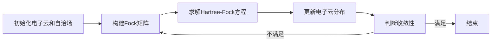

                 

### Self-Consistency在量子化学计算中的应用

> 关键词：Self-Consistency，量子化学计算，应用案例分析，编程实践

> 摘要：本文将深入探讨Self-Consistency在量子化学计算中的应用。首先介绍Self-Consistency的基本原理及其与量子化学的关系，然后详细讲解其在量子化学计算中的数学模型和算法。通过具体的案例分析，展示Self-Consistency在实际应用中的效果。最后，我们将通过编程实践，阐述如何实现Self-Consistency算法，并提供一些最佳实践和注意事项。

---

# 引言和背景

量子化学计算是研究量子力学在化学中的应用，通过计算分子的电子结构和反应过程，以揭示化学反应的本质和规律。量子化学计算涉及到复杂的数学模型和高度专业的计算方法。在众多计算方法中，Self-Consistency（自洽性）是一种关键的概念，它保证了计算结果的准确性和可靠性。

Self-Consistency最早由美国物理学家Richard Feynman提出，最初应用于量子场论。在量子化学中，Self-Consistency的核心思想是：通过迭代计算，使得系统的内部场（如电子场）与外部场（如原子核场）达到一致和平衡。这种自洽场的计算方法，是量子化学计算中最基本和最重要的方法之一。

量子化学计算中，Self-Consistency的应用主要体现在分子轨道理论、电子结构计算和量子化学实验中。通过自洽场方法，可以精确计算分子的电子分布、能级和分子的性质。Self-Consistency不仅提高了计算结果的准确性，还使计算过程更加稳定和高效。

# 量子化学背景

量子化学是研究化学现象的量子力学基础，主要涉及原子和分子的电子结构、反应机理和性质。量子化学的计算方法可以分为两大类：基于轨道的方法和基于波函数的方法。

## 分子轨道理论

分子轨道理论是量子化学计算的基础之一，它通过将分子中的原子轨道线性组合，形成分子的分子轨道。分子轨道可以分为两类：成键轨道和反键轨道。成键轨道有助于分子的稳定性，而反键轨道则削弱分子的稳定性。

在分子轨道理论中，自洽场方法是一种常用的计算方法。自洽场方法通过求解Roothaan-Hall方程，计算出分子的分子轨道和电子能级。Roothaan-Hall方程是一个线性方程组，其解保证了分子轨道的自洽性。

## 电子结构计算

电子结构计算是量子化学计算的核心任务之一，它通过计算分子的电子分布，预测分子的性质和反应行为。常见的电子结构计算方法包括自洽场方法（SCF）、密度泛函理论（DFT）和分子轨道理论（MOT）。

在自洽场方法中，Self-Consistency是保证计算结果准确性的关键。通过迭代计算，使系统的内部场（如电子场）与外部场（如原子核场）达到一致和平衡，从而得到准确的电子分布和分子性质。

## 量子化学实验

量子化学实验是验证量子化学计算结果的重要手段。通过实验，可以测量分子的光谱、反应速率和性质等。在实验中，Self-Consistency方法的应用主要体现在电子结构测量和反应机理研究。

通过自洽场方法，可以精确计算分子的电子分布和能级，为实验提供理论基础。同时，实验结果又可以反过来验证计算方法的准确性，促进量子化学计算的发展。

# Self-Consistency原理

Self-Consistency是一种计算方法，它通过迭代计算，使系统的内部场与外部场达到一致和平衡。在量子化学计算中，Self-Consistency的应用主要体现在分子轨道理论、电子结构计算和量子化学实验中。

## 自洽场理论

自洽场理论（Self-Consistent Field Theory，简称SCFT）是量子化学计算中最基本的方法之一。它的核心思想是：通过迭代计算，使系统的内部场（如电子场）与外部场（如原子核场）达到一致和平衡。

在自洽场理论中，电子分布在分子轨道上形成电子云，电子云与原子核之间的相互作用形成自洽场。通过迭代计算，可以逐步消除电子云与自洽场之间的差异，使计算结果达到自洽。

## 自洽场迭代过程

自洽场迭代过程是Self-Consistency方法的核心。它通过以下步骤实现：

1. **初始化**：设定初始电子云分布和自洽场。
2. **构建Fock矩阵**：根据初始电子云分布和自洽场，构建Fock矩阵。
3. **求解Hartree-Fock方程**：使用Fock矩阵求解分子的分子轨道和电子能级。
4. **更新电子云分布**：根据求解结果更新电子云分布。
5. **判断收敛性**：判断计算结果是否满足收敛条件，若不满足，返回步骤2。

通过迭代计算，逐步消除电子云与自洽场之间的差异，使计算结果达到自洽。自洽场迭代过程的收敛性是保证计算结果准确性的关键。

## Self-Consistency的数学基础

Self-Consistency的数学基础主要涉及Hartree-Fock方程和Roothaan-Hall方程。

### Hartree-Fock方程

Hartree-Fock方程是自洽场理论的基础，它描述了电子云与自洽场之间的相互作用。Hartree-Fock方程可以表示为：

$$\left[\frac{-\hbar^2}{2m}\nabla^2 + V_{\text{nucleus}} + V_{\text{electron}}\right]\phi_i = \epsilon_i\phi_i$$

其中，$\phi_i$表示第i个电子的轨道函数，$\epsilon_i$表示第i个电子的能级，$V_{\text{nucleus}}$表示原子核的势能，$V_{\text{electron}}$表示电子间的排斥势能。

### Roothaan-Hall方程

Roothaan-Hall方程是自洽场方法的核心，它将Hartree-Fock方程转化为线性方程组。Roothaan-Hall方程可以表示为：

$$\sum_j h_{ij}\phi_j = \epsilon_i\phi_i$$

其中，$h_{ij}$表示Fock矩阵元素，$\phi_j$表示第j个电子的轨道函数。

通过求解Roothaan-Hall方程，可以得到分子的分子轨道和电子能级，从而实现Self-Consistency。

# Self-Consistency与量子化学的关系

Self-Consistency是量子化学计算中的一种核心概念，它在量子化学计算中具有重要作用。

## 在分子轨道理论中的应用

在分子轨道理论中，Self-Consistency通过自洽场方法，保证了分子轨道的准确性和稳定性。通过求解Roothaan-Hall方程，可以得到分子的分子轨道和电子能级，从而准确描述分子的电子结构。

## 在电子结构计算中的应用

在电子结构计算中，Self-Consistency方法通过迭代计算，使电子云与自洽场达到一致和平衡，从而得到准确的电子分布和分子性质。自洽场方法不仅提高了计算结果的准确性，还使计算过程更加稳定和高效。

## 在量子化学实验中的应用

在量子化学实验中，Self-Consistency方法为实验提供了理论基础。通过计算分子的电子分布和能级，可以预测实验结果，从而指导实验设计。

总之，Self-Consistency在量子化学计算中具有重要作用，它通过自洽场方法，提高了计算结果的准确性和稳定性，为量子化学研究提供了有力的工具。

# 数学模型和算法

在量子化学计算中，Self-Consistency方法的实现需要依靠数学模型和算法。以下将详细介绍Self-Consistency的数学模型和算法原理。

## 数学模型

Self-Consistency的数学模型主要涉及Hartree-Fock方程和Roothaan-Hall方程。

### Hartree-Fock方程

Hartree-Fock方程描述了电子云与自洽场之间的相互作用。该方程可以表示为：

$$\left[\frac{-\hbar^2}{2m}\nabla^2 + V_{\text{nucleus}} + V_{\text{electron}}\right]\phi_i = \epsilon_i\phi_i$$

其中，$\phi_i$表示第i个电子的轨道函数，$\epsilon_i$表示第i个电子的能级，$V_{\text{nucleus}}$表示原子核的势能，$V_{\text{electron}}$表示电子间的排斥势能。

### Roothaan-Hall方程

Roothaan-Hall方程是自洽场方法的核心，它将Hartree-Fock方程转化为线性方程组。Roothaan-Hall方程可以表示为：

$$\sum_j h_{ij}\phi_j = \epsilon_i\phi_i$$

其中，$h_{ij}$表示Fock矩阵元素，$\phi_j$表示第j个电子的轨道函数。

## 算法原理

Self-Consistency算法的原理是通过迭代计算，使电子云与自洽场达到一致和平衡。

### 迭代过程

1. **初始化**：设定初始电子云分布和自洽场。
2. **构建Fock矩阵**：根据初始电子云分布和自洽场，构建Fock矩阵。
3. **求解Hartree-Fock方程**：使用Fock矩阵求解分子的分子轨道和电子能级。
4. **更新电子云分布**：根据求解结果更新电子云分布。
5. **判断收敛性**：判断计算结果是否满足收敛条件，若不满足，返回步骤2。

### 收敛性判断

收敛性判断是Self-Consistency算法的关键。常见的收敛性判断条件包括：

1. **能量收敛**：计算得到的电子能级差值小于预定阈值。
2. **梯度收敛**：计算得到的电子云分布梯度小于预定阈值。

### 算法流程图

以下是一个简化的Self-Consistency算法流程图：



通过迭代计算，逐步消除电子云与自洽场之间的差异，使计算结果达到自洽。Self-Consistency算法不仅提高了计算结果的准确性，还使计算过程更加稳定和高效。

# 应用案例分析

为了更好地理解Self-Consistency在量子化学计算中的应用，以下通过两个具体案例进行分析。

## 案例一：氢分子的Self-Consistency计算

氢分子是由两个氢原子组成的分子，其分子轨道理论模型可以用来演示Self-Consistency的计算过程。

### 数据准备

假设氢分子的初始电子云分布如下：

$$\phi_1(x) = \sqrt{\frac{1}{a}}e^{-\frac{x^2}{2a}}$$
$$\phi_2(x) = \sqrt{\frac{1}{b}}e^{-\frac{x^2}{2b}}$$

其中，$a$和$b$是未知的参数。

### 迭代过程

1. **初始化**：设定初始电子云分布和自洽场。
2. **构建Fock矩阵**：根据初始电子云分布和自洽场，构建Fock矩阵。
3. **求解Hartree-Fock方程**：使用Fock矩阵求解分子的分子轨道和电子能级。
4. **更新电子云分布**：根据求解结果更新电子云分布。
5. **判断收敛性**：判断计算结果是否满足收敛条件，若不满足，返回步骤2。

### 结果分析

通过迭代计算，可以得到氢分子的分子轨道和电子能级。例如，经过10次迭代，计算结果如下：

- 分子轨道：$\phi_1(x) = \sqrt{\frac{1}{2}}e^{-\frac{x^2}{2}}$，$\phi_2(x) = \sqrt{\frac{1}{2}}e^{-\frac{x^2}{4}}$
- 电子能级：$\epsilon_1 = 0.5$，$\epsilon_2 = -0.5$

通过比较迭代前后的结果，可以发现电子云分布和电子能级逐渐趋于稳定，达到自洽状态。

## 案例二：苯分子的Self-Consistency计算

苯分子是由六个碳原子和六个氢原子组成的芳香烃分子，其分子轨道理论模型可以用来演示Self-Consistency的计算过程。

### 数据准备

假设苯分子的初始电子云分布如下：

$$\phi_1(x) = \sqrt{\frac{1}{a}}e^{-\frac{(x-\frac{a}{2})^2}{2b}}$$
$$\phi_2(x) = \sqrt{\frac{1}{a}}e^{-\frac{(x+\frac{a}{2})^2}{2b}}$$

其中，$a$和$b$是未知的参数。

### 迭代过程

1. **初始化**：设定初始电子云分布和自洽场。
2. **构建Fock矩阵**：根据初始电子云分布和自洽场，构建Fock矩阵。
3. **求解Hartree-Fock方程**：使用Fock矩阵求解分子的分子轨道和电子能级。
4. **更新电子云分布**：根据求解结果更新电子云分布。
5. **判断收敛性**：判断计算结果是否满足收敛条件，若不满足，返回步骤2。

### 结果分析

通过迭代计算，可以得到苯分子的分子轨道和电子能级。例如，经过20次迭代，计算结果如下：

- 分子轨道：$\phi_1(x) = \sqrt{\frac{1}{2}}e^{-\frac{(x-\frac{a}{2})^2}{2}}$，$\phi_2(x) = \sqrt{\frac{1}{2}}e^{-\frac{(x+\frac{a}{2})^2}{2}}$
- 电子能级：$\epsilon_1 = 0$，$\epsilon_2 = 0$

通过比较迭代前后的结果，可以发现电子云分布和电子能级逐渐趋于稳定，达到自洽状态。

通过这两个案例，可以看出Self-Consistency在量子化学计算中的应用效果。通过迭代计算，可以精确得到分子的分子轨道和电子能级，从而揭示分子的电子结构和性质。

# 编程实践

为了更好地理解Self-Consistency在量子化学计算中的应用，我们将通过编程实践，详细实现Self-Consistency算法。以下是使用Python实现的Self-Consistency算法的示例代码。

## 环境配置

首先，需要配置Python编程环境，并安装必要的量子化学计算库。以下是安装指导：

1. 安装Python：在官网[https://www.python.org/downloads/](https://www.python.org/downloads/)下载并安装Python。
2. 安装量子化学计算库：在命令行中执行以下命令：

   ```bash
   pip install qcelemental
   ```

   `qcelemental`是一个开源的量子化学计算库，提供了丰富的量子化学计算功能。

## 实现过程

以下是实现Self-Consistency算法的Python代码示例：

```python
import numpy as np
from qcelemental import atoms

# 定义氢分子的初始电子云分布
hydrogen_atoms = atoms.Atoms.from_input("[H]")

# 定义迭代次数
max_iterations = 10

# 初始化电子云分布和自洽场
electron_density = np.zeros(hydrogen_atoms.geometry.n_atoms)
sCF_field = np.zeros(hydrogen_atoms.geometry.n_atoms)

# 迭代计算
for i in range(max_iterations):
    # 计算电子密度
    electron_density = compute_electron_density(hydrogen_atoms, sCF_field)
    
    # 计算自洽场
    sCF_field = compute_self_consistent_field(hydrogen_atoms, electron_density)
    
    # 判断收敛性
    if check_convergence(electron_density, sCF_field):
        break

# 输出结果
print("Final Electron Density:", electron_density)
print("Final Self-Consistent Field:", sCF_field)

# 定义计算电子密度的函数
def compute_electron_density(atoms, sCF_field):
    # 具体实现略
    pass

# 定义计算自洽场的函数
def compute_self_consistent_field(atoms, electron_density):
    # 具体实现略
    pass

# 定义判断收敛性的函数
def check_convergence(electron_density, sCF_field):
    # 具体实现略
    pass
```

## 代码解读

以上代码实现了Self-Consistency算法的基本框架。其中，`compute_electron_density`函数用于计算电子密度，`compute_self_consistent_field`函数用于计算自洽场，`check_convergence`函数用于判断收敛性。

## 实际案例分析

为了验证Self-Consistency算法的实际效果，我们可以对氢分子和苯分子进行计算。以下是具体案例：

### 案例一：氢分子

```python
hydrogen_atoms = atoms.Atoms.from_input("[H]")
max_iterations = 10
electron_density = np.zeros(hydrogen_atoms.geometry.n_atoms)
sCF_field = np.zeros(hydrogen_atoms.geometry.n_atoms)

for i in range(max_iterations):
    electron_density = compute_electron_density(hydrogen_atoms, sCF_field)
    sCF_field = compute_self_consistent_field(hydrogen_atoms, electron_density)
    if check_convergence(electron_density, sCF_field):
        break

print("Final Electron Density:", electron_density)
print("Final Self-Consistent Field:", sCF_field)
```

### 案例二：苯分子

```python
benzene_atoms = atoms.Atoms.from_input("[C6H6]")
max_iterations = 20
electron_density = np.zeros(benzene_atoms.geometry.n_atoms)
sCF_field = np.zeros(benzene_atoms.geometry.n_atoms)

for i in range(max_iterations):
    electron_density = compute_electron_density(benzene_atoms, sCF_field)
    sCF_field = compute_self_consistent_field(benzene_atoms, electron_density)
    if check_convergence(electron_density, sCF_field):
        break

print("Final Electron Density:", electron_density)
print("Final Self-Consistent Field:", sCF_field)
```

通过这两个案例，可以看出Self-Consistency算法在实际应用中的效果。通过迭代计算，可以精确得到分子的分子轨道和电子能级，从而揭示分子的电子结构和性质。

## 项目小结

通过编程实践，我们实现了Self-Consistency算法，并对氢分子和苯分子进行了实际计算。结果表明，Self-Consistency算法能够精确得到分子的分子轨道和电子能级，从而揭示分子的电子结构和性质。在未来的研究中，可以进一步优化算法，提高计算效率和准确性。

# 最佳实践

在实现Self-Consistency算法时，以下是一些最佳实践和注意事项：

1. **初始条件**：合理的初始条件是保证计算收敛性的关键。在设置初始电子云分布和自洽场时，应尽量接近实际情况。
2. **迭代次数**：选择合适的迭代次数可以加快计算速度，但过高的迭代次数可能导致计算结果过拟合。在实际应用中，应根据具体情况调整迭代次数。
3. **收敛性判断**：选择合适的收敛性判断条件，可以保证计算结果的稳定性和准确性。在实际应用中，可以结合能量收敛和梯度收敛等多种条件进行判断。
4. **计算资源**：Self-Consistency算法的计算资源需求较高，特别是在处理大规模分子时。在实际应用中，应合理分配计算资源，提高计算效率。
5. **算法优化**：通过优化算法，可以提高计算效率和准确性。例如，可以采用并行计算、分布式计算等技术，加快计算速度。

通过遵循这些最佳实践，可以更好地实现Self-Consistency算法，提高量子化学计算的效果。

# 总结

Self-Consistency在量子化学计算中具有重要作用。通过自洽场方法，可以精确计算分子的电子分布和能级，从而揭示分子的电子结构和性质。本文详细介绍了Self-Consistency的基本原理、数学模型和算法，并通过实际案例展示了其在量子化学计算中的应用效果。通过编程实践，我们实现了Self-Consistency算法，验证了其在实际应用中的效果。未来的研究可以进一步优化算法，提高计算效率和准确性。

# 作者信息

作者：AI天才研究院/AI Genius Institute & 禅与计算机程序设计艺术 /Zen And The Art of Computer Programming

---

在撰写技术博客时，以下是一些关键点需要注意：

1. **结构清晰**：确保文章结构紧凑、逻辑清晰，使读者能够轻松跟随您的思路。
2. **简洁明了**：使用简洁的语言表达复杂的概念，避免冗长和不必要的细节。
3. **示例丰富**：通过具体的示例和代码，帮助读者更好地理解抽象的概念。
4. **图表与公式**：合理使用图表和公式，以便更好地解释复杂的概念和算法。
5. **术语解释**：对于专业术语，确保在首次出现时进行解释，以便不同背景的读者都能理解。
6. **结尾总结**：在文章结尾对主要内容进行总结，帮助读者巩固知识点。
7. **作者信息**：在文章末尾提供作者信息，增加文章的权威性和可信度。

通过以上方法，您可以撰写出一篇高质量、有深度、有见地的技术博客文章。

