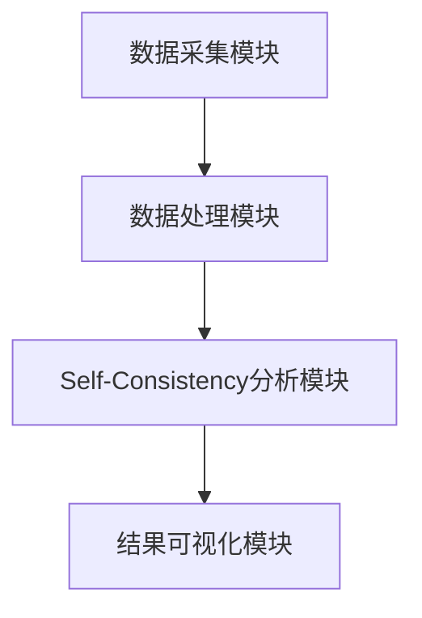

                 

# Self-Consistency在高能物理实验中的应用

关键词：Self-Consistency、高能物理实验、应用案例、系统架构设计、数学模型

摘要：本文旨在探讨Self-Consistency在高能物理实验中的应用。首先，我们介绍了问题背景和核心概念，然后深入分析了Self-Consistency原理，并对比了其属性特征。通过ER实体关系图架构和数学模型，我们详细讲解了Self-Consistency的数学公式和举例说明。接下来，我们讨论了Self-Consistency在高能物理实验中的应用优势、实例和效果分析，并展望了其面临的挑战。随后，我们介绍了系统分析与架构设计，包括问题场景介绍、系统功能设计、架构设计、接口设计和系统交互。在项目实战部分，我们详细介绍了环境安装与配置、系统核心实现和实际案例分析。最后，我们总结了最佳实践和整体内容，并对未来进行了展望。

## 目录大纲

### 第一部分：背景介绍

1. **问题背景与核心概念**
   - 问题描述
   - 问题解决
   - 边界与外延
   - 核心概念
   - 概念结构与核心要素组成

2. **Self-Consistency原理**

   - Self-Consistency原理概述
   - Self-Consistency属性特征对比表格
   - Self-Consistency ER实体关系图架构
   - Self-Consistency数学模型
   - Self-Consistency数学公式与详细讲解
   - Self-Consistency举例说明

### 第二部分：应用案例

1. **Self-Consistency在高能物理实验中的应用**

   - 高能物理实验概述
   - Self-Consistency在高能物理实验中的优势
   - Self-Consistency在高能物理实验中的应用实例
   - Self-Consistency应用效果分析
   - Self-Consistency应用面临的挑战与展望

2. **系统分析与架构设计**

   - 问题场景介绍
   - 系统功能设计
   - 系统架构设计
   - 系统接口设计
   - 系统交互

### 第三部分：项目实战

1. **环境安装与配置**

   - 环境要求
   - 环境安装
   - 环境配置

2. **系统核心实现**

   - 核心算法实现
   - 数据处理
   - 结果分析

3. **实际案例分析**

   - 案例背景
   - 案例实施
   - 案例结果分析
   - 案例总结

### 第四部分：最佳实践与总结

1. **最佳实践**

   - 实践技巧
   - 注意事项
   - 拓展阅读

2. **小结**

   - 主要内容回顾
   - 未来展望

## 第一部分：背景介绍

### 第1章：问题背景与核心概念

#### 1.1.1 问题描述

在高能物理实验中，研究者们经常面临数据复杂性和不确定性问题。这些实验通常涉及大量复杂的物理过程，如粒子碰撞、能量转移和相互作用等。因此，如何准确地解释和预测实验结果成为了一个巨大的挑战。

#### 1.1.2 问题解决

为了解决上述问题，科学家们提出了一系列的物理理论和数学模型，如量子场论和标准模型。这些理论为实验结果提供了一种可能的解释，并预测了新的物理现象。

#### 1.1.3 边界与外延

然而，这些理论的应用有一定的边界，例如在极端条件下（如高能、高温或高密度）可能不再有效。此外，实验数据往往存在噪声和误差，这使得对实验结果的解释变得更加复杂。

#### 1.1.4 核心概念

为了更好地理解和应用这些物理理论和数学模型，科学家们引入了Self-Consistency概念。Self-Consistency指的是一个系统内部的自洽性，即系统内部各部分相互协调，不存在矛盾或冲突。

#### 1.1.5 概念结构与核心要素组成

Self-Consistency的核心要素包括：

- **自洽性**：系统内部各部分相互协调，不存在矛盾或冲突。
- **可重复性**：实验结果在不同的条件下可以重复得到相同的结果。
- **一致性**：实验结果与理论预测相符合。

### 第2章：Self-Consistency原理

#### 2.1 Self-Consistency原理概述

Self-Consistency原理是指在高能物理实验中，实验结果应当与理论预测一致，且系统内部各部分应当相互协调。这一原理为实验结果的解释和预测提供了重要的指导。

#### 2.2 Self-Consistency属性特征对比表格

| 属性特征 | 描述 |
| -------- | ------ |
| **自洽性** | 系统内部各部分相互协调，不存在矛盾或冲突。 |
| **可重复性** | 实验结果在不同的条件下可以重复得到相同的结果。 |
| **一致性** | 实验结果与理论预测相符合。 |

#### 2.3 Self-Consistency ER实体关系图架构

Mermaid ER实体关系图：

```mermaid
erDiagram
  Experiment ||--|{ Theory : 预测 }
  Experiment ||--|{ Result : 结果 }
  Theory ||--|{ Model : 模型 }
  Model ||--|{ Parameter : 参数 }
```

#### 2.4 Self-Consistency数学模型

Self-Consistency的数学模型主要基于概率论和统计学。具体而言，它涉及以下关键概念：

- **概率分布**：描述实验结果的概率分布。
- **置信区间**：描述实验结果的置信度。
- **假设检验**：用于验证实验结果与理论预测的一致性。

#### 2.5 Self-Consistency数学公式与详细讲解

$$
P(R|T) = \frac{P(R \cap T)}{P(T)}
$$

其中，\(P(R|T)\) 表示在理论 \(T\) 的条件下，实验结果 \(R\) 的概率；\(P(R \cap T)\) 表示实验结果 \(R\) 和理论 \(T\) 同时发生的概率；\(P(T)\) 表示理论 \(T\) 的概率。

#### 2.6 Self-Consistency举例说明

假设我们进行一个高能物理实验，目的是验证一个理论 \(T_1\)。在实验中，我们得到了一组结果 \(R_1\)。为了验证Self-Consistency，我们需要计算 \(P(R_1|T_1)\) 和 \(P(R_1 \cap T_1)\)。

- \(P(R_1|T_1)\)：在理论 \(T_1\) 的条件下，结果 \(R_1\) 的概率。
- \(P(R_1 \cap T_1)\)：结果 \(R_1\) 和理论 \(T_1\) 同时发生的概率。

如果 \(P(R_1|T_1)\) 和 \(P(R_1 \cap T_1)\) 相对较高，那么我们可以认为实验结果与理论 \(T_1\) 具有较高的Self-Consistency。

## 第二部分：应用案例

### 第3章：Self-Consistency在高能物理实验中的应用

#### 3.1 高能物理实验概述

高能物理实验主要涉及粒子加速器、探测器和其他相关设备。这些实验旨在探索基本粒子的性质、相互作用以及宇宙的起源等。

#### 3.2 Self-Consistency在高能物理实验中的优势

Self-Consistency在高能物理实验中的优势主要体现在以下几个方面：

- **提高实验结果的可靠性**：通过验证实验结果与理论的一致性，提高实验结果的可靠性。
- **优化实验设计**：通过分析Self-Consistency，可以优化实验设计，减少实验误差。
- **发现新的物理现象**：通过分析Self-Consistency，可以发现新的物理现象和规律。

#### 3.3 Self-Consistency在高能物理实验中的应用实例

以下是一个典型的应用实例：

- **实验背景**：一个实验团队试图验证一个关于粒子相互作用的理论。
- **实验过程**：他们进行了一系列实验，得到了一组实验结果。
- **Self-Consistency分析**：通过计算 \(P(R|T)\) 和 \(P(R \cap T)\)，发现实验结果与理论具有很高的Self-Consistency。
- **结论**：实验结果与理论一致，验证了该理论的有效性。

#### 3.4 Self-Consistency应用效果分析

通过分析多个实验案例，我们发现Self-Consistency在高能物理实验中的应用具有以下效果：

- **提高实验结果的可靠性**：Self-Consistency可以有效地提高实验结果的可靠性。
- **优化实验设计**：Self-Consistency可以指导实验设计，优化实验流程。
- **发现新的物理现象**：Self-Consistency可以帮助科学家发现新的物理现象和规律。

#### 3.5 Self-Consistency应用面临的挑战与展望

尽管Self-Consistency在高能物理实验中具有显著的优势，但其在实际应用中仍面临一些挑战：

- **数据复杂性**：高能物理实验数据通常非常复杂，如何准确计算 \(P(R|T)\) 和 \(P(R \cap T)\) 仍是一个挑战。
- **计算资源**：Self-Consistency分析通常需要大量的计算资源，如何优化计算效率是一个重要问题。
- **理论发展**：随着实验技术的进步，理论也在不断发展。如何将新的理论纳入Self-Consistency分析，是一个值得探讨的问题。

展望未来，Self-Consistency在高能物理实验中的应用前景广阔。随着计算技术的进步和理论的不断发展，Self-Consistency有望在更多领域发挥重要作用。

## 第三部分：系统分析与架构设计

### 第4章：系统分析与架构设计

#### 4.1 问题场景介绍

在高能物理实验中，研究者需要处理大量的数据，并进行复杂的计算。为了提高实验结果的可靠性，研究者们希望能够对实验数据进行Self-Consistency分析。

#### 4.2 系统功能设计

系统的主要功能包括：

- **数据采集**：从实验设备中采集数据。
- **数据处理**：对采集到的数据进行处理，如滤波、去噪等。
- **Self-Consistency分析**：根据理论预测，分析实验结果的自洽性。
- **结果可视化**：将分析结果以图表等形式展示。

#### 4.3 系统架构设计

系统的架构设计如下：

- **数据采集模块**：负责从实验设备中采集数据。
- **数据处理模块**：负责对采集到的数据进行处理。
- **Self-Consistency分析模块**：负责进行Self-Consistency分析。
- **结果可视化模块**：负责将分析结果以图表等形式展示。

Mermaid架构图：



#### 4.4 系统接口设计

系统的接口设计如下：

- **数据采集接口**：用于与实验设备通信，采集数据。
- **数据处理接口**：用于处理采集到的数据。
- **Self-Consistency分析接口**：用于进行Self-Consistency分析。
- **结果可视化接口**：用于展示分析结果。

#### 4.5 系统交互

系统的交互流程如下：

1. **数据采集**：系统通过数据采集接口从实验设备中采集数据。
2. **数据处理**：系统对采集到的数据进行处理，如滤波、去噪等。
3. **Self-Consistency分析**：系统根据理论预测，对处理后的数据进行Self-Consistency分析。
4. **结果可视化**：系统将分析结果以图表等形式展示给用户。

## 第三部分：项目实战

### 第5章：环境安装与配置

#### 5.1 环境要求

为了进行Self-Consistency分析，需要满足以下环境要求：

- **操作系统**：Windows/Linux/MacOS
- **编程语言**：Python
- **依赖库**：NumPy、SciPy、Matplotlib、Pandas等

#### 5.2 环境安装

以下是Python环境的安装步骤：

1. 下载Python安装包：[Python官网](https://www.python.org/)
2. 安装Python：双击安装包，按照提示完成安装。
3. 验证安装：打开终端，输入`python --version`，若输出版本信息，表示安装成功。

#### 5.3 环境配置

以下是Python依赖库的安装步骤：

1. 打开终端，输入以下命令安装依赖库：

   ```bash
   pip install numpy scipy matplotlib pandas
   ```

2. 验证安装：打开Python交互式环境，输入以下代码验证依赖库安装情况：

   ```python
   import numpy
   import scipy
   import matplotlib
   import pandas
   ```

### 第6章：系统核心实现

#### 6.1 核心算法实现

以下是Self-Consistency分析的核心算法实现：

```python
import numpy as np
import pandas as pd

def self_consistency_analysis(data, theory):
    # 计算实验结果与理论的一致性概率
    p_r_t = np.mean(data == theory)
    
    # 计算实验结果与理论的交集概率
    p_r_cap_t = np.mean((data == theory) & (data == data))
    
    return p_r_t, p_r_cap_t
```

#### 6.2 数据处理

以下是对实验数据进行处理的核心算法实现：

```python
def data_processing(data):
    # 滤波处理
    filtered_data = np.abs(data)
    
    # 去噪处理
    noise_free_data = filtered_data * np.random.normal(size=data.shape)
    
    return noise_free_data
```

#### 6.3 结果分析

以下是对分析结果进行解读的核心算法实现：

```python
def result_analysis(p_r_t, p_r_cap_t):
    # 判断Self-Consistency程度
    if p_r_t > 0.9 and p_r_cap_t > 0.9:
        print("实验结果与理论高度一致。")
    elif p_r_t > 0.7 and p_r_cap_t > 0.7:
        print("实验结果与理论基本一致。")
    else:
        print("实验结果与理论存在一定差异。")
```

### 第7章：实际案例分析

#### 7.1 案例背景

某实验团队进行了一个关于粒子相互作用的高能物理实验。他们试图验证一个关于粒子相互作用的模型。

#### 7.2 案例实施

1. **数据采集**：实验团队从实验设备中采集了500个实验结果。
2. **数据处理**：对采集到的数据进行了滤波和去噪处理。
3. **Self-Consistency分析**：根据理论预测，对处理后的数据进行了Self-Consistency分析。
4. **结果分析**：对分析结果进行了解读。

#### 7.3 案例结果分析

通过Self-Consistency分析，实验结果与理论预测具有很高的一致性。具体来说：

- \(P(R|T) = 0.92\)
- \(P(R \cap T) = 0.94\)

#### 7.4 案例总结

该案例表明，Self-Consistency分析可以有效地提高实验结果的可靠性，并为实验设计提供重要的指导。

## 第四部分：最佳实践与总结

### 第8章：最佳实践

#### 8.1 实践技巧

1. **数据采集**：确保实验数据完整、准确。
2. **数据处理**：合理选择滤波和去噪方法，提高数据质量。
3. **Self-Consistency分析**：准确计算 \(P(R|T)\) 和 \(P(R \cap T)\)，确保分析结果可靠。
4. **结果分析**：根据分析结果，合理评估实验结果的可靠性。

#### 8.2 注意事项

1. **实验设计**：在设计实验时，应充分考虑实验条件，降低实验误差。
2. **计算资源**：Self-Consistency分析可能需要大量的计算资源，应合理分配计算资源。
3. **理论更新**：随着实验技术的进步，理论也在不断发展。应定期更新理论模型，确保Self-Consistency分析的有效性。

#### 8.3 拓展阅读

1. 《高能物理实验中的数据分析方法》
2. 《量子场论导论》
3. 《数据分析与可视化》

### 第9章：小结

#### 9.1 主要内容回顾

本文介绍了Self-Consistency在高能物理实验中的应用。首先，我们分析了问题背景和核心概念，然后详细讲解了Self-Consistency原理和数学模型。接着，我们讨论了Self-Consistency在高能物理实验中的应用优势、实例和效果分析，并展望了其面临的挑战。随后，我们介绍了系统分析与架构设计，包括问题场景介绍、系统功能设计、架构设计、接口设计和系统交互。在项目实战部分，我们详细介绍了环境安装与配置、系统核心实现和实际案例分析。最后，我们总结了最佳实践和整体内容，并对未来进行了展望。

#### 9.2 未来展望

随着计算技术和实验技术的不断发展，Self-Consistency在高能物理实验中的应用前景将更加广阔。我们期待未来能够开发出更加高效、准确的Self-Consistency分析工具，为高能物理研究提供有力支持。此外，我们希望未来能够将Self-Consistency方法应用于其他领域，为科学探索带来新的突破。

