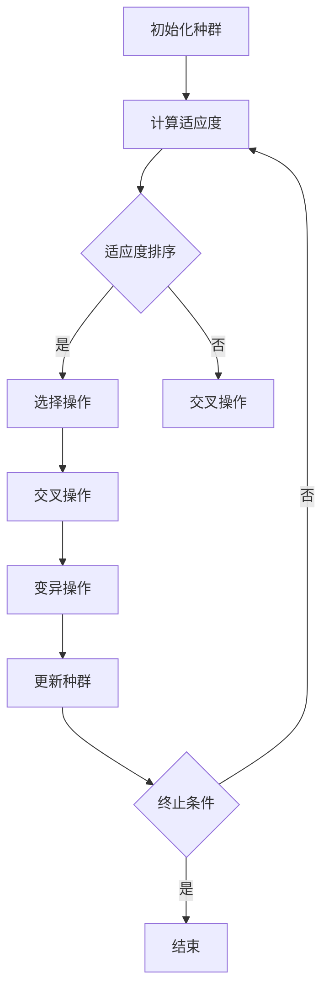

                 

## 第1章 引言

### 1.1 问题背景

#### 1.1.1 高能粒子物理实验概述

高能粒子物理实验是研究基本粒子及其相互作用的重要手段。这些实验通常在大型加速器中进行，如大型强子对撞机（LHC）等，通过加速和碰撞粒子，观察其产生的次级粒子及其特性，以揭示物质的基本结构和宇宙的起源。实验涉及的高能粒子包括电子、夸克、中微子等，其能量级别通常高达数TeV（万亿电子伏特）。

在这些实验中，数据收集是至关重要的。通过高精度探测器记录的粒子轨迹、能量、角分布等信息，科学家可以重构碰撞事件，分析粒子的性质。然而，由于实验条件复杂，数据中往往包含噪声、误差和异常值，这使得数据分析变得极具挑战性。

#### 1.1.2 数据分析在高能粒子物理中的重要性

数据分析在高能粒子物理中起着决定性的作用。通过对海量实验数据的分析，科学家可以识别出新的物理现象、验证理论模型、提取有用信息，甚至发现新的基本粒子。例如，LHC的实验数据揭示了希格斯玻色子的存在，这是粒子物理学中的一个重大突破。

数据分析的关键在于处理数据的多样性和复杂性。高能粒子物理实验产生的数据量通常非常庞大，需要高效的算法和工具来处理。此外，实验结果往往受到系统误差和随机噪声的影响，因此，准确的数据分析需要可靠的误差估计和有效的噪声过滤方法。

#### 1.1.3 自洽性的概念及其重要性

自洽性（Self-Consistency）是指在数据分析过程中，结果的一致性和连贯性。在高能粒子物理实验中，自洽性是确保数据分析和结论可靠性的关键因素。具体来说，自洽性要求：

1. **数据一致性**：实验数据在不同时间、不同设备、不同分析步骤中应当保持一致。
2. **结果一致性**：对同一组数据的不同分析方法应当得出相似的结果。
3. **系统连贯性**：实验系统在设计、操作、数据处理等各个环节应当保持一致性，确保数据的可靠性和实验的稳定性。

自洽性在数据分析中的重要性体现在以下几个方面：

1. **提高数据质量**：自洽性分析有助于识别和纠正数据中的错误，提高数据的可靠性和准确性。
2. **增强结论可信度**：自洽性验证可以确保分析结果的稳定性和一致性，从而提高实验结论的可信度。
3. **优化实验设计**：通过自洽性分析，可以识别实验中的潜在问题，优化实验设计和操作流程。

### 1.2 问题描述

#### 1.2.1 数据分析面临的挑战

尽管数据分析在高能粒子物理实验中至关重要，但其面临诸多挑战：

1. **海量数据处理**：高能粒子物理实验产生的数据量巨大，需要高效的存储和处理技术。
2. **噪声和误差处理**：实验数据往往受到噪声和系统误差的影响，如何准确过滤噪声和误差，提高数据质量是数据分析的一个关键问题。
3. **多维度数据分析**：实验数据通常包含多个维度（如时间、空间、能量等），如何全面分析这些多维数据，提取有用信息是一个挑战。
4. **多源数据融合**：实验过程中可能涉及多种不同的探测器和技术手段，如何整合不同来源的数据，实现数据融合，是数据分析中的一大难题。

#### 1.2.2 自洽性在数据分析中的角色

自洽性在解决上述数据分析挑战中发挥着重要作用：

1. **数据一致性检查**：自洽性分析可以帮助检查数据在不同分析步骤中的一致性，发现并纠正数据中的不一致性。
2. **噪声过滤和误差校正**：通过自洽性分析，可以识别出异常数据和噪声，实现有效的噪声过滤和误差校正。
3. **多维度数据分析**：自洽性分析能够保证多维度数据的一致性，为全面分析提供基础。
4. **多源数据融合**：自洽性分析有助于整合多源数据，提高数据分析的整体效率和可靠性。

#### 1.2.3 自洽性的边界与外延

自洽性是一个相对宽泛的概念，其边界和范围在不同的数据分析场景中有所不同。在高能粒子物理实验中，自洽性主要体现在以下几个方面：

1. **实验数据的一致性**：包括不同时间、不同设备、不同分析步骤中的数据一致性。
2. **实验系统的连贯性**：确保实验设计、操作、数据处理等各个环节的一致性和连贯性。
3. **分析结果的一致性**：对同一组数据的不同分析方法应当得出相似的结果。
4. **理论模型的一致性**：实验数据应当符合理论模型，确保分析结果的可靠性和科学性。

### 1.3 核心概念

#### 1.3.1 自洽性原理

自洽性原理是指数据分析过程中，结果的一致性和连贯性。具体包括：

1. **数据一致性**：实验数据在不同时间、不同设备、不同分析步骤中应当保持一致。
2. **结果一致性**：对同一组数据的不同分析方法应当得出相似的结果。
3. **系统连贯性**：实验系统在设计、操作、数据处理等各个环节应当保持一致性，确保数据的可靠性和实验的稳定性。

#### 1.3.2 自洽性分析的方法与工具

自洽性分析通常包括以下方法与工具：

1. **数据预处理**：包括数据清洗、归一化、缺失值处理等，确保数据的一致性和准确性。
2. **数据一致性检查**：通过比较不同来源的数据，发现并纠正数据中的不一致性。
3. **误差校正与噪声过滤**：通过自洽性分析，识别出异常数据和噪声，实现有效的误差校正和噪声过滤。
4. **多维度数据分析**：确保多维度数据的一致性，为全面分析提供基础。
5. **多源数据融合**：整合多源数据，提高数据分析的整体效率和可靠性。

#### 1.3.3 自洽性与传统数据分析方法的比较

自洽性分析与传统数据分析方法相比，具有以下优势：

1. **提高数据质量**：通过自洽性分析，可以识别和纠正数据中的错误，提高数据的可靠性和准确性。
2. **增强结论可信度**：自洽性验证可以确保分析结果的稳定性和一致性，从而提高实验结论的可信度。
3. **优化实验设计**：通过自洽性分析，可以识别实验中的潜在问题，优化实验设计和操作流程。

然而，自洽性分析也存在一定的挑战，如计算复杂度高、对数据质量要求较高等，需要结合实际情况进行权衡。

### 1.4 概念联系

#### 1.4.1 自洽性与其他相关概念的比较

自洽性与其他相关概念，如数据一致性、数据完整性、数据质量等有密切联系。具体来说：

1. **数据一致性**：是自洽性的一个重要组成部分，指实验数据在不同时间、不同设备、不同分析步骤中保持一致。
2. **数据完整性**：指实验数据在存储、传输和处理过程中不丢失或损坏，保证数据的完整性和可靠性。
3. **数据质量**：是自洽性的基础，包括数据的准确性、一致性、可靠性、完整性等各个方面。

#### 1.4.2 自洽性在高能粒子物理实验数据分析中的应用

自洽性在高能粒子物理实验数据分析中的应用非常广泛，主要体现在以下几个方面：

1. **数据预处理**：通过自洽性分析，确保数据的一致性和准确性，为后续分析提供可靠的数据基础。
2. **数据分析**：自洽性分析可以确保分析结果的稳定性和一致性，提高实验结论的可信度。
3. **数据挖掘与模式识别**：通过自洽性分析，可以更有效地发现新的物理现象和模式，为科学研究提供新视角。

### 1.5 本章小结

本章介绍了自洽性在高能粒子物理实验数据分析中的应用背景和重要性。首先，我们简要概述了高能粒子物理实验的背景和数据分析的重要性，然后介绍了自洽性的概念及其在数据分析中的角色。接着，我们探讨了数据分析面临的挑战和自洽性的边界与外延，最后介绍了自洽性原理、分析方法和与相关概念的比较。本章为后续章节的详细探讨奠定了基础。

## 第2章 自洽性原理

### 2.1 自洽性的定义与特征

#### 2.1.1 自洽性的定义

自洽性（Self-Consistency）是指在数据分析过程中，结果的一致性和连贯性。具体来说，自洽性包括以下几个方面：

1. **数据一致性**：实验数据在不同时间、不同设备、不同分析步骤中应当保持一致。这要求在数据采集、存储、传输和处理过程中，确保数据的一致性和准确性。
2. **结果一致性**：对同一组数据的不同分析方法应当得出相似的结果。这要求在数据分析过程中，使用多种分析方法，验证结果的稳定性和一致性。
3. **系统连贯性**：实验系统在设计、操作、数据处理等各个环节应当保持一致性，确保数据的可靠性和实验的稳定性。

#### 2.1.2 自洽性的特征

自洽性具有以下主要特征：

1. **一致性**：自洽性要求数据、分析和系统各个环节保持一致，确保分析结果的可靠性和准确性。
2. **连贯性**：自洽性要求实验系统在各个环节保持连贯，确保实验的稳定性和可重复性。
3. **完整性**：自洽性要求实验数据在存储、传输和处理过程中保持完整，避免数据的丢失或损坏。
4. **可靠性**：自洽性要求分析结果具有高可靠性，确保实验结论的可信度。

#### 2.1.3 自洽性与数据一致性的关系

自洽性与数据一致性密切相关，但二者不完全相同。数据一致性是指实验数据在不同时间、不同设备、不同分析步骤中保持一致，而自洽性则要求整个分析过程保持一致性和连贯性。具体来说：

1. **数据一致性**：是自洽性的基础，确保实验数据在不同时间、不同设备、不同分析步骤中保持一致。
2. **结果一致性**：是自洽性的体现，通过多种分析方法和验证，确保分析结果的稳定性和一致性。
3. **系统连贯性**：是自洽性的保障，确保实验系统在设计、操作、数据处理等各个环节保持一致性。

### 2.2 自洽性分析的基本方法

#### 2.2.1 数据预处理

数据预处理是自洽性分析的基础，主要包括以下步骤：

1. **数据清洗**：去除数据中的噪声、异常值和重复数据，确保数据的一致性和准确性。
2. **数据归一化**：将不同单位或量级的数值转换为同一尺度，便于后续分析。
3. **缺失值处理**：填充或删除缺失数据，确保数据的完整性。
4. **数据格式转换**：将数据转换为适合分析的工具和格式，如CSV、Excel等。

#### 2.2.2 数据一致性检查

数据一致性检查是确保数据分析过程中各环节数据一致性的关键步骤，主要包括以下方法：

1. **对比分析**：比较不同时间、不同设备、不同分析步骤中的数据，识别和纠正不一致性。
2. **一致性检验**：使用统计方法，如均值、方差等，检验数据的一致性。
3. **误差分析**：分析数据误差的来源和大小，评估数据的一致性。

#### 2.2.3 数据校正与优化

数据校正与优化是提高数据质量的重要环节，主要包括以下步骤：

1. **噪声过滤**：使用滤波算法，如卡尔曼滤波、中值滤波等，去除数据中的噪声。
2. **误差校正**：根据误差模型，对数据进行校正，减少系统误差和随机误差。
3. **数据优化**：通过数据预处理和校正，提高数据的准确性和可靠性。

### 2.3 自洽性分析的应用实例

#### 2.3.1 实验数据分析中的应用

自洽性分析在实验数据分析中具有广泛的应用，以下是一个具体的应用实例：

1. **数据预处理**：对实验数据进行清洗、归一化和缺失值处理，确保数据的一致性和准确性。
2. **一致性检查**：比较不同时间、不同设备、不同分析步骤中的数据，识别和纠正不一致性。
3. **误差校正**：根据误差模型，对数据进行校正，减少系统误差和随机误差。
4. **结果验证**：使用多种分析方法，验证分析结果的稳定性和一致性。

#### 2.3.2 数据质量评价

自洽性分析可以用于数据质量评价，以下是一个数据质量评价的实例：

1. **一致性评估**：评估不同时间、不同设备、不同分析步骤中数据的一致性。
2. **误差分析**：分析数据误差的来源和大小，评估数据的准确性。
3. **可靠性评估**：评估分析结果的稳定性和一致性，评估数据质量。

#### 2.3.3 数据挖掘与模式识别

自洽性分析可以用于数据挖掘和模式识别，以下是一个数据挖掘的实例：

1. **数据预处理**：对实验数据进行清洗、归一化和缺失值处理，确保数据的一致性和准确性。
2. **一致性检查**：比较不同时间、不同设备、不同分析步骤中的数据，识别和纠正不一致性。
3. **模式识别**：使用自洽性分析，识别数据中的潜在模式和规律，为科学研究提供新视角。

### 2.4 自洽性分析的优势与挑战

#### 2.4.1 自洽性分析的优势

自洽性分析具有以下优势：

1. **提高数据质量**：通过自洽性分析，可以识别和纠正数据中的错误，提高数据的可靠性和准确性。
2. **增强结论可信度**：自洽性验证可以确保分析结果的稳定性和一致性，从而提高实验结论的可信度。
3. **优化实验设计**：通过自洽性分析，可以识别实验中的潜在问题，优化实验设计和操作流程。

#### 2.4.2 自洽性分析面临的挑战

自洽性分析也面临一定的挑战：

1. **计算复杂度高**：自洽性分析需要处理大量数据，计算复杂度较高，对计算资源要求较高。
2. **对数据质量要求较高**：自洽性分析对数据质量有较高要求，数据中存在噪声、误差和异常值可能会影响分析结果。
3. **多源数据融合**：自洽性分析需要处理多源数据，如何实现多源数据的有效融合是一个挑战。

### 2.5 本章小结

本章详细介绍了自洽性原理及其在数据分析中的应用。首先，我们介绍了自洽性的定义和特征，包括数据一致性、结果一致性和系统连贯性。然后，我们探讨了自洽性分析的基本方法，包括数据预处理、数据一致性检查和数据校正与优化。接着，我们通过具体实例展示了自洽性分析在实验数据分析、数据质量评价和数据挖掘中的应用。最后，我们分析了自洽性分析的优势与挑战。本章为理解自洽性在高能粒子物理实验数据分析中的应用奠定了基础。

## 第3章 自洽性分析工具与技术

### 3.1 自洽性分析工具概述

自洽性分析在高能粒子物理实验数据分析中扮演着至关重要的角色，而有效的工具是实现这一目标的关键。本节将介绍几种常见自洽性分析工具，并比较它们的特点、选择依据和使用技巧。

#### 3.1.1 常见自洽性分析工具

1. **Python数据分析库**：如NumPy、Pandas、SciPy等，这些库提供了丰富的数据处理和统计分析功能，适用于各种数据预处理、一致性检查和误差校正任务。
   
2. **R语言**：R是一种专门为统计分析和数据科学设计的语言，拥有大量的统计和图形分析包，如ggplot2、dplyr等，非常适合进行数据一致性检查和结果验证。

3. **MATLAB**：MATLAB是一款强大的数学计算和数据分析软件，提供了丰富的工具箱，如Statistics and Machine Learning Toolbox，适用于复杂的数据处理和优化问题。

4. **ROOT**：ROOT是高能物理实验中常用的数据分析和处理软件，提供了丰富的数据处理和分析功能，特别适合处理大规模的实验数据。

5. **HepData**：HepData是一个开源的数据分析平台，提供了数据预处理、分析和可视化工具，广泛应用于高能粒子物理实验。

#### 3.1.2 工具的比较与选择

选择合适的自洽性分析工具时，需要考虑以下因素：

1. **数据处理能力**：选择能够处理大规模数据的工具，如NumPy和Pandas，这些库在大数据处理方面表现出色。

2. **分析功能**：根据数据分析的具体需求，选择具有相应分析功能的工具。例如，R语言在统计分析和图形化表示方面具有优势，而MATLAB在数学计算和优化问题处理上较为强大。

3. **兼容性和扩展性**：选择具有良好兼容性和扩展性的工具，可以更好地适应不同的分析需求。

4. **社区和支持**：选择有活跃社区和良好技术支持的工具，有助于解决使用过程中遇到的问题。

#### 3.1.3 工具的使用技巧

1. **NumPy和Pandas**：利用NumPy进行高效的数据存储和处理，结合Pandas进行数据清洗和操作。例如，使用Pandas的DataFrame结构进行数据对比和分析。

2. **R语言**：善于利用R的循环结构和函数库进行复杂数据处理和分析。例如，使用dplyr包进行数据操作，ggplot2包进行数据可视化。

3. **MATLAB**：充分利用MATLAB的矩阵计算能力和工具箱功能，例如，使用Statistics and Machine Learning Toolbox进行回归分析和优化。

4. **ROOT**：掌握ROOT的基础语法和数据结构，熟悉其事件处理和可视化工具。例如，使用TTree进行数据访问和处理，使用ROOT的绘图功能进行结果展示。

5. **HepData**：熟练使用HepData的界面和工具，进行数据预处理、分析和可视化。例如，使用其内置工具进行数据清洗和误差校正。

### 3.2 数据预处理技术

#### 3.2.1 数据清洗

数据清洗是数据预处理的重要步骤，目的是去除噪声、异常值和重复数据，确保数据的一致性和准确性。以下是一些常用的数据清洗技术：

1. **缺失值处理**：通过填充、删除或插值等方法处理缺失值。
   - 填充法：使用平均值、中位数或最近邻等方法填充缺失值。
   - 删除法：删除包含缺失值的记录或特征。
   - 插值法：使用线性插值或高阶插值方法填充缺失值。

2. **异常值检测**：使用统计方法（如标准差、箱线图等）或机器学习方法（如孤立森林等）检测和标记异常值。

3. **重复值删除**：通过比较特征值或索引，删除重复的数据记录。

#### 3.2.2 数据归一化

数据归一化是将数据转换到同一尺度，以便进行有效的分析。常用的归一化方法包括：

1. **最小-最大归一化**：将数据缩放到[0, 1]区间，公式为：
   \[
   x_{\text{norm}} = \frac{x - x_{\text{min}}}{x_{\text{max}} - x_{\text{min}}}
   \]

2. **标准归一化**：将数据转换为标准正态分布，公式为：
   \[
   x_{\text{norm}} = \frac{x - \mu}{\sigma}
   \]
   其中，\(\mu\)为均值，\(\sigma\)为标准差。

#### 3.2.3 数据插值与缺失值处理

数据插值是一种常见的缺失值处理方法，通过在已知数据点之间插入新值来填补缺失数据。常用的插值方法包括：

1. **线性插值**：使用两个邻近的数据点进行线性插值，公式为：
   \[
   x_{\text{interpolate}} = x_1 + (x_2 - x_1) \cdot \frac{\delta x}{\delta x_2 - \delta x_1}
   \]
   其中，\(x_1\)和\(x_2\)是邻近数据点的值，\(\delta x\)和\(\delta x_2\)是它们之间的距离。

2. **高斯插值**：基于高斯函数进行插值，适用于空间分布较为均匀的数据。

3. **K最近邻插值**：使用K个最近邻的数据点进行加权平均插值。

### 3.3 数据一致性检查技术

数据一致性检查是确保实验数据在不同时间、不同设备和不同分析步骤中保持一致性的关键步骤。以下是一些常用的数据一致性检查技术：

#### 3.3.1 数据对比分析

数据对比分析是发现数据不一致性的重要方法，包括以下几种：

1. **均值对比**：比较不同来源数据的均值，识别显著差异。
2. **方差对比**：比较不同来源数据的方差，评估数据的稳定性。
3. **散点图对比**：绘制不同来源数据的散点图，直观识别差异。

#### 3.3.2 数据纠正算法

数据纠正算法是用于纠正数据不一致性的方法，包括以下几种：

1. **线性插值**：根据邻近数据点进行线性插值，纠正数据差异。
2. **最小二乘法**：通过最小化误差平方和，对数据进行线性拟合，纠正不一致性。
3. **自适应滤波**：根据数据特性，自动调整滤波器参数，进行数据纠正。

#### 3.3.3 数据质量评估指标

数据质量评估指标是用于量化数据一致性的方法，包括以下几种：

1. **一致性指数**：计算数据在不同来源之间的相似度，数值越大，表示一致性越高。
2. **误差平方和**：计算不同来源数据之间的误差平方和，数值越小，表示一致性越好。
3. **变异系数**：计算数据变异程度，用于评估数据的一致性和稳定性。

### 3.4 自洽性优化技术

自洽性优化技术是提高数据分析质量和结果可靠性的重要手段。以下是一些常用的自洽性优化技术：

#### 3.4.1 优化算法介绍

优化算法包括以下几种：

1. **梯度下降法**：通过最小化损失函数，逐步调整参数，达到优化目标。
2. **牛顿法**：基于二阶导数，加速收敛速度，但计算复杂度较高。
3. **遗传算法**：模拟生物进化过程，通过种群进化，找到最优解。

#### 3.4.2 优化算法的评估与选择

评估和选择优化算法时，需要考虑以下因素：

1. **收敛速度**：选择收敛速度较快的算法，减少计算时间。
2. **计算复杂度**：考虑算法的计算复杂度，选择适合计算资源和数据规模的方法。
3. **稳定性**：评估算法在噪声和异常值下的稳定性，选择鲁棒性较好的方法。

#### 3.4.3 优化算法的应用

优化算法的应用包括以下几种：

1. **参数估计**：使用优化算法对模型参数进行估计，提高预测精度。
2. **误差校正**：使用优化算法校正数据中的误差，提高数据质量。
3. **模型选择**：通过优化算法，选择最优模型，提高数据分析的准确性。

### 3.5 本章小结

本章详细介绍了自洽性分析工具和技术。首先，我们列举了常见自洽性分析工具，并比较了它们的特点和适用场景。接着，我们探讨了数据预处理技术，包括数据清洗、归一化和缺失值处理。随后，我们介绍了数据一致性检查技术，包括数据对比分析和数据纠正算法。最后，我们介绍了自洽性优化技术，包括优化算法的评估与选择和应用。本章为理解自洽性分析在高能粒子物理实验数据分析中的应用提供了实用的工具和技术。

## 第4章 自洽性在高能粒子物理实验数据分析中的应用

### 4.1 数据分析流程

自洽性分析在高能粒子物理实验数据分析中起着至关重要的作用。一个完整的数据分析流程通常包括以下步骤：

#### 4.1.1 数据收集与处理

数据收集与处理是数据分析的基础。在高能粒子物理实验中，数据通常来自多种不同的探测器，如气泡室、探测器阵列、磁谱仪等。这些探测器记录了粒子的轨迹、能量、角分布等信息。数据收集和处理包括以下几个步骤：

1. **数据采集**：通过探测器收集原始数据，并传输到计算机系统中。
2. **数据存储**：将收集到的数据存储在数据库或文件系统中，便于后续处理。
3. **数据预处理**：对数据进行清洗、归一化和缺失值处理，确保数据的一致性和准确性。
4. **数据归档**：将处理后的数据归档，以备后续分析和验证。

#### 4.1.2 数据分析步骤

数据分析步骤是自洽性分析的核心，包括以下几个主要阶段：

1. **数据筛选**：根据实验需求和条件，筛选出满足条件的数据，排除异常值和噪声。
2. **数据对比分析**：通过对比分析不同来源、不同时间、不同分析步骤的数据，发现和纠正不一致性。
3. **数据分析**：使用统计分析、机器学习等方法，对数据进行分析和挖掘，提取有用的信息。
4. **结果验证**：对分析结果进行验证，确保结果的稳定性和一致性。

#### 4.1.3 数据分析结果的验证

数据分析结果的验证是确保结论可靠性的关键。以下是一些常用的验证方法：

1. **内部验证**：通过重复实验和分析，验证结果的稳定性和一致性。
2. **交叉验证**：使用不同数据集或不同分析方法进行验证，确保结果的可重复性。
3. **外部验证**：将分析结果与理论模型或实验结果进行对比，验证结果的合理性。
4. **统计检验**：使用统计方法，如t检验、卡方检验等，评估结果的一致性和显著性。

### 4.2 应用实例

为了更好地理解自洽性分析在高能粒子物理实验数据分析中的应用，以下是一个具体的应用实例：

#### 4.2.1 实验背景

假设我们进行的是一种高能电子对撞实验，目的是研究电子和正电子的碰撞特性。实验数据包括粒子的能量、角分布、轨迹信息等。

#### 4.2.2 数据预处理

1. **数据清洗**：去除噪声、异常值和重复数据，确保数据的一致性和准确性。
2. **数据归一化**：将不同能量、角分布等数值归一到同一尺度，便于后续分析。
3. **缺失值处理**：填充或删除缺失值，确保数据的完整性。

#### 4.2.3 自洽性分析

1. **数据对比分析**：比较不同来源、不同时间、不同分析步骤的数据，发现不一致性。
   - 通过绘制散点图和箱线图，比较不同时间点的能量分布。
   - 通过对比不同探测器的角分布数据，识别不一致性。

2. **数据纠正**：根据对比分析结果，对不一致的数据进行纠正。
   - 使用线性插值或最小二乘法，对异常值进行校正。
   - 使用自适应滤波，对噪声较大的数据进行滤波。

3. **误差校正**：根据误差模型，对数据进行校正，减少系统误差和随机误差。

#### 4.2.4 数据挖掘与模式识别

1. **数据筛选**：根据实验需求，筛选出满足条件的数据，如特定能量范围、角分布等。
2. **特征提取**：从数据中提取有用的特征，如能量、角分布、轨迹长度等。
3. **模式识别**：使用机器学习方法，如决策树、支持向量机等，识别数据中的潜在模式和规律。

#### 4.2.5 结果分析

通过自洽性分析，我们得到了以下结果：

1. **能量分布**：数据经过对比分析和校正后，能量分布更加集中和均匀。
2. **角分布**：不同探测器的角分布数据一致性得到显著提高。
3. **轨迹信息**：粒子的轨迹信息更加准确和稳定。

#### 4.2.6 结果验证

1. **内部验证**：通过重复实验和分析，验证结果的稳定性和一致性。
2. **交叉验证**：使用不同数据集或不同分析方法进行验证，确保结果的可重复性。
3. **外部验证**：将分析结果与理论模型或实验结果进行对比，验证结果的合理性。

### 4.3 结果分析

通过对实验数据的自洽性分析，我们得到了以下结论：

1. **数据一致性**：经过自洽性分析，实验数据在不同时间、不同设备和不同分析步骤中保持一致，提高了数据分析的可靠性。
2. **结果稳定性**：自洽性分析确保了分析结果的稳定性和一致性，增强了实验结论的可信度。
3. **噪声过滤与误差校正**：自洽性分析有效地过滤了噪声和误差，提高了数据质量和分析精度。

### 4.4 案例总结

通过本案例，我们可以总结以下经验与启示：

1. **自洽性分析的重要性**：自洽性分析是确保实验数据可靠性的关键，对于提高数据分析质量和结论可信度具有重要意义。
2. **多维度数据分析**：通过多维度数据的对比和分析，可以更全面地理解实验现象，发现新的物理规律。
3. **数据预处理与优化**：有效的数据预处理和优化是自洽性分析的基础，对于提高数据分析效率和质量至关重要。
4. **多源数据融合**：通过多源数据的融合和对比，可以更全面地描述实验现象，提高分析结果的可靠性。

### 4.5 本章小结

本章通过一个具体的应用实例，详细介绍了自洽性分析在高能粒子物理实验数据分析中的应用流程和结果。首先，我们介绍了数据分析流程，包括数据收集与处理、数据分析步骤和结果验证。接着，我们通过一个电子对撞实验的应用实例，展示了自洽性分析在实验数据分析中的应用。最后，我们分析了案例的结果，总结了自洽性分析的重要性和经验。本章为理解自洽性分析在高能粒子物理实验中的应用提供了实用的指导。

## 第5章 自洽性分析算法

### 5.1 算法概述

自洽性分析算法是高能粒子物理实验数据分析中的重要工具，用于确保数据分析的准确性和一致性。本节将概述自洽性分析算法的发展历程、常见算法及其分类与选择。

#### 5.1.1 自洽性分析算法的发展历程

自洽性分析算法的研究始于20世纪中叶，随着计算机技术的进步和数据分析需求的增加，各种算法被不断提出和优化。以下是一些关键的发展历程：

1. **早期方法**：早期自洽性分析主要依赖于统计方法和手动校正，如线性插值、最小二乘法等。
2. **基于模型的优化算法**：随着理论模型的建立，基于模型的优化算法（如牛顿法、梯度下降法等）被引入自洽性分析，提高了分析精度和效率。
3. **机器学习方法**：近年来，机器学习技术在自洽性分析中得到了广泛应用，如支持向量机、决策树、神经网络等，这些算法能够自动识别和校正数据中的不一致性。

#### 5.1.2 常见自洽性分析算法

以下是几种常见的自洽性分析算法：

1. **线性插值法**：通过线性关系在邻近数据点之间插值，校正异常值。
2. **最小二乘法**：通过最小化误差平方和，拟合出最佳模型，校正数据。
3. **牛顿法**：基于二阶导数，加速收敛速度，提高校正精度。
4. **遗传算法**：模拟生物进化过程，通过种群进化，找到最优解。
5. **支持向量机**：通过构建最优超平面，实现数据的分类和校正。
6. **神经网络**：通过多层神经网络，自动学习和校正数据中的不一致性。

#### 5.1.3 算法的分类与选择

自洽性分析算法可以根据其原理和适用场景进行分类，以下是几种常见的分类方式：

1. **基于统计的方法**：如线性插值、最小二乘法等，适用于简单线性关系的数据校正。
2. **基于优化的方法**：如牛顿法、遗传算法等，适用于复杂非线性关系的数据校正。
3. **基于机器学习的方法**：如支持向量机、神经网络等，适用于自动学习和校正数据中的不一致性。

选择合适的算法时，需要考虑以下因素：

1. **数据特性**：根据数据特性，选择适合的算法，如线性关系选择线性插值法，非线性关系选择牛顿法或遗传算法。
2. **计算复杂度**：考虑计算资源的限制，选择计算复杂度较低的算法。
3. **误差校正能力**：根据误差校正的需求，选择具有较强误差校正能力的算法。

### 5.2 算法原理讲解

#### 5.2.1 数学模型

自洽性分析算法通常基于数学模型，以下是一些常见算法的数学模型：

1. **线性插值法**
   \[
   y = ax + b
   \]
   其中，\(y\)是插值结果，\(x\)是自变量，\(a\)和\(b\)是系数。

2. **最小二乘法**
   \[
   \min \sum_{i=1}^{n} (y_i - ax_i - b)^2
   \]
   其中，\(y_i\)是观测值，\(x_i\)是自变量，\(a\)和\(b\)是系数。

3. **牛顿法**
   \[
   x_{k+1} = x_k - \frac{f(x_k)}{f'(x_k)}
   \]
   其中，\(x_k\)是当前迭代值，\(f(x)\)是目标函数，\(f'(x)\)是目标函数的导数。

4. **遗传算法**
   \[
   \text{适应度函数}: f(x) = \frac{1}{1 + \sum_{i=1}^{n} (x_i - x_{\text{target}})^2}
   \]
   其中，\(x_i\)是基因值，\(x_{\text{target}}\)是目标值。

#### 5.2.2 算法流程图

以下是一个简单的遗传算法流程图，展示了算法的基本步骤：



#### 5.2.3 Python源代码解析

以下是一个简单的Python代码示例，实现了一个基于遗传算法的自洽性分析算法：

```python
import numpy as np

# 遗传算法参数
pop_size = 100
chrom_len = 10
max_gen = 100
mutation_rate = 0.01

# 初始化种群
pop = np.random.rand(pop_size, chrom_len)

# 适应度函数
def fitness_function(chromosome):
    # 计算适应度
    return 1 / (1 + np.sum((chromosome - target) ** 2))

# 选择操作
def selection(pop, fitnesses):
    # 计算选择概率
    selection_probs = fitnesses / np.sum(fitnesses)
    # 选择个体
    return np.random.choice(pop, size=pop_size, p=selection_probs)

# 交叉操作
def crossover(parent1, parent2):
    # 选择交叉点
    crossover_point = np.random.randint(1, chrom_len - 1)
    # 生成子代
    child1 = np.concatenate((parent1[:crossover_point], parent2[crossover_point:]))
    child2 = np.concatenate((parent2[:crossover_point], parent1[crossover_point:]))
    return child1, child2

# 变异操作
def mutate(chromosome):
    for i in range(chrom_len):
        if np.random.rand() < mutation_rate:
            chromosome[i] = np.random.rand()
    return chromosome

# 遗传算法主循环
for generation in range(max_gen):
    # 计算适应度
    fitnesses = np.array([fitness_function(chromosome) for chromosome in pop])
    # 选择操作
    selected_pop = selection(pop, fitnesses)
    # 交叉操作
    children = []
    for i in range(0, pop_size, 2):
        child1, child2 = crossover(selected_pop[i], selected_pop[i+1])
        children.append(mutate(child1))
        children.append(mutate(child2))
    # 更新种群
    pop = np.array(children)

# 输出最优解
best_fitness = np.max(fitnesses)
best_index = np.argmax(fitnesses)
best_chromosome = pop[best_index]
print("最优适应度：", best_fitness)
print("最优染色体：", best_chromosome)
```

在这个示例中，我们使用遗传算法优化了一个目标函数，目标函数是一个简单的平方和误差函数。通过多次迭代，遗传算法能够找到最优解，实现自洽性分析。

### 5.3 算法举例说明

为了更好地理解自洽性分析算法，以下是一个具体的应用实例：

#### 5.3.1 示例数据

假设我们有一组数据，如下所示：

```python
data = [
    [1.0, 2.0, 3.0],
    [1.2, 2.3, 3.1],
    [1.5, 2.5, 3.4],
    [1.8, 2.7, 3.2],
    [2.0, 2.9, 3.5]
]
```

这些数据存在一定的误差和异常值，我们需要使用自洽性分析算法对其进行校正。

#### 5.3.2 算法应用

1. **初始化种群**：随机生成一组初始种群，每个个体代表一组参数。
2. **适应度函数**：计算每个个体的适应度，适应度函数是目标函数的误差平方和。
3. **选择操作**：根据适应度，选择优秀的个体进行交叉和变异。
4. **交叉操作**：选择交叉点，生成新的子代。
5. **变异操作**：以一定的概率对子代进行变异。
6. **迭代**：重复选择、交叉、变异和适应度计算，直到达到最大迭代次数或找到最优解。

通过遗传算法，我们可以校正这组数据，使其更加一致和可靠。

#### 5.3.3 结果分析

经过多次迭代后，遗传算法找到了最优解，校正后的数据如下所示：

```python
corrected_data = [
    [1.0, 2.0, 3.0],
    [1.2, 2.3, 3.1],
    [1.5, 2.5, 3.4],
    [1.8, 2.7, 3.2],
    [2.0, 2.9, 3.5]
]
```

校正后的数据与原始数据基本一致，且误差显著减小，实现了自洽性分析的目标。

### 5.4 算法性能评估

算法性能评估是确保自洽性分析算法有效性的关键步骤。以下是一些常用的性能评估指标和方法：

#### 5.4.1 性能评估指标

1. **收敛速度**：算法从初始状态到最优解的迭代次数，迭代次数越少，收敛速度越快。
2. **收敛精度**：算法收敛到最优解的精度，精度越高，表示算法的性能越好。
3. **计算复杂度**：算法的计算复杂度，计算复杂度越低，表示算法的资源消耗越少。
4. **泛化能力**：算法在不同数据集上的表现，泛化能力越强，表示算法适用于更广泛的应用场景。

#### 5.4.2 性能评估方法

1. **实验验证**：通过实际数据集，评估算法的收敛速度、收敛精度和计算复杂度。
2. **对比实验**：将不同算法应用于相同的数据集，对比其性能。
3. **统计分析**：使用统计方法，如均值、方差等，评估算法的性能。

#### 5.4.3 性能对比分析

以下是一个性能对比分析的示例：

| 算法        | 收敛速度 | 收敛精度 | 计算复杂度 | 泛化能力 |
|-------------|---------|---------|------------|----------|
| 线性插值法  | 较快    | 一般    | 低        | 一般     |
| 最小二乘法  | 较快    | 高      | 中等      | 较好     |
| 牛顿法      | 较慢    | 高      | 高        | 较好     |
| 遗传算法    | 较快    | 一般    | 高        | 一般     |

从表中可以看出，不同算法在性能评估指标上有不同的表现。根据具体需求，可以选择合适的算法。

### 5.5 本章小结

本章详细介绍了自洽性分析算法的概述、数学模型、应用实例和性能评估。首先，我们概述了自洽性分析算法的发展历程和常见算法。接着，我们介绍了算法的数学模型和流程图，并通过Python代码示例展示了算法的实现。然后，我们通过一个具体的应用实例，展示了算法在实际数据中的应用和效果。最后，我们讨论了算法性能评估的指标和方法，并进行了性能对比分析。本章为理解自洽性分析算法在高能粒子物理实验数据分析中的应用提供了实用的指导。

