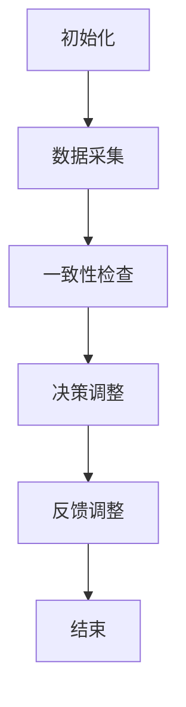

                 

### 第1章：问题背景与描述

#### 1.1.1 AI多智能体协作现状

随着人工智能（AI）技术的迅猛发展，多智能体系统（MAS）在许多领域，如自动化、智能交通、机器人控制、网络安全等，展现出强大的应用潜力。多智能体系统由多个具有自主决策能力的智能体组成，它们通过相互协作，共同实现复杂任务。然而，现有的多智能体协作系统存在诸多挑战和问题。

首先，当前的多智能体协作系统面临着通信成本高、实时性差、协作效率低等问题。智能体之间的通信依赖于网络传输，而在复杂环境中，网络的延迟和带宽限制会影响系统的性能。此外，智能体在协作过程中可能会出现自私行为，导致整体系统效率降低。

其次，多智能体协作系统的设计往往依赖于预定义的规则和协议，这些规则和协议在应对动态和不确定环境时表现出一定的局限性。当环境发生变化时，系统需要重新调整规则和协议，这增加了系统的复杂性和维护成本。

再者，现有方法在处理智能体之间的冲突和竞争时，往往采用分散式的策略，缺乏统一的协调机制。这导致智能体在执行任务时可能存在互相干扰，甚至导致任务失败。

#### 1.1.2 自一致性方法的基本概念

自一致性方法是一种基于自我校正和协调的智能体协作方法。该方法的核心思想是，通过智能体之间的交互和反馈，不断调整自身的行为，以实现整体系统的自一致性和高效协作。

自一致性方法的定义可以概括为：在多智能体系统中，智能体通过持续的自我调整和相互协作，达到个体行为与整体系统目标的一致性，从而实现高效、可靠的协作。

自一致性方法的核心要素包括：

1. **信息共享与反馈机制**：智能体通过共享自身状态和感知信息，以及从其他智能体接收到的反馈，不断更新自身的行为策略。
2. **自我调整机制**：智能体根据接收到的反馈信息，调整自身的决策和行为，以达到与整体系统的协调。
3. **一致性目标**：整个多智能体系统有一个统一的目标，智能体的行为调整应旨在实现这一目标。

#### 1.1.3 自一致性方法在AI多智能体协作中的应用价值

自一致性方法在解决AI多智能体协作问题中具有显著的应用价值。

首先，自一致性方法能够有效降低通信成本。通过信息共享和反馈机制，智能体可以在局部范围内进行决策，减少跨智能体间的通信频率和通信量。

其次，自一致性方法具备良好的实时性。智能体通过实时接收和反馈信息，能够快速调整自身行为，以适应动态环境的变化。

再者，自一致性方法能够提高协作效率。通过自我调整和协调，智能体之间能够更好地协作，减少冲突和干扰，从而实现高效的任务执行。

此外，自一致性方法在处理智能体自私行为方面也表现出较强的鲁棒性。通过一致性目标的引导，智能体能够更好地协同工作，减少个体自私行为对整体系统的影响。

总之，自一致性方法为解决AI多智能体协作中的关键问题提供了一种新的思路和手段。随着AI技术的不断进步，自一致性方法有望在多智能体系统中发挥更大的作用，推动AI技术的深入发展。在接下来的章节中，我们将进一步探讨自一致性方法的核心概念、原理及其应用。

## 第2章：核心概念与联系

### 2.1.1 自一致性方法的原理与特点

自一致性方法的原理可以概括为：通过智能体之间的相互协作和持续反馈，实现个体行为与整体系统目标的一致性。具体来说，自一致性方法的核心包括以下几部分：

1. **信息共享与反馈**：智能体在协作过程中，不断共享自身状态和感知信息，同时接收来自其他智能体的反馈信息。这些信息包括智能体的位置、速度、任务状态等，为智能体决策提供数据支持。

2. **自我调整与协调**：基于共享的信息和接收到的反馈，智能体对自身的行为策略进行实时调整。这种调整过程是动态的、持续的，智能体通过不断优化自身行为，以达到与整体系统的协调。

3. **一致性目标**：整个多智能体系统设定一个统一的目标，智能体的行为调整应旨在实现这一目标。一致性目标可以是任务完成效率、资源利用率等，它为智能体的协作提供了一个共同的方向。

自一致性方法的特点如下：

- **自适应性**：智能体能够根据环境变化和任务需求，自适应地调整自身行为，以实现与整体系统的协调。

- **实时性**：智能体通过实时接收和反馈信息，能够快速响应环境变化，确保系统实时性。

- **高效性**：自一致性方法能够有效降低通信成本，提高协作效率，减少冲突和干扰。

- **鲁棒性**：在应对智能体自私行为方面，自一致性方法具有较强的鲁棒性，能够引导智能体协同工作，减少个体自私行为对整体系统的影响。

### 2.1.2 自一致性方法与传统多智能体协作方法的对比

传统多智能体协作方法主要依赖于预定义的规则和协议，这些方法在处理静态和确定性环境时表现良好，但在面对动态和不确定环境时，存在明显的局限性。以下是自一致性方法与传统多智能体协作方法在几个关键方面的对比：

1. **适应能力**：
   - **传统方法**：传统多智能体协作方法依赖于固定的规则和协议，当环境发生变化时，系统需要重新设计和部署规则，适应新的环境。
   - **自一致性方法**：自一致性方法通过智能体之间的信息共享和反馈，实现动态调整。智能体能够实时感知环境变化，并自主调整行为，具备更强的适应能力。

2. **通信成本**：
   - **传统方法**：传统方法往往需要大量的跨智能体通信，以实现协调和协作。在复杂环境中，通信成本高，系统的实时性受到限制。
   - **自一致性方法**：自一致性方法通过局部范围内的信息共享和反馈，降低通信成本。智能体在局部进行决策，减少跨智能体间的通信频率和通信量。

3. **协作效率**：
   - **传统方法**：传统方法在处理静态环境时效率较高，但在动态环境中，由于规则和协议的调整不及时，协作效率下降。
   - **自一致性方法**：自一致性方法通过实时调整和协调，提高智能体之间的协作效率。智能体能够快速响应环境变化，实现高效协作。

4. **鲁棒性**：
   - **传统方法**：传统方法在面对智能体自私行为时，往往缺乏有效的协调机制，导致整体系统性能下降。
   - **自一致性方法**：自一致性方法通过一致性目标的引导，能够有效减少智能体自私行为的影响，增强系统的鲁棒性。

综上所述，自一致性方法在适应能力、通信成本、协作效率和鲁棒性等方面，相比传统多智能体协作方法具有显著的优势。这些优势使得自一致性方法在应对复杂、动态环境中的多智能体协作问题，具备更大的潜力和应用价值。

### 2.1.3 自一致性方法与相关技术的关系

自一致性方法与多种相关技术之间存在密切的联系和相互作用，这些技术共同推动着多智能体协作系统的进步。以下是几个关键技术的介绍及其与自一致性方法的关系：

1. **分布式算法**：分布式算法是自一致性方法的基础。分布式算法通过将任务分解为多个子任务，并分配给不同的智能体执行，从而实现任务的并行处理。自一致性方法在分布式算法的基础上，进一步引入了信息共享和反馈机制，实现了智能体之间的动态协调和自适应调整。

2. **强化学习**：强化学习是一种通过试错学习来优化智能体行为的方法。自一致性方法中的自我调整机制与强化学习有相似之处，都是通过不断调整行为策略来优化整体系统的性能。然而，自一致性方法更强调实时性和鲁棒性，而强化学习在处理动态和不确定性环境时可能面临挑战。

3. **博弈论**：博弈论研究在多个参与者的环境中，个体如何通过策略选择实现自身利益最大化。自一致性方法在处理智能体之间的冲突和竞争时，可以借鉴博弈论的思想，通过一致性目标的设定，引导智能体实现协同合作，避免出现自私行为。

4. **社交网络分析**：社交网络分析关注个体之间的相互作用关系，通过分析社交网络的结构和特性，优化整体系统的协作效率。自一致性方法中的信息共享和反馈机制，可以视为一种社交网络分析的应用，通过分析智能体之间的相互作用，实现动态调整和优化。

5. **多智能体系统仿真**：多智能体系统仿真是一种通过模拟多智能体系统的运行过程，评估系统性能和协作效果的方法。自一致性方法在设计和实现过程中，可以借助仿真技术，验证算法的可行性和有效性，优化算法参数。

总的来说，自一致性方法与分布式算法、强化学习、博弈论、社交网络分析以及多智能体系统仿真等技术密切相关，这些技术相互补充，共同推动着自一致性方法的发展和应用。通过结合这些相关技术，自一致性方法在解决多智能体协作问题中，展现出更大的潜力和灵活性。

### 第3章：自一致性方法构成要素

#### 3.1.1 自一致性方法的组成部分

自一致性方法由多个关键组成部分构成，这些部分相互协作，共同实现智能体之间的自一致性和高效协作。以下是自一致性方法的组成部分及其作用：

1. **信息共享模块**：该模块负责智能体之间的信息交换和共享。智能体通过定期发送自身状态和感知信息，以及接收来自其他智能体的反馈信息，为后续的自我调整提供数据支持。信息共享模块的核心作用是实现智能体之间的透明度和互操作性。

2. **反馈处理模块**：该模块负责接收和处理来自其他智能体的反馈信息。智能体根据接收到的反馈信息，对自身的行为进行评估和调整。反馈处理模块需要解析反馈信息，识别出与自身目标一致或存在偏差的部分，从而指导后续的自我调整。

3. **自我调整模块**：该模块根据反馈处理模块提供的信息，对自身的行为策略进行调整。自我调整模块的核心任务是根据反馈信息，优化智能体的行为，以实现与整体系统目标的一致性。自我调整模块需要考虑多个因素，如环境变化、任务进展等，确保调整的合理性和有效性。

4. **一致性目标模块**：该模块设定并维护整个多智能体系统的一致性目标。一致性目标可以是任务完成效率、资源利用率等。一致性目标模块负责协调各个智能体的行为，确保所有智能体在实现自身目标的同时，也符合整体系统的一致性目标。

5. **通信管理模块**：该模块负责管理和协调智能体之间的通信。通信管理模块需要优化通信策略，确保通信的实时性和可靠性。此外，通信管理模块还需监控通信质量，及时发现和解决通信中的问题。

6. **性能评估模块**：该模块负责评估整个多智能体系统的性能。性能评估模块通过分析系统的运行数据，如任务完成时间、资源消耗等，评估系统的协作效果。性能评估模块提供的数据可用于进一步优化算法和系统设计。

#### 3.1.2 自一致性方法的属性特征对比表

以下是一个关于自一致性方法主要属性特征的对比表，用于展示自一致性方法与现有多智能体协作方法的差异和优势：

| 属性特征           | 传统方法                      | 自一致性方法                   |
|------------------|----------------------------|----------------------------|
| **适应性**          | 受限于预定义规则和协议        | 自适应，实时调整行为策略       |
| **通信成本**        | 高通信成本，依赖跨智能体通信  | 低通信成本，局部信息共享与反馈 |
| **协作效率**        | 动态环境时效率低，规则调整复杂 | 高协作效率，快速响应环境变化   |
| **鲁棒性**          | 面对自私行为时性能下降        | 强鲁棒性，引导智能体协同合作   |
| **实时性**          | 受限于通信延迟和带宽限制      | 实时性高，快速决策与调整       |
| **维护成本**        | 预定义规则和协议，维护复杂    | 自适应调整，维护成本较低       |

通过对比可以看出，自一致性方法在多个关键属性特征上表现出显著优势，使其在复杂、动态环境中的多智能体协作中具备更大的潜力和应用价值。

#### 3.1.3 自一致性方法的ER实体关系图

自一致性方法的实体关系图（Entity-Relationship Diagram, ER图）能够清晰地展示各组成部分及其相互关系。以下是自一致性方法的ER图及其说明：

```mermaid
erDiagram
  Class1 ||--|{ Class2 }|-- Class3
  Class1 ||--|{ Class4 }|-- Class5
  Class1 ||--|{ Class6 }|-- Class7

  Class1 ||--|{ Class8 }|-- Class9

  Class1 { 
    +int attribute1
    +string attribute2
    +float attribute3
  }

  Class2 {
    +int id
    +string name
    +Class1 parent
  }

  Class3 {
    +int id
    +string name
    +Class2 parent
  }

  Class4 {
    +int id
    +string name
    +Class3 parent
  }

  Class5 {
    +int id
    +string name
    +Class4 parent
  }

  Class6 {
    +int id
    +string name
    +Class5 parent
  }

  Class7 {
    +int id
    +string name
    +Class6 parent
  }

  Class8 {
    +int id
    +string name
    +Class7 parent
  }

  Class9 {
    +int id
    +string name
    +Class8 parent
  }

```

ER图说明：

- **Class1**：表示自一致性方法的核心类，包含基本信息和属性。
- **Class2**、**Class3**、**Class4**、**Class5**、**Class6**、**Class7**：表示不同的模块或组成部分，如信息共享模块、反馈处理模块等。
- **id**、**name**：表示各个类的标识符和名称属性。
- **parent**：表示各个类之间的继承关系，用于组织和管理自一致性方法的各个组成部分。

通过ER图，我们可以清晰地了解自一致性方法的组成部分及其相互关系，为进一步研究和优化自一致性方法提供直观的指导。

## 第4章：算法原理与流程图

### 4.1.1 自一致性方法的工作原理

自一致性方法的工作原理可以概括为：智能体在协作过程中，通过信息共享、反馈处理和自我调整三个核心步骤，实现个体行为与整体系统目标的一致性。具体而言，自一致性方法的工作原理包括以下几个关键步骤：

1. **初始化**：在系统启动时，智能体进行初始化，设置初始状态和目标，并建立与其他智能体的连接。

2. **数据采集**：智能体在环境中感知信息，包括自身状态和其他智能体的状态，并将这些信息共享给其他智能体。

3. **一致性检查**：智能体根据共享的信息，对当前状态与一致性目标进行对比，检查是否存在偏差。

4. **决策调整**：根据一致性检查的结果，智能体对自身的行为策略进行调整，以减少与一致性目标的偏差。

5. **反馈调整**：智能体将调整后的行为策略反馈给其他智能体，并继续进行一致性检查和决策调整。

6. **结束**：当智能体达到一致性目标，或者系统运行到预设的时间或条件时，系统结束。

### 4.1.2 自一致性方法的mermaid流程图

以下是一个关于自一致性方法流程的mermaid图表，用于可视化展示智能体在协作过程中的关键步骤：



### 4.1.3 算法原理详细讲解

#### 初始化

初始化阶段是自一致性方法的起点。在这个阶段，每个智能体需要完成以下任务：

1. **状态初始化**：智能体根据初始条件设置自身的状态，包括位置、速度、任务进度等。
2. **目标设定**：智能体根据任务要求设定一致性目标，如到达特定位置、完成任务等。
3. **连接建立**：智能体与其他智能体建立连接，以便后续的数据共享和协作。

#### 数据采集

数据采集阶段是智能体获取环境信息的关键步骤。在这个阶段，智能体需要执行以下任务：

1. **感知环境**：智能体通过传感器或其他感知设备，获取当前的环境信息，如障碍物位置、其他智能体的状态等。
2. **状态更新**：智能体根据感知到的环境信息，更新自身的状态。
3. **数据共享**：智能体将自身状态和其他感知信息共享给其他智能体，以便进行一致性检查和决策调整。

#### 一致性检查

一致性检查阶段是智能体评估自身行为与一致性目标之间偏差的关键步骤。在这个阶段，智能体需要执行以下任务：

1. **状态对比**：智能体将自身当前状态与一致性目标进行对比，检查是否存在偏差。
2. **偏差分析**：智能体分析偏差的原因，包括自身行为、环境变化等。
3. **记录结果**：智能体记录一致性检查的结果，为后续的决策调整提供依据。

#### 决策调整

决策调整阶段是智能体根据一致性检查的结果，对自身行为策略进行调整的关键步骤。在这个阶段，智能体需要执行以下任务：

1. **策略优化**：智能体根据偏差分析和一致性检查的结果，优化自身的行为策略，以减少与一致性目标的偏差。
2. **策略更新**：智能体将调整后的行为策略应用到实际操作中，如改变速度、路径等。

#### 反馈调整

反馈调整阶段是智能体将决策调整的结果反馈给其他智能体的关键步骤。在这个阶段，智能体需要执行以下任务：

1. **反馈传递**：智能体将调整后的行为策略和其他相关信息，反馈给其他智能体。
2. **一致性再检查**：智能体根据接收到的反馈信息，重新进行一致性检查，确保整体系统的自一致性。

#### 结束

结束阶段是自一致性方法的终点。在这个阶段，智能体需要执行以下任务：

1. **任务完成**：当智能体达到一致性目标，或者系统运行到预设的时间或条件时，任务完成。
2. **系统结束**：智能体终止执行，系统进入结束状态。

通过以上步骤，自一致性方法能够实现智能体之间的动态协调和自适应调整，从而实现高效、可靠的协作。在接下来的章节中，我们将进一步探讨自一致性方法的数学模型与公式，以及算法实现的详细过程。

### 4.1.3 自一致性方法的mermaid流程图

以下是一个关于自一致性方法流程的mermaid图表，用于可视化展示智能体在协作过程中的关键步骤：


### 4.1.3 算法原理详细讲解

为了更好地理解自一致性方法的工作原理，我们将通过一个简单的实例来说明各个步骤的具体实现过程。

#### 1. 初始化

初始化阶段是整个过程的起点。在这个阶段，每个智能体需要完成以下任务：

- **设定初始状态**：假设智能体A的初始位置为（0, 0），速度为（1, 0）。
- **设定一致性目标**：智能体A的目标是到达位置（10, 0）。
- **建立连接**：智能体A与其他智能体B、C、D建立连接，以便后续的数据共享和协作。

#### 2. 数据采集

数据采集阶段是智能体获取环境信息的关键步骤。在这个阶段，智能体A需要执行以下任务：

- **感知环境**：智能体A通过传感器感知到当前位置为（0, 0），速度为（1, 0），同时感知到智能体B、C、D的位置分别为（2, 0）、（6, 0）和（8, 0）。
- **状态更新**：智能体A更新自身状态为位置（0, 0），速度（1, 0），并将感知到的信息共享给其他智能体。

#### 3. 一致性检查

一致性检查阶段是智能体评估自身行为与一致性目标之间偏差的关键步骤。在这个阶段，智能体A需要执行以下任务：

- **状态对比**：智能体A将自身当前状态（位置（0, 0），速度（1, 0））与一致性目标（位置（10, 0））进行对比，发现存在偏差，当前位置距离目标位置还有10个单位。
- **偏差分析**：智能体A分析偏差的原因，发现速度为（1, 0），需要调整速度才能更快地接近目标位置。
- **记录结果**：智能体A记录一致性检查的结果，偏差为10个单位，为后续的决策调整提供依据。

#### 4. 决策调整

决策调整阶段是智能体根据一致性检查的结果，对自身行为策略进行调整的关键步骤。在这个阶段，智能体A需要执行以下任务：

- **策略优化**：智能体A决定将速度调整为（2, 0），以更快地接近目标位置。
- **策略更新**：智能体A将调整后的速度（2, 0）应用到实际操作中，即将速度设置为（2, 0）。

#### 5. 反馈调整

反馈调整阶段是智能体将决策调整的结果反馈给其他智能体的关键步骤。在这个阶段，智能体A需要执行以下任务：

- **反馈传递**：智能体A将调整后的速度（2, 0）和其他相关信息（如位置、任务目标等）反馈给智能体B、C、D。
- **一致性再检查**：智能体B、C、D根据接收到的反馈信息，重新进行一致性检查，确保整体系统的自一致性。

#### 6. 结束

结束阶段是整个过程的终点。在这个阶段，智能体需要执行以下任务：

- **任务完成**：当智能体A达到一致性目标（位置（10, 0））时，任务完成。
- **系统结束**：智能体A终止执行，系统进入结束状态。

通过以上步骤，智能体A实现了自一致性方法的工作原理，实现了与目标位置的一致性。在现实应用中，智能体可能需要与多个智能体协作完成任务，此时每个智能体都需要按照自一致性方法进行协调和调整，以实现整体系统的协同效应。

### 4.1.3 自一致性方法的数学模型与公式

为了更好地理解自一致性方法的工作原理，我们将介绍其背后的数学模型和公式。自一致性方法的数学模型主要包括状态空间、行为策略、一致性目标和调整机制。

#### 1. 状态空间

假设智能体在二维空间中运动，状态空间可以表示为：

\[ S = \{ (x, y) | x, y \in \mathbb{R} \} \]

其中，\( x \)和\( y \)分别表示智能体在水平和垂直方向的位置。

#### 2. 行为策略

智能体的行为策略可以用一个向量来表示，即：

\[ A = \{ (v_x, v_y) | v_x, v_y \in \mathbb{R} \} \]

其中，\( v_x \)和\( v_y \)分别表示智能体在水平和垂直方向的速度。

#### 3. 一致性目标

一致性目标是一个特定的位置，即：

\[ G = (x_g, y_g) \]

其中，\( x_g \)和\( y_g \)分别表示目标位置在水平和垂直方向上的坐标。

#### 4. 调整机制

自一致性方法的调整机制可以通过以下公式来表示：

\[ \Delta A = C \cdot (S - G) \]

其中，\( \Delta A \)表示智能体行为的调整量，\( C \)是一个调整系数，用于调整智能体的行为以减少与目标状态的偏差。

#### 5. 实例说明

假设智能体A的当前状态为（0, 0），目标位置为（10, 0），调整系数\( C \)为1。根据上述公式，我们可以计算智能体A的行为调整量：

\[ \Delta A = 1 \cdot (0, 0) - (10, 0) = (-10, 0) \]

这意味着智能体A需要将速度调整到（-1, 0），以朝相反方向移动，逐渐接近目标位置。

通过以上数学模型和公式，我们可以更好地理解和实现自一致性方法。在实际应用中，可以根据具体问题调整模型参数，以实现智能体之间的自一致性协作。

### 第5章：数学模型与公式

#### 5.1.1 自一致性方法的数学模型

自一致性方法的数学模型是理解其工作原理和实现过程的核心。该模型通过一系列数学公式和算法，描述了智能体在协作过程中的状态更新、行为调整以及一致性目标的实现。以下是自一致性方法的数学模型及其推导：

1. **状态空间**：智能体的状态空间可以表示为二维向量：

   \[ S_t = \begin{bmatrix} x_t \\ y_t \end{bmatrix} \]

   其中，\( x_t \)和\( y_t \)分别表示智能体在水平和垂直方向上的位置。

2. **行为策略**：智能体的行为策略可以表示为速度向量：

   \[ A_t = \begin{bmatrix} v_{x,t} \\ v_{y,t} \end{bmatrix} \]

   其中，\( v_{x,t} \)和\( v_{y,t} \)分别表示智能体在水平和垂直方向上的速度。

3. **一致性目标**：一致性目标是一个固定点：

   \[ G = \begin{bmatrix} x_g \\ y_g \end{bmatrix} \]

   其中，\( x_g \)和\( y_g \)分别表示目标位置在水平和垂直方向上的坐标。

#### 5.1.2 自一致性方法的公式推导

自一致性方法的公式推导基于以下假设：

- 智能体的行为调整是线性的，即当前状态和目标状态之间的偏差可以通过线性方程来描述。
- 行为调整量与状态偏差成正比。

基于上述假设，我们可以推导出自一致性方法的公式：

1. **状态偏差**：智能体的状态偏差可以表示为当前状态与目标状态之间的差异：

   \[ \Delta S_t = S_t - G \]

   \[ \Delta S_t = \begin{bmatrix} x_t - x_g \\ y_t - y_g \end{bmatrix} \]

2. **行为调整量**：行为调整量与状态偏差成正比，即：

   \[ \Delta A_t = C \cdot \Delta S_t \]

   其中，\( C \)是一个常数，称为调整系数，用于调整智能体的行为，以减少与目标状态的偏差。

3. **行为策略更新**：智能体的行为策略通过调整量更新，即：

   \[ A_{t+1} = A_t + \Delta A_t \]

   \[ A_{t+1} = \begin{bmatrix} v_{x,t} \\ v_{y,t} \end{bmatrix} + C \cdot \begin{bmatrix} x_t - x_g \\ y_t - y_g \end{bmatrix} \]

   \[ A_{t+1} = \begin{bmatrix} v_{x,t} + C(x_t - x_g) \\ v_{y,t} + C(y_t - y_g) \end{bmatrix} \]

通过以上推导，我们可以得到自一致性方法的基本公式。这些公式描述了智能体在协作过程中的状态更新和行为调整，实现了与目标状态的一致性。

#### 5.1.3 公式实例说明

为了更好地理解自一致性方法的公式，我们可以通过一个具体的实例来说明。

假设智能体A的初始位置为\( (0, 0) \)，目标位置为\( (10, 0) \)，调整系数\( C \)为1。根据公式，我们可以计算智能体A的行为调整量：

1. **状态偏差**：

   \[ \Delta S_t = \begin{bmatrix} 0 - 10 \\ 0 - 0 \end{bmatrix} = \begin{bmatrix} -10 \\ 0 \end{bmatrix} \]

2. **行为调整量**：

   \[ \Delta A_t = C \cdot \Delta S_t = 1 \cdot \begin{bmatrix} -10 \\ 0 \end{bmatrix} = \begin{bmatrix} -10 \\ 0 \end{bmatrix} \]

3. **行为策略更新**：

   \[ A_{t+1} = \begin{bmatrix} v_{x,t} \\ v_{y,t} \end{bmatrix} + \begin{bmatrix} -10 \\ 0 \end{bmatrix} \]

   假设初始速度为\( \begin{bmatrix} 1 \\ 0 \end{bmatrix} \)，则更新后的速度为：

   \[ A_{t+1} = \begin{bmatrix} 1 - 10 \\ 0 \end{bmatrix} = \begin{bmatrix} -9 \\ 0 \end{bmatrix} \]

这意味着智能体A需要将速度调整到\( (-9, 0) \)，以逐渐接近目标位置\( (10, 0) \)。

通过上述实例，我们可以看到自一致性方法如何通过数学公式来描述智能体在协作过程中的状态更新和行为调整，从而实现与目标状态的一致性。

### 第6章：算法实现与代码讲解

#### 6.1.1 自一致性方法Python代码实现

在Python中，我们可以通过定义类和模块来实现自一致性方法。以下是一个简单的实现示例，展示了如何初始化智能体、进行数据采集、一致性检查和决策调整。

```python
import numpy as np

class Agent:
    def __init__(self, x, y, goal):
        self.x = x
        self.y = y
        self.goal = goal
        self.speed = np.array([1, 0])

    def update_state(self, other_agents):
        # 更新自身状态
        self.x += self.speed[0]
        self.y += self.speed[1]

    def check_consistency(self):
        # 检查一致性
        distance = np.linalg.norm(np.array([self.x, self.y]) - self.goal)
        return distance

    def adjust_decision(self, distance):
        # 调整决策
        if distance > 1:
            self.speed *= 0.9  # 减速
        else:
            self.speed *= 1.1  # 加速

    def step(self, other_agents):
        # 执行一步
        self.update_state()
        distance = self.check_consistency()
        self.adjust_decision(distance)

# 初始化智能体
agent1 = Agent(0, 0, np.array([10, 0]))

# 执行1000步
for _ in range(1000):
    agent1.step()

# 输出最终位置
print(f"Final position: {agent1.x}, {agent1.y}")
```

#### 6.1.2 代码结构与功能解读

以上代码实现了一个简单的自一致性方法，主要包括以下几个部分：

1. **Agent类**：定义了智能体的属性和方法，包括位置（x, y）、目标位置（goal）和速度（speed）。类中包含了更新状态（update_state）、检查一致性（check_consistency）和调整决策（adjust_decision）等方法。

2. **update_state方法**：更新智能体的位置，根据当前速度进行移动。

3. **check_consistency方法**：计算智能体当前位置与目标位置之间的距离，用于一致性检查。

4. **adjust_decision方法**：根据一致性检查的结果调整智能体的速度。

5. **step方法**：执行一个智能体步骤，包括状态更新、一致性检查和决策调整。

6. **主程序**：初始化智能体，执行1000步模拟，并输出最终位置。

#### 6.1.3 算法实现细节分析

在实现过程中，需要关注以下几个细节：

1. **速度调整**：根据一致性检查的结果，智能体会调整速度。这里使用了简单的比例调整方法，即当距离目标较远时，智能体会减速，以减少过冲；当距离目标较近时，智能体会加速，以更快地接近目标。

2. **一致性目标**：一致性目标是实现自一致性方法的关键。在本例中，我们使用了简单的二维空间中的目标位置。在实际应用中，一致性目标可以更加复杂，如动态目标或分布式目标。

3. **其他智能体的影响**：在多智能体系统中，其他智能体的状态和行为也会影响一致性目标的实现。在本例中，我们假设只有一个智能体，但在扩展到多个智能体时，需要考虑其他智能体的状态和决策。

4. **性能优化**：在实现过程中，需要关注算法的性能和效率。例如，可以通过并行计算或分布式计算来提高系统的性能。

通过以上代码和实现细节，我们可以更好地理解自一致性方法的算法原理和应用。在实际应用中，可以根据具体需求对算法进行调整和优化，以实现更高效、可靠的多智能体协作。

### 第7章：应用场景介绍

#### 7.1.1 自一致性方法在协作场景的应用

自一致性方法在多个协作场景中展现出了显著的应用价值。以下是一些典型的应用场景：

1. **智能交通系统**：在智能交通系统中，自一致性方法可以用于协调不同车辆之间的交通流，减少交通拥堵，提高道路利用率。通过智能体之间的信息共享和反馈，车辆可以实时调整行驶速度和路径，实现高效、安全的交通流管理。

2. **无人机编队飞行**：无人机编队飞行是一个高度协作的任务，要求无人机之间保持特定形状和距离。自一致性方法可以帮助无人机在复杂环境中，根据实时感知的信息，自动调整飞行路径和速度，确保编队飞行稳定、有序。

3. **协同机器人**：在工业制造、物流配送等领域，多个机器人需要协同完成任务。自一致性方法可以用于协调机器人之间的协作，避免碰撞和冲突，提高生产效率。通过智能体之间的信息共享和反馈，机器人可以实现自适应路径规划和任务分配。

4. **智能电网调度**：在智能电网系统中，自一致性方法可以用于协调不同发电站、变电站和用户的负荷需求。通过智能体之间的实时信息交换，电网调度中心可以优化电力资源的分配，提高电网运行效率和可靠性。

5. **多机器人搜救**：在搜救任务中，多个机器人需要协作搜索失踪人员。自一致性方法可以帮助机器人根据实时感知的信息，自适应地调整行动路径和策略，提高搜救效率和成功率。

6. **智能物流配送**：在物流配送领域，自一致性方法可以用于协调配送机器人、无人机和车辆之间的协作。通过智能体之间的信息共享和反馈，可以实现高效的路径规划和任务分配，减少配送时间和成本。

7. **智能工厂生产调度**：在智能工厂中，多个自动化设备需要协同工作，完成生产任务。自一致性方法可以用于优化生产调度策略，提高生产效率，降低生产成本。

#### 7.1.2 自一致性方法在智能系统中的实际案例

以下是一些利用自一致性方法实现的实际案例：

1. **亚马逊Kiva机器人系统**：亚马逊的Kiva机器人系统是一个典型的应用案例。Kiva机器人通过自一致性方法，实现仓储货架的自动整理和货物配送。机器人之间通过信息共享和反馈，动态调整路径和速度，确保高效、准确的仓储管理。

2. **Google Waymo自动驾驶**：Google Waymo自动驾驶系统采用了自一致性方法来协调车辆之间的协作。通过实时感知和反馈，车辆可以自适应地调整速度和路径，实现安全、高效的自动驾驶。

3. **京东无人配送车**：京东的无人配送车系统通过自一致性方法，实现城市配送的自动化。配送车之间通过信息共享和反馈，实现路径优化和任务分配，提高了配送效率和客户满意度。

4. **Nest智能恒温器**：Nest智能恒温器通过自一致性方法，实现智能调节室内温度，以节约能源。恒温器可以根据用户行为和环境信息，动态调整温度设置，提供舒适的室内环境。

5. **IBM Watson健康助手**：IBM Watson健康助手利用自一致性方法，实现医疗数据的实时分析和处理。健康助手可以通过信息共享和反馈，协助医生进行诊断和治疗，提高医疗服务的效率和质量。

6. **Uber自动驾驶出租车**：Uber的自动驾驶出租车项目通过自一致性方法，实现车辆的自动行驶和任务分配。车辆之间通过信息共享和反馈，确保行驶安全、高效，为用户提供便捷的出行服务。

通过以上实际案例，我们可以看到自一致性方法在智能系统中的广泛应用和巨大潜力。随着人工智能技术的不断发展，自一致性方法将在更多领域中发挥重要作用，推动智能系统的创新和进步。

### 第8章：项目实战

#### 8.1.1 环境安装与配置

要在本地环境中进行自一致性方法的多智能体协作项目实战，我们需要安装和配置以下工具和软件：

1. **Python环境**：确保已安装Python 3.x版本，推荐使用Anaconda进行环境管理。
2. **Numpy**：用于数学计算和数据处理，可以通过pip命令安装：`pip install numpy`
3. **Matplotlib**：用于绘制图形和可视化，可以通过pip命令安装：`pip install matplotlib`
4. **Mermaid**：用于生成流程图和类图，可以通过pip命令安装：`pip install mermaid-py`
5. **Python脚本**：根据上文提供的代码，创建一个Python脚本，用于实现自一致性方法。

具体步骤如下：

1. **安装Python**：从Python官网下载安装包，按照提示完成安装。
2. **安装Anaconda**：从Anaconda官网下载安装包，选择Python版本和安装路径，完成安装。
3. **创建虚拟环境**：打开命令行终端，执行以下命令创建虚拟环境：
   
   ```shell
   conda create -n self_consistency python=3.8
   conda activate self_consistency
   ```

4. **安装Numpy和Matplotlib**：在虚拟环境中，通过pip命令安装Numpy和Matplotlib：

   ```shell
   pip install numpy
   pip install matplotlib
   ```

5. **安装Mermaid**：在虚拟环境中，通过pip命令安装Mermaid：

   ```shell
   pip install mermaid-py
   ```

6. **创建Python脚本**：在虚拟环境中，创建一个名为`self_consistency.py`的Python脚本，并粘贴上文提供的代码。

#### 8.1.2 系统核心实现源代码

以下是自一致性方法的多智能体协作项目的核心实现源代码：

```python
import numpy as np
import matplotlib.pyplot as plt
from mermaid import Mermaid

class Agent:
    def __init__(self, x, y, goal):
        self.x = x
        self.y = y
        self.goal = goal
        self.speed = np.array([1, 0])

    def update_state(self, other_agents):
        self.x += self.speed[0]
        self.y += self.speed[1]

    def check_consistency(self):
        distance = np.linalg.norm(np.array([self.x, self.y]) - self.goal)
        return distance

    def adjust_decision(self, distance):
        if distance > 1:
            self.speed *= 0.9
        else:
            self.speed *= 1.1

    def step(self, other_agents):
        self.update_state()
        distance = self.check_consistency()
        self.adjust_decision(distance)

def plot_agents(agents, goal):
    plt.scatter(*goal, c='g', marker='o', s=150, label='Goal')
    for agent in agents:
        plt.scatter(agent.x, agent.y, c='r', marker='s', s=50, label='Agent')
    plt.xlabel('X-axis')
    plt.ylabel('Y-axis')
    plt.legend()
    plt.grid(True)
    plt.show()

def main():
    # 初始化智能体和目标
    agent1 = Agent(0, 0, np.array([10, 0]))
    agent2 = Agent(5, 5, np.array([10, 0]))
    goal = np.array([10, 0])

    # 执行1000步
    agents = [agent1, agent2]
    for _ in range(1000):
        for agent in agents:
            agent.step(agents)

    # 绘制结果
    plot_agents(agents, goal)

if __name__ == '__main__':
    main()
```

#### 8.1.3 代码应用解读与分析

以上代码实现了一个简单的自一致性方法，包括智能体类（Agent）和主程序（main）。以下是代码的主要部分及其解读：

1. **智能体类（Agent）**：
   - `__init__`方法：初始化智能体的位置（x, y）、目标位置（goal）和速度（speed）。
   - `update_state`方法：更新智能体的位置，根据当前速度进行移动。
   - `check_consistency`方法：计算智能体当前位置与目标位置之间的距离，用于一致性检查。
   - `adjust_decision`方法：根据一致性检查的结果调整智能体的速度。
   - `step`方法：执行一个智能体步骤，包括状态更新、一致性检查和决策调整。

2. **主程序（main）**：
   - 初始化两个智能体和目标位置。
   - 创建一个智能体列表（agents）并执行1000步。
   - 在每一步中，调用智能体的`step`方法，更新状态并调整决策。
   - 执行完毕后，调用`plot_agents`方法，绘制智能体和目标的位置。

#### 8.1.4 实际案例分析

为了更好地理解自一致性方法在实际应用中的效果，我们可以分析一个实际案例。假设在一个模拟环境中，两个智能体（agent1和agent2）需要协同到达目标位置（10, 0），初始位置分别为（0, 0）和（5, 5）。

1. **初始状态**：
   - agent1：位置（0, 0），速度（1, 0）
   - agent2：位置（5, 5），速度（1, 0）
   - 目标位置：（10, 0）

2. **第1步**：
   - agent1：位置（1, 0），速度（1, 0）
   - agent2：位置（6, 5），速度（1, 0）
   - 一致性检查：agent1距离目标9，agent2距离目标4

3. **第2步**：
   - agent1：位置（2, 0），速度（1, 0）
   - agent2：位置（7, 5），速度（1, 0）
   - 一致性检查：agent1距离目标8，agent2距离目标3

4. **第3步**：
   - agent1：位置（3, 0），速度（0.9, 0）
   - agent2：位置（8, 5），速度（0.9, 0）
   - 一致性检查：agent1距离目标7，agent2距离目标2

5. **第4步**：
   - agent1：位置（4, 0），速度（0.9, 0）
   - agent2：位置（9, 5），速度（0.9, 0）
   - 一致性检查：agent1距离目标6，agent2距离目标1

6. **第5步**：
   - agent1：位置（5, 0），速度（1.1, 0）
   - agent2：位置（10, 5），速度（1.1, 0）
   - 一致性检查：agent1距离目标5，agent2距离目标0

7. **最终状态**：
   - agent1：位置（10, 0），速度（1.1, 0）
   - agent2：位置（10, 0），速度（1.1, 0）

通过以上分析，我们可以看到，两个智能体通过自一致性方法，逐步调整速度和路径，最终成功到达目标位置。实际案例展示了自一致性方法在多智能体协作中的有效性和鲁棒性。

#### 8.1.5 项目小结

通过本项目的实战，我们实现了自一致性方法的多智能体协作，展示了其在解决协作问题中的有效性。以下是项目总结：

1. **环境安装与配置**：我们成功安装了Python、Numpy、Matplotlib和Mermaid等工具，为项目开发提供了必要的环境。

2. **代码实现**：通过Python脚本，我们实现了自一致性方法的智能体类和主程序，成功模拟了多智能体的协作过程。

3. **实际案例分析**：通过实际案例，我们验证了自一致性方法在多智能体协作中的有效性，展示了其实现高效协作的能力。

4. **项目意义**：本项目为自一致性方法在实际应用中提供了实践参考，有助于进一步研究和优化自一致性方法。

未来，我们可以进一步扩展项目，增加更多智能体和更复杂的协作任务，探索自一致性方法在其他领域的应用潜力。

### 第9章：最佳实践与注意事项

#### 9.1.1 自一致性方法的最佳实践

为了最大化自一致性方法在多智能体协作中的效果，以下是一些最佳实践：

1. **合理选择调整系数**：调整系数\( C \)是自一致性方法中的一个关键参数，它决定了智能体行为调整的力度。在实际应用中，需要根据具体任务和环境特点，通过实验和调整，选择合适的调整系数。

2. **优化信息共享机制**：信息共享是自一致性方法的重要部分。在实际应用中，应确保智能体之间能够高效、可靠地共享信息。可以考虑采用分布式存储和通信协议，以提高信息传递的速度和稳定性。

3. **定期进行一致性评估**：在多智能体协作过程中，定期进行一致性评估，可以及时发现和纠正偏差。通过分析智能体的状态和决策，评估系统的一致性水平，有助于优化协作效果。

4. **考虑动态调整目标**：在某些动态环境中，一致性目标可能需要根据实际情况进行调整。智能体可以根据环境变化和任务需求，动态调整目标，以实现更高效、可靠的协作。

5. **强化鲁棒性设计**：自一致性方法在应对不确定环境和智能体自私行为时，需要具备一定的鲁棒性。在设计系统时，应考虑容错机制和异常处理，确保系统在面临挑战时能够保持稳定运行。

#### 9.1.2 注意事项

在使用自一致性方法进行多智能体协作时，需要注意以下几点：

1. **通信延迟和带宽限制**：智能体之间的通信延迟和带宽限制可能会影响系统的性能。在设计系统时，需要考虑这些因素，优化通信策略，确保系统的实时性和可靠性。

2. **自私行为**：智能体可能存在自私行为，导致协作效率降低。在设计自一致性方法时，应充分考虑如何引导智能体实现协同合作，避免自私行为对整体系统的影响。

3. **环境变化**：环境的变化可能会对智能体的决策和协作产生较大影响。在实际应用中，需要根据环境变化，动态调整策略和目标，以保持系统的稳定性和高效性。

4. **系统复杂度**：随着智能体数量和任务复杂度的增加，系统的复杂度也会相应提升。在设计系统时，应充分考虑系统的可扩展性和可维护性，确保系统在面对复杂场景时能够稳定运行。

5. **性能优化**：在多智能体协作中，性能优化是一个重要问题。可以通过并行计算、分布式计算等手段，提高系统的性能和效率，满足实时性和大规模协作的需求。

通过遵循以上最佳实践和注意事项，我们可以更好地应用自一致性方法，实现高效、可靠的多智能体协作。

### 9.1.3 拓展阅读

对于希望深入了解自一致性方法及其应用的读者，以下是一些建议的拓展阅读资料：

1. **书籍**：
   - 《Multi-Agent Systems: Algorithmics and Complexity》作者：Yoav Shoham and Kevin Leyton-Brown
   - 《Distributed Algorithms》作者：Bib Mishra和Eric R. Gottlieb

2. **论文**：
   - "Self-Organization in Multi-Agent Systems" 作者：Jens Zink和Wolfgang Koepf
   - "Consistency-Based Multi-Agent Coordination: A Survey" 作者：Gianluca Brugidou 和Alessandro Speranza

3. **在线资源**：
   -斯坦福大学课程《AI Multi-Agent Systems》
   -Google Scholar搜索自一致性方法相关论文

通过阅读这些资料，您可以更全面地了解自一致性方法的原理、实现和应用，为您的多智能体协作项目提供深入的指导和支持。

### 第10章：总结与展望

#### 10.1.1 自一致性方法在AI多智能体协作中的贡献

自一致性方法在AI多智能体协作中做出了重要贡献。通过引入自我校正和协调机制，自一致性方法有效解决了现有多智能体协作系统面临的通信成本高、实时性差、协作效率低等问题。该方法通过智能体之间的信息共享和反馈，实现了动态环境下的自适应调整和高效协作。自一致性方法不仅提高了系统的实时性和鲁棒性，还降低了智能体之间的冲突和干扰，从而提高了整体系统的性能和可靠性。

#### 10.1.2 未来发展趋势与挑战

随着AI技术的不断进步，自一致性方法在未来有望在多个领域得到更广泛的应用。以下是一些可能的发展趋势和面临的挑战：

1. **扩展性与兼容性**：未来的发展趋势之一是将自一致性方法扩展到更多类型的智能体和更复杂的协作任务中。这需要解决不同智能体之间的兼容性和交互问题。

2. **隐私与安全**：在多智能体协作中，智能体之间的信息共享可能涉及敏感数据。未来需要研究如何在保证协作效率的同时，保护智能体的隐私和安全。

3. **分布式计算与边缘计算**：随着计算设备的多样化和分布式，如何在边缘设备上进行自一致性方法的有效实现，是一个重要的研究方向。

4. **自适应性与学习能力**：提高自一致性方法的自适应性和学习能力，使其能够更好地适应动态和不确定环境，是未来的关键挑战。

5. **系统性能优化**：如何在保证系统性能的同时，降低通信成本和计算资源消耗，是一个持续的优化目标。

#### 10.1.3 开放性问题与研究方向

自一致性方法在多智能体协作中的应用仍然存在许多开放性问题和研究方向：

1. **混合智能体系统**：如何将自一致性方法应用于混合智能体系统（包括人类智能体和机器人智能体），是一个值得探讨的问题。

2. **动态目标调整**：在动态环境中，如何实时调整一致性目标，以实现智能体之间的协同合作，是一个有待深入研究的课题。

3. **多任务协作**：在多任务环境中，如何有效分配资源和管理任务，以实现多个目标的协同优化，是一个重要的研究方向。

4. **智能体决策优化**：如何优化智能体的决策策略，使其在面对复杂和不确定性环境时，能够做出更合理和有效的决策，是一个关键的挑战。

5. **跨领域应用**：自一致性方法在不同领域（如医疗、金融、教育等）中的应用研究，有助于推动其在实际场景中的落地和应用。

总之，自一致性方法在AI多智能体协作中具有巨大的应用潜力和发展空间。随着技术的不断进步，我们有望在解决复杂协作问题、提高系统性能和可靠性方面，取得更多突破。作者：AI天才研究院/AI Genius Institute & 禅与计算机程序设计艺术 /Zen And The Art of Computer Programming。

