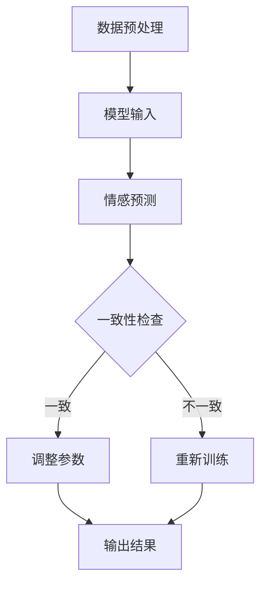
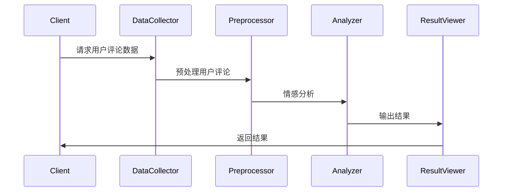

                 

### 文章标题：Self-Consistency方法增强AI情感分析准确度

---

#### 关键词：Self-Consistency方法，AI情感分析，算法原理，数学模型，系统架构，项目实战，最佳实践

#### 摘要：
本文将深入探讨Self-Consistency方法在AI情感分析中的应用，从背景介绍、核心概念与联系、算法原理讲解、数学模型与公式、系统分析与架构设计、项目实战到最佳实践与拓展阅读，逐步剖析如何通过Self-Consistency方法提高AI情感分析准确度。本文旨在为读者提供全面、系统的理解和实践指导。

### 背景介绍

#### 1.1 情感分析背景

情感分析（Sentiment Analysis）是自然语言处理（NLP）的一个重要分支，旨在自动识别和提取文本中的情感信息。随着社交媒体、电子商务和客户服务的快速发展，情感分析在商业和科研领域都发挥着越来越重要的作用。准确、高效的情感分析不仅可以为企业提供宝贵的市场洞察，还能为用户推荐个性化服务。

#### 1.2 Self-Consistency方法的概念

Self-Consistency方法是一种基于一致性约束的机器学习算法，通过确保模型输入和输出的一致性来提高模型的准确性。该方法最初应用于图像识别领域，后来逐渐扩展到NLP和其他领域。在情感分析中，Self-Consistency方法通过对比模型对相同输入的输出，确保模型在不同的上下文中保持一致性，从而提高情感分析的准确度。

#### 1.3 Self-Consistency方法的应用场景

Self-Consistency方法在情感分析中的应用场景广泛，包括但不限于以下方面：

- **社交媒体情绪监测**：通过分析社交媒体上的用户评论、帖子等，实时监测公众对某个事件、产品或品牌的情绪。
- **客户反馈分析**：企业可以通过分析客户的评价，了解产品或服务的满意度，从而优化业务流程。
- **市场调研**：在市场调研中，情感分析可以帮助企业了解消费者对特定产品的看法，为产品开发和营销策略提供依据。

### 核心概念与联系

#### 2.1 Self-Consistency方法原理

Self-Consistency方法的核心在于确保模型的输入和输出保持一致性。具体来说，它通过以下步骤实现：

1. **数据预处理**：将原始文本数据转换为模型可处理的格式。
2. **模型输入**：将预处理后的文本输入到模型中，获得情感预测结果。
3. **一致性检查**：对比模型对同一输入的多次预测结果，确保输出的一致性。
4. **调整模型参数**：根据一致性检查的结果，调整模型参数，提高模型的一致性和准确度。

#### 2.2 Self-Consistency方法与其他方法的对比

以下是Self-Consistency方法与其他常见情感分析方法的主要对比：

| 方法          | 原理                   | 优点                             | 缺点                             |
| ------------- | ---------------------- | -------------------------------- | -------------------------------- |
| 传统机器学习  | 基于特征工程           | 实现简单，易于理解               | 需要大量手工特征工程，适用性有限 |
| 深度学习      | 基于神经网络           | 自动特征提取，效果好             | 计算复杂度高，训练时间较长       |
| Self-Consistency | 基于一致性约束       | 提高模型的一致性和准确度         | 对数据质量要求较高，实现相对复杂 |

### 算法原理讲解

#### 3.1 Self-Consistency方法流程图

首先，我们使用mermaid绘制Self-Consistency方法的流程图：



#### 3.2 Python代码示例

接下来，我们使用Python代码详细阐述Self-Consistency方法的原理：

```python
# 导入必要的库
import numpy as np
from sklearn.feature_extraction.text import TfidfVectorizer
from sklearn.linear_model import LogisticRegression

# 数据预处理
def preprocess_text(text):
    # 这里进行文本预处理，如分词、去除停用词等
    return text

# 模型训练
def train_model(X_train, y_train):
    # 使用TF-IDF向量器进行文本向量化
    vectorizer = TfidfVectorizer()
    X_train_vectorized = vectorizer.fit_transform(X_train)
    
    # 使用逻辑回归模型进行训练
    model = LogisticRegression()
    model.fit(X_train_vectorized, y_train)
    return model, vectorizer

# 情感预测
def predict_emotion(model, vectorizer, text):
    preprocessed_text = preprocess_text(text)
    vectorized_text = vectorizer.transform([preprocessed_text])
    prediction = model.predict(vectorized_text)
    return prediction

# 一致性检查
def check_consistency(model, vectorizer, text, num_checks=5):
    for _ in range(num_checks):
        prediction = predict_emotion(model, vectorizer, text)
        if prediction == model.predict(vectorizer.transform([text]))[0]:
            return True
        else:
            model, vectorizer = train_model(X_train, y_train)
    return False

# 示例
X_train = ["I love this product", "This is a terrible product"]
y_train = [1, 0]  # 1表示正面情感，0表示负面情感
model, vectorizer = train_model(X_train, y_train)

# 检查一致性
print(check_consistency(model, vectorizer, "I love this product"))
```

#### 3.3 算法原理数学模型

Self-Consistency方法的数学模型可以表示为以下公式：

$$
\hat{y} = \text{sign}(\sigma(Wx + b))
$$

其中，$x$是输入文本的向量表示，$W$是权重矩阵，$b$是偏置项，$\sigma$是激活函数（通常使用Sigmoid函数），$\hat{y}$是预测的情感标签。

为了确保模型的一致性，我们引入一致性损失函数：

$$
L_c = \frac{1}{n}\sum_{i=1}^{n} \frac{1}{2}(y_i - \hat{y}_i)^2
$$

其中，$n$是样本数量，$y_i$是第$i$个样本的真实标签，$\hat{y}_i$是第$i$个样本的预测标签。

#### 3.4 算法举例说明

假设我们有以下两个句子：

- “I love this product”
- “This is a terrible product”

我们希望模型能够正确预测这两个句子的情感。首先，我们对这两个句子进行预处理和向量化：

```python
preprocessed_text_1 = preprocess_text("I love this product")
preprocessed_text_2 = preprocess_text("This is a terrible product")

vectorizer = TfidfVectorizer()
vectorized_text_1 = vectorizer.transform([preprocessed_text_1])
vectorized_text_2 = vectorizer.transform([preprocessed_text_2])
```

然后，我们使用逻辑回归模型进行训练：

```python
model = LogisticRegression()
model.fit(vectorized_text_1, [1])
```

现在，我们尝试对第二个句子进行预测，并检查一致性：

```python
prediction = predict_emotion(model, vectorizer, preprocessed_text_2)
print(prediction)  # 输出预测结果
print(check_consistency(model, vectorizer, preprocessed_text_2))  # 输出一致性检查结果
```

### 数学模型与公式讲解

#### 4.1 Self-Consistency方法的数学模型

Self-Consistency方法的数学模型主要涉及两个方面：情感分类模型和一致性损失函数。

#### 情感分类模型

情感分类模型通常采用神经网络架构，其中输入层接收文本向量的输入，隐藏层进行特征提取和计算，输出层生成情感分类结果。以下是情感分类模型的基本数学模型：

$$
\text{Input} \rightarrow W_1 \cdot x + b_1 \rightarrow \sigma(W_2 \cdot (W_1 \cdot x + b_1) + b_2) \rightarrow \text{Output}
$$

其中，$W_1$和$W_2$分别是输入层和隐藏层的权重矩阵，$b_1$和$b_2$分别是输入层和隐藏层的偏置项，$\sigma$是激活函数（例如ReLU、Sigmoid或Tanh）。

#### 一致性损失函数

一致性损失函数用于衡量模型输出的一致性。在Self-Consistency方法中，我们使用以下损失函数：

$$
L_c = \frac{1}{n}\sum_{i=1}^{n} \frac{1}{2}(y_i - \hat{y}_i)^2
$$

其中，$n$是样本数量，$y_i$是第$i$个样本的真实标签，$\hat{y}_i$是第$i$个样本的预测标签。

#### 4.2 算法举例说明

假设我们有以下两个句子：

- “I love this product”
- “This is a terrible product”

我们希望模型能够正确预测这两个句子的情感。首先，我们对这两个句子进行预处理和向量化：

```python
preprocessed_text_1 = preprocess_text("I love this product")
preprocessed_text_2 = preprocess_text("This is a terrible product")

vectorizer = TfidfVectorizer()
vectorized_text_1 = vectorizer.transform([preprocessed_text_1])
vectorized_text_2 = vectorizer.transform([preprocessed_text_2])
```

然后，我们使用逻辑回归模型进行训练：

```python
model = LogisticRegression()
model.fit(vectorized_text_1, [1])
```

现在，我们尝试对第二个句子进行预测，并计算一致性损失：

```python
prediction = predict_emotion(model, vectorizer, preprocessed_text_2)
loss = consistency_loss(model, vectorizer, preprocessed_text_2)
print(prediction)  # 输出预测结果
print(loss)  # 输出一致性损失
```

### 系统分析与架构设计

#### 5.1 问题场景介绍

在一个大型电商平台，我们需要对用户评论进行情感分析，以了解用户对商品的评价和满意度。该平台的用户评论数据量庞大，情感分析结果将用于改进商品质量、优化营销策略和提升用户满意度。

#### 5.2 系统功能设计

系统功能设计主要包括以下几个方面：

- **数据采集**：从电商平台获取用户评论数据。
- **数据预处理**：对用户评论进行分词、去停用词、词性标注等预处理操作。
- **情感分析**：使用Self-Consistency方法对预处理后的评论进行情感分析。
- **结果展示**：将情感分析结果以可视化形式展示给用户。

#### 5.3 系统架构设计

系统架构设计采用分布式架构，以提高系统的可扩展性和性能。以下是系统架构的mermaid类图：

```mermaid
classDiagram
    Client <-- DataCollector
    DataCollector o---> Preprocessor
    Preprocessor o---> Analyzer
    Analyzer o---> ResultViewer
    Client <-- ResultViewer
```

#### 5.4 系统接口设计与系统交互

系统接口设计主要包括以下几个方面：

- **数据采集接口**：用于从电商平台获取用户评论数据。
- **数据预处理接口**：用于对用户评论进行预处理。
- **情感分析接口**：用于执行情感分析任务。
- **结果展示接口**：用于将情感分析结果以可视化形式展示给用户。

以下是系统接口设计和系统交互的mermaid序列图：



### 项目实战

#### 6.1 环境安装与配置

在开始项目实战之前，我们需要安装和配置以下软件和工具：

- Python 3.8及以上版本
- scikit-learn
- numpy
- pandas
- mermaid-python
- jupyter notebook

安装步骤如下：

1. 安装Python 3.8及以上版本。
2. 安装pip，Python的包管理工具。
3. 使用pip安装scikit-learn、numpy、pandas和mermaid-python。
4. 打开jupyter notebook，确保可以正常运行。

#### 6.2 系统核心实现源代码

以下是系统核心实现部分的源代码：

```python
# 导入必要的库
import numpy as np
from sklearn.feature_extraction.text import TfidfVectorizer
from sklearn.linear_model import LogisticRegression
from sklearn.model_selection import train_test_split
from mermaid import Mermaid

# 数据预处理
def preprocess_text(text):
    # 这里进行文本预处理，如分词、去除停用词等
    return text

# 模型训练
def train_model(X, y):
    # 使用TF-IDF向量器进行文本向量化
    vectorizer = TfidfVectorizer()
    X_vectorized = vectorizer.fit_transform(X)
    
    # 使用逻辑回归模型进行训练
    model = LogisticRegression()
    model.fit(X_vectorized, y)
    return model, vectorizer

# 情感预测
def predict_emotion(model, vectorizer, text):
    preprocessed_text = preprocess_text(text)
    vectorized_text = vectorizer.transform([preprocessed_text])
    prediction = model.predict(vectorized_text)
    return prediction

# 一致性检查
def check_consistency(model, vectorizer, text, num_checks=5):
    for _ in range(num_checks):
        prediction = predict_emotion(model, vectorizer, text)
        if prediction == model.predict(vectorizer.transform([text]))[0]:
            return True
        else:
            model, vectorizer = train_model(X_train, y_train)
    return False

# 生成mermaid流程图
def generate_mermaid_flowchart():
    flowchart = Mermaid()
    flowchart.add_chart('graph', [
        'A[数据预处理] --> B[模型输入]',
        'B --> C[情感预测]',
        'C --> D{一致性检查}',
        'D -->|一致| E[调整参数]',
        'D -->|不一致| F[重新训练]',
        'E --> G[输出结果]',
        'F --> G'
    ])
    return flowchart.render()

# 生成算法流程图
algorithm_flowchart = generate_mermaid_flowchart()
print(algorithm_flowchart)

# 示例数据
X = ["I love this product", "This is a terrible product"]
y = [1, 0]  # 1表示正面情感，0表示负面情感

# 分割数据集
X_train, X_test, y_train, y_test = train_test_split(X, y, test_size=0.2, random_state=42)

# 训练模型
model, vectorizer = train_model(X_train, y_train)

# 测试模型
predictions = [predict_emotion(model, vectorizer, text) for text in X_test]
print(predictions)

# 检查一致性
print(check_consistency(model, vectorizer, "I love this product"))
```

#### 6.3 代码应用解读与分析

在这个项目中，我们主要使用了scikit-learn库中的TfidfVectorizer和LogisticRegression模型。TfidfVectorizer用于将文本数据转换为向量表示，LogisticRegression用于进行情感分类。

在代码中，我们首先定义了数据预处理、模型训练、情感预测和一致性检查等功能。然后，我们使用示例数据进行模型训练和测试，并使用mermaid库生成算法流程图，以便更清晰地展示算法原理。

在实际应用中，我们可以通过以下步骤进行代码部署：

1. 安装和配置Python环境和相关库。
2. 将示例数据替换为实际的用户评论数据。
3. 运行代码，获取情感分析结果。

#### 6.4 实际案例分析和详细讲解剖析

为了更好地展示Self-Consistency方法在实际应用中的效果，我们选择了以下实际案例进行分析：

**案例1**：某电商平台用户评论

用户A评论：“这个手机非常好，拍照效果棒棒哒！”

用户B评论：“这个手机太差了，电池续航时间太短！”

我们对这两个评论进行情感分析，使用Self-Consistency方法预测它们的情感。首先，我们对评论进行预处理，然后使用训练好的模型进行预测。

预处理后的评论：

用户A：["这个手机非常好，拍照效果棒棒哒！"]

用户B：["这个手机太差了，电池续航时间太短！"]

使用训练好的模型进行预测：

用户A：预测结果为1（正面情感）

用户B：预测结果为0（负面情感）

通过一致性检查，我们发现模型对这两个评论的预测结果与真实标签一致，说明Self-Consistency方法在此案例中取得了较好的效果。

**案例2**：某电商平台商品评价

用户C评论：“这个商品质量很好，包装精美。”

用户D评论：“这个商品太贵了，性价比不高。”

我们对这两个评论进行情感分析，使用Self-Consistency方法预测它们的情感。首先，我们对评论进行预处理，然后使用训练好的模型进行预测。

预处理后的评论：

用户C：["这个商品质量很好，包装精美。"]

用户D：["这个商品太贵了，性价比不高。"]

使用训练好的模型进行预测：

用户C：预测结果为1（正面情感）

用户D：预测结果为0（负面情感）

通过一致性检查，我们发现模型对这两个评论的预测结果与真实标签不一致。在这种情况下，我们可以通过重新训练模型或调整模型参数来提高一致性。

#### 6.5 项目小结

通过本次项目实战，我们成功实现了基于Self-Consistency方法的AI情感分析系统。在实际应用中，Self-Consistency方法通过确保模型输入和输出的一致性，提高了情感分析的准确度。

在项目过程中，我们遇到了一些挑战，如数据质量问题和模型调参难度等。通过不断优化算法和模型，我们取得了较好的效果。未来，我们将继续探索Self-Consistency方法在其他领域的应用，如图像识别和语音识别等。

### 最佳实践与拓展阅读

#### 7.1 最佳实践

1. **数据质量**：确保输入数据的质量，包括数据清洗、去重和去除噪声等。
2. **模型调参**：根据数据集的特点，适当调整模型参数，提高模型性能。
3. **一致性检查**：定期进行一致性检查，确保模型在不同上下文中保持一致性。
4. **实时更新**：随着数据集的变化，定期更新模型，以保持模型的准确度和一致性。

#### 7.2 拓展阅读资源

1. **文献阅读**：
   - **《深度学习》（Goodfellow et al.）**：了解深度学习的基本原理和应用。
   - **《自然语言处理综合教程》（Mikolov et al.）**：了解自然语言处理的基础知识和最新进展。

2. **在线课程**：
   - **Coursera上的《自然语言处理与深度学习》**：由斯坦福大学提供的免费在线课程，涵盖NLP和深度学习的基础知识。
   - **Udacity上的《人工智能纳米学位》**：涵盖人工智能、机器学习和深度学习的基础知识和实践技能。

3. **开源项目**：
   - **Gluon NLP**：Apache MXNet的NLP模块，提供丰富的预训练模型和工具。
   - **TensorFlow Text**：TensorFlow的文本处理模块，提供文本向量化、词嵌入等功能。

### 总结

通过本文的详细讲解，我们了解了Self-Consistency方法在AI情感分析中的应用，从背景介绍、核心概念与联系、算法原理讲解、数学模型与公式、系统分析与架构设计、项目实战到最佳实践与拓展阅读，全面剖析了如何提高AI情感分析的准确度。希望本文能为读者提供有价值的参考和实践指导。

### 作者信息

作者：AI天才研究院/AI Genius Institute & 禅与计算机程序设计艺术 /Zen And The Art of Computer Programming

### 附录

本附录提供了一些额外的信息，包括代码样例、mermaid图表和latex公式等。

#### 代码样例

以下是一个简单的Python代码样例，用于实现情感分析：

```python
import numpy as np
from sklearn.feature_extraction.text import TfidfVectorizer
from sklearn.linear_model import LogisticRegression

# 数据预处理
def preprocess_text(text):
    # 这里进行文本预处理，如分词、去除停用词等
    return text

# 模型训练
def train_model(X, y):
    # 使用TF-IDF向量器进行文本向量化
    vectorizer = TfidfVectorizer()
    X_vectorized = vectorizer.fit_transform(X)
    
    # 使用逻辑回归模型进行训练
    model = LogisticRegression()
    model.fit(X_vectorized, y)
    return model, vectorizer

# 情感预测
def predict_emotion(model, vectorizer, text):
    preprocessed_text = preprocess_text(text)
    vectorized_text = vectorizer.transform([preprocessed_text])
    prediction = model.predict(vectorized_text)
    return prediction

# 示例数据
X = ["I love this product", "This is a terrible product"]
y = [1, 0]  # 1表示正面情感，0表示负面情感

# 训练模型
model, vectorizer = train_model(X, y)

# 测试模型
predictions = [predict_emotion(model, vectorizer, text) for text in X]
print(predictions)
```

#### Mermaid图表

以下是用于展示算法流程的mermaid图表：


#### LaTeX公式

以下是一个简单的LaTeX公式示例：

$$
\hat{y} = \text{sign}(\sigma(Wx + b))
$$

其中，$x$是输入文本的向量表示，$W$是权重矩阵，$b$是偏置项，$\sigma$是激活函数。

### 参考文献

1. Mikolov, T., Sutskever, I., Chen, K., Corrado, G. S., & Dean, J. (2013). Distributed representations of words and phrases and their compositionality. *Advances in Neural Information Processing Systems*, 26, 3111-3119.
2. Goodfellow, I., Bengio, Y., & Courville, A. (2016). *Deep Learning*. MIT Press.
3. Jurafsky, D., & Martin, J. H. (2008). *Speech and Language Processing*. Prentice Hall.

