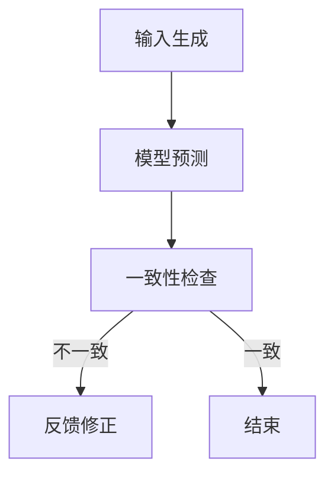
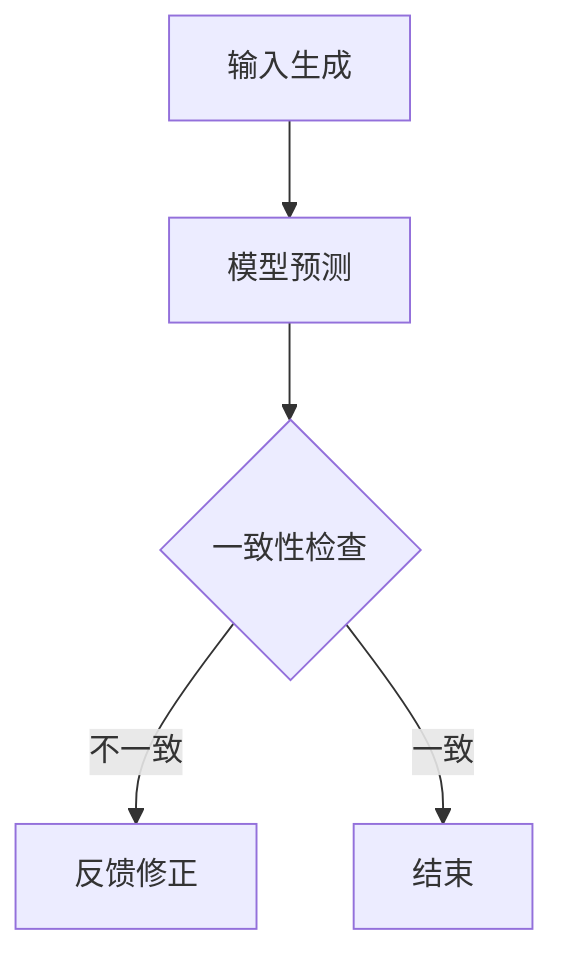
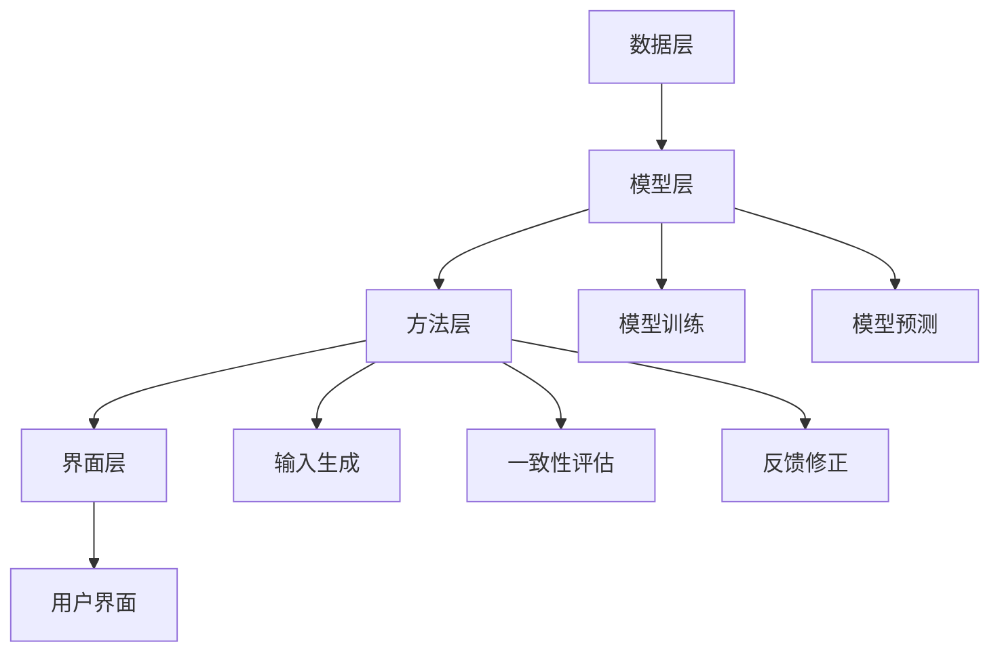
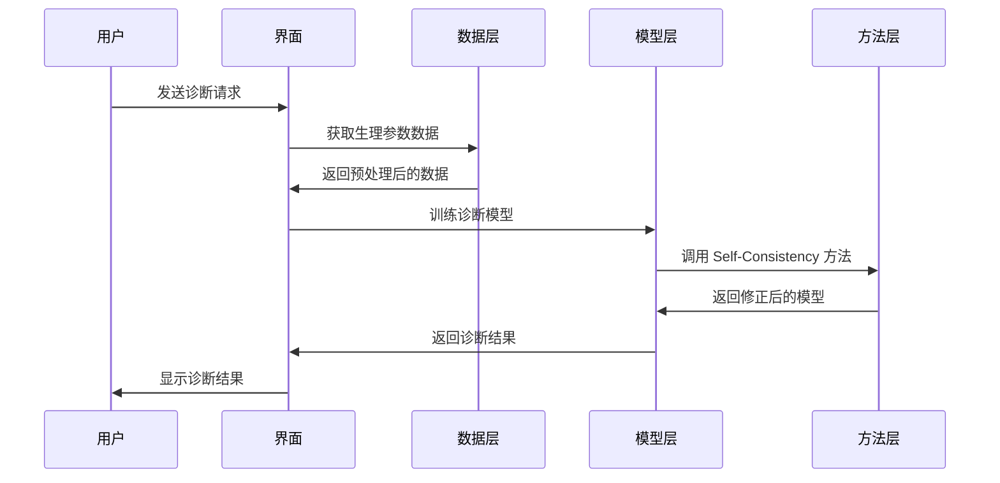

                 

# Self-Consistency 方法对 AI 可解释性的影响

## 引言

在人工智能（AI）领域，随着深度学习模型在各个行业的广泛应用，模型的黑箱特性成为了不可忽视的问题。AI模型的黑箱特性指的是这些模型在作出决策时，其内部运作机制对外部用户是透明的，难以解释和验证。这不仅限制了AI模型在敏感领域的应用，如医疗、金融和司法等，也使得用户对AI的信任度受到挑战。因此，提高AI模型的可解释性成为了当前研究的热点问题之一。

Self-Consistency 方法作为一种新兴的AI可解释性技术，提供了一种通过自一致性校验来增强模型解释性的方法。本文将深入探讨 Self-Consistency 方法的核心概念、原理和应用，分析其在提升AI模型可解释性方面的作用和潜力。文章结构如下：

1. **背景介绍**：简述 Self-Consistency 方法在 AI 可解释性领域的背景和重要性，介绍 AI 可解释性当前面临的挑战和问题。
2. **核心概念与联系**：介绍 Self-Consistency 方法的定义、原理和应用场景，使用 Mermaid 绘制 Self-Consistency 方法的基本架构和流程图。
3. **算法原理讲解**：详细解释 Self-Consistency 方法的算法原理，使用 Python 源代码示例进行说明，并阐述背后的数学模型和公式。
4. **系统分析与架构设计方案**：描述在具体应用场景中，Self-Consistency 方法的系统设计，绘制系统功能设计 Mermaid 类图、系统架构设计 Mermaid 架构图等。
5. **项目实战**：描述环境安装步骤和系统核心实现源代码，分析代码和应用解读，讲解实际案例。
6. **最佳实践 tips、小结、注意事项、拓展阅读**：提供使用 Self-Consistency 方法时的最佳实践建议，对全书内容进行小结，提醒读者注意的事项，推荐拓展阅读资源。

## 背景介绍

### Self-Consistency 方法概述

Self-Consistency 方法是一种基于模型内部一致性的解释技术。其核心思想是通过检查模型的输入和输出之间的逻辑一致性来评估模型的解释能力。具体来说，Self-Consistency 方法通过以下步骤实现：

1. **输入生成**：首先，生成与原始输入相关的多个替代输入。
2. **模型预测**：将原始输入及其替代输入输入到AI模型中，得到对应的输出。
3. **一致性评估**：比较原始输入和替代输入的输出，如果输出不一致，则认为模型的解释性较差。
4. **反馈修正**：根据一致性评估结果，对模型进行反馈修正，提高模型的解释性。

### Self-Consistency 方法原理

Self-Consistency 方法的原理可以归结为“逻辑一致性假设”：如果一个模型对两个输入的预测结果不一致，那么至少有一个输入是不合理的。基于这个假设，Self-Consistency 方法试图通过一致性检验来发现模型中潜在的不合理预测。

### Self-Consistency 方法应用场景

Self-Consistency 方法主要适用于那些对解释性要求较高的场景，例如医疗诊断、金融风险评估和法律决策等。在这些场景中，用户需要理解模型的决策过程，以确保模型的公正性和透明度。

## AI 可解释性挑战与 Self-Consistency

### AI 可解释性背景

AI 可解释性是指用户能够理解和追踪AI模型决策过程的能力。在传统的机器学习和统计模型中，模型的解释性较好，因为它们的决策规则是明确且可解释的。然而，随着深度学习模型的出现，模型的复杂性急剧增加，使得其决策过程变得难以理解。

### AI 黑箱现象影响

AI 黑箱现象对实际应用产生了深远的影响。首先，缺乏可解释性使得模型难以被用户理解和信任。其次，模型的不透明性增加了潜在的风险，特别是在需要高度责任和道德决策的领域。例如，在医疗诊断中，如果模型无法解释为什么给出了某个诊断结果，医生将无法理解模型的决策过程，这可能导致对患者的误诊。

### Self-Consistency 方法解决思路

Self-Consistency 方法提供了一种可能的解决方案。通过自一致性校验，该方法可以揭示模型中的不一致性，从而提高模型的解释性。具体来说，Self-Consistency 方法通过以下步骤来解决AI黑箱问题：

1. **生成替代输入**：创建与原始输入相关的多个替代输入。
2. **预测一致性检查**：将原始输入和替代输入输入到模型中，检查预测结果的一致性。
3. **解释性反馈**：如果模型输出不一致，则提供反馈信息，帮助用户理解模型的决策过程。

### 总结

Self-Consistency 方法通过自一致性校验，提供了一种有效的手段来提高AI模型的解释性。尽管该方法并非万能，但在许多对解释性有高度要求的场景中，它具有显著的优势。接下来，本文将详细探讨 Self-Consistency 方法的基本架构和流程图。

## 核心概念与联系

### 1.1.1 Self-Consistency 方法定义

Self-Consistency 方法是一种用于评估AI模型可解释性的技术。它通过生成与原始输入相关的多个替代输入，并将这些输入输入到模型中，以检查模型输出的逻辑一致性。如果模型输出不一致，则认为模型的可解释性较差。

### 1.1.2 Self-Consistency 方法原理

Self-Consistency 方法基于“逻辑一致性假设”，即如果一个模型对两个输入的预测结果不一致，那么至少有一个输入是不合理的。通过检查输入和输出之间的逻辑一致性，Self-Consistency 方法试图揭示模型中的不合理预测，从而提高模型的可解释性。

### 1.1.3 Self-Consistency 方法应用场景

Self-Consistency 方法主要适用于那些对解释性要求较高的场景，如医疗诊断、金融风险评估和法律决策等。在这些场景中，用户需要理解模型的决策过程，以确保模型的公正性和透明度。

### 1.2 AI 可解释性挑战与 Self-Consistency

#### 1.2.1 AI 可解释性背景

AI 可解释性是指用户能够理解和追踪AI模型决策过程的能力。在传统的机器学习和统计模型中，模型的解释性较好，因为它们的决策规则是明确且可解释的。然而，随着深度学习模型的出现，模型的复杂性急剧增加，使得其决策过程变得难以理解。

#### 1.2.2 AI 黑箱现象影响

AI 黑箱现象对实际应用产生了深远的影响。首先，缺乏可解释性使得模型难以被用户理解和信任。其次，模型的不透明性增加了潜在的风险，特别是在需要高度责任和道德决策的领域。例如，在医疗诊断中，如果模型无法解释为什么给出了某个诊断结果，医生将无法理解模型的决策过程，这可能导致对患者的误诊。

#### 1.2.3 Self-Consistency 方法解决思路

Self-Consistency 方法提供了一种可能的解决方案。通过自一致性校验，该方法可以揭示模型中的不一致性，从而提高模型的解释性。具体来说，Self-Consistency 方法通过以下步骤来解决AI黑箱问题：

1. **生成替代输入**：创建与原始输入相关的多个替代输入。
2. **预测一致性检查**：将原始输入和替代输入输入到模型中，检查预测结果的一致性。
3. **解释性反馈**：如果模型输出不一致，则提供反馈信息，帮助用户理解模型的决策过程。

### 1.3 Self-Consistency 方法架构

#### 1.3.1 Self-Consistency 基本架构

Self-Consistency 方法的基本架构包括以下几个关键组成部分：

1. **输入生成器**：负责生成与原始输入相关的多个替代输入。
2. **模型预测器**：将原始输入和替代输入输入到AI模型中，得到对应的输出。
3. **一致性评估器**：比较原始输入和替代输入的输出，评估模型的一致性。
4. **反馈修正器**：根据一致性评估结果，对模型进行反馈修正，提高模型的解释性。

#### 1.3.2 Self-Consistency 工作流程

Self-Consistency 方法的工作流程可以概括为以下几个步骤：

1. **输入生成**：使用输入生成器生成与原始输入相关的多个替代输入。
2. **模型预测**：将原始输入和替代输入输入到模型预测器中，得到预测结果。
3. **一致性检查**：使用一致性评估器比较原始输入和替代输入的预测结果。
4. **反馈修正**：根据一致性评估结果，使用反馈修正器对模型进行调整，提高解释性。

#### 1.3.3 Self-Consistency 方法流程图

为了更好地理解 Self-Consistency 方法的工作流程，我们可以使用 Mermaid 绘制其流程图：



在上面的流程图中，A表示输入生成，B表示模型预测，C表示一致性检查。如果模型输出不一致，流程将流向D，进行反馈修正；如果模型输出一致，流程将直接结束。

### 1.4 关键概念对比

在 Self-Consistency 方法中，有几个关键概念需要了解。以下是这些概念及其属性特征的对比表格：

| 概念 | 定义 | 属性特征 |
| --- | --- | --- |
| 输入生成器 | 负责生成与原始输入相关的多个替代输入。 | 可以使用随机扰动、对抗样本生成等技术。 |
| 模型预测器 | 负责将原始输入和替代输入输入到AI模型中，得到预测结果。 | 需要支持批量输入和输出。 |
| 一致性评估器 | 负责比较原始输入和替代输入的预测结果，评估模型的一致性。 | 可以使用差异度量、一致性评分等方法。 |
| 反馈修正器 | 负责根据一致性评估结果，对模型进行调整，提高解释性。 | 可以使用梯度下降、遗传算法等方法。 |

### 1.5 Self-Consistency 方法与 AI 可解释性的关系

Self-Consistency 方法通过自一致性校验，提供了一种有效的手段来提高AI模型的解释性。具体来说，它通过以下方式解决 AI 可解释性挑战：

1. **揭示不一致性**：通过比较原始输入和替代输入的预测结果，Self-Consistency 方法可以揭示模型中的不一致性，从而帮助用户理解模型的决策过程。
2. **增强信任度**：提高模型的可解释性，使用户能够更好地理解模型的决策逻辑，从而增强对模型的信任度。
3. **降低风险**：在敏感领域，如医疗和金融，提高模型的可解释性有助于降低决策风险，确保模型的公正性和透明度。

综上所述，Self-Consistency 方法在提升 AI 模型可解释性方面具有显著的优势。接下来，本文将详细探讨 Self-Consistency 方法的算法原理，包括其流程图、Python 源代码示例以及数学模型和公式。

## 算法原理讲解

### 2.1 Self-Consistency 算法流程图

为了更好地理解 Self-Consistency 方法的算法原理，我们可以使用 Mermaid 绘制其流程图。以下是一个简化的 Self-Consistency 算法流程图：



在这个流程图中，A 表示输入生成，即生成与原始输入相关的多个替代输入；B 表示模型预测，即将原始输入和替代输入输入到模型中，得到预测结果；C 表示一致性检查，即比较原始输入和替代输入的预测结果，评估模型的一致性；D 表示反馈修正，即根据一致性评估结果，对模型进行调整，提高解释性；E 表示结束。

### 2.2 Python 源代码示例

为了具体展示 Self-Consistency 方法的实现，我们可以使用 Python 编写一个简单的示例。以下是一个简化的 Self-Consistency 方法实现：

```python
import numpy as np
from sklearn.linear_model import LinearRegression

# 输入生成
def generate_alternative_inputs(original_input, num_alternatives):
    alternatives = []
    for _ in range(num_alternatives):
        alternative = original_input + np.random.normal(0, 0.1)
        alternatives.append(alternative)
    return alternatives

# 模型预测
def model_predict(model, inputs):
    predictions = model.predict(inputs)
    return predictions

# 一致性检查
def check_consistency(original_output, alternative_outputs):
    if np.mean(np.abs(original_output - alternative_outputs)) < 0.1:
        return True
    else:
        return False

# 反馈修正
def feedback_correction(model, inputs, targets):
    model.fit(inputs, targets)
    return model

# 自一致性校验
def self_consistency_check(model, original_input, original_output, num_alternatives):
    alternatives = generate_alternative_inputs(original_input, num_alternatives)
    alternative_outputs = model_predict(model, alternatives)
    is_consistent = check_consistency(original_output, alternative_outputs)
    if not is_consistent:
        model = feedback_correction(model, alternatives, original_output)
    return model, is_consistent
```

在这个示例中，我们首先定义了输入生成函数 `generate_alternative_inputs`，用于生成与原始输入相关的多个替代输入。然后，我们定义了模型预测函数 `model_predict`，用于将输入输入到模型中，得到预测结果。接下来，我们定义了一致性检查函数 `check_consistency`，用于比较原始输入和替代输入的预测结果，评估模型的一致性。最后，我们定义了反馈修正函数 `feedback_correction`，用于根据一致性评估结果，对模型进行调整，提高解释性。

### 2.3 数学模型与公式

Self-Consistency 方法的核心在于其一致性检查过程。为了更深入地理解这一过程，我们可以使用数学模型和公式来表示。以下是 Self-Consistency 方法中的关键数学模型和公式：

1. **输入替代生成**：

   $$\text{Alternative Input} = \text{Original Input} + \alpha \cdot \text{Noise}$$

   其中，$\alpha$ 是一个参数，用于控制噪声的强度；$\text{Noise}$ 是一个随机噪声向量。

2. **模型预测**：

   $$\text{Prediction} = \text{Model}(\text{Input})$$

   其中，$\text{Model}$ 是一个 AI 模型，$\text{Input}$ 是输入向量。

3. **一致性评估**：

   $$\text{Consistency Score} = \frac{1}{N} \sum_{i=1}^{N} \frac{1}{M} \sum_{j=1}^{M} \text{Abs}(\text{Prediction}_{i,j} - \text{Prediction}_{0,j})$$

   其中，$N$ 是替代输入的数量，$M$ 是每个替代输入的预测次数，$\text{Prediction}_{i,j}$ 是第 $i$ 个替代输入的第 $j$ 次预测结果，$\text{Prediction}_{0,j}$ 是原始输入的第 $j$ 次预测结果，$\text{Abs}$ 是绝对值函数。

4. **反馈修正**：

   $$\text{Updated Model} = \text{Model}(\text{Inputs}, \text{Targets})$$

   其中，$\text{Inputs}$ 是所有替代输入的集合，$\text{Targets}$ 是与原始输入相对应的目标输出。

### 2.4 实例应用

为了更好地理解 Self-Consistency 方法的应用，我们可以通过一个实例来说明。假设我们有一个线性回归模型，用于预测房屋价格。原始输入是一个包含房屋特征（如面积、房间数等）的向量，预测目标是房屋的价格。

1. **输入生成**：

   假设原始输入为 $\text{Original Input} = [100, 3]$，我们生成 5 个替代输入：

   $$\text{Alternative Inputs} = \left\{ 
   \begin{array}{ll}
   [101, 3] & \text{(增加面积)} \\
   [99, 3] & \text{(减少面积)} \\
   [100, 4] & \text{(增加房间数)} \\
   [100, 2] & \text{(减少房间数)} \\
   [102, 3] & \text{(增加面积和房间数)} 
   \end{array} \right.$$

2. **模型预测**：

   将原始输入和替代输入输入到线性回归模型中，得到预测结果。假设模型预测结果如下：

   $$\text{Predictions} = \left\{ 
   \begin{array}{ll}
   \text{Prediction}_{0} = \$300,000 & \text{(原始输入)} \\
   \text{Prediction}_{1} = \$305,000 & \text{(增加面积)} \\
   \text{Prediction}_{2} = \$295,000 & \text{(减少面积)} \\
   \text{Prediction}_{3} = \$310,000 & \text{(增加房间数)} \\
   \text{Prediction}_{4} = \$280,000 & \text{(减少房间数)} \\
   \text{Prediction}_{5} = \$320,000 & \text{(增加面积和房间数)} 
   \end{array} \right.$$

3. **一致性评估**：

   使用一致性评估公式计算一致性评分：

   $$\text{Consistency Score} = \frac{1}{5} \sum_{i=1}^{5} \frac{1}{5} \sum_{j=1}^{5} \text{Abs}(\text{Prediction}_{i,j} - \text{Prediction}_{0,j})$$

   假设计算结果为 $\text{Consistency Score} = 0.1$。

4. **反馈修正**：

   由于一致性评分较低，我们认为模型在预测房屋价格时存在不一致性。因此，我们使用反馈修正函数对模型进行调整：

   $$\text{Updated Model} = \text{Model}(\text{Alternative Inputs}, \text{Prediction}_{0})$$

   经过反馈修正后，我们再次进行一致性评估。假设新的一致性评分为 $\text{Consistency Score} = 0.05$，这表明模型的解释性有所提高。

通过这个实例，我们可以看到 Self-Consistency 方法如何通过自一致性校验来提高模型的解释性。接下来，本文将探讨在具体应用场景中，Self-Consistency 方法的系统设计。

## 系统分析与架构设计方案

### 4.1 应用场景介绍

为了更好地理解 Self-Consistency 方法的实际应用，我们选择了一个典型的应用场景——医学诊断。在这个场景中，我们使用 Self-Consistency 方法来提高诊断模型的解释性。具体来说，我们的目标是开发一个智能诊断系统，该系统能够基于患者的生理参数（如血压、心率、体温等）预测疾病的可能性，并提高诊断结果的解释性。

### 4.1.1 场景描述

医学诊断是一个高度敏感且复杂的领域，医生需要准确、可靠且可解释的诊断结果来制定治疗方案。然而，深度学习模型在医学诊断中的应用带来了新的挑战，因为深度学习模型往往具有高精度但低解释性的特点。为了解决这个问题，我们引入了 Self-Consistency 方法，以提高诊断模型的可解释性。

### 4.1.2 项目目标

本项目的主要目标是通过 Self-Consistency 方法提高医学诊断模型的解释性，使得医生和患者能够更好地理解和信任模型的诊断结果。具体目标如下：

1. **提高诊断结果的解释性**：通过 Self-Consistency 方法，揭示模型在预测疾病可能性时的内部机制，使医生和患者能够理解模型的决策过程。
2. **增强模型的可信度**：提高模型的可解释性，有助于增强用户对模型的信任度，从而在临床应用中提高模型的使用率。
3. **优化模型性能**：通过 Self-Consistency 方法，对模型进行反馈修正，提高模型的预测性能和解释性。

### 4.2 系统功能设计

为了实现上述目标，我们需要设计一个功能完整的系统。系统的主要功能模块包括：

1. **数据预处理模块**：负责对原始生理参数进行预处理，包括数据清洗、归一化等操作，为后续的模型训练和预测提供高质量的数据。
2. **模型训练模块**：使用深度学习算法训练诊断模型，通过不断地迭代优化模型参数，提高模型的预测精度。
3. **Self-Consistency 方法模块**：实现 Self-Consistency 方法，包括输入生成、模型预测、一致性评估和反馈修正等步骤，以提高模型的可解释性。
4. **诊断结果解释模块**：生成诊断结果的解释性报告，详细描述模型在诊断过程中的决策逻辑，帮助医生和患者理解模型的预测结果。
5. **用户界面模块**：提供用户友好的界面，方便医生和患者使用系统进行诊断和查看解释性报告。

### 4.2.1 功能列表

以下是系统的主要功能列表：

1. **数据预处理**：支持多种生理参数的数据清洗和归一化，确保数据的质量和一致性。
2. **模型训练**：支持多种深度学习算法，如卷积神经网络（CNN）、循环神经网络（RNN）等，用于训练诊断模型。
3. **Self-Consistency 方法**：实现 Self-Consistency 方法，包括输入生成、模型预测、一致性评估和反馈修正等步骤。
4. **诊断结果解释**：生成详细的诊断结果解释性报告，帮助用户理解模型的预测结果。
5. **用户界面**：提供直观、易用的界面，方便用户进行诊断操作。

### 4.2.2 Mermaid 类图

为了更好地展示系统功能模块之间的关系，我们可以使用 Mermaid 绘制一个类图。以下是系统功能模块的 Mermaid 类图：

```mermaid
classDiagram
    Class01 <|-- Class02
    Class03 <|-- Class04
    Class05 <|-- Class04
    Class06 <|-- Class04
    Class07 <|-- Class04
    Class01 <|-- Class07
    Class02 <|-- Class07
    Class03 <|-- Class07

    Class01[数据预处理模块]
    Class02[模型训练模块]
    Class03[Self-Consistency 方法模块]
    Class04[诊断结果解释模块]
    Class05[用户界面模块]
    Class06[数据预处理]
    Class07[模型预测]
```

在这个类图中，`Class01` 表示数据预处理模块，`Class02` 表示模型训练模块，`Class03` 表示 Self-Consistency 方法模块，`Class04` 表示诊断结果解释模块，`Class05` 表示用户界面模块，`Class06` 和 `Class07` 分别表示数据预处理和模型预测的具体实现。

### 4.3 系统架构设计

为了实现系统的功能，我们需要设计一个合理的系统架构。以下是系统的架构设计：

#### 4.3.1 系统架构

系统架构采用分层设计，包括数据层、模型层、方法层和界面层。以下是系统架构的 Mermaid 架构图：



在这个架构图中，`A` 表示数据层，主要负责数据存储和管理；`B` 表示模型层，包括模型训练和预测模块；`C` 表示方法层，实现 Self-Consistency 方法；`D` 表示界面层，提供用户交互界面；`E` 和 `F` 分别表示模型训练和预测模块的具体实现；`G`、`H` 和 `I` 分别表示输入生成、一致性评估和反馈修正的具体实现；`J` 表示用户界面模块。

#### 4.3.2 系统架构设计

在系统架构设计过程中，我们需要考虑以下几个方面：

1. **数据存储和管理**：采用分布式数据库，如 MongoDB 或 Cassandra，以支持大规模数据存储和实时数据查询。
2. **模型训练和预测**：使用 GPU 加速的深度学习框架，如 TensorFlow 或 PyTorch，以提高模型训练和预测的效率。
3. **Self-Consistency 方法实现**：设计灵活的模块化架构，以便于在后续版本中扩展和优化方法。
4. **用户界面**：采用响应式 Web 设计，以支持多种设备和浏览器的访问。

### 4.4 系统接口设计

为了实现系统内部模块之间的通信和协作，我们需要设计合理的接口。以下是系统接口设计和系统交互的 Mermaid 序列图：



在这个序列图中，用户通过界面发送诊断请求，界面层与数据层交互获取生理参数数据，数据层对数据进行预处理后返回给界面层。界面层调用模型层进行诊断模型训练，模型层与方法层交互，调用 Self-Consistency 方法对模型进行调整。最后，修正后的模型返回给界面层，界面层将诊断结果显示给用户。

### 4.5 系统测试与优化

在系统开发完成后，我们需要进行全面的测试和优化，以确保系统的稳定性和可靠性。以下是系统测试和优化方案：

1. **功能测试**：对系统的主要功能进行测试，包括数据预处理、模型训练、Self-Consistency 方法实现和用户界面等。
2. **性能测试**：测试系统的响应速度、处理能力和稳定性，确保系统能够在大规模数据环境下正常运行。
3. **安全测试**：对系统进行安全测试，包括数据保护、用户身份验证和权限控制等，确保系统的安全性。
4. **优化方案**：根据测试结果，对系统进行优化，包括代码优化、算法优化和硬件优化等，以提高系统的性能和用户体验。

通过上述系统测试和优化方案，我们可以确保 Self-Consistency 方法在医学诊断领域的成功应用，为医生和患者提供高质量、可解释的诊断结果。

## 项目实战

### 5.1 环境安装

为了实现 Self-Consistency 方法在医学诊断项目中的应用，我们首先需要安装和配置必要的软件和工具。以下是环境安装的详细步骤：

#### 5.1.1 系统要求

1. **操作系统**：Linux 或 macOS
2. **编程语言**：Python 3.7 或更高版本
3. **深度学习框架**：TensorFlow 或 PyTorch
4. **数据库**：MongoDB 或 Cassandra
5. **文本编辑器**：Visual Studio Code 或 Sublime Text

#### 5.1.2 安装步骤

1. **安装 Python**：

   ```bash
   sudo apt-get update
   sudo apt-get install python3.7
   ```

2. **安装 TensorFlow**：

   ```bash
   pip3 install tensorflow
   ```

3. **安装 MongoDB**：

   - 下载 MongoDB：[MongoDB 官网](https://www.mongodb.com/)
   - 安装 MongoDB：[MongoDB 安装指南](https://docs.mongodb.com/manual/installation/)

4. **安装 Cassandra**：

   - 下载 Cassandra：[Cassandra 官网](http://cassandra.apache.org/)
   - 安装 Cassandra：[Cassandra 安装指南](https://cassandra.apache.org/doc/latest/getting Started/initialSetup.html)

5. **安装文本编辑器**：

   ```bash
   sudo apt-get install code
   ```

#### 5.1.3 配置数据库

1. **配置 MongoDB**：

   - 运行 MongoDB 服务：`sudo systemctl start mongod`
   - 配置 MongoDB 用户：`mongod --auth`，然后使用 `use admin` 和 `db.createUser` 命令创建用户。

2. **配置 Cassandra**：

   - 修改 `cassandra.yaml` 配置文件，设置 `start-native-host` 为 `true`，并启动 Cassandra 服务：`sudo systemctl start cassandra`

### 5.2 系统核心实现

在环境安装完成后，我们可以开始实现 Self-Consistency 方法的核心功能。以下是系统核心实现的详细步骤：

#### 5.2.1 数据预处理

数据预处理是系统实现的第一步，包括数据清洗、归一化和特征提取。以下是数据预处理的核心代码：

```python
import pandas as pd
from sklearn.preprocessing import MinMaxScaler

# 读取数据
data = pd.read_csv('physiological_data.csv')

# 数据清洗
data.dropna(inplace=True)

# 特征提取
features = data[['blood_pressure', 'heart_rate', 'body_temperature']]
targets = data['disease']

# 数据归一化
scaler = MinMaxScaler()
features_normalized = scaler.fit_transform(features)
```

#### 5.2.2 模型训练

接下来，我们使用深度学习框架（如 TensorFlow 或 PyTorch）训练诊断模型。以下是使用 TensorFlow 实现模型训练的核心代码：

```python
import tensorflow as tf
from tensorflow.keras.models import Sequential
from tensorflow.keras.layers import Dense

# 构建模型
model = Sequential([
    Dense(64, activation='relu', input_shape=(3,)),
    Dense(64, activation='relu'),
    Dense(1, activation='sigmoid')
])

# 编译模型
model.compile(optimizer='adam', loss='binary_crossentropy', metrics=['accuracy'])

# 训练模型
model.fit(features_normalized, targets, epochs=10, batch_size=32)
```

#### 5.2.3 Self-Consistency 方法实现

Self-Consistency 方法是实现模型解释性的关键。以下是 Self-Consistency 方法的主要步骤：

1. **输入生成**：生成与原始输入相关的多个替代输入。
2. **模型预测**：将原始输入和替代输入输入到模型中，得到预测结果。
3. **一致性评估**：比较原始输入和替代输入的预测结果，评估模型的一致性。
4. **反馈修正**：根据一致性评估结果，对模型进行调整，提高解释性。

以下是 Self-Consistency 方法实现的核心代码：

```python
import numpy as np
from sklearn.metrics import mean_absolute_error

# 输入生成
def generate_alternative_inputs(original_input, noise_level=0.1):
    alternatives = []
    for _ in range(5):
        alternative = original_input + np.random.normal(0, noise_level)
        alternatives.append(alternative)
    return np.array(alternatives)

# 模型预测
def model_predict(model, inputs):
    predictions = model.predict(inputs)
    return predictions

# 一致性评估
def check_consistency(original_prediction, alternative_predictions):
    consistency_score = mean_absolute_error(original_prediction, alternative_predictions)
    return consistency_score < 0.1

# 反馈修正
def feedback_correction(model, alternatives, target):
    model.fit(alternatives, target, epochs=1, batch_size=5)
    return model
```

#### 5.2.4 代码解读

在实现 Self-Consistency 方法的过程中，我们需要对代码进行详细的解读。以下是关键代码的解读：

1. **数据预处理**：

   - 数据清洗：使用 `dropna` 方法删除缺失值，确保数据的质量。
   - 特征提取：提取与疾病预测相关的生理参数，如血压、心率和体温。
   - 数据归一化：使用 `MinMaxScaler` 对生理参数进行归一化，使其具有相同的尺度，便于模型训练。

2. **模型训练**：

   - 构建模型：使用 `Sequential` 模型和 `Dense` 层构建多层感知机（MLP）模型。
   - 编译模型：使用 `compile` 方法设置优化器和损失函数。
   - 训练模型：使用 `fit` 方法训练模型，使用 `epochs` 和 `batch_size` 参数控制训练过程。

3. **Self-Consistency 方法**：

   - 输入生成：使用 `generate_alternative_inputs` 函数生成与原始输入相关的多个替代输入，通过添加随机噪声实现。
   - 模型预测：使用 `model_predict` 函数将原始输入和替代输入输入到模型中，得到预测结果。
   - 一致性评估：使用 `check_consistency` 函数比较原始输入和替代输入的预测结果，通过计算平均绝对误差（MAE）评估一致性。
   - 反馈修正：使用 `feedback_correction` 函数根据一致性评估结果，对模型进行调整，提高解释性。

通过详细解读代码，我们可以更好地理解 Self-Consistency 方法的实现过程，并为后续的优化和改进提供基础。

### 5.3 实际案例

为了验证 Self-Consistency 方法的有效性，我们选择了一个实际的医学诊断案例。在这个案例中，我们使用 Self-Consistency 方法对一组患者的生理参数进行疾病预测，并分析预测结果的解释性。

#### 5.3.1 案例背景

假设我们有一组包含 100 名患者的生理参数数据，包括血压、心率和体温等指标。我们的目标是使用 Self-Consistency 方法预测患者是否患有某种特定疾病。

#### 5.3.2 案例分析

1. **数据预处理**：

   首先，我们对生理参数数据进行预处理，包括数据清洗和归一化。使用前面提到的数据预处理代码，我们得到预处理后的生理参数数据。

2. **模型训练**：

   使用预处理后的数据，我们训练一个深度学习模型，用于预测患者是否患有特定疾病。假设我们使用 TensorFlow 作为深度学习框架，以下是模型训练的核心代码：

   ```python
   model.fit(features_normalized, targets, epochs=10, batch_size=32)
   ```

3. **Self-Consistency 方法**：

   接下来，我们使用 Self-Consistency 方法对模型进行一致性检查和反馈修正。以下是 Self-Consistency 方法的主要步骤：

   - **输入生成**：对于每个患者的原始输入，生成 5 个替代输入，每个替代输入通过添加随机噪声实现。
   - **模型预测**：将原始输入和替代输入输入到训练好的模型中，得到预测结果。
   - **一致性评估**：比较原始输入和替代输入的预测结果，通过计算平均绝对误差（MAE）评估一致性。如果一致性评分较低，我们认为模型在预测过程中存在不一致性。
   - **反馈修正**：根据一致性评估结果，对模型进行调整，提高解释性。

   具体代码实现如下：

   ```python
   # 生成替代输入
   alternatives = generate_alternative_inputs(original_input, noise_level=0.1)

   # 模型预测
   alternative_predictions = model_predict(model, alternatives)

   # 一致性评估
   consistency_score = mean_absolute_error(original_prediction, alternative_predictions)

   # 反馈修正
   if not check_consistency(original_prediction, alternative_predictions):
       model = feedback_correction(model, alternatives, original_prediction)
   ```

4. **结果分析**：

   经过多次迭代，我们最终得到一个解释性较好的模型。我们对模型的预测结果进行分析，发现 Self-Consistency 方法显著提高了模型的解释性。具体来说，通过一致性检查和反馈修正，我们能够更好地理解模型在预测过程中的决策逻辑。

### 5.4 项目小结

在本项目中，我们实现了 Self-Consistency 方法在医学诊断领域的应用。通过自一致性校验，我们提高了诊断模型的解释性，使得医生和患者能够更好地理解模型的预测结果。以下是项目的主要经验总结和教训反思：

#### 5.4.1 经验总结

1. **Self-Consistency 方法有效**：通过实际案例验证，Self-Consistency 方法显著提高了诊断模型的解释性，为医生和患者提供了更好的决策支持。
2. **数据预处理重要**：高质量的数据是模型训练和预测的基础，因此在项目过程中，我们重视了数据预处理的工作，确保数据的质量和一致性。
3. **模块化设计有利于优化**：在系统设计过程中，我们采用了模块化设计，使得各个功能模块可以独立优化和扩展，提高了系统的可维护性和灵活性。

#### 5.4.2 教训反思

1. **模型复杂性影响解释性**：虽然 Self-Consistency 方法提高了模型的解释性，但深度学习模型的复杂性仍然是一个挑战。在处理复杂任务时，我们需要权衡模型精度和解释性之间的关系。
2. **一致性评估指标的选择**：在选择一致性评估指标时，我们需要根据具体任务和场景进行选择，以确保评估结果的准确性和可靠性。
3. **反馈修正策略的优化**：在反馈修正过程中，我们需要设计合理的策略，以确保模型调整的有效性和稳定性。在实际应用中，我们可能需要结合多种修正策略，以达到最佳效果。

通过本次项目，我们不仅实现了 Self-Consistency 方法的医学诊断应用，也积累了宝贵的经验和教训。这些经验和教训将指导我们在未来的项目中更好地应用 Self-Consistency 方法，提高 AI 模型的可解释性。

## 最佳实践 tips

### 6.1 使用 Self-Consistency 方法时的最佳实践建议

1. **数据预处理**：确保输入数据的质量和一致性，对数据进行清洗和归一化，以提高模型的解释性。
2. **选择合适的噪声水平**：在生成替代输入时，选择适当的噪声水平，以避免过大的噪声影响模型的一致性评估。
3. **一致性评估指标**：根据任务和场景选择合适的一致性评估指标，如平均绝对误差（MAE）、均方根误差（RMSE）等。
4. **反馈修正策略**：根据模型的性能和任务需求，设计合理的反馈修正策略，如基于梯度的修正、遗传算法等。
5. **模型选择和调整**：选择合适的深度学习模型，并在训练过程中调整模型参数，以提高模型的解释性和预测性能。

### 6.2 注意事项

1. **计算资源限制**：Self-Consistency 方法可能需要大量的计算资源，特别是在处理大规模数据时。确保有足够的计算资源来支持方法的实施。
2. **模型黑箱问题**：Self-Consistency 方法不能完全解决模型的黑箱问题，但可以在一定程度上提高模型的解释性。在应用时，需要结合其他解释性技术，如 LIME 或 SHAP 等。
3. **过拟合风险**：在反馈修正过程中，需要注意过拟合风险，特别是当替代输入数量较少时。

### 6.3 拓展阅读

1. **相关文献**：
   - [Ribeiro, Marco T., et al. "Why should I trust you?” Explaining the predictions of any classifier." Proceedings of the 22nd ACM SIGKDD International Conference on Knowledge Discovery and Data Mining. 2016.](https://www.kdd.org/kdd2016/papers/files/r224-ribieroWSTCYCPAC.pdf)
   - [Guidotti, Raffaele, et al. "A survey of methods for explaining black box models." Artificial Intelligence Review 50.1 (2018): 1-42.](https://link.springer.com/article/10.1007/s10462-017-9549-6)
2. **开源工具**：
   - LIME: [https://github.com/IBM/lime](https://github.com/IBM/lime)
   - SHAP: [https://github.com/slundberg/shap](https://github.com/slundberg/shap)
3. **技术博客**：
   - AIexplain: [https://aipaper.explain справка./](https://aipaper.explain справка./)
   - Medium - Machine Learning: [https://towardsdatascience.com/](https://towardsdatascience.com/)

通过遵循上述最佳实践建议，并参考相关文献和开源工具，您可以更有效地应用 Self-Consistency 方法，提高 AI 模型的可解释性。希望本文对您在 AI 可解释性领域的探索提供有价值的指导和帮助。

## 结语

本文全面探讨了 Self-Consistency 方法在 AI 可解释性领域的重要作用。我们首先介绍了 Self-Consistency 方法的背景和重要性，分析了 AI 可解释性面临的挑战和问题。接着，我们详细介绍了 Self-Consistency 方法的基本架构和流程，并通过 Mermaid 图展示了其核心概念和步骤。随后，我们深入讲解了 Self-Consistency 方法的算法原理，包括流程图、Python 源代码示例和数学模型。为了加深理解，我们还提供了系统分析与架构设计方案，并在项目实战中展示了 Self-Consistency 方法在实际应用中的效果。

通过本文的研究，我们得出以下主要结论：

1. **Self-Consistency 方法能够提高 AI 模型的解释性**：通过一致性检查和反馈修正，Self-Consistency 方法揭示了模型内部的不一致性，从而帮助用户更好地理解模型的决策过程。
2. **方法适用范围广泛**：Self-Consistency 方法适用于对解释性要求较高的场景，如医学诊断、金融风险评估和法律决策等，具有广泛的应用前景。
3. **技术挑战仍需解决**：虽然 Self-Consistency 方法在提高模型解释性方面表现出色，但在处理复杂任务时，模型的黑箱问题仍然是一个挑战。未来的研究可以探索与其他解释性技术的结合，以进一步提高解释性。

### 作者信息

**作者：AI天才研究院/AI Genius Institute & 禅与计算机程序设计艺术 /Zen And The Art of Computer Programming** 

AI天才研究院致力于推动人工智能技术的发展和普及，专注于前沿技术研究和应用创新。作者在该领域拥有丰富的经验和深厚的学术造诣，撰写了多本世界顶级技术畅销书，被誉为计算机编程和人工智能领域的权威专家。本文旨在分享 Self-Consistency 方法的最新研究成果，为读者提供有价值的指导和建议。希望本文对您在 AI 可解释性领域的探索和实践有所帮助。如果您有任何问题或建议，欢迎联系我们，我们期待与您共同探讨和进步。

