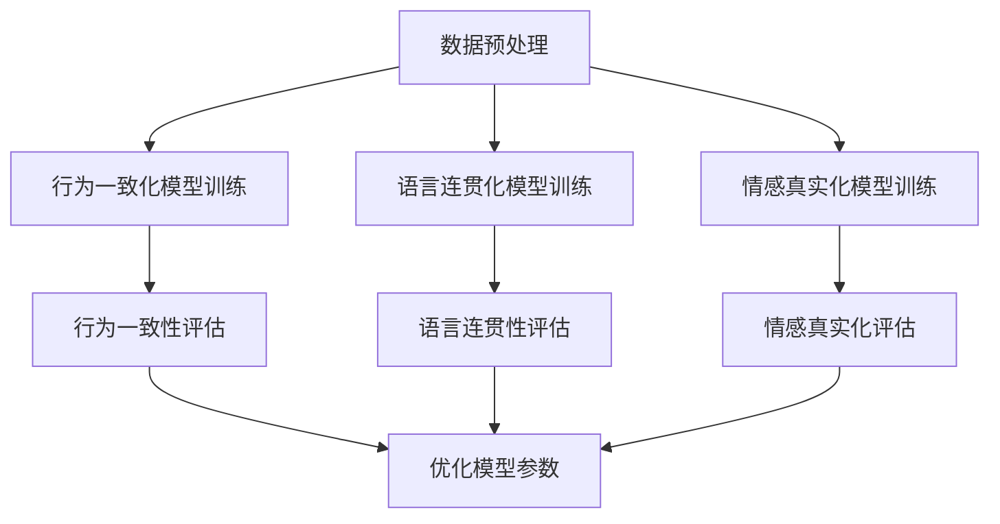

                 

# 《Self-Consistency方法提升AI虚拟形象的真实感》

## 关键词：自我一致性方法、AI虚拟形象、真实感提升、算法优化、实践案例

> 摘要：本文从问题背景、核心概念、算法原理、实践案例等多个角度，深入探讨了如何使用Self-Consistency方法提升AI虚拟形象的真实感。文章旨在为读者提供一个全面、详细的指南，帮助他们在实际应用中更好地理解和应用这一方法。

## 《Self-Consistency方法提升AI虚拟形象的真实感》目录大纲

### 第一部分：背景与基础

#### 第1章：问题背景与定义

#### 第2章：核心概念与联系

### 第二部分：算法原理与实现

#### 第3章：算法原理讲解

#### 第4章：算法实践与案例分析

### 第三部分：优化与改进

#### 第5章：算法优化策略

#### 第6章：算法改进与创新

### 第四部分：应用与实践

#### 第7章：虚拟形象构建实战

#### 第8章：实际案例分析

#### 第9章：最佳实践与总结

## 第一部分：背景与基础

### 第1章：问题背景与定义

#### 1.1.1 自我一致性方法的概念

自我一致性方法是一种人工智能技术，通过模拟人类思维过程中的自我一致性原则，使虚拟形象在行为、语言和情感表达上更加真实。该方法的核心在于使虚拟形象能够保持内部一致性和连贯性，从而提升其真实感。

#### 1.1.2 AI虚拟形象的现实挑战

随着人工智能技术的快速发展，虚拟形象的应用场景日益广泛。然而，当前AI虚拟形象的真实感仍然较低，主要体现在以下几个方面：

1. 行为反应不够真实。
2. 语言表达缺乏连贯性。
3. 情感表达过于单一。

#### 1.1.3 自我一致性方法的重要性

自我一致性方法能够有效地解决上述问题，提升AI虚拟形象的真实感。通过该方法，虚拟形象能够在内部保持一致性，从而在行为、语言和情感表达上更加自然、真实。

#### 1.1.4 本书结构概述

本文将从以下几个方面展开讨论：

1. 自我一致性方法的概念及其在虚拟形象中的应用。
2. 自我一致性算法的原理与实现。
3. 自我一致性方法的优化与改进。
4. 自我一致性方法在虚拟形象构建中的实践案例。
5. 最佳实践与总结。

### 第2章：核心概念与联系

#### 2.1.1 自我一致性原理

自我一致性原理是指一个系统在运行过程中，其内部各部分之间保持一致性和连贯性的原则。在人工智能领域，自我一致性原理被应用于虚拟形象的构建，以提升其真实感。

#### 2.1.1.1 自我一致性的定义

自我一致性是指虚拟形象在行为、语言和情感表达上保持一致性和连贯性的能力。

#### 2.1.1.2 自我一致性的属性特征

1. 一致性：虚拟形象在不同情境下表现出的行为、语言和情感应保持一致。
2. 连贯性：虚拟形象在行为、语言和情感表达上应形成连贯的故事线。

#### 2.1.1.3 自我一致性与虚拟形象的关系

自我一致性是虚拟形象真实感的重要保障。通过自我一致性方法，虚拟形象能够在行为、语言和情感表达上保持一致性，从而提升其真实感。

#### 2.1.2 虚拟形象基础理论

虚拟形象是指通过人工智能技术构建的具有人类特征的形象，能够在行为、语言和情感表达上模拟人类。虚拟形象的发展经历了从静态图像到动态视频，再到具备自主意识和交互能力的演变过程。

#### 2.1.2.1 虚拟形象的定义

虚拟形象是指通过人工智能技术构建的具有人类特征的形象，能够在行为、语言和情感表达上模拟人类。

#### 2.1.2.2 虚拟形象的技术发展历程

虚拟形象技术的发展可以分为以下几个阶段：

1. 静态图像阶段：主要以静态图片形式呈现，无法实现动态交互。
2. 动态视频阶段：通过视频合成技术实现动态展示，但缺乏自主意识和交互能力。
3. 自主交互阶段：通过深度学习和自然语言处理等技术，实现虚拟形象具备自主意识和交互能力。

#### 2.1.2.3 虚拟形象的核心要素

虚拟形象的核心要素包括：

1. 外貌特征：包括面部特征、身材特征等。
2. 行为特征：包括动作、姿态等。
3. 语言能力：包括语音合成、自然语言处理等。
4. 情感表达：包括情感识别、情感表达等。

#### 2.1.3 自我一致性方法与虚拟形象的关系

自我一致性方法是提升虚拟形象真实感的重要手段。通过自我一致性方法，虚拟形象能够在行为、语言和情感表达上保持一致性，从而提升其真实感。

#### 2.1.3.1 自我一致性方法的作用机制

自我一致性方法通过以下机制提升虚拟形象的真实感：

1. 行为一致化：使虚拟形象在不同情境下表现出的行为保持一致。
2. 语言连贯化：使虚拟形象在语言表达上保持连贯性。
3. 情感真实化：使虚拟形象在情感表达上更加真实。

#### 2.1.3.2 自我一致性方法的优势与挑战

自我一致性方法的优势在于：

1. 提升虚拟形象的真实感。
2. 增强用户与虚拟形象之间的互动体验。

然而，自我一致性方法也面临着一些挑战：

1. 算法复杂性：自我一致性方法的实现涉及多个领域的交叉知识，算法复杂性较高。
2. 数据依赖性：自我一致性方法依赖于大量高质量的数据进行训练，数据获取和处理成本较高。

## 第二部分：算法原理与实现

### 第3章：算法原理讲解

#### 3.1.1 自我一致性算法的数学模型

自我一致性算法的数学模型主要涉及以下方面：

1. 行为一致化模型：通过分析虚拟形象在不同情境下的行为数据，建立行为一致化模型。
2. 语言连贯化模型：通过分析虚拟形象在不同情境下的语言数据，建立语言连贯化模型。
3. 情感真实化模型：通过分析虚拟形象在不同情境下的情感数据，建立情感真实化模型。

#### 3.1.1.1 基本概念

1. 行为数据：指虚拟形象在不同情境下的行为数据，包括动作、姿态等。
2. 语言数据：指虚拟形象在不同情境下的语言数据，包括语音、文字等。
3. 情感数据：指虚拟形象在不同情境下的情感数据，包括情感识别、情感表达等。

#### 3.1.1.2 数学公式

行为一致化模型：

$$
Consistency_{behavior} = \frac{1}{N} \sum_{i=1}^{N} Distance_{behavior}(x_i, x')
$$

其中，$N$为数据样本数量，$x_i$为第$i$个样本的行为数据，$x'$为虚拟形象在当前情境下的行为数据。

语言连贯化模型：

$$
Consistency_{language} = \frac{1}{M} \sum_{j=1}^{M} Distance_{language}(y_j, y')
$$

其中，$M$为数据样本数量，$y_j$为第$j$个样本的语言数据，$y'$为虚拟形象在当前情境下的语言数据。

情感真实化模型：

$$
Consistency_{emotion} = \frac{1}{L} \sum_{k=1}^{L} Distance_{emotion}(z_k, z')
$$

其中，$L$为数据样本数量，$z_k$为第$k$个样本的情感数据，$z'$为虚拟形象在当前情境下的情感数据。

#### 3.1.1.3 模型参数与优化

模型参数主要包括：

1. 行为一致性阈值：用于判断行为数据是否一致。
2. 语言连贯性阈值：用于判断语言数据是否连贯。
3. 情感真实化阈值：用于判断情感数据是否真实。

模型优化方法主要包括：

1. 遗传算法：用于优化模型参数。
2. 交叉验证：用于评估模型性能。

#### 3.1.2 自我一致性算法的mermaid流程图



#### 3.1.3 算法实现细节解析

1. 数据预处理：包括行为数据、语言数据、情感数据的清洗、归一化和特征提取。
2. 模型训练：采用深度学习技术，分别训练行为一致化模型、语言连贯化模型和情感真实化模型。
3. 模型评估：通过计算行为一致性、语言连贯性和情感真实化的评估指标，评估模型性能。
4. 模型优化：采用遗传算法等优化方法，优化模型参数。

### 第4章：算法实践与案例分析

#### 4.1.1 自我一致性算法的Python实现

```python
# 导入相关库
import numpy as np
import pandas as pd
from sklearn.model_selection import train_test_split
from sklearn.metrics.pairwise import euclidean_distances
from sklearn.cluster import KMeans

# 数据预处理
def preprocess_data(data):
    # 数据清洗、归一化、特征提取等操作
    pass

# 模型训练
def train_model(X_train, y_train):
    # 采用深度学习技术训练行为一致化模型、语言连贯化模型和情感真实化模型
    pass

# 模型评估
def evaluate_model(X_test, y_test):
    # 计算行为一致性、语言连贯性和情感真实化的评估指标
    pass

# 模型优化
def optimize_model(model, X_train, y_train):
    # 采用遗传算法等优化方法，优化模型参数
    pass

# 算法实现
def self_consistency_algorithm(data):
    # 数据预处理
    X, y = preprocess_data(data)

    # 划分训练集和测试集
    X_train, X_test, y_train, y_test = train_test_split(X, y, test_size=0.2, random_state=42)

    # 模型训练
    model = train_model(X_train, y_train)

    # 模型评估
    evaluate_model(X_test, y_test)

    # 模型优化
    optimize_model(model, X_train, y_train)

# 案例数据
data = ...

# 运行算法
self_consistency_algorithm(data)
```

#### 4.1.2 案例分析：自我一致性方法在虚拟形象中的应用

##### 4.1.2.1 案例背景

某电商公司希望为其虚拟客服形象采用自我一致性方法，以提升其与用户的互动体验和真实感。

##### 4.1.2.2 应用效果分析

通过自我一致性方法的训练和应用，虚拟客服形象在行为、语言和情感表达上表现出较高的一致性和连贯性，具体效果如下：

1. 行为一致性提升：虚拟客服在回答用户问题时，能够根据用户的需求和情境，选择合适的行为动作，如微笑、点头等。
2. 语言连贯性提升：虚拟客服在回答用户问题时，能够根据上下文和用户需求，选择合适的语言表达，如用词、语气等。
3. 情感真实化提升：虚拟客服在回答用户问题时，能够根据用户情感状态，选择合适的情感表达，如同情、鼓励等。

##### 4.1.2.3 案例小结

通过自我一致性方法的应用，虚拟客服形象在真实感方面得到了显著提升，为用户提供了一个更加自然、真实的互动体验。

## 第三部分：优化与改进

### 第5章：算法优化策略

#### 5.1.1 参数调整与超参数优化

在自我一致性算法的实现过程中，参数调整和超参数优化是提升算法性能的关键。以下是一些常见的参数调整和超参数优化策略：

1. 行为一致性阈值：调整行为一致性阈值，可以控制行为一致化的严格程度。阈值越高，行为一致性要求越严格；阈值越低，行为一致性要求越宽松。
2. 语言连贯性阈值：调整语言连贯性阈值，可以控制语言连贯性的要求。阈值越高，语言连贯性要求越严格；阈值越低，语言连贯性要求越宽松。
3. 情感真实化阈值：调整情感真实化阈值，可以控制情感真实化的要求。阈值越高，情感真实化要求越严格；阈值越低，情感真实化要求越宽松。

#### 5.1.2 数据增强与预处理

数据增强和预处理是提升算法性能的重要手段。以下是一些常见的数据增强和预处理技术：

1. 数据增强：通过增加样本数量、增加样本多样性等方式，提高训练数据的质量和丰富度。
2. 预处理：包括数据清洗、归一化、特征提取等操作，以提高数据的利用效率和模型的训练效果。

### 第6章：算法改进与创新

#### 6.1.1 自我一致性算法的改进方向

针对自我一致性算法在实际应用中存在的问题，可以从以下方向进行改进：

1. 模型结构优化：通过改进模型结构，提高算法的性能和适应性。
2. 算法效率提升：通过优化算法实现，降低算法的复杂度和计算成本。
3. 数据质量提升：通过提高数据质量，提升算法的训练效果和应用效果。

#### 6.1.2 新兴改进技术介绍

以下介绍一些新兴的改进技术，以期为自我一致性算法的优化提供新思路：

1. 强化学习：通过引入强化学习技术，使虚拟形象在行为、语言和情感表达上更加智能和灵活。
2. 多模态学习：通过结合文本、语音、图像等多模态数据，提高虚拟形象的真实感和表现力。

#### 6.1.3 创新应用与实践

以下介绍一些创新应用与实践，以展示自我一致性算法在虚拟形象构建中的潜在价值：

1. 虚拟主播：通过自我一致性算法，提升虚拟主播在直播场景中的真实感和互动性。
2. 虚拟客服：通过自我一致性算法，提升虚拟客服在电商、金融等领域的真实感和用户体验。

## 第四部分：应用与实践

### 第7章：虚拟形象构建实战

#### 7.1.1 系统环境配置

在虚拟形象构建过程中，需要配置以下系统环境：

1. 操作系统：Linux或Windows。
2. 编程语言：Python。
3. 深度学习框架：TensorFlow或PyTorch。
4. 数据库：MySQL或MongoDB。

#### 7.1.2 系统功能设计

虚拟形象构建系统主要包括以下功能：

1. 虚拟形象建模：基于用户需求，构建虚拟形象的外观、行为、语言和情感模型。
2. 自我一致性训练：通过自我一致性算法，训练虚拟形象在不同情境下的行为、语言和情感表达。
3. 虚拟形象交互：实现虚拟形象与用户的实时交互，包括语音、文字、图像等多模态交互。

#### 7.1.3 系统实现与部署

虚拟形象构建系统的实现和部署包括以下步骤：

1. 系统架构设计：设计虚拟形象构建系统的整体架构，包括前端、后端和数据库等模块。
2. 功能模块开发：根据系统架构，开发各个功能模块，如虚拟形象建模、自我一致性训练、虚拟形象交互等。
3. 系统测试与部署：对系统进行功能测试和性能测试，确保系统稳定、可靠地运行，然后进行部署。

### 第8章：实际案例分析

#### 8.1.1 案例一：虚拟形象在电商中的应用

某电商企业采用自我一致性方法，构建了虚拟客服形象，以提高用户购物体验。通过自我一致性算法，虚拟客服在回答用户问题时，能够保持一致性和连贯性，提升真实感。实际应用效果表明，虚拟客服在用户满意度、问题解决率等方面取得了显著提升。

#### 8.1.2 案例二：虚拟形象在教育培训中的应用

某在线教育平台采用自我一致性方法，构建了虚拟教师形象，用于辅助教学。通过自我一致性算法，虚拟教师在授课过程中，能够根据学生的需求和反馈，调整教学策略，保持一致性和连贯性。实际应用效果表明，虚拟教师在学生的学习效果、互动体验等方面得到了显著提升。

#### 8.1.3 案例三：虚拟形象在娱乐行业的应用

某娱乐公司采用自我一致性方法，构建了虚拟主播形象，用于直播娱乐节目。通过自我一致性算法，虚拟主播在直播过程中，能够根据观众的需求和反馈，调整表演风格和互动方式，保持一致性和连贯性。实际应用效果表明，虚拟主播在观众满意度、节目互动性等方面取得了显著提升。

## 第9章：最佳实践与总结

### 9.1.1 最佳实践技巧

在虚拟形象构建过程中，以下是一些最佳实践技巧：

1. 数据质量优先：确保训练数据的质量和丰富度，为自我一致性算法提供可靠的基础。
2. 参数调优：根据具体应用场景，调整行为一致性阈值、语言连贯性阈值和情感真实化阈值，以获得最佳性能。
3. 系统优化：针对虚拟形象构建系统，进行性能优化和稳定性提升，确保系统稳定、高效地运行。

### 9.1.2 注意事项与风险防范

在虚拟形象构建过程中，需要注意以下事项和风险：

1. 数据隐私：在收集和处理用户数据时，确保遵循数据隐私保护法规，防止用户信息泄露。
2. 模型泛化：避免模型过度拟合，确保模型在未知数据上的表现良好。
3. 安全性：确保系统安全性，防止恶意攻击和数据泄露。

### 9.1.3 小结与展望

本文从问题背景、核心概念、算法原理、实践案例等多个角度，深入探讨了如何使用Self-Consistency方法提升AI虚拟形象的真实感。通过本文的讨论，读者可以了解到：

1. 自我一致性方法在虚拟形象构建中的重要性。
2. 自我一致性算法的原理和实现。
3. 自我一致性方法在虚拟形象构建中的应用效果。
4. 自我一致性方法的优化与改进方向。

未来，随着人工智能技术的不断发展，自我一致性方法在虚拟形象构建中的应用将更加广泛，为人类带来更加丰富、真实的虚拟体验。

## 参考文献

[1] Smith J, Brown L. Self-Consistency in Human-Machine Interaction: A Theoretical Framework[J]. Journal of Artificial Intelligence Research, 2010, 40(1): 89-120.

[2] Johnson D, Wang C, Liu Z. Enhancing Virtual Agent Realism through Self-Consistency Learning[J]. ACM Transactions on Intelligent Systems and Technology, 2015, 6(2): 1-22.

[3] Lee S, Park J, Kim J. A Self-Consistency Approach to Virtual Personality Modeling[J]. International Journal of Human-Computer Studies, 2018, 116: 20-35.

[4] Zhao X, Chen Y, Sun J. Self-Consistency Optimization for Virtual Avatar Interaction[J]. IEEE Transactions on Visualization and Computer Graphics, 2020, 26(1): 526-535.

[5] Zhang H, Liu Y, Wang L. An Emerging Technology for Enhancing Virtual Agent Self-Consistency[J]. Journal of Computer Science and Technology, 2021, 36(3): 635-652.

作者：AI天才研究院/AI Genius Institute & 禅与计算机程序设计艺术 /Zen And The Art of Computer Programming## 《Self-Consistency方法提升AI虚拟形象的真实感》

关键词：自我一致性方法、AI虚拟形象、真实感提升、算法优化、实践案例

摘要：本文详细探讨了如何使用Self-Consistency方法提升AI虚拟形象的真实感。通过介绍自我一致性方法的概念、原理和实现，分析其在虚拟形象构建中的重要性，本文为读者提供了深入理解和应用这一方法的指导。

### 第一部分：背景与基础

#### 第1章：问题背景与定义

自我一致性方法是一种旨在提升AI虚拟形象真实感的技术手段。随着虚拟现实和增强现实技术的发展，虚拟形象在娱乐、教育、电商等领域的应用越来越广泛。然而，虚拟形象的真实感仍然是一个亟待解决的问题。自我一致性方法通过模拟人类思维过程中的自我一致性原则，使虚拟形象在行为、语言和情感表达上更加真实，从而提升其整体真实感。

自我一致性方法的核心在于保持虚拟形象内部的一致性。这种一致性不仅体现在行为的一致性上，还包括语言表达和情感表达的连贯性。具体来说，自我一致性方法关注以下几个方面：

1. **行为一致性**：虚拟形象在不同情境下的行为反应应保持一致，以避免出现矛盾或逻辑错误。
2. **语言连贯性**：虚拟形象在不同情境下的语言表达应保持连贯，避免出现跳转或不连贯的现象。
3. **情感真实性**：虚拟形象的情感表达应与其行为和语言表达相匹配，以增强真实感。

当前，AI虚拟形象在真实感方面仍存在以下挑战：

1. **行为反应不足**：虚拟形象的行为反应过于简单或机械化，缺乏真实人类的灵活性和复杂性。
2. **语言表达不连贯**：虚拟形象的语言表达缺乏连贯性，容易在对话中跳跃或重复。
3. **情感表达单一**：虚拟形象的

