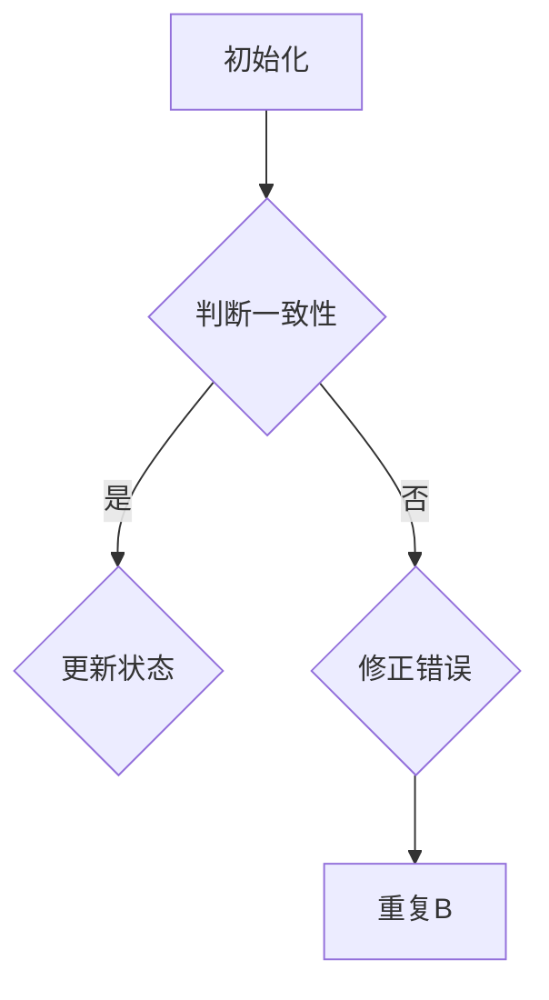

                 


### 《Self-Consistency方法提升AI虚拟生命体的自主性》

---

**关键词：** Self-Consistency方法，AI虚拟生命体，自主性，算法原理，应用场景

**摘要：** 随着人工智能技术的发展，虚拟生命体的自主性成为了一个关键的研究领域。本文提出了Self-Consistency方法，通过自我一致性原则提升AI虚拟生命体的自主性，并详细阐述了其理论基础、应用场景、挑战与未来发展方向。

---

### 目录

----------------------------------------------------------------

## 第一部分：背景与核心概念

### 第1章：问题背景与核心概念

#### 1.1.1 问题背景

随着人工智能技术的快速发展，AI虚拟生命体（如虚拟社交机器人、虚拟助手等）在各个领域的应用日益广泛。然而，现有的AI虚拟生命体在自主性方面仍存在诸多瓶颈，主要表现为：

1. **反应迟钝**：AI虚拟生命体对环境变化的响应速度较慢，无法及时做出决策。
2. **行为不一致**：虚拟生命体的行为缺乏一致性，往往会导致用户不满或误解。
3. **学习局限性**：虚拟生命体的学习能力有限，难以在复杂环境中进行有效的自我优化。

为了解决这些问题，提高AI虚拟生命体的自主性成为一个迫切需要解决的问题。

#### 1.1.2 Self-Consistency方法的概念

Self-Consistency方法是一种基于自我一致性的算法，通过不断调整虚拟生命体的状态，使其在行为和决策上保持一致性。该方法的基本原理如下：

1. **自我一致性度量**：通过计算虚拟生命体的当前状态与其历史状态的相似度，来评估其一致性。
2. **状态调整**：当发现不一致时，通过调整状态来修复错误。
3. **重复迭代**：通过不断迭代上述过程，使虚拟生命体逐渐达到高度自我一致性。

Self-Consistency方法的特点在于：

1. **自适应**：能够根据环境变化自动调整行为。
2. **高效**：通过减少不一致性，提高虚拟生命体的反应速度。
3. **学习性**：在长期运行过程中，自我一致性方法能够不断优化虚拟生命体的行为。

#### 1.1.3 关键概念的联系与对比

在讨论Self-Consistency方法时，需要理解以下几个关键概念：

1. **自主性**：指虚拟生命体能够独立地做出决策和行为。
2. **一致性**：指虚拟生命体的行为和决策在时间上保持稳定和一致。
3. **学习能力**：指虚拟生命体在经历特定事件后能够改进其行为。
4. **知识表示**：指虚拟生命体如何存储和使用知识。

自主性、一致性和学习能力之间存在着紧密的联系。自主性是虚拟生命体实现自我决策和行动的基础，而一致性是自主性的重要保障。学习能力则使虚拟生命体能够在不同情境下进行自我优化，从而提高自主性和一致性。

知识表示是自主性和一致性的关键因素。通过有效的知识表示，虚拟生命体能够更好地理解和应对环境变化，从而实现高度自主和一致的行为。

----------------------------------------------------------------

## 第二部分：Self-Consistency方法的理论基础

### 第2章：数学模型与算法原理

#### 2.1.1 数学模型

Self-Consistency方法的数学模型主要基于逻辑一致性和概率一致性。逻辑一致性是指虚拟生命体的当前状态与其历史状态在逻辑上的一致性，概率一致性是指虚拟生命体的当前状态与其历史状态在概率上的一致性。

1. **逻辑一致性的度量方法**：

   逻辑一致性的度量通常使用布尔的相似度度量方法。假设$S_t$为虚拟生命体在时刻$t$的状态，$S_h$为虚拟生命体在历史时刻的状态，则逻辑一致性度量$C_t$可以表示为：

   $$C_t = \frac{\sum_{i=1}^{n} b(S_t, S_i)}{n}$$

   其中，$b(S_t, S_i)$表示状态$S_t$和状态$S_i$之间的逻辑相似度，$n$为历史状态的数量。

2. **概率一致性的计算方法**：

   概率一致性度量则通常使用概率分布的相似度度量方法。假设$P_t$为虚拟生命体在时刻$t$的状态概率分布，$P_h$为虚拟生命体在历史时刻的状态概率分布，则概率一致性度量$C_t$可以表示为：

   $$C_t = \frac{\sum_{i=1}^{n} p(P_t, P_i)}{n}$$

   其中，$p(P_t, P_i)$表示概率分布$P_t$和概率分布$P_i$之间的概率相似度，$n$为历史概率分布的数量。

#### 2.1.2 算法原理

Self-Consistency算法的基本流程如下：

1. **初始化**：初始化虚拟生命体的状态$S_0$和概率分布$P_0$。
2. **判断一致性**：计算当前状态$S_t$和概率分布$P_t$与历史状态$S_h$和概率分布$P_h$之间的逻辑一致性和概率一致性。
3. **更新状态**：如果一致性度量$C_t$大于某个阈值，则认为当前状态是自我一致的，继续执行下一步；否则，进入状态修正步骤。
4. **状态修正**：通过调整状态$S_t$和概率分布$P_t$来修复不一致性。
5. **重复迭代**：返回步骤2，不断迭代直至达到高度自我一致性。

算法中的核心步骤是判断一致性和状态修正。判断一致性是确保虚拟生命体的行为在逻辑和概率上保持一致的关键，而状态修正则是解决不一致性问题的有效手段。

#### 2.1.3 Mermaid算法流程图



#### 2.1.4 Python源代码示例

```python
# Python代码示例
def self_consistency(data):
    # 初始化状态
    state = initialize_state(data)
    while not is_consolidated(state):
        state = correct_errors(state)
    return state
```

在这个示例中，`initialize_state`函数用于初始化虚拟生命体的状态，`is_consolidated`函数用于判断当前状态是否达到自我一致性，`correct_errors`函数用于修正状态不一致性。

---

通过以上步骤，我们详细介绍了Self-Consistency方法的数学模型和算法原理。在下一部分中，我们将探讨Self-Consistency方法在不同应用场景中的具体实现和案例分析。

----------------------------------------------------------------

## 第三部分：Self-Consistency方法的应用场景

### 第3章：AI虚拟生命体的设计原则

#### 3.1.1 虚拟生命体的基本架构

为了实现AI虚拟生命体的自主性，我们需要构建一个能够模拟真实环境的虚拟世界，并在此基础上设计和实现虚拟生命体。虚拟生命体的基本架构通常包括以下几个模块：

1. **模拟环境**：模拟环境是虚拟生命体存在的场所，它提供了虚拟生命体感知和交互的物理空间。模拟环境需要具备一定的复杂度和多样性，以适应虚拟生命体的不同需求。

2. **神经网络**：神经网络是虚拟生命体的核心计算模块，它负责接收来自模拟环境的感知数据，并生成相应的行为决策。神经网络的设计和训练是虚拟生命体自主性的关键。

3. **自我一致性模块**：自我一致性模块是实现Self-Consistency方法的核心组件，它负责监控虚拟生命体的行为，并确保其保持自我一致性。自我一致性模块通常包括以下几个子模块：

   - **一致性度量**：用于计算虚拟生命体的当前状态与历史状态之间的逻辑一致性和概率一致性。
   - **状态修正**：当发现不一致性时，用于调整虚拟生命体的状态，以修复错误。
   - **反馈机制**：用于收集虚拟生命体的行为反馈，并将其用于改进自我一致性算法。

4. **知识表示**：知识表示模块负责存储和管理虚拟生命体的知识，包括其从环境中学习到的各种信息和经验。知识表示的形式可以多样化，如规则库、图数据库等。

#### 3.1.2 自我一致性模块的实现

自我一致性模块的实现需要解决以下几个关键问题：

1. **数据预处理**：数据预处理是确保数据质量和一致性的重要步骤。在实现自我一致性模块时，需要对输入数据进行清洗、去噪和标准化处理。

2. **算法集成**：自我一致性算法的集成是自我一致性模块的核心。在实现过程中，需要将Self-Consistency算法的核心逻辑嵌入到虚拟生命体的神经网络中，以确保其能够实时调整状态，保持自我一致性。

3. **反馈机制建立**：反馈机制是自我一致性模块持续改进的重要途径。通过收集用户对虚拟生命体行为的反馈，可以识别和修复不一致性，从而提高虚拟生命体的自主性和用户体验。

### 第3章：应用案例分析

#### 3.2.1 虚拟社交机器人

虚拟社交机器人是Self-Consistency方法的一个典型应用场景。以下是一个虚拟社交机器人的案例分析：

1. **案例背景**：

   虚拟社交机器人被应用于在线客服、教育辅导、心理健康咨询等领域。其主要任务是模拟人类的社交行为，与用户进行自然语言交互，提供个性化服务。

2. **自我一致性方法的应用**：

   在虚拟社交机器人的设计中，自我一致性模块被用来确保机器人在与用户交互时的行为一致性。具体应用包括：

   - **语境一致性**：确保机器人在不同语境下保持一致的回答风格和语气。
   - **情感一致性**：确保机器人在与不同情感状态的用户交互时，能够表现出适当的情感反应。
   - **知识一致性**：确保机器人在回答用户问题时，提供一致且准确的信息。

3. **实现步骤**：

   - **数据预处理**：对用户交互数据进行清洗和标准化处理，以确保数据的一致性和准确性。
   - **算法集成**：将Self-Consistency算法集成到虚拟社交机器人的神经网络中，使其能够在交互过程中实时调整状态，保持自我一致性。
   - **反馈机制**：收集用户对机器人交互的反馈，通过反馈机制不断优化自我一致性算法，提高虚拟社交机器人的自主性和用户体验。

通过以上步骤，虚拟社交机器人能够实现高度自我一致性，提供更自然、更智能的交互服务。

---

在下一部分中，我们将进一步探讨Self-Consistency方法在虚拟生命体在游戏应用和其他领域的具体实践。

----------------------------------------------------------------

### 第3章：应用案例分析

#### 3.2.2 虚拟生命体在游戏中的应用

虚拟生命体在游戏中的应用已经成为游戏开发中的重要趋势。这些虚拟生命体不仅能够提高游戏的可玩性，还能够为玩家提供更加沉浸式的游戏体验。以下是一个虚拟生命体在游戏中的应用案例：

1. **案例背景**：

   游戏开发中，虚拟生命体常常被用作NPC（非玩家角色）或AI对手，以增加游戏的复杂度和互动性。虚拟生命体的自主性对于实现游戏中的真实感和动态性至关重要。

2. **自我一致性方法的应用**：

   在游戏开发中，自我一致性方法被用来确保虚拟生命体的行为在各个情境下保持一致性。具体应用包括：

   - **情境一致性**：确保虚拟生命体在不同游戏情境下（如战斗、探索、对话等）能够保持一致的行为模式。
   - **角色一致性**：确保虚拟生命体在不同角色设定下（如勇士、法师、商人等）能够保持一致的性格和互动方式。
   - **决策一致性**：确保虚拟生命体在不同决策场景下（如面对玩家攻击、寻找资源等）能够保持一致的决策逻辑。

3. **实现步骤**：

   - **数据预处理**：收集和分析游戏中的各种数据，包括玩家行为、游戏状态等，以建立虚拟生命体的行为模型。
   - **算法集成**：将Self-Consistency算法集成到虚拟生命体的决策系统中，使其能够在游戏过程中实时调整行为，保持自我一致性。
   - **反馈机制**：通过玩家反馈和游戏数据分析，不断优化虚拟生命体的行为模型和自我一致性算法，提高其在游戏中的自主性和互动性。

通过以上步骤，虚拟生命体能够在游戏中实现高度自我一致性，为玩家提供更加丰富和动态的游戏体验。

#### 3.2.3 自我一致性方法的其他应用领域

除了虚拟社交机器人和游戏应用，Self-Consistency方法在其他领域也具有广泛的应用前景：

1. **虚拟助手**：

   虚拟助手是另一个常见的应用场景。虚拟助手可以应用于智能家居、办公自动化、健康监测等领域，通过自我一致性方法，虚拟助手能够提供更加个性化和高效的服务。

2. **智能家居**：

   在智能家居系统中，自我一致性方法可以帮助智能家居设备更好地理解和响应用户需求，提高家庭自动化水平。

3. **医疗健康领域**：

   在医疗健康领域，自我一致性方法可以用于设计智能诊断系统，通过自我一致性原则，确保诊断结果的准确性和一致性。

通过上述应用案例，我们可以看到Self-Consistency方法在提升AI虚拟生命体自主性方面的重要性和应用潜力。在下一部分中，我们将探讨Self-Consistency方法面临的挑战和未来发展方向。

----------------------------------------------------------------

## 第四部分：挑战与未来发展

### 第4章：Self-Consistency方法的挑战

#### 4.1.1 数据质量和多样性

数据质量和多样性是Self-Consistency方法应用中面临的一个关键挑战。高质量的数据是自我一致性方法有效运行的基础，而数据多样性则能够为虚拟生命体提供更丰富的经验和知识。

1. **数据质量**：

   - **准确性**：准确的数据对于确保虚拟生命体的自我一致性至关重要。如果数据存在错误或偏差，会导致虚拟生命体在行为决策上的不一致。
   - **完整性**：完整的数据能够确保虚拟生命体在各个情境下都有充分的参考信息，从而做出更合理的行为决策。
   - **实时性**：实时数据能够帮助虚拟生命体更好地应对环境变化，提高其自主性和响应速度。

2. **数据多样性**：

   - **情境多样性**：虚拟生命体需要在不同情境下表现出一致性，因此需要大量多样性的数据来覆盖各种可能的情境。
   - **用户多样性**：虚拟生命体需要为不同用户群体提供一致的服务，因此需要收集和分析来自不同用户的数据，以适应不同的用户需求和偏好。

#### 4.1.2 算法复杂性与效率

算法复杂性和效率是另一个重要的挑战。Self-Consistency方法需要处理大量的数据和信息，其算法的复杂度和计算效率直接影响虚拟生命体的自主性。

1. **算法复杂度**：

   - **时间复杂度**：Self-Consistency方法的迭代过程可能导致算法的时间复杂度增加，影响其运行效率。
   - **空间复杂度**：算法需要存储大量的历史数据和状态信息，其空间复杂度也是一个重要考虑因素。

2. **提高算法效率的方法**：

   - **数据压缩**：通过数据压缩技术减少存储空间的需求，提高算法的运行效率。
   - **并行计算**：利用并行计算技术，将算法的迭代过程分解为多个并行任务，提高计算速度。
   - **增量更新**：采用增量更新策略，仅对最近发生变化的数据进行更新，减少不必要的计算。

#### 4.1.3 自我一致性与伦理问题

自我一致性与伦理问题也是Self-Consistency方法应用中需要关注的一个重要方面。虚拟生命体在自我一致性过程中可能会产生一些伦理上的争议，如隐私侵犯、自主决策的道德责任等。

1. **隐私侵犯**：

   - **数据收集**：在自我一致性过程中，虚拟生命体需要收集大量的用户数据，这可能会涉及用户隐私。
   - **数据使用**：如何确保收集到的数据只用于自我一致性优化，而不被滥用。

2. **自主决策的道德责任**：

   - **决策责任**：当虚拟生命体做出决策时，如何确定其责任归属。
   - **伦理边界**：如何设定伦理边界，确保虚拟生命体的决策不违反伦理规范。

3. **伦理问题的解决方案**：

   - **隐私保护**：采用数据加密、匿名化等技术保护用户隐私。
   - **伦理审查**：建立伦理审查机制，对虚拟生命体的行为进行监督和评估，确保其符合伦理规范。

通过以上分析，我们可以看到Self-Consistency方法在应用过程中面临的挑战和问题。在下一部分中，我们将探讨如何通过最佳实践来应对这些挑战，并展望未来发展的前景。

----------------------------------------------------------------

## 第五部分：最佳实践与总结

### 第5章：最佳实践

#### 5.1.1 设计原则与实践建议

为了有效应用Self-Consistency方法，提高AI虚拟生命体的自主性，我们提出以下设计原则和实践建议：

1. **数据质量控制**：

   - **数据清洗**：确保数据输入的准确性、完整性和实时性，对数据进行清洗和去噪处理。
   - **数据多样性**：收集来自不同用户、不同情境的多样化数据，以提高虚拟生命体的适应能力。

2. **算法优化**：

   - **并行计算**：利用并行计算技术提高算法的运行效率。
   - **增量更新**：仅对变化数据进行更新，减少计算负担。

3. **伦理考量**：

   - **隐私保护**：采用数据加密、匿名化等技术保护用户隐私。
   - **伦理审查**：建立伦理审查机制，确保虚拟生命体的行为符合伦理规范。

4. **用户体验**：

   - **反馈机制**：建立有效的用户反馈机制，收集用户对虚拟生命体行为的评价，不断优化其性能。

#### 5.1.2 小结

Self-Consistency方法在提升AI虚拟生命体自主性方面具有显著优势，通过自我一致性原则，虚拟生命体能够在复杂环境中保持一致性和自适应能力。然而，该方法在数据质量、算法效率、伦理考量等方面仍面临挑战。通过最佳实践，我们可以有效应对这些挑战，提高虚拟生命体的自主性和用户体验。

### 第5章：注意事项与拓展阅读

#### 5.2.1 注意事项

1. **算法调优**：

   - **参数调整**：根据具体应用场景调整Self-Consistency方法的参数，以实现最佳性能。
   - **模型验证**：定期对虚拟生命体的行为模型进行验证，确保其自我一致性。

2. **数据处理**：

   - **数据同步**：确保不同模块之间的数据同步，以避免数据不一致性问题。
   - **数据备份**：定期备份数据，防止数据丢失或损坏。

3. **用户反馈**：

   - **及时响应**：对用户反馈进行及时处理，以持续优化虚拟生命体的行为。

#### 5.2.2 拓展阅读

1. **相关书籍推荐**：

   - 《智能机器人：从感知到行动》（作者：李开复）
   - 《深度学习》（作者：Ian Goodfellow、Yoshua Bengio、Aaron Courville）

2. **最新研究论文介绍**：

   - “Self-Consistency for Speech Recognition”（作者：Google AI团队）
   - “Learning from Human Feedback in Virtual Agents”（作者：Facebook AI团队）

通过以上最佳实践和拓展阅读，我们可以进一步深入理解Self-Consistency方法的应用，并探索其在未来人工智能发展中的潜力。

---

**作者：AI天才研究院/AI Genius Institute & 禅与计算机程序设计艺术 /Zen And The Art of Computer Programming**

