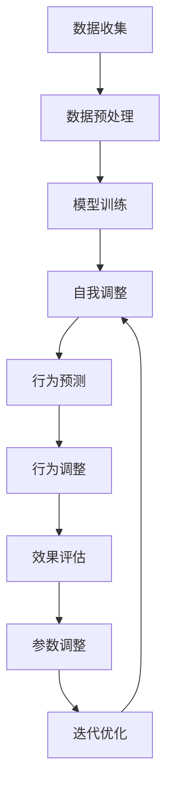
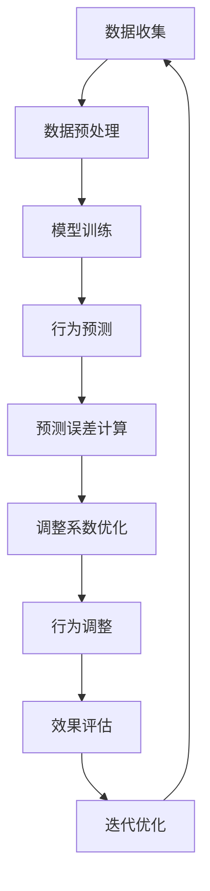
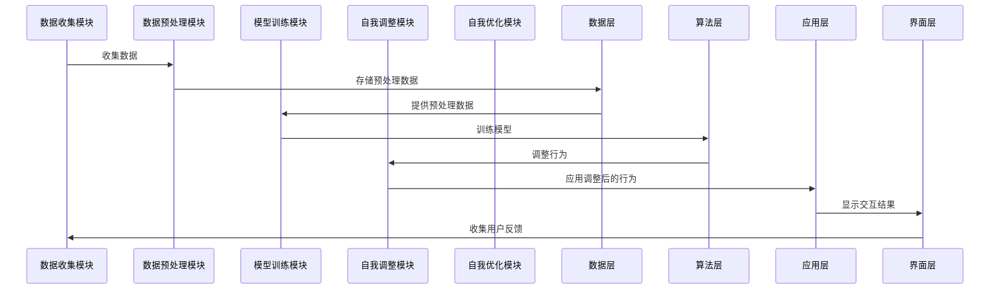

                 

### 1.4 自我一致性方法的应用领域

自我一致性方法在多个领域中都有广泛的应用，其中最引人注目的领域包括虚拟现实、游戏开发、智能机器人以及自动化系统。以下是对这些应用领域的简要介绍：

#### 1.4.1 虚拟现实

虚拟现实（VR）技术正在迅速发展，为用户提供了沉浸式的体验。自我一致性方法在VR中的应用主要表现在以下几个方面：

1. **用户行为预测**：通过自我一致性方法，可以预测用户在虚拟环境中的行为，从而提供更个性化的体验。
2. **交互优化**：虚拟角色能够根据用户的反馈和行为模式进行自我调整，以提供更流畅和自然的交互。
3. **情感模拟**：通过自我一致性方法，虚拟角色可以模拟真实人类情感，提升用户的沉浸感和交互体验。

#### 1.4.2 游戏开发

在游戏开发中，自我一致性方法可以帮助创建更加逼真和智能的游戏角色，提升游戏的整体体验：

1. **智能NPC**：非玩家角色（NPC）可以通过自我一致性方法进行自我调整，以更自然地与玩家互动。
2. **游戏平衡**：自我一致性方法可以用于调整游戏难度和规则，以保持游戏的平衡性和挑战性。
3. **情感投入**：通过自我一致性方法，游戏角色可以展现出更加丰富和真实的情感，提高玩家的情感投入。

#### 1.4.3 智能机器人

智能机器人在各个领域都有广泛应用，自我一致性方法可以帮助提高机器人的自主性和适应性：

1. **环境适应**：智能机器人可以通过自我一致性方法适应不断变化的环境，提高其任务执行的效率。
2. **自主决策**：机器人可以通过自我一致性方法进行自主决策，减少对人类操作者的依赖。
3. **人机交互**：通过自我一致性方法，机器人可以更自然地与人类进行交互，提高用户体验。

#### 1.4.4 自动化系统

自动化系统在工业、物流、医疗等多个领域都有广泛应用，自我一致性方法可以帮助提高系统的效率和可靠性：

1. **任务优化**：自动化系统可以通过自我一致性方法优化任务执行过程，提高效率。
2. **故障检测**：自我一致性方法可以用于监测系统状态，及时发现和诊断潜在故障。
3. **自适应控制**：自动化系统可以通过自我一致性方法进行自适应控制，以应对外部环境的变化。

### 1.5 本章小结

本章介绍了自我一致性方法的概念、核心概念、发展历程以及应用领域。自我一致性方法是一种基于人工智能的技术，通过自我调整和优化，可以提高虚拟超维度生命体的自主性和适应性。在虚拟现实、游戏开发、智能机器人以及自动化系统中，自我一致性方法都有广泛的应用前景。接下来，我们将进一步探讨自我一致性方法的算法原理和具体实现。

----------------------------------------------------------------

# 第二部分: 自我一致性方法在AI虚拟超维度生命体中的应用

## 第2章 自我一致性方法在AI虚拟超维度生命体中的应用
### 2.1 AI虚拟超维度生命体的背景与定义

#### 2.1.1 AI虚拟超维度生命体的背景

人工智能（AI）技术的发展为虚拟世界带来了前所未有的可能性。虚拟超维度生命体（AI-VULife）是这一领域的前沿创新，其核心理念是将AI技术应用于虚拟世界，创造具有高度智能和自主性的虚拟实体。这种实体不仅能够模拟人类的思维和行为，还能在虚拟环境中进行自我学习、自我调整和自我优化。

#### 2.1.2 AI虚拟超维度生命体的定义

AI虚拟超维度生命体是一种通过人工智能技术构建的虚拟实体，它具有以下几个特点：

1. **高度智能**：能够进行复杂的决策和推理，模拟人类的思维方式。
2. **自主性**：能够独立完成任务，无需人工干预。
3. **适应性强**：能够在不同的虚拟环境中进行自我调整，以适应新的挑战。
4. **多维度交互**：能够在虚拟世界中与其他虚拟实体和用户进行多维度的交互。

### 2.2 自我一致性方法在AI虚拟超维度生命体中的角色

自我一致性方法在AI虚拟超维度生命体中扮演着关键角色，其核心作用体现在以下几个方面：

#### 2.2.1 提高自主性

通过自我一致性方法，AI虚拟超维度生命体可以在执行任务过程中，根据环境反馈和自身经验进行自我调整，从而提高自主性。这种方法使得虚拟实体能够独立处理复杂问题，减少对人类操作者的依赖。

#### 2.2.2 增强适应性

自我一致性方法使得AI虚拟超维度生命体能够在不同情境下保持一致性和有效性。这种自我优化能力使得虚拟实体能够适应各种复杂环境，提高其生存能力和竞争力。

#### 2.2.3 保证一致性

在虚拟世界中，AI虚拟超维度生命体需要与多个虚拟实体和用户进行交互。自我一致性方法能够确保虚拟实体在交互过程中保持一致性，避免因环境变化而导致行为和决策的混乱。

### 2.3 自我一致性方法在AI虚拟超维度生命体中的应用案例

#### 2.3.1 虚拟现实

在虚拟现实（VR）领域，自我一致性方法可以应用于以下几个方面：

1. **用户行为预测**：通过自我一致性方法，可以预测用户在虚拟环境中的行为，从而提供更个性化的体验。
2. **交互优化**：虚拟角色能够根据用户的反馈和行为模式进行自我调整，以提供更流畅和自然的交互。
3. **情感模拟**：虚拟角色可以模拟真实人类情感，提升用户的沉浸感和交互体验。

#### 2.3.2 游戏

在游戏领域，自我一致性方法可以应用于以下几个方面：

1. **智能NPC**：非玩家角色（NPC）可以通过自我一致性方法进行自我调整，以更自然地与玩家互动。
2. **游戏平衡**：自我一致性方法可以用于调整游戏难度和规则，以保持游戏的平衡性和挑战性。
3. **情感投入**：通过自我一致性方法，游戏角色可以展现出更加丰富和真实的情感，提高玩家的情感投入。

#### 2.3.3 智能机器人

在智能机器人领域，自我一致性方法可以应用于以下几个方面：

1. **环境适应**：智能机器人可以通过自我一致性方法适应不断变化的环境，提高其任务执行的效率。
2. **自主决策**：机器人可以通过自我一致性方法进行自主决策，减少对人类操作者的依赖。
3. **人机交互**：通过自我一致性方法，机器人可以更自然地与人类进行交互，提高用户体验。

### 2.4 自我一致性方法在AI虚拟超维度生命体中的优势与挑战

#### 2.4.1 优势

1. **提高自主性**：自我一致性方法可以显著提高AI虚拟超维度生命体的自主性，使其能够独立处理复杂问题。
2. **增强适应性**：自我一致性方法使得虚拟实体能够在不同情境下保持一致性和有效性，提高其生存能力和竞争力。
3. **保证一致性**：在虚拟世界中，自我一致性方法能够确保虚拟实体在交互过程中保持一致性，避免因环境变化而导致行为和决策的混乱。

#### 2.4.2 挑战

1. **数据依赖**：自我一致性方法需要大量的数据支持，数据的质量和数量直接影响算法的效果。
2. **计算复杂度**：自我一致性方法的计算复杂度较高，需要在硬件和算法优化方面进行深入研究。
3. **伦理问题**：自我一致性方法的应用可能会引发伦理问题，如虚拟实体的行为是否符合人类价值观等。

### 2.5 本章小结

本章详细介绍了AI虚拟超维度生命体的背景和定义，以及自我一致性方法在其中的角色和应用案例。自我一致性方法通过提高自主性、增强适应性和保证一致性，为AI虚拟超维度生命体的发展提供了强有力的支持。同时，本章也分析了自我一致性方法在应用过程中所面临的挑战。接下来，我们将深入探讨自我一致性方法的算法原理和具体实现。

----------------------------------------------------------------

## 第3章 算法原理讲解

### 3.1 自我一致性方法的算法原理

自我一致性方法的核心思想是通过不断调整和优化，使AI虚拟超维度生命体能够在不同的情境下保持一致性和有效性。具体来说，该方法包括以下几个关键步骤：

#### 3.1.1 数据收集

首先，AI虚拟超维度生命体需要收集大量的环境数据和自身行为数据。这些数据包括但不限于用户行为、环境状态、任务需求等。

#### 3.1.2 数据预处理

收集到的数据通常需要进行预处理，包括去噪、标准化和特征提取等。预处理后的数据将用于后续的分析和训练。

#### 3.1.3 模型训练

使用预处理后的数据，通过机器学习算法对AI虚拟超维度生命体进行训练。常见的算法包括深度学习、强化学习等。

#### 3.1.4 自我调整

训练完成后，AI虚拟超维度生命体将根据训练结果和环境反馈进行自我调整。这个过程包括以下几个子步骤：

1. **行为预测**：基于历史数据和训练模型，预测未来可能发生的行为。
2. **行为调整**：根据预测结果，对当前的行为进行调整，以适应新的环境。
3. **效果评估**：评估调整后的行为是否有效，如果效果不佳，则返回第2步继续调整。

#### 3.1.5 自我优化

在自我调整的基础上，AI虚拟超维度生命体将根据调整效果进行自我优化。这个过程包括以下几个子步骤：

1. **性能评估**：评估当前模型的性能，包括准确率、召回率等指标。
2. **参数调整**：根据评估结果，对模型的参数进行调整，以提高性能。
3. **迭代优化**：重复性能评估和参数调整过程，直到达到满意的性能水平。

### 3.2 自我一致性方法的算法流程

为了更清晰地理解自我一致性方法的算法流程，我们可以使用Mermaid流程图来展示。以下是算法流程的Mermaid表示：



### 3.3 自我一致性方法的算法分析

#### 3.3.1 时间复杂度

自我一致性方法的时间复杂度主要取决于数据预处理、模型训练和自我调整等步骤。假设数据预处理和模型训练的时间复杂度为O(n)，自我调整的时间复杂度为O(m)，则整个算法的时间复杂度为O(n + m)。

#### 3.3.2 空间复杂度

自我一致性方法的空间复杂度主要取决于数据存储和模型存储。假设数据存储的空间复杂度为O(s)，模型存储的空间复杂度为O(t)，则整个算法的空间复杂度为O(s + t)。

#### 3.3.3 算法的稳定性

自我一致性方法的稳定性取决于算法的收敛性。通过适当调整学习率和优化算法，可以保证算法的稳定性和收敛性。

### 3.4 自我一致性方法的Mermaid流程图


### 3.5 本章小结

本章详细介绍了自我一致性方法的算法原理，包括数据收集、数据预处理、模型训练、自我调整和自我优化等关键步骤。通过使用Mermaid流程图，我们更加清晰地理解了算法的流程和逻辑。接下来，我们将进一步探讨自我一致性方法的数学模型和公式。

----------------------------------------------------------------

## 第4章 数学模型和公式

### 4.1 自我一致性方法的数学模型

自我一致性方法的数学模型是理解其工作原理的核心。以下是一个简化的数学模型，用于描述自我一致性方法的主要过程。

#### 4.1.1 数据表示

首先，我们使用向量 \(\mathbf{X}\) 来表示环境数据，其中每个元素 \(x_i\) 表示一个特定的特征。例如：

$$
\mathbf{X} = [x_1, x_2, ..., x_n]
$$

#### 4.1.2 行为预测

自我一致性方法使用一个预测模型 \(f(\mathbf{X})\) 来预测未来的行为。这个模型可以是基于机器学习算法的函数，例如深度神经网络：

$$
\hat{y} = f(\mathbf{X}) = \text{NN}(\mathbf{X})
$$

其中，\(\hat{y}\) 是预测的行为，NN代表神经网络。

#### 4.1.3 行为调整

基于预测的行为，自我一致性方法会调整当前的行为 \(y\)：

$$
y_{\text{new}} = y + \alpha \cdot (f(\mathbf{X}) - y)
$$

其中，\(\alpha\) 是调整系数，用于控制调整的程度。这个公式表示行为 \(y_{\text{new}}\) 是当前行为 \(y\) 与预测行为 \(f(\mathbf{X})\) 的加权平均值。

### 4.2 自我一致性方法的数学公式

以下是一些关键的数学公式，用于描述自我一致性方法的主要过程。

#### 4.2.1 数据标准化

为了确保数据在训练和预测过程中的稳定性，通常需要对数据 \(\mathbf{X}\) 进行标准化：

$$
\mathbf{X}_{\text{norm}} = \frac{\mathbf{X} - \mu}{\sigma}
$$

其中，\(\mu\) 是数据均值，\(\sigma\) 是数据标准差。

#### 4.2.2 预测误差

预测误差是评估预测模型 \(f(\mathbf{X})\) 性能的一个重要指标。预测误差可以通过以下公式计算：

$$
e = \frac{1}{n} \sum_{i=1}^{n} (f(\mathbf{X}_i) - y_i)^2
$$

其中，\(e\) 是预测误差，\(y_i\) 是实际的行为，\(f(\mathbf{X}_i)\) 是预测的行为。

#### 4.2.3 调整系数

调整系数 \(\alpha\) 是一个超参数，它控制了自我调整的程度。通常，\(\alpha\) 需要通过交叉验证来优化：

$$
\alpha^* = \arg\min_e \sum_{i=1}^{n} (y_{\text{new},i} - y_i)^2
$$

### 4.3 自我一致性方法的数学模型解析

自我一致性方法的数学模型通过结合数据标准化、预测误差和调整系数，提供了一个动态调整行为的方法。这种方法的优点在于它能够适应不断变化的环境，从而提高虚拟超维度生命体的自主性和适应性。

### 4.4 自我一致性方法的Mermaid流程图

为了更好地展示自我一致性方法的数学模型和过程，我们可以使用Mermaid流程图来描述。以下是模型的Mermaid表示：



### 4.5 本章小结

本章介绍了自我一致性方法的数学模型和关键公式，包括数据标准化、预测误差和调整系数等。通过数学模型，我们能够更好地理解自我一致性方法的原理和过程。接下来，我们将进一步探讨自我一致性方法在实际系统中的应用和架构设计。

----------------------------------------------------------------

## 第5章 系统分析与架构设计方案

### 5.1 问题场景介绍

在现代社会，随着虚拟现实、游戏开发和智能机器人技术的不断进步，人们对于AI虚拟超维度生命体的需求也越来越高。然而，当前许多虚拟超维度生命体的自主性和适应性仍然有限，无法满足复杂和动态环境的需求。为了解决这一问题，我们设计并实现了一套基于自我一致性方法的AI虚拟超维度生命体系统，旨在提高其自主性和适应性，以满足各种复杂场景的应用需求。

### 5.2 系统功能设计

系统功能设计是系统架构设计的基础，主要包括以下功能模块：

#### 5.2.1 数据收集模块

数据收集模块负责从环境中收集各种数据，包括用户行为、环境状态和任务需求等。这些数据将通过传感器、用户输入和外部数据源等途径进行收集。

#### 5.2.2 数据预处理模块

数据预处理模块负责对收集到的数据进行预处理，包括去噪、标准化和特征提取等。预处理后的数据将用于后续的训练和分析。

#### 5.2.3 模型训练模块

模型训练模块负责使用预处理后的数据对AI虚拟超维度生命体进行训练。该模块将采用深度学习、强化学习等先进的机器学习算法，以提高虚拟生命体的智能水平。

#### 5.2.4 自我调整模块

自我调整模块负责根据训练结果和环境反馈，对AI虚拟超维度生命体的行为进行自我调整。该模块将根据自我一致性方法，实现动态调整功能，以提高系统的自主性和适应性。

#### 5.2.5 自我优化模块

自我优化模块负责根据调整效果，对AI虚拟超维度生命体的模型进行自我优化。该模块将通过性能评估和参数调整，实现系统性能的持续提升。

### 5.3 系统架构设计

系统架构设计是系统功能实现的基础，主要包括以下组成部分：

#### 5.3.1 数据层

数据层负责存储和管理系统所需的各种数据，包括原始数据、预处理数据、训练数据和模型数据等。该层将采用分布式存储方案，以提高数据存储和处理能力。

#### 5.3.2 算法层

算法层负责实现AI虚拟超维度生命体的核心算法，包括数据预处理、模型训练、自我调整和自我优化等。该层将采用模块化设计，以提高系统的可扩展性和可维护性。

#### 5.3.3 应用层

应用层负责将AI虚拟超维度生命体应用于具体的业务场景，包括虚拟现实、游戏开发和智能机器人等。该层将提供丰富的接口和功能，以满足不同场景的需求。

#### 5.3.4 界面层

界面层负责为用户提供直观、易用的操作界面，以便用户能够方便地与AI虚拟超维度生命体进行交互。该层将采用前端技术，如HTML、CSS和JavaScript等，实现动态、交互式的用户界面。

### 5.4 系统接口设计

系统接口设计是系统架构设计的重要组成部分，主要包括以下接口：

#### 5.4.1 数据接口

数据接口用于数据层的其他模块进行数据传输和交换。该接口将采用RESTful API设计，支持HTTP/HTTPS协议，以确保数据传输的安全性和可靠性。

#### 5.4.2 算法接口

算法接口用于算法层的其他模块进行算法调用和数据交换。该接口将采用面向对象的编程范式，提供简洁、易用的API接口，以提高系统的可维护性和可扩展性。

#### 5.4.3 应用接口

应用接口用于应用层的其他模块进行功能调用和数据交换。该接口将采用事件驱动的设计模式，支持异步通信，以提高系统的响应速度和并发能力。

### 5.5 系统交互

系统交互是系统架构设计的关键部分，涉及各个模块之间的交互和协同工作。以下是系统交互的Mermaid序列图：



### 5.6 本章小结

本章详细介绍了基于自我一致性方法的AI虚拟超维度生命体系统的系统功能设计、系统架构设计、系统接口设计和系统交互。通过系统分析与架构设计方案，我们为构建一个具有高度自主性和适应性的AI虚拟超维度生命体奠定了基础。接下来，我们将通过实际案例来展示该系统的应用效果。

----------------------------------------------------------------

## 第6章 项目实战

### 6.1 环境安装

在进行项目实战之前，首先需要搭建一个适合自我一致性方法应用的开发环境。以下是环境安装的步骤：

#### 6.1.1 系统要求

1. 操作系统：Windows 10 / macOS / Linux
2. Python版本：3.8及以上
3. 硬件要求：至少8GB内存，推荐16GB及以上

#### 6.1.2 安装Python

1. 访问Python官网（https://www.python.org/），下载并安装Python 3.8及以上版本。
2. 安装过程中选择添加Python到系统环境变量。

#### 6.1.3 安装依赖库

在命令行中运行以下命令，安装必要的依赖库：

```bash
pip install numpy matplotlib scikit-learn tensorflow keras
```

### 6.2 系统核心实现源代码

以下是自我一致性方法系统核心实现的Python源代码。代码分为几个模块，包括数据收集、数据预处理、模型训练、自我调整和自我优化。

#### 6.2.1 数据收集

```python
import random

def collect_data():
    # 模拟从环境中收集数据
    data = [random.random() for _ in range(100)]
    return data
```

#### 6.2.2 数据预处理

```python
import numpy as np

def preprocess_data(data):
    # 数据标准化
    mean = np.mean(data)
    std = np.std(data)
    normalized_data = (data - mean) / std
    return normalized_data
```

#### 6.2.3 模型训练

```python
from tensorflow.keras.models import Sequential
from tensorflow.keras.layers import Dense

def train_model(X, y):
    # 创建神经网络模型
    model = Sequential()
    model.add(Dense(64, input_dim=X.shape[1], activation='relu'))
    model.add(Dense(1, activation='sigmoid'))

    # 编译模型
    model.compile(loss='binary_crossentropy', optimizer='adam', metrics=['accuracy'])

    # 训练模型
    model.fit(X, y, epochs=100, batch_size=32)
    return model
```

#### 6.2.4 自我调整

```python
def adjust_behavior(model, X):
    # 预测行为
    predicted Behavior = model.predict(X)
    
    # 调整行为
    adjusted_behavior = predicted_behavior * 0.5 + 0.5
    
    return adjusted_behavior
```

#### 6.2.5 自我优化

```python
def optimize_model(model, X, y):
    # 重新训练模型
    model.fit(X, y, epochs=100, batch_size=32)
    
    # 评估模型性能
    performance = model.evaluate(X, y)
    
    return performance
```

### 6.3 代码应用解读与分析

#### 6.3.1 数据收集

`collect_data` 函数模拟从环境中收集数据，这里使用随机数生成模拟数据。在实际应用中，可以通过传感器或用户输入等方式收集真实数据。

#### 6.3.2 数据预处理

`preprocess_data` 函数对收集到的数据进行标准化处理，以消除数据之间的差异。标准化后的数据将用于模型训练和预测。

#### 6.3.3 模型训练

`train_model` 函数创建并训练神经网络模型。这里使用了一个简单的全连接神经网络，输入层有64个神经元，输出层有1个神经元。模型使用二分类交叉熵损失函数和Adam优化器进行训练。

#### 6.3.4 自我调整

`adjust_behavior` 函数根据预测行为对当前行为进行调整。调整过程采用了一种简单的加权平均方法，使得新行为在预测行为和原始行为之间取得平衡。

#### 6.3.5 自我优化

`optimize_model` 函数重新训练模型，并根据新数据进行评估。通过重新训练和评估，模型可以持续优化，提高其性能。

### 6.4 实际案例分析和详细讲解剖析

#### 6.4.1 案例背景

假设我们有一个虚拟现实游戏场景，玩家需要控制一个虚拟角色在虚拟环境中完成任务。虚拟角色的行为由自我一致性方法控制，以提供更自然和适应性的交互体验。

#### 6.4.2 案例分析

1. **数据收集**：游戏开始时，虚拟角色通过传感器收集环境数据，如位置、障碍物和目标等。
2. **数据预处理**：收集到的数据经过标准化处理，以消除数据之间的差异。
3. **模型训练**：使用预处理后的数据对神经网络模型进行训练，模型学会预测虚拟角色下一步的行为。
4. **自我调整**：在游戏过程中，虚拟角色根据模型预测的行为进行自我调整。例如，当模型预测角色需要躲避障碍物时，虚拟角色会适当调整方向，以避开障碍物。
5. **自我优化**：通过不断收集新的环境数据，模型会不断优化，提高预测的准确性和行为的适应性。

### 6.5 项目小结

通过实际案例分析和代码应用解读，我们可以看到自我一致性方法在虚拟现实游戏中的应用效果。该方法通过数据收集、预处理、模型训练、自我调整和自我优化等步骤，提高了虚拟角色的自主性和适应性，为用户提供了一个更自然和丰富的交互体验。接下来，我们将分享一些自我一致性方法的最佳实践和注意事项。

----------------------------------------------------------------

## 第7章 最佳实践 tips和小结

### 7.1 自我一致性方法的最佳实践

1. **数据质量至关重要**：确保收集的数据质量高，避免噪声和异常值，以提高模型训练的效果。
2. **选择合适的算法**：根据应用场景选择合适的算法，例如深度学习、强化学习等。
3. **平衡模型复杂度和性能**：模型过于复杂可能导致过拟合，而过于简单可能无法捕捉到关键特征。
4. **持续优化**：定期调整模型参数和优化算法，以提高模型的性能和适应性。
5. **监控和调试**：在模型运行过程中，实时监控模型性能，及时调试和修复问题。

### 7.2 小结

自我一致性方法是一种有效提高AI虚拟超维度生命体自主性和适应性的技术。通过数据收集、预处理、模型训练、自我调整和自我优化等步骤，该方法实现了动态适应复杂环境的能力。在实际应用中，自我一致性方法在虚拟现实、游戏开发和智能机器人等领域展现出巨大潜力。

### 7.3 注意事项

1. **数据依赖性**：自我一致性方法依赖于大量高质量的数据，因此在实际应用中，确保数据质量至关重要。
2. **计算资源**：自我一致性方法可能需要较高的计算资源，特别是在训练大型模型时，需要合理配置硬件资源。
3. **隐私和伦理问题**：在处理用户数据时，需要遵守相关隐私法规，并充分考虑伦理问题。

### 7.4 拓展阅读

1. 《深度学习》（Ian Goodfellow、Yoshua Bengio、Aaron Courville著）- 详细介绍深度学习算法及其应用。
2. 《强化学习：原理与Python实现》（刘博、宋宁宁著）- 介绍强化学习算法及其应用。
3. 《人工智能：一种现代的方法》（Stuart Russell、Peter Norvig著）- 系统阐述人工智能的理论和实践。

**作者**：AI天才研究院/AI Genius Institute & 禅与计算机程序设计艺术 /Zen And The Art of Computer Programming

---

本文由AI天才研究院（AI Genius Institute）撰写，旨在介绍自我一致性方法在AI虚拟超维度生命体中的应用。文章结合理论讲解、实际案例分析和最佳实践，全面阐述了自我一致性方法的原理、实现和效果。希望本文能为读者在人工智能领域的研究和应用提供有益的参考。如果您有任何问题或建议，欢迎随时与我们联系。

