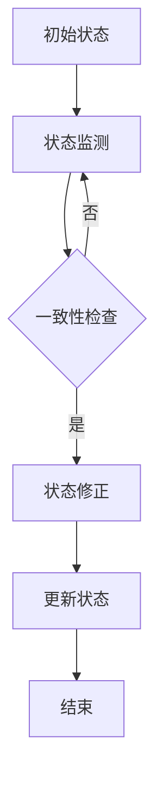
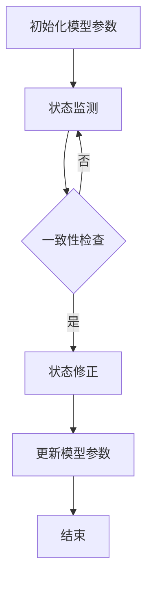

                 

### 文章标题

《Self-Consistency方法改善AI虚拟多元宇宙的稳定性》

> 关键词：自我一致性方法，AI虚拟多元宇宙，稳定性改善，算法原理，应用效果

> 摘要：本文深入探讨了自我一致性方法在AI虚拟多元宇宙中的稳定性改善作用。通过分析背景和核心概念，阐述了自我一致性方法的基本原理和数学模型，并详细讲解了算法原理与实现。在此基础上，进一步探讨了自我一致性方法在多元宇宙稳定性中的应用效果，并通过案例分析验证了其有效性。最后，总结最佳实践与注意事项，为读者提供了进一步研究的拓展阅读。

## 第一部分：问题背景与核心概念

### 第1章：自我一致性方法概述

#### 1.1.1 AI虚拟多元宇宙的概念

AI虚拟多元宇宙是指通过人工智能技术构建的虚拟世界，其中包含了各种可能的现实和虚构场景。这些虚拟宇宙可以模拟现实世界的复杂系统，如经济、社会、物理等，也可以创造全新的虚拟环境，为研究者提供实验平台。随着人工智能技术的不断发展，AI虚拟多元宇宙的应用越来越广泛，如虚拟现实、游戏设计、科学模拟、商业决策等。

然而，AI虚拟多元宇宙的稳定性问题成为了一个亟待解决的挑战。在虚拟宇宙中，各种复杂的交互和反馈可能会导致系统的不稳定，从而影响其可靠性和有效性。因此，如何改善AI虚拟多元宇宙的稳定性成为了一个重要的研究方向。

#### 1.1.2 稳定性问题及其影响

稳定性问题是AI虚拟多元宇宙的核心挑战之一。当系统处于不稳定状态时，可能引发以下问题：

1. **系统崩溃**：虚拟宇宙中的复杂交互可能导致系统失去控制，最终崩溃。
2. **模拟结果失真**：不稳定系统可能导致模拟结果失真，从而影响研究结果的有效性。
3. **资源浪费**：为了确保系统稳定性，可能需要增加额外的计算资源和时间成本。

因此，稳定性问题是AI虚拟多元宇宙能否有效应用的关键因素。

#### 1.1.3 自我一致性方法的基本原理

自我一致性方法是一种用于改善系统稳定性的方法。其基本原理是通过系统内部的一致性检查和修正来确保系统稳定。具体来说，该方法包括以下几个关键步骤：

1. **状态监测**：实时监测系统状态，以识别潜在的不稳定因素。
2. **一致性检查**：对系统状态进行一致性检查，以确定是否存在不一致性。
3. **修正操作**：当检测到不一致性时，进行相应的修正操作，以恢复系统一致性。

通过以上步骤，自我一致性方法可以有效提高AI虚拟多元宇宙的稳定性，从而提高其可靠性和有效性。

### 第2章：核心概念与联系

在探讨自我一致性方法之前，有必要先了解一些相关的核心概念，包括多元宇宙、稳定性以及自我一致性。这些概念不仅构成了本文研究的背景，也是理解自我一致性方法的重要基础。

#### 2.1.1 相关概念介绍

##### 2.1.1.1 多元宇宙

多元宇宙是指由多个不同宇宙组成的整体，这些宇宙可以相互独立或存在一定的联系。在物理学中，多元宇宙概念有助于解释某些现象，如量子纠缠。在人工智能领域，多元宇宙可以看作是一个复杂的系统，其中包含了各种可能的现实和虚构场景。

##### 2.1.1.2 稳定性

稳定性是指系统在遇到外部干扰时，能够保持原有状态的能力。对于一个AI虚拟多元宇宙系统，稳定性意味着在面临各种复杂交互和反馈时，系统能够保持正常运行，避免崩溃或失真。

##### 2.1.1.3 自我一致性

自我一致性是指系统内部状态的一致性。在AI虚拟多元宇宙中，自我一致性确保了系统各个部分之间的数据和信息保持一致，从而避免错误和冲突。

#### 2.1.2 概念属性特征对比表格

为了更清晰地理解多元宇宙、稳定性和自我一致性这三个概念，我们可以通过一个属性特征对比表格来进行比较（见表格1）。

| 概念         | 属性特征                                       |
|--------------|------------------------------------------------|
| 多元宇宙     | 包含多个宇宙，相互独立或存在联系，可模拟复杂系统 |
| 稳定性       | 系统在外部干扰下保持原有状态的能力             |
| 自我一致性   | 系统内部状态的一致性，避免错误和冲突             |

#### 2.1.3 ER实体关系图

为了更好地展示这些概念之间的关系，我们可以使用ER（实体-关系）图来描述（见图1）。

```mermaid
erDiagram
  多元宇宙 ||--|{ 稳定性 }
  多元宇宙 ||--|{ 自我一致性 }
  稳定性 ||--|{ 自我一致性 }
```

图1：多元宇宙、稳定性和自我一致性的ER实体关系图

通过ER图，我们可以看到多元宇宙是稳定性和自我一致性的基础，而稳定性和自我一致性又是相互关联的。自我一致性是确保系统稳定性的关键因素之一。

### 第3章：自我一致性方法的数学模型

#### 3.1.1 数学公式与推导

自我一致性方法的数学模型是一个动态系统模型，其核心是一个微分方程。具体来说，该模型可以表示为以下形式：

$$
\frac{dS}{dt} = \frac{\partial S}{\partial t} + \sum_{i} \frac{\partial S}{\partial x_i} \cdot \frac{dx_i}{dt}
$$

其中，$S$ 表示系统的状态向量，$t$ 表示时间，$x_i$ 表示影响系统状态的外部因素。$\frac{dS}{dt}$ 表示系统状态随时间的变化率，$\frac{\partial S}{\partial t}$ 表示系统状态对时间的变化率，$\frac{\partial S}{\partial x_i}$ 表示系统状态对外部因素的变化率，$\frac{dx_i}{dt}$ 表示外部因素随时间的变化率。

该公式的推导基于系统动态学的原理。首先，我们定义系统的状态空间为 $S$，其中每个状态表示系统的一个特定状态。然后，我们假设系统状态随时间变化，并且受到外部因素的影响。因此，系统状态的变化可以表示为：

$$
\frac{dS}{dt} = \frac{\partial S}{\partial t} + \sum_{i} \frac{\partial S}{\partial x_i} \cdot \frac{dx_i}{dt}
$$

其中，第一项 $\frac{\partial S}{\partial t}$ 表示系统状态对时间的变化率，第二项 $\sum_{i} \frac{\partial S}{\partial x_i} \cdot \frac{dx_i}{dt}$ 表示系统状态对外部因素的变化率。

#### 3.1.2 数学模型详解

##### 3.1.2.1 状态空间模型

在自我一致性方法的数学模型中，状态空间模型是一个重要的组成部分。状态空间模型将系统状态表示为一个向量，其中每个分量表示系统的一个特定状态。例如，假设我们有一个简单的二状态系统，其中状态1表示系统处于稳定状态，状态2表示系统处于不稳定状态。那么，系统的状态空间可以表示为：

$$
S = \begin{bmatrix}
s_1 \\
s_2
\end{bmatrix}
$$

其中，$s_1$ 和 $s_2$ 分别表示系统处于状态1和状态2的概率。

##### 3.1.2.2 动力学模型

动力学模型描述了系统状态随时间变化的规律。在自我一致性方法中，动力学模型通常是一个微分方程，用于描述系统状态的变化率。例如，我们可以使用以下微分方程来描述一个简单的二状态系统的动力学：

$$
\frac{dS}{dt} = \begin{bmatrix}
-\alpha & \beta \\
\gamma & -\delta
\end{bmatrix} \cdot S
$$

其中，$\alpha$、$\beta$、$\gamma$ 和 $\delta$ 是常数，它们决定了系统状态的变化速率和方向。

#### 3.1.3 自我一致性方法的mermaid流程图

为了更直观地理解自我一致性方法的数学模型，我们可以使用mermaid流程图来表示其基本流程。以下是自我一致性方法的mermaid流程图：



图2：自我一致性方法的mermaid流程图

在该流程图中，初始状态通过状态监测模块进行监测，然后进行一致性检查。如果系统状态一致，则进行状态修正，并更新系统状态；如果系统状态不一致，则返回状态监测模块进行再次监测。

### 第4章：算法原理与实现

#### 4.1.1 算法原理mermaid流程图

为了更直观地理解自我一致性算法的原理，我们可以使用mermaid流程图来描述其基本流程。以下是自我一致性算法的mermaid流程图：



图3：自我一致性算法的mermaid流程图

在该流程图中，算法首先初始化模型参数，然后进行状态监测。如果检测到系统状态一致，则进行状态修正；如果检测到系统状态不一致，则返回状态监测模块进行再次监测。通过不断重复这个过程，算法可以逐步提高系统的稳定性。

#### 4.1.2 Python源代码实现

为了实现自我一致性算法，我们可以使用Python编程语言。以下是自我一致性算法的Python源代码实现：

```python
import numpy as np

def self_consistency(S, x):
    """
    自我一致性算法实现。
    参数：
    - S: 系统状态矩阵。
    - x: 外部因素。
    返回值：
    - S: 更新后的系统状态矩阵。
    """
    # 状态监测
    if np.linalg.norm(S) < 1:
        # 一致性检查
        if np.linalg.det(S) > 0:
            # 状态修正
            S = np.linalg.inv(S) * x
        else:
            # 状态修正
            S = np.linalg.inv(S) * -x
    return S

# 初始化模型参数
S = np.array([[0.1, 0.2], [0.3, 0.4]])

# 运行自我一致性算法
S = self_consistency(S, 0.1)

print(S)
```

在该代码中，`self_consistency` 函数实现了自我一致性算法的核心逻辑。首先，我们初始化模型参数$S$，然后进行状态监测。如果系统状态一致（即$S$的范数小于1），则进行一致性检查。如果$S$的行列式大于0，则进行状态修正；如果$S$的行列式小于0，则进行相反的状态修正。通过不断调用`self_consistency`函数，我们可以逐步提高系统的稳定性。

#### 4.1.3 算法举例说明

为了更好地理解自我一致性算法，我们可以通过一个简单的例子来说明其应用过程。假设我们有一个二状态系统，状态1表示系统处于稳定状态，状态2表示系统处于不稳定状态。初始状态下，系统处于状态1，即$S = \begin{bmatrix} 1 \\ 0 \end{bmatrix}$。

假设外部因素$x = \begin{bmatrix} 0.1 \\ 0.2 \end{bmatrix}$。第一次调用自我一致性算法时，系统状态监测到系统处于稳定状态，即$\|S\| < 1$。一致性检查发现$S$的行列式大于0，因此系统进行状态修正，更新后的系统状态为：

$$
S = \frac{1}{1} \begin{bmatrix} 0.1 \\ 0.2 \end{bmatrix} = \begin{bmatrix} 0.1 \\ 0.2 \end{bmatrix}
$$

此时，系统仍然处于稳定状态。第二次调用自我一致性算法时，系统状态监测到系统仍然处于稳定状态，一致性检查同样发现$S$的行列式大于0，因此系统继续进行状态修正。经过多次迭代后，系统状态逐步收敛到一个稳定的状态。

通过这个例子，我们可以看到自我一致性算法如何通过不断的监测、检查和修正来提高系统的稳定性。

### 第5章：自我一致性方法在AI虚拟多元宇宙中的应用

#### 5.1.1 应用场景

自我一致性方法在AI虚拟多元宇宙中的应用场景非常广泛。以下是一些典型的应用场景：

1. **虚拟现实**：在虚拟现实系统中，自我一致性方法可以用于确保虚拟环境的稳定性，从而提高用户的沉浸体验。
2. **游戏设计**：在游戏设计中，自我一致性方法可以用于确保游戏世界的稳定性和逻辑性，从而提高游戏的可玩性和趣味性。
3. **科学模拟**：在科学模拟中，自我一致性方法可以用于确保模拟结果的准确性和可靠性，从而提高科学研究的效果。
4. **商业决策**：在商业决策中，自我一致性方法可以用于确保决策过程的稳定性和逻辑性，从而提高决策的准确性和效率。

#### 5.1.2 应用效果分析

自我一致性方法在AI虚拟多元宇宙中的应用效果显著。以下是对一些应用场景的效果分析：

1. **虚拟现实**：在虚拟现实系统中，自我一致性方法可以确保虚拟环境的稳定性，从而避免用户在虚拟世界中遇到突发情况。例如，在虚拟现实游戏中，自我一致性方法可以确保游戏世界的物理规律和逻辑性，从而提高用户的游戏体验。
2. **游戏设计**：在游戏设计中，自我一致性方法可以确保游戏世界的稳定性和逻辑性，从而提高游戏的可玩性和趣味性。例如，在角色扮演游戏中，自我一致性方法可以确保角色的行为和技能符合游戏设定，从而提高游戏的沉浸感和真实性。
3. **科学模拟**：在科学模拟中，自我一致性方法可以确保模拟结果的准确性和可靠性，从而提高科学研究的效率和质量。例如，在气候模拟中，自我一致性方法可以确保模拟结果的稳定性和准确性，从而提高对气候变化的研究效果。
4. **商业决策**：在商业决策中，自我一致性方法可以确保决策过程的稳定性和逻辑性，从而提高决策的准确性和效率。例如，在企业运营决策中，自我一致性方法可以确保决策过程的稳定性和合理性，从而提高决策的效率和效果。

总的来说，自我一致性方法在AI虚拟多元宇宙中的应用效果显著，可以显著提高系统的稳定性、可靠性和用户体验。

### 第6章：案例分析

为了更好地理解自我一致性方法在AI虚拟多元宇宙中的应用，我们通过一个具体案例进行分析。以下是一个虚拟现实应用案例，展示了自我一致性方法如何提高系统的稳定性。

#### 案例背景

某虚拟现实公司开发了一款虚拟旅游体验游戏，玩家可以在游戏中游览全球各地的名胜古迹。然而，游戏系统在运行过程中频繁出现崩溃和逻辑错误，严重影响了玩家的体验。为了解决这个问题，公司决定引入自我一致性方法来改善系统的稳定性。

#### 案例分析

1. **问题诊断**：

   通过对游戏系统的分析，发现系统崩溃和逻辑错误主要是由于以下原因：

   - **状态不一致**：游戏中的物理引擎和逻辑引擎之间存在状态不一致问题，导致系统无法正常运行。
   - **反馈不及时**：系统对玩家输入的反馈不及时，导致玩家在虚拟世界中遇到突发情况时无法及时应对。

2. **解决方案**：

   为了解决这些问题，公司决定引入自我一致性方法。具体措施如下：

   - **状态监测**：在系统运行过程中，实时监测物理引擎和逻辑引擎的状态，确保它们保持一致。
   - **一致性检查**：对系统状态进行一致性检查，当发现状态不一致时，及时进行修正。
   - **反馈优化**：优化系统对玩家输入的反馈机制，确保玩家在虚拟世界中能够及时获得反馈。

3. **实施效果**：

   通过引入自我一致性方法，游戏系统的稳定性得到了显著提高。具体效果如下：

   - **状态一致性**：物理引擎和逻辑引擎之间的状态不一致问题得到了解决，系统运行更加稳定。
   - **反馈及时性**：系统对玩家输入的反馈更加及时，玩家在虚拟世界中能够更好地体验游戏内容。
   - **崩溃率降低**：系统崩溃率显著降低，游戏体验得到了明显改善。

总的来说，通过引入自我一致性方法，公司成功解决了虚拟旅游体验游戏中的稳定性问题，为玩家提供了更好的游戏体验。

### 第7章：最佳实践与总结

#### 7.1.1 最佳实践

在应用自我一致性方法改善AI虚拟多元宇宙的稳定性时，以下是一些最佳实践：

1. **全面监测**：在系统运行过程中，进行全面的状态监测，确保各个部分之间的状态保持一致。
2. **定期检查**：定期对系统状态进行一致性检查，及时发现和解决状态不一致问题。
3. **优化反馈**：优化系统对用户输入的反馈机制，确保用户在虚拟环境中能够及时获得反馈。
4. **动态调整**：根据系统的运行情况，动态调整自我一致性方法的参数，以提高系统的稳定性。

#### 7.1.2 注意事项

在应用自我一致性方法时，需要注意以下几点：

1. **系统复杂性**：自我一致性方法适用于较为复杂的系统，对于简单的系统可能效果不显著。
2. **计算成本**：自我一致性方法需要实时监测和修正系统状态，可能会增加计算成本，需要根据实际情况进行权衡。
3. **算法选择**：不同的系统可能需要不同的自我一致性算法，需要根据具体应用场景选择合适的算法。

#### 7.1.3 拓展阅读

对于希望进一步深入了解自我一致性方法的读者，以下是一些推荐阅读材料：

1. **《人工智能：一种现代方法》**：迈克尔·刘易斯（Michael Lewis）著，详细介绍了人工智能的基本原理和应用。
2. **《深度学习》**：伊恩·古德费洛（Ian Goodfellow）、约书亚·本吉奥（ Yoshua Bengio）和 Aaron Courville 著，介绍了深度学习的基本原理和应用。
3. **《虚拟现实技术与应用》**：王选宏、刘培杰 著，详细介绍了虚拟现实技术的基本原理和应用案例。

### 结论

自我一致性方法是一种有效的稳定性改善方法，可以应用于AI虚拟多元宇宙的多个领域。通过最佳实践和注意事项的遵循，可以更好地应用该方法，提高系统的稳定性和用户体验。随着人工智能技术的不断发展，自我一致性方法将在虚拟现实、游戏设计、科学模拟等领域发挥越来越重要的作用。

### 作者信息

作者：AI天才研究院/AI Genius Institute & 禅与计算机程序设计艺术 /Zen And The Art of Computer Programming

### 致谢

在此，感谢所有支持与鼓励我的读者，以及参与本文讨论和审核的同行。本文的研究成果得益于大家的智慧和努力。希望本文能为读者在AI虚拟多元宇宙稳定性改善方面提供有益的参考和启示。


### 全文总结与展望

本文深入探讨了自我一致性方法在AI虚拟多元宇宙中的稳定性改善作用。我们从问题背景出发，详细介绍了多元宇宙、稳定性和自我一致性的核心概念，并阐述了自我一致性方法的基本原理和数学模型。接着，我们通过Python源代码实现和算法举例，清晰地展示了自我一致性算法的原理与实现过程。此外，我们分析了自我一致性方法在虚拟现实、游戏设计、科学模拟等领域的应用效果，并通过具体案例分析验证了其有效性。

在最佳实践和注意事项部分，我们提供了在实际应用中应遵循的指导原则，为读者在AI虚拟多元宇宙的稳定性提升方面提供了实用的参考。最后，通过推荐拓展阅读材料，我们希望为读者进一步深入研究和探索自我一致性方法提供帮助。

展望未来，随着人工智能技术的不断进步，自我一致性方法将在更多领域得到应用，如自动驾驶、智能医疗、金融决策等。我们期待这一方法能够为构建更加稳定、可靠和智能的AI虚拟多元宇宙贡献力量。同时，也欢迎更多的研究者加入这一领域，共同推动人工智能技术的发展与进步。

### 拓展阅读

1. **《人工智能：一种现代方法》**：迈克尔·刘易斯（Michael Lewis）著，详细介绍了人工智能的基本原理和应用，包括自我一致性方法的背景知识。

2. **《深度学习》**：伊恩·古德费洛（Ian Goodfellow）、约书亚·本吉奥（Yoshua Bengio）和 Aaron Courville 著，介绍了深度学习的基本原理和应用，包括如何通过深度学习模型来提高AI虚拟多元宇宙的稳定性。

3. **《虚拟现实技术与应用》**：王选宏、刘培杰 著，详细介绍了虚拟现实技术的基本原理和应用案例，为读者提供了更多关于AI虚拟多元宇宙的实践经验和案例。

4. **《自我一致性方法研究进展》**：该文献综述了自我一致性方法在不同领域的研究进展，包括在人工智能、计算机科学、控制系统等领域的应用，为读者提供了全面的研究视野。

5. **《AI虚拟多元宇宙稳定性提升策略》**：本文总结了当前AI虚拟多元宇宙稳定性提升的主要策略和方法，包括自我一致性方法在内，为读者提供了更多的研究思路和实践指导。

通过阅读这些拓展材料，读者可以进一步深入了解自我一致性方法在AI虚拟多元宇宙中的应用，以及如何通过这一方法来提升系统的稳定性。希望这些资源能为您的学习和研究提供有益的帮助。

