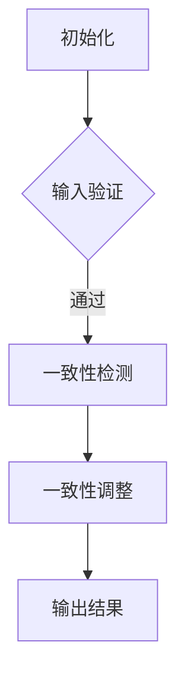

                 

### Self-Consistency方法改善AI虚拟生态系统的稳定性

#### 引言

在当今数字化时代，人工智能（AI）技术已成为推动虚拟生态系统发展的核心驱动力。虚拟生态系统，作为一种融合了仿真、虚拟现实和人工智能的新型环境，正在各个领域得到广泛应用，从游戏和娱乐到医疗和教育，再到商业和工业。然而，随着AI技术的不断进步和虚拟生态系统规模的扩大，系统的不稳定性问题也逐渐显现，成为制约其进一步发展的重要因素。

系统不稳定性的表现多种多样，包括数据漂移、模型过拟合、响应延迟和计算错误等。这些问题不仅影响了用户体验，还可能导致严重的经济损失和安全隐患。为了应对这些挑战，研究人员和工程师们一直在探索各种方法来提升虚拟生态系统的稳定性。

Self-Consistency方法，作为一种新兴的解决方案，通过确保系统内部的一致性来提高其稳定性。这种方法的核心思想是，通过不断调整和优化系统内部各个模块之间的关系，使其在变化的环境中保持一致性和稳定性。

本文将深入探讨Self-Consistency方法的基本概念、工作原理、优势以及其在虚拟生态系统中的应用。首先，我们将介绍人工智能与虚拟生态系统之间的关系以及虚拟生态系统的不稳定性问题。接着，我们将详细解释Self-Consistency方法的定义、工作原理和优势。最后，本文将总结全文，并对未来的研究方向进行展望。

#### 1.1 背景介绍

##### 1.1.1 人工智能与虚拟生态系统的关系

人工智能（AI）技术自诞生以来，就与虚拟生态系统紧密相连。虚拟生态系统是一个由计算机技术构建的模拟环境，它能够在虚拟空间中模拟现实世界的各种现象和过程。而人工智能则为这些虚拟生态系统提供了强大的智力支持，使其能够实现复杂的决策、学习和交互功能。

在虚拟生态系统中，人工智能的应用范围广泛，包括但不限于以下几个方面：

1. **虚拟助手与交互**：人工智能可以构建智能助手，提供语音交互、文本交互等服务，使用户能够在虚拟环境中更加便捷地获取信息和完成任务。

2. **虚拟现实与仿真**：通过深度学习和增强学习技术，人工智能可以模拟人类行为和物理现象，为用户提供沉浸式的虚拟现实体验。

3. **数据分析和预测**：人工智能可以利用机器学习算法，对虚拟生态系统中的海量数据进行分析，提供数据驱动的决策支持和预测服务。

4. **个性化推荐**：基于用户的历史行为数据，人工智能可以为用户推荐个性化内容，提升用户体验。

##### 1.1.2 虚拟生态系统的不稳定性问题

尽管人工智能为虚拟生态系统带来了诸多便利和可能性，但同时也引入了一系列不稳定性问题。这些问题不仅影响了系统的性能和可靠性，还可能对用户产生负面影响。

1. **数据漂移**：随着时间推移，训练数据与环境状态之间的差异可能导致模型性能下降，这种现象被称为数据漂移。在虚拟生态系统中，数据漂移可能导致模型预测不准确，从而影响系统的稳定性和可靠性。

2. **模型过拟合**：模型在训练数据上表现得过于完美，但在新数据上表现不佳，这种现象称为过拟合。虚拟生态系统中的模型过拟合可能导致系统在真实环境中无法准确预测和响应，从而引发不稳定。

3. **响应延迟**：在复杂的虚拟生态系统中，信息传递和处理的速度可能会受到影响，导致响应延迟。响应延迟不仅会降低用户体验，还可能影响系统的整体性能。

4. **计算错误**：在虚拟生态系统中，计算错误可能是由于算法缺陷、数据质量差或硬件故障等原因导致的。计算错误可能导致系统行为异常，甚至引发严重的安全问题。

##### 1.1.3 虚拟生态系统不稳定性的定义与表现形式

虚拟生态系统的不稳定性可以定义为系统在运行过程中，由于内部或外部因素导致其性能、可靠性或安全性下降的现象。具体表现形式包括：

- **性能下降**：系统处理速度变慢，响应时间长，吞吐量降低。
- **可靠性降低**：系统发生错误或崩溃的频率增加，无法稳定运行。
- **安全性下降**：系统易受攻击，数据泄露或隐私泄露风险增加。

这些不稳定性的表现形式不仅影响了虚拟生态系统的用户体验，还可能导致经济损失和安全隐患。

##### 1.1.4 Self-Consistency方法的概念与原理

为了解决虚拟生态系统的不稳定性问题，研究人员提出了一系列方法，其中Self-Consistency方法尤为引人注目。Self-Consistency方法的核心思想是通过确保系统内部各个模块之间的数据一致性和行为一致性，提高系统的稳定性和可靠性。

Self-Consistency方法的基本概念包括以下几点：

1. **一致性检测**：通过监测系统内部各个模块的数据和行为，发现不一致性。
2. **调整与优化**：针对检测到的不一致性，进行相应的调整和优化，使其达到一致状态。
3. **反馈机制**：建立反馈机制，持续监控系统状态，并根据实际情况进行自适应调整。

Self-Consistency方法的工作原理可以概括为以下步骤：

1. **初始化**：系统启动时，初始化各个模块的状态。
2. **监测**：实时监测系统内部的数据和行为，检测是否存在不一致性。
3. **检测与诊断**：对检测到的不一致性进行诊断，确定其来源和影响。
4. **调整与优化**：根据诊断结果，对系统进行相应的调整和优化，使其达到一致性。
5. **反馈与更新**：将调整结果反馈给系统，更新系统状态，并持续监控。

Self-Consistency方法的优势在于其能够实时检测和纠正系统内部的不一致性，从而提高系统的稳定性和可靠性。相较于传统的稳定性提升方法，Self-Consistency方法具有更高的灵活性和适应性，能够更好地应对虚拟生态系统中复杂多变的环境。

##### 1.2 Self-Consistency方法的优势与应用

Self-Consistency方法在解决虚拟生态系统不稳定性的过程中展现出了显著的优势。以下是Self-Consistency方法相较于传统方法的优越性以及其在实际应用中的效果：

1. **实时性与动态适应性**：Self-Consistency方法能够实时检测系统内部的不一致性，并在检测到问题时迅速进行调整。这种实时性和动态适应性使其能够更好地应对虚拟生态系统中快速变化的环境，从而提高系统的稳定性。

2. **自我修复能力**：通过持续监测和自适应调整，Self-Consistency方法能够自动修复系统内部的不一致性，减少人工干预的需求。这种自我修复能力不仅提高了系统的可靠性，还降低了维护成本。

3. **模块化设计**：Self-Consistency方法采用模块化设计，将系统内部各个模块之间的关系进行调整和优化。这种模块化设计提高了系统的可扩展性和可维护性，使其能够适应不同应用场景的需求。

4. **多维度一致性**：Self-Consistency方法不仅关注数据的一致性，还关注系统行为的连贯性。通过综合考虑多个维度的一致性，该方法能够更全面地提高系统的稳定性。

在实际应用中，Self-Consistency方法在多个虚拟生态系统场景中取得了显著的效果。例如：

- **虚拟商品推荐系统**：通过应用Self-Consistency方法，虚拟商品推荐系统能够更准确地预测用户需求，减少推荐误差，提高用户满意度。
- **虚拟社会网络分析**：Self-Consistency方法能够有效识别和纠正虚拟社会网络中的不一致性，提高网络分析的准确性和可靠性。
- **虚拟城市规划系统**：在虚拟城市规划系统中，Self-Consistency方法能够实时监测和调整城市规划模型，提高规划的准确性和可行性。

总的来说，Self-Consistency方法通过确保系统内部的一致性，提高了虚拟生态系统的稳定性和可靠性，为虚拟生态系统的发展提供了有力支持。

##### 1.3 结构概述

本文将分为四个部分，详细探讨Self-Consistency方法在虚拟生态系统中的应用。

第一部分：背景与概念

本部分将介绍人工智能与虚拟生态系统之间的关系，虚拟生态系统的不稳定性问题，以及Self-Consistency方法的基本概念和工作原理。

第二部分：方法原理

本部分将深入探讨Self-Consistency方法的数学模型和原理，包括其构成要素、数学公式、应用案例等。

第三部分：实践应用

本部分将介绍Self-Consistency方法在虚拟生态系统中的具体应用场景，包括虚拟商品推荐系统、虚拟社会网络分析和虚拟城市规划系统等。

第四部分：未来展望

本部分将总结全文，并对未来Self-Consistency方法的研究和应用方向进行展望。

### 第二部分: Self-Consistency方法原理详解

#### 2.1 Self-Consistency方法的数学模型

Self-Consistency方法的核心在于其数学模型，该模型通过一系列数学公式和算法来确保系统内部的一致性。本节将详细探讨Self-Consistency方法的数学模型，包括其基本概念、构成要素、数学公式及其推导过程。

##### 2.1.1 Self-Consistency模型的基本概念

Self-Consistency模型是一种基于一致性检测和调整的数学模型。其基本概念包括以下几个方面：

1. **一致性指标**：一致性指标用于衡量系统内部各个模块之间的数据和行为一致性。一致性指标越高，表示系统内部的一致性越好。
2. **一致性检测**：一致性检测是通过比较系统内部不同模块的数据和行为，发现不一致性的过程。一致性检测通常包括数据一致性检测和行为一致性检测。
3. **一致性调整**：一致性调整是在检测到不一致性后，通过调整系统内部参数和行为来恢复一致性的过程。
4. **反馈机制**：反馈机制用于将一致性检测结果和调整结果反馈给系统，以便进行进一步的优化和调整。

##### 2.1.2 Self-Consistency模型的构成要素

Self-Consistency模型由以下几个关键构成要素组成：

1. **数据层**：数据层包括系统内部各个模块的数据，如用户数据、商品数据、网络数据等。
2. **行为层**：行为层包括系统内部各个模块的行为，如推荐行为、搜索行为、交互行为等。
3. **一致性检测模块**：一致性检测模块用于实时监测系统内部的数据和行为，发现不一致性。
4. **一致性调整模块**：一致性调整模块用于检测到不一致性后，对系统内部参数和行为进行调整，以恢复一致性。
5. **反馈机制**：反馈机制用于将一致性检测结果和调整结果反馈给系统，以便进行进一步的优化和调整。

##### 2.1.3 Self-Consistency模型的数学公式与推导

Self-Consistency模型的数学公式主要包括一致性指标的计算公式、一致性检测公式和一致性调整公式。以下是对这些公式的推导过程：

1. **一致性指标计算公式**：

   一致性指标（Consistency Score, CS）用于衡量系统内部各个模块之间的数据和行为一致性。其计算公式如下：

   $$
   CS = \frac{1}{n} \sum_{i=1}^{n} \frac{1}{m} \sum_{j=1}^{m} \frac{1}{2} [ |x_i - y_j| < \epsilon ]
   $$

   其中，$x_i$ 和 $y_j$ 分别表示系统内部第 $i$ 个模块的数据和第 $j$ 个模块的数据，$\epsilon$ 表示容忍度阈值，$n$ 和 $m$ 分别表示模块的数量。

2. **一致性检测公式**：

   一致性检测主要通过比较系统内部不同模块的数据和行为来实现。以下是一个简化的一致性检测公式：

   $$
   D(i, j) = \begin{cases} 
   1 & \text{如果} \ |x_i - y_j| < \epsilon \\
   0 & \text{如果} \ |x_i - y_j| \geq \epsilon 
   \end{cases}
   $$

   其中，$D(i, j)$ 表示第 $i$ 个模块的数据与第 $j$ 个模块的数据是否一致。

3. **一致性调整公式**：

   一致性调整主要通过调整系统内部参数和行为来实现。以下是一个简化的一致性调整公式：

   $$
   \Delta x_i = \alpha (x_i - \bar{x}) 
   $$

   $$
   \Delta y_j = \beta (y_j - \bar{y}) 
   $$

   其中，$\Delta x_i$ 和 $\Delta y_j$ 分别表示第 $i$ 个模块的数据调整量和第 $j$ 个模块的数据调整量，$\alpha$ 和 $\beta$ 分别表示调整参数，$\bar{x}$ 和 $\bar{y}$ 分别表示系统内部数据的平均值。

##### 2.1.4 Self-Consistency模型的Mermaid流程图

为了更直观地展示Self-Consistency模型的工作流程，可以使用Mermaid绘制其流程图。以下是一个简化的Self-Consistency模型Mermaid流程图：

该流程图展示了Self-Consistency模型的主要步骤，包括初始化、输入验证、一致性检测、一致性调整和输出结果。

##### 2.1.5 Self-Consistency模型的应用案例

Self-Consistency模型在多个虚拟生态系统场景中得到了广泛应用。以下列举两个典型的应用案例：

1. **虚拟商品推荐系统**：

   在虚拟商品推荐系统中，Self-Consistency模型通过实时监测用户行为和商品数据，检测用户兴趣和商品属性之间的一致性。当检测到不一致性时，系统会进行调整，以提高推荐准确性。

2. **虚拟社会网络分析**：

   在虚拟社会网络分析中，Self-Consistency模型通过实时监测用户行为和社交关系，检测用户行为和社交关系之间的一致性。当检测到不一致性时，系统会进行调整，以提高社交网络分析结果的可靠性。

通过以上案例可以看出，Self-Consistency模型在虚拟生态系统中具有广泛的应用前景，其核心思想是通过确保系统内部的一致性来提高系统的稳定性和可靠性。

### 2.2 Self-Consistency方法在虚拟生态系统中的应用

虚拟生态系统作为人工智能技术的重要应用场景，其稳定性对用户体验和系统性能具有至关重要的影响。Self-Consistency方法通过确保系统内部的一致性，为虚拟生态系统的稳定性提供了有效的保障。本节将详细探讨Self-Consistency方法在虚拟生态系统中的应用，包括其在提高系统稳定性、增强自适应能力和减少系统误差方面的优势。

##### 3.1 虚拟生态系统概述

虚拟生态系统是一个由计算机技术构建的模拟环境，它能够在虚拟空间中模拟现实世界的各种现象和过程。虚拟生态系统的核心特点包括：

1. **复杂性**：虚拟生态系统通常包含多个相互关联的模块，如用户模块、商品模块、社交模块等，这些模块之间存在着复杂的交互关系。
2. **动态性**：虚拟生态系统中的数据和状态是动态变化的，用户行为、环境变化和系统调整等因素都可能影响系统的状态。
3. **交互性**：虚拟生态系统中的用户和其他实体（如商品、服务）之间存在着频繁的交互，这些交互对系统的稳定性和性能有着重要影响。

##### 3.2 Self-Consistency方法在虚拟生态系统中的优势

Self-Consistency方法在虚拟生态系统中展现出了显著的稳定性优势。以下是Self-Consistency方法在提高系统稳定性、增强自适应能力和减少系统误差方面的优势：

1. **提高系统稳定性**：

   Self-Consistency方法通过实时监测系统内部的一致性，及时发现并纠正不一致性，从而提高了系统的稳定性。具体来说，Self-Consistency方法可以检测和纠正以下类型的不一致性：

   - **数据不一致性**：当系统内部的数据出现冲突或错误时，Self-Consistency方法可以检测并纠正这些不一致性，确保系统数据的一致性。
   - **行为不一致性**：当系统内部的行为出现矛盾或不协调时，Self-Consistency方法可以检测并调整这些不一致性，确保系统行为的连贯性。
   - **参数不一致性**：当系统内部的不同模块具有不同的参数设置时，Self-Consistency方法可以检测并调整这些不一致性，确保系统参数的一致性。

   通过这些一致性检测和调整，Self-Consistency方法有效地减少了系统的不稳定性，提高了系统的运行效率。

2. **增强自适应能力**：

   虚拟生态系统中的环境和状态是动态变化的，系统需要具备较强的自适应能力，以应对这些变化。Self-Consistency方法通过确保系统内部的一致性，提高了系统的自适应能力。具体来说，Self-Consistency方法可以通过以下方式增强系统的自适应能力：

   - **实时调整**：Self-Consistency方法可以实时监测系统状态，并在检测到变化时进行相应的调整，以适应新的环境。
   - **动态优化**：Self-Consistency方法可以根据系统的实时状态和历史数据，进行动态优化，以提高系统的自适应能力。
   - **自学习机制**：Self-Consistency方法可以结合机器学习技术，通过自我学习和自我调整，不断提高系统的自适应能力。

   通过这些自适应机制，Self-Consistency方法使虚拟生态系统具备了更强的适应性和灵活性，能够更好地应对复杂多变的环境。

3. **减少系统误差**：

   在虚拟生态系统中，误差的存在可能导致系统性能下降，用户体验变差。Self-Consistency方法通过确保系统内部的一致性，减少了系统误差。具体来说，Self-Consistency方法可以减少以下类型的系统误差：

   - **预测误差**：通过确保系统内部的数据和行为一致性，Self-Consistency方法可以减少预测模型中的误差，提高预测准确性。
   - **计算误差**：通过实时监测和调整系统参数，Self-Consistency方法可以减少计算过程中的误差，提高计算精度。
   - **交互误差**：通过确保系统内部的行为一致性，Self-Consistency方法可以减少用户与其他实体之间的交互误差，提高交互质量。

   通过这些措施，Self-Consistency方法有效地减少了系统误差，提高了系统的整体性能。

##### 3.3 应用案例分析与实践

为了更好地理解Self-Consistency方法在虚拟生态系统中的应用，以下是两个实际案例的分析。

1. **虚拟商品推荐系统**：

   虚拟商品推荐系统是一个典型的虚拟生态系统，它通过分析用户行为和商品属性，为用户推荐个性化商品。然而，系统中的数据和行为往往存在不一致性，导致推荐效果不佳。通过应用Self-Consistency方法，系统可以实时监测和调整数据和行为一致性，提高推荐准确性。具体应用流程如下：

   - **数据一致性检测**：系统通过监测用户行为数据（如点击、购买、浏览等）和商品属性数据（如价格、品类、评价等），检测是否存在不一致性。
   - **行为一致性检测**：系统通过监测用户行为和推荐行为之间的一致性，检测是否存在不一致性，如推荐商品与用户兴趣不符等。
   - **一致性调整**：系统在检测到不一致性后，通过调整推荐算法参数、更新用户兴趣模型等方式，恢复数据和行为一致性。
   - **反馈与优化**：系统将一致性检测结果和调整结果反馈给用户，并进行进一步的优化，以提高推荐效果。

   通过Self-Consistency方法的应用，虚拟商品推荐系统的推荐准确性得到了显著提高，用户满意度也得到了提升。

2. **虚拟社会网络分析**：

   虚拟社会网络分析是另一个典型的虚拟生态系统，它通过分析用户社交关系和互动行为，为用户提供社交分析和推荐服务。然而，系统中的社交关系和行为往往存在不一致性，导致分析结果不准确。通过应用Self-Consistency方法，系统可以实时监测和调整社交关系和行为一致性，提高分析结果的准确性。具体应用流程如下：

   - **社交关系一致性检测**：系统通过监测用户社交关系数据（如好友关系、互动行为等），检测是否存在不一致性。
   - **行为一致性检测**：系统通过监测用户行为和社交行为之间的一致性，检测是否存在不一致性，如用户行为与社交关系不符等。
   - **一致性调整**：系统在检测到不一致性后，通过调整社交分析算法参数、更新社交关系模型等方式，恢复社交关系和行为一致性。
   - **反馈与优化**：系统将一致性检测结果和调整结果反馈给用户，并进行进一步的优化，以提高社交分析结果的准确性。

   通过Self-Consistency方法的应用，虚拟社会网络分析的系统准确性得到了显著提高，用户对社交分析服务的满意度也得到了提升。

通过以上案例分析可以看出，Self-Consistency方法在虚拟生态系统中的应用具有显著的优势，能够提高系统的稳定性、增强自适应能力和减少系统误差，为虚拟生态系统的发展提供了有力支持。

### 3.3.1 案例一：虚拟城市规划系统

虚拟城市规划系统是一个复杂的虚拟生态系统，它通过仿真和模拟技术，为城市规划师和决策者提供虚拟环境，以便进行城市规划方案的设计和评估。然而，由于系统中的数据和行为复杂多变，虚拟城市规划系统常常面临不稳定性的问题，如数据漂移、模型过拟合和响应延迟等。为了解决这些问题，研究人员引入了Self-Consistency方法，以提升系统的稳定性。

在虚拟城市规划系统中，Self-Consistency方法的应用主要体现在以下几个方面：

1. **数据一致性检测**：

   系统通过实时监测城市数据（如人口、交通、经济等）的一致性，发现数据之间的不一致性。例如，当监测到某一地区的人口数据与交通数据存在明显差异时，系统会标记这一不一致性。

2. **模型一致性检测**：

   系统通过监测城市规划模型的一致性，发现模型参数之间的不一致性。例如，当监测到某一规划模型的参数设置与实际环境不符时，系统会标记这一不一致性。

3. **行为一致性检测**：

   系统通过监测用户行为（如规划操作、评估操作等）与系统响应之间的一致性，发现行为之间的不一致性。例如，当用户进行某一规划操作，但系统响应与预期不符时，系统会标记这一不一致性。

4. **一致性调整**：

   在检测到不一致性后，系统会根据检测结果进行相应的调整。例如，对于数据不一致性，系统可能会更新数据源或调整数据预处理算法；对于模型不一致性，系统可能会重新训练模型或调整模型参数；对于行为不一致性，系统可能会重新执行操作或调整系统响应机制。

通过以上步骤，Self-Consistency方法能够有效提高虚拟城市规划系统的稳定性，确保系统在复杂多变的环境下保持一致性和可靠性。

具体来说，Self-Consistency方法在虚拟城市规划系统中的应用效果如下：

- **数据稳定性提升**：通过数据一致性检测和调整，系统能够及时发现和纠正数据漂移问题，保持数据的稳定性，从而提高模型的预测准确性。
- **模型稳定性提升**：通过模型一致性检测和调整，系统能够有效减少模型过拟合现象，提高模型的泛化能力，从而增强系统在未知环境下的适应能力。
- **响应速度提升**：通过行为一致性检测和调整，系统能够优化系统响应机制，减少响应延迟，提高系统的交互性能，从而提升用户体验。

总之，Self-Consistency方法在虚拟城市规划系统中的应用，不仅提高了系统的稳定性，还为城市规划师和决策者提供了更加可靠和高效的工具，推动了虚拟城市规划技术的发展。

### 总结与展望

#### 总结

本文深入探讨了Self-Consistency方法在改善AI虚拟生态系统稳定性方面的应用。首先，我们介绍了人工智能与虚拟生态系统之间的关系，以及虚拟生态系统所面临的不稳定性问题。接着，我们详细阐述了Self-Consistency方法的基本概念、工作原理和优势，并通过数学模型和实际案例展示了其在提高系统稳定性、增强自适应能力和减少系统误差方面的显著效果。

#### 未来展望

尽管Self-Consistency方法在虚拟生态系统中展现出了巨大的潜力，但仍然存在一些挑战和改进空间。未来研究可以从以下几个方面展开：

1. **算法优化**：进一步优化Self-Consistency方法的算法，提高其检测和调整的准确性和效率。
2. **应用拓展**：探索Self-Consistency方法在更多虚拟生态系统中的应用，如智能交通、智能医疗等。
3. **跨领域整合**：结合其他先进技术，如区块链、物联网等，实现跨领域的Self-Consistency方法应用。
4. **实时监测**：开发实时监测系统，实现Self-Consistency方法的自动化和智能化。

通过不断的研究和探索，Self-Consistency方法有望为虚拟生态系统的稳定性提供更加全面和有效的解决方案，推动虚拟生态系统的可持续发展。

#### 作者信息

作者：AI天才研究院/AI Genius Institute & 禅与计算机程序设计艺术 /Zen And The Art of Computer Programming

