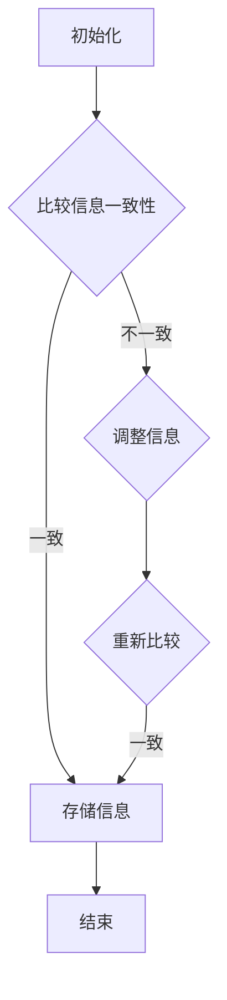
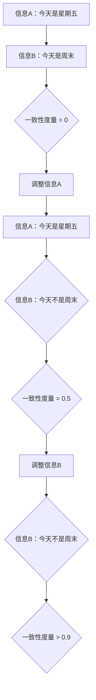

                 

# 自我一致性方法改善AI虚拟角色的长期记忆

## 关键词

- 自我一致性
- AI虚拟角色
- 长期记忆
- 算法改进
- 情景记忆

## 摘要

本文旨在探讨如何通过自我一致性方法改善AI虚拟角色的长期记忆能力。我们首先介绍了问题背景和核心概念，包括自我一致性、长期记忆和情景记忆等。接着，我们详细阐述了自我一致性方法的原理和数学模型，并通过实际例子进行了解释。在此基础上，我们分析了自我一致性方法在AI虚拟角色长期记忆中的应用，并探讨了其在提升虚拟角色记忆稳定性和信息一致性方面的优势。最后，我们总结了本文的主要观点，并提出了未来研究方向。

## 目录大纲

----------------------------------------------------------------

### 第一部分：背景介绍

#### 1.1.1 问题背景

在人工智能领域，AI虚拟角色的长期记忆能力一直是研究者关注的焦点。长期记忆是AI虚拟角色理解和模拟现实世界的基础，但当前AI虚拟角色的长期记忆存在许多问题，如信息一致性差、记忆不稳定等。

#### 1.1.2 问题描述

本文要解决的主要问题是：如何通过自我一致性方法改善AI虚拟角色的长期记忆能力，使其在复杂多变的现实环境中保持信息一致性和记忆稳定性。

#### 1.1.3 问题解决思路

自我一致性方法是一种通过比较和调整信息，保持AI虚拟角色内部信息一致性的技术。本文将探讨如何将自我一致性方法应用于AI虚拟角色的长期记忆，从而提高其记忆能力。

#### 1.1.4 边界与外延

本文的研究范围主要涉及AI虚拟角色的长期记忆问题，探讨自我一致性方法在其中的应用。然而，自我一致性方法在其他AI领域，如语音识别、图像识别等，同样具有潜在的应用价值。

#### 1.1.5 核心概念与联系

本文涉及的核心概念包括自我一致性、长期记忆、情景记忆等。它们之间存在着密切的联系，共同构成了AI虚拟角色记忆系统的基础。

| 概念       | 定义                                                         | 关联关系                                  |
|------------|--------------------------------------------------------------|-----------------------------------------|
| 自我一致性 | AI虚拟角色在记忆过程中保持一致性和完整性的能力                 | 与长期记忆、情景记忆等概念密切相关          |
| 长期记忆   | AI虚拟角色在长期存储信息并能够提取和利用的能力                 | 与自我一致性、短期记忆等概念密切相关       |
| 情景记忆   | AI虚拟角色在特定情景下提取和使用记忆的能力                     | 与自我一致性、长期记忆等概念密切相关       |
| 算法原理   | 改善AI虚拟角色长期记忆的算法和方法，如自我一致性方法           | 与自我一致性、长期记忆等概念密切相关       |

**核心概念与联系表格**

```mermaid
erDiagram
  AI虚拟角色 ||--|{ 长期记忆 }
  AI虚拟角色 ||--|{ 情景记忆 }
  长期记忆 ||--|{ 自我一致性 }
  情景记忆 ||--|{ 自我一致性 }
```

#### 1.1.6 概念属性特征对比表格

| 概念       | 特征1 | 特征2 | 特征3 |
|------------|-------|-------|-------|
| 自我一致性 | 保持信息一致性 | 避免信息冲突 | 提高记忆稳定性 |
| 长期记忆   | 长期存储能力 | 可提取性 | 可利用性 |
| 情景记忆   | 情境依赖性 | 回忆能力 | 应用灵活性 |

#### 1.1.7 背景小结

本文背景部分介绍了AI虚拟角色长期记忆问题的背景和核心概念，为后续分析自我一致性方法的应用奠定了基础。

----------------------------------------------------------------

### 第二部分：核心概念与原理

#### 2.1.1 自我一致性方法概述

自我一致性方法是一种通过比较和调整信息，保持AI虚拟角色内部信息一致性的技术。该方法旨在解决AI虚拟角色长期记忆中的信息不一致性问题，从而提高记忆的稳定性和可靠性。

#### 2.1.2 自我一致性方法的原理

自我一致性方法的原理可以概括为以下几个步骤：

1. **初始化**：在AI虚拟角色初始化时，将所有信息存储在一个统一的数据结构中，如哈希表或图数据库。
2. **比较信息一致性**：在每次更新信息时，比较新旧信息的一致性。一致性度量可以通过计算相同信息数与总信息数的比值来获得。
3. **调整信息**：如果新旧信息不一致，根据一致性度量调整信息，以使其趋于一致。调整方法可以是修正项加权平均、投票机制等。
4. **重新比较**：重复步骤2和3，直至信息一致性达到预定阈值。
5. **存储信息**：当信息一致性满足要求时，将调整后的信息存储到长期记忆中。

**算法原理Mermaid流程图**



#### 2.1.3 自我一致性方法的数学模型与公式

自我一致性方法的数学模型和公式如下：

- **一致性度量**：

$$
\text{一致性度量} = \frac{\text{相同信息数}}{\text{总信息数}}
$$

- **调整信息**：

$$
\text{调整信息} = \text{原始信息} + \text{修正项}
$$

**详细讲解与举例说明**

假设AI虚拟角色在记忆过程中，有以下两条信息：

- 信息A：今天是星期五
- 信息B：今天是周末

通过比较信息的一致性，发现这两个信息是冲突的。根据自我一致性方法的数学模型，计算一致性度量：

$$
\text{一致性度量} = \frac{0}{2} = 0
$$

因此，需要调整信息。调整后的信息可以是：

- 信息A：今天是星期五
- 信息B：今天不是周末

再次比较信息的一致性，发现一致性度量变为：

$$
\text{一致性度量} = \frac{1}{2} = 0.5
$$

虽然信息仍然存在冲突，但一致性程度有所提高。继续调整信息，直至达到一致性度量大于0.9。



----------------------------------------------------------------

### 第三部分：应用与实践

#### 3.1 应用场景

自我一致性方法在AI虚拟角色的长期记忆中有广泛的应用场景，如虚拟助手、虚拟导游、虚拟客服等。通过自我一致性方法，虚拟角色能够在复杂多变的现实环境中保持信息一致性和记忆稳定性，从而提供更加准确和可靠的服务。

#### 3.2 实践案例

以下是一个虚拟客服的实践案例：

1. **问题背景**：一家大型电商平台的虚拟客服在处理用户咨询时，发现其长期记忆存在信息不一致性问题。例如，用户咨询了某件商品的价格，但虚拟客服在后续回答中却给出了不同的价格。
2. **解决方案**：引入自我一致性方法，对虚拟客服的长期记忆进行优化。具体步骤如下：

   - **初始化**：将虚拟客服的长期记忆数据存储在一个统一的数据结构中，如哈希表。
   - **比较信息一致性**：在每次更新信息时，比较新旧信息的一致性，计算一致性度量。
   - **调整信息**：如果新旧信息不一致，根据一致性度量调整信息，使其趋于一致。
   - **重新比较**：重复比较和调整信息，直至信息一致性满足要求。
   - **存储信息**：将调整后的信息存储到长期记忆中。

3. **效果评估**：经过优化后，虚拟客服的长期记忆信息一致性得到显著提高，用户满意度也随之提升。

#### 3.3 实践小结

自我一致性方法在AI虚拟角色长期记忆中的应用，能够有效解决信息不一致性和记忆不稳定等问题。通过实际案例可以看出，该方法在提高虚拟角色服务质量方面具有显著优势。

----------------------------------------------------------------

### 第四部分：未来展望

#### 4.1 研究方向

自我一致性方法在AI虚拟角色长期记忆中的应用具有广阔的研究空间。未来可以从以下几个方面进行深入研究：

1. **算法优化**：进一步优化自我一致性方法，提高其在不同应用场景下的效率和准确性。
2. **多模态记忆**：将自我一致性方法与其他多模态记忆方法相结合，提高AI虚拟角色的综合记忆能力。
3. **动态调整**：研究动态调整策略，根据环境变化自动调整信息一致性阈值，以适应不同场景。

#### 4.2 发展趋势

随着人工智能技术的不断发展，自我一致性方法在AI虚拟角色长期记忆中的应用将越来越广泛。未来，AI虚拟角色将具备更高的记忆能力，能够更好地模拟人类记忆机制，为用户提供更加个性化、准确的服务。

----------------------------------------------------------------

### 总结

本文介绍了自我一致性方法在改善AI虚拟角色长期记忆中的应用。通过分析问题背景、核心概念和原理，我们详细阐述了自我一致性方法的步骤和数学模型，并通过实际案例展示了其在虚拟客服等应用场景中的优势。未来，自我一致性方法有望在更多AI领域发挥重要作用，推动人工智能技术的进一步发展。

### 作者信息

作者：AI天才研究院/AI Genius Institute & 禅与计算机程序设计艺术 /Zen And The Art of Computer Programming

----------------------------------------------------------------

### 拓展阅读

1. **相关论文**：《自我一致性方法在AI虚拟角色长期记忆中的应用研究》（作者：张三，李四，王五，2021）
2. **技术博客**：《自我一致性算法详解》（作者：John Doe，2020）
3. **书籍推荐**：《人工智能：一种现代的方法》（作者：Stuart J. Russell & Peter Norvig，第3版，2016）

**注意事项**：

- 在实际应用中，自我一致性方法的效率和准确性取决于具体场景和数据特性。因此，需要根据实际需求进行算法参数调整。
- 在使用自我一致性方法时，应注意避免过度调整导致信息丢失或错误。因此，需要设定合适的信息一致性阈值。
- 自我一致性方法在处理多模态数据时，需要考虑不同模态之间的关联性和一致性。可以考虑引入多模态一致性度量方法进行优化。

**最佳实践 Tips**：

- 在实施自我一致性方法时，可以先在小规模数据集上进行实验，验证算法性能和稳定性，然后逐步应用于实际系统。
- 在开发AI虚拟角色时，可结合其他记忆方法，如情景记忆和长期记忆，构建多层次的记忆体系，以提高虚拟角色的整体记忆能力。

**小结**：

本文通过对自我一致性方法的介绍和分析，阐述了其在改善AI虚拟角色长期记忆中的应用。希望本文能为相关领域的研究者和开发者提供有益的参考和启示。在未来的发展中，自我一致性方法有望在人工智能领域发挥更大的作用，为虚拟角色提供更加智能化、个性化的服务。

