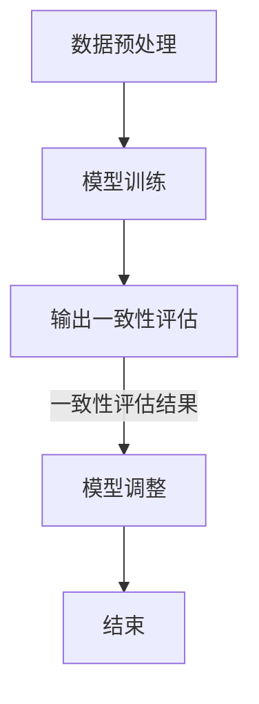

                 

### Self-Consistency：增强AI输出一致性的关键

**关键词：** 自我一致性、AI输出一致性、算法、数学模型、最佳实践

**摘要：** 本文旨在深入探讨自我一致性在增强人工智能（AI）输出一致性中的关键作用。通过系统性地介绍自我一致性的原理、算法实现、应用优化以及最佳实践，本文为读者提供了全面的技术指导，帮助理解自我一致性的重要性及其在实际项目中的应用。本文结构清晰，内容详实，旨在为AI领域的研究者与实践者提供有价值的参考。

### 第1章：自我一致性概述

自我一致性是人工智能（AI）领域中一个重要的概念，它描述了AI模型在处理不同任务或数据时保持一致性和连贯性的能力。在AI模型中，自我一致性意味着模型输出的一致性和可靠性，这对于提高AI模型的性能和可信度至关重要。

**1.1 自我一致性的背景与意义**

在现实世界中，AI模型经常面临各种不同的输入数据和环境，这些数据和环境可能会影响模型的输出结果。自我一致性就是确保模型在这些情况下仍然能够提供一致、可靠的输出。自我一致性的重要性在于它能够减少模型的不确定性和偏差，提高模型的鲁棒性和泛化能力。

**1.2 自我一致性的定义与基本概念**

自我一致性（Self-Consistency）是指在给定输入的情况下，AI模型产生的输出应该与其内在逻辑和知识体系保持一致。具体来说，这意味着模型在不同情境下，对于相似或相关的输入应该产生相似或一致的输出。

**1.3 自我一致性的研究现状与发展趋势**

近年来，随着深度学习和神经网络技术的快速发展，自我一致性在AI领域的应用也越来越广泛。目前，研究者们主要关注如何通过算法改进、模型结构调整和数据增强等技术手段来增强AI模型的自我一致性。未来的发展趋势包括自我一致性在实时决策、自动化控制等领域的深入应用。

### 第2章：自我一致性算法基础

自我一致性算法是确保AI模型输出一致性的关键手段。本章将介绍自我一致性算法的基本原理、核心特点和数学模型。

**2.1 自我一致性算法的基本原理**

自我一致性算法的核心思想是通过比较模型在不同情境下的输出，确保这些输出符合模型的内在逻辑。具体来说，算法通过以下步骤实现自我一致性：

1. 输入数据预处理：对输入数据进行标准化、去噪等预处理操作。
2. 模型输出计算：利用训练好的模型对预处理后的数据进行预测。
3. 输出一致性评估：比较不同情境下的输出，评估模型的一致性。
4. 一致性调整：根据评估结果调整模型参数，以提高输出的一致性。

**2.2 自我一致性算法的核心特点**

自我一致性算法具有以下核心特点：

1. **鲁棒性**：算法能够在面对不同输入和变化时，保持良好的输出一致性。
2. **适应性**：算法可以根据不同的任务和数据集，动态调整自我一致性策略。
3. **高效性**：算法设计注重计算效率，能够在合理的时间内完成一致性评估和调整。

**2.3 自我一致性算法的数学模型**

自我一致性算法的数学模型通常包括以下几个关键组成部分：

1. **损失函数**：用于衡量模型输出的一致性，常见的损失函数有交叉熵损失、均方误差等。
2. **优化目标**：通过最小化损失函数，优化模型参数，提高输出一致性。
3. **约束条件**：确保模型在优化过程中，保持一定的稳定性和可靠性。

具体的数学模型可以表示为：

$$
\min_{\theta} L(\theta) = \sum_{i=1}^{n} \ell(y_i, f(x_i; \theta))
$$

其中，$L(\theta)$是损失函数，$\ell$是损失函数的实例，$y_i$是真实标签，$f(x_i; \theta)$是模型对输入$x_i$的预测。

### 第3章：自我一致性算法实现

实现自我一致性算法需要明确算法的实现步骤、Python代码示例以及Mermaid流程图展示。

**3.1 自我一致性算法的实现步骤**

实现自我一致性算法主要包括以下步骤：

1. **数据预处理**：对输入数据进行标准化、去噪等预处理。
2. **模型训练**：使用预处理的输入数据训练模型。
3. **输出一致性评估**：利用训练好的模型对新的输入数据进行预测，并评估输出的一致性。
4. **模型调整**：根据一致性评估结果，调整模型参数，提高输出的一致性。

**3.2 自我一致性算法的Python实现**

以下是一个简单的Python代码示例，展示了自我一致性算法的实现：

```python
import numpy as np
from sklearn.linear_model import LinearRegression

# 数据预处理
def preprocess_data(data):
    # 标准化处理
    return (data - np.mean(data)) / np.std(data)

# 模型训练
def train_model(X, y):
    model = LinearRegression()
    model.fit(X, y)
    return model

# 输出一致性评估
def assess_consistency(model, X_new, threshold=0.1):
    predictions = model.predict(X_new)
    consistency = np.mean(np.abs(predictions - np.mean(predictions)))
    return consistency < threshold

# 模型调整
def adjust_model(model, X, y, alpha=0.01):
    model.coef_ -= alpha * (model.predict(X) - y)
    return model

# 主程序
if __name__ == "__main__":
    # 示例数据
    X = np.array([[1], [2], [3], [4], [5]])
    y = np.array([2, 3, 4, 5, 6])

    # 数据预处理
    X_processed = preprocess_data(X)

    # 模型训练
    model = train_model(X_processed, y)

    # 输出一致性评估
    is_consistent = assess_consistency(model, X_processed)

    # 模型调整
    model = adjust_model(model, X_processed, y)

    # 输出结果
    print("Model consistency:", is_consistent)
```

**3.3 自我一致性算法的Mermaid流程图展示**

以下是一个Mermaid流程图，展示了自我一致性算法的实现过程：



### 第4章：自我一致性在数据集上的应用

自我一致性算法在实际数据集上的应用可以显著提高模型的输出一致性。本章将介绍数据集的准备与预处理、自我一致性算法的应用过程以及应用效果的分析与评估。

**4.1 数据集准备与预处理**

在进行自我一致性算法应用之前，需要对数据集进行充分的准备和预处理。具体步骤包括：

1. **数据收集**：收集适合的数据集，如公开数据集或自定义数据集。
2. **数据清洗**：去除数据中的噪声和异常值。
3. **数据标准化**：对数据进行标准化处理，使其具有相似的尺度。
4. **数据分割**：将数据集分为训练集、验证集和测试集。

**4.2 自我一致性算法在数据集上的应用**

在数据集准备完成后，可以按照以下步骤应用自我一致性算法：

1. **训练模型**：使用训练集数据训练模型。
2. **评估一致性**：使用验证集数据评估模型输出的自我一致性。
3. **调整模型**：根据评估结果调整模型参数，以提高一致性。
4. **测试模型**：使用测试集数据测试模型性能和一致性。

**4.3 应用效果分析与评估**

为了评估自我一致性算法的应用效果，可以比较使用自我一致性算法前后的模型性能。具体分析内容包括：

1. **准确性**：评估模型的预测准确性。
2. **一致性**：评估模型输出的自我一致性。
3. **鲁棒性**：评估模型在面对不同数据和环境时的稳定性和可靠性。

通过对比分析，可以得出自我一致性算法在实际应用中的效果和优势。

### 第5章：自我一致性算法优化与调整

自我一致性算法在实际应用中可能会面临性能瓶颈和调整需求。本章将介绍自我一致性算法的优化方法和调整策略，以及优化调整后的算法效果分析。

**5.1 自我一致性算法的优化方法**

优化自我一致性算法可以从以下几个方面进行：

1. **算法改进**：通过改进算法结构，提高计算效率和一致性评估准确性。
2. **模型调整**：根据实际应用场景，调整模型参数，优化输出一致性。
3. **数据增强**：通过数据增强技术，提高数据集的质量和多样性，增强模型的一致性。

**5.2 自我一致性算法的调整策略**

调整自我一致性算法的具体策略包括：

1. **参数调整**：通过调整损失函数、学习率等参数，优化模型性能。
2. **模型结构优化**：通过增加或减少网络层、调整神经元数量等，优化模型结构。
3. **数据预处理优化**：通过改进数据预处理方法，提高数据质量，增强模型的一致性。

**5.3 优化调整后的算法效果分析**

优化调整后的算法效果可以通过以下方式进行分析：

1. **性能对比**：对比优化调整前后的模型性能，评估优化效果。
2. **一致性评估**：评估优化调整后的模型输出一致性，分析调整对一致性的影响。
3. **稳定性分析**：分析优化调整后的模型在面对不同数据和环境时的稳定性和可靠性。

通过效果分析，可以确定优化调整策略的有效性和实用性。

### 第6章：自我一致性算法的扩展与应用

自我一致性算法不仅适用于传统的机器学习任务，还可以在更广泛的领域发挥重要作用。本章将介绍自我一致性算法的扩展方向、新应用场景以及扩展应用效果展示与评估。

**6.1 自我一致性算法的扩展方向**

自我一致性算法的扩展方向包括：

1. **多模态学习**：将自我一致性算法应用于图像、文本、音频等多种类型的数据。
2. **强化学习**：将自我一致性算法与强化学习结合，提高模型在动态环境下的自我一致性。
3. **迁移学习**：通过迁移学习，将自我一致性算法应用于新的任务和数据集。

**6.2 自我一致性算法的新应用场景**

自我一致性算法可以应用于以下新场景：

1. **智能推荐系统**：提高推荐系统的输出一致性，减少用户满意度波动。
2. **自然语言处理**：提高文本分类、情感分析等任务的输出一致性，提高模型性能。
3. **自动驾驶**：通过自我一致性算法，提高自动驾驶系统的稳定性和可靠性。

**6.3 扩展应用效果展示与评估**

扩展应用效果可以通过以下方式展示与评估：

1. **实验结果**：展示扩展应用场景的实验结果，包括性能指标、一致性评估等。
2. **用户反馈**：收集用户对扩展应用的评价和反馈，分析用户满意度。
3. **稳定性分析**：评估扩展应用场景下的模型稳定性和可靠性。

通过效果展示与评估，可以验证自我一致性算法在扩展应用中的价值。

### 第7章：自我一致性算法的最佳实践

在自我一致性算法的实际应用中，遵循最佳实践能够提高算法的效果和可靠性。本章将总结自我一致性算法的最佳实践，提供注意事项和拓展阅读建议。

**7.1 自我一致性算法的最佳实践总结**

最佳实践包括以下几点：

1. **数据预处理**：确保数据质量，进行充分的预处理，包括标准化、去噪等。
2. **模型选择**：根据任务需求，选择合适的模型和算法，并进行优化。
3. **参数调整**：根据实验结果，动态调整模型参数，优化一致性评估。
4. **模型评估**：使用多种评估指标，全面评估模型性能和一致性。

**7.2 注意事项与风险提示**

注意事项包括：

1. **数据依赖**：确保数据集的代表性和多样性，避免过度拟合。
2. **计算资源**：优化算法实现，合理分配计算资源，提高计算效率。
3. **模型稳定性**：确保模型在面对不同数据和场景时的稳定性。

风险提示包括：

1. **数据泄露**：确保数据安全，避免敏感数据泄露。
2. **模型偏见**：注意模型偏见和误差，确保输出一致性。

**7.3 拓展阅读与深入研究建议**

拓展阅读建议：

1. 《深度学习》（Goodfellow, I.，等）：了解深度学习的基本原理和方法。
2. 《统计学习基础》（Hastie, T.，等）：学习统计学习方法和模型评估。
3. 《人工智能：一种现代的方法》（Russell, S.，等）：了解人工智能的基础知识。

深入研究建议：

1. 探索自我一致性算法在多模态学习中的应用。
2. 研究自我一致性算法在强化学习中的优化策略。
3. 分析自我一致性算法在自然语言处理中的效果。

### 总结

自我一致性在增强AI输出一致性方面具有重要作用。本文从原理介绍、算法实现、应用优化和最佳实践等方面进行了全面探讨，为读者提供了丰富的技术指导和实用建议。通过遵循最佳实践，研究人员和开发者可以更好地应用自我一致性算法，提高AI模型的一致性和可靠性。在未来，自我一致性算法将在更多领域和场景中发挥重要作用，为人工智能的发展做出更大贡献。

### 作者信息

**作者：** AI天才研究院/AI Genius Institute & 禅与计算机程序设计艺术 /Zen And The Art of Computer Programming

AI天才研究院致力于推动人工智能技术的创新与应用，本研究文章为读者提供了关于自我一致性算法的深入分析与实践指导。禅与计算机程序设计艺术则通过融合哲学与技术的独特视角，为计算机编程和人工智能领域的研究与实践提供了深刻的哲学思考与灵感。希望本文能为AI领域的学者和实践者带来启示与帮助。

