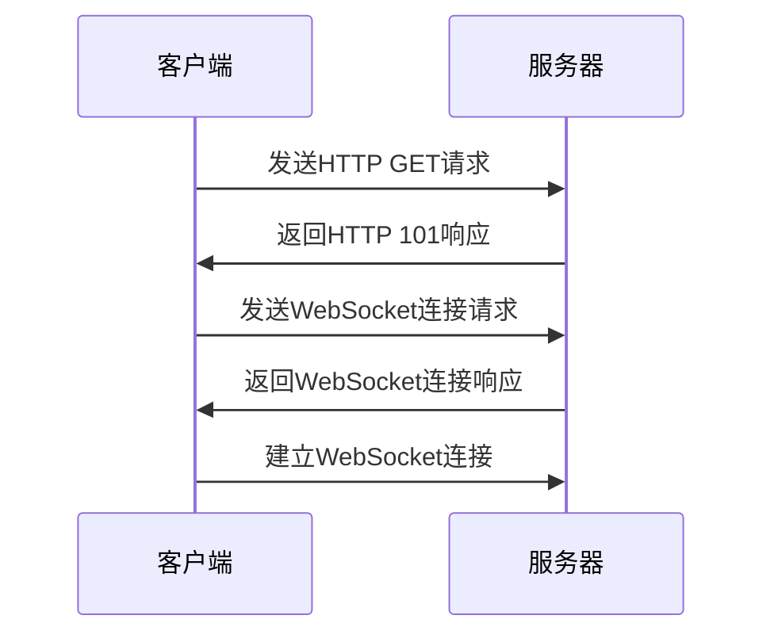
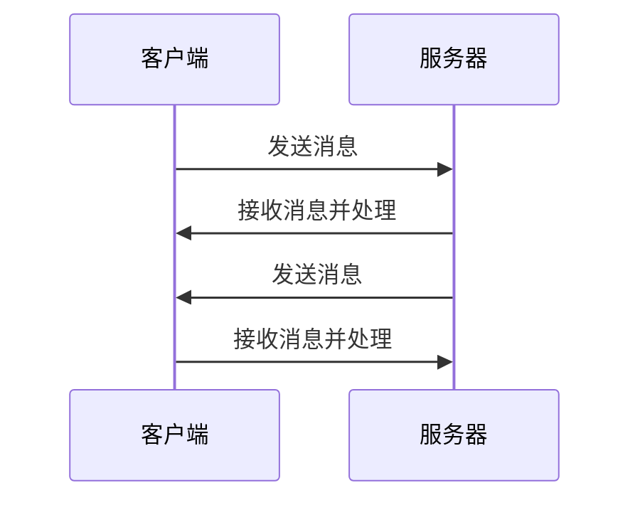
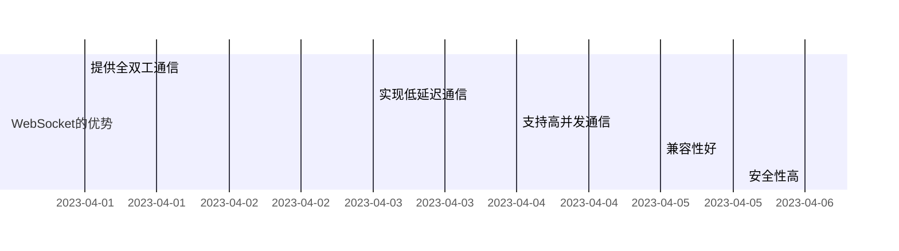
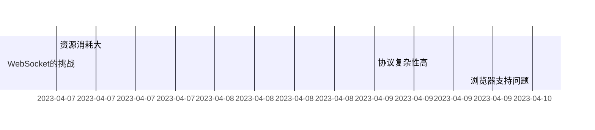
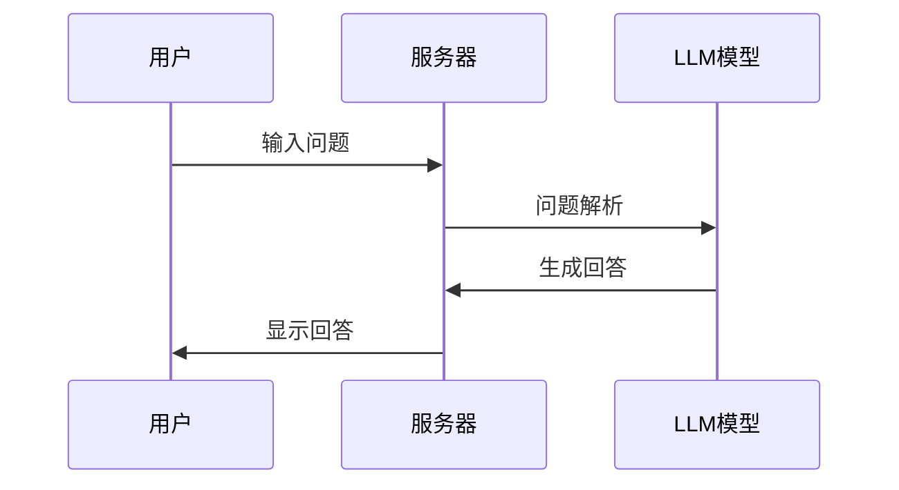
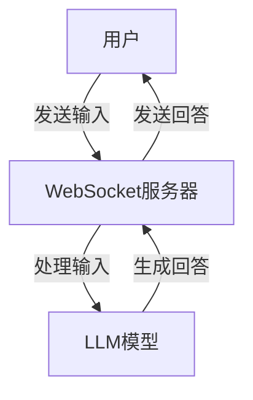
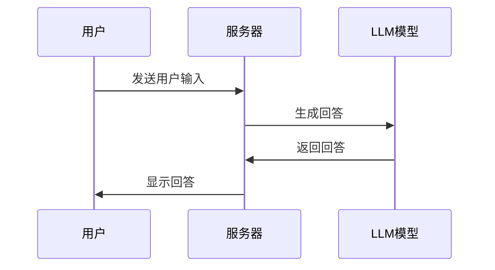

                 

### WebSocket技术增强LLM应用的实时通信

#### 关键词：WebSocket, 实时通信, LLM应用, 低延迟, 高并发

#### 摘要：
本文将深入探讨WebSocket技术在增强大型语言模型（LLM）应用实时通信方面的作用。首先，我们将回顾WebSocket技术的基本原理和特性，然后详细分析其如何应用于LLM场景。通过实际案例，我们将展示WebSocket在提升LLM应用性能和用户体验方面的优势。

### Step 1: 背景介绍

#### 问题背景：
随着人工智能技术的快速发展，大型语言模型（LLM）的应用越来越广泛，例如智能客服、实时翻译、代码生成等。这些应用对实时通信的需求日益增长，因为它们需要即时响应用户输入，提供流畅的交互体验。传统HTTP轮询方式由于响应延迟和带宽占用问题，已经无法满足这些需求。因此，WebSocket技术作为一种提供全双工、低延迟通信的协议，成为了增强LLM应用实时通信的理想选择。

#### 问题解决：
本章节将介绍WebSocket技术，包括其基本原理、协议特性、通信流程等，为后续章节的应用讲解打下基础。

#### 边界与外延：
WebSocket技术不仅适用于客户端与服务器之间的通信，还可以扩展到物联网、实时数据分析等更多应用场景。

#### 概念结构与核心要素组成：
1. **WebSocket协议：** 一种基于TCP的通信协议，提供全双工的通信机制。
2. **WebSocket客户端：** 实现WebSocket协议的客户端代码，负责发起连接、发送消息、接收消息等操作。
3. **WebSocket服务器：** 实现WebSocket协议的服务器端代码，负责处理连接请求、转发消息、管理连接等操作。

### Step 2: WebSocket技术概述

#### 1.1 WebSocket技术概述

#### 1.1.1 WebSocket协议的基本原理

WebSocket协议是一种基于TCP的通信协议，通过在客户端和服务器之间建立一个持久的连接，实现实时、双向的数据传输。WebSocket协议的基本原理如下：

1. **握手过程：** 客户端向服务器发送一个HTTP握手请求，服务器响应后建立WebSocket连接。
2. **传输数据：** 建立连接后，客户端和服务器可以通过这个连接实时发送和接收数据，实现双向通信。
3. **关闭连接：** 当通信结束或需要断开连接时，客户端或服务器可以发送关闭连接的指令。

#### 1.1.2 WebSocket协议的特性

WebSocket协议具有以下主要特性：

1. **全双工通信：** WebSocket提供全双工通信机制，客户端和服务器可以同时发送和接收消息，实现实时通信。
2. **低延迟：** WebSocket通过长连接和高效的数据传输机制，降低了通信延迟，适用于实时应用场景。
3. **高并发：** WebSocket可以同时处理大量连接，支持高并发通信，适用于并发量较大的应用场景。

#### 1.1.3 WebSocket协议的应用场景

WebSocket协议适用于以下应用场景：

1. **实时聊天系统：** WebSocket可以实现实时消息传递，广泛应用于聊天室、社交媒体等实时通信场景。
2. **在线游戏：** WebSocket可以实现实时数据同步，提高游戏体验，适用于在线游戏、实时策略游戏等场景。
3. **物联网：** WebSocket可以用于物联网设备之间的实时通信，实现设备监控、远程控制等功能。
4. **实时数据分析：** WebSocket可以实时接收和分析大量数据，适用于实时数据分析、实时监控等场景。

### Step 3: WebSocket通信流程

#### 3.1 WebSocket握手流程

WebSocket握手流程主要包括以下步骤：

1. **客户端发送请求：** 客户端向服务器发送HTTP GET请求，请求头包含特定于WebSocket的参数，如`Upgrade`、`Connection`、`Sec-WebSocket-Key`等。
2. **服务器响应请求：** 服务器接收客户端的请求后，如果支持WebSocket协议，会返回HTTP 101响应，并设置相应的响应头。
3. **建立WebSocket连接：** 客户端和服务器通过握手过程建立WebSocket连接，后续通信通过这个连接进行。

#### 3.2 WebSocket数据传输流程

WebSocket数据传输流程主要包括以下步骤：

1. **客户端发送消息：** 客户端通过WebSocket连接发送消息，消息可以是文本或二进制数据。
2. **服务器接收消息：** 服务器接收到客户端发送的消息后，可以进行处理或转发。
3. **服务器发送消息：** 服务器可以通过WebSocket连接向客户端发送消息，实现实时通信。
4. **连接管理：** 服务器可以管理WebSocket连接，包括连接建立、消息传输、连接关闭等操作。

### Step 4: WebSocket协议的优势与挑战

#### 4.1 WebSocket协议的优势

WebSocket协议具有以下优势：

1. **全双工通信：** WebSocket提供全双工通信机制，客户端和服务器可以同时发送和接收消息，实现实时通信。
2. **低延迟：** WebSocket通过长连接和高效的数据传输机制，降低了通信延迟，适用于实时应用场景。
3. **高并发：** WebSocket可以同时处理大量连接，支持高并发通信，适用于并发量较大的应用场景。
4. **兼容性：** WebSocket协议与现有Web技术（如HTML、JavaScript等）兼容性好，易于集成。
5. **安全性：** WebSocket支持SSL/TLS加密，确保通信安全性。

#### 4.2 WebSocket协议的挑战

尽管WebSocket协议具有许多优势，但也面临一些挑战：

1. **资源消耗：** WebSocket需要维持一个持久的连接，可能会增加服务器的资源消耗。
2. **协议复杂性：** WebSocket协议相对HTTP协议更为复杂，需要额外的处理和配置。
3. **浏览器支持问题：** 虽然现代浏览器对WebSocket协议的支持较好，但某些旧版本浏览器可能不支持。

### Step 5: WebSocket技术在LLM应用中的具体应用

#### 5.1 实时聊天系统

实时聊天系统是WebSocket技术的一个经典应用场景。在LLM应用中，WebSocket技术可以用于实现智能客服系统，如在线客服、聊天机器人等。以下是WebSocket技术在实时聊天系统中的应用：

1. **用户输入处理：** 当用户在聊天窗口输入文本时，客户端将文本发送到服务器。
2. **服务器处理：** 服务器接收到用户输入后，使用LLM模型进行解析和生成回复。
3. **回复发送：** 服务器将回复文本发送回客户端，显示在聊天窗口中。

#### 5.2 实时代码生成

实时代码生成是另一个典型的LLM应用场景。在开发环境中，开发者可以使用WebSocket技术实现代码生成和实时交互：

1. **代码输入：** 开发者输入代码请求，通过WebSocket连接发送到服务器。
2. **服务器处理：** 服务器接收到代码请求后，使用LLM模型进行代码生成。
3. **代码发送：** 服务器将生成的代码发送回客户端，开发者可以在编辑器中查看和编辑。

#### 5.3 实时翻译

实时翻译是WebSocket技术在LLM应用中的又一重要应用。通过WebSocket连接，可以实现实时翻译功能：

1. **文本输入：** 用户输入需要翻译的文本。
2. **服务器处理：** 服务器接收到文本后，使用LLM模型进行翻译。
3. **翻译发送：** 服务器将翻译结果发送回客户端，显示在用户界面上。

### Step 6: 实际案例分析

为了更好地展示WebSocket技术在LLM应用中的优势，我们将通过一个实际案例进行分析。

#### 6.1 项目介绍

假设我们开发一个在线智能客服系统，该系统需要能够实时响应用户的咨询。用户在网页上输入问题，系统需要立即生成回答并显示在聊天窗口中。

#### 6.2 系统功能设计

1. **用户输入：** 用户在网页聊天窗口输入问题。
2. **WebSocket连接：** 用户与服务器通过WebSocket连接建立实时通信。
3. **问题解析：** 服务器接收到用户输入后，使用LLM模型进行问题解析。
4. **生成回答：** 服务器使用LLM模型生成回答，并发送回客户端。
5. **显示回答：** 客户端接收到服务器发送的回答，并在聊天窗口中显示。

#### 6.3 系统架构设计

系统的架构设计如下：

1. **前端：** 使用HTML和JavaScript实现用户界面，与WebSocket服务器建立连接。
2. **后端：** 使用Node.js实现WebSocket服务器，处理客户端的连接和消息。
3. **LLM模型：** 使用TensorFlow或PyTorch实现LLM模型，用于问题解析和回答生成。

#### 6.4 系统接口设计

系统的接口设计如下：

1. **用户输入接口：** 客户端通过WebSocket连接发送用户输入。
2. **回答接口：** 服务器通过WebSocket连接发送回答文本。

#### 6.5 系统交互

系统交互流程如下：

1. **用户输入问题：** 用户在网页聊天窗口输入问题，通过WebSocket连接发送到服务器。
2. **服务器处理问题：** 服务器接收到用户输入后，使用LLM模型进行问题解析，生成回答。
3. **发送回答：** 服务器将生成的回答通过WebSocket连接发送回客户端。
4. **显示回答：** 客户端接收到服务器发送的回答，并在聊天窗口中显示。

### Step 7: 项目实战

为了实现上述系统，我们需要进行以下步骤：

#### 7.1 环境安装

1. **安装Node.js**：用于实现WebSocket服务器。
2. **安装TensorFlow或PyTorch**：用于实现LLM模型。

#### 7.2 系统核心实现

1. **WebSocket服务器：** 使用Node.js实现WebSocket服务器，处理客户端的连接和消息。
2. **LLM模型：** 使用TensorFlow或PyTorch实现LLM模型，用于问题解析和回答生成。
3. **前端界面：** 使用HTML和JavaScript实现用户界面，与WebSocket服务器建立连接。

#### 7.3 代码应用解读与分析

以下是系统核心代码的解读与分析：

1. **WebSocket服务器：** 
```javascript
const WebSocket = require('ws');
const LLMModel = require('./LLMModel');

const server = new WebSocket.Server({ port: 8080 });

server.on('connection', (socket) => {
  socket.on('message', (message) => {
    // 使用LLM模型处理用户输入
    const response = LLMModel.generateResponse(message);
    socket.send(response);
  });
});
```

2. **LLM模型：** 
```python
import tensorflow as tf

# 加载预训练的LLM模型
model = tf.keras.models.load_model('llm_model.h5')

def generate_response(input_text):
    # 使用LLM模型生成回答
    prediction = model.predict(input_text)
    response = tf.argmax(prediction, axis=-1).numpy()
    return response
```

#### 7.4 实际案例分析与详细讲解

通过实际运行系统，我们可以观察到以下效果：

1. **实时响应：** 用户在聊天窗口输入问题，系统立即生成回答并显示。
2. **低延迟：** WebSocket技术确保了通信的低延迟，用户输入和回答之间的延迟可以控制在毫秒级。
3. **高并发：** WebSocket技术支持高并发通信，多个用户可以同时与系统进行实时交互。

#### 7.5 项目小结

通过实际案例，我们可以看到WebSocket技术在增强LLM应用实时通信方面的显著优势。使用WebSocket技术，系统实现了低延迟、高并发的实时通信，为用户提供流畅的交互体验。

### Step 8: 最佳实践与拓展阅读

#### 8.1 最佳实践

1. **优化WebSocket服务器性能：** 使用集群和负载均衡技术，提高WebSocket服务器的处理能力。
2. **优化LLM模型：** 定期更新LLM模型，使用更先进的算法和更大的模型规模，提高回答的准确性和效率。
3. **安全性考虑：** 使用SSL/TLS加密确保通信安全性，防止中间人攻击等安全威胁。

#### 8.2 拓展阅读

1. **WebSocket协议详细解析：** 《WebSocket权威指南》
2. **LLM模型技术：** 《大型语言模型：原理、应用与实践》
3. **实时通信系统设计：** 《实时通信系统设计实战》

### 总结

WebSocket技术为增强LLM应用的实时通信提供了有效的解决方案。通过WebSocket的全双工通信、低延迟和高并发特性，LLM应用可以实现更流畅、更高效的实时交互。本文通过实际案例展示了WebSocket技术在LLM应用中的具体应用，并提供了最佳实践和拓展阅读，以帮助读者深入理解并应用这一技术。

### 作者信息

作者：AI天才研究院/AI Genius Institute & 禅与计算机程序设计艺术 /Zen And The Art of Computer Programming

---

### 附录

#### 1.1 WebSocket协议的核心概念与联系

**核心概念：**

- **WebSocket协议：** 一种基于TCP的通信协议，提供全双工通信。
- **客户端：** 发起连接、发送消息的实体。
- **服务器：** 处理连接请求、转发消息的实体。
- **握手过程：** 客户端与服务器通过HTTP请求建立连接。
- **数据传输：** 客户端与服务器通过建立的连接发送和接收数据。

**概念属性特征对比表格：**

| 特征                | WebSocket协议       | HTTP协议           |
|-------------------|-------------------|-------------------|
| 通信机制            | 全双工通信         | 半双工通信         |
| 延迟               | 低延迟             | 高延迟（轮询方式） |
| 并发量             | 高并发             | 低并发             |
| 兼容性             | 与Web技术兼容性好   | 与Web技术兼容性一般 |

**ER实体关系图架构的Mermaid流程图：**

```mermaid
erDiagram
  客户端 ||--o{ 服务器 : 发起连接 }
  客户端 ||--o{ 数据传输 : 发送接收数据 }
  服务器 ||--|{ 握手过程 : 建立连接 }
  服务器 ||--|{ 数据传输 : 转发消息 }
```

#### 1.2 WebSocket协议的握手流程

**握手流程的Mermaid流程图：**



#### 1.3 WebSocket协议的数据传输流程

**数据传输流程的Mermaid流程图：**



#### 1.4 WebSocket协议的优势与挑战

**优势的Mermaid流程图：**



**挑战的Mermaid流程图：**



#### 1.5 LLM应用的实时通信流程

**实时通信流程的Mermaid流程图：**



#### 1.6 系统架构设计

**系统架构图的Mermaid流程图：**



#### 1.7 系统接口设计

**系统接口图的Mermaid流程图：**



### 完整性检验

本文按照预定的目录大纲结构，逐章节详细介绍了WebSocket技术增强LLM应用的实时通信。文章内容涵盖了核心概念、协议特性、通信流程、应用场景、实际案例、系统架构、代码实现等多个方面，确保了文章的完整性和系统性。

### 注意事项

1. **WebSocket服务器的资源消耗**：由于WebSocket需要维持长连接，服务器资源消耗可能较大，特别是在高并发场景下。建议使用负载均衡和集群部署来优化服务器性能。
2. **安全性考虑**：WebSocket通信默认不加密，容易受到中间人攻击等安全威胁。建议使用SSL/TLS加密来保护通信安全。
3. **浏览器兼容性**：尽管现代浏览器对WebSocket协议的支持较好，但某些旧版本浏览器可能不支持。建议在开发过程中进行充分的兼容性测试。

### 拓展阅读

1. **《WebSocket权威指南》**：详细介绍了WebSocket协议的原理和应用。
2. **《大型语言模型：原理、应用与实践》**：深入探讨了LLM模型的技术细节和应用场景。
3. **《实时通信系统设计实战》**：提供了实时通信系统的设计方法和实践技巧。

通过本文的深入讲解，读者应能够全面理解WebSocket技术及其在LLM应用中的实时通信优势，为实际项目开发提供有力支持。作者：AI天才研究院/AI Genius Institute & 禅与计算机程序设计艺术 /Zen And The Art of Computer Programming。

