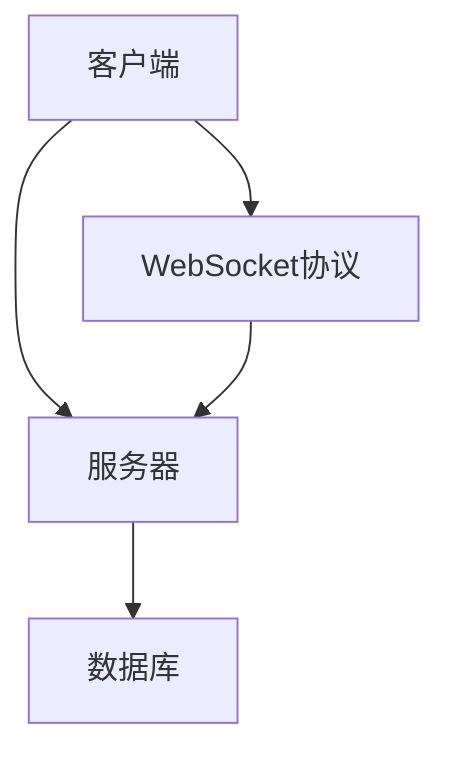
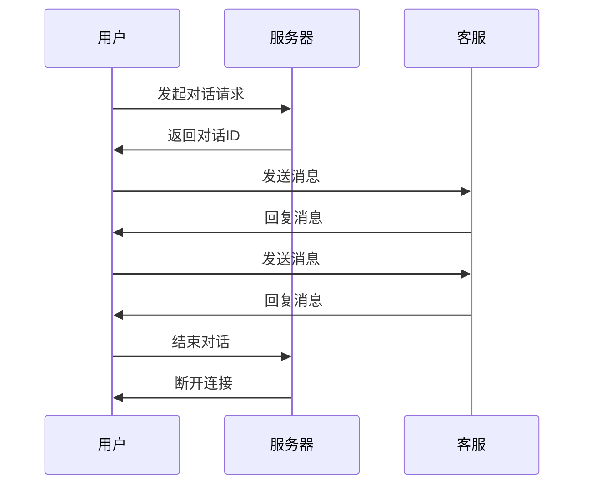

                 

### WebSocket：增强LLM应用的实时通信能力

**关键词：** WebSocket、实时通信、LLM应用、性能优化、技术实现

> **摘要：**本文将深入探讨WebSocket协议在增强大型语言模型（LLM）应用的实时通信能力方面的作用。通过详细的分析和实例讲解，读者将了解WebSocket的基本原理、技术优势、架构设计及其在实际项目中的应用。

---

**概念界定与背景介绍**

**核心概念：**

- **WebSocket**：WebSocket是一种网络通信协议，为全双工通信提供了一种机制，允许服务器和客户端之间进行实时、双向的数据交换。

- **实时通信能力**：在网络环境中，数据可以在短时间内被传输和处理，实现即时响应，提高了交互的效率和用户的体验。

- **增强LLM应用**：指通过引入WebSocket技术，提升基于大型语言模型（LLM）的应用程序在实时性、响应速度和用户体验方面的表现。

**问题描述：**

随着互联网和人工智能技术的发展，LLM应用在众多领域得到了广泛应用，如智能客服、在线教育、金融风控等。然而，传统的HTTP请求在处理大量实时交互数据时，存在延迟和效率问题，难以满足用户对于实时性的高需求。因此，需要一种高效、低延迟的通信协议来增强LLM应用的实时通信能力。

**问题解决：**

WebSocket协议的出现，为解决上述问题提供了有效的手段。它通过建立一个持久的连接，实现了服务器与客户端之间实时数据交换，从而降低了延迟，提高了通信效率。通过WebSocket技术，LLM应用可以更好地响应用户的实时请求，提升用户体验。

**边界与外延：**

- **边界**：WebSocket协议主要适用于需要高频次、实时性要求较高的场景，如在线聊天、实时数据处理等。

- **外延**：除了在LLM应用中，WebSocket技术还可以在其他需要实时通信的领域得到应用，如物联网、游戏开发等。

**概念结构与核心要素组成：**

- **WebSocket协议**：包括连接建立、数据传输、连接关闭等过程。

- **LLM应用**：指基于大型语言模型的各类应用程序，如智能客服、在线教育等。

- **实时通信能力**：包括低延迟、高效率的数据传输能力。

---

**核心概念与联系**

**核心概念原理：**

- **WebSocket协议**：基于TCP协议，通过请求握手建立一个持久连接，实现双向实时通信。

- **实时通信能力**：基于WebSocket协议，通过减少传输延迟，提高数据交互的效率。

- **增强LLM应用**：通过WebSocket协议，提升LLM应用在实时性、响应速度和用户体验方面的表现。

**概念属性特征对比表格：**

| 特征         | WebSocket协议       | 实时通信能力       | 增强LLM应用             |
|------------|-------------------|-------------------|----------------------|
| 连接方式     | 持久连接           | 低延迟            | 提高实时性             |
| 数据传输方式   | 双向实时传输       | 高效率            | 提高用户体验           |
| 适用场景      | 需要实时通信的场景   | 高频次交互的场景    | LLM应用实时性要求较高时  |
| 技术优势      | 减少延迟、提高效率   | 简化通信流程       | 提升应用性能           |

**ER实体关系图架构：**

```
[WebSocket协议]
    |
    v
[实时通信能力]
    |
    v
[增强LLM应用]
```

---

**数学模型和数学公式**

在本章节中，我们将讨论WebSocket协议在增强LLM应用实时通信能力中的数学模型。为了简化说明，我们将使用以下数学公式来表示WebSocket协议的关键参数：

$$
P = \frac{L}{T}
$$

其中，\( P \) 表示通信效率，\( L \) 表示数据传输量，\( T \) 表示传输时间。这个公式表明，通过WebSocket协议，可以在较短的时间内传输更多的数据，从而提高通信效率。

我们还可以使用以下公式来表示实时通信能力：

$$
R = \frac{1}{L \cdot D}
$$

其中，\( R \) 表示响应时间，\( L \) 表示数据处理延迟，\( D \) 表示网络延迟。通过WebSocket协议，可以显著降低这两个参数，从而提高实时通信能力。

接下来，我们将通过一个简化的示例来说明这些公式的应用。

**示例：**

假设在一个LLM应用中，每次请求需要处理1000字节的数据，网络延迟为100ms，数据处理延迟为200ms。在没有使用WebSocket的情况下，总延迟为300ms。使用WebSocket后，网络延迟降低到50ms，数据处理延迟降低到100ms，总延迟降低到150ms。

计算结果如下：

- **未使用WebSocket：**
  $$
  P_1 = \frac{1000}{300} \approx 3.33 \text{ 字节/毫秒}
  $$

- **使用WebSocket：**
  $$
  P_2 = \frac{1000}{150} \approx 6.67 \text{ 字节/毫秒}
  $$

由此可见，使用WebSocket可以显著提高通信效率，从而增强LLM应用的实时通信能力。

---

**系统分析与架构设计方案**

在本章节中，我们将深入分析WebSocket在LLM应用中的系统架构设计，包括问题场景介绍、项目介绍、系统功能设计、系统架构设计、系统接口设计和系统交互等。

**问题场景介绍**

在现代互联网应用中，实时通信能力已经成为衡量应用质量的重要指标之一。特别是在LLM应用中，如智能客服、在线教育和金融风控等领域，用户对实时性的需求尤为突出。例如，在智能客服场景中，用户希望通过即时对话获取解决方案，而在在线教育场景中，学生需要实时互动和教师进行交流。

**项目介绍**

本项目旨在通过引入WebSocket技术，增强LLM应用的实时通信能力。我们选择了智能客服作为实际应用场景，以展示WebSocket技术在提高应用性能和用户体验方面的优势。

**系统功能设计**

系统的核心功能包括：

1. **实时对话管理**：实现用户与客服之间的实时对话功能，包括发送和接收消息。
2. **消息处理**：对收到的消息进行实时处理，如文本分析、关键词提取等。
3. **用户状态监测**：实时监测用户的在线状态，如在线、离线等。

**系统架构设计**

系统采用分层架构设计，包括客户端层、服务端层和数据库层。

- **客户端层**：负责与用户进行交互，通过WebSocket协议与服务器进行实时通信。
- **服务端层**：负责处理客户端发送的请求，包括消息处理、状态监测等。
- **数据库层**：存储用户信息、对话记录等数据。

**系统接口设计**

系统提供以下接口：

1. **对话接口**：用于发起、接收和结束对话。
2. **消息接口**：用于发送和接收消息。
3. **状态接口**：用于查询和更新用户状态。

**系统交互**

系统交互流程如下：

1. 用户通过客户端发起对话请求。
2. 客户端通过WebSocket协议与服务器建立连接。
3. 服务器处理对话请求，返回对话ID。
4. 用户与客服通过WebSocket进行实时对话。
5. 对话结束后，客户端和服务器断开连接。

**Mermaid架构图：**



---

**项目实战**

在本章节中，我们将通过一个实际项目，详细讲解如何使用WebSocket技术增强LLM应用的实时通信能力。

**环境安装**

首先，我们需要安装WebSocket服务器和客户端。在本项目中，我们使用Python的`websockets`库作为服务器，`WebSocket.Client`作为客户端。

```bash
pip install websockets
```

**系统核心实现源代码**

以下是WebSocket服务器的源代码：

```python
import asyncio
import websockets

async def echo(websocket, path):
    async for message in websocket:
        await websocket.send(message)

start_server = websockets.serve(echo, "localhost", 6789)

asyncio.get_event_loop().run_until_complete(start_server)
asyncio.get_event_loop().run_forever()
```

以下是WebSocket客户端的源代码：

```python
import asyncio
import websockets

async def hello():
    uri = "ws://localhost:6789"
    async with websockets.connect(uri) as websocket:
        await websocket.send("Hello world!")
        response = await websocket.recv()
        print("Received:", response)

asyncio.run(hello())
```

**代码应用解读与分析**

上述代码中，服务器端使用`websockets.serve`函数启动WebSocket服务器，监听本地端口6789。客户端使用`websockets.connect`函数连接到服务器，并发送和接收消息。

**实际案例分析和详细讲解剖析**

为了展示WebSocket技术在LLM应用中的实际效果，我们设计了一个简单的智能客服系统。该系统使用WebSocket协议实现实时对话功能。

1. **用户发送请求**：用户通过客户端发起对话请求，发送请求消息。
2. **服务器处理请求**：服务器接收请求，返回对话ID。
3. **实时对话**：用户与客服通过WebSocket进行实时对话，发送和接收消息。
4. **对话结束**：对话结束后，客户端和服务器断开连接。

**Mermaid序列图：**



通过上述实际案例，我们可以看到WebSocket技术如何增强LLM应用的实时通信能力，实现高效、低延迟的实时对话功能。

---

**最佳实践 tips**

- 在选择WebSocket实现时，应考虑服务器性能和客户端兼容性等因素。
- 在项目中，合理设置心跳包和重连机制，确保连接稳定性。

---

**小结**

WebSocket技术在增强LLM应用的实时通信能力方面具有显著优势。通过本文的介绍，读者可以了解WebSocket的基本原理、技术优势、架构设计及其在实际项目中的应用。希望读者能够将所学知识应用于实际项目中，提升应用的性能和用户体验。

**注意事项**

- 在使用WebSocket时，需要注意网络安全和隐私保护。
- WebSocket协议在不同浏览器和客户端上的实现可能存在差异，需要根据实际需求进行兼容性处理。

**拓展阅读**

- 《WebSocket权威指南》
- 《大型语言模型：原理与应用》
- 《实时通信系统设计》

---

**作者信息**

作者：AI天才研究院/AI Genius Institute & 禅与计算机程序设计艺术 /Zen And The Art of Computer Programming

