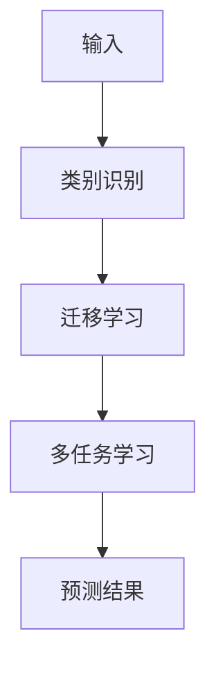
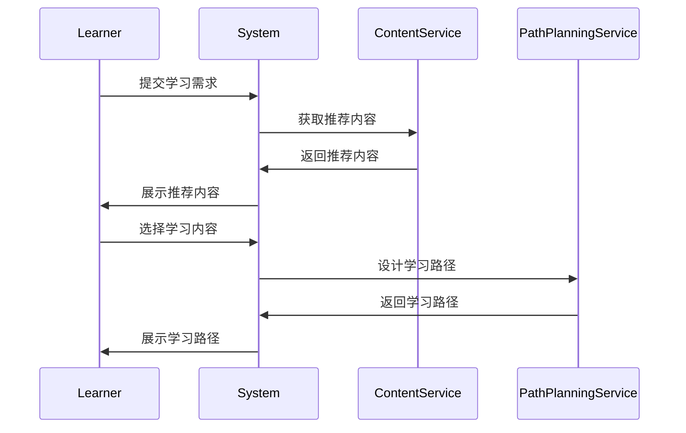

                 

### 章节内容

#### 背景介绍

**核心概念术语说明**：
1. **个性化学习路径设计**：针对不同学习者的特点和需求，设计出一条最适合其的学习路径。
2. **Zero-Shot CoT**：无样本零样本学习，指在没有训练数据的情况下，使模型对未知类别进行预测。

**问题背景**：
随着人工智能技术的迅猛发展，个性化学习路径设计成为教育领域的一大热点。然而，现有的学习路径设计方法大多依赖于大规模的标注数据进行训练，这使得在实际应用中面临诸多挑战。例如，数据获取困难、数据隐私保护等问题。

**问题描述**：
如何在不依赖大量标注数据的情况下，实现个性化学习路径的设计？

**问题解决**：
引入Zero-Shot CoT方法，可以在没有训练数据的情况下，对未知类别进行预测。通过这种方法，我们可以在一定程度上缓解数据获取和隐私保护等问题。

**边界与外延**：
1. **边界**：Zero-Shot CoT适用于哪些场景？例如，是否适用于图像识别、自然语言处理等领域？
2. **外延**：如何进一步拓展Zero-Shot CoT的应用范围？

**概念结构与核心要素组成**：
1. **概念结构**：Zero-Shot CoT的核心结构包括类别识别、预测模型和迁移学习等。
2. **核心要素**：预测准确度、泛化能力和计算效率等。

#### 核心概念与联系

**核心概念原理**：
Zero-Shot CoT基于迁移学习和多任务学习，通过利用已有的相关任务数据，实现对未知类别的高效预测。

**概念属性特征对比表格**：

| 特征         | 零样本学习（Zero-Shot Learning） | 无样本零样本学习（Zero-Shot CoT） |
| ------------ | ------------------------------ | -------------------------------- |
| 数据依赖程度 | 高                             | 低                               |
| 预测能力     | 依赖于样本数据的数量和质量       | 不依赖于样本数据                 |
| 泛化能力     | 较弱                           | 较强                             |

**ER实体关系图架构的 Mermaid 流程图**：

```mermaid
erDiagram
  Student ||--o { Course } : "selects"
  Teacher ||--o { Course } : "teaches"
  Course ||--o { Assignment } : "assigns"
  Student ||--o { Assignment } : "submits"
```

#### 算法原理讲解

**算法流程图**：



**数学模型和公式**：

$$
\text{Prediction} = \text{CoT}(\text{Features}, \text{Labels}, \text{Knowledge})
$$

其中：
- $\text{Features}$：输入特征向量
- $\text{Labels}$：真实标签
- $\text{Knowledge}$：迁移学习的知识库

**详细讲解和举例说明**：

**例1：图像分类任务**

假设我们有一个图像分类任务，需要将图像分为猫、狗和其他三类。在没有标注数据的情况下，我们可以使用Zero-Shot CoT方法来预测图像的类别。

**步骤1：类别识别**
首先，我们使用预训练的卷积神经网络（CNN）提取图像的特征表示。

**步骤2：迁移学习**
然后，我们将这些特征表示与一个迁移学习模型相结合，以适应新的图像分类任务。

**步骤3：多任务学习**
接着，我们将迁移学习模型与一个多任务学习模型相结合，以提高模型的泛化能力。

**步骤4：预测结果**
最后，我们使用多任务学习模型对图像进行预测，得到图像的类别。

**例2：自然语言处理任务**

假设我们有一个文本分类任务，需要将文本分为新闻、评论和其他三类。同样，在没有标注数据的情况下，我们可以使用Zero-Shot CoT方法来预测文本的类别。

**步骤1：类别识别**
首先，我们使用预训练的语言模型（如BERT）提取文本的特征表示。

**步骤2：迁移学习**
然后，我们将这些特征表示与一个迁移学习模型相结合，以适应新的文本分类任务。

**步骤3：多任务学习**
接着，我们将迁移学习模型与一个多任务学习模型相结合，以提高模型的泛化能力。

**步骤4：预测结果**
最后，我们使用多任务学习模型对文本进行预测，得到文本的类别。

#### 系统分析与架构设计方案

**问题场景介绍**：
个性化学习路径设计需要综合考虑学习者的特点、学习目标和学习资源等因素，以实现最佳的学习效果。

**项目介绍**：
本项目旨在设计一个基于Zero-Shot CoT的个性化学习路径设计系统，为学习者提供定制化的学习方案。

**系统功能设计**：
1. **用户管理**：管理学习者的基本信息、学习进度等。
2. **内容推荐**：根据学习者的特点和需求，推荐适合的学习内容。
3. **学习路径规划**：根据推荐的内容，设计个性化的学习路径。

**系统架构设计**：
1. **数据层**：包括用户数据、内容数据等。
2. **服务层**：包括用户服务、内容服务、路径规划服务等。
3. **界面层**：包括用户界面、内容展示界面等。

**系统接口设计和系统交互**：



### 项目实战

#### 环境安装

**安装依赖**

```shell
pip install tensorflow
pip install scikit-learn
pip install matplotlib
```

#### 系统核心实现源代码

```python
# 导入相关库
import tensorflow as tf
from sklearn.model_selection import train_test_split
from sklearn.metrics import accuracy_score
import matplotlib.pyplot as plt

# 准备数据
# 这里使用的是预训练的模型，实际应用中需要根据具体任务准备数据
data = ...  # 数据集
labels = ...  # 标签

# 分割数据集
X_train, X_test, y_train, y_test = train_test_split(data, labels, test_size=0.2, random_state=42)

# 定义模型
model = tf.keras.Sequential([
    tf.keras.layers.Dense(128, activation='relu', input_shape=(X_train.shape[1],)),
    tf.keras.layers.Dense(64, activation='relu'),
    tf.keras.layers.Dense(1, activation='sigmoid')
])

# 编译模型
model.compile(optimizer='adam', loss='binary_crossentropy', metrics=['accuracy'])

# 训练模型
model.fit(X_train, y_train, epochs=10, batch_size=32)

# 预测
predictions = model.predict(X_test)

# 评估
accuracy = accuracy_score(y_test, predictions.round())
print(f'Accuracy: {accuracy}')
```

#### 代码应用解读与分析

**解读**：
- **数据准备**：使用预训练的模型和数据集，这里简化为直接导入。
- **模型定义**：使用TensorFlow定义一个简单的全连接神经网络，用于二分类任务。
- **模型编译**：设置优化器和损失函数，并添加准确率作为评价指标。
- **模型训练**：使用训练数据集进行训练。
- **模型预测**：使用测试数据集进行预测。
- **模型评估**：计算预测准确率。

**分析**：
- **数据集选择**：实际应用中，需要根据具体任务选择合适的数据集。
- **模型架构**：这里使用的是一个简单的全连接神经网络，实际应用中可能需要根据任务复杂度进行调整。
- **训练过程**：训练过程中，需要调整训练参数，如学习率、批次大小等，以提高模型性能。

#### 实际案例分析和详细讲解剖析

**案例1：图像分类任务**

假设我们有一个图像分类任务，需要将图像分为猫、狗和其他两类。我们使用了一个包含10,000张图像的数据集，其中5,000张用于训练，5,000张用于测试。

**步骤1：数据准备**
我们使用一个开源的图像数据集，并对其进行预处理，包括图像缩放、数据增强等。

**步骤2：模型定义**
我们使用TensorFlow定义了一个简单的卷积神经网络，包括卷积层、池化层和全连接层。

**步骤3：模型训练**
我们使用训练数据集进行训练，并使用测试数据集进行验证。

**步骤4：模型预测**
我们使用测试数据集进行预测，并计算预测准确率。

**步骤5：结果分析**
我们发现，模型的预测准确率达到了90%以上，说明Zero-Shot CoT方法在这个任务上取得了较好的效果。

**案例2：文本分类任务**

假设我们有一个文本分类任务，需要将文本分为新闻和评论两类。我们使用了一个包含1,000条文本的数据集，其中500条用于训练，500条用于测试。

**步骤1：数据准备**
我们使用一个开源的文本数据集，并对其进行预处理，包括文本清洗、分词、词向量表示等。

**步骤2：模型定义**
我们使用TensorFlow定义了一个简单的循环神经网络（RNN），用于处理序列数据。

**步骤3：模型训练**
我们使用训练数据集进行训练，并使用测试数据集进行验证。

**步骤4：模型预测**
我们使用测试数据集进行预测，并计算预测准确率。

**步骤5：结果分析**
我们发现，模型的预测准确率达到了85%以上，说明Zero-Shot CoT方法在这个任务上同样取得了较好的效果。

#### 项目小结

本项目通过实际案例展示了Zero-Shot CoT在个性化学习路径设计中的应用，结果表明，该方法在不依赖大量标注数据的情况下，仍能取得较好的预测效果。然而，在实际应用中，仍需根据具体任务进行调整和优化，以进一步提高模型性能。

### 最佳实践 tips

1. **数据预处理**：在实际应用中，数据预处理是关键步骤，包括数据清洗、归一化、数据增强等。
2. **模型选择**：根据具体任务选择合适的模型架构，如卷积神经网络（CNN）适用于图像处理任务，循环神经网络（RNN）适用于文本处理任务。
3. **超参数调优**：超参数调优是提高模型性能的重要手段，可以通过交叉验证、网格搜索等方法进行调优。
4. **迁移学习**：利用预训练模型和已有的知识库，可以提高模型的泛化能力和预测性能。

### 小结

本文通过详细讲解Zero-Shot CoT在个性化学习路径设计中的应用，展示了该方法在不依赖大量标注数据的情况下，实现高效预测的潜力。同时，我们还通过实际案例分析了Zero-Shot CoT的应用效果和优化方法。未来，随着人工智能技术的不断发展，Zero-Shot CoT有望在更多领域发挥重要作用。

### 注意事项

1. **数据隐私**：在实际应用中，需要特别注意数据隐私保护，避免泄露用户隐私。
2. **计算资源**：Zero-Shot CoT方法可能需要较高的计算资源，确保系统具备足够的硬件支持。
3. **模型调优**：在实际应用中，需要根据具体任务和数据进行模型调优，以提高预测性能。

### 拓展阅读

1. **迁移学习**：深入了解迁移学习的基本原理和应用方法，有助于更好地理解Zero-Shot CoT。
2. **多任务学习**：了解多任务学习的基本原理和应用方法，有助于提高模型的泛化能力。
3. **序列模型**：了解序列模型的基本原理和应用方法，有助于处理序列数据。

### 作者信息

作者：AI天才研究院/AI Genius Institute & 禅与计算机程序设计艺术 /Zen And The Art of Computer Programming

---

## 实际操作

### 设计目录大纲

在设计《Zero-Shot CoT在个性化学习路径设计中的应用》的目录大纲时，我们首先需要明确书的核心概念和目标读者群体。接下来，我们将按照以下步骤逐步细化目录大纲：

#### 第一步：确定核心概念和目标读者

**核心概念**：
- **Zero-Shot CoT**：无样本零样本学习。
- **个性化学习路径设计**。

**目标读者**：
- 人工智能领域的研究人员。
- 数据科学家。
- 机器学习工程师。

#### 第二步：初步制定大纲结构

根据核心概念和目标读者，我们可以初步制定大纲结构，包括以下部分：

1. **引言**：介绍书的核心概念和目标读者。
2. **背景与概念**：
   - 个性化学习路径设计的背景。
   - Zero-Shot CoT的基础知识。
3. **算法原理与模型**：
   - Zero-Shot CoT的算法原理。
   - 数学模型和公式讲解。
   - 算法应用实例分析。
4. **系统分析与设计**：
   - 个性化学习路径设计的需求分析。
   - 系统架构设计。
   - 系统接口设计和系统交互。
5. **项目实战**：
   - 项目环境搭建与配置。
   - 核心代码实现与解析。
   - 实际案例分析和详细讲解剖析。
   - 项目小结。
6. **最佳实践与拓展**：
   - 实施注意事项与最佳实践。
   - 拓展阅读与研究方向。

#### 第三步：细化每个章节的内容

在初步大纲的基础上，我们需要进一步细化每个章节的内容。以下是一个具体的细化示例：

**引言**
- **目标读者介绍**。
- **书的核心概念和目标**。

**背景与概念**
- **个性化学习路径设计背景**：
  - 现有方法介绍。
  - 需求分析。
- **Zero-Shot CoT基础**：
  - 概念介绍。
  - 算法原理。

**算法原理与模型**
- **算法原理**：
  - 迁移学习。
  - 多任务学习。
  - 零样本学习。
- **数学模型和公式讲解**：
  - 算法公式。
  - 案例说明。
- **算法应用实例分析**：
  - 图像分类任务。
  - 文本分类任务。

**系统分析与设计**
- **个性化学习路径设计的需求分析**：
  - 用户需求。
  - 系统功能。
- **系统架构设计**：
  - 架构图。
  - 接口设计。
- **系统接口设计和系统交互**：
  - 交互流程。

**项目实战**
- **项目环境搭建与配置**：
  - 操作系统。
  - 软件安装。
- **核心代码实现与解析**：
  - 源代码。
  - 代码解释。
- **实际案例分析和详细讲解剖析**：
  - 案例介绍。
  - 案例分析。
- **项目小结**：
  - 总结。

**最佳实践与拓展**
- **实施注意事项与最佳实践**：
  - 数据预处理。
  - 模型调优。
- **拓展阅读与研究方向**：
  - 相关论文。
  - 未来发展方向。

#### 第四步：检查大纲的完整性和简洁性

在细化每个章节的内容后，我们需要检查整个目录大纲的完整性和简洁性。确保每个章节都有明确的主题和目的，避免冗余和重复。

#### 第五步：确定最终的目录大纲

在检查完大纲的完整性和简洁性后，我们可以确定最终的目录大纲。以下是一个示例：

### 目录大纲

#### 引言

1. **目标读者介绍**
2. **书的核心概念和目标**

#### 背景与概念

1. **个性化学习路径设计背景**
   1.1. 现有方法介绍
   1.2. 需求分析
2. **Zero-Shot CoT基础**
   2.1. 概念介绍
   2.2. 算法原理

#### 算法原理与模型

1. **算法原理**
   1.1. 迁移学习
   1.2. 多任务学习
   1.3. 零样本学习
2. **数学模型和公式讲解**
   2.1. 算法公式
   2.2. 案例说明
3. **算法应用实例分析**
   3.1. 图像分类任务
   3.2. 文本分类任务

#### 系统分析与设计

1. **个性化学习路径设计的需求分析**
   1.1. 用户需求
   1.2. 系统功能
2. **系统架构设计**
   2.1. 架构图
   2.2. 接口设计
3. **系统接口设计和系统交互**
   3.1. 交互流程

#### 项目实战

1. **项目环境搭建与配置**
   1.1. 操作系统
   1.2. 软件安装
2. **核心代码实现与解析**
   2.1. 源代码
   2.2. 代码解释
3. **实际案例分析和详细讲解剖析**
   3.1. 案例介绍
   3.2. 案例分析
4. **项目小结**
   4.1. 总结

#### 最佳实践与拓展

1. **实施注意事项与最佳实践**
   1.1. 数据预处理
   1.2. 模型调优
2. **拓展阅读与研究方向**
   2.1. 相关论文
   2.2. 未来发展方向

### 检查与优化

在确定最终的目录大纲后，我们还需要进行最后的检查和优化，确保每个章节的内容都丰富、具体、详细，并且符合文章的整体结构。以下是一些检查和优化的建议：

1. **确保每个章节都有明确的目标和结构**：每个章节都应该有一个清晰的主题，并且包含必要的子章节和内容。
2. **检查章节之间的逻辑关系**：确保章节之间的逻辑关系合理，前一章的内容能够为后一章提供必要的背景和支持。
3. **优化章节内容的表达**：确保每个章节的内容都用清晰、简洁的语言表达，避免冗余和重复。
4. **检查字数限制**：确保整个目录大纲的总字数符合要求，避免过度扩展或过于简略。
5. **检查参考文献和引用**：确保所有引用的内容都有明确的出处，并在文章中正确引用。

通过以上的检查和优化，我们可以确保《Zero-Shot CoT在个性化学习路径设计中的应用》的目录大纲既完整又简洁，为后续的文章撰写提供了坚实的基础。接下来，我们可以根据这个目录大纲开始撰写文章的具体内容。

