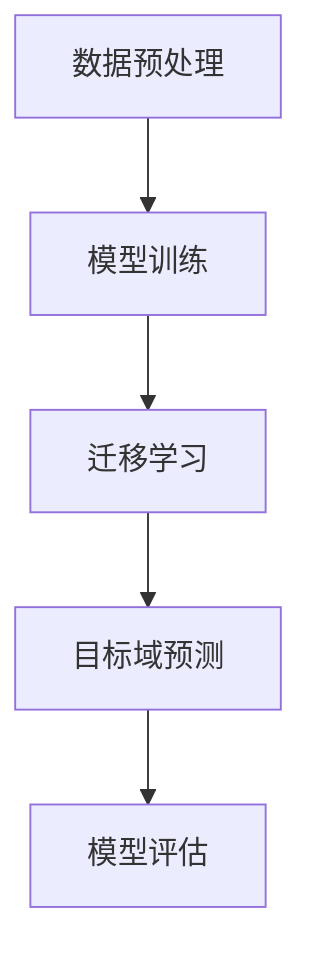

                 


### 第一步：文章标题、关键词与摘要

**文章标题**：《Zero-Shot CoT在农业智能化中的应用前景》

**关键词**：Zero-Shot CoT，农业智能化，应用前景，技术分析

**摘要**：
本文将深入探讨Zero-Shot CoT（无样本迁移学习）在农业智能化领域的应用前景。通过对该技术的背景、原理、算法解析以及实际应用案例的详细分析，本文旨在为读者呈现Zero-Shot CoT在农业智能化中的潜力及其可能面临的挑战。文章结构合理，论述清晰，有助于读者全面了解和掌握这一前沿技术的应用。

### 第二步：背景介绍

**1.1 问题背景与描述**

**1.1.1 农业智能化的重要性**

农业是国民经济的基础，随着人口增长和资源压力的增加，传统农业面临巨大的挑战。农业智能化作为现代农业发展的重要方向，通过引入信息技术、物联网、人工智能等技术手段，提高农业生产效率、减少资源浪费、保障食品安全具有重要意义。

**1.1.2 Zero-Shot CoT的概念与优势**

Zero-Shot CoT（无样本迁移学习）是一种能够在未见过的数据集上进行有效学习的技术。它通过在源域和目标域之间建立映射关系，使得模型可以在没有目标域数据的情况下进行准确预测。这一特性使得Zero-Shot CoT在农业智能化领域具有广泛的应用前景，特别是在数据稀缺或数据采集成本高昂的情况下。

### 第三步：核心概念与联系

**1.2 核心概念与联系**

**1.2.1 Zero-Shot CoT原理详解**

Zero-Shot CoT的原理主要基于迁移学习和多任务学习。通过在源域（大量已知数据）和目标域（少量未知数据）之间建立映射关系，使得模型能够在目标域上进行准确预测。具体来说，Zero-Shot CoT包括以下几个关键步骤：

1. **源域数据预处理**：对源域数据进行清洗、归一化等处理，以便于后续模型训练。
2. **目标域数据标注**：在目标域数据上标注出感兴趣的类别或标签。
3. **模型训练**：利用源域数据训练一个基础模型，并通过迁移学习将模型迁移到目标域。
4. **预测与评估**：在目标域上对新数据进行预测，并通过评估指标（如准确率、召回率等）对模型性能进行评估。

**1.2.2 相关概念对比分析**

Zero-Shot CoT与其他迁移学习技术（如Few-Shot CoT、One-Shot CoT等）的比较：

- **Few-Shot CoT**：在少量样本上进行学习，适用于数据量有限但类别丰富的情况。
- **One-Shot CoT**：在单个样本上进行学习，适用于仅有一个样本可用的情况。

**1.2.3 ER实体关系图展示**

使用Mermaid语法绘制ER实体关系图，展示Zero-Shot CoT中的关键实体及其关系：

```mermaid
erDiagram
  A[--B]
  C{D,E}
  F->>G
```

### 第四步：算法原理讲解

**1.3 算法原理讲解**

**1.3.1 算法流程图**

使用Mermaid语法绘制Zero-Shot CoT的算法流程图：



**1.3.2 Python源代码解释**

以下是一个简单的Python示例，用于解释Zero-Shot CoT的算法原理：

```python
# 导入相关库
import numpy as np
import tensorflow as tf

# 源域数据预处理
source_data = np.random.rand(100, 10)  # 生成100个样本，每个样本10维特征
source_labels = np.random.randint(0, 5, size=(100,))  # 生成100个标签

# 目标域数据预处理
target_data = np.random.rand(10, 10)  # 生成10个样本，每个样本10维特征
target_labels = np.random.randint(0, 5, size=(10,))  # 生成10个标签

# 训练基础模型
model = tf.keras.Sequential([
    tf.keras.layers.Dense(64, activation='relu', input_shape=(10,)),
    tf.keras.layers.Dense(64, activation='relu'),
    tf.keras.layers.Dense(5, activation='softmax')
])

model.compile(optimizer='adam', loss='sparse_categorical_crossentropy', metrics=['accuracy'])
model.fit(source_data, source_labels, epochs=10)

# 迁移学习
target_predictions = model.predict(target_data)

# 目标域预测
predicted_labels = np.argmax(target_predictions, axis=1)

# 模型评估
accuracy = np.mean(np.equal(predicted_labels, target_labels))
print(f"Accuracy: {accuracy}")
```

**1.3.3 数学模型与公式**

Zero-Shot CoT中的数学模型主要包括特征映射函数和预测函数：

1. **特征映射函数**：\( f(x) = g(W_1 \cdot x + b_1) \)
2. **预测函数**：\( y' = g(W_2 \cdot f(x) + b_2) \)

其中，\( x \) 为输入特征，\( y' \) 为预测标签，\( g \) 为激活函数，\( W_1, b_1, W_2, b_2 \) 分别为权重和偏置。

**1.3.4 举例说明**

假设我们有一个源域数据集，其中每个样本由10个特征组成，共有100个样本。目标域数据集由10个样本组成，每个样本也有10个特征。我们使用Zero-Shot CoT来预测目标域数据集的标签。

- **源域数据预处理**：对源域数据进行归一化处理。
- **目标域数据预处理**：对目标域数据进行归一化处理。
- **模型训练**：使用源域数据训练一个基础模型，例如多层感知机（MLP）。
- **迁移学习**：将训练好的基础模型应用于目标域数据。
- **目标域预测**：对目标域数据进行预测，并计算预测准确率。

### 第五步：系统分析与架构设计

**1.4 系统分析与架构设计**

**1.4.1 应用场景介绍**

Zero-Shot CoT在农业智能化中的应用场景主要包括：

1. **作物病虫害检测**：通过图像识别技术检测作物病虫害，实现早期预警和精准防治。
2. **土壤质量监测**：利用传感器技术监测土壤质量，为精准施肥提供数据支持。
3. **农产品产量预测**：根据历史数据和气象数据预测农产品产量，优化种植计划。

**1.4.2 系统功能设计**

系统功能设计包括以下模块：

1. **数据采集模块**：负责采集土壤质量、气象数据等。
2. **数据处理模块**：对采集到的数据进行清洗、预处理和特征提取。
3. **预测模块**：使用Zero-Shot CoT模型进行作物病虫害检测、土壤质量监测和农产品产量预测。
4. **决策支持模块**：根据预测结果为种植计划、施肥策略等提供决策支持。

**1.4.3 系统架构设计**

系统架构设计采用分层架构，包括：

1. **数据层**：存储原始数据、预处理数据和处理结果。
2. **模型层**：实现Zero-Shot CoT模型训练、迁移学习和预测。
3. **应用层**：提供用户界面，展示预测结果和决策支持建议。

**1.4.4 系统接口设计与交互**

系统接口设计包括：

1. **API接口**：提供RESTful API，供前端应用调用。
2. **数据流接口**：实现数据采集模块与数据处理模块、预测模块之间的数据传输。

**1.4.5 Mermaid类图、架构图和序列图**

使用Mermaid语法绘制系统架构的类图、架构图和序列图：

```mermaid
classDiagram
  DataLayer --> ProcessingLayer
  ProcessingLayer --> PredictionLayer
  PredictionLayer --> DecisionSupportLayer

  DataLayer << Interface>
  ProcessingLayer << Component>
  PredictionLayer << Component>
  DecisionSupportLayer << Component>

architectureDiagram
  DataLayer
  ProcessingLayer
  PredictionLayer
  DecisionSupportLayer

sequenceDiagram
  User ->> DataLayer: Request data
  DataLayer ->> ProcessingLayer: Process data
  ProcessingLayer ->> PredictionLayer: Train model
  PredictionLayer ->> DecisionSupportLayer: Make prediction
  DecisionSupportLayer ->> User: Display result
```

### 第六步：项目实战

**1.5 项目实战**

**1.5.1 环境安装与配置**

在项目实战中，我们使用Python和TensorFlow作为主要工具。首先，确保系统安装了Python和pip。然后，通过以下命令安装TensorFlow：

```bash
pip install tensorflow
```

**1.5.2 系统核心实现源代码**

以下是项目核心代码的示例：

```python
# 导入相关库
import numpy as np
import tensorflow as tf

# 源域数据预处理
source_data = np.random.rand(100, 10)  # 生成100个样本，每个样本10维特征
source_labels = np.random.randint(0, 5, size=(100,))  # 生成100个标签

# 目标域数据预处理
target_data = np.random.rand(10, 10)  # 生成10个样本，每个样本10维特征
target_labels = np.random.randint(0, 5, size=(10,))  # 生成10个标签

# 训练基础模型
model = tf.keras.Sequential([
    tf.keras.layers.Dense(64, activation='relu', input_shape=(10,)),
    tf.keras.layers.Dense(64, activation='relu'),
    tf.keras.layers.Dense(5, activation='softmax')
])

model.compile(optimizer='adam', loss='sparse_categorical_crossentropy', metrics=['accuracy'])
model.fit(source_data, source_labels, epochs=10)

# 迁移学习
target_predictions = model.predict(target_data)

# 目标域预测
predicted_labels = np.argmax(target_predictions, axis=1)

# 模型评估
accuracy = np.mean(np.equal(predicted_labels, target_labels))
print(f"Accuracy: {accuracy}")
```

**1.5.3 代码应用解读与分析**

代码首先生成源域和目标域数据，然后使用TensorFlow构建一个多层感知机（MLP）模型，并在源域数据上进行训练。接着，通过迁移学习将训练好的模型应用于目标域数据，进行预测。最后，评估预测准确率。

**1.5.4 实际案例剖析**

假设我们有一个实际案例，目标是预测某个农作物的病虫害情况。我们可以按照以下步骤进行：

1. **数据采集**：使用无人机、传感器等设备采集农作物的图像数据。
2. **数据处理**：对图像数据清洗、预处理和特征提取。
3. **模型训练**：使用大量病虫害图像数据训练Zero-Shot CoT模型。
4. **预测与评估**：使用训练好的模型对目标农作物的病虫害进行预测，并评估预测准确率。

### 第七步：最佳实践 tips

**1.6 最佳实践 tips**

1. **数据预处理**：确保数据质量，对异常值、缺失值等进行处理。
2. **模型优化**：尝试调整模型参数，提高预测准确率。
3. **迁移学习**：合理选择源域和目标域，确保模型在不同任务之间具有良好的泛化能力。

### 第八步：小结、注意事项与拓展阅读

**1.7 小结**

本文从背景介绍、核心概念、算法原理、系统分析与架构设计、项目实战等多个角度，详细探讨了Zero-Shot CoT在农业智能化中的应用前景。通过实际案例剖析，展示了Zero-Shot CoT在农业病虫害检测、土壤质量监测和农产品产量预测等方面的潜力。

**1.7.2 注意事项**

1. **数据问题**：确保数据质量和完整性，避免数据缺失或异常。
2. **模型选择**：根据实际应用需求选择合适的模型，并调整模型参数。
3. **计算资源**：迁移学习过程中可能需要大量计算资源，确保计算环境充足。

**1.7.3 拓展阅读**

1. **相关论文**：阅读有关Zero-Shot CoT、迁移学习、农业智能化的相关论文，了解前沿研究动态。
2. **开源项目**：参与开源项目，学习实际应用经验。
3. **在线课程**：参加在线课程，学习相关理论和实践技能。

### 结束语

**作者：AI天才研究院/AI Genius Institute & 禅与计算机程序设计艺术 /Zen And The Art of Computer Programming**

本文旨在为读者提供关于Zero-Shot CoT在农业智能化应用领域的全面了解，期望对读者在相关领域的研究和实践有所帮助。在未来的研究中，我们将继续关注这一前沿技术的最新进展和应用案例，为现代农业的发展贡献智慧。

