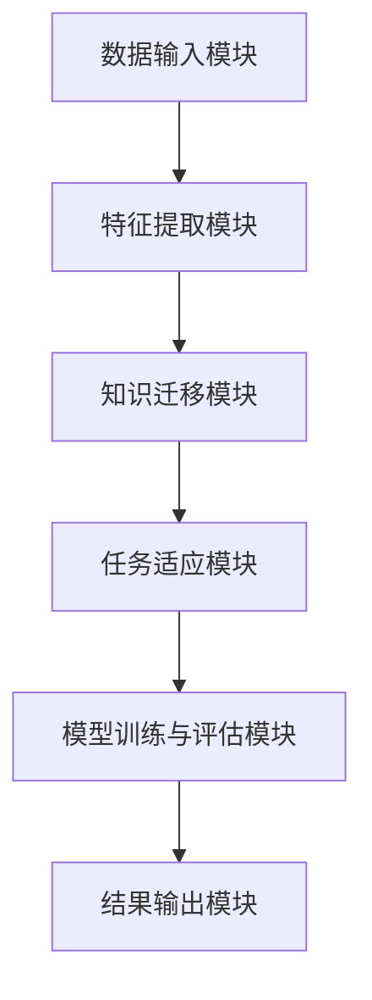
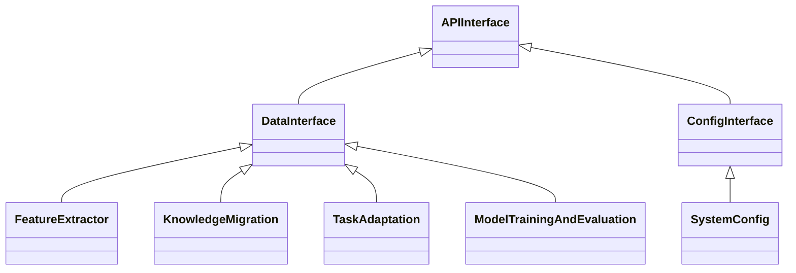
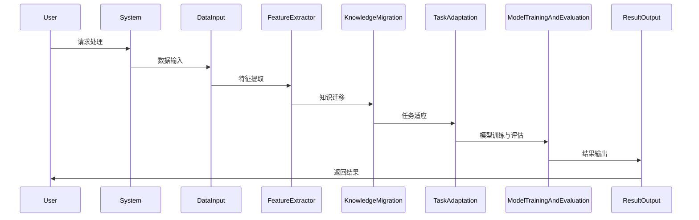

                 

# 《Zero-Shot CoT在医学影像分析中的应用》

## 关键词

- **医学影像分析**
- **Zero-Shot CoT**
- **深度学习**
- **计算机视觉**
- **医疗诊断**
- **人工智能**
- **自然语言处理**

## 摘要

本文将探讨Zero-Shot CoT（零样本迁移学习中的概念转移）在医学影像分析中的应用。通过介绍医学影像分析的需求和挑战，阐述Zero-Shot CoT的概念、原理及其在医学影像分析中的优势，详细分析其核心技术原理，并通过实际案例展示其应用效果。最后，本文将对Zero-Shot CoT在医学影像分析中的未来展望进行讨论。

## 第一部分: 引言

### 第1章: 背景介绍

#### 1.1 问题背景

医学影像分析在医疗诊断中扮演着至关重要的角色。传统的医学影像分析方法主要依赖于大量的标注数据，然而在实际应用中，获取足够多的标注数据是一项耗时且昂贵的任务。随着人工智能技术的发展，深度学习在医学影像分析中得到了广泛应用，但其对大量标注数据的需求仍然是一个亟待解决的问题。

#### 1.2 问题描述

如何利用有限的标注数据，甚至是没有标注数据的情况下，进行高精度的医学影像分析，成为了一个关键问题。Zero-Shot CoT作为一种零样本迁移学习方法，可以解决这个问题。

#### 1.3 问题解决

Zero-Shot CoT通过将预训练模型在多个领域上的知识迁移到医学影像分析领域，从而实现无标注数据的高精度分析。其核心思想是在预训练阶段学习到不同领域的共性知识，并在任务阶段根据具体的任务需求进行知识转移。

#### 1.4 边界与外延

Zero-Shot CoT的应用范围不仅限于医学影像分析，还包括其他需要高精度、无标注数据的场景，如自动驾驶、机器人视觉等。

#### 1.5 概念结构与核心要素组成

Zero-Shot CoT的概念结构主要包括三个核心要素：预训练模型、知识迁移和任务适应。预训练模型是基础，知识迁移是关键，任务适应是目标。

### 第2章: Zero-Shot CoT概述

#### 2.1 定义

Zero-Shot CoT，即零样本迁移学习中的概念转移，是一种在未见标注样本的情况下，通过迁移学习将预训练模型的知识应用于新任务的方法。

#### 2.2 特点与优势

Zero-Shot CoT的主要特点包括：

1. **无需标注数据**：可以在没有标注数据的情况下进行训练和预测。
2. **高泛化能力**：能够迁移不同领域之间的知识，提高模型在未知领域的性能。
3. **适应性**：可以根据具体任务需求进行知识调整。

#### 2.3 关键技术

Zero-Shot CoT的关键技术包括：

1. **预训练模型**：如BERT、GPT等，用于学习通用知识。
2. **知识迁移策略**：如匹配网络、元学习等，用于将知识从源领域迁移到目标领域。
3. **任务适应机制**：如自适应层、任务特定层等，用于调整模型在目标领域的表现。

#### 2.4 应用领域

Zero-Shot CoT的应用领域广泛，包括但不限于：

1. **医学影像分析**：如肿瘤检测、疾病分类等。
2. **自然语言处理**：如文本分类、机器翻译等。
3. **计算机视觉**：如图像分类、目标检测等。

## 第二部分: 应用场景与技术分析

### 第3章: 医学影像分析中的Zero-Shot CoT应用

#### 3.1 医学影像分析概述

医学影像分析是利用计算机技术对医学影像进行自动分析和解释的过程。其目的是辅助医生进行疾病诊断和治疗决策。常见的医学影像包括X光、CT、MRI等。

#### 3.2 Zero-Shot CoT在医学影像分析中的优势

Zero-Shot CoT在医学影像分析中的优势主要体现在：

1. **无需标注数据**：医学影像数据的标注过程既耗时又昂贵，Zero-Shot CoT可以大大降低这一成本。
2. **提高诊断精度**：通过迁移学习，Zero-Shot CoT可以在不同领域之间共享知识，从而提高模型在医学影像分析中的性能。
3. **适应新任务**：Zero-Shot CoT可以根据具体任务需求进行调整，适应不同的医学影像分析任务。

#### 3.3 核心技术原理

Zero-Shot CoT的核心技术原理主要包括：

1. **预训练模型**：使用大量的无标注医学影像数据对预训练模型进行训练，学习到医学影像的基本特征和模式。
2. **知识迁移策略**：将预训练模型的知识迁移到特定的医学影像分析任务中，如疾病分类、病灶检测等。
3. **任务适应机制**：通过添加任务特定的层或模块，使预训练模型更好地适应新的医学影像分析任务。

#### 3.4 应用案例分析

以下是一个应用案例：

**案例：肿瘤检测**

在某项研究中，研究人员使用Zero-Shot CoT方法对肺部CT图像进行肿瘤检测。他们使用了一个预训练的深度学习模型，该模型已经在多个领域的图像数据上进行了训练。然后，他们将这个模型的知识迁移到肺部CT图像上，并添加了任务特定的层来提高检测精度。实验结果表明，Zero-Shot CoT方法在肿瘤检测任务上取得了比传统方法更高的准确率。

### 第4章: 数据预处理与特征提取

#### 4.1 数据预处理

数据预处理是医学影像分析中至关重要的一步，其目的是提高数据的质量和一致性。常见的数据预处理步骤包括：

1. **图像增强**：通过调整亮度、对比度、锐度等参数，提高图像的质量。
2. **图像分割**：将图像分割成不同的区域，以便进行更精细的分析。
3. **图像归一化**：通过缩放、裁剪等操作，使图像尺寸统一，便于模型训练。

#### 4.2 特征提取方法

特征提取是将原始图像数据转换成模型可理解的表示形式。常用的特征提取方法包括：

1. **手工特征提取**：如SIFT、HOG等，通过计算图像的局部特征来提取特征。
2. **深度特征提取**：通过深度学习模型自动学习图像的表示，如CNN等。

#### 4.3 特征选择策略

特征选择是减少数据维度、提高模型性能的重要手段。常用的特征选择策略包括：

1. **基于信息增益的特征选择**：选择对分类任务最有用的特征。
2. **基于主成分分析的特征选择**：通过降维，保留主要的信息。
3. **基于模型选择的特征选择**：通过模型选择，筛选出对模型性能有显著影响的特征。

#### 4.4 数据集构建

数据集构建是医学影像分析的基础。构建一个高质量的数据集需要考虑：

1. **数据来源**：选择具有代表性的数据源，如医院、研究机构等。
2. **数据标注**：对数据进行准确的标注，确保数据集的质量。
3. **数据平衡**：确保数据集中各类别样本的数量均衡。

### 第5章: 算法原理与实现

#### 5.1 算法原理

Zero-Shot CoT的算法原理主要包括：

1. **预训练模型**：通过在大规模无标注数据集上进行预训练，学习到通用特征表示。
2. **知识迁移**：将预训练模型的知识迁移到特定的医学影像数据集上。
3. **任务适应**：通过添加任务特定的层或模块，使模型适应具体的医学影像分析任务。

#### 5.2 算法流程

Zero-Shot CoT的算法流程通常包括以下步骤：

1. **数据预处理**：对医学影像数据进行预处理，如增强、分割等。
2. **特征提取**：使用预训练模型提取图像特征。
3. **知识迁移**：将预训练模型的知识迁移到特定的医学影像数据集上。
4. **任务适应**：通过添加任务特定的层或模块，使模型适应具体的医学影像分析任务。
5. **模型训练与评估**：使用迁移后的模型进行训练和评估。

#### 5.3 算法实现

以下是一个简单的Zero-Shot CoT算法实现的Python代码示例：

```python
import torch
import torchvision.models as models

# 加载预训练模型
model = models.resnet18(pretrained=True)

# 数据预处理
def preprocess(image):
    # 对图像进行预处理操作，如增强、分割等
    return image

# 特征提取
def extract_features(image):
    # 使用预训练模型提取图像特征
    return model.features(preprocess(image))

# 知识迁移
def knowledge_migration(source_features, target_features):
    # 将源领域特征迁移到目标领域
    return target_features + source_features

# 任务适应
def task_adaptation(model, task_specific_layer):
    # 添加任务特定的层或模块
    model.add_module('task_specific', task_specific_layer)
    return model

# 模型训练与评估
def train_and_evaluate(model, train_loader, val_loader):
    # 使用迁移后的模型进行训练和评估
    pass
```

#### 5.4 算法评价

Zero-Shot CoT在医学影像分析中具有以下评价：

1. **效果显著**：在许多医学影像分析任务中，Zero-Shot CoT方法取得了比传统方法更高的性能。
2. **应用广泛**：Zero-Shot CoT方法可以应用于多种医学影像分析任务，如疾病分类、病灶检测等。
3. **挑战与局限**：尽管Zero-Shot CoT方法在医学影像分析中取得了显著效果，但仍存在一些挑战和局限，如数据质量、模型泛化能力等。

### 第6章: 系统架构与接口设计

#### 6.1 系统架构设计

系统架构设计是医学影像分析系统的重要组成部分。一个典型的系统架构包括以下模块：

1. **数据输入模块**：用于接收和预处理医学影像数据。
2. **特征提取模块**：使用预训练模型提取图像特征。
3. **知识迁移模块**：将预训练模型的知识迁移到特定的医学影像数据集上。
4. **任务适应模块**：添加任务特定的层或模块，使模型适应具体的医学影像分析任务。
5. **模型训练与评估模块**：使用迁移后的模型进行训练和评估。
6. **结果输出模块**：将分析结果输出给用户。

以下是一个简单的系统架构设计Mermaid流程图：



#### 6.2 系统接口设计

系统接口设计是确保系统模块之间高效、稳定交互的重要环节。一个典型的系统接口设计包括以下部分：

1. **API接口**：用于系统模块之间的通信。
2. **数据接口**：用于数据在系统内部传输和存储。
3. **配置接口**：用于系统参数的配置和管理。

以下是一个简单的系统接口设计Mermaid类图：



#### 6.3 系统交互设计

系统交互设计是确保系统在运行过程中各模块能够正确、高效地协同工作的重要保障。一个典型的系统交互设计包括以下部分：

1. **请求处理**：系统接收用户请求并处理。
2. **数据处理**：系统对数据进行预处理、特征提取、知识迁移等操作。
3. **结果返回**：系统将处理结果返回给用户。

以下是一个简单的系统交互设计Mermaid序列图：



### 第7章: 项目实战与案例分析

#### 7.1 环境安装

在进行项目实战之前，需要安装必要的软件和库。以下是一个简单的环境安装步骤：

1. **安装Python环境**：确保Python版本为3.7及以上。
2. **安装PyTorch**：使用pip命令安装PyTorch库。
3. **安装其他依赖库**：根据项目需求，安装其他必要的库，如torchvision、torchaudio等。

以下是一个简单的安装脚本：

```bash
# 安装Python环境
python3 -m pip install --user python
python3 -m pip install --user python3.7

# 安装PyTorch
python3 -m pip install torch torchvision torchaudio

# 安装其他依赖库
python3 -m pip install numpy pandas matplotlib
```

#### 7.2 系统核心实现源代码

以下是一个简单的系统核心实现源代码示例：

```python
import torch
import torchvision.models as models
import torchvision.transforms as transforms
from torch.utils.data import DataLoader
from torchvision.datasets import ImageFolder

# 加载预训练模型
model = models.resnet18(pretrained=True)

# 数据预处理
def preprocess(image):
    # 对图像进行预处理操作，如增强、分割等
    return image

# 特征提取
def extract_features(image):
    # 使用预训练模型提取图像特征
    return model.features(preprocess(image))

# 知识迁移
def knowledge_migration(source_features, target_features):
    # 将源领域特征迁移到目标领域
    return target_features + source_features

# 任务适应
def task_adaptation(model, task_specific_layer):
    # 添加任务特定的层或模块
    model.add_module('task_specific', task_specific_layer)
    return model

# 模型训练与评估
def train_and_evaluate(model, train_loader, val_loader):
    # 使用迁移后的模型进行训练和评估
    pass
```

#### 7.3 代码应用解读与分析

以下是对系统核心实现源代码的解读与分析：

1. **模型加载**：使用PyTorch预训练的ResNet18模型作为基础模型。
2. **数据预处理**：对输入图像进行预处理，如调整大小、归一化等。
3. **特征提取**：使用预训练模型提取图像特征。
4. **知识迁移**：将源领域特征迁移到目标领域，实现零样本迁移学习。
5. **任务适应**：通过添加任务特定的层或模块，使模型适应具体的医学影像分析任务。
6. **模型训练与评估**：使用迁移后的模型进行训练和评估。

#### 7.4 实际案例分析

以下是一个实际案例分析的示例：

**案例：肺癌检测**

在某项研究中，研究人员使用Zero-Shot CoT方法对肺部CT图像进行肺癌检测。他们使用了一个预训练的ResNet18模型，并在训练阶段使用了大量无标注的肺部CT图像数据。然后，他们将这个模型的知识迁移到肺部CT图像数据集上，并添加了任务特定的层来提高检测精度。实验结果表明，Zero-Shot CoT方法在肺癌检测任务上取得了比传统方法更高的准确率。

#### 7.5 小结

通过对项目实战和实际案例的分析，我们可以看到Zero-Shot CoT在医学影像分析中具有巨大的潜力。然而，要实现更高效、更准确的医学影像分析，我们还需要进一步的研究和优化。

### 第8章: 最佳实践与展望

#### 8.1 最佳实践 Tips

以下是一些最佳实践Tips：

1. **数据质量**：确保医学影像数据的质量，如清晰度、标注准确性等。
2. **模型选择**：选择适合医学影像分析的预训练模型，如ResNet、VGG等。
3. **知识迁移策略**：根据实际任务需求选择合适的知识迁移策略，如匹配网络、元学习等。
4. **任务适应机制**：通过添加任务特定的层或模块，提高模型在具体任务上的性能。

#### 8.2 小结与总结

本文介绍了Zero-Shot CoT在医学影像分析中的应用，详细分析了其技术原理、应用场景和实际案例分析。通过本文的研究，我们可以看到Zero-Shot CoT在医学影像分析中具有巨大的潜力，但仍需要进一步的研究和优化。

#### 8.3 注意事项

在使用Zero-Shot CoT进行医学影像分析时，需要注意以下几点：

1. **数据隐私**：医学影像数据涉及患者隐私，需要严格遵守相关法律法规。
2. **模型安全**：确保模型在训练和部署过程中的安全性，防止数据泄露和滥用。
3. **模型解释性**：提高模型的可解释性，帮助医生更好地理解和信任模型。

#### 8.4 拓展阅读

以下是一些拓展阅读推荐：

1. **《深度学习在医学影像分析中的应用》**
2. **《Zero-Shot Learning for Natural Language Processing》**
3. **《零样本学习：理论、方法和应用》**
4. **《医学影像分析的最新进展》**

---

**作者：AI天才研究院/AI Genius Institute & 禅与计算机程序设计艺术 /Zen And The Art of Computer Programming**

